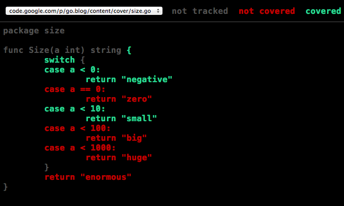

+++
title = "封面故事"
weight = 2
date = 2023-05-18T17:03:08+08:00
type = "docs"
description = ""
isCJKLanguage = true
draft = false
+++

# The cover story - 封面故事

> 原文：[https://go.dev/blog/cover](https://go.dev/blog/cover)

Rob Pike
2 December 2013

## Introduction 简介

From the beginning of the project, Go was designed with tools in mind. Those tools include some of the most iconic pieces of Go technology such as the documentation presentation tool [godoc](https://go.dev/cmd/godoc), the code formatting tool [gofmt](https://go.dev/cmd/gofmt), and the API rewriter [gofix](https://go.dev/cmd/fix). Perhaps most important of all is the [`go` command](https://go.dev/cmd/go), the program that automatically installs, builds, and tests Go programs using nothing more than the source code as the build specification.

从项目的一开始，Go的设计就考虑到了工具。这些工具包括Go技术中一些最具代表性的部分，如文档展示工具godoc、代码格式化工具gofmt和API重写器gofix。也许最重要的是go命令，这是一个自动安装、构建和测试Go程序的程序，只用源代码作为构建规范。

The release of Go 1.2 introduces a new tool for test coverage that takes an unusual approach to the way it generates coverage statistics, an approach that builds on the technology laid down by godoc and friends.

Go 1.2的发布引入了一个新的测试覆盖率工具，它采用了一种不同寻常的方式来生成覆盖率统计，这种方式是建立在godoc和朋友们所奠定的技术基础上。

## Support for tools 对工具的支持

First, some background: What does it mean for a [language to support good tooling](https://go.dev/talks/2012/splash.article#TOC_17.)? It means that the language makes it easy to write good tools and that its ecosystem supports the construction of tools of all flavors.

首先，一些背景。一种语言支持好的工具是什么意思？这意味着该语言使编写好的工具变得容易，其生态系统支持各种类型的工具的构建。

There are a number of properties of Go that make it suitable for tooling. For starters, Go has a regular syntax that is easy to parse. The grammar aims to be free of special cases that require complex machinery to analyze.

Go有许多特性使其适合于工具化。首先，Go有一个易于解析的常规语法。语法的目的是不存在需要复杂机器来分析的特殊情况。

Where possible, Go uses lexical and syntactic constructs to make semantic properties easy to understand. Examples include the use of upper-case letters to define exported names and the radically simplified scoping rules compared to other languages in the C tradition.

在可能的情况下，Go使用词法和句法结构来使语义属性易于理解。例子包括使用大写字母来定义导出的名称，以及与C传统的其他语言相比，彻底简化的范围规则。

Finally, the standard library comes with production-quality packages to lex and parse Go source code. They also include, more unusually, a production-quality package to pretty-print Go syntax trees.

最后，标准库配备了具有生产质量的软件包，用于lex和解析Go源代码。更不寻常的是，他们还包括一个生产质量的包，用于漂亮地打印Go语法树。

These packages in combination form the core of the gofmt tool, but the pretty-printer is worth singling out. Because it can take an arbitrary Go syntax tree and output standard-format, human-readable, correct code, it creates the possibility to build tools that transform the parse tree and output modified but correct and easy-to-read code.

这些包的组合构成了gofmt工具的核心，但pretty-printer值得单独提出来。因为它可以接受任意的 Go 语法树并输出标准格式的、人类可读的、正确的代码，它为建立工具创造了可能，这些工具可以转换解析树并输出经过修改的、正确的、易于阅读的代码。

One example is the gofix tool, which automates the rewriting of code to use new language features or updated libraries. Gofix let us make fundamental changes to the language and libraries in the [run-up to Go 1.0](https://blog.golang.org/the-path-to-go-1), with the confidence that users could just run the tool to update their source to the newest version.

其中一个例子是gofix工具，它可以自动重写代码以使用新的语言特性或更新的库。Gofix让我们在Go1.0之前对语言和库进行了根本性的改变，并且相信用户只需运行该工具就可以将他们的源代码更新到最新版本。

Inside Google, we have used gofix to make sweeping changes in a huge code repository that would be almost unthinkable in the other languages we use. There’s no need any more to support multiple versions of some API; we can use gofix to update the entire company in one operation.

在谷歌内部，我们使用gofix对一个巨大的代码库进行了全面的修改，这在我们使用的其他语言中几乎是不可想象的。不再需要支持一些API的多个版本；我们可以用gofix在一次操作中更新整个公司。

It’s not just these big tools that these packages enable, of course. They also make it easy to write more modest programs such as IDE plugins, for instance. All these items build on each other, making the Go environment more productive by automating many tasks.

当然，这些软件包所实现的不仅仅是这些大工具。它们还使编写更多的适度程序变得容易，比如说IDE插件。所有这些项目都是相互依存的，通过自动化许多任务，使Go环境更有生产力。

## Test coverage 测试覆盖率

Test coverage is a term that describes how much of a package’s code is exercised by running the package’s tests. If executing the test suite causes 80% of the package’s source statements to be run, we say that the test coverage is 80%.

测试覆盖率是一个术语，它描述了一个包的代码有多少是通过运行该包的测试来锻炼的。如果执行测试套件导致包的源语句的80%被运行，我们说测试覆盖率是80%。

The program that provides test coverage in Go 1.2 is the latest to exploit the tooling support in the Go ecosystem.

Go 1.2中提供测试覆盖率的程序是利用Go生态系统中的工具支持的最新方案。

The usual way to compute test coverage is to instrument the binary. For instance, the GNU [gcov](http://gcc.gnu.org/onlinedocs/gcc/Gcov.html) program sets breakpoints at branches executed by the binary. As each branch executes, the breakpoint is cleared and the target statements of the branch are marked as ‘covered’.

计算测试覆盖率的通常方法是对二进制文件进行检测。例如，GNU gcov程序在二进制程序执行的分支处设置断点。当每个分支执行时，断点被清除，该分支的目标语句被标记为 "覆盖"。

This approach is successful and widely used. An early test coverage tool for Go even worked the same way. But it has problems. It is difficult to implement, as analysis of the execution of binaries is challenging. It also requires a reliable way of tying the execution trace back to the source code, which can also be difficult, as any user of a source-level debugger can attest. Problems there include inaccurate debugging information and issues such as in-lined functions complicating the analysis. Most important, this approach is very non-portable. It needs to be done afresh for every architecture, and to some extent for every operating system since debugging support varies greatly from system to system.

这种方法是成功的，并且被广泛使用。一个早期的Go测试覆盖工具甚至以同样的方式工作。但它也有问题。它很难实现，因为分析二进制文件的执行情况很有挑战性。它还需要一种可靠的方法将执行跟踪与源代码联系起来，这也是很困难的，任何使用源代码级调试器的用户都可以证明。这方面的问题包括不准确的调试信息和内联函数等问题使分析复杂化。最重要的是，这种方法是非常不可移植的。它需要对每个架构重新进行调试，在某种程度上也需要对每个操作系统进行调试，因为各个系统的调试支持有很大的不同。

It does work, though, and for instance if you are a user of gccgo, the gcov tool can give you test coverage information. However If you’re a user of gc, the more commonly used Go compiler suite, until Go 1.2 you were out of luck.

但它确实有效，例如，如果您是gccgo的用户，gcov工具可以给您测试覆盖率信息。然而，如果您是gc的用户，也就是更常用的Go编译器套件的用户，在Go 1.2之前，您是没有运气的。

## Test coverage for Go Go的测试覆盖率

For the new test coverage tool for Go, we took a different approach that avoids dynamic debugging. The idea is simple: Rewrite the package’s source code before compilation to add instrumentation, compile and run the modified source, and dump the statistics. The rewriting is easy to arrange because the `go` command controls the flow from source to test to execution.

对于Go的新测试覆盖率工具，我们采取了一种不同的方法，避免了动态调试。这个想法很简单。在编译前重写包的源代码，以添加仪器，编译并运行修改后的源代码，然后转储统计数据。重写很容易安排，因为go命令控制了从源代码到测试再到执行的流程。

Here’s an example. Say we have a simple, one-file package like this:

这里有一个例子。假设我们有一个简单的、只有一个文件的包，像这样：

```go
package size

func Size(a int) string {
    switch {
    case a < 0:
        return "negative"
    case a == 0:
        return "zero"
    case a < 10:
        return "small"
    case a < 100:
        return "big"
    case a < 1000:
        return "huge"
    }
    return "enormous"
}
```

and this test:

和这个测试：

```go
package size

import "testing"

type Test struct {
    in  int
    out string
}

var tests = []Test{
    {-1, "negative"},
    {5, "small"},
}

func TestSize(t *testing.T) {
    for i, test := range tests {
        size := Size(test.in)
        if size != test.out {
            t.Errorf("#%d: Size(%d)=%s; want %s", i, test.in, size, test.out)
        }
    }
}
```

To get the test coverage for the package, we run the test with coverage enabled by providing the `-cover` flag to `go` `test`:

为了获得包的测试覆盖率，我们通过向go test提供-cover标志来运行测试，并启用覆盖率：

```shell linenums="1"
% go test -cover
PASS
coverage: 42.9% of statements
ok      size    0.026s
%
```

Notice that the coverage is 42.9%, which isn’t very good. Before we ask how to raise that number, let’s see how that was computed.

请注意，覆盖率是42.9%，这并不是很好。在我们问如何提高这个数字之前，让我们看看这个数字是如何计算出来的。

When test coverage is enabled, `go` `test` runs the "cover" tool, a separate program included with the distribution, to rewrite the source code before compilation. Here’s what the rewritten `Size` function looks like:

当测试覆盖率被启用时，go test运行 "cover "工具，这是一个单独的程序，包含在发行版中，在编译前重写源代码。下面是重写后的Size函数的样子：

```go
func Size(a int) string {
    GoCover.Count[0] = 1
    switch {
    case a < 0:
        GoCover.Count[2] = 1
        return "negative"
    case a == 0:
        GoCover.Count[3] = 1
        return "zero"
    case a < 10:
        GoCover.Count[4] = 1
        return "small"
    case a < 100:
        GoCover.Count[5] = 1
        return "big"
    case a < 1000:
        GoCover.Count[6] = 1
        return "huge"
    }
    GoCover.Count[1] = 1
    return "enormous"
}
```

Each executable section of the program is annotated with an assignment statement that, when executed, records that that section ran. The counter is tied to the original source position of the statements it counts through a second read-only data structure that is also generated by the cover tool. When the test run completes, the counters are collected and the percentage is computed by seeing how many were set.

程序的每个可执行部分都有一个赋值语句的注释，当执行时，记录该部分的运行。计数器通过第二个只读数据结构与它所统计的语句的原始源位置联系在一起，这个数据结构也是由cover工具生成的。当测试运行完成后，计数器被收集起来，通过查看被设置的数量来计算出百分比。

Although that annotating assignment might look expensive, it compiles to a single "move" instruction. Its run-time overhead is therefore modest, adding only about 3% when running a typical (more realistic) test. That makes it reasonable to include test coverage as part of the standard development pipeline.

尽管这个注释赋值看起来很昂贵，但它只编译成一条 "移动 "指令。因此它的运行时间开销不大，在运行一个典型的（更现实的）测试时，只增加了大约3%。这使得将测试覆盖作为标准开发管道的一部分是合理的。

## Viewing the results 查看结果

The test coverage for our example was poor. To discover why, we ask `go` `test` to write a "coverage profile" for us, a file that holds the collected statistics so we can study them in more detail. That’s easy to do: use the `-coverprofile` flag to specify a file for the output:

我们的例子的测试覆盖率很差。为了找出原因，我们要求go test为我们写一个 "覆盖率简介"，这个文件保存了收集到的统计数据，以便我们能更详细地研究它们。这很容易做到：使用 -coverprofile 标志来指定一个输出文件：

```shell linenums="1"
% go test -coverprofile=coverage.out
PASS
coverage: 42.9% of statements
ok      size    0.030s
%
```

(The `-coverprofile` flag automatically sets `-cover` to enable coverage analysis.) The test runs just as before, but the results are saved in a file. To study them, we run the test coverage tool ourselves, without `go` `test`. As a start, we can ask for the coverage to be broken down by function, although that’s not going to illuminate much in this case since there’s only one function:

(-coverprofile标志会自动设置-cover，以启用覆盖率分析)。测试的运行和之前一样，但结果被保存在一个文件中。为了研究这些结果，我们自己运行测试覆盖率工具，而不去测试。作为开始，我们可以要求按功能分解覆盖率，尽管在本例中这并不能说明什么，因为只有一个功能：

```shell linenums="1"
% go tool cover -func=coverage.out
size.go:    Size          42.9%
total:      (statements)  42.9%
%
```

A much more interesting way to see the data is to get an HTML presentation of the source code decorated with coverage information. This display is invoked by the `-html` flag:

一个更有趣的方法是用覆盖率信息对源代码进行HTML展示。这种显示是由-html标志调用的：

```shell linenums="1"
$ go tool cover -html=coverage.out
```

When this command is run, a browser window pops up, showing the covered (green), uncovered (red), and uninstrumented (grey) source. Here’s a screen dump:

当这个命令运行时，会弹出一个浏览器窗口，显示覆盖的（绿色）、未覆盖的（红色）和未检测的（灰色）源代码。下面是一个屏幕转储：



With this presentation, it’s obvious what’s wrong: we neglected to test several of the cases! And we can see exactly which ones they are, which makes it easy to improve our test coverage.

通过这个演示，很明显，什么地方出了问题：我们忽略了对几个案例的测试！而且我们可以看到到底是哪些案例。而且我们可以准确地看到是哪些案例，这样就很容易提高我们的测试覆盖率。

## Heat maps 热图

A big advantage of this source-level approach to test coverage is that it’s easy to instrument the code in different ways. For instance, we can ask not only whether a statement has been executed, but how many times.

这种源码级的测试覆盖率方法的一大优势是，很容易以不同的方式对代码进行测试。例如，我们不仅可以问一个语句是否被执行，而且可以问多少次。

The `go` `test` command accepts a `-covermode` flag to set the coverage mode to one of three settings:

go test命令接受一个-covermode标志，将覆盖率模式设置为三种设置之一：

- set: did each statement run? set：每个语句是否运行？
- count: how many times did each statement run? count：每个语句运行了多少次？
- atomic: like count, but counts precisely in parallel programs atomic：和count一样，但在并行程序中精确计数。

The default is ‘set’, which we’ve already seen. The `atomic` setting is needed only when accurate counts are required when running parallel algorithms. It uses atomic operations from the [sync/atomic](https://go.dev/pkg/sync/atomic/) package, which can be quite expensive. For most purposes, though, the `count` mode works fine and, like the default `set` mode, is very cheap.

默认是 "set"，我们已经看过了。只有在运行并行算法时需要精确计数时才需要原子设置。它使用sync/atomic包中的原子操作，这可能是相当昂贵的。不过，对于大多数用途来说，计数模式工作得很好，而且和默认的设置模式一样，非常便宜。

Let’s try counting statement execution for a standard package, the `fmt` formatting package. We run the test and write out a coverage profile so we can present the information nicely afterwards.

让我们试试对一个标准包，即fmt格式化包的语句执行进行计数。我们运行测试并写出覆盖率简介，这样我们就可以在事后很好地展示这些信息。

```shell linenums="1"
% go test -covermode=count -coverprofile=count.out fmt
ok      fmt 0.056s  coverage: 91.7% of statements
%
```

That’s a much better test coverage ratio than for our previous example. (The coverage ratio is not affected by the coverage mode.) We can display the function breakdown:

这比我们之前的例子的测试覆盖率要好很多。(覆盖率不受覆盖模式的影响。)我们可以显示函数分解：

```shell linenums="1"
% go tool cover -func=count.out
fmt/format.go: init              100.0%
fmt/format.go: clearflags        100.0%
fmt/format.go: init              100.0%
fmt/format.go: computePadding     84.6%
fmt/format.go: writePadding      100.0%
fmt/format.go: pad               100.0%
...
fmt/scan.go:   advance            96.2%
fmt/scan.go:   doScanf            96.8%
total:         (statements)       91.7%
```

The big payoff happens in the HTML output:

最大的收获发生在HTML输出中：

```shell linenums="1"
% go tool cover -html=count.out
```

Here’s what the `pad` function looks like in that presentation:

下面是pad函数在该演示中的样子：


Notice how the intensity of the green changes. Brighter-green statements have higher execution counts; less saturated greens represent lower execution counts. You can even hover the mouse over the statements to see the actual counts pop up in a tool tip. At the time of writing, the counts come out like this (we’ve moved the counts from the tool tips to beginning-of-line markers to make them easier to show):

注意绿色的强度如何变化。绿色较亮的语句有较高的执行数；饱和度较低的绿色代表较低的执行数。您甚至可以将鼠标悬停在语句上，在工具提示中看到实际计数。在写这篇文章的时候，计数是这样的（我们已经把计数从工具提示中移到了行首标记上，以使它们更容易显示）：

```go
2933    if !f.widPresent || f.wid == 0 {
2985        f.buf.Write(b)
2985        return
2985    }
  56    padding, left, right := f.computePadding(len(b))
  56    if left > 0 {
  37        f.writePadding(left, padding)
  37    }
  56    f.buf.Write(b)
  56    if right > 0 {
  13        f.writePadding(right, padding)
  13    }
```

That’s a lot of information about the execution of the function, information that might be useful in profiling.

这是很多关于函数执行的信息，这些信息在剖析中可能是有用的。

## Basic blocks 基本块

You might have noticed that the counts in the previous example were not what you expected on the lines with closing braces. That’s because, as always, test coverage is an inexact science.

您可能已经注意到，在前面的例子中，有闭合大括号的行的计数与您预期的不一样。这是因为，和以往一样，测试覆盖率是一门不精确的科学。

What’s going on here is worth explaining, though. We’d like the coverage annotations to be demarcated by branches in the program, the way they are when the binary is instrumented in the traditional method. It’s hard to do that by rewriting the source, though, since the branches don’t appear explicitly in the source.

不过，这里发生的事情值得解释。我们希望覆盖率注释能以程序中的分支为界，就像传统方法中的二进制工具那样。不过，重写源代码是很难做到这一点的，因为这些分支并没有明确出现在源代码中。

What the coverage annotation does is instrument blocks, which are typically bounded by brace brackets. Getting this right in general is very hard. A consequence of the algorithm used is that the closing brace looks like it belongs to the block it closes, while the opening brace looks like it belongs outside the block. A more interesting consequence is that in an expression like

覆盖率注解所做的是对块进行检测，这些块通常由大括号来限定。一般来说，要做到这一点是非常困难的。所用算法的一个后果是，闭合的大括号看起来像是属于它所关闭的块，而打开的大括号看起来像是属于该块之外。一个更有趣的结果是，在一个表达式中，如

```go
f() && g()
```

there is no attempt to separately instrument the calls to `f` and `g`, Regardless of the facts it will always look like they both ran the same number of times, the number of times `f` ran.

的表达式中，并没有试图分别对f和g的调用进行检测，不管事实如何，它总是看起来它们都运行了相同的次数，即f运行的次数。

To be fair, even `gcov` has trouble here. That tool gets the instrumentation right but the presentation is line-based and can therefore miss some nuances.

平心而论，即使是gcov在这里也有问题。该工具能够正确地测量，但其表现形式是基于线条的，因此可能会错过一些细微差别。

## The big picture 大局观

That’s the story about test coverage in Go 1.2. A new tool with an interesting implementation enables not only test coverage statistics, but easy-to-interpret presentations of them and even the possibility to extract profiling information.

这就是关于Go 1.2中测试覆盖率的故事。一个具有有趣实现的新工具不仅可以实现测试覆盖率的统计，而且可以对其进行易于理解的展示，甚至可以提取剖析信息。

Testing is an important part of software development and test coverage a simple way to add discipline to your testing strategy. Go forth, test, and cover.

测试是软件开发的一个重要部分，而测试覆盖率是为您的测试策略增加纪律的一个简单方法。去吧，去测试，去覆盖。
