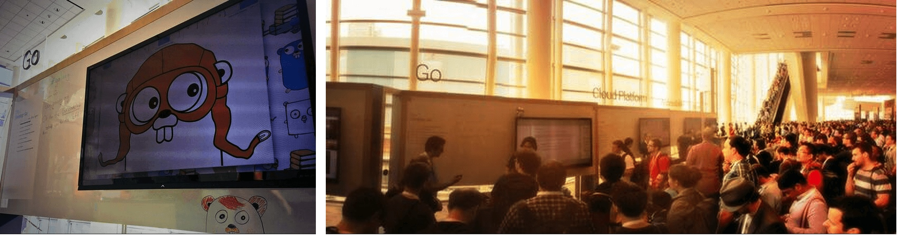

+++
title = "在Google I/O和Gopher SummerFest上的 go"
weight = 4
date = 2023-05-18T17:03:08+08:00
type = "docs"
description = ""
isCJKLanguage = true
draft = false
+++

# Go at Google I/O and Gopher SummerFest - 在Google I/O和Gopher SummerFest上的 go

> 原文：[https://go.dev/blog/io2014](https://go.dev/blog/io2014)

Francesc Campoy
6 October 2014

## Introduction 简介

The week of June 23rd was a good week for gophers in San Francisco. Go was a big part of [Google I/O](https://www.google.com/events/io) on Wednesday and Thursday, and on Monday we took advantage of the large gopher population to run the [Go SummerFest](http://www.meetup.com/golangsf/events/170421402/), a special instance of the [GoSF](http://www.meetup.com/golangsf) meetup. This blog post is a recap of both events.

6月23日这一周对旧金山的地鼠来说是个好日子。周三和周四，Go是Google I/O的重要组成部分，周一我们利用大量的地鼠人口举办了Go SummerFest，这是GoSF聚会的一个特殊实例。这篇博文是对这两次活动的回顾。

## Gopher SummerFest - Gopher夏日嘉年华

On the Monday, more than 200 gophers gathered at the Google office in San Francisco to hear a series of talks:

周一，200多名地鼠聚集在旧金山的Google办公室，听取了一系列的讲座：

- The State of Go, ([slides](https://docs.google.com/a/golang.org/file/d/0B-nws9GU_6qVQm9tdncxWnJGUTQ/edit) and [video](http://www.hakkalabs.co/articles/state-go)) by Andrew Gerrand.Andrew Gerrand的The State of Go，（幻灯片和视频）。
- I was wrong, again! ([slides](https://docs.google.com/a/golang.org/file/d/0B-nws9GU_6qVTTUwS25qaFlzMGs/edit) and [video](http://www.hakkalabs.co/articles/why-we-use-go)), by Derek Collison. 我又错了! (幻灯片和视频），作者Derek Collison。
- Go at Splice ([slides](https://docs.google.com/a/golang.org/file/d/0B-nws9GU_6qVZklnNnJITlhSbXc/edit)), by Matt Aimonetti Go在Splice（幻灯片），作者：Matt Aimonetti
- Quick testing with quick ([slides](https://docs.google.com/a/golang.org/file/d/0B-nws9GU_6qVVElmOHpwamp4aTA/edit)), by Evan Shaw 快速测试（幻灯片），作者：Evan Shaw
- Something about Go (no slides), by Blake Mizerany. 关于Go的东西（无幻灯片），作者：Blake Mizerany。

More comments and pictures from the event are available on the [meetup event page](http://www.meetup.com/golangsf/events/170421402/).

更多的评论和活动图片可以在meetup活动页面上找到。

## Go at Google I/O Go在谷歌I/O大会上

On the Wednesday and Thursday, Go was at Google I/O in two different formats: the Go booth in the sandbox area and the Go code labs available in the code lab area and all around the world through [I/O Extended](https://www.google.com/events/io/io-extended).

周三和周四，Go以两种不同的形式出现在谷歌I/O大会上：沙盘区的Go展台和代码实验室中的Go代码实验室，以及通过I/O Extended在世界各地提供的Go代码实验室。

### The Go booth - Go 展台

The Go booth was part of the Developer Sandbox area.

Go展位是开发者沙盒区的一部分。

For the two days of the conference, some gophers from Google and other companies gave a series of talks and demonstrations. The talks were not recorded, but the slides and some screencasts and blog posts will be shared soon.

在会议的两天里，来自谷歌和其他公司的一些地鼠进行了一系列的会谈和演示。这些会谈没有被记录下来，但幻灯片和一些截屏以及博客文章将很快被分享。

- Organizing Go Code, by David Crawshaw. ([slides](https://go.dev/talks/2014/organizeio.slide#1)) 组织Go代码，作者David Crawshaw。(幻灯片)
- Testing Techniques, by Andrew Gerrand. ([video](https://www.youtube.com/watch?v=ndmB0bj7eyw) and [slides](https://go.dev/talks/2014/testing.slide#1)) 测试技术，作者：Andrew Gerrand。(视频和幻灯片)
- Go for Java Developers, by Francesc Campoy. ([slides](https://go.dev/talks/2014/go4java.slide#1)) 面向Java开发者的Go，作者Francesc Campoy。 (幻灯片)
- Camlistore: Android, ARM, App Engine, Everywhere, by Brad Fitzpatrick. ([slides](https://go.dev/talks/2014/camlistore.slide#1))  Camlistore。Android, ARM, App Engine, Everywhere, by Brad Fitzpatrick. (幻灯片)
- Go Compilation Complexities, by Ian Lance Taylor. ([slides](https://go.dev/talks/2014/compiling.slide#1)) Go编译的复杂性，作者：Ian Lance Taylor。(幻灯片)
- SourceGraph: a Code Search Engine in Go, by Quinn Slack. ([video](https://youtu.be/-DpKaoPz8l8) and [slides](https://go-talks.appspot.com/github.com/sourcegraph/talks/google-io-2014/gio2014.slide#1)) SourceGraph：Go中的代码搜索引擎，作者：Quinn Slack。(视频和幻灯片)

We also organized Q&A sessions and lightning talks by members of the Go community:

我们还组织了问答环节和Go社区成员的闪电演讲：

- [Brad Rydzewski](https://twitter.com/bradrydzewski) talked about his project [drone.io](https://drone.io/). Brad Rydzewski谈到了他的项目drone.io。
- [Barak Michener](https://twitter.com/barakmich) presented [Cayley](https://github.com/google/cayley), an open source graph database. Barak Michener介绍了Cayley，一个开源的图形数据库。
- [Matt Aimonetti](https://twitter.com/mattetti) discussed how Go is used at [Splice](https://splice.com/). Matt Aimonetti讨论了Go在Splice的使用情况。
- [Sugu Sougoumarane](https://twitter.com/ssougou) talked about how [vitess](https://github.com/youtube/vitess) solved scalability problems at YouTube. ([video](https://youtu.be/midJ6b1LkA0)) Sugu Sougoumarane谈到了vitess如何解决YouTube的可扩展性问题。(视频)

### The Go code lab - Go代码实验室

This year attendees of Google I/O had a code lab area with self-service computers where they could sit and learn Go. The code labs were also available to anyone through the Google I/O extended brand. You can try it yourself at [io2014codelabs.appspot.com](https://io2014codelabs.appspot.com/).

今年Google I/O的与会者有一个代码实验室区，有自助式电脑，他们可以坐在那里学习Go。通过谷歌I/O的扩展品牌，任何人都可以使用代码实验室。您可以在io2014codelabs.appspot.com上自己尝试。

## Conclusion 总结

Thanks to the organizers, speakers, and attendees who helped make these events a great success. See you next year. (Or at [dotGo](http://dotgo.eu/) this week!)

感谢帮助使这些活动取得巨大成功的组织者、演讲者和与会者。明年见。(或者在本周的dotGo！）。
