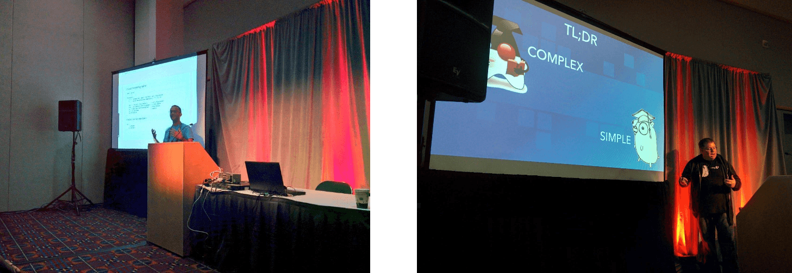
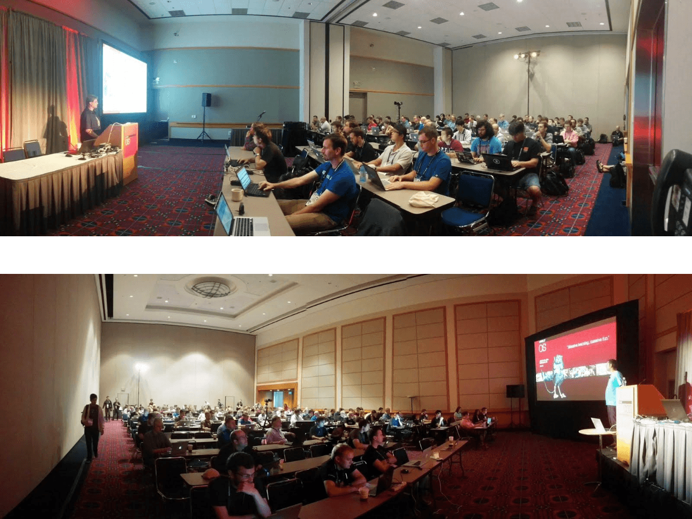
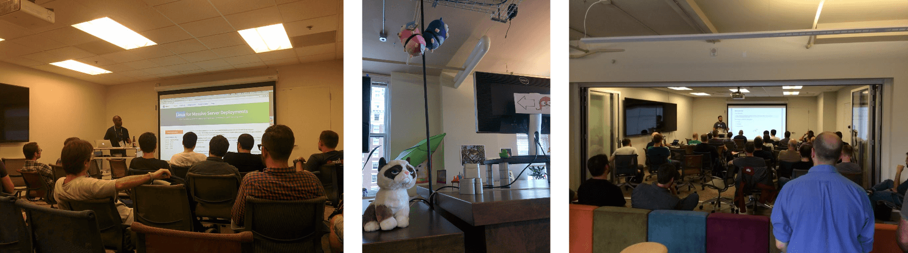
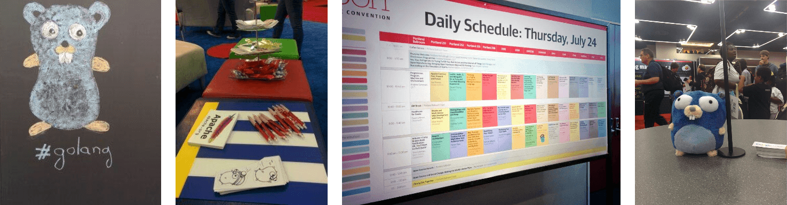

+++
title = "在 OSCON上的 go"
weight = 7
date = 2023-05-18T17:03:08+08:00
type = "docs"
description = ""
isCJKLanguage = true
draft = false
+++

# Go at OSCON  - 在 OSCON上的 go

> 原文：[https://go.dev/blog/osconreport](https://go.dev/blog/osconreport)

Francesc Campoy
20 August 2014

## Introduction 简介

What happens in Portland in July? [OSCON](http://www.oscon.com/oscon2014)! At this year’s conference, Go was more present than ever before, with five talks, two workshops, a [Birds of a Feather](http://en.wikipedia.org/wiki/Birds_of_a_feather_(computing)) session, and a meetup.

7月在波特兰会发生什么？OSCON! 在今年的会议上，Go比以往任何时候都更受欢迎，有五场讲座，两个研讨会，一个Birds of a Feather会议，以及一个聚会。

## Talks 讲座

[Matt Stine](http://twitter.com/mstine) talked about his experience switching from Java to Go with [A recovering Java developer learns Go](http://www.slideshare.net/mstine/java-devlearnstogooscon) while [Steve Francia](https://twitter.com/spf13) presented [Painless Data Storage with MongoDB and Go](http://spf13.com/presentation/MongoDB-and-Go). Steve also presented [Go for Object Oriented Programmers](http://spf13.com/presentation/go-for-object-oriented-programmers), where he explained how some object oriented concepts can be implemented in Go.

Matt Stine在《一个正在恢复的Java开发者学习Go》中谈到了他从Java转向Go的经历，而Steve Francia则介绍了使用MongoDB和Go的无痛数据存储。Steve还介绍了Go for Object Oriented Programmers，他解释了一些面向对象的概念如何在Go中实现。

Finally, [Josh Bleecher Snyder](http://twitter.com/offbymany) talked about his experience writing tools to work with Go source code in [Gophers with hammers](https://go.dev/talks/2014/hammers.slide#1), and [Francesc Campoy](http://twitter.com/francesc) talked about all the things that could have gone wrong and what the Go team did to prevent them [Inside the Go playground](https://go.dev/talks/2014/playground.slide).

最后，Josh Bleecher Snyder谈到了他在Gophers with hammers中编写工具来处理Go源代码的经验，Francesc Campoy谈到了所有可能出错的事情以及Go团队在Go操场内部所做的预防工作。

## Workshops 研讨会

At the beginning of OSCON’s workshop day, Steve Francia presented how to build a web application and a CLI tool during [Getting started with Go](http://spf13.com/presentation/first-go-app) to a big room full of Gophers.

在OSCON研讨会日的开始，Steve Francia在《Go入门》中向一屋子的Gophers介绍了如何建立一个网络应用程序和一个CLI工具。

In the afternoon, [Chris McEniry](https://twitter.com/mmceniry) gave his [Quick introduction to system tools programming with Go](http://cdn.oreillystatic.com/en/assets/1/event/115/A Quick Introduction to System Tools Programming with Go Presentation.pdf) where he went over some useful skills to write system tools using Go and its standard library.

下午，Chris McEniry做了Go系统工具编程的快速介绍，他介绍了一些使用Go及其标准库编写系统工具的有用技巧。

## Additional events 其他活动

To take advantage of the increased Gopher population in Portland during OSCON, we organized two extra events: the first [PDXGolang](https://twitter.com/pdxgolang) meetup and a [Birds of a Feather session](http://www.oscon.com/oscon2014/public/schedule/detail/37775).

为了利用OSCON期间波特兰的Gopher人口增加的机会，我们组织了两个额外的活动：第一次PDXGolang聚会和Birds of a Feather会议。

At the meetup Francesc Campoy talked about [Go Best Practices](https://go.dev/talks/2013/bestpractices.slide) and [Kelsey Hightower](https://twitter.com/kelseyhightower) gave a great introduction to [Kubernetes](https://github.com/GoogleCloudPlatform/kubernetes), a container management system for clusters written in Go by Google. If you live in Portland, make sure you [join the group](http://meetup.com/pdx-go) and come along to the next meeting.

在见面会上，Francesc Campoy谈到了Go的最佳实践，Kelsey Hightower对Kubernetes做了很好的介绍，这是一个由Google用Go编写的集群容器管理系统。如果您住在波特兰，一定要加入这个小组并参加下一次会议。

The "Birds of a Feather" (or, more aptly, "Gophers of a Feather") was a lot of fun for everyone involved. We hope to see more of you there next year.

"百鸟朝凤"（或者更贴切地说，"百鸟朝凤"）对每个参与者来说都是非常有趣的。我们希望明年能在那里看到您们更多的人。

## In conclusion 总而言之

Thanks to all the gophers that participated in OSCON. After the successes of this year we look forward to more Go fun at OSCON 2015.

感谢所有参加OSCON的地鼠们。在今年的成功之后，我们期待着在2015年的OSCON上有更多的地鼠乐趣。
