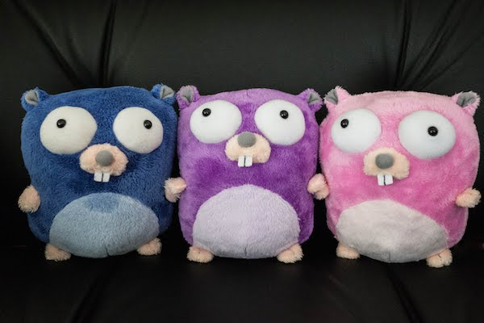
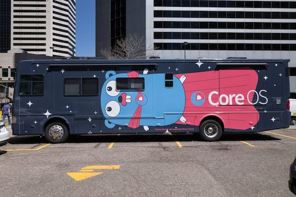

+++
title = "GopherCon 2014总结"
weight = 11
date = 2023-05-18T17:03:08+08:00
type = "docs"
description = ""
isCJKLanguage = true
draft = false
+++

# GopherCon 2014 Wrap Up - GopherCon 2014总结

https://go.dev/blog/gophercon

Andrew Gerrand
28 May 2014

In April this year 700 gophers descended upon Denver to attend [GopherCon](http://www.gophercon.com/), the world’s first large-scale Go conference, organized entirely by the community. The three day event featured 24 talks and one panel discussion in a single track over two days, followed by an informal "hack day" full of code, conversation, and more than 4 hours (!) of lightning talks.

今年4月，700名地鼠来到丹佛参加GopherCon，这是世界上第一次大规模的Go会议，完全由社区组织。在为期三天的活动中，有24个讲座和一个小组讨论，在两天的时间里，有一个非正式的 "黑客日"，充满了代码、对话和超过4小时（！）的闪电讲座。

A [complete set of video recordings](http://confreaks.com/events/gophercon2014) is now available (the [slides are here](https://github.com/gophercon/2014-talks)).

一套完整的视频记录现在已经可以获得（幻灯片在这里）。

Two keynotes framed the conference:

两场主题演讲是会议的框架：

- Rob Pike’s opening talk ["Hello, Gophers!"](https://www.youtube.com/watch?v=VoS7DsT1rdM) ([slides](https://go.dev/talks/2014/hellogophers.slide)) discusses the history of Go by walking through two of the first Go programs. Rob Pike的开幕演讲 "您好，Gophers！" (幻灯片）通过走访两个最早的Go程序讨论了Go的历史。
- Andrew Gerrand’s closing talk ["Go for gophers"](https://www.youtube.com/watch?v=dKGmK_Z1Zl0) ([slides](https://go.dev/talks/2014/go4gophers.slide)) explains the Go design philosophy through the lens of his personal experience learning the language. Andrew Gerrand的闭幕演讲 "Go for gophers"（幻灯片）通过他学习Go语言的个人经历来解释Go的设计理念。

One talk that resonated with members of the Go team was Peter Bourgon’s ["Best practices for Production Environments"](https://www.youtube.com/watch?v=Y1-RLAl7iOI) ([notes](http://peter.bourgon.org/go-in-production/)). From deployment to dependency management, it answers many frequently asked questions about Go use in the real world and is a must-see for anyone serious about building systems in Go.

有一个讲座引起了Go团队成员的共鸣，那就是Peter Bourgon的 "生产环境的最佳实践"（笔记）。从部署到依赖项管理，它回答了许多关于Go在现实世界中使用的常见问题，是任何认真用Go构建系统的人的必看之作。

But, really, you should just [watch them all](http://confreaks.com/events/gophercon2014). They’re great.

但实际上，您应该把它们都看完。他们都很棒。

The Go Gopher was everywhere. Each attendee received one of the new pink and purple gophers, which now accompany the original blue one:

Go Gopher无处不在。每个与会者都收到了一个新的粉红色和紫色的地鼠，它们现在与原来的蓝色地鼠一起。

The gopher was also seen wearing a cape on the side of the incredible [CoreOS](https://coreos.com/) bus:

在令人难以置信的CoreOS巴士上，人们也看到了穿着斗篷的地鼠：

Most of the Go team were at the conference, and we were moved by the passion and dedication of the Go community. It was a thrill to see the many different ways people are using the language. It was also great to put faces to many of the names we know well through their contributions to the project.

Go团队的大部分成员都参加了这次会议，我们被Go社区的热情和奉献精神所感动。看到人们以不同的方式使用这种语言，我们感到非常兴奋。通过他们对项目的贡献，我们对许多人的名字有了了解，这也很好。

We would like to extend our thanks and congratulations to the GopherCon organizers (Brian Ketelsen and Erik St. Martin), the excellent speakers, and the tireless volunteers that pitched in to make the event such a success. We look forward to GopherCon 2015, which promises to be bigger and better still.

我们要向GopherCon的组织者（Brian Ketelsen和Erik St. Martin）、优秀的演讲者和不知疲倦的志愿者表示感谢和祝贺，他们的参与使这次活动获得了成功。我们期待着2015年的GopherCon，它有望变得更大、更好。

But if you really can’t wait, we’ll see you at [dotGo](http://www.dotgo.eu/) in Paris on the 10th of October!

但是，如果您真的等不及了，我们将在10月10日巴黎的dotGo上见到您!
