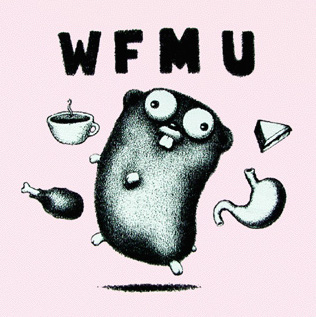
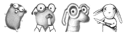
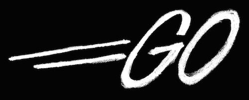
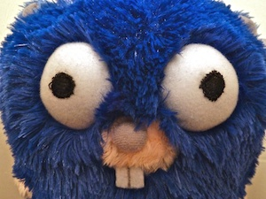
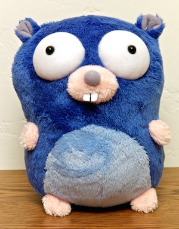
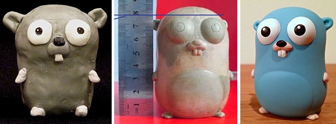

+++
title = "The Go Gopher"
weight = 12
date = 2023-05-18T17:03:08+08:00
type = "docs"
description = ""
isCJKLanguage = true
draft = false
+++

# The Go Gopher

> 原文：[https://go.dev/blog/gopher](https://go.dev/blog/gopher)

Rob Pike and Andrew Gerrand
24 March 2014

The Go gopher is an iconic mascot and one of the most distinctive features of the Go project. In this post we’ll talk about its origins, evolution, and behavior.

Go地鼠是一个标志性的吉祥物，也是Go项目中最独特的特征之一。在这篇文章中，我们将讨论它的起源、演变和行为。

About 15 years ago—long before the Go project—the gopher first appeared as a promotion for the [WFMU radio station](https://wfmu.org/) in New Jersey. [Renee French](http://reneefrench.blogspot.com/) was commissioned to design a T-shirt for an annual fundraiser and out came the gopher.

大约15年前，也就是在Go项目之前，地鼠第一次出现是为新泽西州的WFMU电台做宣传。Renee French被委托为一个年度筹款活动设计一件T恤衫，然后就出现了地鼠。

The gopher next made an appearance at Bell Labs, as Bob Flandrena’s [avatar](https://research.swtch.com/face) in the Bell Labs mail system. Other Renee drawings became avatars for ken, r, rsc, and others. (Of course, Peter Weinberger’s was his own [iconic face](http://spinroot.com/pico/pjw.html).)

地鼠接下来在贝尔实验室出现，作为Bob Flandrena的头像出现在贝尔实验室的邮件系统中。其他Renee的图画成为ken、r、rsc等人的头像。(当然，Peter Weinberger的是他自己的标志性脸孔）。

Another Bell Labs activity led to Renee creating [Glenda](https://9p.io/plan9/glenda.html), the Plan 9 mascot, a distant cousin of the WFMU gopher.

贝尔实验室的另一项活动导致Renee创造了Plan 9的吉祥物Glenda，它是WFMU地鼠的远亲。

When we started the Go project we needed a logo, and Renee volunteered to draw it. It was featured on the first Go T-shirt and the Google Code site.

当我们开始Go项目时，我们需要一个标志，Renee主动要求画这个标志。这个标志出现在第一件GoT恤衫和谷歌代码网站上。

For the open source launch in 2009, Renee suggested adapting the WFMU gopher as a mascot. And the Go gopher was born:

在2009年的开源发布会上，Renee建议将WFMU的地鼠作为吉祥物。Go gopher就这样诞生了。

(The gopher has no name, and is called just the "Go gopher".)

(地鼠没有名字，只被称为 "Go地鼠")。

For the [launch](https://www.youtube.com/watch?v=-i0hat7pdpk#t=24m40s) of the [Go App Engine runtime](https://developers.google.com/appengine/docs/go) at Google I/O 2011 we engaged [Squishable](http://squishable.com/) to manufacture the plush gophers. This was the first time the gopher was colored blue and appeared in three dimensions. The first prototype was kinda hairy:

为了在2011年谷歌I/O大会上推出Go应用引擎运行时间，我们委托Squishable公司制造毛绒地鼠。这是第一次将地鼠染成蓝色并以三维形式出现。第一个原型有点多毛：

But the second one was just right:

但第二个原型恰到好处：

Around the same time, Renee roughed out a gopher in clay. This inspired a refined sculpture that became a vinyl figurine made by [Kidrobot](http://www.kidrobot.com/). The vinyls were first distributed at OSCON 2011.

大约在同一时间，雷尼在粘土中粗制了一只地鼠。这启发了一个精致的雕塑，并成为Kidrobot公司制作的乙烯基塑像。这些乙烯制品在2011年OSCON上首次发行。

The gopher therefore exists in many forms, but has always been Renee’s creation. It stands for the Go project and Go programmers everywhere, and is one of the most popular things in the Go world.

因此，地鼠以多种形式存在，但一直是Renee的创作。它代表着Go项目和各地的Go程序员，是Go世界中最受欢迎的东西之一。

The Go gopher is a character; a unique creation. Not any old gopher, just as Snoopy is not any old cartoon dog.

Go gopher是一个人物；一个独特的创造。不是普通的地鼠，就像史努比不是普通的卡通狗一样。

The [gopher images](https://go.dev/doc/gopher/) are Creative Commons Attribution 4.0 licensed. That means you can play with the images but you must give credit to their creator (Renee French) wherever they are used.

地鼠的图片是以知识共享署名4.0许可的。这意味着您可以使用这些图片，但您必须在任何地方使用它们，并将其归功于它们的创造者（Renee French）。

Here are a few gopher adaptations that people have used as mascots for user group mascots and similar organizations.

这里有一些地鼠的改编作品，人们将其作为用户组吉祥物和类似组织的吉祥物。

They’re cute and we like them, but by the Creative Commons rules the groups should give Renee credit, perhaps as a mention on the user group web site.

它们很可爱，我们也很喜欢，但根据创作共用协议的规定，这些团体应该给Renee以荣誉，也许可以在用户组网站上提及。

The vinyl and plush gophers are copyrighted designs; accept no substitutes! But how can you get one? Their natural habitat is near high concentrations of Go programmers, and their worldwide population is growing. They may be purchased from the [Google Store](https://www.googlemerchandisestore.com/Google+Redesign/Fun/Go+Gopher+Blue+Squishable.axd?cid=1399), although the supply can be irregular. (These elusive creatures have been spotted in all [kinds](http://www.flickr.com/photos/pinkhamsters/sets/72157627910426064/) [of](https://plus.google.com/107966629974328136037/posts/TcFA9zHzQB8) [places](https://twitter.com/goroutine).)

乙烯基和毛绒地鼠的设计是有版权的；不接受任何替代物！但您如何能得到一个？但是您怎么能得到一个呢？它们的自然栖息地是在Go程序员集中的地方，而且它们在世界各地的数量正在增加。它们可以从谷歌商店购买，尽管供应可能是不定期的。(这些难以捉摸的生物已经在各种地方被发现了）。

Perhaps the best way to get a gopher is to catch one in the wild at a Go conference. There are two big chances this year: [GopherCon](http://gophercon.com/) (Denver, April 24-26) and [dotGo](http://dotgo.eu/) (Paris, October 10).

也许得到地鼠的最好办法是在Go会议上抓到一只野生的地鼠。今年有两个大的机会。GopherCon（4月24-26日，丹佛）和dotGo（10月10日，巴黎）。

*(Photo by* [*Noah Lorang*](https://twitter.com/noahhlo/status/437395572081688576)*.)*

(照片由Noah Lorang拍摄）。
