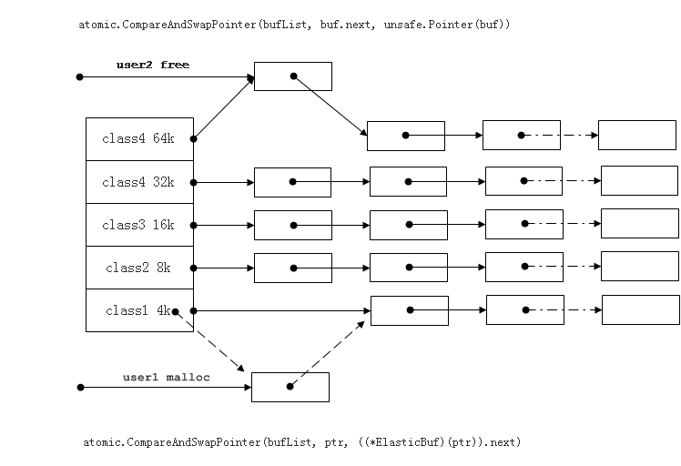

+++
title = "奇虎360与 go"
weight = 7
date = 2023-05-18T17:03:08+08:00
type = "docs"
description = ""
isCJKLanguage = true
draft = false
+++

# Qihoo 360 and Go - 奇虎360与 go

https://go.dev/blog/qihoo

Yang Zhou
6 July 2015

*This guest blog post was written by Yang Zhou, Software Engineer at Qihoo 360.*

这篇客座博文是由奇虎360的软件工程师杨舟撰写的。

[Qihoo 360](http://www.360safe.com/) is a major provider of Internet and mobile security products and services in China, and operates a major Android-based mobile distribution platform. At the end of June 2014, Qihoo had about 500 million monthly active PC Internet users and over 640 million mobile users. Qihoo also operates one of China’s most popular Internet browsers and PC search engines.

奇虎360是中国互联网和移动安全产品和服务的主要供应商，并运营着一个主要的基于安卓的移动分发平台。截至2014年6月底，奇虎公司拥有约5亿月活跃PC互联网用户和超过6.4亿移动用户。奇虎还运营着中国最受欢迎的互联网浏览器和PC搜索引擎之一。

My team, the Push Service Team, provides fundamental messaging services for more than 50 products across the company (both PC and mobile), including thousands of Apps in our open platform.

我的团队，即推送服务团队，为全公司50多个产品（包括PC和移动）提供基本的信息服务，包括我们开放平台中的数千个应用程序。

Our "love affair" with Go dates back to 2012 when we first attempted to provide push services for one of Qihoo’s products. The initial version was built with nginx + lua + redis, which failed to satisfy our requirement for real-time performance due to excessive load. Under these circumstances, the newly-published Go 1.0.3 release came to our attention. We completed a prototype in a matter of weeks, largely thanks to the goroutine and channel features it provided.

我们与Go的 "情缘 "可以追溯到2012年，当时我们首次尝试为奇虎的一款产品提供推送服务。最初的版本是用nginx+lua+redis构建的，由于负载过大，未能满足我们对实时性能的要求。在这种情况下，新发布的Go 1.0.3版本引起了我们的注意。我们在几周内就完成了一个原型，这主要归功于它提供的goroutine和channel功能。

Initially, our Go-based system ran on 20 servers, with 20 million real-time connections in total. The system sent 2 million messages a day. That system now runs on 400 servers, supporting 200 million+ real-time connections. It now sends over 10 billion messages daily.

最初，我们基于Go的系统在20台服务器上运行，总共有2000万个实时连接。该系统每天发送200万条信息。该系统现在运行在400台服务器上，支持2亿多的实时连接。它现在每天发送超过100亿条信息。

With rapid business expansion and increasing application needs for our push service, the initial Go system quickly reached its bottleneck: heap size went up to 69G, with maximum garbage collection (GC) pauses of 3-6 seconds. Worse still, we had to reboot the system every week to release memory. It wouldn’t be honest if we didn’t consider relinquishing Go and instead, re-writing the entire core component with C. However, things didn’t go exactly as we planned, we ran into trouble migrating the code of Business Logic Layer. As a result, it was impossible for the only personnel at that time (myself) to maintain the Go system while ensuring the logic transfer to the C service framework.

随着业务的快速扩张和我们推送服务的应用需求不断增加，最初的Go系统很快就达到了瓶颈：堆大小上升到69G，最大的垃圾收集（GC）暂停时间为3-6秒。更糟糕的是，我们不得不每周重启系统以释放内存。如果我们不考虑放弃Go，而是用C语言重新编写整个核心组件，那就太不诚实了。然而，事情并没有完全按照我们的计划进行，我们在迁移业务逻辑层的代码时遇到了麻烦。结果，对于当时唯一的人员（我自己）来说，在保证逻辑转移到C语言服务框架的同时，不可能维护Go系统。

Therefore, I made the decision to stay with Go system (probably the wisest one I had to make), and great headway was made soon enough.

因此，我决定继续使用Go系统（这可能是我做出的最明智的决定），并很快取得了巨大的进展。

Here are a few tweaks we made and key take-aways:

以下是我们所做的一些调整和关键的收获：

- Replace short connections with persistent ones (using a connection pool), to reduce creation of buffers and objects during communication.用持久性连接取代短连接（使用连接池），以减少通信过程中缓冲区和对象的创建。
- Use Objects and Memory pools appropriately, to reduce the load on the GC.适当地使用对象和内存池，以减少GC的负载。

- Use a Task Pool, a mechanism with a group of long-lived goroutines consuming global task or message queues sent by connection goroutines, to replace short-lived goroutines.使用任务池（Task Pool），这是一种机制，由一组长寿的goroutine消耗全局任务或由连接goroutine发送的消息队列，以取代短寿的goroutine。
- Monitor and control goroutine numbers in the program. The lack of control can cause unbearable burden on the GC, imposed by surges in goroutines due to uninhibited acceptance of external requests, as RPC invocations sent to inner servers may block goroutines recently created.监控和控制程序中的goroutine数量。缺乏控制会给GC带来难以承受的负担，这是由于无限制地接受外部请求而导致的goroutine的激增，因为发送给内部服务器的RPC调用可能会阻塞最近创建的goroutine。
- Remember to add [read and write deadlines](https://go.dev/pkg/net/#Conn) to connections when under a mobile network; otherwise, it may lead to goroutine blockage. Apply it properly and with caution when under a LAN network, otherwise your RPC communication efficiency will be hurt.在移动网络下，记得给连接添加读写期限；否则，可能会导致goroutine阻塞。在局域网下，要正确谨慎地应用它，否则您的RPC通信效率会受到影响。
- Use Pipeline (under Full Duplex feature of TCP) to enhance the communication efficiency of RPC framework.使用管道（在TCP的全双工功能下）来提高RPC框架的通信效率。

As a result, we successfully launched three iterations of our architecture, and two iterations of our RPC framework even with limited human resources. This can all attributed to the development convenience of Go. Below you can find the up-to-date system architecture:

因此，即使在人力资源有限的情况下，我们成功地推出了三个迭代的架构，以及两个迭代的RPC框架。这都可以归功于Go的开发便利性。下面您可以看到最新的系统架构：

The continuous improvement journey can be illustrated by a table:

持续改进的历程可以用一个表格来说明：

Also, no temporary release of memory or system reboot is required after these optimizations.

同时，在这些优化之后，不需要临时释放内存或重启系统。

What’s more exciting is we developed an on-line real-time Visibility Platform for profiling Go programs. We can now easily access and diagnose the system status, pinning down any potential risks. Here is a screen shot of the system in action:

更令人兴奋的是我们开发了一个在线实时可视性平台，用于剖析Go程序。我们现在可以轻松地访问和诊断系统状态，确定任何潜在的风险。下面是该系统运行时的屏幕截图：

The great thing about this platform is that we can actually simulate the connection and behavior of millions of online users, by applying the Distributed Stress Test Tool (also built using Go), and observe all real-time visualized data. This allows us to evaluate the effectiveness of any optimization and preclude problems by identifying system bottlenecks.

这个平台的好处是，我们可以通过应用分布式压力测试工具（也是用Go建立的），实际模拟数百万在线用户的连接和行为，并观察所有实时可视化数据。这使我们能够评估任何优化的有效性，并通过识别系统瓶颈来排除问题。

Almost every possible system optimization has been practiced so far. And we look forward to more good news from the GC team so that we could be further relieved from heavy development work. I guess our experience may also grow obsolete one day, as Go continues to evolve.

到目前为止，几乎所有可能的系统优化都已经实践过了。我们期待着GC团队带来更多的好消息，这样我们就可以进一步从繁重的开发工作中解脱出来。我想，随着Go的不断发展，我们的经验也可能有一天会被淘汰掉。

This is why I want to conclude my sharing by extending my sincere appreciation to the opportunity to attend [Gopher China](http://gopherchina.org/). It was a gala for us to learn, to share and for offering a window showcasing Go’s popularity and prosperity in China. Many other teams within Qihoo have already either got to know Go, or tried to use Go.

这就是为什么我想在分享的最后，对有机会参加Gopher China表示衷心的感谢。这是一个学习、分享的盛会，为我们提供了一个展示Go在中国的普及和繁荣的窗口。奇虎公司的许多其他团队已经了解了Go，或者尝试使用Go。

I am convinced that many more Chinese Internet firms will join us in re-creating their system in Go and the Go team’s efforts will benefit more developers and enterprises in the foreseeable future.

我相信，在可预见的未来，会有更多的中国互联网公司加入我们，用Go重新创建他们的系统，而Go团队的努力将使更多的开发者和企业受益。
