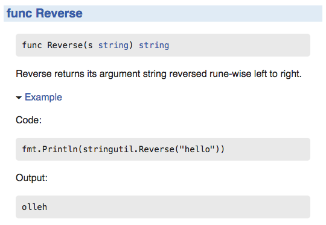

+++
title = "Go 中的可测试实例"
weight = 9
date = 2023-05-18T17:03:08+08:00
type = "docs"
description = ""
isCJKLanguage = true
draft = false
+++

# Testable Examples in Go - Go 中的可测试实例

> 原文：[https://go.dev/blog/examples](https://go.dev/blog/examples)

Andrew Gerrand
7 May 2015

## Introduction 简介

Godoc [examples](https://go.dev/pkg/testing/#hdr-Examples) are snippets of Go code that are displayed as package documentation and that are verified by running them as tests. They can also be run by a user visiting the godoc web page for the package and clicking the associated "Run" button.

Godoc例子是Go代码的片段，作为包的文档显示，并通过运行它们作为测试来验证。用户也可以通过访问软件包的godoc网页并点击相关的 "运行 "按钮来运行它们。

Having executable documentation for a package guarantees that the information will not go out of date as the API changes.

为包提供可执行的文档可以保证信息不会因为API的变化而过时。

The standard library includes many such examples (see the [`strings` package](https://go.dev/pkg/strings/#Contains), for instance).

标准库包括许多这样的例子（例如，见字符串包）。

This article explains how to write your own example functions.

这篇文章解释了如何编写您自己的示例函数。

## Examples are tests 实例是测试

Examples are compiled (and optionally executed) as part of a package’s test suite.

例子作为包的测试套件的一部分被编译（也可以选择执行）。

As with typical tests, examples are functions that reside in a package’s `_test.go` files. Unlike normal test functions, though, example functions take no arguments and begin with the word `Example` instead of `Test`.

与典型的测试一样，例子是驻扎在包的 _test.go 文件中的函数。但与普通的测试函数不同的是，示例函数不需要参数，并且以Example而不是Test开头。

The [`stringutil` package](https://pkg.go.dev/golang.org/x/example/stringutil/) is part of the [Go example repository](https://cs.opensource.google/go/x/example). Here’s an example that demonstrates its `Reverse` function:

stringutil包是Go实例库的一部分。下面是一个演示其反向函数的例子：

```go
package stringutil_test

import (
    "fmt"

    "golang.org/x/example/stringutil"
)

func ExampleReverse() {
    fmt.Println(stringutil.Reverse("hello"))
    // Output: olleh
}
```

This code might live in `example_test.go` in the `stringutil` directory.

这段代码可能存在于stringutil目录下的example_test.go中。

Godoc will present this example alongside the `Reverse` function’s documentation:

Godoc将把这个例子和Reverse函数的文档放在一起：



Running the package’s test suite, we can see the example function is executed with no further arrangement from us:

运行软件包的测试套件，我们可以看到这个例子函数被执行，不需要我们进一步安排：

```shell linenums="1"
$ go test -v
=== RUN TestReverse
--- PASS: TestReverse (0.00s)
=== RUN: ExampleReverse
--- PASS: ExampleReverse (0.00s)
PASS
ok      golang.org/x/example/stringutil 0.009s
```

## Output comments 输出注释

What does it mean that the `ExampleReverse` function "passes"?

在执行例子的过程中，测试框架会捕捉写入标准输出的数据，然后将输出与例子的 "Output: "注释进行比较。如果测试的输出与它的输出注释相符，则测试通过。

As it executes the example, the testing framework captures data written to standard output and then compares the output against the example’s "Output:" comment. The test passes if the test’s output matches its output comment.

为了看到一个失败的例子，我们可以将输出注释文本改为明显不正确的内容

To see a failing example we can change the output comment text to something obviously incorrect

```go
func ExampleReverse() {
    fmt.Println(stringutil.Reverse("hello"))
    // Output: golly
}
```

and run the tests again:

并再次运行测试：

```shell linenums="1"
$ go test
--- FAIL: ExampleReverse (0.00s)
got:
olleh
want:
golly
FAIL
```

If we remove the output comment entirely

如果我们完全删除输出注释

```go
func ExampleReverse() {
    fmt.Println(stringutil.Reverse("hello"))
}
```

then the example function is compiled but not executed:

那么这个例子函数就被编译了，但没有被执行：

```shell linenums="1"
$ go test -v
=== RUN TestReverse
--- PASS: TestReverse (0.00s)
PASS
ok      golang.org/x/example/stringutil 0.009s
```

Examples without output comments are useful for demonstrating code that cannot run as unit tests, such as that which accesses the network, while guaranteeing the example at least compiles.

没有输出注释的例子对于演示不能作为单元测试运行的代码非常有用，比如访问网络的代码，同时保证例子至少可以编译。

## Example function names 实例函数名称

Godoc uses a naming convention to associate an example function with a package-level identifier.

Godoc使用了一个命名惯例，将一个示例函数与一个包级标识符联系起来。

```go
func ExampleFoo()     // documents the Foo function or type
func ExampleBar_Qux() // documents the Qux method of type Bar
func Example()        // documents the package as a whole
```

Following this convention, godoc displays the `ExampleReverse` example alongside the documentation for the `Reverse` function.

按照这个惯例，godoc在显示Reverse函数文档的同时，也显示了ExampleReverse的例子。

Multiple examples can be provided for a given identifier by using a suffix beginning with an underscore followed by a lowercase letter. Each of these examples documents the `Reverse` function:

通过使用以下划线为首的后缀和一个小写字母，可以为一个给定的标识符提供多个例子。每个例子都记录了Reverse函数。

```go
func ExampleReverse()
func ExampleReverse_second()
func ExampleReverse_third()
```

## Larger examples 更大的例子

Sometimes we need more than just a function to write a good example.

有时我们需要的不仅仅是一个函数来写一个好的例子。

For instance, to demonstrate the [`sort` package](https://go.dev/pkg/sort/) we should show an implementation of `sort.Interface`. Since methods cannot be declared inside a function body, the example must include some context in addition to the example function.

例如，为了演示排序包，我们应该展示 sort.Interface 的实现。由于方法不能在函数体内部声明，因此除了示例函数之外，示例还必须包括一些上下文。

To achieve this we can use a "whole file example." A whole file example is a file that ends in `_test.go` and contains exactly one example function, no test or benchmark functions, and at least one other package-level declaration. When displaying such examples godoc will show the entire file.

为了达到这个目的，我们可以使用一个 "整个文件的例子"。整个文件的例子是一个以_test.go结尾的文件，它正好包含一个示例函数，没有测试或基准函数，以及至少一个其他包级声明。当显示这种例子时，godoc会显示整个文件。

Here is a whole file example from the `sort` package:

下面是一个来自sort包的整个文件的例子：

```go
package sort_test

import (
    "fmt"
    "sort"
)

type Person struct {
    Name string
    Age  int
}

func (p Person) String() string {
    return fmt.Sprintf("%s: %d", p.Name, p.Age)
}

// ByAge implements sort.Interface for []Person based on
// the Age field.
type ByAge []Person

func (a ByAge) Len() int           { return len(a) }
func (a ByAge) Swap(i, j int)      { a[i], a[j] = a[j], a[i] }
func (a ByAge) Less(i, j int) bool { return a[i].Age < a[j].Age }

func Example() {
    people := []Person{
        {"Bob", 31},
        {"John", 42},
        {"Michael", 17},
        {"Jenny", 26},
    }

    fmt.Println(people)
    sort.Sort(ByAge(people))
    fmt.Println(people)

    // Output:
    // [Bob: 31 John: 42 Michael: 17 Jenny: 26]
    // [Michael: 17 Jenny: 26 Bob: 31 John: 42]
}
```

A package can contain multiple whole file examples; one example per file. Take a look at the [`sort` package’s source code](https://go.dev/src/sort/) to see this in practice.

一个包可以包含多个整个文件的例子；每个文件有一个例子。看一下sort包的源代码，看看这一点的实际情况。

## Conclusion 总结

Godoc examples are a great way to write and maintain code as documentation. They also present editable, working, runnable examples your users can build on. Use them!

Godoc例子是编写和维护代码的一个很好的方法，可以作为文档。它们还提供了可编辑、可工作、可运行的例子，您的用户可以在此基础上进行开发。使用它们吧!
