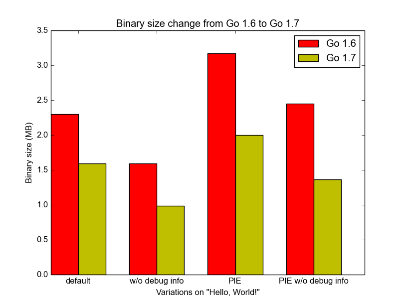

+++
title = "更小的 Go 1.7二进制文件"
weight = 6
date = 2023-05-18T17:03:08+08:00
type = "docs"
description = ""
isCJKLanguage = true
draft = false
+++

# Smaller Go 1.7 binaries - 更小的 Go 1.7二进制文件

> 原文：[https://go.dev/blog/go1.7-binary-size](https://go.dev/blog/go1.7-binary-size)

David Crawshaw
18 August 2016

## Introduction 简介

Go was designed for writing servers. That is how it is most widely used today, and as a result a lot of work on the runtime and compiler is focused on issues that matter to servers: latency, ease of deployment, precise garbage collection, fast startup time, performance.

Go是为编写服务器而设计的。这也是它今天最广泛使用的方式，因此，运行时和编译器的大量工作都集中在对服务器很重要的问题上：延迟、易于部署、精确的垃圾收集、快速启动时间、性能。

As Go gets used for a wider variety of programs, there are new issues that must be considered. One of these is binary size. It has been on the radar for a long time (issue [#6853](https://go.dev/issue/6853) was filed over two years ago), but the growing interest in using Go for deploying binaries on smaller devices — such as the Raspberry Pi or mobile devices — means it received some attention for the Go 1.7 release.

随着Go被用于更多种类的程序，有一些新的问题必须被考虑。其中之一就是二进制大小。这个问题已经存在很久了（第6853号问题是两年前提出的），但人们对使用Go在小型设备上部署二进制文件的兴趣越来越大--比如Raspberry Pi或移动设备--意味着它在Go 1.7版本中得到了一些关注。

## Work done in Go 1.7 - Go 1.7中所做的工作

Three significant changes in Go 1.7 affect binary size.

Go 1.7中的三个重大变化影响了二进制文件的大小。

The first is the new SSA backend that was enabled for AMD64 in this release. While the primary motivation for SSA was improved performance, the better generated code is also smaller. The SSA backend shrinks Go binaries by ~5%. We expect larger gains for the more RISC-like architectures like ARM and MIPS when those backends have been converted to SSA in Go 1.8.

首先是新的SSA后端，在这个版本中启用了AMD64。虽然SSA的主要动机是提高性能，但更好地生成的代码也更小。SSA后端将Go二进制文件缩小了约5%。我们预计，当ARM和MIPS等更多类似RISC的架构在Go 1.8中被转换为SSA时，这些后端将获得更大的收益。

The second change is method pruning. Until 1.6, all methods on all used types were kept, even if some of the methods were never called. This is because they might be called through an interface, or called dynamically using the reflect package. Now the compiler discards any unexported methods that do not match an interface. Similarly the linker can discard other exported methods, those that are only accessible through reflection, if the corresponding [reflection features](https://go.dev/pkg/reflect/#Value.Call) are not used anywhere in the program. That change shrinks binaries by 5–20%.

第二个变化是方法修剪。在1.6之前，所有使用过的类型上的所有方法都被保留，即使有些方法从未被调用过。这是因为它们可能通过接口被调用，或者使用reflect包动态地被调用。现在，编译器会丢弃任何不符合接口的未导出的方法。同样地，如果程序中的任何地方没有使用相应的反射功能，链接器可以丢弃其他导出的方法，即那些只能通过反射访问的方法。这一变化使二进制文件缩小了5-20%。

The third change is a more compact format for run-time type information used by the reflect package. The encoding format was originally designed to make the decoder in the runtime and reflect packages as simple as possible. By making this code a bit harder to read we can compress the format without affecting the run-time performance of Go programs. The new format shrinks Go binaries by a further 5–15%. Libraries built for Android and archives built for iOS shrink further as the new format contains fewer pointers, each of which requires dynamic relocations in position independent code.

第三个变化是反射包所使用的运行时类型信息的更紧凑的格式。编码格式最初是为了使运行时和反射包中的解码器尽可能的简单。通过让这段代码更难读，我们可以在不影响Go程序的运行时性能的情况下压缩格式。新的格式将Go二进制文件进一步缩小了5-15%。为Android构建的库和为iOS构建的档案进一步缩小，因为新格式包含更少的指针，每个指针都需要在独立位置的代码中进行动态重定位。

In addition, there were many small improvements such as improved interface data layout, better static data layout, and simplified dependencies. For example, the HTTP client no longer links in the entire HTTP server. The full list of changes can be found in issue [#6853](https://go.dev/issue/6853).

此外，还有许多小的改进，如改进界面数据布局，更好的静态数据布局，以及简化依赖关系。例如，HTTP客户端不再链接到整个HTTP服务器。完整的修改清单可以在问题#6853中找到。

## Results 结果

Typical programs, ranging from tiny toys to large production programs, are about 30% smaller when built with Go 1.7.

使用Go 1.7构建的典型程序，从小型玩具到大型生产程序，都缩小了约30%。

The canonical hello world program goes from 2.3MB to 1.6MB:

典型的hello world程序从2.3MB减少到1.6MB：

``` go
package main

import "fmt"

func main() {
    fmt.Println("Hello, World!")
}
```

When compiled without debugging information the statically linked binary is now under a megabyte.

在没有调试信息的情况下编译，静态链接的二进制文件现在不到一兆字节。



A large production program used for testing this cycle, `jujud`, went from 94MB to 67MB.

本周期用于测试的一个大型生产程序jujud，从94MB变成了67MB。

Position-independent binaries are 50% smaller.

与位置无关的二进制文件要小50%。

In a position-independent executable (PIE), a pointer in a read-only data section requires a dynamic relocation. Because the new format for type information replaces pointers by section offsets, it saves 28 bytes per pointer.

在独立于位置的可执行文件（PIE）中，只读数据部分的指针需要动态重定位。因为类型信息的新格式用区段偏移量取代了指针，所以每个指针可以节省28个字节。

Position-independent executables with debugging information removed are particularly important to mobile developers, as this is the kind of program shipped to phones. Big downloads make for a poor user experience, so the reduction here is good news.

删除了调试信息的独立于位置的可执行文件对移动开发者来说特别重要，因为这就是运到手机上的那种程序。大的下载量会带来糟糕的用户体验，所以这里的减少是个好消息。

## Future Work 未来的工作

Several changes to the run-time type information were too late for the Go 1.7 freeze, but will hopefully make it into 1.8, further shrinking programs, especially position-independent ones.

对运行时类型信息的一些修改对于Go 1.7的冻结来说已经太晚了，但希望能够进入1.8，进一步缩小程序，特别是与位置无关的程序。

These changes are all conservative, reducing binary size without increasing build time, startup time, overall execution time, or memory usage. We could take more radical steps to reduce binary size: the [upx](http://upx.sourceforge.net/) tool for compressing executables shrinks binaries by another 50% at the cost of increased startup time and potentially increased memory use. For extremely small systems (the kind that might live on a keychain) we could build a version of Go without reflection, though it is unclear whether such a restricted language would be sufficiently useful. For some algorithms in the runtime we could use slower but more compact implementations when every kilobyte counts. All of these call for more research in later development cycles.

这些变化都是保守的，在不增加构建时间、启动时间、整体执行时间或内存使用量的情况下减少二进制大小。我们可以采取更激进的措施来减少二进制文件的大小：用于压缩可执行文件的upx工具可以将二进制文件再缩小50%，代价是增加启动时间和潜在的内存使用量。对于极小的系统（可能生活在钥匙链上的那种），我们可以建立一个没有反射的Go版本，尽管目前还不清楚这样一个受限制的语言是否足够有用。对于运行时的一些算法，我们可以使用更慢但更紧凑的实现，当每一个千字节都很重要时。所有这些都需要在以后的开发周期中进行更多的研究。

To the many contributors who helped make Go 1.7 binaries smaller, thank you!

对于许多帮助Go 1.7二进制文件变小的贡献者，谢谢您们
