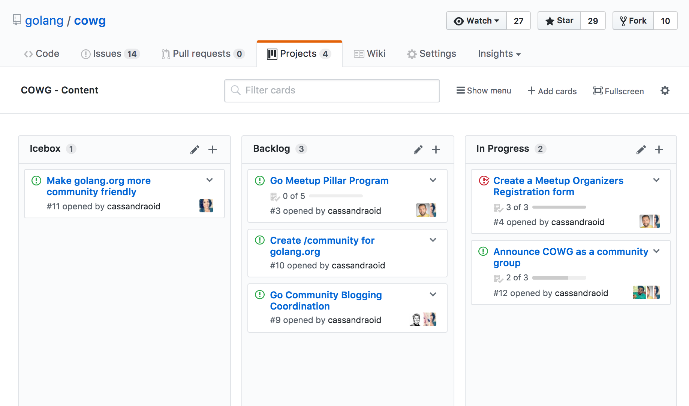

+++
title = "社区外展工作小组"
weight = 3
date = 2023-05-18T17:03:08+08:00
type = "docs"
description = ""
isCJKLanguage = true
draft = false
+++

# Community Outreach Working Group - 社区外展工作小组

> 原文：[https://go.dev/blog/cwg](https://go.dev/blog/cwg)

Steve Francia & Cassandra Salisbury
5 September 2017

## Announcing the Go Community Outreach Working Group 宣布Go社区推广工作组的成立

The Go project has grown considerably with over half a million users and community members all over the world. To date all community oriented activities have been organized by the community with minimal involvement from the Go project. We greatly appreciate these efforts.

Go项目已经有了长足的发展，世界各地的用户和社区成员超过50万。迄今为止，所有面向社区的活动都是由社区组织的，Go项目的参与度极低。我们非常感谢这些努力。

After talking to many community organizers we have heard consistent feedback that they would like better collaboration between organizers and the Go project. We are forming the Community outreach Working Group (CWG) to help support these community efforts.

在与许多社区组织者交谈后，我们听到了一致的反馈，他们希望组织者和Go项目之间有更好的合作。我们正在组建社区推广工作组（CWG），以帮助支持这些社区努力。

## The CWG Mission 工作小组的使命

The mission of the CWG is to act as a conduit between the broader Go community, it’s organizers and the Go project. The CWG will help provide the structures and community management necessary to create an online and in person community that is enjoyable and rewarding to participate in. The CWG leadership represents the Go project in these efforts.

社区推广工作组的任务是在更广泛的Go社区、组织者和Go项目之间充当一个渠道。CWG将帮助提供必要的结构和社区管理，以创建一个在线和亲自参与的社区，使之成为一个令人愉快和有益的社区。CWG的领导层在这些工作中代表Go项目。

**The CWG is responsible for:**

CWG的职责是：

- Defining programs to facilitate deeper collaboration across the community. 确定方案，促进整个社区的深入合作。
- Facilitating the coordination of Go events 促进Go活动的协调
- Establishing growth and expansion plans for the community 为社区建立增长和扩展计划
- Project exposure and accessibility 项目的曝光和可及性
- Ecosystem Development 生态系统的发展

**Leadership:**

领导层：

- [Ashley McNamara](https://twitter.com/ashleymcnamara)
- [Cassandra Salisbury](https://twitter.com/Cassandraoid)
- [Francesc Campoy](https://twitter.com/francesc)
- [Steve Francia](https://twitter.com/spf13)

## Plans for Action 行动计划

The CWG has an [open GitHub repo](https://github.com/golang/cwg) we’ve created for complete transparency of our efforts. We have various [GitHub projects](https://github.com/golang/cwg/projects) which are acting as our primary initiatives. Each project has a variety of [issues](https://github.com/golang/cwg/issues) tied to them with assignees from our Leadership team and [our members](https://github.com/golang/cwg/issues/15).

CWG有一个开放的GitHub repo，我们已经创建了一个完全透明的努力。我们有各种GitHub项目，作为我们的主要倡议。每个项目都有各种与之相关的问题，并由我们的领导团队和我们的成员负责。

If you’d like to get involved, we encourage you to comment on the issue that interests you or [submit an issue](https://github.com/golang/cwg/issues/new) yourself!

如果您想参与进来，我们鼓励您在您感兴趣的问题上发表评论，或者自己提交一个问题。
