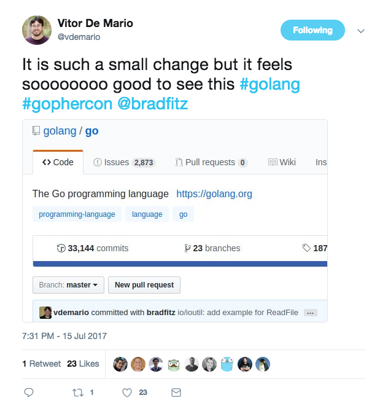
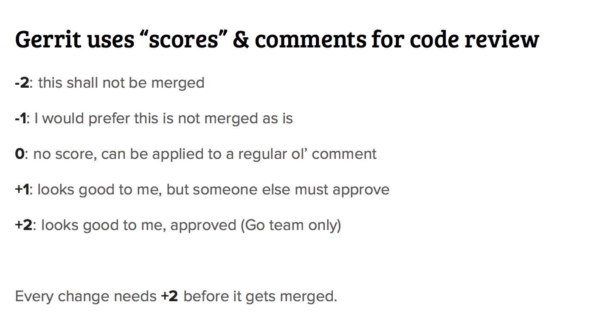
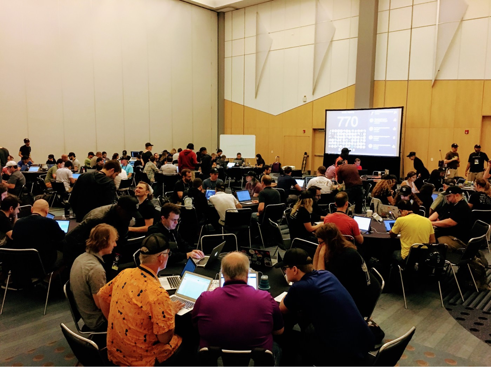
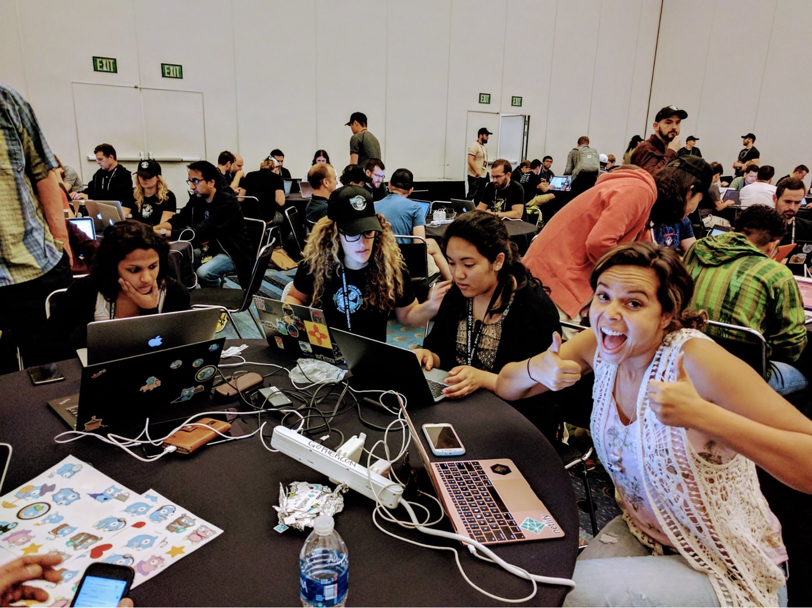

+++
title = "贡献研讨会"
weight = 5
date = 2023-05-18T17:03:08+08:00
type = "docs"
description = ""
isCJKLanguage = true
draft = false
+++

# Contribution Workshop - 贡献研讨会

> 原文：[https://go.dev/blog/contributor-workshop](https://go.dev/blog/contributor-workshop)

Steve Francia, Cassandra Salisbury, Matt Broberg, and Dmitri Shuralyov
9 August 2017

## Event Overview 活动概述

by [Steve](https://twitter.com/spf13)

作者：Steve

During the community day at GopherCon, the Go team held two workshops where we worked with people to help them make their first contribution to the Go project. This was the first time the Go project has ever attempted anything like this. We had about 140 participants and about 35 people who volunteered as mentors. Mentors not only received warm fuzzy feelings for helping others, but also a very stylish Go Mentor trucker hat. We had contributors of all ages and experience levels coming from North and South America, Africa, Europe, Asia, and Australia. It was truly a worldwide effort of Gophers coming together at GopherCon.

在GopherCon的社区日期间，Go团队举办了两场研讨会，我们与人们一起工作，帮助他们为Go项目做出第一次贡献。这是Go项目第一次尝试这样的活动。我们有大约140名参与者和大约35名自愿担任导师的人。导师们不仅得到了帮助他人的温暖感觉，而且还得到了一顶非常时尚的Go Mentor卡车帽。我们有来自南北美洲、非洲、欧洲、亚洲和澳大利亚的各种年龄和经验水平的贡献者。这确实是地鼠们在GopherCon上的一次全球努力。

One of our reasons for running the workshop was for it to act as a forcing function to make us improve our contributor experience. In preparation for the workshop, we rewrote our contributor guide, including adding a "troubleshooting" section and built a tool `go-contrib-init`, which automated the process of setting up a development environment to be able to contribute to Go.

我们举办研讨会的原因之一是，它可以作为一种强制功能，使我们改进我们的贡献者经验。为了准备这次研讨会，我们重写了我们的贡献者指南，包括增加了一个 "故障排除 "部分，并建立了一个工具go-contrib-init，它可以自动设置一个开发环境，以便能够对Go做出贡献。

For the workshop itself, we developed a presentation *"Contributing to Go,"* and a dashboard / scoreboard that was presented during the event. The scoreboard was designed to encourage us all to work together towards a common goal of seeing our collective score increase. Participants added 1, 2 or 3 points to the total score when they performed actions like registering an account, making a change list (also known as a CL, similar to a pull request), amending a CL, or submitting a CL.

对于研讨会本身，我们开发了一个 "为Go做贡献 "的演示，以及一个在活动中展示的仪表盘/记分牌。计分板的设计是为了鼓励大家一起努力实现一个共同的目标，即看到我们的集体得分增加。参与者在进行注册账户、制定变更列表（也称为CL，类似于拉动请求）、修改CL或提交CL等操作时，都会在总分上增加1、2或3分。


Brad Fitzpatrick, who stayed home from GopherCon this year, was ready and waiting to review all CLs submitted. He was so quick to review that many people thought he was an automated bot. Internally our team is now calling him "BradBot" mostly because we are in awe and a bit jealous.

布拉德-菲茨帕特里克（Brad Fitzpatrick）今年从GopherCon呆在家里，已经准备好并等待审查所有提交的CL。他的审查速度如此之快，以至于许多人认为他是一个自动机器人。在内部，我们的团队现在称他为 "BradBot"，主要是因为我们感到敬畏和有点嫉妒。


### Impact 影响

We had a total of 65 CLs submitted from the people who participated in the workshop (within a week of the workshop). Of these, 44 were from contributors who had never previously contributed to any of the repos in the Go project. Half (22) of these contributions were already merged. Many of the others are waiting on the codebase to thaw as we are in the middle of a freeze for the upcoming 1.9 release. In addition to CLs, many contributed to the project in the form of bug reports, [gardening tasks](https://go.dev/wiki/Gardening), and other types of contributions.

参加研讨会的人一共提交了65份报告（在研讨会结束后的一周内）。其中44个是来自以前从未向Go项目中的任何储存库贡献过的贡献者。这些贡献中有一半（22个）已经被合并。其他许多人正在等待代码库的解冻，因为我们正处于为即将到来的1.9版本而进行的冻结之中。除了CL之外，许多人以错误报告、园艺任务和其他类型的贡献的形式为项目做出了贡献。

The most common type of contribution was an example function to be used in the documentation. The [Go User survey](https://blog.golang.org/survey2016-results) identified that our documentation was significantly lacking examples. In the presentation, we asked users to find a package they loved and to add an example. In the Go project, examples are written as code in Go files (with specific naming) and the `go doc` tool displays them alongside the documentation. This is a perfect first contribution as it’s something that can be merged during a freeze, it’s of critical importance to our users, and it’s an addition that has a relatively narrow scope.

最常见的贡献类型是在文档中使用的函数示例。Go用户调查发现，我们的文档明显缺乏例子。在演讲中，我们要求用户找到一个他们喜欢的包并添加一个例子。在Go项目中，例子被写成Go文件中的代码（有特定的命名），go doc工具将它们显示在文档的旁边。这是第一个完美的贡献，因为它是可以在冻结期间合并的东西，它对我们的用户至关重要，而且它是一个范围相对较窄的补充。

One of the examples added is that of creating a Stringer, one of the more widely used interfaces in Go. [CL 49270](https://go.dev/cl/49270/)

增加的例子之一是创建Stringer，这是Go中使用比较广泛的接口之一。CL 49270

In addition to examples, many people contributed critical bug fixes including:

除了例子之外，许多人还贡献了关键的错误修复，包括：

- [CL 48988](https://go.dev/cl/48988/) fixing [issue #21029](https://go.dev/issue/21029)
- [CL 49050](https://go.dev/cl/49050/) fixing [issue #20054](https://go.dev/issue/20054)
- [CL 49031](https://go.dev/cl/49031/) fixing [issue #20166](https://go.dev/issue/20166)
- [CL 49170](https://go.dev/cl/49170/) fixing [issue #20877](https://go.dev/issue/20877)

Some people even surprised us by arriving with a bug in mind that they wanted to fix. Nikhita arrived ready to tackle [issue #20786](https://go.dev/issue/20786) and she did submit [CL 48871](https://go.dev/cl/48871/), after which she tweeted:

有些人甚至带着他们想要修复的问题来到这里，这让我们感到惊讶。Nikhita来到这里准备解决#20786号问题，她确实提交了CL 48871，之后她发了推特：


Not only were some great improvements made, but most importantly, we narrowed the gap between the core Go team and the broader community members. Many people on the Go team remarked that the community members were teaching them things about the Go project. People in the community (in person, and on Twitter) remarked that felt welcome to participate in the project.

不仅是一些伟大的改进，最重要的是，我们缩小了Go核心团队和更广泛的社区成员之间的差距。Go团队中的许多人说，社区成员正在教他们关于Go项目的东西。社区里的人（在现场和推特上）说，他们觉得参与这个项目很受欢迎。




### Future 未来

The event was successful well beyond our expectations. Sameer Ajmani, Go team manager said, "The contributor workshop was incredibly fun and educational–for the Go team. We cringed as users hit the rough edges in our process, and celebrated when they got up on the dashboard. The cheer when the group score hit 1000 was awesome."

这次活动的成功远远超出了我们的预期。Go团队经理Sameer Ajmani说，"贡献者研讨会对于Go团队来说是非常有趣和有教育意义的。当用户在我们的过程中遇到粗糙的边缘时，我们感到害怕，当他们在仪表板上站起来时，我们又感到庆幸。当小组得分达到1000分时，大家的欢呼声很高"。

We are looking into ways to make this workshop easier to run for future events (like meetups and conferences). Our biggest challenge is providing enough mentorship so that users feel supported. If you have any ideas or would like to help with this process please [let me know](mailto:spf@golang.org).

我们正在研究如何使这个研讨会在未来的活动（如聚会和会议）中更容易开展。我们最大的挑战是提供足够的指导，使用户感到得到支持。如果您有任何想法或愿意帮助这个过程，请让我知道。

I’ve asked a few participants of the event to share their experiences below:

我请一些活动的参与者在下面分享他们的经验：

## My Contribution Experience 我的贡献经验

by [Cassandra](https://twitter.com/cassandraoid)

作者：Cassandra

When I heard about the go-contrib workshop I was very excited and then I was extremely intimidated. I was encouraged by a member of the Go team to participate, so I thought what the heck.

当我听说go-contrib研讨会的时候，我非常兴奋，然后又非常害怕。Go团队的一位成员鼓励我参加，所以我想管他呢。

As I walked into the room (let’s be real, I ran into the room because I was running late) I was pleased to see the room was jam-packed. I looked around for people in Gopher caps, which was the main indicator they were teachers. I sat down at one of the 16 round tables that had two hats and three non-hats. Brought up my screen and was ready to roll…

当我走进房间的时候（说实话，我跑进房间是因为我迟到了），我很高兴看到房间里挤满了人。我环顾四周，寻找戴着Gopher帽子的人，这是他们是教师的主要标志。我在16张圆桌中的一张坐下，这张桌有两顶帽子和三顶非帽子。我拿起我的屏幕，准备开始工作。

Jess Frazelle stood up and started the presentation and provided the group with [a link](https://docs.google.com/presentation/d/1ap2fycBSgoo-jCswhK9lqgCIFroE1pYpsXC1ffYBCq4/edit#slide=id.p) to make it easy to follow.

杰斯-弗雷泽尔站起来，开始了演讲，并向大家提供了一个链接，以便于大家学习。


The murmurs grew from a deep undercurrent to a resounding melody of voices, people were getting their computers set up with Go, they were skipping ahead to make sure their GOPATH was set, and were… wait what’s Gerrit?

杂音从深沉的暗流发展到响亮的声音旋律，人们正在用Go设置他们的电脑，他们跳到前面以确保他们的GOPATH被设置，并且......等等，Gerrit是什么？

Most of us had to get a little intro to Gerrit. I had no clue what it was, but luckily there was a handy slide. Jess explained that it was an alternative to GitHub with slightly more advanced code review tools. We then went through GitHub vs Geritt terminology, so we had better understanding of the process.

我们中的大多数人都不得不对Gerrit做一个小小的介绍。我不知道它是什么，但幸运的是，有一张方便的幻灯片。Jess解释说，它是GitHub的一个替代品，具有更高级的代码审查工具。然后我们学习了GitHub和Gerrit的术语，这样我们就对这个过程有了更好的了解。


Ok, now it was time to become a **freaking Go contributor**.

好了，现在是时候成为一个该死的Go贡献者了。

To make this more exciting than it already is, the Go team set up a game where we could track as a group how many points we could rack up based on the Gerrit score system.

为了使这一过程更加激动人心，Go团队设置了一个游戏，我们可以作为一个小组追踪我们能在Gerrit评分系统的基础上获得多少分。



Seeing your name pop up on the board and listening to everyone’s excitement was intoxicating. It also invoked a sense of teamwork that lead to a feeling of inclusion and feeling like you were truly a part of the Go community.

看到自己的名字出现在黑板上，听着大家的兴奋声，令人陶醉。它也唤起了一种团队合作的意识，导致了一种包容的感觉，感觉您真的是Go界的一员。


In 6 steps a room of around 80 people were able to learn how to contribute to go within an hour. That’s a feat!

在6个步骤中，一个大约80人的房间能够在一个小时内学会如何为Go做贡献。这是一个壮举!

It wasn’t nearly as difficult as I anticipated and it wasn’t out of scope for a total newbie. It fostered a sense of community in an active and tangible way as well as a sense of inclusion in the illustrious process of Go contributions.

这并不像我预期的那样困难，而且对于一个完全陌生的人来说，这并没有超出范围。它以一种积极的、有形的方式培养了一种社区意识，以及在Go贡献的辉煌过程中的包容感。

I’d personally like to thank the Go Team, the Gopher mentors in hats, and my fellow participants for making it one of my most memorable moments at GopherCon.

我个人要感谢Go团队、戴着帽子的Gopher导师和我的同伴们，是他们让我成为GopherCon上最难忘的时刻之一。

## My Contribution Experience 我的贡献经历

by [Matt](https://twitter.com/mbbroberg)

作者：Matt

I’ve always found programming languages to be intimidating. It’s the code that enables the world to write code. Given the impact, surely smarter people than me should be working on it… but that fear was something to overcome. So when the opportunity to join a workshop to contribute to my new favorite programming language came up, I was excited to see how I could help. A month later, I’m now certain that anyone and everyone can (and should) contribute back to Go.

我一直认为编程语言是令人生畏的。它是使世界能够写代码的代码。鉴于其影响，肯定有比我更聪明的人在研究它......但这种恐惧是需要克服的。因此，当有机会加入一个研讨会，为我最喜欢的新编程语言做出贡献时，我很兴奋地想看看我可以如何帮助。一个月后，我现在确信任何人和每个人都可以（而且应该）为Go作出贡献。

Here are my very verbose steps to go from 0 to 2 contributions to Go:

下面是我对Go从0到2的贡献的非常冗长的步骤：

### The Setup 设置

Given Go’s use of Gerrit, I started by setting up my environment for it. [Jess Frazzelle’s guide](https://docs.google.com/presentation/d/1ap2fycBSgoo-jCswhK9lqgCIFroE1pYpsXC1ffYBCq4/edit#slide=id.g1f953ef7df_0_9) is a great place to start to not miss a step.

鉴于Go使用了Gerrit，我首先为它设置了环境。Jess Frazzelle的指南是一个不错的开始，不会错过任何一个步骤。

The real fun starts when you clone the Go repo. Ironically, you don’t hack on Go under `$GOPATH`, so I put it in my other workspace (which is `~/Develop`).

真正的乐趣是从克隆Go repo开始的。讽刺的是，您不能在$GOPATH下入侵Go，所以我把它放在我的另一个工作区（也就是~/Develop）。

```
cd $DEV # That's my source code folder outside of $GOPATH
git clone --depth 1 https://go.googlesource.com/go
```

Then install the handy dandy helper tool, `go-contrib-init`:

然后安装方便的辅助工具，go-contrib-init：

```
go get -u golang.org/x/tools/cmd/go-contrib-init
```

Now you can run `go-contrib-init` from the `go/` folder we cloned above and see whether or not we’re ready to contribute. But hold on if you’re following along, you’re not ready just yet.

现在您可以从我们上面克隆的go/文件夹中运行go-contrib-init，看看我们是否已经准备好贡献。但是，如果您正在跟随，请稍等，您还没有准备好。

Next, install `codereview` so you can participate in a Gerrit code review:

接下来，安装codereview，这样您就可以参与Gerrit代码审查了：

```
go get -u golang.org/x/review/git-codereview
```

This package includes `git change` and `git mail` which will replace your normal workflow of `git commit` and `git push` respectively.

这个软件包包括git change和git mail，它们将分别取代您正常的git commit和git push的工作流程。

Okay, installations are out of the way. Now set up your [Gerrit account here](https://go-review.googlesource.com/settings/#Profile), then [sign the CLA](https://go-review.googlesource.com/settings#Agreements) appropriate for you (I signed a personal one for all Google projects, but choose the right option for you. You can see all CLAs you’ve signed at [cla.developers.google.com/clas](https://cla.developers.google.com/clas)).

好了，安装工作已经完成了。现在在这里设置您的Gerrit账户，然后签署适合您的CLA（我为所有谷歌项目签署了一个个人CLA，但选择适合您的选项。您可以在cla.developer.google.com/clas上看到您已经签署的所有CLA）。

AND BAM. You’re good (to go)! But where to contribute?

然后砰的一声。您就可以开始工作了! 但在哪里贡献？

### Contributing 贡献

In the workshop, they sent us into the `scratch` repository, which is a safe place to fool around in order to master the workflow:

在研讨会上，他们让我们进入scratch仓库，这是个安全的地方，可以让我们在这里胡闹，以掌握工作流程：

```
cd $(go env GOPATH)/src/golang.org/x
git clone --depth 1 [[https://go.googlesource.com/scratch][go.googlesource.com/scratch]]
```

First stop is to `cd` in and run `go-contrib-init` to make sure you’re ready to contribute:

第一站是cd进去，运行go-contrib-init，以确保您准备好贡献：

```
go-contrib-init
All good. Happy hacking!
```

From there, I made a folder named after my GitHub account, did a `git add -u` then took `git change` for a spin. It has a hash that keeps track of your work, which is the one line you shouldn’t touch. Other than that, it feels just like `git commit`. Once I got the commit message matching the format of `package: description` (description begins with a lowercase), I used `git mail` to send it over to Gerrit.

在那里，我建立了一个以我的GitHub账户命名的文件夹，做了一个git add -u，然后用git change转了一下。它有一个跟踪您工作的哈希值，这是您不应该碰的一行。除此以外，它感觉就像git commit。一旦我得到了符合package: description格式的提交信息（description以小写字母开头），我就用git mail把它发给了Gerrit。

Two good notes to take at this point: `git change` also works like `git commit --amend`, so if you need to update your patch you can `add` then `change` and it will all link to the same patch. Secondly, you can always review your patch from your [personal Gerrit dashboard](https://go-review.googlesource.com/dashboard/).

在这一点上有两点值得注意：git change也像git commit --amend一样工作，所以如果您需要更新您的补丁，您可以先添加再更改，它都会链接到同一个补丁。其次，您可以随时从您的个人Gerrit仪表盘上查看您的补丁。

After a few back and forths, I officially had a contribution to Go! And if Jaana is right, it might be the first with emojis ✌️.

经过几个来回，我正式有了一个贡献给Go! 如果Jaana是对的，这可能是第一个带表情符号的✌️。


### Contributing, For Real 贡献，真正的贡献

The scratch repo is fun and all, but there’s a ton of ways to get into the depths of Go’s packages and give back. It’s at this point where I cruised around the many packages available to see what was available and interesting to me. And by "cruised around" I mean attempted to find a list of packages, then went to my source code to see what’s around under the `go/src/` folder:

Scratch repo很有趣，但有很多方法可以进入Go的包的深处，并给予回报。在这一点上，我巡视了许多可用的软件包，看看哪些是可用的，哪些是我感兴趣的。我说的 "巡视 "是指试图找到一个软件包的列表，然后到我的源代码中去看看go/src/文件夹下有什么：


I decided to see what I can do in the `regexp` package, maybe out of love and fear of regex. Here’s where I switched to the [website’s view of the package](https://godoc.org/regexp) (it’s good to know that each standard package can be found at https://godoc.org/$PACKAGENAME). In there I noticed that `QuoteMeta` was missing the same level of detailed examples other functions have (and I could use the practice using Gerrit).

我决定看看我在regexp包里能做什么，也许是出于对regex的爱和恐惧。在这里我切换到了网站的包的视图（很高兴知道每个标准包都可以在https://godoc.org/$PACKAGENAME找到）。在那里，我注意到QuoteMeta缺少与其他函数相同水平的详细例子（我可以用Gerrit来练习）。


I started looking at `go/src/regexp` to try to find where to add examples and I got lost pretty quickly. Lucky for me, [Francesc](https://twitter.com/francesc) was around that day. He walked me through how all examples are actually in-line tests in a `example_test.go` file. They follow the format of test cases followed by "Output" commented out and then the answers to the tests. For example:

我开始查看go/src/regexp，试图找到可以添加示例的地方，但我很快就迷失了方向。我很幸运，Francesc那天就在身边。他告诉我，所有的例子实际上都是example_test.go文件中的在线测试。他们遵循测试案例的格式，后面是 "输出 "的注释，然后是测试的答案。比如说：

``` go
func ExampleRegexp_FindString() {
    re := regexp.MustCompile("fo.?")
    fmt.Printf("%q\n", re.FindString("seafood"))
    fmt.Printf("%q\n", re.FindString("meat"))
    // Output:
    // "foo"
    // ""
}
```

Kind of cool, right?? I followed Francesc’s lead and added a function `ExampleQuoteMeta` and added a few I thought would be helpful. From there it’s a `git change` and `git mail` to Gerrit!

有点酷，对吗？我跟随Francesc的步伐，添加了一个函数ExampleQuoteMeta，并添加了一些我认为有帮助的内容。从那里开始，它是一个git变更和git邮件给Gerrit!

I have to say that Steve Francia challenged me to "find something that isn’t an open issue and fix it," so I included some documentation changes for QuoteMeta in my patch. It’s going to be open for a bit longer given the additional scope, but I think it’s worth it on this one.

我不得不说，Steve Francia挑战我 "找到一些不是开放性问题的东西并修复它"，所以我在我的补丁中包括了QuoteMeta的一些文档修改。考虑到额外的范围，它的开放时间要长一些，但我认为在这个问题上是值得的。

I can hear your question already: how did I verify it worked? Well it wasn’t easy to be honest. Running `go test example_test.go -run QuoteMeta -v` won’t do it since we’re working outside of our $GOPATH. I struggled to figure it out until [Kale Blakenship wrote this awesome post on testing in Go](https://medium.com/@vCabbage/go-testing-standard-library-changes-1e9cbed11339). Bookmark this one for later.

我已经听到您的问题了：我是如何验证它的工作的？说实话，这并不容易。运行go test example_test.go -run QuoteMeta -v是不行的，因为我们是在$GOPATH之外工作。我一直在努力想办法，直到Kale Blakenship写了这篇关于Go测试的精彩文章。请把这篇文章收藏起来，以后再看。

You can see my completed [contribution here](https://go-review.googlesource.com/c/49130/). What I also hope you see is how simple it is to get into the flow of contributing. If you’re like me, you’ll be good at finding a small typo or missing example in the docs to start to get used to the `git codereview` workflow. After that, you’ll be ready to find an open issue, ideally one [tagged for an upcoming release](https://github.com/golang/go/milestones), and give it a go. No matter what you choose to do, definitely go forth and do it. The Go team proved to me just how much they care about helping us all contribute back. I can’t wait for my next `git mail`.

您可以在这里看到我完成的贡献。我也希望您看到，进入贡献的流程是多么简单。如果您像我一样，您会善于在文档中找到一个小的错别字或遗漏的例子来开始适应git代码审查的工作流程。之后，您会准备好找到一个开放的问题，最好是为即将发布的版本做标记的问题，并给它一个机会。无论您选择做什么，一定要去做。Go团队向我证明了他们是多么关心帮助我们所有人做出回报。我已经迫不及待地想要收到下一封git邮件了。

## My Mentorship Experience 我的导师经历

by [Dmitri](https://twitter.com/dmitshur)

作者：Dmitri

I was looking forward to participating in the Contribution Workshop event as a mentor. I had high expectations for the event, and thought it was a great idea before it started.

我很期待以导师的身份参加贡献研讨会活动。我对这个活动抱有很高的期望，在活动开始之前就认为这是一个很好的主意。

I made my first contribution to Go on May 10th, 2014. I remember it was about four months from the moment I wanted to contribute, until that day, when I actually sent my first CL. It took that long to build up the courage and fully commit to figuring out the process. I was an experienced software engineer at the time. Despite that, the Go contribution process felt alien—being unlike all other processes I was already familiar with—and therefore seemed intimidating. It was well documented though, so I knew it would be just a matter of finding the time, sitting down, and doing it. The "unknown" factor kept me from giving it a shot.

我在2014年5月10日对Go做出了第一次贡献。我记得从我想贡献的那一刻起，到那天我真正发出我的第一个CL，大概有四个月。我花了那么长的时间来鼓起勇气，完全投入到摸索这个过程中。当时我是一个经验丰富的软件工程师。尽管如此，Go的贡献过程还是让我感觉很陌生--与我已经熟悉的其他过程不同，因此看起来很可怕。但它有很好的记录，所以我知道这只是一个找时间、坐下来、做的问题。未知 "的因素使我不敢贸然尝试。

After a few months passed, I thought "enough is enough," and decided to dedicate an entire day of an upcoming weekend to figuring out the process. I set aside all of Saturday for doing one thing: sending my first CL to Go. I opened up [the Contribution Guide](https://go.dev/doc/contribute.html) and started following all the steps, from the very top. Within an hour, I was done. I had sent my first CL. I was both in awe and shock. In awe, because I had finally sent a contribution to Go, and it was accepted! In shock, because, why did I wait so long to finally do this? Following the steps in [the Contribution Guide](https://go.dev/doc/contribute.html) was very easy, and the entire process went completely smoothly. If only someone had told me that I’d be done within an hour and nothing would go wrong, I would’ve done it much sooner!

几个月后，我想 "够了，够了"，决定在即将到来的一个周末拿出一整天的时间来弄清楚这个过程。我把整个星期六都留给了做一件事：把我的第一个CL寄给Go。我打开了贡献指南，从最上面开始按照所有的步骤进行。一个小时内，我就完成了。我发送了我的第一个CL。我当时既敬畏又震惊。敬畏，因为我终于向Go发出了贡献，而且还被接受了！震惊，因为我为什么要向Go发出贡献？震惊是因为，我为什么要等这么久才做这件事？按照捐款指南中的步骤操作非常容易，整个过程完全顺利。如果有人告诉我，我在一个小时内就能完成，而且不会出错，我就会更早地完成它！"。

Which brings me to this event and why I thought it was such a good idea. For anyone who ever wanted to contribute to Go, but felt daunted by the unfamiliar and seemingly lengthy process (like I was during those four months), this was their chance! Not only is it easy to commit to figuring it out by attending the event, but also the Go team and helpful volunteer mentors would be there to help you along the way.

这让我想到这个活动，以及为什么我认为这是一个好主意。对于那些曾经想为Go做贡献，但又对陌生和看似漫长的过程感到畏惧的人（就像我在那四个月里一样），这就是他们的机会！他们可以在Go中找到自己的位置。不仅可以通过参加活动轻松地致力于摸索，而且Go团队和乐于助人的志愿者导师们也会在一路上帮助您。

Despite the already high expectations I had for the event, my expectations were exceeded. For one, the Go team had prepared really well and invested a lot in making the event that much more enjoyable for everyone. There was a very fun presentation that went over all the contributing steps quickly. There was a dashboard made for the event, where everyone’s successfully completed steps were rewarded with points towards a global score. That made it into a very collaborative and social event! Finally, and most importantly, they were Go team members like Brad Fitzpatrick behind the scenes, helping review CLs promptly! That meant the CLs that were submitted received reviews quickly, with actionable next steps, so everyone could move forward and learn more.

尽管我对这次活动已经有了很高的期望，但我的期望还是被超越了。首先，Go团队准备得非常充分，并为使活动对每个人来说更加愉快而投入了很多。有一个非常有趣的演示，很快就介绍了所有的贡献步骤。有一个为活动制作的仪表板，每个人成功完成的步骤都会得到积分，以获得总分。这使它成为一个非常协作和社交的活动 最后，最重要的是，他们有像布拉德-菲茨帕特里克（Brad Fitzpatrick）这样的Go团队成员在幕后帮助及时审查CL！这意味着，提交的CL是一个很好的例子。这意味着提交的CL很快就得到了审查，并有可操作的下一步行动，因此每个人都可以向前迈进并学到更多。

I originally anticipated the event to be somewhat dull, in that the contribution steps are extremely simple to follow. However, I found that wasn’t always the case, and I was able to use my expertise in Go to help out people who got stuck in various unexpected places. It turns out, the real world is filled with edge cases. For instance, someone had two git emails, one personal and another for work. There was a delay with signing the CLA for the work email, so they tried to use their personal email instead. That meant each commit had to be amended to use the right email, something the tools didn’t take into account. (Luckily, there is a troubleshooting section in the contribution guide covering this exact issue!) There were other subtle mistakes or environment misconfiguration that some people ran into, because having more than one Go installation was a bit unusual. Sometimes, the GOROOT environment variable had to be explicitly set, temporarily, to get godoc to show changes in the right standard library (I was tongue-in-cheek looking over my shoulder to check for Dave Cheney as I uttered those words).

我原本预计这个活动会有些沉闷，因为贡献步骤非常简单，可以遵循。然而，我发现情况并不总是如此，我能够利用我在Go方面的专业知识，帮助那些在各种意想不到的地方被卡住的人。事实证明，现实世界中充满了边缘案例。例如，有人有两个git邮件，一个是个人的，另一个是工作的。在签署工作邮箱的CLA时出现了延迟，所以他们试图用个人邮箱来代替。这意味着每次提交都必须修改，以使用正确的电子邮件，而这些工具并没有考虑到这一点。(幸运的是，在贡献指南中，有一个故障排除部分涵盖了这个确切的问题！）。还有其他一些细微的错误或环境配置错误，因为有一个以上的Go安装是有点不寻常的，有些人遇到了。有时，为了让godoc显示正确的标准库中的变化，必须临时明确设置GOROOT环境变量（当我说出这些话的时候，我正用舌头看着我的肩膀，检查Dave Cheney）。

Overall, I oversaw a few new gophers make their first Go contributions. They sent the CLs, responded to review feedback, made edits, iterated until everyone was happy, and eventually saw their first Go contributions get merged to master! It was very rewarding to see the happiness on their faces, because the joy of making one’s first contribution is something I can relate to myself. It was also great to be able to help them out, and explain tricky situations that they sometimes found themselves. From what I can tell, many happy gophers walked away from the event, myself included!

总的来说，我监督了一些新的地鼠做出了他们的第一次Go贡献。他们发送了CL，回应了审查反馈，进行了编辑，迭代直到每个人都满意，最终看到他们的第一次Go贡献被合并到了主文件中！这让我很有成就感。看到他们脸上的幸福感，我很有成就感，因为做出第一个贡献的喜悦是我自己能体会到的。能够帮助他们，并解释他们有时发现的棘手情况，也是一件好事。据我所知，许多快乐的地鼠从这次活动中走了出来，包括我自己。

## Photos from the event 活动照片








Photos by Sameer Ajmani & Steve Francia

