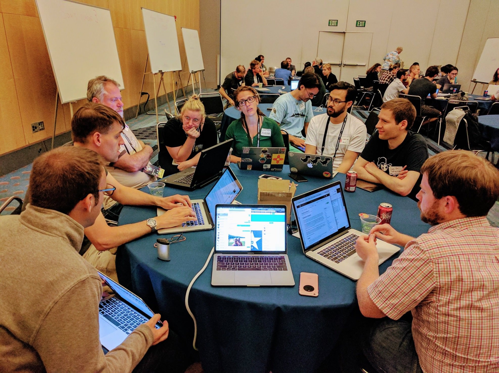
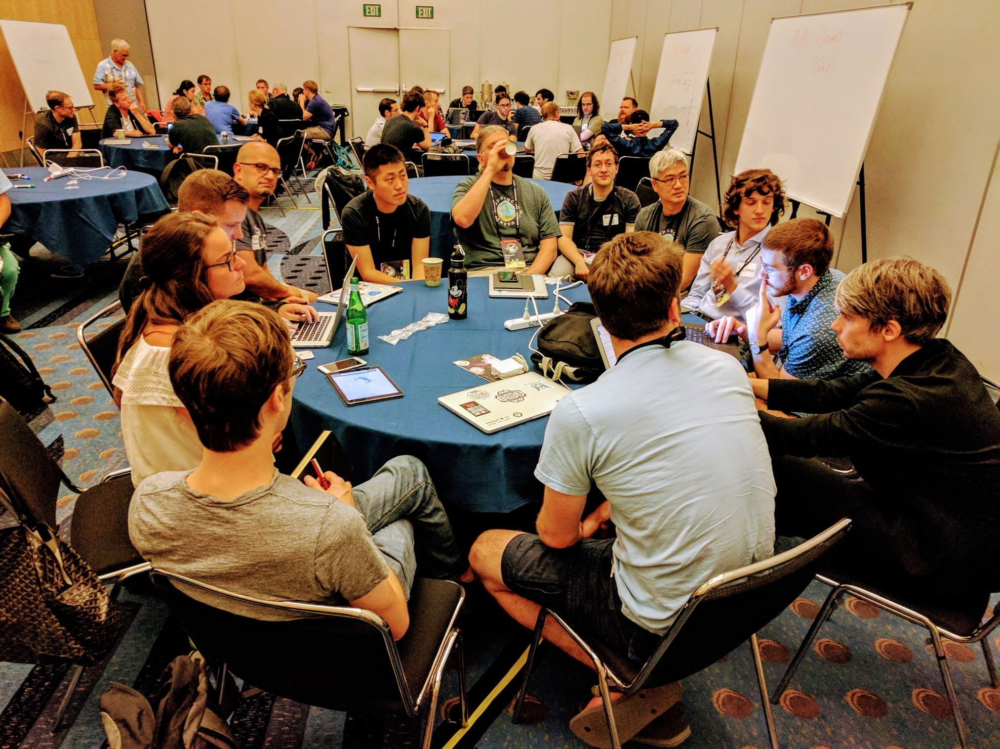
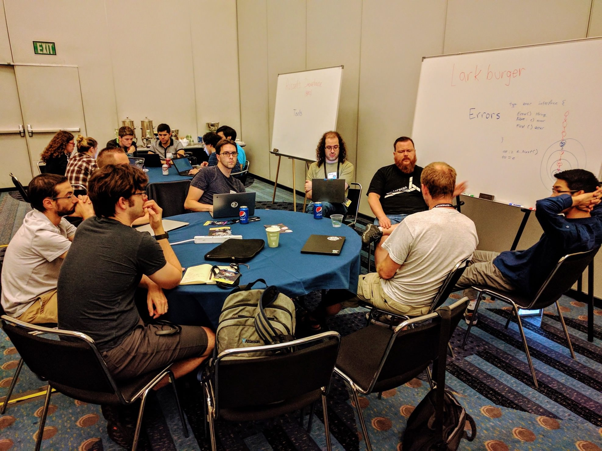
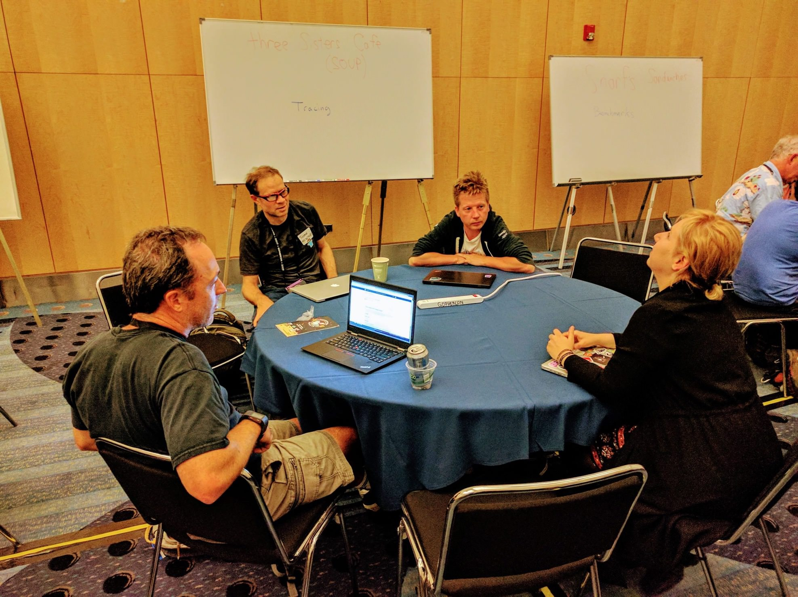
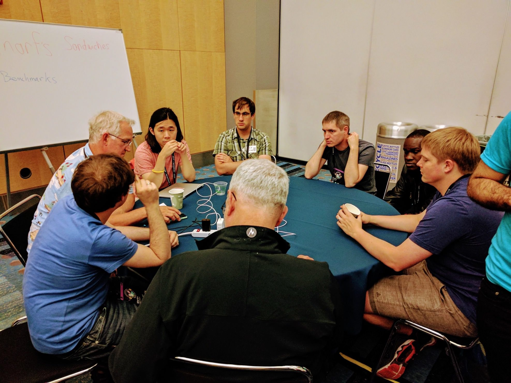

+++
title = "贡献者峰会"
weight = 6
date = 2023-05-18T17:03:08+08:00
type = "docs"
description = ""
isCJKLanguage = true
draft = false
+++

# Contributors Summit - 贡献者峰会

https://go.dev/blog/contributors-summit

Sam Whited
3 August 2017

## Introduction 简介

The day before GopherCon, a group of Go team members and contributors gathered in Denver to discuss and plan for the future of the Go project. This was the first ever event of its kind, a major milestone for the Go project. The event comprised a morning session revolving around focused discussions on a theme, and an afternoon session made up of round table discussions in small break-out groups.

在GopherCon的前一天，一群Go团队成员和贡献者聚集在丹佛，讨论和规划Go项目的未来。这是有史以来第一次这样的活动，是Go项目的一个重要里程碑。这次活动包括上午的会议，围绕一个主题进行集中讨论，下午的会议由小规模的分组圆桌讨论组成。

### Compiler and runtime 编译器和运行时

The compiler and runtime session started out with a discussion about refactoring `gc` and related tools into importable packages. This would reduce overhead in the core tools and in IDEs which could embed the compiler themselves to do quick syntax checking. Code could also be compiled entirely in memory, which is useful in environments that don’t provide a filesystem, or to run tests continually while you develop to get a live report of breakages. More discussion about whether or not to pursue this line of work will most likely be brought up on the mailing lists in the future.

编译器和运行时会议一开始就讨论了将gc和相关工具重构为可导入包的问题。这将减少核心工具和IDE的开销，IDE可以自己嵌入编译器以进行快速语法检查。代码也可以完全在内存中编译，这在不提供文件系统的环境中很有用，或者在开发过程中不断地运行测试，以获得实时的故障报告。关于是否要开展这项工作的更多讨论，很可能会在未来的邮件列表中提出来。

There was also a great deal of discussion around bridging the gap between optimized assembly code and Go. Most crypto code in Go is written in assembly for performance reasons; this makes it hard to debug, maintain, and read. Furthermore, once you’ve ventured into writing assembly, you often can’t call back into Go, limiting code reuse. A rewrite in Go would make maintenance easier. Adding processor intrinsics and better support for 128-bit math would improve Go’s crypto performance. It was proposed that the new `math/bits` package coming in 1.9 could be expanded for this purpose.

围绕弥合优化的汇编代码和Go之间的差距也进行了大量的讨论。由于性能原因，Go中的大多数加密代码都是用汇编编写的；这使得它很难调试、维护和阅读。此外，一旦您涉足编写汇编，您往往不能再调用Go，限制了代码的重复使用。在Go中重写将使维护更容易。增加处理器本征和对128位数学的更好支持将提高Go的加密性能。有人建议将1.9版本中的新数学/比特包扩展到这个目的。

Not being all that familiar with the development of the compiler and runtime, this for me was one of the more interesting sessions of the day. I learned a lot about the current state of the world, the problems, and where people want to go from here.

由于对编译器和运行时的开发不是很熟悉，这对我来说是今天的会议中比较有趣的一次。我学到了很多关于世界的现状、问题以及人们想从这里走出去的方向。

### Dependency management 依赖项管理

After a quick update from the [dep](https://github.com/golang/dep) team on the status of the project, the dependency management session gravitated towards how the Go world will work once dep (or something dep-like) becomes the primary means of package management. Work to make Go easier to get started with and make dep easier to use has already started. In Go 1.8, a default value for `GOPATH` was introduced, meaning users will only have to add Go’s bin directory to their `$PATH` before they can get started with dep.

在dep团队快速更新了项目状态后，依赖管理会议的主题是一旦dep（或类似dep的东西）成为软件包管理的主要手段，Go世界将如何运作。让Go更容易上手和让dep更容易使用的工作已经开始。在Go 1.8中，引入了GOPATH的默认值，这意味着用户在开始使用dep之前只需将Go的bin目录添加到他们的$PATH中即可。

Another future usability improvement that dep might enable, is allowing Go to work from any directory (not just a workspace in the GOPATH), so that people can use the directory structures and workflows they’re used to using with other languages. It may also be possible to make `go install` easier in the future by guiding users through the process of adding the bin directory to their path, or even automating the process. There are many good options for making the Go tooling easier to use, and discussion will likely continue on the mailing lists.

dep未来可能实现的另一个可用性改进是允许Go从任何目录工作（而不仅仅是GOPATH中的工作区），这样人们就可以使用他们习惯于使用其他语言的目录结构和工作流程。未来也可能通过引导用户将bin目录添加到他们的路径中，甚至将这一过程自动化，使Go的安装更容易。有很多好的方案可以让Go工具更容易使用，讨论可能会在邮件列表中继续。

### The standard library 标准库

The discussions we had around the future of the Go language are mostly covered in Russ Cox’s blog post: [Toward Go 2](https://blog.golang.org//toward-go2), so let’s move on to the standard library session.

我们围绕 Go 语言的未来所进行的讨论，大部分都在 Russ Cox 的博文中有所涉及。Toward Go 2，所以让我们继续讨论标准库环节。

As a contributor to the standard library and subrepos, this session was particularly interesting to me. What goes in the standard library and subrepos, and how much it can change, is a topic that isn’t well defined. It can be hard on the Go team to maintain a huge number of packages when they may or may not have anyone with specific expertise in the subject matter. To make critical fixes to packages in the standard library, one must wait 6 months for a new version of Go to ship (or a point release has to be shipped in the case of security issues, which drains team resources). Better dependency management may facilitate the migration of some packages out of the standard library and into their own projects with their own release schedules.

作为标准库和子库的贡献者，这次会议对我来说特别有意思。标准库和子库中的内容，以及它能有多大的变化，是一个没有很好定义的话题。Go团队要维护大量的软件包是很困难的，因为他们可能有也可能没有在这个问题上有特殊专长的人。为了对标准库中的包进行关键性的修复，必须等待6个月的时间来发布新的Go版本（或者在出现安全问题的情况下，必须发布一个点版本，这就耗费了团队资源）。更好的依赖项管理可能会促进一些软件包从标准库中迁移出来，进入他们自己的项目，有自己的发布时间表。

There was also some discussion about things that are difficult to achieve with the interfaces in the standard library. For instance, it would be nice if `io.Reader` accepted a context so that blocking read operations could be canceled.

也有一些关于标准库中的接口难以实现的事情的讨论。例如，如果io.Reader能接受一个上下文，那么阻塞的读取操作就能被取消，那就更好了。

More [experience reports](https://go.dev/wiki/experiencereports) are necessary before we can determine what will change in the standard library.

在我们确定标准库中会有什么变化之前，需要更多的经验报告。

### Tooling and editors 工具和编辑器

A language server for editors to use was a hot topic in the tooling session, with a number of people advocating for IDE and tool developers to adopt a common "Go Language Server" to index and display information about code and packages. Microsoft’s [Language Server Protocol](https://www.github.com/Microsoft/language-server-protocol) was suggested as a good starting point because of its wide support in editors and IDEs.

供编辑器使用的语言服务器是工具会议上的一个热门话题，许多人主张IDE和工具开发者采用一个通用的 "Go语言服务器 "来索引和显示代码和包的信息。微软的语言服务器协议被建议作为一个很好的起点，因为它在编辑器和IDE中得到了广泛的支持。

Jaana Burcu Dogan also discussed her work on distributed tracing and how information about runtime events could be made easier to acquire and attached to traces. Having a standard "counter" API to report statistics was proposed, but specific experience reports from the community will be required before such an API can be designed.

Jaana Burcu Dogan还讨论了她在分布式跟踪方面的工作，以及如何使运行时事件的信息更容易被获取并附加到跟踪中。她提出了一个标准的 "计数器 "API来报告统计数据，但在设计这样一个API之前，需要社区的具体经验报告。

### The contributor experience 贡献者的经验

The final session of the day was on the contributor experience. The first discussion was all about how the current Gerrit workflow could be made easier for new contributors which has already resulted in improvements to the documentation for several repos, and influenced the new contributors workshop a few days later!

当天的最后一场会议是关于贡献者的经验。第一场讨论是关于如何使当前的Gerrit工作流程对新的贡献者来说更容易，这已经导致了对几个仓库的文档的改进，并影响了几天后的新贡献者研讨会

Making it easier to find tasks to work on, empowering users to perform gardening tasks on the issue tracker, and making it easier to find reviewers were also considered. Hopefully we’ll see improvements to these and many more areas of the contribution process in the coming weeks and months!

让它更容易找到工作任务，授权用户在问题跟踪器上执行园艺任务，以及让它更容易找到审查员，也被考虑在内。希望在未来的几周和几个月里，我们能看到这些以及贡献过程中更多领域的改进!

### Breakout sessions 分组会议

In the afternoon, participants broke out into smaller groups to have more in-depth discussions about some of the topics from the morning session. These discussions had more specific goals. For example, one group worked on identifying the useful parts of an experience report and a list of existing literature documenting Go user experiences, resulting in the experience report [wiki page](https://go.dev/wiki/experiencereports).

下午，与会者分成小组，对上午会议的一些议题进行了更深入的讨论。这些讨论有更具体的目标。例如，一个小组致力于确定经验报告的有用部分和记录Go用户经验的现有文献清单，从而形成了经验报告的维基页面。

Another group considered the future of errors in Go. Many Go users are initially confused by, or don’t understand the fact that `error` is an interface, and it can be difficult to attach more information to errors without masking sentinel errors such as `io.EOF`. The breakout session discussed specific ways it might be possible to fix some of these issues in upcoming Go releases, but also ways error handling could be improved in Go 2.

另一个小组考虑了Go中错误的未来。许多Go用户最初对错误是一个接口的事实感到困惑，或者不理解，在不掩盖io.EOF等哨兵错误的情况下，给错误附加更多信息是很困难的。分组会议讨论了在即将发布的Go中修复这些问题的具体方法，以及在Go 2中改进错误处理的方法。

## Community 社区

Outside of the technical discussions, the summit also provided an opportunity for a group of people from all over the world who often talk and work together to meet in person, in many cases for the first time. There is no substitute for a little face-to-face time to build a sense of mutual respect and comradeship, which is critical when a diverse group with different backgrounds and ideas needs to come together to work in a single community. During the breaks, Go team members dispersed themselves among the contributors for discussions both about Go and a little general socialization, which really helped to put faces to the names that review our code every day.

在技术讨论之外，峰会还提供了一个机会，让一群来自世界各地、经常在一起讨论和工作的人见面，在很多情况下这是第一次。在建立相互尊重和战友情谊方面，一点面对面的时间是无可替代的，当一个有着不同背景和想法的不同群体需要在一个社区里工作时，这一点至关重要。在休息的时候，Go团队的成员们分散在各个贡献者中间，讨论Go的问题，并进行一些一般性的社交活动，这确实有助于将每天审查我们代码的人的名字与他们联系起来。

As Russ discussed in [Toward Go 2](https://blog.golang.org//toward-go2), communicating effectively requires knowing your audience. Having a broad sample of Go contributors in a room together helped us all to understand the Go audience better and start many productive discussions about the future of Go. Going forward, we hope to do more frequent events like this to facilitate discourse and a sense of community.

正如Russ在Toward Go 2中所讨论的，有效的沟通需要了解您的听众。让广大的Go贡献者在一起，有助于我们更好地了解Go的受众，并就Go的未来展开了许多富有成效的讨论。展望未来，我们希望能更多地举办这样的活动，以促进讨论和社区意识的形成。

Photos by Steve Francia
