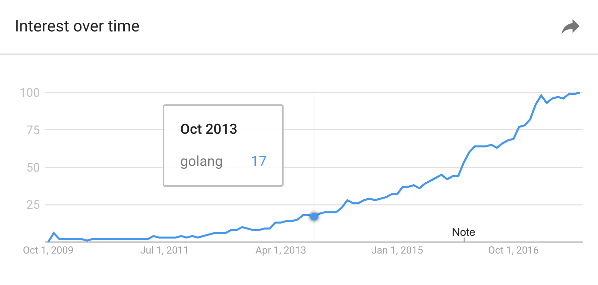
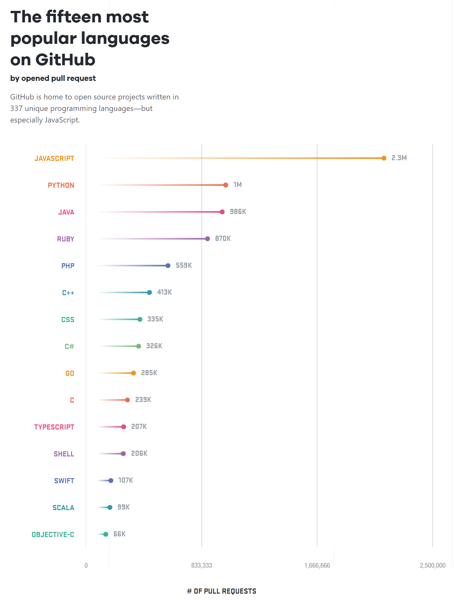
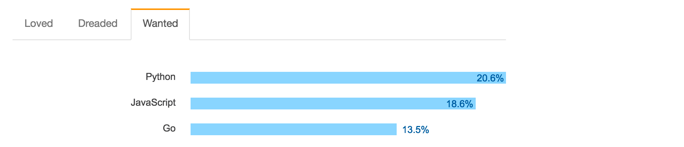

+++
title = "go 8 岁了"
weight = 2
date = 2023-05-18T17:03:08+08:00
type = "docs"
description = ""
isCJKLanguage = true
draft = false
+++

# Eight years of Go - go 8 岁了

https://go.dev/blog/8years

Steve Francia
10 November 2017

Today we celebrate 8 years since Go was released as an open source project. During [Go’s 4th anniversary](https://blog.golang.org/4years), Andrew finished the post with "Here’s to four more years!". Now that we have reached that milestone, I cannot help but reflect on how much the project and ecosystem has grown since then. In our post 4 years ago we included a chart demonstrating Go’s rising popularity on Google Trends with the search term "golang". Today, we’re including an updated chart. In this relative scale of popularity, what was 100 four years ago is now a mere 17. Go’s popularity has increased exponentially over the last 8 years and continues to grow.

今天我们庆祝Go作为开源项目发布8周年。在Go四周年的时候，Andrew以 "为再过四年干杯！"来结束帖子。现在我们已经达到了这个里程碑，我不禁要反思这个项目和生态系统从那时起已经成长了多少。在4年前的文章中，我们附上了一张图表，展示了Go在Google Trends上的搜索词 "golang "的流行程度。今天，我们又附上了一张最新的图表。在这个相对的流行程度中，四年前是100，现在只是17。Go的受欢迎程度在过去8年里成倍增长，并且还在继续增长。

Source: [trends.google.com](https://trends.google.com/trends/explore?date=2009-10-01 2017-10-30&q=golang&hl=en-US)

## Developers love Go 开发人员喜欢Go

Go has been embraced by developers all over the world with approximately one million users worldwide. In the [freshly published 2017 Octoverse](https://octoverse.github.com/) by GitHub, **Go has become the #9 most popular language**, surpassing C. **Go is the fastest growing language on GitHub in 2017** in the top 10 with **52% growth over the previous year**. In growth, Go swapped places with Javascript, which fell to the second spot with 44%.

Go已经被全世界的开发者所接受，在全球拥有约100万用户。在GitHub最新发布的2017年Octoverse中，Go已经成为第9位最受欢迎的语言，超过了C语言。 Go是GitHub上2017年前10名中增长最快的语言，比前一年增长52%。在增长方面，Go与Javascript互换了位置，后者以44%的比例跌至第二位。

Source: [octoverse.github.com](https://octoverse.github.com/)

In [Stack Overflow’s 2017 developer survey](https://insights.stackoverflow.com/survey/2017#most-loved-dreaded-and-wanted) , Go was the only language that was both on the **top 5 most loved and top 5 most wanted** languages. People who use Go, love it, and the people who aren’t using Go, want to be.

在Stack Overflow的2017年开发者调查中，Go是唯一一种既在前5名最喜爱的语言中又在前5名最想要的语言中的语言。使用Go的人喜欢它，而没有使用Go的人则希望成为它。

Source: [insights.stackoverflow.com/survey/2017](https://insights.stackoverflow.com/survey/2017#most-loved-dreaded-and-wanted)

## Go: The language of Cloud Infrastructure - Go：云基础设施的语言

In 2014, analyst Donnie Berkholz called Go [the emerging language of cloud infrastructure](http://redmonk.com/dberkholz/2014/03/18/go-the-emerging-language-of-cloud-infrastructure/). **By 2017, Go has emerged as the language of cloud infrastructure**. Today, **every single cloud company has critical components of their cloud infrastructure implemented in Go** including Google Cloud, AWS, Microsoft Azure, Digital Ocean, Heroku and many others. Go is a key part of cloud companies like Alibaba, Cloudflare, and Dropbox. Go is a critical part of open infrastructure including Kubernetes, Cloud Foundry, Openshift, NATS, Docker, Istio, Etcd, Consul, Juju and many more. Companies are increasingly choosing Go to build cloud infrastructure solutions.

2014年，分析师Donnie Berkholz称Go是云基础设施的新兴语言。到了2017年，Go已经成为了云基础设施的语言。如今，每家云计算公司都有用Go实现的云计算基础设施的关键组件，包括谷歌云、AWS、微软Azure、Digital Ocean、Heroku和其他许多公司。Go是阿里巴巴、Cloudflare和Dropbox等云公司的关键部分。Go是开放基础设施的关键部分，包括Kubernetes、Cloud Foundry、Openshift、NATS、Docker、Istio、Etcd、Consul、Juju等等。越来越多的公司选择Go来构建云基础设施解决方案。

## Go’s Great Community Go的伟大社区

It may be hard to imagine that only four years ago the Go community was transitioning from online-only to include in-person community with its first conference. Now the Go community has had over 30 conferences all around the world with hundreds of presentations and tens of thousands of attendees. There are hundreds of Go meetups meeting monthly covering much of the globe. Wherever you live, you are likely to find a Go meetup nearby.

可能很难想象，仅仅在四年前，Go社区还在从仅有的在线社区过渡到包括亲临现场的社区，并召开了第一次会议。现在，Go社区已经在世界各地举行了30多次会议，有数百场演讲和数万名与会者。在全球范围内，每月都有数百个Go聚会。无论您住在哪里，您都有可能在附近找到一个Go聚会。

Two different organizations have been established to help with inclusivity in the Go community, Go Bridge and Women Who Go; the latter has grown to over 25 chapters. Both have been instrumental in offering free trainings. In 2017 alone over 50 scholarships to conferences have been given through efforts of Go Bridge and Women Who Go.

为了帮助Go界的包容性，已经成立了两个不同的组织：Go之桥和Go女性；后者已经发展到超过25个分会。这两个组织都在提供免费培训方面发挥了作用。仅在2017年，通过Go Bridge和Women Who Go的努力，就提供了超过50个会议的奖学金。

This year we had two significant firsts for the Go project. We had our first [contributor summit](https://blog.golang.org/contributors-summit) where people from across the Go community came together to discuss the needs and future of the Go project. Shortly after, we had the first [Go contributor workshop](https://blog.golang.org/contributor-workshop) where hundreds of people came to make their first Go contribution.

今年，我们在Go项目上有两个重要的第一次。我们举行了第一次贡献者峰会，来自整个Go界的人们聚集在一起，讨论Go项目的需求和未来。不久之后，我们举办了第一次Go贡献者研讨会，有数百人来到这里，做出了他们的第一次Go贡献。

Photo by Sameer Ajmani

## Go’s impact on open source Go对开源的影响

Go has become a major force in the world of open source powering some of the most popular projects and enabling innovations across many industries. Find thousands of additional applications and libraries at [awesome-go](https://github.com/avelino/awesome-go). Here are just a handful of the most popular:

Go已经成为开源世界的主要力量，为一些最受欢迎的项目提供动力，并使许多行业的创新成为可能。在awesome-go找到数以千计的其他应用程序和库。这里只是一些最受欢迎的项目：

- [Moby](https://mobyproject.org/) (formerly Docker) is a tool for packaging and running applications in lightweight containers. Its creator Solomon Hykes cited Go’s standard library, concurrency primitives, and ease of deployment as key factors, and said "To put it simply, if Docker had not been written in Go, it would not have been as successful." Moby（前身为Docker）是一个用于在轻量级容器中打包和运行应用程序的工具。它的创造者Solomon Hykes将Go的标准库、并发基元和易于部署作为关键因素，并说 "简单地说，如果Docker不是用Go编写的，它就不会如此成功。"
- [Kubernetes](https://kubernetes.io/) is a system for automating deployment, scaling and management of containerized applications. Initially designed by Google and used in the Google cloud, Kubernetes now is a critical part of every major cloud offering. Kubernetes是一个用于自动化部署、扩展和管理容器化应用程序的系统。最初由谷歌设计并用于谷歌云，现在Kubernetes是每个主要云产品的关键部分。
- [Hugo](https://gohugo.io/) is now the most popular open-source static website engine. With its amazing speed and flexibility, Hugo makes building websites fun again. According to [w3techs](https://w3techs.com/technologies/overview/content_management/all), Hugo now has nearly 3x the usage of Jekyll, the former leader. 雨果是现在最流行的开源静态网站引擎。凭借其惊人的速度和灵活性，Hugo使构建网站再次成为一种乐趣。根据w3techs的数据，Hugo现在的使用率几乎是以前的领导者Jekyll的3倍。
- [Prometheus](https://prometheus.io/) is an open source monitoring solution and time series database that powers metrics and alerting designed to be the system you go to during an outage to allow you to quickly diagnose problems. Prometheus是一个开源的监控解决方案和时间序列数据库，为指标和警报提供动力，旨在成为您在故障期间的系统，使您能够快速诊断问题。
- [Grafana](https://grafana.com/) is an open source, feature-rich metrics dashboard and graph editor for Graphite, Elasticsearch, OpenTSDB, Prometheus and InfluxDB. Grafana是一个开源的、功能丰富的指标仪表盘和图形编辑器，用于Graphite、Elasticsearch、OpenTSDB、Prometheus和InfluxDB。
- [Lantern](https://getlantern.org/) delivers fast, reliable and secure access to blocked websites and apps. Lantern提供快速、可靠和安全的访问被封锁的网站和应用程序。
- [Syncthing](https://syncthing.net/) is an open-source cross platform peer-to-peer continuous file synchronization application Syncthing是一个开源的跨平台点对点连续文件同步应用程序。
- [Keybase](https://keybase.io/) is a new and free security app for mobile phones and computers. Think of it as an open source Dropbox & Slack with end-to-end encryption public-key cryptography. Keybase是一个用于手机和电脑的新的免费安全应用程序。可以把它看作是一个开源的Dropbox和Slack，具有端到端加密的公钥加密技术。
- [Fzf](https://github.com/junegunn/fzf) is an interactive Unix filter for command-line that can be used with any list; files, command history, processes, hostnames, bookmarks, git commits, etc. Fzf supports Unix, macOS and has beta support for Windows. It also can operate as a vim plugin. Fzf是一个互动的Unix命令行过滤器，可用于任何列表；文件、命令历史、进程、主机名、书签、git提交等。Fzf支持Unix、macOS，对Windows也有测试版支持。它还可以作为一个vim插件来操作。

Many of these authors have said that their projects would not exist without Go. Some like Kubernetes and Docker created entirely new solutions. Others like Hugo, Syncthing and Fzf created more refined experiences where many solutions already existed. The popularity of these applications alone is proof that Go is an ideal language for a broad set of use cases.

许多作者都说，没有Go，他们的项目就不会存在。有些项目如Kubernetes和Docker创造了全新的解决方案。其他如Hugo、Syncthing和Fzf在许多解决方案已经存在的地方创造了更精炼的经验。仅仅是这些应用的普及就证明了Go是一种适用于广泛使用情况的理想语言。

## Thank You 谢谢您

This is the eighth time we have had the pleasure of writing a birthday blog post for Go and we continue to be overwhelmed by and grateful for the enthusiasm and support of the Go community.

这是我们第八次有幸为 Go 撰写生日博文，我们继续被 Go 社区的热情和支持所折服，并对其表示感谢。

Since Go was first open sourced we have had 10 releases of the language, libraries and tooling with more than 1680 contributors making over 50,000 commits to the project’s 34 repositories; More than double the number of contributors and nearly double the number of commits from only [two years ago](https://blog.golang.org/6years). This year we announced that we have begun planning [Go 2](https://blog.golang.org/toward-go2), our first major revision of the language and tooling.

自Go首次开源以来，我们已经发布了10个语言、库和工具版本，有超过1680名贡献者向项目的34个仓库提交了超过5万个提交文件；与两年前相比，贡献者的数量增加了一倍以上，提交文件的数量也增加了近一倍。今年我们宣布，我们已经开始计划Go 2，这是我们对语言和工具的第一次重大修订。

The Go team would like to thank everyone who has contributed to the project, whether you participate by contributing changes, reporting bugs, sharing your expertise in design discussions, writing blog posts or books, running events, attending or speaking at events, helping others learn or improve, open sourcing Go packages you wrote, contributing artwork, introducing Go to someone, or being part of the Go community. Without you, Go would not be as complete, useful, or successful as it is today.

Go团队要感谢每一个为项目做出贡献的人，无论您是通过贡献修改、报告错误、在设计讨论中分享您的专业知识、撰写博文或书籍、举办活动、参加活动或演讲、帮助他人学习或改进、开源您编写的Go包、贡献艺术品、向他人介绍Go，还是成为Go社区的一员。没有您们，Go就不会像今天这样完整、有用或成功。

Thank you, and here’s to eight more years!

谢谢您们，祝愿您们再创辉煌
