+++
title = "2016年 Go 调查结果"
weight = 10
date = 2023-05-18T17:03:08+08:00
type = "docs"
description = ""
isCJKLanguage = true
draft = false
+++

# Go 2016 Survey Results - 2016年 Go 调查结果

> 原文：[https://go.dev/blog/survey2016-results](https://go.dev/blog/survey2016-results)

Steve Francia, for the Go team
6 March 2017

## Thank you 谢谢您

This post summarizes the result of our December 2016 user survey along with our commentary and insights. We are grateful to everyone who provided their feedback through the survey to help shape the future of Go.

这篇文章总结了我们2016年12月的用户调查的结果以及我们的评论和见解。我们感谢每个通过调查提供反馈的人，以帮助塑造Go的未来。

## Programming background 编程背景

Of the 3,595 survey respondents, 89% said they program in Go at work or outside of work, with 39% using Go both at home and at work, 27% using Go only at home, and 23% using Go only at work.

在3595名调查对象中，89%的人表示他们在工作或工作之外用Go编程，其中39%的人在家里和工作中都使用Go，27%的人只在家里使用Go，23%的人只在工作中使用Go。

We asked about the areas in which people work. 63% said they work in web development, but only 9% listed web development alone. In fact, 77% chose two or more areas, and 53% chose three or more.

我们询问了人们的工作领域。63%的人说他们从事网络开发工作，但只有9%的人只列出了网络开发。事实上，77%的人选择了两个或更多的领域，53%的人选择了三个或更多。

We also asked about the kinds of programs people write in Go. 63% of respondents write command-line programs, 60% write API or RPC services, and 52% write web services. Like in the previous question, most made multiple choices, with 85% choosing two or more and 72% choosing three or more.

我们还询问了人们用Go编写的程序种类。63%的受访者写命令行程序，60%写API或RPC服务，52%写网络服务。和上一个问题一样，大多数人做出了多项选择，85%的人选择了两个或更多，72%的人选择了三个或更多。

We asked about people’s expertise and preference among programming languages. Unsurprisingly, Go ranked highest among respondents’ first choices in both expertise (26%) and preference (62%). With Go excluded, the top five first choices for language expertise were Python (18%), Java (17%), JavaScript (13%), C (11%), and PHP (8%); and the top five first choices for language preference were Python (22%), JavaScript (10%), C (9%), Java (9%), and Ruby (7%). Go is clearly attracting many programmers from dynamic languages.

我们询问了人们在编程语言中的专业知识和偏好。不出所料，Go在专业知识（26%）和偏好（62%）方面都在受访者的第一选择中排名最高。如果不包括Go，在语言专业知识方面，排名前五的首选是Python（18%）、Java（17%）、JavaScript（13%）、C（11%）和PHP（8%）；而在语言偏好方面，排名前五的首选是Python（22%）、JavaScript（10%）、C（9%）、Java（9%）和Ruby（7%）。Go显然正在吸引许多来自动态语言的程序员。

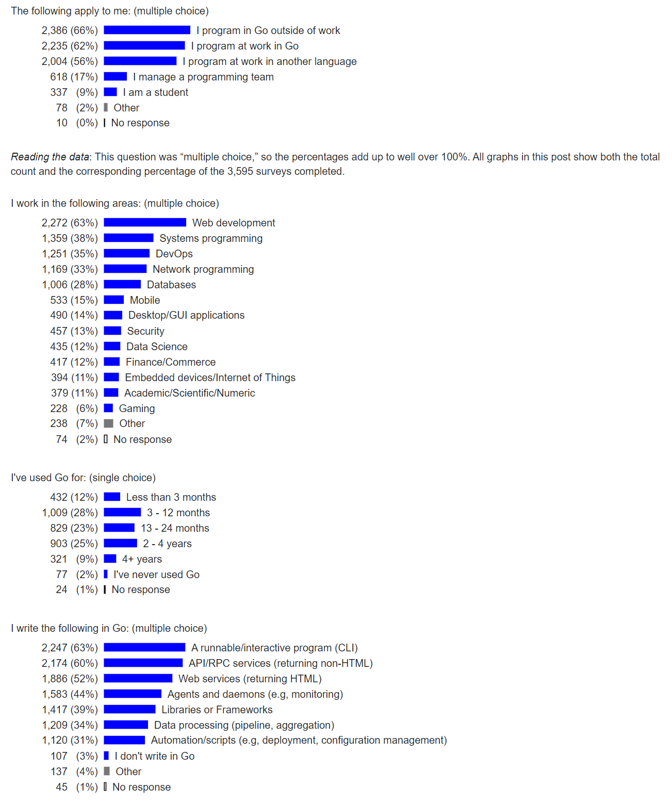

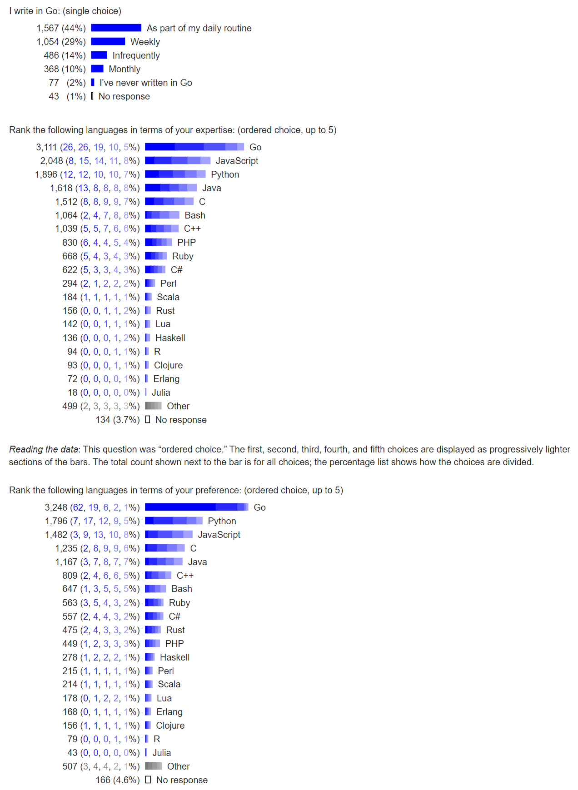

## Go usage Go的使用情况

Users are overwhelmingly happy with Go: they agree that they would recommend Go to others by a ratio of 19:1, that they’d prefer to use Go for their next project (14:1), and that Go is working well for their teams (18:1). Fewer users agree that Go is critical to their company’s success (2.5:1).

用户对Go的使用非常满意：他们同意以19:1的比例向其他人推荐Go，他们更愿意在下一个项目中使用Go（14:1），并且Go对他们的团队来说运行良好（18：1）。较少的用户同意Go对他们公司的成功至关重要（2.5:1）。

When asked what they like most about Go, users most commonly mentioned Go’s simplicity, ease of use, concurrency features, and performance. When asked what changes would most improve Go, users most commonly mentioned generics, package versioning, and dependency management. Other popular responses were GUIs, debugging, and error handling.

当被问及他们最喜欢Go的什么时，用户最常提到Go的简单性、易用性、并发功能和性能。当被问及什么变化最能改善Go时，用户最常提到的是泛型、包的版本管理和依赖项管理。其他受欢迎的回答是图形用户界面、调试和错误处理。

When asked about the biggest challenges to their own personal use of Go, users mentioned many of the technical changes suggested in the previous question. The most common themes in the non-technical challenges were convincing others to use Go and communicating the value of Go to others, including management. Another common theme was learning Go or helping others learn, including finding documentation like getting-started walkthroughs, tutorials, examples, and best practices.

当被问及个人使用Go的最大挑战时，用户提到了前一个问题中建议的许多技术变革。非技术性挑战中最常见的主题是说服他人使用Go，以及向他人（包括管理层）传达Go的价值。另一个常见的主题是学习Go或帮助他人学习，包括寻找文档，如入门演练、教程、实例和最佳实践。

Some representative common feedback, paraphrased for confidentiality:

一些有代表性的共同反馈，为保密起见作了转述：

> "The documentation is not clear enough for beginners. It needs more examples and often assumes experience with other languages and various computer science topics."
>
> "文档对于初学者来说不够清晰。它需要更多的例子，并经常假设有其他语言和各种计算机科学主题的经验。"
>
> "I want to use Go at work but struggle to convince my team to even try Go."
>
> "我想在工作中使用Go，但却很难说服我的团队去尝试Go。"
>
> "I can’t get management approval to use Go; they don’t see its value and worry about adoption and finding developers."
>
> "我无法获得管理层对使用Go的批准；他们看不到它的价值，并担心采用和寻找开发人员的问题。"

We appreciate the feedback given to identify these challenges faced by our users and community. In 2017 we are focusing on addressing these issues and hope to make as many significant improvements as we can. We welcome suggestions and contributions from the community in making these challenges into strengths for Go.

我们感谢为确定我们的用户和社区所面临的这些挑战而提供的反馈。在2017年，我们正专注于解决这些问题，并希望尽可能多地做出重大改进。我们欢迎社区的建议和贡献，将这些挑战变成Go的优势。

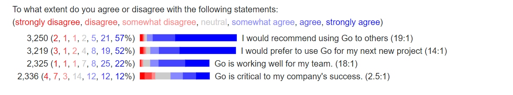

*Reading the data*: This question asked how strongly the respondent agreed or disagreed with the statement. The responses for each statement are displayed as sections of a single bar, from "strongly disagree" in deep red on the left end to "strongly agree" in deep blue on the right end. The bars use the same scale as the rest of the graphs, so they can (and do, especially later in the survey) vary in overall length due to lack of responses. The ratio after the text compares the number of respondents who agreed (including "somewhat agree" and "strongly agree") to those who disagreed (including "somewhat disagree" and "strongly disagree"). For example, the ratio of respondents agreeing that they would recommend Go to respondents disagreeing was 19 to 1.

阅读数据。这个问题问的是受访者对陈述的同意或不同意的程度。每个陈述的回答都显示为一个条形的部分，从左端深红色的 "强烈不同意 "到右端深蓝色的 "强烈同意"。条形图使用与其他图表相同的比例，因此它们可以（而且确实如此，特别是在调查的后期）由于缺乏回应而在整体长度上有所变化。文字后面的比率比较了同意（包括 "有点同意 "和 "非常同意"）的受访者与不同意（包括 "有点不同意 "和 "非常不同意"）的受访者的人数。例如，同意推荐Go的受访者与不同意的受访者的比例是19比1。

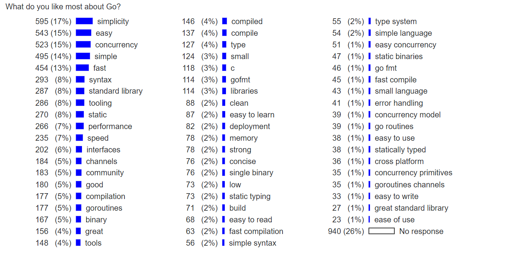

*Reading the data*: This question asked for write-in responses. The bars above show the fraction of surveys mentioning common words or phrases. Only words or phrases that appeared in twenty or more surveys are listed, and meaningless common words or phrases like "the" or "to be" are omitted. The displayed results do overlap: for example, the 287 responses that mentioned "standard library" do include the 27 listed separately that mentioned "great standard library." However, nearly or completely redundant shorter entries are omitted: there are not twenty or more surveys that listed "standard" without mentioning "standard library," so there is no separate entry for "standard."

阅读数据。这个问题要求写下回答。上面的条形图显示了调查中提到常见词汇或短语的比例。只有出现在20份或更多调查中的单词或短语才被列出，而像 "the "或 "to be "这样无意义的常用单词或短语则被省略。显示的结果确实有重叠：例如，提到 "标准图书馆 "的287份答复确实包括单独列出的提到 "伟大的标准图书馆 "的27份。然而，几乎或完全多余的较短条目被省略了：没有20个或更多的调查列出了 "标准 "而没有提到 "标准图书馆"，所以没有单独的 "标准 "条目。

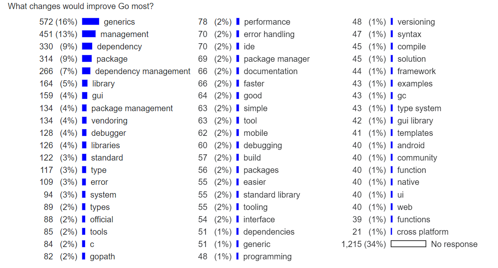

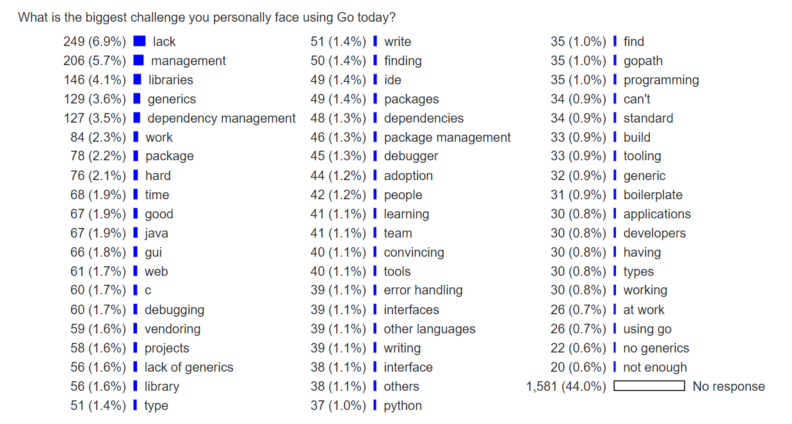

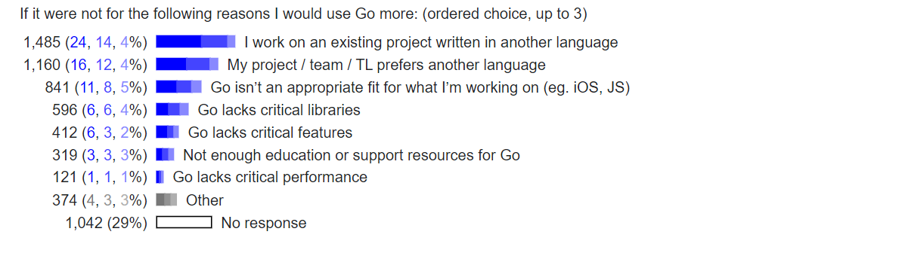

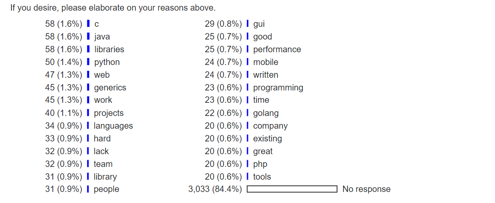

## Development and deployment 开发和部署

When asked which operating systems they develop Go on, 63% of respondents say they use Linux, 44% use MacOS, and 19% use Windows, with multiple choices allowed and 49% of respondents developing on multiple systems. The 51% of responses choosing a single system split into 29% on Linux, 17% on MacOS, 5% on Windows, and 0.2% on other systems.

当问及他们在哪些操作系统上开发Go时，63%的受访者说他们使用Linux，44%使用MacOS，19%使用Windows，允许多选，49%的受访者在多个系统上开发。选择单一系统的51%的受访者分成29%使用Linux，17%使用MacOS，5%使用Windows，0.2%使用其他系统。

Go deployment is roughly evenly split between privately managed servers and hosted cloud servers.

Go的部署在私人管理的服务器和托管的云服务器之间大致平分秋色。

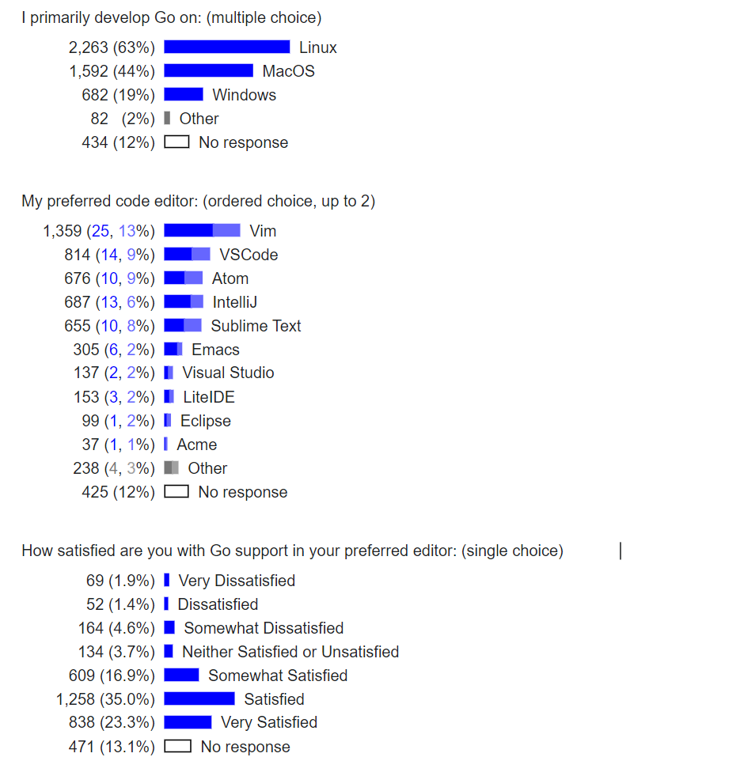

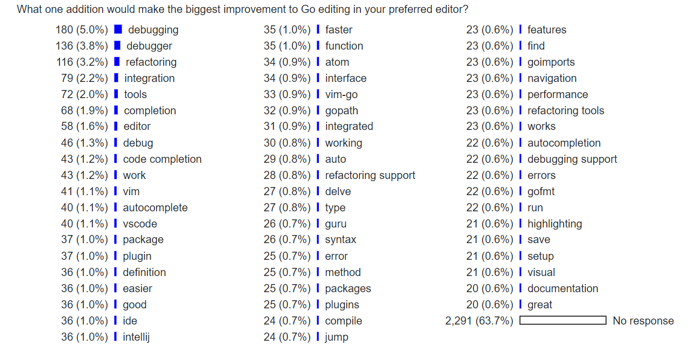

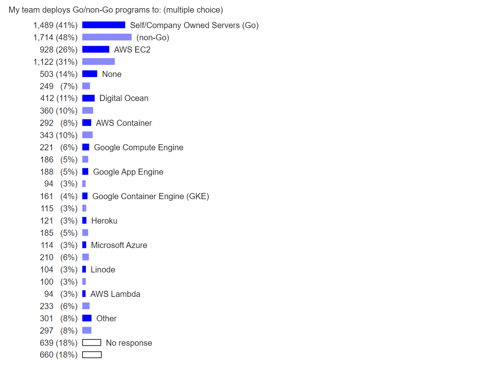

## Working Effectively 有效的工作

We asked how strongly people agreed or disagreed with various statements about Go. Users most agreed that Go’s performance meets their needs (57:1 ratio agree versus disagree), that they are able to quickly find answers to their questions (20:1), and that they are able to effectively use Go’s concurrency features (14:1). On the other hand, users least agreed that they are able to effectively debug uses of Go’s concurrency features (2.7:1).

我们询问了人们对有关Go的各种说法的同意或不同意的程度。用户最同意Go的性能符合他们的需求（同意与不同意的比例为57:1），他们能够快速找到问题的答案（20:1），并且他们能够有效地使用Go的并发功能（14:1）。另一方面，用户最不同意他们能够有效地调试Go的并发功能的使用（2.7:1）。

Users mostly agreed that they were able to quickly find libraries they need (7.5:1). When asked what libraries are still missing, the most common request by far was a library for writing GUIs. Another popular topic was requests around data processing, analytics, and numerical and scientific computing.

用户大多认为他们能够快速找到他们需要的库（7.5:1）。当被问及还缺少什么库时，到目前为止，最常见的要求是编写GUI的库。另一个热门话题是围绕数据处理、分析、数值和科学计算的请求。

Of the 30% of users who suggested ways to improve Go’s documentation, the most common suggestion by far was more examples.

在建议如何改进Go文档的30%的用户中，到目前为止，最常见的建议是更多的例子。

The primary sources for Go news are the Go blog, Reddit’s /r/golang and Twitter; there may be some bias here since these are also how the survey was announced.

Go新闻的主要来源是Go博客、Reddit的/r/golang和Twitter；这里可能有一些偏见，因为这些也是调查的公布方式。

The primary sources for finding answers to Go questions are the Go web site, Stack Overflow, and reading source code directly.

寻找Go问题答案的主要来源是Go网站、Stack Overflow和直接阅读源代码。

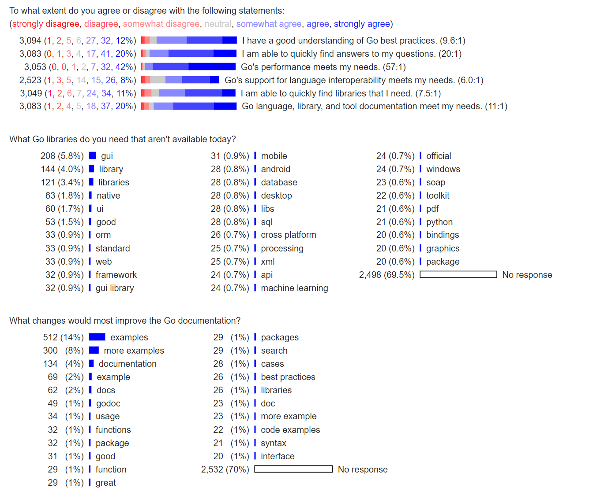

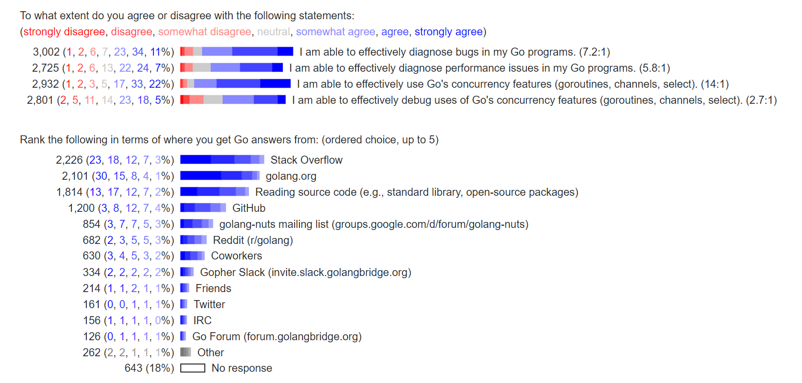

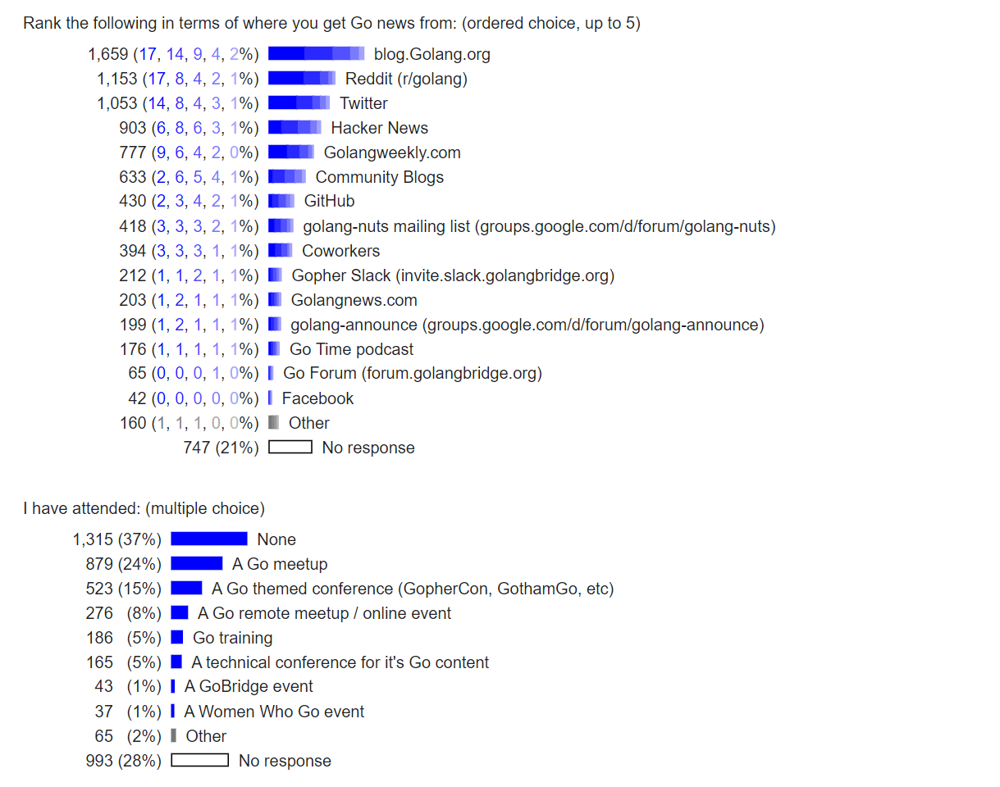

## The Go Project Go项目

55% of respondents expressed interest in contributing in some way to the Go community and projects. Unfortunately, relatively few agreed that they felt welcome to do so (3.3:1) and even fewer felt that the process was clear (1.3:1). In 2017, we intend to work on improving the contribution process and to continue to work to make all contributors feel welcome.

55% 的受访者表示有兴趣以某种方式为 Go 社区和项目做出贡献。不幸的是，相对来说，很少有人同意他们觉得这样做是受欢迎的（3.3:1），甚至更少的人认为这个过程是明确的（1.3:1）。在2017年，我们打算努力改善贡献过程，并继续努力使所有贡献者感到受欢迎。

Respondents agree that they are confident in the leadership of the Go project (9:1), but they agree much less that the project leadership understands their needs (2.6:1), and they agree even less that they feel comfortable approaching project leadership with questions and feedback (2.2:1). In fact, these were the only questions in the survey for which more than half of respondents did not mark "somewhat agree", "agree", or "strongly agree" (many were neutral or did not answer).

受访者同意他们对Go项目的领导层有信心（9:1），但他们对项目领导层了解他们的需求的认同度要低得多（2.6:1），而他们对有问题和反馈接近项目领导层的感觉更差（2.2:1）。事实上，这些是调查中唯一的问题，超过一半的受访者没有标明 "有点同意"、"同意 "或 "非常同意"（许多人是中立的或没有回答）。

We hope that the survey and this blog post convey to those of you who aren’t comfortable reaching out that the Go project leadership is listening. Throughout 2017 we will be exploring new ways to engage with users to better understand their needs.

我们希望调查和这篇博文能向那些不方便联系的人传达，Go项目领导层正在倾听。在整个2017年，我们将探索与用户接触的新方法，以更好地了解他们的需求。

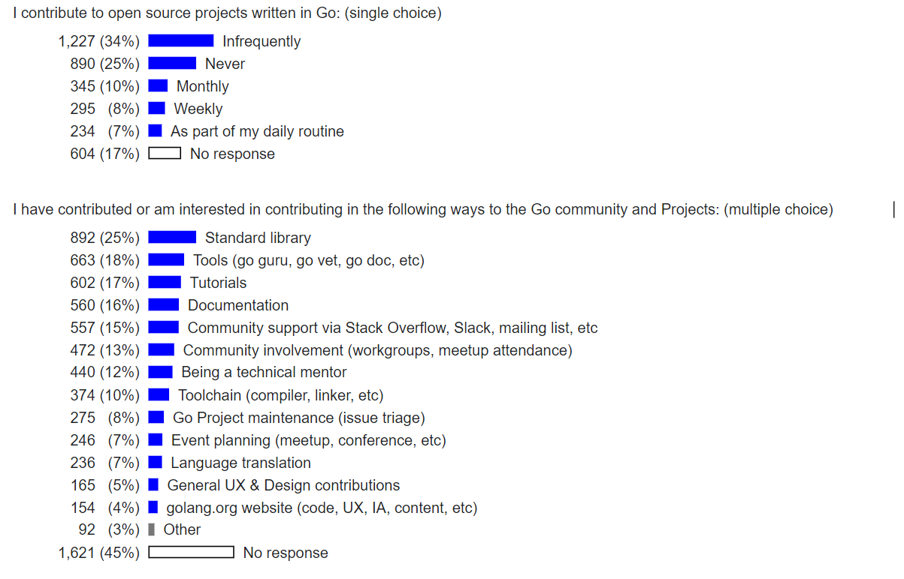

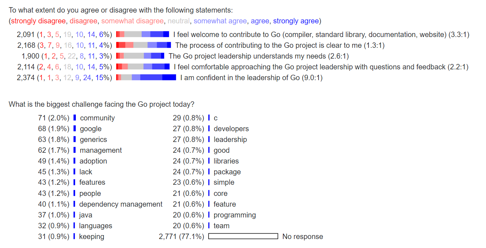

## Community 社区

At the end of the survey, we asked some demographic questions. The country distribution of responses roughly matches the country distribution of site visits to golang.org, but the responses under-represent some Asian countries. In particular, India, China, and Japan each accounted for about 5% of the site visits to golang.org in 2016 but only 3%, 2%, and 1% of survey responses.

在调查的最后，我们问了一些人口统计学问题。答复的国家分布与访问golang.org网站的国家分布基本吻合，但答复中对一些亚洲国家的代表不足。特别是，印度、中国和日本在2016年各占golang.org网站访问量的5%，但只占调查回复的3%、2%和1%。

An important part of a community is making everyone feel welcome, especially people from under-represented demographics. We asked an optional question about identification across a few diversity groups. 37% of respondents left the question blank and 12% of respondents chose "I prefer not to answer", so we cannot make many broad conclusions from the data. However, one comparison stands out: the 9% who identified as underrepresented agreed with the statement "I feel welcome in the Go community" by a ratio of 7.5:1, compared with 15:1 in the survey as a whole. We aim to make the Go community even more welcoming. We support and are encouraged by the efforts of organizations like GoBridge and Women Who Go.

社区的一个重要部分是让每个人都感到受欢迎，特别是来自代表性不足的人口统计学的人。我们问了一个关于跨越几个多样性群体的身份识别的可选问题。37%的受访者没有回答这个问题，12%的受访者选择了 "我不愿意回答"，所以我们无法从数据中得出很多广泛的结论。然而，有一个对比很突出：9%的人认为自己是代表不足的人，他们同意 "我觉得自己在Go界很受欢迎 "这一说法的比例为7.5:1，而在整个调查中，这一比例为15:1。我们的目标是使Go界更加受欢迎。我们支持像GoBridge和Women Who Go这样的组织的努力，并为此感到鼓舞。

The final question on the survey was just for fun: what’s your favorite Go keyword? Perhaps unsurprisingly, the most popular response was `go`, followed by `defer`, `func`, `interface`, and `select`.

调查的最后一个问题只是为了好玩：您最喜欢的Go关键词是什么？也许不出意料，最受欢迎的回答是go，其次是defer、func、interface和select。

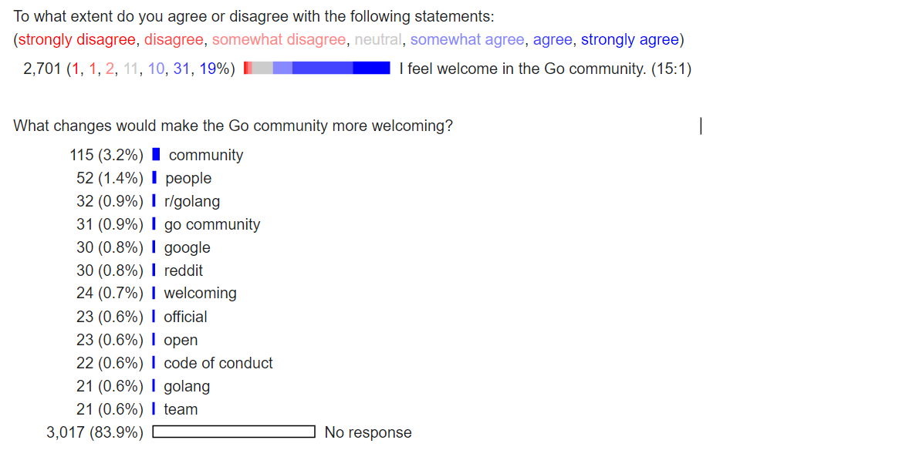

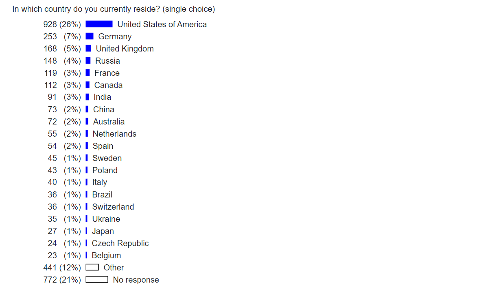

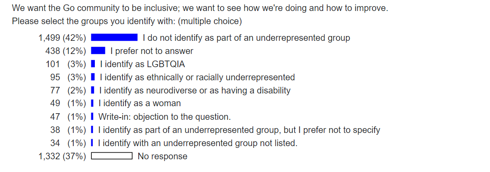

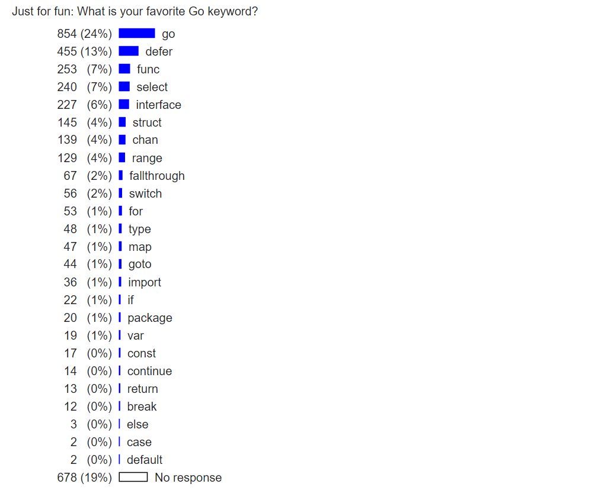

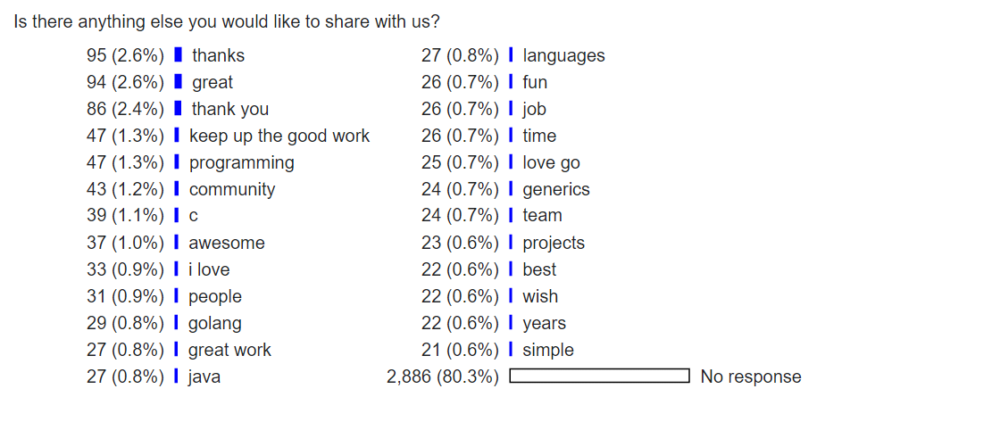
