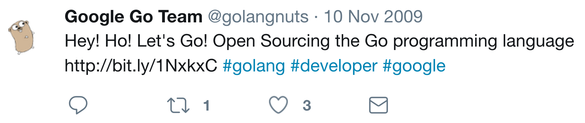
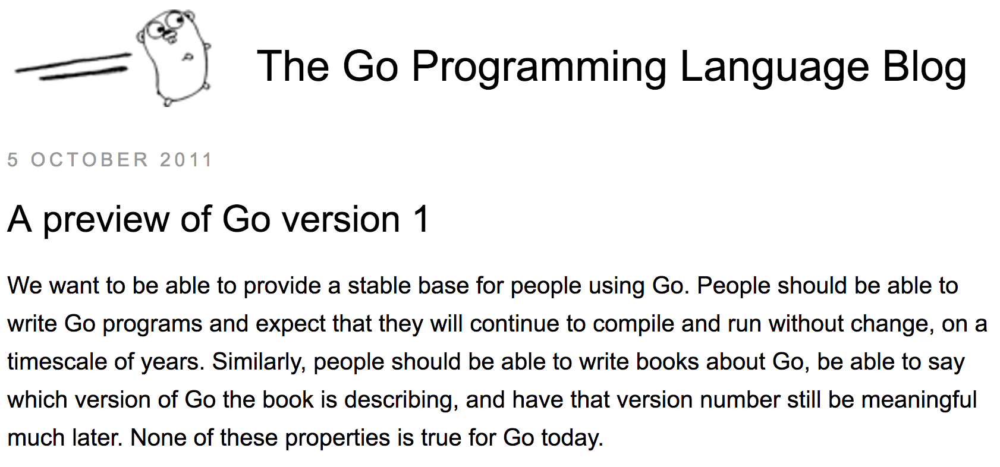
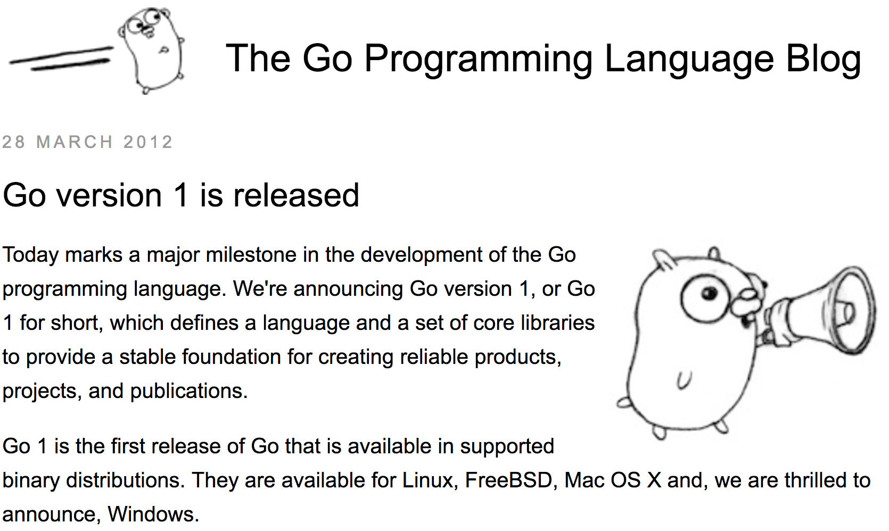
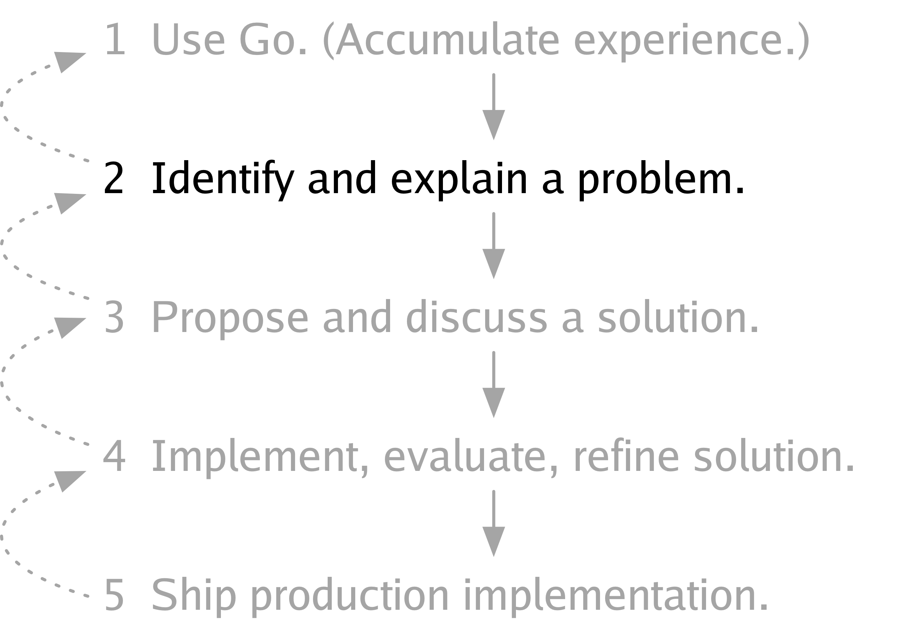
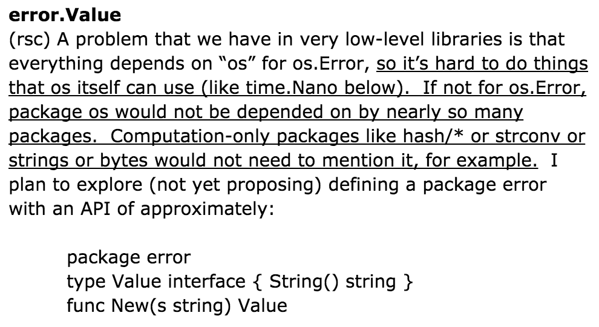
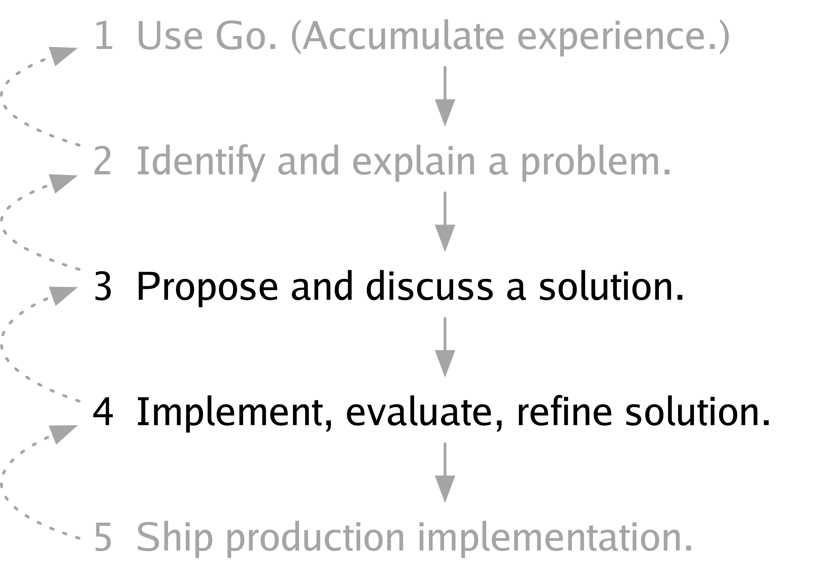
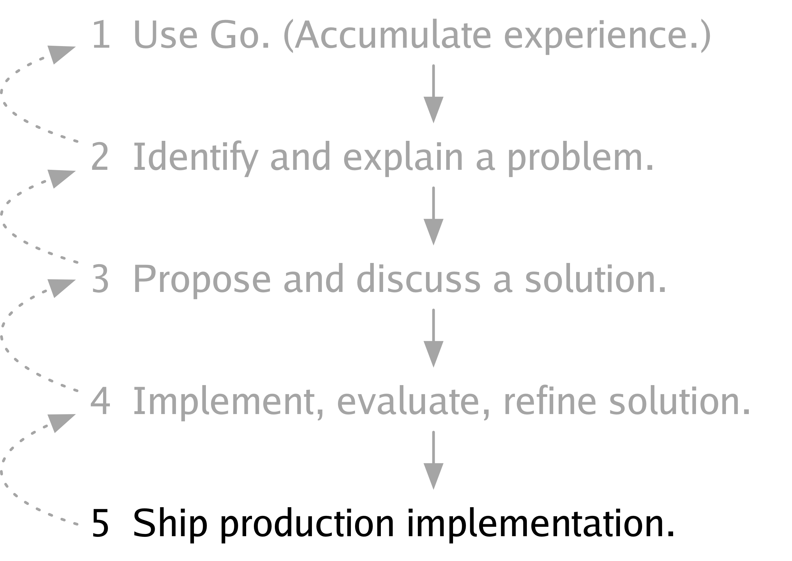

+++
title = "迈向 go 2"
weight = 7
date = 2023-05-18T17:03:08+08:00
type = "docs"
description = ""
isCJKLanguage = true
draft = false
+++

# Toward Go 2 - 迈向 go 2

https://go.dev/blog/toward-go2

Russ Cox
13 July 2017

## Introduction 简介

[This is the text of [my talk today](https://www.youtube.com/watch?v=0Zbh_vmAKvk) at Gophercon 2017, asking for the entire Go community’s help as we discuss and plan Go 2.]

[这是我今天在Gophercon 2017上的演讲稿，请求整个Go社区在我们讨论和规划Go 2时给予帮助。］

On September 25, 2007, after Rob Pike, Robert Griesemer, and Ken Thompson had been discussing a new programming language for a few days, Rob suggested the name "Go."

2007年9月25日，在Rob Pike、Robert Griesemer和Ken Thompson讨论了几天新的编程语言后，Rob提出了 "Go "这个名称。


The next year, Ian Lance Taylor and I joined the team, and together the five of us built two compilers and a standard library, leading up to the [open-source release](https://opensource.googleblog.com/2009/11/hey-ho-lets-go.html) on November 10, 2009.

第二年，Ian Lance Taylor和我加入了这个团队，我们五个人一起建立了两个编译器和一个标准库，最终在2009年11月10日发布了开源版本。



For the next two years, with the help of the new Go open source community, we experimented with changes large and small, refining Go and leading to the [plan for Go 1](https://blog.golang.org/preview-of-go-version-1), proposed on October 5, 2011.

在接下来的两年里，在新的Go开源社区的帮助下，我们尝试了大大小小的变化，完善了Go，并导致了2011年10月5日提出的Go 1计划。



With more help from the Go community, we revised and implemented that plan, eventually [releasing Go 1](https://blog.golang.org/go1) on March 28, 2012.

在Go社区的帮助下，我们修改并实施了该计划，最终于2012年3月28日发布了Go 1。



The release of Go 1 marked the culmination of nearly five years of creative, frenetic effort that took us from a name and a list of ideas to a stable, production language. It also marked an explicit shift from change and churn to stability.

Go 1的发布标志着近五年来创造性的、狂热的努力达到了顶峰，它使我们从一个名字和一个想法清单变成了一个稳定的、可生产的语言。这也标志着我们明确地从变化和混战转向稳定。

In the years leading to Go 1, we changed Go and broke everyone’s Go programs nearly every week. We understood that this was keeping Go from use in production settings, where programs could not be rewritten weekly to keep up with language changes. As the [blog post announcing Go 1](https://blog.golang.org/go1) says, the driving motivation was to provide a stable foundation for creating reliable products, projects, and publications (blogs, tutorials, conference talks, and books), to make users confident that their programs would continue to compile and run without change for years to come.

在Go 1之前的几年里，我们几乎每周都在改变Go，并破坏大家的Go程序。我们知道，这使得Go无法在生产环境中使用，因为在生产环境中，无法每周重写程序以跟上语言的变化。正如发布Go 1的博文所说，我们的动力是为创建可靠的产品、项目和出版物（博客、教程、会议演讲和书籍）提供一个稳定的基础，让用户相信他们的程序在未来几年内都能继续编译和运行而不发生变化。

After Go 1 was released, we knew that we needed to spend time using Go in the production environments it was designed for. We shifted explicitly away from making language changes toward using Go in our own projects and improving the implementation: we ported Go to many new systems, we rewrote nearly every performance-critical piece to make Go run more efficiently, and we added key tools like the [race detector](https://blog.golang.org/race-detector).

在Go 1发布后，我们知道我们需要花时间在它所设计的生产环境中使用Go。我们明确地从改变语言转向在我们自己的项目中使用 Go 并改进实施：我们将 Go 移植到许多新的系统中，我们重写了几乎所有对性能至关重要的部分以使 Go 更有效地运行，并且我们增加了关键工具，如竞赛检测器。

Now we have five years of experience using Go to build large, production-quality systems. We have developed a sense of what works and what does not. Now it is time to begin the next step in Go’s evolution and growth, to plan the future of Go. I’m here today to ask all of you in the Go community, whether you’re in the audience at GopherCon or watching on video or reading the Go blog later today, to work with us as we plan and implement Go 2.

现在，我们已经有了五年的经验，使用 Go 构建大型的、具有生产质量的系统。我们已经对什么是有效的，什么是无效的有了一定的认识。现在是时候开始Go的下一步进化和成长了，规划Go的未来。我今天在这里向Go社区的所有成员发出邀请，无论您们是在GopherCon的观众席上，还是在今天晚些时候通过视频观看或阅读Go博客，在我们计划和实施Go 2时与我们一起工作。

In the rest of this talk, I’m going to explain our goals for Go 2; our constraints and limitations; the overall process; the importance of writing about our experiences using Go, especially as they relate to problems we might try to solve; the possible kinds of solutions; how we will deliver Go 2; and how all of you can help.

在接下来的演讲中，我将解释我们对 Go 2 的目标；我们的约束和限制；整个过程；写下我们使用 Go 的经验的重要性，特别是当它们与我们可能尝试解决的问题有关时；可能的解决方案种类；我们将如何交付 Go 2；以及您们所有人可以如何提供帮助。

## Goals 目标

The goals we have for Go today are the same as in 2007. We want to make programmers more effective at managing two kinds of scale: production scale, especially concurrent systems interacting with many other servers, exemplified today by cloud software; and development scale, especially large codebases worked on by many engineers coordinating only loosely, exemplified today by modern open-source development.

我们今天对 Go 的目标与 2007 年的目标相同。我们想让程序员更有效地管理两种规模：生产规模，特别是与许多其他服务器交互的并发系统，今天的云软件就是例子；开发规模，特别是由许多工程师松散地协调工作的大型代码库，今天的现代开源开发就是例子。

These kinds of scale show up at companies of all sizes. Even a five-person startup may use large cloud-based API services provided by other companies and use more open-source software than software they write themselves. Production scale and development scale are just as relevant at that startup as they are at Google.

这些类型的规模出现在各种规模的公司。即使是一家五人创业公司，也可能使用其他公司提供的大型云端API服务，并使用比他们自己编写的软件更多的开源软件。生产规模和开发规模在该初创公司与在谷歌一样重要。

Our goal for Go 2 is to fix the most significant ways Go fails to scale.

我们在Go 2中的目标是解决Go无法扩展的最重要的问题。

(For more about these goals, see Rob Pike’s 2012 article "[Go at Google: Language Design in the Service of Software Engineering](https://go.dev/talks/2012/splash.article)" and my GopherCon 2015 talk "[Go, Open Source, Community](https://blog.golang.org/open-source).")

(关于这些目标的更多信息，请参见Rob Pike在2012年发表的文章 "Go at Google: 语言设计为软件工程服务"，以及我在GopherCon 2015的演讲 "Go、开源、社区"）。

## Constraints 限制条件

The goals for Go have not changed since the beginning, but the constraints on Go certainly have. The most important constraint is existing Go usage. We estimate that there are at least [half a million Go developers worldwide](https://research.swtch.com/gophercount), which means there are millions of Go source files and at least a billion of lines of Go code. Those programmers and that source code represent Go’s success, but they are also the main constraint on Go 2.

Go的目标从一开始就没有改变，但对Go的约束肯定有。最重要的制约因素是现有的Go应用。我们估计全球至少有50万Go开发者，这意味着有数百万的Go源文件和至少10亿行Go代码。这些程序员和源代码代表了Go的成功，但他们也是Go 2的主要制约因素。

Go 2 must bring along all those developers. We must ask them to unlearn old habits and learn new ones only when the reward is great. For example, before Go 1, the method implemented by error types was named `String`. In Go 1, we renamed it `Error`, to distinguish error types from other types that can format themselves. The other day I was implementing an error type, and without thinking I named its method `String` instead of `Error`, which of course did not compile. After five years I still have not completely unlearned the old way. That kind of clarifying renaming was an important change to make in Go 1 but would be too disruptive for Go 2 without a very good reason.

Go 2必须带着所有这些开发者。我们必须要求他们解除旧的习惯，只有在回报巨大的时候才学习新的习惯。例如，在Go 1之前，由错误类型实现的方法被命名为String。在Go 1中，我们把它改名为Error，以区分错误类型和其他可以自我格式化的类型。有一天，我在实现一个错误类型时，不假思索地把它的方法命名为String，而不是Error，这当然不会被编译。五年后，我仍然没有完全解除对老方法的学习。这种明确的重命名在Go 1中是一个重要的改变，但对于Go 2来说，如果没有很好的理由，就会造成太大破坏。

Go 2 must also bring along all the existing Go 1 source code. We must not split the Go ecosystem. Mixed programs, in which packages written in Go 2 import packages written in Go 1 and vice versa, must work effortlessly during a transition period of multiple years. We’ll have to figure out exactly how to do that; automated tooling like go fix will certainly play a part.

Go 2也必须带着所有现有的Go 1源代码。我们决不能分裂Go的生态系统。混合程序，即用Go 2编写的包导入用Go 1编写的包，反之亦然，在多年的过渡期内必须毫不费力地工作。我们必须弄清楚如何做到这一点；像go fix这样的自动化工具肯定会起到一定的作用。

To minimize disruption, each change will require careful thought, planning, and tooling, which in turn limits the number of changes we can make. Maybe we can do two or three, certainly not more than five.

为了最大限度地减少干扰，每一个变化都需要仔细考虑、计划和工具，这反过来又限制了我们可以做的变化的数量。也许我们可以做两到三个，当然不会超过五个。

I’m not counting minor housekeeping changes like maybe allowing identifiers in more spoken languages or adding binary integer literals. Minor changes like these are also important, but they are easier to get right. I’m focusing today on possible major changes, such as additional support for error handling, or introducing immutable or read-only values, or adding some form of generics, or other important topics not yet suggested. We can do only a few of those major changes. We will have to choose carefully.

我还没算上一些小的内务变化，比如也许允许用更多的口语标识符或增加二进制整数字。像这样的小改动也很重要，但它们更容易做对。我今天关注的是可能的重大变化，比如对错误处理的额外支持，或引入不可变或只读的值，或增加某种形式的泛型，或其他尚未建议的重要主题。我们只能做其中的几个主要的改变。我们将不得不谨慎选择。

## Process 过程

That raises an important question. What is the process for developing Go?

这提出了一个重要的问题。开发Go的过程是怎样的？

In the early days of Go, when there were just five of us, we worked in a pair of adjacent shared offices separated by a glass wall. It was easy to pull everyone into one office to discuss some problem and then go back to our desks to implement a solution. When some wrinkle arose during the implementation, it was easy to gather everyone again. Rob and Robert’s office had a small couch and a whiteboard, so typically one of us went in and started writing an example on the board. Usually by the time the example was up, everyone else had reached a good stopping point in their own work and was ready to sit down and discuss it. That informality obviously doesn’t scale to the global Go community of today.

在Go的早期，当我们只有五个人的时候，我们在一对相邻的共享办公室里工作，中间用玻璃墙隔开。我们很容易把大家拉到一间办公室讨论一些问题，然后回到自己的办公桌上实施解决方案。当实施过程中出现一些问题时，很容易再次召集大家。罗布和罗伯特的办公室有一个小沙发和一块白板，所以通常我们中的一个人进去，开始在黑板上写一个例子。通常当这个例子写完的时候，其他人都已经在自己的工作中达到了一个很好的停顿点，并准备坐下来讨论。这种非正式的方式显然不能适用于今天的全球Go社区。

Part of the work since the open-source release of Go has been porting our informal process into the more formal world of mailing lists and issue trackers and half a million users, but I don’t think we’ve ever explicitly described our overall process. It’s possible we never consciously thought about it. Looking back, though, I think this is the basic outline of our work on Go, the process we’ve been following since the first prototype was running.

自从Go开源发布以来，部分工作是将我们的非正式流程移植到更正式的邮件列表和问题跟踪器以及50万用户的世界中，但我认为我们从来没有明确描述过我们的整体流程。可能我们从未有意识地考虑过这个问题。不过回过头来看，我想这就是我们在Go上工作的基本轮廓，也是我们从第一个原型运行以来一直遵循的流程。


Step 1 is to use Go, to accumulate experience with it.

第一步是使用Go，积累使用经验。

Step 2 is to identify a problem with Go that might need solving and to articulate it, to explain it to others, to write it down.

第二步是发现Go中可能需要解决的问题，并将其阐述出来，向他人解释，并将其写下来。

Step 3 is to propose a solution to that problem, discuss it with others, and revise the solution based on that discussion.

第三步是提出解决该问题的方案，与他人讨论，并根据讨论结果修改该方案。

Step 4 is to implement the solution, evaluate it, and refine it based on that evaluation.

第四步是实施解决方案，对其进行评估，并根据评估结果对其进行完善。

Finally, step 5 is to ship the solution, adding it to the language, or the library, or the set of tools that people use from day to day.

最后，第5步是将解决方案运送出去，将其添加到语言、库或人们每天都在使用的工具集中。

The same person does not have to do all these steps for a particular change. In fact, usually many people collaborate on any given step, and many solutions may be proposed for a single problem. Also, at any point we may realize we don’t want to go further with a particular idea and circle back to an earlier step.

对于一个特定的变化，不一定要由同一个人做所有这些步骤。事实上，通常有很多人合作完成任何特定的步骤，而且对于一个问题可能会提出很多解决方案。另外，在任何时候，我们都可能意识到我们不想在某个特定的想法上走得更远，而回到先前的步骤中去。

Although I don’t believe we’ve ever talked about this process as a whole, we have explained parts of it. In 2012, when we released Go 1 and said that it was time now to use Go and stop changing it, we were explaining step 1. In 2015, when we introduced the Go change proposal process, we were explaining steps 3, 4, and 5. But we’ve never explained step 2 in detail, so I’d like to do that now.

虽然我不相信我们曾经把这个过程作为一个整体来谈，但我们已经解释了它的一部分。2012年，当我们发布Go 1并说现在是使用Go并停止改变它的时候，我们正在解释第1步。2015年，当我们引入Go变更提案流程时，我们在解释步骤3、4和5。但是我们从来没有详细解释过第2步，所以我现在想这样做。

(For more about the development of Go 1 and the shift away from language changes, see Rob Pike and Andrew Gerrand’s OSCON 2012 talk "[The Path to Go 1](https://blog.golang.org/the-path-to-go-1)." For more about the proposal process, see Andrew Gerrand’s GopherCon 2015 talk "[How Go was Made](https://www.youtube.com/watch?v=0ht89TxZZnk)" and the [proposal process documentation](https://go.dev/s/proposal).)

(更多关于Go 1的发展以及从语言变化中的转变，请参见Rob Pike和Andrew Gerrand的OSCON 2012演讲 "通往Go 1之路"。关于提案过程的更多信息，请参见Andrew Gerrand在GopherCon 2015上的演讲 "Go是如何炼成的 "以及提案过程的文档）。

## Explaining Problems 解释问题



There are two parts to explaining a problem. The first part—the easier part—is stating exactly what the problem is. We developers are decently good at this. After all, every test we write is a statement of a problem to be solved, in language so precise that even a computer can understand it. The second part—the harder part—is describing the significance of the problem well enough that everyone can understand why we should spend time solving it and maintaining a solution. In contrast to stating a problem precisely, we don’t need to describe a problem’s significance very often, and we’re not nearly as good at it. Computers never ask us "why is this test case important? Are you sure this is the problem you need to solve? Is solving this problem the most important thing you can be doing?" Maybe they will someday, but not today.

解释一个问题有两个部分。第一部分--比较容易的部分--是准确说明问题是什么。我们开发人员在这方面相当擅长。毕竟，我们写的每一个测试都是对要解决的问题的陈述，语言非常精确，甚至计算机都能理解它。第二部分--更难的部分--是很好地描述问题的重要性，使每个人都能理解为什么我们要花时间去解决它并维护一个解决方案。与准确说明问题相比，我们并不经常需要描述问题的意义，而且我们在这方面也不擅长。计算机从不问我们 "为什么这个测试案例很重要？您确定这是您需要解决的问题吗？解决这个问题是您能做的最重要的事情吗？" 也许有一天他们会问，但不是今天。

Let’s look at an old example from 2011. Here is what I wrote about renaming os.Error to error.Value while we were planning Go 1.

让我们来看看2011年的一个老例子。这是我们在计划Go 1时，我写的关于将os.Error更名为error.Value的内容。



It begins with a precise, one-line statement of the problem: in very low-level libraries everything imports "os" for os.Error. Then there are five lines, which I’ve underlined here, devoted to describing the significance of the problem: the packages that "os" uses cannot themselves present errors in their APIs, and other packages depend on "os" for reasons having nothing to do with operating system services.

它以一个精确的、单行的问题陈述开始：在非常低级的库中，所有的东西都为os.Error导入 "os"。然后有五行，我在这里划了下线，专门描述了问题的重要性："os "使用的包本身不能在其API中出现错误，而其他包由于与操作系统服务无关的原因而依赖 "os"。

Do these five lines convince *you* that this problem is significant? It depends on how well you can fill in the context I’ve left out: being understood requires anticipating what others need to know. For my audience at the time—the ten other people on the Go team at Google who were reading that document—those fifty words were enough. To present the same problem to the audience at GothamGo last fall—an audience with much more varied backgrounds and areas of expertise—I needed to provide more context, and I used about two hundred words, along with real code examples and a diagram. It is a fact of today’s worldwide Go community that describing the significance of any problem requires adding context, especially illustrated by concrete examples, that you would leave out when talking to coworkers.

这五句话能说服您这个问题的重要性吗？这取决于您能多好地填补我遗漏的上下文：被理解需要预测别人需要知道的东西。对于我当时的听众--谷歌Go团队中正在阅读那份文件的另外十个人来说，这五十个字已经足够了。为了向去年秋天参加GothamGo的听众介绍同样的问题--这个听众的背景和专业领域更加多样化--我需要提供更多的背景，我用了大约两百个字，加上真实的代码例子和一个图表。这是当今世界Go界的一个事实，描述任何问题的意义都需要添加上下文，特别是用具体的例子来说明，而在与同事交谈时，您会忽略这些。

Convincing others that a problem is significant is an essential step. When a problem appears insignificant, almost every solution will seem too expensive. But for a significant problem, there are usually many solutions of reasonable cost. When we disagree about whether to adopt a particular solution, we’re often actually disagreeing about the significance of the problem being solved. This is so important that I want to look at two recent examples that show this clearly, at least in hindsight.

让别人相信一个问题是重要的，这是一个重要的步骤。当一个问题看起来无关紧要时，几乎所有的解决方案都会显得过于昂贵。但对于一个重要的问题，通常有许多成本合理的解决方案。当我们对是否采用某个特定的解决方案产生分歧时，我们实际上是对要解决的问题的重要性产生了分歧。这一点非常重要，所以我想看一下最近的两个例子，至少在事后看来，它们清楚地表明了这一点。

### Example: Leap seconds 例子：跃迁秒

My first example is about time. 我的第一个例子是关于时间的。

Suppose you want to time how long an event takes. You write down the start time, run the event, write down the end time, and then subtract the start time from the end time. If the event took ten milliseconds, the subtraction gives a result of ten milliseconds, perhaps plus or minus a small measurement error.

假设您想为一个事件花多长时间计时。您写下开始时间，运行该事件，写下结束时间，然后用结束时间减去开始时间。如果该事件花了10毫秒，减去的结果是10毫秒，也许加上或减去一个小的测量误差。

```
start := time.Now()       // 3:04:05.000
event()
end := time.Now()         // 3:04:05.010

elapsed := end.Sub(start) // 10 ms
```

This obvious procedure can fail during a [leap second](https://en.wikipedia.org/wiki/Leap_second). When our clocks are not quite in sync with the daily rotation of the Earth, a leap second—officially 11:59pm and 60 seconds—is inserted just before midnight. Unlike leap years, leap seconds follow no predictable pattern, which makes them hard to fit into programs and APIs. Instead of trying to represent the occasional 61-second minute, operating systems typically implement a leap second by turning the clock back one second just before what would have been midnight, so that 11:59pm and 59 seconds happens twice. This clock reset makes time appear to move backward, so that our ten-millisecond event might be timed as taking negative 990 milliseconds.

这个明显的程序在闰秒期间可能会失败。当我们的时钟与地球的自转不完全同步时，闰秒--官方说法是11:59pm和60秒--就在午夜之前插入。与闰年不同，闰秒没有可预测的模式，这使得它们很难适应程序和API。操作系统通常通过在午夜前将时钟往回拨一秒来实现闰秒，而不是试图代表偶尔出现的61秒的分钟，因此11:59pm和59秒会发生两次。这种时钟重置使时间看起来向后移动，所以我们的10毫秒事件可能被计时为负990毫秒。

```
start := time.Now()       // 11:59:59.995
event()
end := time.Now()         // 11:59:59.005 (really 11:59:60.005)

elapsed := end.Sub(start) // –990 ms
```

Because the time-of-day clock is inaccurate for timing events across clock resets like this, operating systems now provide a second clock, the monotonic clock, which has no absolute meaning but counts seconds and is never reset.

由于在像这样的时钟重置过程中，按日计时的时钟是不准确的，所以操作系统现在提供了第二个时钟，即单调时钟，它没有绝对意义，但会计算秒数，而且永远不会重置。

Except during the odd clock reset, the monotonic clock is no better than the time-of-day clock, and the time-of-day clock has the added benefit of being useful for telling time, so for simplicity Go 1’s time APIs expose only the time-of-day clock.

除了在奇怪的时钟重置期间，单调时钟并不比日间时钟好，而日间时钟的额外好处是可以用来计时，所以为了简单起见，Go 1的时间API只公开了日间时钟。

In October 2015, a [bug report](https://go.dev/issue/12914) noted that Go programs could not time events correctly across clock resets, especially a typical leap second. The suggested fix was also the original issue title: "add a new API to access a monotonic clock source." I argued that this problem was not significant enough to justify new API. A few months earlier, for the mid-2015 leap second, Akamai, Amazon, and Google had slowed their clocks a tiny amount for the entire day, absorbing the extra second without turning their clocks backward. It seemed like eventual widespread adoption of this "[leap smear](https://developers.google.com/time/smear)" approach would eliminate leap-second clock resets as a problem on production systems. In contrast, adding new API to Go would add new problems: we would have to explain the two kinds of clocks, educate users about when to use each, and convert many lines of existing code, all for an issue that rarely occurred and might plausibly go away on its own.

2015年10月，一份错误报告指出，Go程序无法在时钟重置时正确计时，尤其是典型的闰秒。建议的修复方法也是原来的问题标题。"添加一个新的API来访问单调的时钟源。" 我认为，这个问题并不重要，不足以证明新的API是合理的。几个月前，对于2015年中期的闰秒，Akamai、亚马逊和谷歌已经将他们的时钟整整放慢了一小部分，吸收了额外的一秒，而没有将他们的时钟向后转。看起来，最终广泛采用这种 "跨越式涂抹 "方法将消除生产系统中的闰秒时钟重置问题。相比之下，在Go中添加新的API会增加新的问题：我们必须解释这两种时钟，教育用户何时使用这两种时钟，并转换许多行的现有代码，所有这些都是为了一个很少发生的问题，而且可能会自行消失。

We did what we always do when there’s a problem without a clear solution: we waited. Waiting gives us more time to add experience and understanding of the problem and also more time to find a good solution. In this case, waiting added to our understanding of the significance of the problem, in the form of a thankfully [minor outage at Cloudflare](https://www.theregister.co.uk/2017/01/04/cloudflare_trips_over_leap_second/). Their Go code timed DNS requests during the end-of-2016 leap second as taking around negative 990 milliseconds, which caused simultaneous panics across their servers, breaking 0.2% of DNS queries at peak.

当有一个问题没有明确的解决方案时，我们做了我们经常做的事情：我们等待。等待让我们有更多的时间来增加经验和对问题的理解，也有更多的时间来找到一个好的解决方案。在这种情况下，等待增加了我们对问题重要性的理解，值得庆幸的是，Cloudflare公司出现了小规模的故障。他们的Go代码在2016年底的闰秒期间对DNS请求进行计时，大约需要负990毫秒，这导致他们的服务器上同时出现恐慌，在高峰期打破了0.2%的DNS查询。

Cloudflare is exactly the kind of cloud system Go was intended for, and they had a production outage based on Go not being able to time events correctly. Then, and this is the key point, Cloudflare reported their experience in a blog post by John Graham-Cumming titled "[How and why the leap second affected Cloudflare DNS](https://blog.cloudflare.com/how-and-why-the-leap-second-affected-cloudflare-dns/)." By sharing concrete details of their experience with Go in production, John and Cloudflare helped us understand that the problem of accurate timing across leap second clock resets was too significant to leave unfixed. Two months after that article was published, we had designed and implemented a solution that will [ship in Go 1.9](https://beta.golang.org/doc/go1.9#monotonic-time) (and in fact we did it with [no new API](https://go.dev/design/12914-monotonic)).

Cloudflare正是Go所针对的云系统，他们因为Go无法正确计时而出现了生产中断。然后，这是关键的一点，Cloudflare在John Graham-Cumming的一篇博文中报告了他们的经验，题为 "闰秒如何以及为什么影响Cloudflare DNS"。通过分享他们在生产中使用Go的经验的具体细节，约翰和Cloudflare帮助我们了解到，跨越闰秒时钟重置的准确计时问题非常重要，不能不加以解决。这篇文章发表后两个月，我们设计并实施了一个解决方案，将在 Go 1.9 中发布（事实上，我们没有使用新的 API）。

### Example: Alias declarations 例子：别名声明

My second example is support for alias declarations in Go.

我的第二个例子是Go中对别名声明的支持。

Over the past few years, Google has established a team focused on large-scale code changes, meaning API migration and bug fixes applied across our [codebase of millions of source files and billions of lines of code](http://cacm.acm.org/magazines/2016/7/204032-why-google-stores-billions-of-lines-of-code-in-a-single-repository/pdf) written in C++, Go, Java, Python, and other languages. One thing I’ve learned from that team’s work is the importance, when changing an API from using one name to another, of being able to update client code in multiple steps, not all at once. To do this, it must be possible to write a declaration forwarding uses of the old name to the new name. C++ has #define, typedef, and using declarations to enable this forwarding, but Go has nothing. Of course, one of Go’s goals is to scale well to large codebases, and as the amount of Go code at Google grew, it became clear both that we needed some kind of forwarding mechanism and also that other projects and companies would run into this problem as their Go codebases grew.

在过去的几年里，谷歌建立了一个专注于大规模代码修改的团队，这意味着API迁移和错误修复应用于我们的代码库，其中有数百万的源文件和数十亿行用C++、Go、Java、Python和其他语言编写的代码。我从该团队的工作中学到的一点是，当把一个API从使用一个名称改为另一个名称时，能够分多步更新客户代码，而不是一次就更新。要做到这一点，必须能够写一个声明，将旧名称的使用转到新名称上。C++有#define、typedef和using声明来实现这种转发，但Go却没有。当然，Go的目标之一是能够很好地扩展到大型代码库，随着Google的Go代码量的增加，我们显然需要某种转发机制，而且其他项目和公司在Go代码库增长时也会遇到这个问题。

In March 2016, I started talking with Robert Griesemer and Rob Pike about how Go might handle gradual codebase updates, and we arrived at alias declarations, which are exactly the needed forwarding mechanism. At this point, I felt very good about the way Go was evolving. We’d talked about aliases since the early days of Go—in fact, the first spec draft has [an example using alias declarations](https://go.googlesource.com/go/+/18c5b488a3b2e218c0e0cf2a7d4820d9da93a554/doc/go_spec#1182)—but each time we’d discussed aliases, and later type aliases, we had no clear use case for them, so we left them out. Now we were proposing to add aliases not because they were an elegant concept but because they solved a significant practical problem with Go meeting its goal of scalable software development. I hoped this would serve as a model for future changes to Go.

2016年3月，我开始与Robert Griesemer和Rob Pike讨论Go如何处理渐进式的代码库更新，我们得出了别名声明，这正是需要的转发机制。在这一点上，我对Go的发展方式感到非常满意。我们从Go的早期就开始讨论别名--事实上，第一个规范草案中就有一个使用别名声明的例子--但是每次我们讨论别名，以及后来的类型别名时，我们都没有明确的使用案例，所以就把它们排除在外。现在我们提议增加别名，不是因为它们是一个优雅的概念，而是因为它们解决了Go实现可扩展软件开发目标的一个重要的实际问题。我希望这能成为未来Go修改的一个模式。

Later in the spring, Robert and Rob wrote [a proposal](https://go.dev/design/16339-alias-decls), and Robert presented it in a [Gophercon 2016 lightning talk](https://www.youtube.com/watch?v=t-w6MyI2qlU). The next few months did not go smoothly, and they were definitely not a model for future changes to Go. One of the many lessons we learned was the importance of describing the significance of a problem.

春天晚些时候，Robert和Rob写了一份提案，Robert在Gophercon 2016的闪电演讲中介绍了它。接下来的几个月并不顺利，它们绝对不是未来改变Go的模式。我们学到的许多教训之一是描述问题的意义的重要性。

A minute ago, I explained the problem to you, giving some background about how it can arise and why, but with no concrete examples that might help you evaluate whether the problem might affect you at some point. Last summer’s proposal and the lightning talk gave an abstract example, involving packages C, L, L1, and C1 through Cn, but no concrete examples that developers could relate to. As a result, most of the feedback from the community was based on the idea that aliases only solved a problem for Google, not for everyone else.

一分钟前，我向您解释了这个问题，给出了一些关于它如何产生和为什么产生的背景，但没有具体的例子，可能会帮助您评估这个问题是否会在某个时候影响您。去年夏天的提案和闪电演讲给出了一个抽象的例子，涉及到包C、L、L1和C1到Cn，但没有开发者可以联系到的具体例子。因此，社区的大部分反馈都是基于这样的想法：别名只解决了谷歌的问题，而不是其他人的问题。

Just as we at Google did not at first understand the significance of handling leap second time resets correctly, we did not effectively convey to the broader Go community the significance of handling gradual code migration and repair during large-scale changes.

就像我们在谷歌一开始没有理解正确处理闰秒时间重置的意义一样，我们也没有向更广泛的Go社区有效地传达在大规模变化中处理渐进式代码迁移和修复的意义。

In the fall we started over. I gave a [talk](https://www.youtube.com/watch?v=h6Cw9iCDVcU) and wrote [an article presenting the problem](https://go.dev/talks/2016/refactor.article) using multiple concrete examples drawn from open source codebases, showing how this problem arises everywhere, not just inside Google. Now that more people understood the problem and could see its significance, we had a [productive discussion](https://go.dev/issue/18130) about what kind of solution would be best. The outcome is that [type aliases](https://go.dev/design/18130-type-alias) will be [included in Go 1.9](https://beta.golang.org/doc/go1.9#language) and will help Go scale to ever-larger codebases.

在秋天，我们重新开始。我做了一次演讲，并写了一篇文章，利用从开源代码库中提取的多个具体例子来介绍这个问题，说明这个问题是如何出现在各个地方的，而不仅仅是在谷歌内部。现在，更多的人理解了这个问题，并且看到了它的重要性，我们就什么样的解决方案是最好的进行了富有成效的讨论。结果是类型别名将包含在Go 1.9中，并将帮助Go扩展到越来越大的代码库。

### Experience reports 经验报告

The lesson here is that it is difficult but essential to describe the significance of a problem in a way that someone working in a different environment can understand. To discuss major changes to Go as a community, we will need to pay particular attention to describing the significance of any problem we want to solve. The clearest way to do that is by showing how the problem affects real programs and real production systems, like in [Cloudflare’s blog post](https://blog.cloudflare.com/how-and-why-the-leap-second-affected-cloudflare-dns/) and in [my refactoring article](https://go.dev/talks/2016/refactor.article).

这里的教训是，以在不同环境下工作的人能够理解的方式来描述问题的意义是困难的，但也是至关重要的。要作为一个社区讨论Go的重大变化，我们需要特别注意描述我们要解决的任何问题的意义。最清晰的方法是通过展示问题如何影响真实的程序和真实的生产系统，比如Cloudflare的博文和我的重构文章。

Experience reports like these turn an abstract problem into a concrete one and help us understand its significance. They also serve as test cases: any proposed solution can be evaluated by examining its effect on the actual, real-world problems the reports describe.

像这样的经验报告将抽象的问题变成了具体的问题，并帮助我们理解其重要性。它们还可以作为测试案例：任何建议的解决方案都可以通过检查其对报告中描述的实际、真实世界问题的影响来进行评估。

For example, I’ve been examining generics recently, but I don’t have in my mind a clear picture of the detailed, concrete problems that Go users need generics to solve. As a result, I can’t answer a design question like whether to support generic methods, which is to say methods that are parameterized separately from the receiver. If we had a large set of real-world use cases, we could begin to answer a question like this by examining the significant ones.

例如，我最近一直在研究泛型，但我的脑海中并没有清晰地描绘出Go用户需要泛型来解决的详细而具体的问题。因此，我无法回答是否支持泛型方法这样的设计问题，也就是那些与接收方分开参数化的方法。如果我们有一大批真实世界的用例，我们就可以通过研究重要的用例来开始回答这样的问题。

As another example, I’ve seen proposals to extend the error interface in various ways, but I haven’t seen any experience reports showing how large Go programs attempt to understand and handle errors at all, much less showing how the current error interface hinders those attempts. These reports would help us all better understand the details and significance of the problem, which we must do before solving it.

再比如，我看到了以各种方式扩展错误接口的建议，但我还没有看到任何经验报告显示大型Go程序是如何尝试理解和处理错误的，更不用说显示当前的错误接口是如何阻碍这些尝试的了。这些报告将帮助我们大家更好地理解问题的细节和意义，这也是我们在解决这个问题之前必须做的。

I could go on. Every major potential change to Go should be motivated by one or more experience reports documenting how people use Go today and why that’s not working well enough. For the obvious major changes we might consider for Go, I’m not aware of many such reports, especially not reports illustrated with real-world examples.

我可以继续说下去。Go的每一个重大的潜在变化都应该由一个或多个经验报告来推动，记录人们今天如何使用Go，以及为什么工作得不够好。对于我们可能考虑的Go的明显的重大改变，我不知道有多少这样的报告，尤其是用真实世界的例子来说明的报告。

These reports are the raw material for the Go 2 proposal process, and we need all of you to write them, to help us understand your experiences with Go. There are half a million of you, working in a broad range of environments, and not that many of us. Write a post on your own blog, or write a [Medium](https://www.medium.com/) post, or write a [Github Gist](https://gist.github.com/) (add a `.md` file extension for Markdown), or write a [Google doc](https://docs.google.com/), or use any other publishing mechanism you like. After you’ve posted, please add the post to our new wiki page, [golang.org/wiki/ExperienceReports](https://go.dev/wiki/ExperienceReports).

这些报告是Go 2提案过程的原材料，我们需要您们所有人来写这些报告，以帮助我们了解您们使用Go的经验。您们有50万人，在广泛的环境中工作，而我们没有那么多的人。在您自己的博客上写一篇文章，或者在Medium上写一篇文章，或者在Github上写一篇Gist（为Markdown添加.md文件扩展名），或者写一篇Google doc，或者使用您喜欢的任何其他发布机制。发布之后，请将帖子添加到我们的新维基页面，即golang.org/wiki/ExperienceReports。

## Solutions 解决方案



Now that we know how we’re going to identify and explain problems that need to be solved, I want to note briefly that not all problems are best solved by language changes, and that’s fine.

现在我们知道了如何识别和解释需要解决的问题，我想简单地指出，并不是所有的问题都能通过语言的改变得到最好的解决，这很好。

One problem we might want to solve is that computers can often compute additional results during basic arithmetic operations, but Go does not provide direct access to those results. In 2013, Robert proposed that we might extend the idea of two-result ("comma-ok") expressions to basic arithmetic. For example, if x and y are, say, uint32 values, `lo, hi = x * y` would return not only the usual low 32 bits but also the high 32 bits of the product. This problem didn’t seem particularly significant, so we [recorded the potential solution](https://go.dev/issue/6815) but didn’t implement it. We waited.

我们可能想解决的一个问题是，在基本的算术运算过程中，计算机往往可以计算出额外的结果，但Go并没有提供对这些结果的直接访问。在2013年，罗伯特提出，我们可以将双结果（"逗号ok"）表达式的想法扩展到基本算术。例如，如果x和y是，例如，uint32值，lo，hi = x * y将不仅返回通常的低32位，而且还返回乘积的高32位。这个问题似乎并不特别重要，所以我们记录了潜在的解决方案，但并没有实现它。我们等待着。

More recently, we designed for Go 1.9 a [math/bits package](https://beta.golang.org/doc/go1.9#math-bits) that contains various bit manipulation functions:

最近，我们为Go 1.9设计了一个math/bits包，其中包含各种位操作函数：

```
package bits // import "math/bits"

func LeadingZeros32(x uint32) int
func Len32(x uint32) int
func OnesCount32(x uint32) int
func Reverse32(x uint32) uint32
func ReverseBytes32(x uint32) uint32
func RotateLeft32(x uint32, k int) uint32
func TrailingZeros32(x uint32) int
...
```

The package has good Go implementations of each function, but the compilers also substitute special hardware instructions when available. Based on this experience with math/bits, both Robert and I now believe that making the additional arithmetic results available by changing the language is unwise, and that instead we should define appropriate functions in a package like math/bits. Here the best solution is a library change, not a language change.

该软件包对每个函数都有很好的Go实现，但编译器也会在可用时替代特殊的硬件指令。基于math/bits的这一经验，Robert和我现在都认为，通过改变语言来提供额外的算术结果是不明智的，相反，我们应该在math/bits这样的包中定义适当的函数。这里最好的解决方案是改变库，而不是改变语言。

A different problem we might have wanted to solve, after Go 1.0, was the fact that goroutines and shared memory make it too easy to introduce races into Go programs, causing crashes and other misbehavior in production. The language-based solution would have been to find some way to disallow data races, to make it impossible to write or at least to compile a program with a data race. How to fit that into a language like Go is still an open question in the programming language world. Instead we added a tool to the main distribution and made it trivial to use: that tool, the [race detector](https://blog.golang.org/race-detector), has become an indispensable part of the Go experience. Here the best solution was a runtime and tooling change, not a language change.

在Go 1.0之后，我们可能想要解决的另一个问题是，goroutines和共享内存使得Go程序中很容易引入竞赛，导致崩溃和其他生产中的错误行为。基于语言的解决方案是找到一些禁止数据竞赛的方法，使其无法编写或至少无法编译有数据竞赛的程序。如何在Go这样的语言中做到这一点，在编程语言领域仍然是一个开放的问题。相反，我们在主发行版中添加了一个工具，并使其使用起来非常简单：这个工具，即竞赛检测器，已经成为Go体验中不可或缺的一部分。在这里，最好的解决方案是改变运行时间和工具，而不是改变语言。

There will be language changes as well, of course, but not all problems are best solved in the language.

当然，也会有语言的改变，但不是所有的问题都能在语言中得到最好的解决。

## Shipping Go 2 运送Go 2



Finally, how will we ship and deliver Go 2?

最后，我们将如何运送和交付Go 2？

I think the best plan would be to ship the [backwards-compatible parts](https://go.dev/doc/go1compat) of Go 2 incrementally, feature by feature, as part of the Go 1 release sequence. This has a few important properties. First, it keeps the Go 1 releases on the [usual schedule](https://go.dev/wiki/Go-Release-Cycle), to continue the timely bug fixes and improvements that users now depend on. Second, it avoids splitting development effort between Go 1 and Go 2. Third, it avoids divergence between Go 1 and Go 2, to ease everyone’s eventual migration. Fourth, it allows us to focus on and deliver one change at a time, which should help maintain quality. Fifth, it will encourage us to design features to be backwards-compatible.

我认为最好的计划是将Go 2的向后兼容部分作为Go 1发布顺序的一部分，逐个功能地递增。这有几个重要的特性。首先，它使Go 1的发布保持在通常的时间表上，以继续进行用户现在所依赖的及时的错误修复和改进。第二，它避免了Go 1和Go 2之间的开发工作的分裂。 第三，它避免了Go 1和Go 2之间的分歧，以方便大家最终的迁移。第四，它允许我们一次专注于并提供一个变化，这应该有助于保持质量。第五，这将鼓励我们在设计功能时向后兼容。

We will need time to discuss and plan before any changes start landing in Go 1 releases, but it seems plausible to me that we might start seeing minor changes about a year from now, for Go 1.12 or so. That also gives us time to land package management support first.

在任何变化开始出现在Go 1版本中之前，我们需要时间来讨论和计划，但在我看来，我们可能会在一年后的Go 1.12左右开始看到小的变化。这也为我们提供了时间，让我们首先支持软件包管理。

Once all the backwards-compatible work is done, say in Go 1.20, then we can make the backwards-incompatible changes in Go 2.0. If there turn out to be no backwards-incompatible changes, maybe we just declare that Go 1.20 *is* Go 2.0. Either way, at that point we will transition from working on the Go 1.X release sequence to working on the Go 2.X sequence, perhaps with an extended support window for the final Go 1.X release.

一旦所有向后兼容的工作完成，比如在Go 1.20中，我们就可以在Go 2.0中进行向后不兼容的修改。如果没有向后兼容的变化，也许我们就宣布Go 1.20就是Go 2.0。无论如何，到那时我们将从Go 1.X的发布顺序过渡到Go 2.X的发布顺序，也许最后的Go 1.X版本会有一个延长的支持窗口。

This is all a bit speculative, and the specific release numbers I just mentioned are placeholders for ballpark estimates, but I want to make clear that we’re not abandoning Go 1, and that in fact we will bring Go 1 along to the greatest extent possible.

这都是一些猜测，我刚才提到的具体的发布数字是粗略估计的占位符，但我想说明的是，我们不会放弃Go 1，事实上我们会在最大程度上把Go 1带过来。

## Help Wanted 寻找帮助

**We need your help. **我们需要您的帮助。

The conversation for Go 2 starts today, and it’s one that will happen in the open, in public forums like the mailing list and the issue tracker. Please help us at every step along the way.

Go 2的对话从今天开始，它将在邮件列表和问题跟踪器等公共论坛上公开进行。请在这一过程中的每一步帮助我们。

Today, what we need most is experience reports. Please tell us how Go is working for you, and more importantly not working for you. Write a blog post, include real examples, concrete detail, and real experience. And link it on our [wiki page](https://go.dev/wiki/ExperienceReports). That’s how we’ll start talking about what we, the Go community, might want to change about Go.

今天，我们最需要的是经验报告。请告诉我们Go是如何为您工作的，更重要的是如何不为您工作。写一篇博文，包括真实的例子、具体的细节和真实的经验。并将其链接到我们的维基页面。这样我们才会开始讨论我们，也就是Go社区，可能想要改变Go的内容。

Thank you.

谢谢您。
