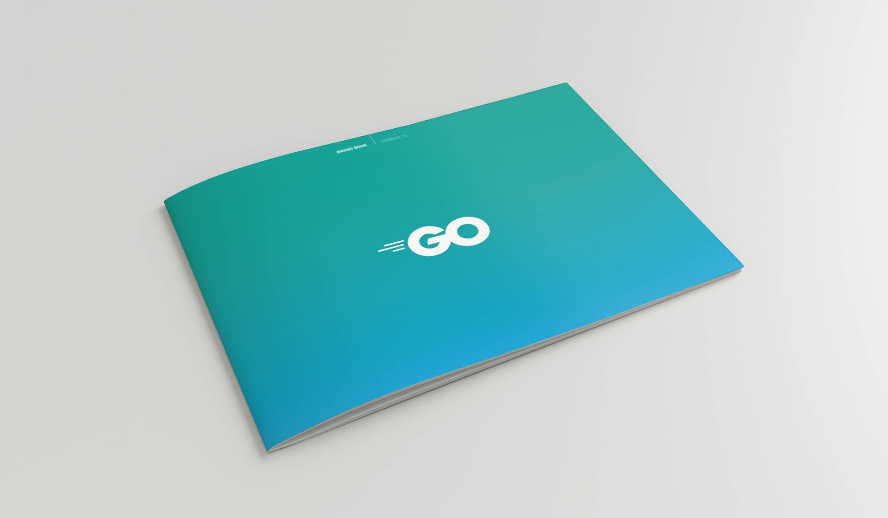
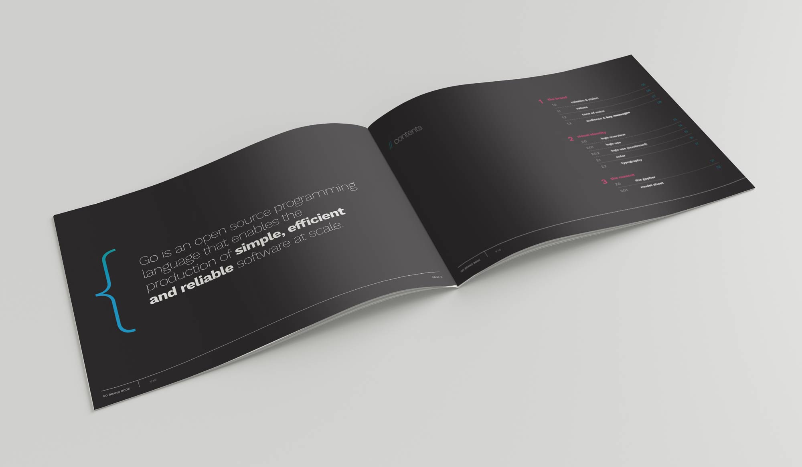

+++
title = "Go 的新品牌"
weight = 13
date = 2023-05-18T17:03:08+08:00
type = "docs"
description = ""
isCJKLanguage = true
draft = false
+++

# Go's New Brand - Go 的新品牌

> 原文：[https://go.dev/blog/go-brand](https://go.dev/blog/go-brand)

Steve Francia
26 April 2018

## Introduction 简介

I am delighted to announce the launch of Go’s new look and logo.

我很高兴地宣布Go的新形象和标志的推出。

Go has been on an amazing journey over the last 8+ years. Our project, community and users have evolved through this journey and we wanted the Go brand to reflect where we have been and convey where we are going.

在过去8年多的时间里，Go已经走过了一段神奇的旅程。我们的项目、社区和用户在这一历程中不断发展，我们希望Go的品牌能够反映我们的过去，并传达我们的未来。

Go’s new brand is about our identity, our values, and our users. Over the past several months we have worked with a brand agency to develop a brand guide for Go. Our agency, [Within](http://within.us/), coordinated with and built upon the great foundation that Renee French established. Rest easy, our beloved Gopher Mascot remains at the center of our brand.

Go的新品牌是关于我们的身份、我们的价值和我们的用户。在过去的几个月里，我们与一家品牌机构合作，为Go制定了品牌指南。我们的机构，Within，与Renee French建立的伟大基础相协调并在此基础上发展。请放心，我们心爱的Gopher吉祥物仍然是我们品牌的中心。

## New Logo 新标志

Our logo follows the brand’s core philosophy of simplicity over complexity. Using a modern, italicized sans-serif typeface combined with three simple motion lines forms a mark that resembles two wheels in rapid motion, communicating speed and efficiency. The circular shape of the letters hints at the eyes of the Go gopher, creating a familiar shape and allowing the mark and the mascot to pair well together.

我们的标志遵循了品牌的核心理念，即简约而不复杂。使用一个现代的斜体无衬线字体，结合三条简单的运动线，形成了一个类似于两个快速运动的车轮的标志，传达了速度和效率。字母的圆形暗示了Go gopher的眼睛，创造了一个熟悉的形状，使标志和吉祥物能够很好地搭配。

Our new logo went through an extensive design process. Here are some of the revisions we went through…

我们的新标志经历了一个广泛的设计过程。以下是我们经历的一些修改...



## New Brand Guide 新的品牌指南

The brand guide establishes the mission, values and voice for the Go project. In general terms, a brand guide is a reference tool for establishing a consistent brand identity. It is sometimes referred to as "brand guidelines" or a "brand book". It is a single document that serves as a guide and reference to designers, writers, and developers to create consistent, on-brand content.

品牌指南确定了Go项目的使命、价值和声音。一般来说，品牌指南是建立统一品牌形象的参考工具。它有时被称为 "品牌指南 "或 "品牌书"。它是一个单一的文件，作为设计师、作家和开发人员的指南和参考，以创造一致的、符合品牌的内容。

## New presentation themes 新的演示主题

In addition to our brand guide we have also developed a presentation theme. This presentation theme will enable us to have a consistent representation of Go in person at meetups and conferences as well as online. Go community members are welcome to use this theme for their own presentations.

除了我们的品牌指南，我们还开发了一个演示主题。这个演示主题将使我们能够在见面会和会议上以及在网上对Go有一个一致的表述。欢迎Go社区成员在他们自己的演示中使用这个主题。

The presentations are available as Google Slides presentations. We chose Google Slides as it is easy to share and maintain updates. People are welcome to port them to Keynote, PowerPoint, etc.

这些演示文稿以谷歌幻灯片的形式提供。我们选择Google Slides是因为它很容易分享和维护更新。欢迎大家把它们移植到Keynote、PowerPoint等。

Like this blog and all our gopher images, the slide themes are Creative Commons Attribution 4.0 licensed. The photos in the slides are all from [unsplash](https://unsplash.com/) and are released under the unsplash license.

就像这个博客和我们所有的地鼠图片一样，幻灯片的主题是以知识共享的方式获得4.0许可的。幻灯片中的照片都来自unsplash，在unsplash许可下发布。

Instructions to use slides:

使用幻灯片的说明：

- Open the [Go Slide Masters](https://go.dev/s/presentation-theme) presentation on Google Slides. 在谷歌幻灯片上打开Go Slide Masters演示文稿。
- File > "Make a Copy" (you may need to log in first) 文件>"制作副本"（您可能需要先登录）。
- Create new slides using the layouts provided in the layouts menu. 使用布局菜单中提供的布局创建新幻灯片。
- Use the included example slides to help guide the styling and creation of your presentation. 使用附带的示例幻灯片来帮助指导您的演示文稿的造型和创作。

### Download 下载

The brand guide, logo and themes are copyrighted by the Go authors.

品牌指南、标志和主题的版权归Go作者所有。

The brand guide contains the guidelines for acceptable logo use.

品牌指南包含可接受的标识使用指南。

- [Brand Book (pdf) 品牌手册 (pdf)](https://go.dev/s/brandbook)
- [Go Logos (zip) Go标志 (zip)](https://go.dev/s/logos)
- [Go Slide Masters (Google Slides) Go 幻灯片大师 (Google Slides)](https://go.dev/s/presentation-theme)

## What’s happening next 接下来会发生什么

The website will be getting a refresh based on the new design. Since we are making significant changes, we are also taking this opportunity to update our website infrastructure to better serve our global community with internationalization and multilingual support. The migration will happen in stages over the next few months starting with this blog.

网站将在新设计的基础上进行更新。由于我们正在进行重大改变，我们也借此机会更新我们的网站基础设施，以便通过国际化和多语言支持更好地服务我们的全球社区。迁移工作将在未来几个月内分阶段进行，从本博客开始。
