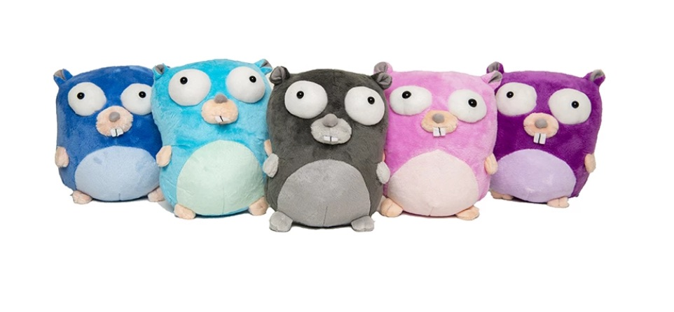

+++
title = "宣布新的go Store"
weight = 13
date = 2023-05-18T17:03:08+08:00
type = "docs"
description = ""
isCJKLanguage = true
draft = false
+++

# Announcing The New Go Store - 宣布新的go Store

> 原文：[https://go.dev/blog/store](https://go.dev/blog/store)

Cassandra Salisbury
18 July 2019

**October 1, 2019, Update:** *The Go Store is currently offline.* *We are sorry for any inconvenience.* *We will update this post with any status changes.*

2019年10月1日，更新：Go Store目前已经下线。我们对造成的不便感到抱歉。我们将根据任何状态变化更新此帖。

We are excited to launch the new Go official swag and merch store, shipping worldwide. We are even more excited to announce that **100% of the proceeds** from the Go store go directly to GoBridge. [GoBridge](https://github.com/gobridge/about-us) is a non-profit organization focused on building bridges to educate underrepresented groups by teaching technical skills and fostering diversity in the Go community.

我们很高兴推出新的Go官方宣传品和商品商店，向全球发货。我们更兴奋地宣布，Go商店的收入100%直接用于GoBridge。GoBridge是一个非营利组织，致力于通过教授技术技能和促进Go社区的多样性，为教育代表性不足的群体搭建桥梁。

At the **Go store** you’ll find our beloved gopher plushies and vinyls as well as new merchandise. Visit the store for 20% off with code **Gopher20** through Sunday, July 21st at 11:59 PM PST.

在Go商店，您会发现我们心爱的地鼠玩具和乙烯基，以及新的商品。在北京时间7月21日（星期日）晚上11:59之前，使用代码Gopher20访问商店可享受20%的折扣。

We plan on adding stock to current items and bringing on new ones to the store. If we are out of stock when you go to place an order, check back again soon. Follow the [Twitter account](https://twitter.com/golang) for updates, we plan on adding new goodies for all our Go fans out there, so keep an eye out!

我们计划在现有商品上增加库存，并为商店带来新的商品。如果您去下订单时，我们已经没有库存了，请尽快再回来看看。关注推特账户的更新，我们计划为所有Go迷增加新的好东西，所以请留意!

Happy shopping!

购物愉快!
