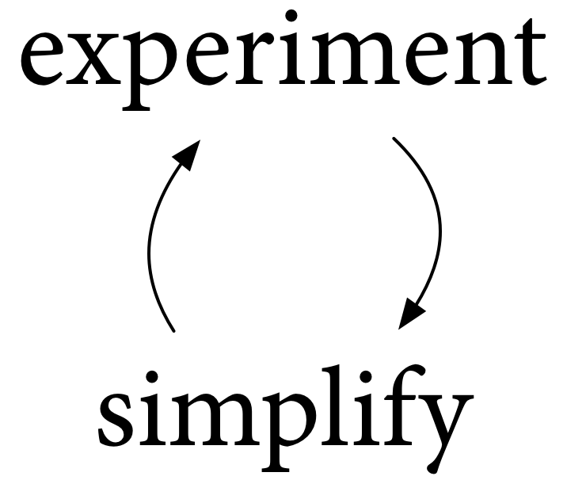
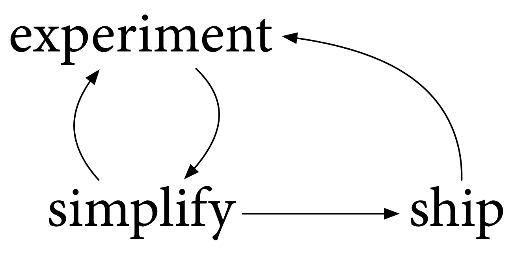
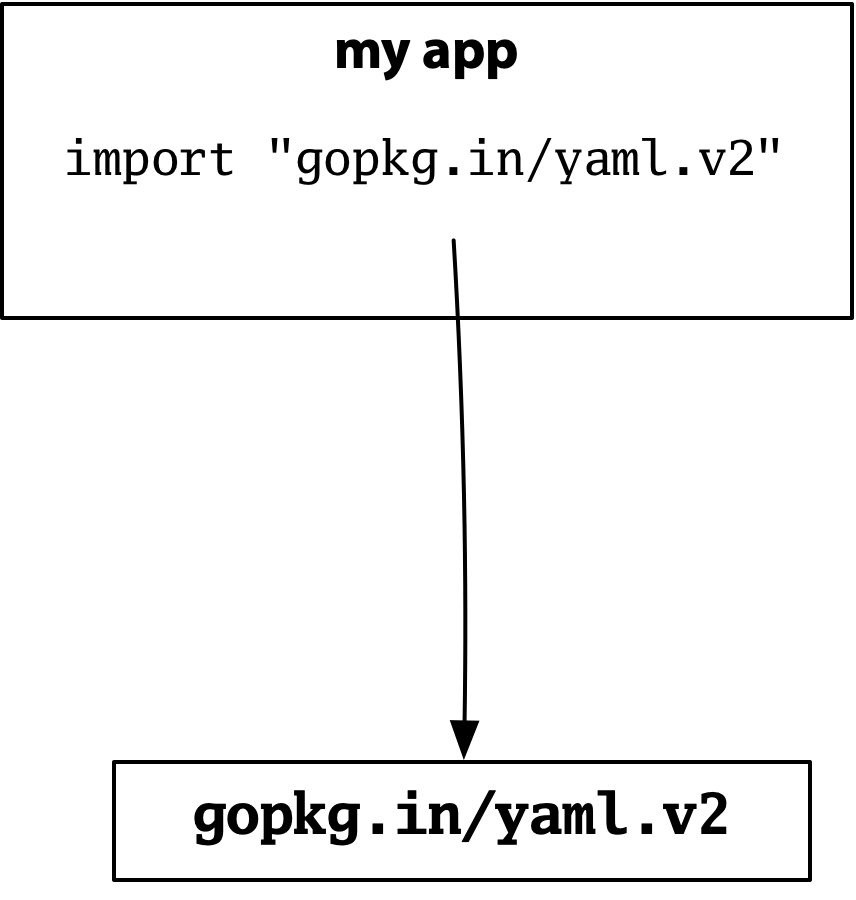
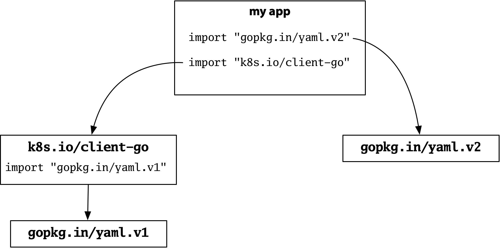

+++
title = "实验, 简化, ship"
weight = 11
date = 2023-05-18T17:03:08+08:00
type = "docs"
description = ""
isCJKLanguage = true
draft = false
+++

# Experiment, Simplify, Ship - 实验, 简化, ship

> 原文：[https://go.dev/blog/experiment](https://go.dev/blog/experiment)

Russ Cox
1 August 2019

## Introduction 简介

This is the blog post version of my talk last week at GopherCon 2019.

这是我上周在GopherCon 2019上的演讲的博文版本。

<iframe src="https://www.youtube.com/embed/kNHo788oO5Y?rel=0" width="560" height="315" frameborder="0" allowfullscreen="" mozallowfullscreen="" webkitallowfullscreen="" style="box-sizing: border-box;"></iframe>

We are all on the path to Go 2, together, but none of us know exactly where that path leads or sometimes even which direction the path goes. This post discusses how we actually find and follow the path to Go 2. Here’s what the process looks like.

我们都在通往Go 2的道路上，但我们都不知道这条路到底通向哪里，有时甚至不知道这条路的方向。这篇文章讨论了我们如何真正找到并遵循通往Go 2的道路。



We experiment with Go as it exists now, to understand it better, learning what works well and what doesn’t. Then we experiment with possible changes, to understand them better, again learning what works well and what doesn’t. Based on what we learn from those experiments, we simplify. And then we experiment again. And then we simplify again. And so on. And so on.

我们对现在的Go进行实验，以更好地了解它，学习哪些地方好用，哪些地方不好用。然后，我们对可能的变化进行实验，以更好地理解它们，再次学习什么是好的，什么是不好的。根据我们从这些实验中学到的东西，我们进行简化。然后我们再做实验。然后我们再次简化。以此类推。以此类推。

## The Four R’s of Simplifying 简化的四个R

During this process, there are four main ways that we can simplify the overall experience of writing Go programs: reshaping, redefining, removing, and restricting.

在这个过程中，我们可以通过四种主要方式来简化编写Go程序的整体体验：重塑、重新定义、删除和限制。

**Simplify by Reshaping** 通过重塑进行简化

The first way we simplify is by reshaping what exists into a new form, one that ends up being simpler overall.

我们的第一种简化方式是将现有的东西重塑为一种新的形式，这种形式最终会使整体更加简单。

Every Go program we write serves as an experiment to test Go itself. In the early days of Go, we quickly learned that it was common to write code like this `addToList` function:

我们编写的每一个Go程序都是测试Go本身的实验。在 Go 的早期，我们很快就了解到，像这样的 addToList 函数的代码很常见：

```go
func addToList(list []int, x int) []int {
    n := len(list)
    if n+1 > cap(list) {
        big := make([]int, n, (n+5)*2)
        copy(big, list)
        list = big
    }
    list = list[:n+1]
    list[n] = x
    return list
}
```

We’d write the same code for slices of bytes, and slices of strings, and so on. Our programs were too complex, because Go was too simple.

我们为字节片和字符串片写了同样的代码，以此类推。我们的程序太复杂了，因为Go太简单了。

So we took the many functions like `addToList` in our programs and reshaped them into one function provided by Go itself. Adding `append` made the Go language a little more complex, but on balance it made the overall experience of writing Go programs simpler, even after accounting for the cost of learning about `append`.

所以我们把我们程序中的许多函数，如addToList，重塑为Go本身提供的一个函数。添加append使Go语言变得更加复杂，但总的来说，它使编写Go程序的整体体验变得更加简单，即使考虑到学习append的成本。

Here’s another example. For Go 1, we looked at the very many development tools in the Go distribution, and we reshaped them into one new command.

下面是另一个例子。对于 Go 1，我们研究了 Go 发行版中的许多开发工具，并将它们重塑为一个新命令。

```
5a      8g
5g      8l
5l      cgo
6a      gobuild
6cov    gofix         →     go
6g      goinstall
6l      gomake
6nm     gopack
8a      govet
```

The `go` command is so central now that it is easy to forget that we went so long without it and how much extra work that involved.

Go命令现在是如此的重要，以至于人们很容易忘记我们在没有它的情况下呆了这么久，以及这涉及到多少额外的工作。

We added code and complexity to the Go distribution, but on balance we simplified the experience of writing Go programs. The new structure also created space for other interesting experiments, which we’ll see later.

我们为Go发行版增加了代码和复杂性，但总的来说我们简化了编写Go程序的体验。新的结构也为其他有趣的实验创造了空间，我们将在后面看到。

**Simplify by Redefining **通过重新定义进行简化

A second way we simplify is by redefining functionality we already have, allowing it to do more. Like simplifying by reshaping, simplifying by redefining makes programs simpler to write, but now with nothing new to learn.

我们的第二种简化方式是重新定义我们已有的功能，让它做得更多。就像通过重塑来简化一样，通过重新定义来简化使程序更容易编写，但现在没有什么新东西需要学习。

For example, `append` was originally defined to read only from slices. When appending to a byte slice, you could append the bytes from another byte slice, but not the bytes from a string. We redefined append to allow appending from a string, without adding anything new to the language.

例如，append最初被定义为只从片断中读取。当追加到一个字节片时，您可以追加另一个字节片的字节，但不能追加一个字符串的字节。我们重新定义了append，允许从一个字符串中追加，而没有给语言添加任何新的内容。

```go
var b []byte
var more []byte
b = append(b, more...) // ok

var b []byte
var more string
b = append(b, more...) // ok later
```

**Simplify by Removing **通过删除进行简化

A third way we simplify is by removing functionality when it has turned out to be less useful or less important than we expected. Removing functionality means one less thing to learn, one less thing to fix bugs in, one less thing to be distracted by or use incorrectly. Of course, removing also forces users to update existing programs, perhaps making them more complex, to make up for the removal. But the overall result can still be that the process of writing Go programs becomes simpler.

我们的第三种简化方式是，当功能被证明比我们预期的不那么有用或不那么重要时，就把它删除。删除功能意味着少了一个需要学习的东西，少了一个需要修复的bug，少了一个被分心或使用错误的东西。当然，删除也迫使用户更新现有的程序，也许使它们更加复杂，以弥补删除的部分。但总的结果还是可以让编写Go程序的过程变得更简单。

An example of this is when we removed the boolean forms of non-blocking channel operations from the language:

这方面的一个例子是，我们从语言中删除了非阻塞通道操作的布尔形式：

```go
ok := c <- x  // before Go 1, was non-blocking send
x, ok := <-c  // before Go 1, was non-blocking receive
```

These operations were also possible to do using `select`, making it confusing to need to decide which form to use. Removing them simplified the language without reducing its power.

这些操作也可以用select来做，使得需要决定使用哪种形式的操作变得混乱。删除这些操作可以简化语言，但不会降低其功能。

**Simplify by Restricting** 通过限制进行简化

We can also simplify by restricting what is allowed. From day one, Go has restricted the encoding of Go source files: they must be UTF-8. This restriction makes every program that tries to read Go source files simpler. Those programs don’t have to worry about Go source files encoded in Latin-1 or UTF-16 or UTF-7 or anything else.

我们也可以通过限制允许的内容来简化。从第一天起，Go就限制了Go源文件的编码：它们必须是UTF-8。这一限制使得每一个试图读取 Go 源文件的程序变得更加简单。这些程序不必担心以Latin-1或UTF-16或UTF-7或其他方式编码的Go源文件。

Another important restriction is `gofmt` for program formatting. Nothing rejects Go code that isn’t formatted using `gofmt`, but we have established a convention that tools that rewrite Go programs leave them in `gofmt` form. If you keep your programs in `gofmt` form too, then these rewriters don’t make any formatting changes. When you compare before and after, the only diffs you see are real changes. This restriction has simplified program rewriters and led to successful experiments like `goimports`, `gorename`, and many others.

另一个重要的限制是用于程序格式化的gofmt。没有任何东西会拒绝没有使用gofmt格式的Go代码，但我们已经建立了一个惯例，即改写Go程序的工具要将其保留为gofmt形式。如果您把您的程序也保持在gofmt形式，那么这些重写工具就不会做任何格式上的改变。当您比较前后的差异时，您看到的唯一差异是真正的变化。这种限制简化了程序改写器，并导致了goimports、gorename等成功的实验。

## Go Development Process Go开发过程

This cycle of experiment and simplify is a good model for what we’ve been doing the past ten years. but it has a problem: it’s too simple. We can’t only experiment and simplify.

这种实验和简化的循环是我们过去十年来一直在做的事情的一个很好的模型。但它有一个问题：它太简单了。我们不能只做实验和简化。

We have to ship the result. We have to make it available to use. Of course, using it enables more experiments, and possibly more simplifying, and the process cycles on and on.

我们必须把结果运送出去。我们必须让它可以使用。当然，使用它可以进行更多的实验，也可能进行更多的简化，这个过程不断循环。



We shipped Go to all of you for the first time on November 10, 2009. Then, with your help, we shipped Go 1 together in March 2012. And we’ve shipped twelve Go releases since then. All of these were important milestones, to enable more experimentation, to help us learn more about Go, and of course to make Go available for production use.

2009年11月10日，我们首次将Go运送给您们所有人。然后，在您们的帮助下，我们在2012年3月一起发布了Go 1。从那时起，我们已经发布了12个Go版本。所有这些都是重要的里程碑，使我们能够进行更多的实验，帮助我们了解更多关于Go的知识，当然还有使Go能够用于生产。

When we shipped Go 1, we explicitly shifted our focus to using Go, to understand this version of the language much better before trying any more simplifications involving language changes. We needed to take time to experiment, to really understand what works and what doesn’t.

当我们发布Go 1时，我们明确地将重点转移到使用Go，在尝试任何涉及语言变化的简化之前，更好地了解这个版本的语言。我们需要花时间进行实验，以真正了解哪些是可行的，哪些是不可行的。

Of course, we’ve had twelve releases since Go 1, so we have still been experimenting and simplifying and shipping. But we’ve focused on ways to simplify Go development without significant language changes and without breaking existing Go programs. For example, Go 1.5 shipped the first concurrent garbage collector and then the following releases improved it, simplifying Go development by removing pause times as an ongoing concern.

当然，自Go 1以来，我们已经发布了12个版本，所以我们仍然在进行实验、简化和发货。但我们一直专注于在不大幅改变语言和不破坏现有 Go 程序的情况下简化 Go 开发的方法。例如，Go 1.5发布了第一个并发的垃圾收集器，然后在随后的版本中对其进行了改进，通过消除暂停时间这一持续关注的问题，简化了Go的开发。

At Gophercon in 2017, we announced that after five years of experimentation, it was again time to think about significant changes that would simplify Go development. Our path to Go 2 is really the same as the path to Go 1: experiment and simplify and ship, towards an overall goal of simplifying Go development.

在2017年的Gophercon上，我们宣布，经过五年的实验，又到了考虑重大变革，简化Go开发的时候了。我们通往Go 2的道路实际上与通往Go 1的道路相同：实验、简化和出货，以实现简化Go开发的总体目标。

For Go 2, the concrete topics that we believed were most important to address are error handling, generics, and dependencies. Since then we have realized that another important topic is developer tooling.

对于Go 2，我们认为最需要解决的具体课题是错误处理、泛型和依赖项。从那时起，我们意识到另一个重要的话题是开发人员的工具。

The rest of this post discusses how our work in each of these areas follows that path. Along the way, we’ll take one detour, stopping to inspect the technical detail of what will be shipping soon in Go 1.13 for error handling.

这篇文章的其余部分将讨论我们在每个领域的工作是如何遵循这一路径的。在这一过程中，我们将绕道而行，停下来检查即将在Go 1.13中推出的错误处理的技术细节。

## Errors 错误

It is hard enough to write a program that works the right way in all cases when all the inputs are valid and correct and nothing the program depends on is failing. When you add errors into the mix, writing a program that works the right way no matter what goes wrong is even harder.

当所有的输入都是有效的、正确的，并且程序所依赖的任何东西都没有失效时，要写一个在所有情况下都能正确工作的程序已经很困难了。如果再加上错误，编写一个无论出什么错都能正常工作的程序就更难了。

As part of thinking about Go 2, we want to understand better whether Go can help make that job any simpler.

作为考虑Go 2的一部分，我们想更好地了解Go是否可以帮助使这项工作变得更简单。

There are two different aspects that could potentially be simplified: error values and error syntax. We’ll look at each in turn, with the technical detour I promised focusing on the Go 1.13 error value changes.

有两个不同的方面有可能被简化：错误值和错误语法。我们将依次看一下这两个方面，而我承诺的技术上的迂回则集中在Go 1.13的错误值变化上。

**Error Values** 错误值

Error values had to start somewhere. Here is the `Read` function from the first version of the `os` package:

错误值必须从某处开始。下面是os包第一个版本中的Read函数：

```go
export func Read(fd int64, b *[]byte) (ret int64, errno int64) {
    r, e := syscall.read(fd, &b[0], int64(len(b)));
    return r, e
}
```

There was no `File` type yet, and also no error type. `Read` and the other functions in the package returned an `errno int64` directly from the underlying Unix system call.

当时还没有文件类型，也没有错误类型。读和包中的其他函数直接从底层的Unix系统调用中返回一个int64的错误。

This code was checked in on September 10, 2008 at 12:14pm. Like everything back then, it was an experiment, and code changed quickly. Two hours and five minutes later, the API changed:

这段代码是在2008年9月10日中午12点14分签入的。像当时的一切一样，这是一个实验，代码变化很快。2小时5分钟后，API发生了变化：

```go
export type Error struct { s string }

func (e *Error) Print() { … } // to standard error!
func (e *Error) String() string { … }

export func Read(fd int64, b *[]byte) (ret int64, err *Error) {
    r, e := syscall.read(fd, &b[0], int64(len(b)));
    return r, ErrnoToError(e)
}
```

This new API introduced the first `Error` type. An error held a string and could return that string and also print it to standard error.

这个新的API引入了第一个错误类型。一个错误持有一个字符串，并可以返回该字符串，还可以将其打印到标准错误。

The intent here was to generalize beyond integer codes. We knew from past experience that operating system error numbers were too limited a representation, that it would simplify programs not to have to shoehorn all detail about an error into 64 bits. Using error strings had worked reasonably well for us in the past, so we did the same here. This new API lasted seven months.

这里的意图是要超越整数代码的泛化。我们从过去的经验中知道，操作系统的错误数字的表示方式太有限了，如果不把所有关于错误的细节塞进64位，就可以简化程序。在过去，使用错误字符串对我们来说相当有效，所以我们在这里也这样做了。这个新的API持续了七个月。

The next April, after more experience using interfaces, we decided to generalize further and allow user-defined error implementations, by making the `os.Error` type itself an interface. We simplified by removing the `Print` method.

第二年四月，在有了更多使用接口的经验后，我们决定进一步概括，允许用户定义的错误实现，把os.Error类型本身变成一个接口。我们通过删除Print方法来简化。

For Go 1 two years later, based on a suggestion by Roger Peppe, `os.Error` became the built-in `error` type, and the `String` method was renamed to `Error`. Nothing has changed since then. But we have written many Go programs, and as a result we have experimented a lot with how best to implement and use errors.

两年后的Go 1，根据Roger Peppe的建议，os.Error成为内置的错误类型，而String方法被重新命名为Error。从那时起，一切都没有改变。但是我们已经写了很多Go程序，因此我们在如何最好地实现和使用错误方面做了很多实验。

**Errors Are Values** 错误是值

Making `error` a simple interface and allowing many different implementations means we have the entire Go language available to define and inspect errors. We like to say that [errors are values](https://blog.golang.org/errors-are-values), the same as any other Go value.

让错误成为一个简单的接口并允许许多不同的实现，意味着我们有整个Go语言可以用来定义和检查错误。我们喜欢说，错误是价值，与任何其他 Go 价值相同。

Here’s an example. On Unix, an attempt to dial a network connection ends up using the `connect` system call. That system call returns a `syscall.Errno`, which is a named integer type that represents a system call error number and implements the `error` interface:

这里有一个例子。在Unix中，试图拨号网络连接的行为最终会使用connect系统调用。该系统调用返回一个syscall.Errno，它是一个命名的整数类型，代表系统调用的错误号，并实现了错误接口：

```go
package syscall

type Errno int64

func (e Errno) Error() string { ... }

const ECONNREFUSED = Errno(61)

    ... err == ECONNREFUSED ...
```

The `syscall` package also defines named constants for the host operating system’s defined error numbers. In this case, on this system, `ECONNREFUSED` is number 61. Code that gets an error from a function can test whether the error is `ECONNREFUSED` using ordinary [value equality](https://go.dev/ref/spec#Comparison_operators).

syscall包还为主机操作系统定义的错误号码定义了命名的常量。在这种情况下，在这个系统上，ECONNREFUSED是编号61。从一个函数中得到错误的代码可以使用普通的值相等来测试错误是否是ECONNREFUSED。

Moving up a level, in package `os`, any system call failure is reported using a larger error structure that records what operation was attempted in addition to the error. There are a handful of these structures. This one, `SyscallError`, describes an error invoking a specific system call with no additional information recorded:

再往上走一级，在包os中，任何系统调用失败都会使用一个更大的错误结构来报告，该结构除了记录错误外，还记录了尝试的操作。这些结构有很多。这个，SyscallError，描述了一个调用特定系统调用的错误，没有记录其他信息：

```go
package os

type SyscallError struct {
    Syscall string
    Err     error
}

func (e *SyscallError) Error() string {
    return e.Syscall + ": " + e.Err.Error()
}
```

Moving up another level, in package `net`, any network failure is reported using an even larger error structure that records the details of the surrounding network operation, such as dial or listen, and the network and addresses involved:

再往上走，在包net中，任何网络故障都会使用一个更大的错误结构来报告，该结构记录了周围网络操作的细节，如拨号或监听，以及涉及的网络和地址：

```go
package net

type OpError struct {
    Op     string
    Net    string
    Source Addr
    Addr   Addr
    Err    error
}

func (e *OpError) Error() string { ... }
```

Putting these together, the errors returned by operations like `net.Dial` can format as strings, but they are also structured Go data values. In this case, the error is a `net.OpError`, which adds context to an `os.SyscallError`, which adds context to a `syscall.Errno`:

把这些放在一起，由net.Dial这样的操作返回的错误可以格式化为字符串，但它们也是结构化的Go数据值。在这种情况下，错误是net.OpError，它将上下文添加到os.SyscallError，它将上下文添加到syscall.Errno：

```go
c, err := net.Dial("tcp", "localhost:50001")

// "dial tcp [::1]:50001: connect: connection refused"

err is &net.OpError{
    Op:   "dial",
    Net:  "tcp",
    Addr: &net.TCPAddr{IP: ParseIP("::1"), Port: 50001},
    Err: &os.SyscallError{
        Syscall: "connect",
        Err:     syscall.Errno(61), // == ECONNREFUSED
    },
}
```

When we say errors are values, we mean both that the entire Go language is available to define them and also that the entire Go language is available to inspect them.

当我们说错误是数值时，我们的意思是整个Go语言都可以用来定义它们，同时也可以用整个Go语言来检查它们。

Here is an example from package net. It turns out that when you attempt a socket connection, most of the time you will get connected or get connection refused, but sometimes you can get a spurious `EADDRNOTAVAIL`, for no good reason. Go shields user programs from this failure mode by retrying. To do this, it has to inspect the error structure to find out whether the `syscall.Errno` deep inside is `EADDRNOTAVAIL`.

下面是一个来自包net的例子。事实证明，当您试图进行套接字连接时，大多数时候您都会被连接上或者被拒绝连接，但有时您会毫无理由地得到一个虚假的EADDRNOTAVAIL。Go通过重试来保护用户程序免受这种失败模式的影响。要做到这一点，它必须检查错误结构，以找出里面的syscall.Errno是否为EADDRNOTAVAIL。

Here is the code:

下面是代码：

```go
func spuriousENOTAVAIL(err error) bool {
    if op, ok := err.(*OpError); ok {
        err = op.Err
    }
    if sys, ok := err.(*os.SyscallError); ok {
        err = sys.Err
    }
    return err == syscall.EADDRNOTAVAIL
}
```

A [type assertion](https://go.dev/ref/spec#Type_assertions) peels away any `net.OpError` wrapping. And then a second type assertion peels away any `os.SyscallError` wrapping. And then the function checks the unwrapped error for equality with `EADDRNOTAVAIL`.

一个类型断言剥去了任何net.OpError的包装。然后第二个类型断言剥去了任何os.SyscallError的包装。然后，该函数检查解包后的错误是否与EADDRNOTAVAIL相等。

What we’ve learned from years of experience, from this experimenting with Go errors, is that it is very powerful to be able to define arbitrary implementations of the `error` interface, to have the full Go language available both to construct and to deconstruct errors, and not to require the use of any single implementation.

从多年的经验中，从Go错误的实验中，我们了解到，能够任意定义错误接口的实现，用完整的Go语言来构造和解构错误，并且不要求使用任何单一的实现，是非常强大的。

These properties—that errors are values, and that there is not one required error implementation—are important to preserve.

这些特性--错误是价值，并且没有一个必要的错误实现--对于保留这些特性非常重要。

Not mandating one error implementation enabled everyone to experiment with additional functionality that an error might provide, leading to many packages, such as [github.com/pkg/errors](https://godoc.org/github.com/pkg/errors), [gopkg.in/errgo.v2](https://godoc.org/gopkg.in/errgo.v2), [github.com/hashicorp/errwrap](https://godoc.org/github.com/hashicorp/errwrap), [upspin.io/errors](https://godoc.org/upspin.io/errors), [github.com/spacemonkeygo/errors](https://godoc.org/github.com/spacemonkeygo/errors), and more.

不强制要求一种错误实现，使每个人都能尝试错误可能提供的其他功能，从而产生了许多包，如github.com/pkg/errors、gopkg.in/errgo.v2、github.com/hashicorp/errwrap、upspin.io/errors、github.com/spacemonkeygo/errors等等。

One problem with unconstrained experimentation, though, is that as a client you have to program to the union of all the possible implementations you might encounter. A simplification that seemed worth exploring for Go 2 was to define a standard version of commonly-added functionality, in the form of agreed-upon optional interfaces, so that different implementations could interoperate.

不过，无约束的实验的一个问题是，作为一个客户端，您必须按照您可能遇到的所有可能的实现的联合体来编程。在Go 2中，一个值得探索的简化方法是，以商定的可选接口的形式，定义常用功能的标准版本，以便不同的实现可以相互操作。

**Unwrap** 解除封装

The most commonly-added functionality in these packages is some method that can be called to remove context from an error, returning the error inside. Packages use different names and meanings for this operation, and sometimes it removes one level of context, while sometimes it removes as many levels as possible.

这些包中最常见的功能是一些可以被调用的方法，用于从错误中移除上下文，返回里面的错误。包对这一操作使用了不同的名称和含义，有时它可以移除一层上下文，而有时它可以移除尽可能多的层次。

For Go 1.13, we have introduced a convention that an error implementation adding removable context to an inner error should implement an `Unwrap` method that returns the inner error, unwrapping the context. If there is no inner error appropriate to expose to callers, either the error shouldn’t have an `Unwrap` method, or the `Unwrap` method should return nil.

对于Go 1.13，我们引入了一个惯例，即为内部错误添加可移除上下文的错误实现应该实现一个Unwrap方法，返回内部错误，解除上下文。如果没有合适的内部错误暴露给调用者，要么错误就不应该有Unwrap方法，要么Unwrap方法应该返回nil。

```go
// Go 1.13 optional method for error implementations.

interface {
    // Unwrap removes one layer of context,
    // returning the inner error if any, or else nil.
    Unwrap() error
}
```

The way to call this optional method is to invoke the helper function `errors.Unwrap`, which handles cases like the error itself being nil or not having an `Unwrap` method at all.

调用这个可选方法的方法是调用辅助函数 errors.Unwrap，它可以处理错误本身为nil或根本没有Unwrap方法等情况。

```go
package errors

// Unwrap returns the result of calling
// the Unwrap method on err,
// if err’s type defines an Unwrap method.
// Otherwise, Unwrap returns nil.
func Unwrap(err error) error
```

We can use the `Unwrap` method to write a simpler, more general version of `spuriousENOTAVAIL`. Instead of looking for specific error wrapper implementations like `net.OpError` or `os.SyscallError`, the general version can loop, calling `Unwrap` to remove context, until either it reaches `EADDRNOTAVAIL` or there’s no error left:

我们可以使用Unwrap方法来写一个更简单、更通用的spuriousENOTAVAIL版本。一般的版本不需要寻找特定的错误封装器实现，比如net.OpError或os.SyscallError，而是可以循环，调用Unwrap来移除上下文，直到达到EADDRNOTAVAIL或者没有错误为止：

```go
func spuriousENOTAVAIL(err error) bool {
    for err != nil {
        if err == syscall.EADDRNOTAVAIL {
            return true
        }
        err = errors.Unwrap(err)
    }
    return false
}
```

This loop is so common, though, that Go 1.13 defines a second function, `errors.Is`, that repeatedly unwraps an error looking for a specific target. So we can replace the entire loop with a single call to `errors.Is`:

这个循环非常常见，因此Go 1.13定义了第二个函数 errors.Is，它可以重复解包一个错误，寻找一个特定的目标。因此，我们可以用对 errors.Is 的一次调用来代替整个循环：

```go
func spuriousENOTAVAIL(err error) bool {
    return errors.Is(err, syscall.EADDRNOTAVAIL)
}
```

At this point we probably wouldn’t even define the function; it would be equally clear, and simpler, to call `errors.Is` directly at the call sites.

在这一点上，我们可能甚至不会定义这个函数；直接在调用点上调用 errors.Is 同样清楚，而且更简单。

Go 1.13 also introduces a function `errors.As` that unwraps until it finds a specific implementation type.

Go 1.13还引入了一个函数 errors.As，它可以解开包装直到找到一个特定的实现类型。

If you want to write code that works with arbitrarily-wrapped errors, `errors.Is` is the wrapper-aware version of an error equality check:

如果您想编写能处理任意包装的错误的代码，errors.Is是错误平等检查的包装器意识版本：

```go
err == target

    →

errors.Is(err, target)
```

And `errors.As` is the wrapper-aware version of an error type assertion:

而error.As是错误类型断言的包装器感知版本：

```go
target, ok := err.(*Type)
if ok {
    ...
}

    →

var target *Type
if errors.As(err, &target) {
   ...
}
```

**To Unwrap Or Not To Unwrap?** 解包还是不解包？

Whether to make it possible to unwrap an error is an API decision, the same way that whether to export a struct field is an API decision. Sometimes it is appropriate to expose that detail to calling code, and sometimes it isn’t. When it is, implement Unwrap. When it isn’t, don’t implement Unwrap.

是否让错误解包成为可能是一个API决定，就像是否导出一个结构字段是一个API决定一样。有时向调用代码公开这一细节是合适的，而有时则不合适。如果是这样，就实现Unwrap。如果不是这样，就不要实现Unwrap。

Until now, `fmt.Errorf` has not exposed an underlying error formatted with `%v` to caller inspection. That is, the result of `fmt.Errorf` has not been possible to unwrap. Consider this example:

到目前为止，fmt.Errorf还没有将一个以%v为格式的底层错误暴露给调用者检查。也就是说，fmt.Errorf的结果不可能被解包。考虑一下这个例子：

```go
// errors.Unwrap(err2) == nil
// err1 is not available (same as earlier Go versions)
err2 := fmt.Errorf("connect: %v", err1)
```

If `err2` is returned to a caller, that caller has never had any way to open up `err2` and access `err1`. We preserved that property in Go 1.13.

如果err2被返回给调用者，该调用者从来没有任何办法打开err2和访问err1。我们在Go 1.13中保留了这个属性。

For the times when you do want to allow unwrapping the result of `fmt.Errorf`, we also added a new printing verb `%w`, which formats like `%v`, requires an error value argument, and makes the resulting error’s `Unwrap` method return that argument. In our example, suppose we replace `%v` with `%w`:

当您想允许解开fmt.Errorf的结果时，我们还增加了一个新的打印动词%w，它的格式和%v一样，需要一个错误值参数，并使产生错误的Unwrap方法返回该参数。在我们的例子中，假设我们用%w替换%v：

```go
// errors.Unwrap(err4) == err3
// (%w is new in Go 1.13)
err4 := fmt.Errorf("connect: %w", err3)
```

Now, if `err4` is returned to a caller, the caller can use `Unwrap` to retrieve `err3`.

现在，如果err4被返回给调用者，调用者可以使用Unwrap来检索err3。

It is important to note that absolute rules like "always use `%v` (or never implement `Unwrap`)" or "always use `%w` (or always implement `Unwrap`)" are as wrong as absolute rules like "never export struct fields" or "always export struct fields." Instead, the right decision depends on whether callers should be able to inspect and depend on the additional information that using `%w` or implementing `Unwrap` exposes.

需要注意的是，像 "总是使用%v（或从不实现Unwrap）"或 "总是使用%w（或总是实现Unwrap）"这样的绝对规则和 "从不导出结构字段 "或 "总是导出结构字段 "这样的绝对规则一样是错误的。相反，正确的决定取决于调用者是否应该能够检查并依赖使用%w或实现Unwrap所暴露的额外信息。

As an illustration of this point, every error-wrapping type in the standard library that already had an exported `Err` field now also has an `Unwrap` method returning that field, but implementations with unexported error fields do not, and existing uses of `fmt.Errorf` with `%v` still use `%v`, not `%w`.

作为对这一点的说明，标准库中每一个已经导出Err字段的错误包装类型现在都有一个返回该字段的Unwrap方法，但具有未导出的错误字段的实现却没有，现有的使用%v的fmt.Errorf仍然使用%v，而不是%w。

**Error Value Printing (Abandoned) **错误值打印（已放弃）

Along with the design draft for Unwrap, we also published a [design draft for an optional method for richer error printing](https://go.dev/design/go2draft-error-printing), including stack frame information and support for localized, translated errors.

与Unwrap的设计草案一起，我们还发布了一个可选方法的设计草案，用于更丰富的错误打印，包括堆栈框架信息和对本地化、翻译错误的支持。

```go
// Optional method for error implementations
type Formatter interface {
    Format(p Printer) (next error)
}

// Interface passed to Format
type Printer interface {
    Print(args ...interface{})
    Printf(format string, args ...interface{})
    Detail() bool
}
```

This one is not as simple as `Unwrap`, and I won’t go into the details here. As we discussed the design with the Go community over the winter, we learned that the design wasn’t simple enough. It was too hard for individual error types to implement, and it did not help existing programs enough. On balance, it did not simplify Go development.

这个没有Unwrap那么简单，我在这里就不多说了。当我们在冬天与Go社区讨论这个设计时，我们了解到这个设计还不够简单。它对个别错误类型的实现太难了，而且对现有程序的帮助也不够大。总的来说，它并没有简化Go的开发。

As a result of this community discussion, we abandoned this printing design.

作为社区讨论的结果，我们放弃了这个打印设计。

**Error Syntax** 错误语法

That was error values. Let’s look briefly at error syntax, another abandoned experiment.

这就是错误值。让我们简单地看看错误语法，这是另一个被放弃的实验。

Here is some code from [`compress/lzw/writer.go`](https://go.googlesource.com/go/+/go1.12/src/compress/lzw/writer.go#209) in the standard library:

下面是标准库中compress/lzw/writer.go的一些代码：

```go
// Write the savedCode if valid.
if e.savedCode != invalidCode {
    if err := e.write(e, e.savedCode); err != nil {
        return err
    }
    if err := e.incHi(); err != nil && err != errOutOfCodes {
        return err
    }
}

// Write the eof code.
eof := uint32(1)<<e.litWidth + 1
if err := e.write(e, eof); err != nil {
    return err
}
```

At a glance, this code is about half error checks. My eyes glaze over when I read it. And we know that code that is tedious to write and tedious to read is easy to misread, making it a good home for hard-to-find bugs. For example, one of these three error checks is not like the others, a fact that is easy to miss on a quick skim. If you were debugging this code, how long would it take to notice that?

一眼望去，这段代码大约有一半是错误检查。当我读它的时候，我的眼睛会发亮。我们知道，写起来繁琐，读起来也繁琐的代码很容易被误读，从而成为难以发现的bug的好地方。例如，这三个错误检查中的一个和其他的不一样，这个事实在快速浏览时很容易错过。如果您在调试这段代码，需要多长时间才能注意到这一点？

At Gophercon last year we [presented a draft design](https://go.dev/design/go2draft-error-handling) for a new control flow construct marked by the keyword `check`. `Check` consumes the error result from a function call or expression. If the error is non-nil, the `check` returns that error. Otherwise the `check` evaluates to the other results from the call. We can use `check` to simplify the lzw code:

在去年的Gophercon会议上，我们提出了一个新的控制流结构的设计草案，以关键字check为标志。检查会消耗来自函数调用或表达式的错误结果。如果错误是非空的，检查会返回该错误。否则，检查会对调用的其他结果进行评估。我们可以使用check来简化lzw代码：

```go
// Write the savedCode if valid.
if e.savedCode != invalidCode {
    check e.write(e, e.savedCode)
    if err := e.incHi(); err != errOutOfCodes {
        check err
    }
}

// Write the eof code.
eof := uint32(1)<<e.litWidth + 1
check e.write(e, eof)
```

This version of the same code uses `check`, which removes four lines of code and more importantly highlights that the call to `e.incHi` is allowed to return `errOutOfCodes`.

同一代码的这个版本使用了check，删除了四行代码，更重要的是强调了对e.incHi的调用被允许返回errOutOfCodes。

Maybe most importantly, the design also allowed defining error handler blocks to be run when later checks failed. That would let you write shared context-adding code just once, like in this snippet:

也许最重要的是，该设计还允许定义错误处理程序块，以便在后来的检查失败时运行。这可以让您只写一次共享的上下文添加代码，就像在这个片段中：

```go
handle err {
    err = fmt.Errorf("closing writer: %w", err)
}

// Write the savedCode if valid.
if e.savedCode != invalidCode {
    check e.write(e, e.savedCode)
    if err := e.incHi(); err != errOutOfCodes {
        check err
    }
}

// Write the eof code.
eof := uint32(1)<<e.litWidth + 1
check e.write(e, eof)
```

In essence, `check` was a short way to write the `if` statement, and `handle` was like [`defer`](https://go.dev/ref/spec#Defer_statements) but only for error return paths. In contrast to exceptions in other languages, this design retained Go’s important property that every potential failing call was marked explicitly in the code, now using the `check` keyword instead of `if err != nil`.

从本质上讲，check是写if语句的一种简短方式，handle就像defer一样，但只适用于错误的返回路径。与其他语言中的异常相反，这种设计保留了Go的重要特性，即每一个潜在的失败调用都在代码中被明确标记，现在使用check关键字而不是if err != nil。

The big problem with this design was that `handle` overlapped too much, and in confusing ways, with `defer`.

这个设计的最大问题是handle与defer重叠太多，而且是以混乱的方式重叠。

In May we posted [a new design with three simplifications](https://go.dev/design/32437-try-builtin): to avoid the confusion with `defer`, the design dropped `handle` in favor of just using `defer`; to match a similar idea in Rust and Swift, the design renamed `check` to `try`; and to allow experimentation in a way that existing parsers like `gofmt` would recognize, it changed `check` (now `try`) from a keyword to a built-in function.

5月，我们发布了一个新的设计，其中有三个简化：为了避免与defer的混淆，该设计放弃了handle，而只使用defer；为了与Rust和Swift中的类似想法相匹配，该设计将check更名为try；为了允许以gofmt等现有解析器能够识别的方式进行实验，它将check（现在是try）从一个关键字改为一个内置函数。

Now the same code would look like this:

现在，同样的代码看起来是这样的：

```go
defer errd.Wrapf(&err, "closing writer")

// Write the savedCode if valid.
if e.savedCode != invalidCode {
    try(e.write(e, e.savedCode))
    if err := e.incHi(); err != errOutOfCodes {
        try(err)
    }
}

// Write the eof code.
eof := uint32(1)<<e.litWidth + 1
try(e.write(e, eof))
```

We spent most of June discussing this proposal publicly on GitHub.

我们花了6月份的大部分时间在GitHub上公开讨论这个提议。

The fundamental idea of `check` or `try` was to shorten the amount of syntax repeated at each error check, and in particular to remove the `return` statement from view, keeping the error check explicit and better highlighting interesting variations. One interesting point raised during the public feedback discussion, however, was that without an explicit `if` statement and `return`, there’s nowhere to put a debugging print, there’s nowhere to put a breakpoint, and there’s no code to show as unexecuted in code coverage results. The benefits we were after came at the cost of making these situations more complex. On balance, from this as well as other considerations, it was not at all clear that the overall result would be simpler Go development, so we abandoned this experiment.

check或try的基本想法是缩短每次错误检查时重复的语法量，特别是将返回语句从视图中移除，保持错误检查的明确性，并更好地突出有趣的变化。然而，在公众反馈讨论中提出的一个有趣的观点是，如果没有明确的if语句和返回，就没有地方可以放调试打印，没有地方可以放断点，也没有代码可以在代码覆盖结果中显示为未执行。我们所追求的好处是以使这些情况更加复杂为代价的。总的来说，从这一点以及其他方面的考虑来看，并不清楚整体的结果是否会使Go的开发更简单，所以我们放弃了这个实验。

That’s everything about error handling, which was one of the main focuses for this year.

这就是关于错误处理的一切，这也是今年的主要焦点之一。

## Generics 泛型

Now for something a little less controversial: generics.

现在是争议较少的内容：泛型。

The second big topic we identified for Go 2 was some kind of way to write code with type parameters. This would enable writing generic data structures and also writing generic functions that work with any kind of slice, or any kind of channel, or any kind of map. For example, here is a generic channel filter:

我们为Go 2确定的第二个大主题是用某种方式来编写带有类型参数的代码。这样就可以编写通用数据结构，也可以编写通用函数，与任何类型的片断、任何类型的通道或任何类型的地图一起工作。例如，这里有一个通用的通道过滤器：

```go
// Filter copies values from c to the returned channel,
// passing along only those values satisfying f.
func Filter(type value)(f func(value) bool, c <-chan value) <-chan value {
    out := make(chan value)
    go func() {
        for v := range c {
            if f(v) {
                out <- v
            }
        }
        close(out)
    }()
    return out
}
```

We’ve been thinking about generics since work on Go began, and we wrote and rejected our first concrete design in 2010. We wrote and rejected three more designs by the end of 2013. Four abandoned experiments, but not failed experiments, We learned from them, like we learned from `check` and `try`. Each time, we learned that the path to Go 2 is not in that exact direction, and we noticed other directions that might be interesting to explore. But by 2013 we had decided that we needed to focus on other concerns, so we put the entire topic aside for a few years.

自从Go的工作开始以来，我们就一直在思考泛型问题，我们在2010年写了第一个具体的设计并被拒绝。到2013年底，我们又写了三个设计并被拒绝。四个被放弃的实验，但不是失败的实验。我们从它们身上学到了东西，就像我们从check和try学到的一样。每一次，我们都了解到通往Go2的道路并不在那个确切的方向上，而且我们注意到其他可能值得探索的方向。但是到了2013年，我们决定需要关注其他的问题，所以我们把整个话题搁置了好几年。

Last year we started exploring and experimenting again, and we presented a [new design](https://github.com/golang/proposal/blob/master/design/go2draft-contracts.md), based on the idea of a contract, at Gophercon last summer. We’ve continued to experiment and simplify, and we’ve been working with programming language theory experts to understand the design better.

去年我们又开始探索和实验，去年夏天我们在Gophercon上展示了一个新的设计，基于合同的想法。我们继续进行实验和简化，并与编程语言理论专家合作，以更好地理解这个设计。

Overall, I am hopeful that we’re headed in a good direction, toward a design that will simplify Go development. Even so, we might find that this design doesn’t work either. We might have to abandon this experiment and adjust our path based on what we learned. We’ll find out.

总的来说，我希望我们正朝着一个好的方向前进，朝着一个能够简化Go开发的设计前进。即便如此，我们也可能发现这种设计也不可行。我们可能不得不放弃这个实验，并根据我们学到的东西来调整我们的道路。我们会发现的。

At Gophercon 2019, Ian Lance Taylor talked about why we might want to add generics to Go and briefly previewed the latest design draft. For details, see his blog post "[Why Generics?](https://blog.golang.org/why-generics)"

在Gophercon 2019上，Ian Lance Taylor谈到了为什么我们可能要在Go中添加泛型，并简要地预览了最新的设计草案。详情请见他的博文 "为什么是泛型？"

## Dependencies 依赖项

The third big topic we identified for Go 2 was dependency management.

我们为Go 2确定的第三个大主题是依赖项管理。

In 2010 we published a tool called `goinstall`, which we called "[an experiment in package installation](https://groups.google.com/forum/#!msg/golang-nuts/8JFwR3ESjjI/cy7qZzN7Lw4J)." It downloaded dependencies and stored them in your Go distribution tree, in GOROOT.

2010年，我们发布了一个名为goinstall的工具，我们称之为 "软件包安装的实验"。它下载了依赖关系，并将其存储在您的Go分布树中，即GOROOT中。

As we experimented with `goinstall`, we learned that the Go distribution and the installed packages should be kept separate, so that it was possible to change to a new Go distribution without losing all your Go packages. So in 2011 we introduced `GOPATH`, an environment variable that specified where to look for packages not found in the main Go distribution.

在 goinstall 的实验过程中，我们了解到 Go 发行版和所安装的软件包应该是分开的，这样才有可能在更换新的 Go 发行版时不会丢失所有的 Go 包。所以在2011年，我们引入了GOPATH，这是一个环境变量，用来指定在哪里寻找Go主发行版中没有的包。

Adding GOPATH created more places for Go packages but simplified Go development overall, by separating your Go distribution from your Go libraries.

添加 GOPATH 为 Go 包创造了更多的位置，但通过将您的 Go 发行版与您的 Go 库分开，总体上简化了 Go 开发。

**Compatibility** 兼容性

The `goinstall` experiment intentionally left out an explicit concept of package versioning. Instead, `goinstall` always downloaded the latest copy. We did this so we could focus on the other design problems for package installation.

goinstall 实验故意不考虑软件包版本的明确概念。相反，goinstall 始终下载最新的副本。我们这样做是为了让我们能够专注于软件包安装的其他设计问题。

`Goinstall` became `go get` as part of Go 1. When people asked about versions, we encouraged them to experiment by creating additional tools, and they did. And we encouraged package authors to provide their users with the same backwards compatibility we did for the Go 1 libraries. Quoting [the Go FAQ](https://go.dev/doc/faq#get_version):

Goinstall作为Go 1的一部分变成了go get。当人们问及版本问题时，我们鼓励他们通过创建额外的工具来进行实验，他们也确实这样做了。我们也鼓励软件包作者为他们的用户提供与 Go 1 库相同的向后兼容性。引用 Go FAQ 的话：

"Packages intended for public use should try to maintain backwards compatibility as they evolve.

"供公众使用的软件包应该在其发展过程中尽量保持向后兼容。

If different functionality is required, add a new name instead of changing an old one.

如果需要不同的功能，请添加一个新的名字，而不是改变一个旧的名字。

If a complete break is required, create a new package with a new import path."

如果需要完全中断，则创建一个新的包，并有一个新的导入路径"。

This convention simplifies the overall experience of using a package by restricting what authors can do: avoid breaking changes to APIs; give new functionality a new name; and give a whole new package design a new import path.

这个约定通过限制作者可以做的事情，简化了使用包的整体体验：避免对API的破坏性改变；给新的功能一个新的名字；给一个全新的包设计一个新的导入路径。

Of course, people kept experimenting. One of the most interesting experiments was started by Gustavo Niemeyer. He created a Git redirector called [`gopkg.in`](https://gopkg.in/), which provided different import paths for different API versions, to help package authors follow the convention of giving a new package design a new import path.

当然，人们不断地进行实验。其中一个最有趣的实验是由Gustavo Niemeyer发起的。他创建了一个名为gopkg.in的Git重定向器，为不同的API版本提供不同的导入路径，以帮助包作者遵循给新的包设计一个新的导入路径的惯例。

For example, the Go source code in the GitHub repository [go-yaml/yaml](https://github.com/go-yaml/yaml) has different APIs in the v1 and v2 semantic version tags. The `gopkg.in` server provides these with different import paths [gopkg.in/yaml.v1](https://godoc.org/gopkg.in/yaml.v1) and [gopkg.in/yaml.v2](https://godoc.org/gopkg.in/yaml.v2).

例如，GitHub仓库go-yaml/yaml中的Go源代码在v1和v2语义版本标签中有不同的API。gopkg.in服务器用不同的导入路径gopkg.in/yaml.1和gopkg.in/yaml.2提供这些。

The convention of providing backwards compatibility, so that a newer version of a package can be used in place of an older version, is what makes `go get`’s very simple rule—"always download the latest copy"—work well even today.

提供向后兼容性的惯例，使一个软件包的较新版本可以用来替代较旧的版本，是使go get的非常简单的规则--"总是下载最新的副本"--即使在今天也很有效的原因。

**Versioning And Vendoring** 版本管理和第三方

But in production contexts you need to be more precise about dependency versions, to make builds reproducible.

但在生产环境中，您需要对依赖版本更加精确，以保证构建的可重复性。

Many people experimented with what that should look like, building tools that served their needs, including Keith Rarick’s `goven` (2012) and `godep` (2013), Matt Butcher’s `glide` (2014), and Dave Cheney’s `gb` (2015). All of these tools use the model that you copy dependency packages into your own source control repository. The exact mechanisms used to make those packages available for import varied, but they were all more complex than it seemed they should be.

许多人都在试验这应该是什么样子，建立了符合他们需求的工具，包括Keith Rarick的goven（2012）和godep（2013），Matt Butcher的glide（2014），以及Dave Cheney的gb（2015）。所有这些工具都使用这样的模式：您把依赖包复制到您自己的源控制库中。用于使这些包可用于导入的确切机制各不相同，但它们都比看起来应该的要复杂。

After a community-wide discussion, we adopted a proposal by Keith Rarick to add explicit support for referring to copied dependencies without GOPATH tricks. This was simplifying by reshaping: like with `addToList` and `append`, these tools were already implementing the concept, but it was more awkward than it needed to be. Adding explicit support for vendor directories made these uses simpler overall.

经过整个社区的讨论，我们采纳了Keith Rarick的建议，增加了对引用复制的依赖包的明确支持，而没有使用GOPATH技巧。这是通过重塑来简化的：就像addToList和append一样，这些工具已经实现了这个概念，但它比需要的要笨拙得多。增加对供应商目录的明确支持使得这些使用总体上更加简单。

Shipping vendor directories in the `go` command led to more experimentation with vendoring itself, and we realized that we had introduced a few problems. The most serious was that we lost *package uniqueness*. Before, during any given build, an import path might appear in lots of different packages, and all the imports referred to the same target. Now with vendoring, the same import path in different packages might refer to different vendored copies of the package, all of which would appear in the final resulting binary.

在go命令中运送供应商目录导致了对供应商本身的更多试验，我们意识到我们引入了一些问题。最严重的是，我们失去了软件包的唯一性。以前，在任何特定的构建过程中，一个导入路径可能会出现在许多不同的包中，而所有的导入都指向同一个目标。现在有了vendoring，不同软件包中的同一个导入路径可能指的是不同的软件包的vendored副本，所有这些都会出现在最终的二进制文件中。

At the time, we didn’t have a name for this property: package uniqueness. It was just how the GOPATH model worked. We didn’t completely appreciate it until it went away.

当时，我们还没有为这个属性起一个名字：包的唯一性。这只是GOPATH模型的工作方式。在它消失之前，我们并没有完全理解它。

There is a parallel here with the `check` and `try` error syntax proposals. In that case, we were relying on how the visible `return` statement worked in ways we didn’t appreciate until we considered removing it.

这里有一个与检查和尝试错误语法建议平行的问题。在这种情况下，我们依赖于可见的返回语句的工作方式，直到我们考虑删除它，我们才明白。

When we added vendor directory support, there were many different tools for managing dependencies. We thought that a clear agreement about the format of vendor directories and vendoring metadata would allow the various tools to interoperate, the same way that agreement about how Go programs are stored in text files enables interoperation between the Go compiler, text editors, and tools like `goimports` and `gorename`.

当我们添加供应商目录支持时，有许多不同的工具用于管理依赖项。我们认为，就供应商目录和供应商元数据的格式达成明确的协议将使各种工具能够相互协作，就像就Go程序如何存储在文本文件中达成协议使Go编译器、文本编辑器以及goimports和gorename等工具之间能够相互协作一样。

This turned out to be naively optimistic. The vendoring tools all differed in subtle semantic ways. Interoperation would require changing them all to agree about the semantics, likely breaking their respective users. Convergence did not happen.

这被证明是天真乐观的。这些销售工具在语义上都有细微的差别。互通需要改变它们的语义以达成一致，这可能会破坏它们各自的用户。融合并没有发生。

**Dep** 深度

At Gophercon in 2016, we started an effort to define a single tool to manage dependencies. As part of that effort, we conducted surveys with many different kinds of users to understand what they needed as far as dependency management, and a team started work on a new tool, which became `dep`.

在2016年的Gophercon上，我们开始努力定义一个单一的工具来管理依赖项。作为这项工作的一部分，我们对许多不同类型的用户进行了调查，以了解他们在依赖项管理方面的需求，一个团队开始着手开发一个新工具，这就是Dep。

`Dep` aimed to be able to replace all the existing dependency management tools. The goal was to simplify by reshaping the existing different tools into a single one. It partly accomplished that. `Dep` also restored package uniqueness for its users, by having only one vendor directory at the top of the project tree.

Dep的目标是能够取代所有现有的依赖项管理工具。我们的目标是通过将现有的不同工具重塑为一个单一的工具来进行简化。它部分地实现了这一点。Dep还为其用户恢复了软件包的唯一性，在项目树的顶端只有一个供应商目录。

But `dep` also introduced a serious problem that took us a while to fully appreciate. The problem was that `dep` embraced a design choice from `glide`, to support and encourage incompatible changes to a given package without changing the import path.

但是，Dep也引入了一个严重的问题，我们花了一段时间才充分认识到。这个问题是，Dep接受了glide的一个设计选择，即支持和鼓励在不改变导入路径的情况下对一个特定的包进行不兼容的修改。

Here is an example. Suppose you are building your own program, and you need to have a configuration file, so you use version 2 of a popular Go YAML package:

这里有一个例子。假设您正在构建自己的程序，您需要一个配置文件，所以您使用了一个流行的Go YAML包的第二版：



Now suppose your program imports the Kubernetes client. It turns out that Kubernetes uses YAML extensively, and it uses version 1 of the same popular package:

现在假设您的程序导入了Kubernetes的客户端。事实证明，Kubernetes广泛使用YAML，而且它使用的是同一个流行包的第1版。



Version 1 and version 2 have incompatible APIs, but they also have different import paths, so there is no ambiguity about which is meant by a given import. Kubernetes gets version 1, your config parser gets version 2, and everything works.

版本1和版本2有不兼容的API，但它们也有不同的导入路径，所以对于特定的导入是指哪一个，没有任何歧义。Kubernetes得到的是版本1，您的配置解析器得到的是版本2，一切都在运行。

`Dep` abandoned this model. Version 1 and version 2 of the yaml package would now have the same import path, producing a conflict. Using the same import path for two incompatible versions, combined with package uniqueness, makes it impossible to build this program that you could build before:

Dep放弃了这种模式。版本1和版本2的yaml包现在会有相同的导入路径，产生冲突。对两个不兼容的版本使用相同的导入路径，再加上包的唯一性，使得您不可能构建之前可以构建的这个程序：


It took us a while to understand this problem, because we had been applying the "new API means new import path" convention for so long that we took it for granted. The dep experiment helped us appreciate that convention better, and we gave it a name: the *import compatibility rule*:

我们花了一段时间来理解这个问题，因为我们长期以来一直在应用 "新的API意味着新的导入路径 "的惯例，以至于我们认为这是理所当然的。dep实验帮助我们更好地理解了这一惯例，我们给它起了个名字：进口兼容性规则：

"If an old package and a new package have the same import path, the new package must be backwards compatible with the old package."

"如果一个旧包和一个新包有相同的导入路径，新包必须向后兼容旧包。"

**Go Modules** Go模块

We took what worked well in the dep experiment and what we learned about what didn’t work well, and we experimented with a new design, called `vgo`. In `vgo`, packages followed the import compatibility rule, so that we can provide package uniqueness but still not break builds like the one we just looked at. This let us simplify other parts of the design as well.

我们把在dep实验中效果好的东西和我们所了解到的效果不好的东西，用一种新的设计进行了实验，叫做vgo。在vgo中，包遵循进口兼容性规则，因此我们可以提供包的唯一性，但仍然不会破坏像我们刚才看的那个构建。这让我们也简化了设计的其他部分。

Besides restoring the import compatibility rule, another important part of the `vgo` design was to give the concept of a group of packages a name and to allow that grouping to be separated from source code repository boundaries. The name of a group of Go packages is a module, so we refer to the system now as Go modules.

除了恢复导入兼容性规则，vgo设计的另一个重要部分是给一组包的概念一个名字，并允许该组包与源代码库的边界分开。一组Go包的名字是一个模块，所以我们现在把这个系统称为Go模块。

Go modules are now integrated with the `go` command, which avoids needing to copy around vendor directories at all.

Go 模块现在与 go 命令整合在一起，这就避免了需要复制供应商目录的问题。

**Replacing GOPATH** 取代GOPATH

With Go modules comes the end of GOPATH as a global name space. Nearly all the hard work of converting existing Go usage and tools to modules is caused by this change, from moving away from GOPATH.

随着Go模块的出现，GOPATH作为全局名称空间的作用也随之结束。几乎所有将现有的Go使用方法和工具转换为模块的艰苦工作都是由这一变化引起的，即脱离GOPATH。

The fundamental idea of GOPATH is that the GOPATH directory tree is the global source of truth for what versions are being used, and the versions being used don’t change as you move around between directories. But the global GOPATH mode is in direct conflict with the production requirement of per-project reproducible builds, which itself simplifies the Go development and deployment experience in many important ways.

GOPATH的基本思想是，GOPATH目录树是全局性的真理来源，说明正在使用什么版本，而且正在使用的版本不会因为您在不同目录之间移动而改变。但全局GOPATH模式与每个项目可重复构建的生产要求直接冲突，后者本身在许多重要方面简化了Go开发和部署经验。

Per-project reproducible builds means that when you are working in a checkout of project A, you get the same set of dependency versions that the other developers of project A get at that commit, as defined by the `go.mod` file. When you switch to working in a checkout of project B, now you get that project’s chosen dependency versions, the same set that the other developers of project B get. But those are likely different from project A. The set of dependency versions changing when you move from project A to project B is necessary to keep your development in sync with that of the other developers on A and on B. There can’t be a single global GOPATH anymore.

每个项目可重复构建意味着当您在项目A的签出中工作时，您得到的依赖版本与项目A的其他开发者在该提交时得到的依赖版本相同，正如go.mod文件所定义的。当您切换到项目B的签出工作时，您会得到该项目选择的依赖版本，与项目B的其他开发者得到的版本相同。当您从项目A转到项目B时，依赖版本集的变化是必要的，以保持您的开发与A和B上的其他开发者的开发同步。

Most of the complexity of adopting modules arises directly from the loss of the one global GOPATH. Where is the source code for a package? Before, the answer depended only on your GOPATH environment variable, which most people rarely changed. Now, the answer depends on what project you are working on, which may change often. Everything needs updating for this new convention.

采用模块的大部分复杂性直接来自于失去了一个全局GOPATH。一个包的源代码在哪里？以前，答案只取决于您的GOPATH环境变量，而大多数人很少改变它。现在，答案取决于您正在进行的项目，而这个项目可能经常变化。一切都需要为这个新的惯例进行更新。

Most development tools use the [`go/build`](https://godoc.org/go/build) package to find and load Go source code. We’ve kept that package working, but the API did not anticipate modules, and the workarounds we added to avoid API changes are slower than we’d like. We’ve published a replacement, [`golang.org/x/tools/go/packages`](https://godoc.org/golang.org/x/tools/go/packages). Developer tools should now use that instead. It supports both GOPATH and Go modules, and it is faster and easier to use. In a release or two we may move it into the standard library, but for now [`golang.org/x/tools/go/packages`](https://godoc.org/golang.org/x/tools/go/packages) is stable and ready for use.

大多数开发工具使用go/build包来查找和加载Go源代码。我们保持了那个包的工作，但API没有预见到模块，我们为避免API变化而增加的变通方法比我们希望的要慢。我们已经发布了一个替代品，golang.org/x/tools/go/packages。开发者工具现在应该使用它来代替。它同时支持 GOPATH 和 Go 模块，而且更快、更容易使用。在一两个版本中，我们可能会把它移到标准库中，但现在golang.org/x/tools/go/packages已经稳定并可以使用了。

**Go Module Proxies** Go 模块代理

One of the ways modules simplify Go development is by separating the concept of a group of packages from the underlying source control repository where they are stored.

模块简化 Go 开发的方法之一是将一组包的概念与存储它们的底层源码控制库分开。

When we talked to Go users about dependencies, almost everyone using Go at their companies asked how to route `go get` package fetches through their own servers, to better control what code can be used. And even open-source developers were concerned about dependencies disappearing or changing unexpectedly, breaking their builds. Before modules, users had attempted complex solutions to these problems, including intercepting the version control commands that the `go` command runs.

当我们与Go用户讨论依赖关系时，几乎所有在公司使用Go的人都问如何通过他们自己的服务器路由去获取包的获取，以更好地控制哪些代码可以被使用。即使是开源开发者也担心依赖项消失或意外改变，破坏他们的构建。在模块之前，用户曾试图用复杂的方法来解决这些问题，包括拦截go命令所运行的版本控制命令。

The Go modules design makes it easy to introduce the idea of a module proxy that can be asked for a specific module version.

Go模块的设计使得引入模块代理的想法变得很容易，它可以被要求提供特定的模块版本。

Companies can now easily run their own module proxy, with custom rules about what is allowed and where cached copies are stored. The open-source [Athens project](https://docs.gomods.io/) has built just such a proxy, and Aaron Schlesinger gave a talk about it at Gophercon 2019. (We’ll add a link here when the video becomes available.)

公司现在可以很容易地运行自己的模块代理，并对允许的内容和缓存副本的存储位置进行自定义规则。开源的Athens项目就建立了这样一个代理，Aaron Schlesinger在Gophercon 2019上发表了关于它的演讲。(当视频可用时，我们会在这里添加一个链接）。

And for individual developers and open source teams, the Go team at Google has [launched a proxy](https://groups.google.com/forum/#!topic/golang-announce/0wo8cOhGuAI) that serves as a public mirror of all open-source Go packages, and Go 1.13 will use that proxy by default when in module mode. Katie Hockman gave a [talk about this system at Gophercon 2019](https://youtu.be/KqTySYYhPUE).

而对于个人开发者和开源团队来说，谷歌的Go团队已经推出了一个代理，作为所有开源Go包的公共镜像，Go 1.13在模块模式下将默认使用该代理。Katie Hockman在Gophercon 2019上发表了关于这个系统的演讲。

**Go Modules Status** Go模块现状

Go 1.11 introduced modules as an experimental, opt-in preview. We keep experimenting and simplifying. Go 1.12 shipped improvements, and Go 1.13 will ship more improvements.

Go 1.11引入了模块作为实验性的、选择的预览。我们不断地进行实验和简化。Go 1.12发布了改进，Go 1.13将发布更多改进。

Modules are now at the point where we believe that they will serve most users, but we aren’t ready to shut down GOPATH just yet. We will keep experimenting, simplifying, and revising.

模块现在已经到了我们认为可以为大多数用户服务的程度，但我们还没有准备好关闭GOPATH。我们将继续进行实验、简化和修改。

We fully recognize that the Go user community built up almost a decade of experience and tooling and workflows around GOPATH, and it will take a while to convert all of that to Go modules.

我们充分认识到，Go用户社区围绕GOPATH积累了近十年的经验、工具和工作流程，要把这些东西全部转换为Go模块需要一段时间。

But again, we think that modules will now work very well for most users, and I encourage you to take a look when Go 1.13 is released.

但是，我们再次认为，现在的模块对大多数用户来说会非常好用，我鼓励您在Go 1.13发布时看看。

As one data point, the Kubernetes project has a lot of dependencies, and they have migrated to using Go modules to manage them. You probably can too. And if you can’t, please let us know what’s not working for you or what’s too complex, by [filing a bug report](https://go.dev/issue/new), and we will experiment and simplify.

作为一个数据点，Kubernetes项目有大量的依赖关系，他们已经迁移到使用Go模块来管理它们。您可能也可以。如果您做不到，请通过提交错误报告让我们知道哪些地方不适合您，哪些地方太复杂，我们会进行实验和简化。

## Tools 工具

Error handling, generics, and dependency management are going to take a few more years at least, and we’re going to focus on them for now. Error handling is close to done, modules will be next after that, and maybe generics after that.

错误处理、泛型和依赖项管理至少还需要几年的时间，我们现在要把重点放在这些方面。错误处理已经接近完成，接下来是模块，之后可能是泛型。

But suppose we look a couple years out, to when we are done experimenting and simplifying and have shipped error handling, modules, and generics. Then what? It’s very difficult to predict the future, but I think that once these three have shipped, that may mark the start of a new quiet period for major changes. Our focus at that point will likely shift to simplifying Go development with improved tools.

但是，假设我们把目光投向几年后，当我们完成了实验和简化，并且已经交付了错误处理、模块和泛型。然后呢？这很难预测未来，但我认为一旦这三样东西交付使用，可能就会标志着一个新的重大变化的平静期的开始。到那时，我们的重点可能会转移到通过改进工具来简化Go的开发。

Some of the tool work is already underway, so this post finishes by looking at that.

一些工具工作已经在进行中了，所以这篇文章最后要看的是这个。

While we helped update all the Go community’s existing tools to understand Go modules, we noticed that having a ton of development helper tools that each do one small job is not serving users well. The individual tools are too hard to combine, too slow to invoke, and too different to use.

当我们帮助更新所有Go社区的现有工具来理解Go模块时，我们注意到，拥有一大堆开发辅助工具，每一个都只做一个小工作，这对用户来说并不是好事。这些单独的工具组合起来太难了，调用起来太慢了，使用起来也太不同了。

We began an effort to unify the most commonly-required development helpers into a single tool, now called `gopls` (pronounced "go, please"). `Gopls` speaks the [Language Server Protocol, LSP](https://langserver.org/), and works with any integrated development environment or text editor with LSP support, which is essentially everything at this point.

我们开始努力将最常用的开发辅助工具统一到一个工具中，现在称为gopls（发音为 "go, please"）。Gopls使用语言服务器协议（LSP），可与任何集成开发环境或支持LSP的文本编辑器一起使用，目前这基本上是一切。

`Gopls` marks an expansion in focus for the Go project, from delivering standalone compiler-like, command-line tools like go vet or gorename to also delivering a complete IDE service. Rebecca Stambler gave a talk with more details about `gopls` and IDEs at Gophercon 2019. (We’ll add a link here when the video becomes available.)

Gopls标志着Go项目重点的扩展，从提供独立的类似编译器的命令行工具，如go vet或gorename，到提供完整的IDE服务。Rebecca Stambler在Gophercon 2019上发表了关于gopls和IDE的更多细节的演讲。(当视频可用时，我们会在这里添加一个链接)。

After `gopls`, we also have ideas for reviving `go fix` in an extensible way and for making `go vet` even more helpful.

在gopls之后，我们也有想法以可扩展的方式恢复go fix，并使go vet更有帮助。

## Coda 尾声


So there’s the path to Go 2. We will experiment and simplify. And experiment and simplify. And ship. And experiment and simplify. And do it all again. It may look or even feel like the path goes around in circles. But each time we experiment and simplify we learn a little more about what Go 2 should look like and move another step closer to it. Even abandoned experiments like `try` or our first four generics designs or `dep` are not wasted time. They help us learn what needs to be simplified before we can ship, and in some cases they help us better understand something we took for granted.

这就是通往Go 2的道路。我们将进行实验和简化。实验和简化。然后发货。实验和简化。然后再做一遍。这看起来甚至感觉像是在绕圈子。但每一次实验和简化，我们都能更多地了解Go 2应该是什么样子，并向它又迈进了一步。即使是像try或我们最初的四个泛型设计或dep这样被放弃的实验也不是在浪费时间。它们帮助我们了解在发货前需要简化的东西，在某些情况下，它们帮助我们更好地理解我们认为理所当然的东西。

At some point we will realize we have experimented enough, and simplified enough, and shipped enough, and we will have Go 2.

在某些时候，我们会意识到我们已经做了足够多的实验，简化了足够多的东西，并且发货了，我们就会有Go 2了。

Thanks to all of you in the Go community for helping us experiment and simplify and ship and find our way on this path.

感谢Go社区的所有成员帮助我们在这条路上进行实验、简化、出货并找到自己的方向。
