+++
title = "2018年 go 调查结果"
weight = 15
date = 2023-05-18T17:03:08+08:00
type = "docs"
description = ""
isCJKLanguage = true
draft = false
+++

# Go 2018 Survey Results - 2018年 go 调查结果

https://go.dev/blog/survey2018-results

Todd Kulesza, Steve Francia
28 March 2019

## Thank you 谢谢您

This post summarizes the results of our 2018 user survey and draws comparisons between the results of our prior surveys from [2016](https://blog.golang.org/survey2016-results) and [2017](https://blog.golang.org/survey2017-results).

这篇文章总结了我们2018年用户调查的结果，并对我们之前2016年和2017年的调查结果进行了比较。

This year we had 5,883 survey respondents from 103 different countries. We are grateful to everyone who provided their feedback through this survey to help shape the future of Go. Thank you!

今年我们有来自103个不同国家的5883名调查对象。我们感谢每一位通过这次调查提供反馈的人，以帮助塑造Go的未来。谢谢您们!

## Summary of findings 调查结果摘要

- For the first time, **half of survey respondents are now using Go as part of their daily routine**. This year also saw significant increases in the number of respondents who develop in Go as part of their jobs and use Go outside of work responsibilities.第一次，一半的调查对象现在将Go作为他们日常生活的一部分。今年，作为工作的一部分使用Go开发的受访者和在工作职责之外使用Go的受访者数量也有显著增加。
- The most **common uses for Go remain API/RPC services and CLI tools**. Automation tasks, while not as common as CLI tools and API services, are a fast-growing area for Go.Go最常见的用途仍然是API/RPC服务和CLI工具。自动化任务虽然不像CLI工具和API服务那样常见，但也是Go的一个快速增长领域。
- **Web development remains the most common domain** that survey respondents work in, but **DevOps showed the highest year-over-year growth** and is now the second most common domain.网络开发仍然是调查对象最常见的工作领域，但DevOps显示出最高的同比增长，现在是第二常见的领域。
- A large majority of survey respondents said **Go is their most-preferred programming language**, despite generally feeling less proficient with it than at least one other language.绝大多数调查对象表示Go是他们最喜欢的编程语言，尽管他们普遍觉得Go的熟练程度低于其他至少一种语言。
- **VS Code and GoLand are surging in popularity** and are now the most popular code editors among survey respondents.VS Code和GoLand的受欢迎程度激增，现在是调查对象中最受欢迎的代码编辑器。
- Highlighting the portable nature of Go, **many Go developers use more than one primary OS** for development. Linux and macOS are particularly popular, with a large majority of survey respondents using one or both of these operating systems to write Go code.突出了Go的可移植性，许多Go开发者使用一个以上的主要操作系统进行开发。Linux和macOS尤其受欢迎，大多数调查对象使用一个或两个操作系统来编写Go代码。
- Survey respondents appear to be **shifting away from on-prem Go deployments** and moving towards containers and serverless cloud deployments.调查对象似乎正在从内部Go部署转移到容器和无服务器云部署。
- The majority of respondents said they feel welcome in the Go community, and most ideas for improving the Go community specifically focus on **improving the experience of newcomers**.大多数受访者表示，他们在Go社区中感到很受欢迎，而大多数改善Go社区的想法都特别关注改善新来者的体验。

Read on for all of the details.

继续阅读，了解所有的细节。

## Programming background 编程背景

This year’s results show a significant increase in the number of survey respondents who are paid to write Go as part of their jobs (68% → 72%), continuing a year-over-year trend that has been growing since our first survey in 2016. We also see an increase in the number of respondents who program in Go outside of work (64% → 70%). For the first time, the number of survey respondents who write in Go as part of their daily routine reached 50% (up from 44% in 2016). These findings suggest companies are continuing to embrace Go for professional software development at a consistent pace, and that Go’s general popularity with developers remains strong.

今年的结果显示，作为工作的一部分，有偿编写Go的调查对象数量大幅增加（68% → 72%），延续了自2016年首次调查以来的逐年增长趋势。我们还看到，在工作之外用Go编程的受访者数量也在增加（64% → 70%）。作为日常工作的一部分，用Go写作的调查对象数量首次达到50%（高于2016年的44%）。这些发现表明，公司正在继续以一致的速度接受Go用于专业软件开发，Go在开发者中的普遍受欢迎程度仍然很高。

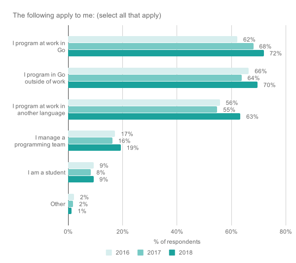

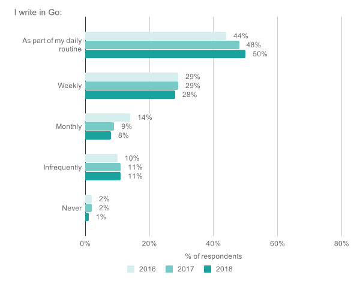

To better understand where developers use Go, we broke responses down into three groups:

为了更好地了解开发者在哪些方面使用Go，我们把回答分成了三组：

1. people who are using Go both in and outside of work,在工作中和工作之余都使用 Go 的人。
2. people who use Go professionally but not outside of work, and 3) people who only write Go outside of their job responsibilities. Nearly half (46%) of respondents write Go code both professionally and on their own time (a 10-point increase since 2017), while the remaining respondents are closely split between either only writing Go at work, or only writing Go outside of work. The large percentage of respondents who both use Go at work and choose to use it outside of work suggests that the language appeals to developers who do not view software engineering as a day job: they also choose to hack on code outside of work responsibilities, and (as evidenced by 85% of respondents saying they’d prefer Go for their next project, see section *Attitudes towards Go* below) Go is the top language they’d prefer to use for these non-work-related projects.专业地使用Go但不在工作之外的人，以及3）只在工作职责之外编写Go的人。近一半（46%）的受访者既在专业上又在自己的时间里写Go代码（自2017年以来增加了10个百分点），而其余的受访者则紧紧围绕着只在工作中写Go，或只在工作之外写Go。既在工作中使用Go，又选择在工作之外使用Go的受访者占很大比例，这表明该语言对那些不把软件工程视为日常工作的开发人员有吸引力：他们也选择在工作职责之外黑客代码，而且（85%的受访者说他们更喜欢Go用于他们的下一个项目，见下文对Go的态度部分）Go是他们最喜欢的语言，用于这些与工作无关的项目。

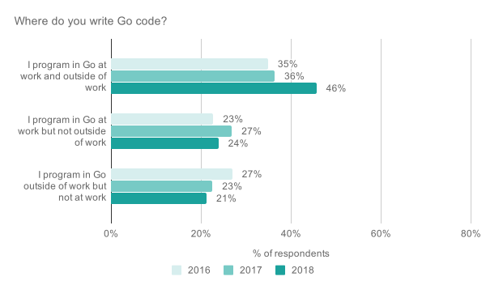

When asked how long they’ve been using Go, participants' answers are strongly trending upward over time, with a higher percentage of responses in the 2-4 and 4+ year buckets each year. This is expected for a newer programming language, and we’re glad to see that the percentage of respondents who are new to Go is dropping more slowly than the percentage of respondents who have been using Go for 2+ years is increasing, as this suggests that developers are not dropping out of the ecosystem after initially learning the language.

当被问及使用Go的时间时，参与者的答案随着时间的推移呈强烈的上升趋势，每年在2-4年和4年以上的回答中都有较高的比例。对于一种较新的编程语言来说，这是意料之中的，我们很高兴地看到，刚开始使用Go的受访者比例下降的速度比使用Go 2年以上的受访者比例上升的速度要慢，因为这表明开发人员在最初学习这种语言之后并没有退出这个生态系统。

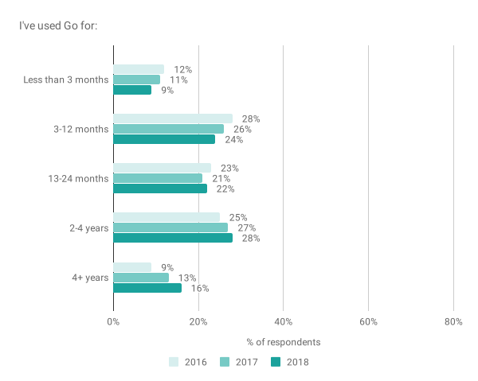

As in prior years, Go ranks at the top of respondents' preferred languages and languages in which they have expertise. A majority of respondents (69%) claimed expertise in 5 different languages, highlighting that their attitudes towards Go are influenced by experiences with other programming stacks. The charts below are sorted by the number of respondents who ranked each language as their most preferred/understood (the darkest blue bars), which highlights three interesting bits:

与往年一样，Go在受访者的首选语言和他们有专长的语言中排名靠前。大多数受访者（69%）声称拥有5种不同语言的专业知识，这突出表明他们对Go的态度受到其他编程堆栈经验的影响。下面的图表是按照将每种语言列为他们最喜欢/最了解的语言的受访者人数排序的（最深的蓝色条），这突出了三个有趣的部分：

- While about ⅓ of respondents consider Go to be the language in which they have the most expertise, twice that many respondents consider it their most preferred programming language. So even though many respondents feel they haven’t become as proficient with Go as with some other language, they still frequently prefer to develop with Go.虽然大约⅓的受访者认为Go是他们最擅长的语言，但有两倍的受访者认为它是他们最喜欢的编程语言。因此，即使许多受访者认为他们对Go的熟练程度不如其他语言，他们仍然经常喜欢用Go来开发。
- Few survey respondents rank Rust as a language in which they have expertise (6.8%), yet 19% rank it as a top preferred language, indicating a high level of interest in Rust among this audience.很少有调查对象将Rust列为他们有专长的语言（6.8%），但有19%的人将其列为首选语言，这表明该受众对Rust有很大的兴趣。
- Only three languages have more respondents who say they prefer the language than say they have expertise with it: Rust (2.41:1 ratio of preference:expertise), Kotlin (1.95:1), and Go (1.02:1). Higher preference than expertise implies interest—but little direct experience—in a language, while lower preference than expertise numbers suggests barriers to proficient use. Ratios near 1.0 suggest that most developers are able to work effectively *and* enjoyably with a given language. This data is corroborated by [Stack Overflow’s 2018 developer survey](https://insights.stackoverflow.com/survey/2018/#most-loved-dreaded-and-wanted), which also found Rust, Kotlin, and Go to be among the most-preferred programming languages.只有三种语言的受访者说他们喜欢这种语言的人数多于说他们对这种语言有专长的人数。Rust（偏好与专业知识的比例为2.41:1），Kotlin（1.95:1）和Go（1.02:1）。更高的偏好比专业知识意味着对一种语言的兴趣，但几乎没有直接的经验，而更低的偏好比专业知识的数字表明熟练使用的障碍。接近1.0的比率表明，大多数开发者能够有效地、愉快地使用某一特定语言。Stack Overflow的2018年开发者调查证实了这一数据，该调查还发现Rust、Kotlin和Go是最受欢迎的编程语言之一。

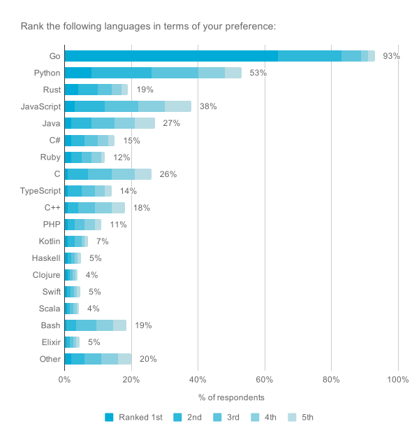

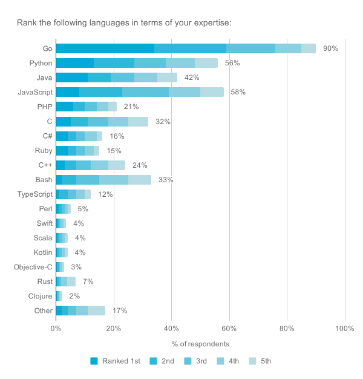

*Reading the data*: Participants could rank their top 5 languages. The color coding starts with dark blue for the top rank and lightens for each successive rank. These charts are sorted by the percentage of participants who ranked each language as their top choice.

阅读数据。参与者可以对他们的前5种语言进行排名。颜色编码从排名第一的深蓝色开始，每一个连续的排名都会变浅。这些图表是按照将每种语言列为首选的参与者的百分比排序的。

## Development domains 开发领域

Survey respondents reported working on a median of three different domains, with a large majority (72%) working in 2-5 different areas. Web development is the most prevalent at 65%, and it increased its dominance as the primary area survey respondents work in (up from 61% last year): web development has been the most common domain for Go development since 2016. This year DevOps noticeably increased, from 36% to 41% of respondents, taking over the number two spot from Systems Programming. We did not find any domains with lower usage in 2018 than in 2017, suggesting that respondents are adopting Go for a wider variety of projects, rather than shifting usage from one domain to another.

调查对象报告说，他们在三个不同的领域工作，其中绝大多数（72%）在2-5个不同的领域工作。网络开发是最普遍的，占65%，它作为调查对象工作的主要领域的主导地位有所提高（高于去年的61%）：网络开发自2016年以来一直是Go开发最常见的领域。今年DevOps明显增加，从36%增加到41%的受访者，从系统编程手中接过第二名的位置。我们没有发现任何领域在2018年的使用率低于2017年，这表明受访者正在为更广泛的项目采用Go，而不是从一个领域转移到另一个领域的使用。

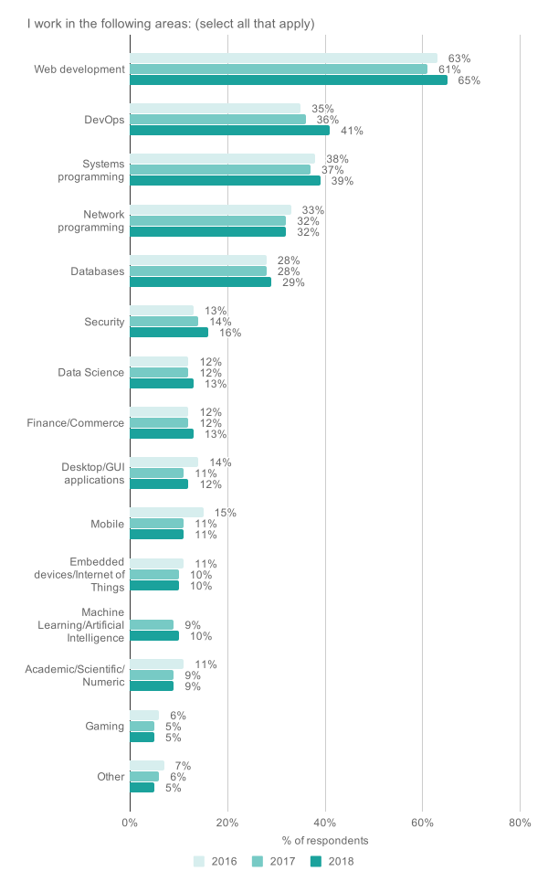

Since 2016, the top two uses of Go have been writing API/RPC services and developing CLI applications. While CLI usage has remained stable at 63% for three years, API/RPC usage has increased from 60% in 2016 to 65% in 2017 to 73% today. These domains play to core strengths of Go and are both central to cloud-native software development, so we expect them to remain two of the primary scenarios for Go developers into the future. The percentage of respondents who write web services that directly return HTML has steadily dropped while API/RPC usage has increased, suggesting some migration to the API/RPC model for web services. Another year-over-year trend suggests that automation is also a growing area for Go, with 38% of respondents now using Go for scripts and automation tasks (up from 31% in 2016).

自2016年以来，Go的前两种用途是编写API/RPC服务和开发CLI应用程序。虽然三年来CLI的使用一直稳定在63%，但API/RPC的使用从2016年的60%增加到2017年的65%，到今天的73%。这些领域发挥了Go的核心优势，都是云原生软件开发的核心，所以我们预计它们在未来仍将是Go开发者的两个主要场景。编写直接返回HTML的网络服务的受访者比例稳步下降，而API/RPC的使用却在增加，这表明一些网络服务向API/RPC模式的迁移。另一个同比趋势表明，自动化也是Go的一个增长领域，现在有38%的受访者将Go用于脚本和自动化任务（高于2016年的31%）。

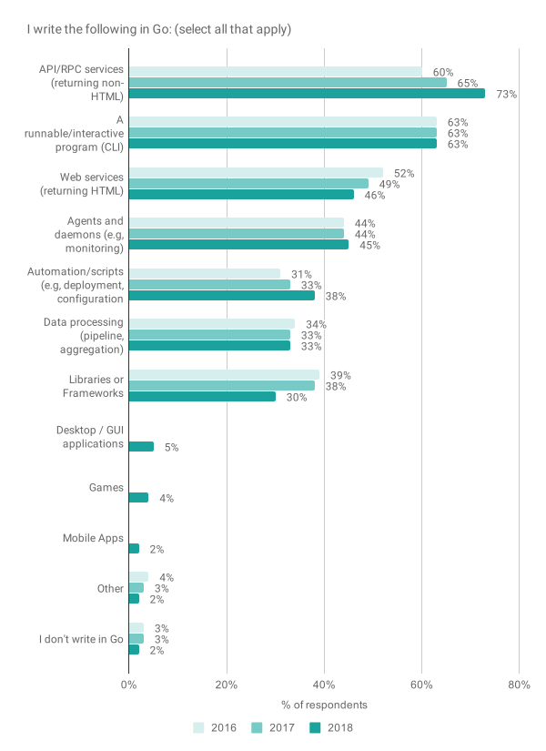

To better understand the contexts in which developers are using Go, we added a question about Go adoption across different industries. Perhaps unsurprisingly for a relatively new language, over half of survey respondents work in companies in the *Internet/web services* and *Software* categories (i.e., tech companies). The only other industries with >3% responses were *Finance, banking, or insurance* and *Media, advertising, publishing, or entertainment*. (In the chart below, we’ve condensed all of the categories with response rates below 3% into the "Other" category.) We’ll continue tracking Go’s adoption across industries to better understand developer needs outside of technology companies.

为了更好地了解开发人员使用Go的背景，我们增加了一个关于Go在不同行业的采用情况的问题。对于一门相对较新的语言来说，超过一半的调查对象在互联网/网络服务和软件类别的公司工作（即科技公司），这也许并不令人惊讶。只有金融、银行或保险业和媒体、广告、出版或娱乐业的答复率超过3%。(在下面的图表中，我们将所有回复率低于3%的类别压缩到 "其他 "类别中）。我们将继续跟踪Go在各行业的应用，以更好地了解技术公司以外的开发者需求。

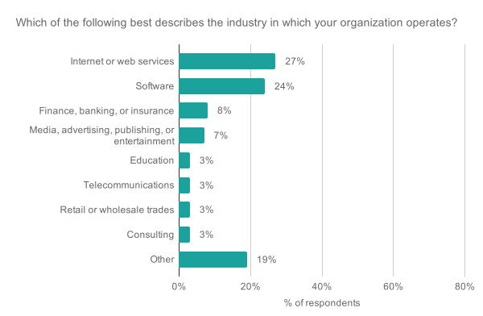

## Attitudes towards Go 对Go的态度

This year we added a question asking "How likely are you to recommend Go to a friend or colleague?" to calculate our [Net Promoter Score](https://en.wikipedia.org/wiki/Net_Promoter). This score attempts to measure how many more "promoters" a product has than "detractors" and ranges from -100 to 100; a positive value suggests most people are likely to recommend using a product, while negative values suggest most people are likely to recommend against using it. Our 2018 score is 61 (68% promoters - 7% detractors) and will serve as a baseline to help us gauge community sentiment towards the Go ecosystem over time.

今年我们增加了一个问题，询问 "您向朋友或同事推荐Go的可能性有多大？"来计算我们的净推广者得分。这个分数试图衡量一个产品的 "推广者 "比 "反对者 "多多少，范围从-100到100；正值表明大多数人可能会推荐使用一个产品，而负值表明大多数人可能会建议反对使用它。我们2018年的得分是61分（68%的推广者-7%的反对者），将作为一个基线，帮助我们衡量社区对Go生态系统的情绪。

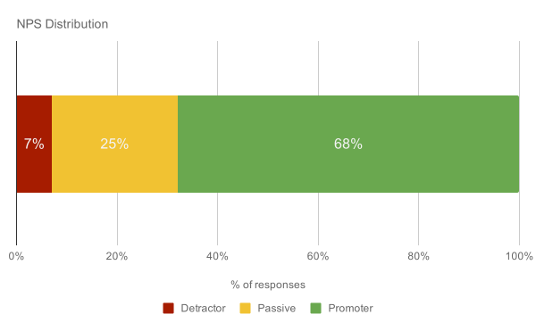

In addition to NPS, we asked several questions about developer satisfaction with Go. Overall, survey respondents indicated a high level of satisfaction, consistent with prior years. Large majorities say they are happy with Go (89%), would prefer to use Go for their next project (85%), and feel that it is working well for their team (66%), while a plurality feel that Go is at least somewhat critical to their company’s success (44%). While all of these metrics showed an increase in 2017, they remained mostly stable this year. (The wording of the first question changed in 2018 from "*I would recommend using Go to others*" to "*Overall, I’m happy with Go*", so those results are not directly comparable.)

除了NPS之外，我们还问了几个关于开发者对Go的满意度的问题。总的来说，调查对象表示满意度很高，与往年一致。大多数人表示他们对Go感到满意（89%），更愿意在他们的下一个项目中使用Go（85%），并认为Go对他们的团队来说很有效（66%），而大多数人认为Go对他们公司的成功至少有些关键（44%）。虽然所有这些指标在2017年都出现了增长，但今年它们大多保持稳定。(第一个问题的措辞在2018年从 "我会向其他人推荐使用Go "改为 "总体而言，我对Go感到满意"，因此这些结果没有直接的可比性。)

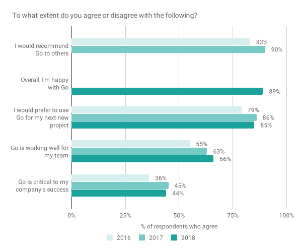

Given the strong sentiment towards preferring Go for future development, we want to understand what prevents developers from doing so. These remained largely unchanged since last year: about ½ of survey respondents work on existing projects written in other languages, and ⅓ work on a team or project that prefers to use a different language. Missing language features and libraries round out the most common reasons respondents did not use Go more. We also asked about the biggest challenges developers face while using Go; unlike most of our survey questions, respondents could type in anything they wished to answer this question. We analyzed the results via machine learning to identify common themes and counting the number of responses that supported each theme. The top three major challenges we identified are:

鉴于对未来开发首选Go的强烈情绪，我们想了解是什么阻碍了开发者这样做。这些问题自去年以来基本没有变化：大约1/2的调查对象在现有的用其他语言编写的项目中工作，而⅓在一个喜欢使用不同语言的团队或项目中工作。缺少语言功能和库是受访者没有更多使用Go的最常见原因。我们还询问了开发人员在使用Go时面临的最大挑战；与我们的大多数调查问题不同，受访者可以在回答这个问题时输入他们希望的任何内容。我们通过机器学习来分析结果，以确定共同的主题，并计算支持每个主题的答复数量。我们确定的前三个主要挑战是：

- Package management (e.g., "Keeping up with vendoring", "dependency / packet [sic] management / vendoring not unified")包管理（例如，"跟上销售"，"依赖/包[原文如此]管理/销售不统一")
- Differences from more familiar programming languages (e.g., "syntax close to C-languages with slightly different semantics makes me look up references somewhat more than I’d like", "coworkers who come from non-Go backgrounds trying to use Go as a version of their previous language but with channels and Goroutines")与更熟悉的编程语言的差异（例如，"接近于C语言的语法，但语义略有不同，这让我在某种程度上更多地查阅参考资料"，"来自非Go背景的同事试图将Go作为他们以前语言的一个版本，但有通道和Goroutines"）
- Lack of generics (e.g., "Lack of generics makes it difficult to persuade people who have not tried Go that they would find it efficient.", "Hard to build richer abstractions (want generics)")缺少泛型（例如，"缺少泛型使我们很难说服那些没有尝试过Go的人，让他们觉得Go很有效。"，"很难建立更丰富的抽象（想要泛型）"

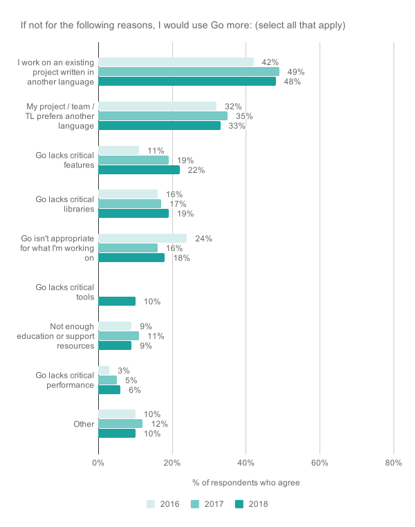

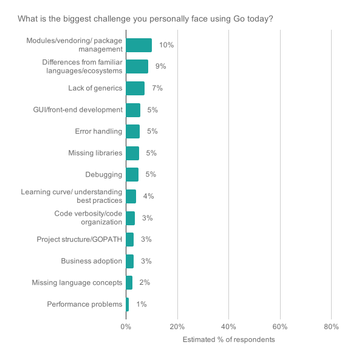

This year we added several questions about developer satisfaction with different aspects of Go. Survey respondents were very satisfied with Go applications' CPU performance (46:1, meaning 46 respondents said they were satisfied for every 1 respondent who said they were not satisfied), build speed (37:1), and application memory utilization (32:1). Responses for application debuggability (3.2:1) and binary size (6.4:1), however, suggest room for improvement.

今年我们增加了几个关于开发者对Go不同方面满意度的问题。调查对象对Go应用程序的CPU性能非常满意（46:1，即46位受访者对1位表示不满意的受访者表示满意），构建速度（37:1），以及应用程序内存利用率（32:1）。然而，对应用程序调试性（3.2:1）和二进制大小（6.4:1）的答复表明有改进的空间。

The dissatisfaction with binary size largely comes from developers building CLIs, only 30% of whom are satisfied with the size of Go’s generated binaries. For all other types of applications, however, developer satisfaction was > 50%, and binary size was consistently ranked at the bottom of the list of important factors.

对二进制文件大小的不满主要来自于构建CLI的开发者，其中只有30%的人对Go生成的二进制文件的大小感到满意。然而，对于所有其他类型的应用程序，开发者的满意度都超过了50%，二进制文件的大小一直被排在重要因素的末尾。

Debuggability, conversely, stands out when we look at how respondents ranked the importance of each aspect; 44% of respondents ranked debuggability as their most or second-most important aspect, but only 36% were satisfied with the current state of Go debugging. Debuggability was consistently rated about as important as memory usage and build speed but with significantly lower satisfaction levels, and this pattern held true regardless of the type of software respondents were building. The two most recent Go releases, Go 1.11 and 1.12, both contained significant improvements to debuggability. We plan to investigate how developers debug Go applications in more depth this year, with a goal of improving the overall debugging experience for Go developers.

相反，当我们看受访者对每个方面的重要性进行排名时，调试性就很突出；44%的受访者将调试性列为最重要或第二重要的方面，但只有36%的人对Go调试的现状感到满意。调试能力的重要性一直与内存使用和构建速度的重要性相当，但满意度明显较低，而且无论受访者正在构建何种类型的软件，这一模式都是正确的。最近的两个Go版本，Go 1.11和1.12，都包含了对调试性的重大改进。我们计划在今年更深入地调查开发人员如何调试Go应用程序，目的是改善Go开发人员的整体调试体验。

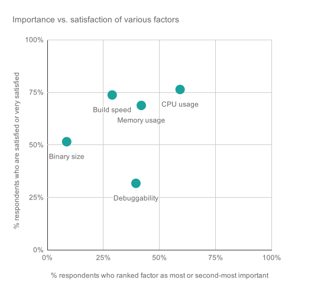

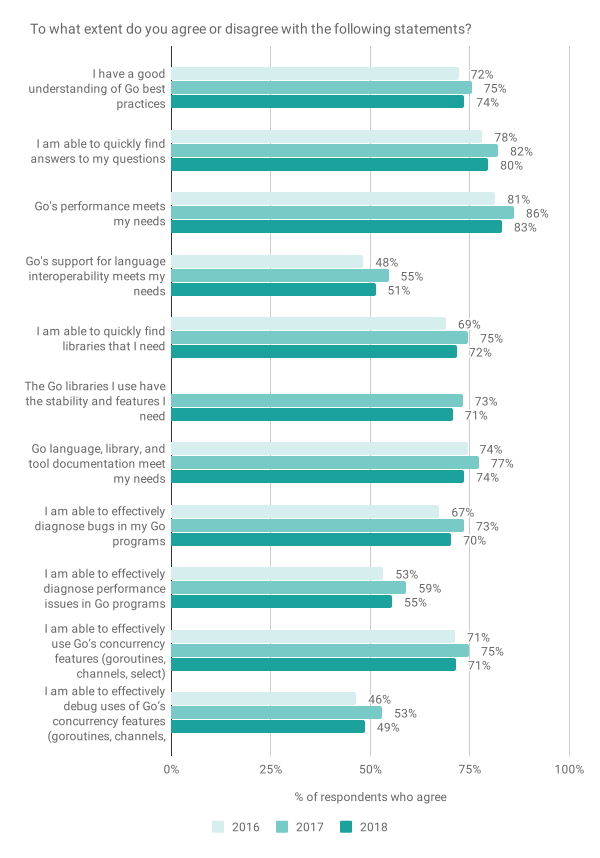

## Development environments 开发环境

We asked respondents which operating systems they primarily use when writing Go code. A majority (65%) of respondents said they use Linux, 50% use macOS, and 18% use Windows, consistent with last year. This year we also looked at how many respondents develop on multiple OSes vs. a single OS. Linux and macOS remain the clear leaders, with 81% of respondents developing on some mix of these two systems. Only 3% of respondents evenly split their time between all three OSes. Overall, 41% of respondents use multiple operating systems for Go development, highlighting the cross-platform nature of Go.

我们询问受访者在编写Go代码时主要使用哪些操作系统。大多数（65%）的受访者表示他们使用Linux，50%使用macOS，18%使用Windows，与去年一致。今年我们还调查了有多少受访者在多个操作系统与单一操作系统上开发。Linux和macOS仍然是明显的领导者，81%的受访者在这两个系统的某种混合上进行开发。只有3%的受访者将时间平均分配在所有三个操作系统上。总的来说，41%的受访者使用多个操作系统进行Go开发，突出了Go的跨平台特性。

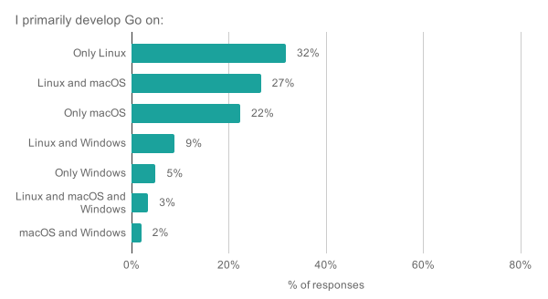

Last year, VS Code edged out Vim as the most popular Go editor among survey respondents. This year it significantly expanded its lead to become the preferred editor for over ⅓ of our survey respondents (up from 27% last year). GoLand also experienced strong growth and is now the second most-preferred editor at 22%, swapping places with Vim (down to 17%). The surging popularity of VS Code and GoLand appear to be coming at the expense of Sublime Text and Atom. Vim also saw the number of respondents ranking it their top choice drop, but it remains the most popular second-choice editor at 14%. Interestingly, we found no differences in the level of satisfaction respondents reported for their editor(s) of choice.

去年，VS Code击败了Vim，成为调查对象中最受欢迎的Go编辑器。今年，它的领先优势明显扩大，成为我们调查对象中超过⅓的首选编辑器（去年为27%）。GoLand也经历了强劲的增长，现在是第二大最受欢迎的编辑器，占22%，与Vim交换了位置（降至17%）。VS Code和GoLand的流行似乎是以Sublime Text和Atom为代价的。Vim被列为首选的人数也有所下降，但它仍然是最受欢迎的第二选择编辑器，占14%。有趣的是，我们发现受访者对他们所选择的编辑器的满意程度没有什么不同。

We also asked respondents what would most improve Go support in their preferred editor. Like the "biggest challenge" question above, participants could write in their own response rather than select from a multiple-choice list. A thematic analysis on the responses revealed that *improved debugging support* (e.g., "Live debugging", "Integrated debugging", "Even better debugging") was the most-common request, followed by *improved code completion* (e.g., "autocomplete performance and quality", "smarter autocomplete"). Other requests include better integration with Go’s CLI toolchain, better support for modules/packages, and general performance improvements.

我们还询问了受访者，在他们所选择的编辑器中，什么最能改善Go支持。与上面的 "最大挑战 "问题一样，参与者可以写下自己的回答，而不是从多选列表中选择。对回答的主题分析显示，改善调试支持（如 "实时调试"、"集成调试"、"甚至更好的调试"）是最常见的要求，其次是改善代码完成（如 "自动完成性能和质量"、"更智能的自动完成"）。其他要求包括与Go的CLI工具链更好的集成，对模块/包更好的支持，以及一般的性能改进。

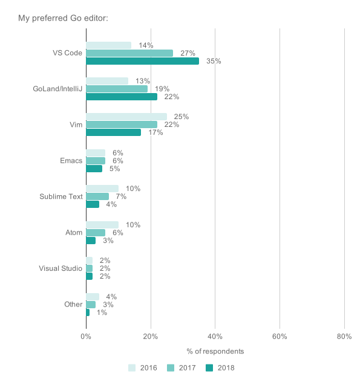

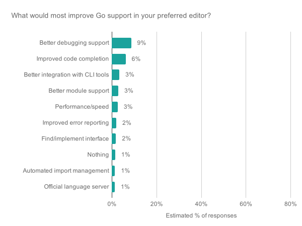

This year we also added a question asking which deployment architectures are most important to Go developers. Unsurprisingly, survey respondents overwhelmingly view x86/x86-64 as their top deployment platform (76% of respondents listed it as their most important deployment architecture, and 84% had it in their top 3). The ranking of the second- and third-choice architectures, however, is informative: there is significant interest in ARM64 (45%), WebAssembly (30%), and ARM (22%), but very little interest in other platforms.

今年我们还增加了一个问题，询问哪些部署架构对Go开发者来说是最重要的。不出所料，调查对象绝大多数认为x86/x86-64是他们最重要的部署平台（76%的调查对象将其列为最重要的部署架构，84%的调查对象将其列为前三名）。然而，第二和第三选择架构的排名却很有参考价值：人们对ARM64（45%）、WebAssembly（30%）和ARM（22%）的兴趣很大，但对其他平台的兴趣很小。

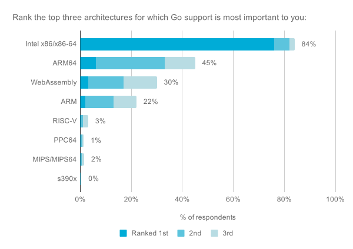

## Deployments and services 部署和服务

For 2018 we see a continuation of the trend from on-prem to cloud hosting for both Go and non-Go deployments. The percentage of survey respondents who deploy Go applications to on-prem servers dropped from 43% → 32%, mirroring the 46% → 36% drop reported for non-Go deployments. The cloud services which saw the highest year-over-year growth include AWS Lambda (4% → 11% for Go, 10% → 15% non-Go) and Google Kubernetes Engine (8% → 12% for Go, 5% → 10% non-Go), suggesting that serverless and containers are becoming increasingly popular deployment platforms. This service growth appears to be driven by respondents who had already adopted cloud services, however, as we found no meaningful growth in the percentage of respondents who deploy to at least one cloud service this year (55% → 56%). We also see steady growth in Go deployments to GCP since 2016, increasing from 12% → 19% of respondents.

对于2018年，我们看到Go和非Go的部署都延续了从内部到云主机的趋势。将Go应用程序部署到内部服务器的调查对象的百分比从43%下降到32%，反映了非Go部署的46%到36%的下降。同比增长最高的云服务包括AWS Lambda（4% → 11%用于Go，10% → 15%用于非Go）和谷歌Kubernetes引擎（8% → 12%用于Go，5% → 10%用于非Go），这表明无服务器和容器正在成为越来越受欢迎的部署平台。然而，这种服务的增长似乎是由已经采用云服务的受访者推动的，因为我们发现今年部署到至少一种云服务的受访者比例没有意义的增长（55% → 56%）。我们还看到，自2016年以来，Go部署到GCP的比例稳步增长，从12% → 19%的受访者增加。

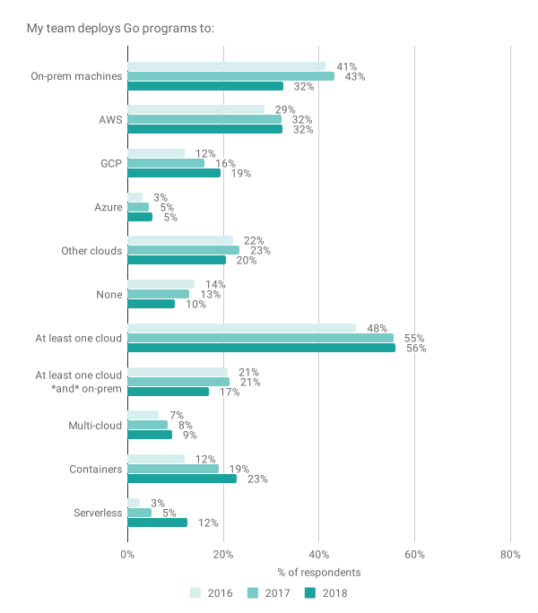

Perhaps correlated with the decrease in on-prem deployments, this year we saw cloud storage become the second-most used service by survey respondents, increasing from 32% → 44%. Authentication & federation services also saw a significant increase (26% → 33%). The primary service survey respondents access from Go remains open-source relational databases, which ticked up from 61% → 65% of respondents. As the below chart shows, service usage increased across the board.

也许与内部部署的减少有关，今年我们看到云存储成为调查对象使用最多的第二大服务，从32%增加到44%。认证和联盟服务也有明显的增长（26%→33%）。调查对象从Go中获取的主要服务仍然是开源关系型数据库，从61%上升到65%。如下图所示，服务的使用全面增加。

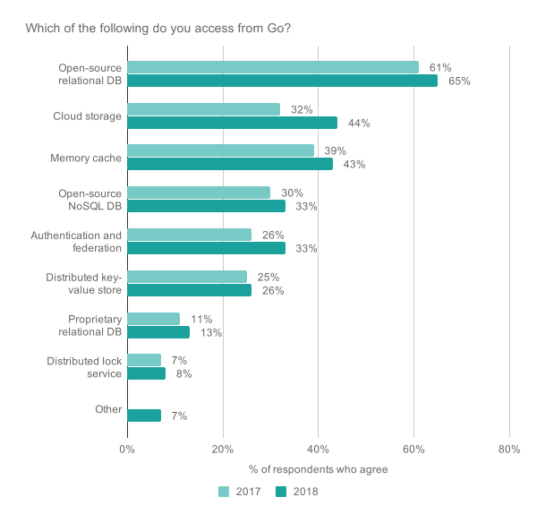

## Go community Go社区

The top community sources for finding answers to Go questions continue to be Stack Overflow (23% of respondents marked it as their top source), Go web sites (18% for godoc.org, 14% for golang.org), and reading source code (8% for source code generally, 4% for GitHub specifically). The order remains largely consistent with prior years. The primary sources for Go news remain the Go blog, Reddit’s r/golang, Twitter, and Hacker News. These were also the primary distribution methods for this survey, however, so there is likely some bias in this result. In the two charts below, we’ve grouped sources used by less than < 5% of respondents into the "Other" category.

寻找Go问题答案的首要社区来源仍然是Stack Overflow（23%的受访者将其标记为首要来源）、Go网站（18%为godoc.org，14%为golang.org）和阅读源代码（一般为8%的源代码，4%为GitHub）。这个顺序与往年基本一致。Go新闻的主要来源仍然是Go博客、Reddit的r/golang、Twitter和Hacker News。然而，这些也是本次调查的主要传播方式，所以这个结果可能有一些偏差。在下面的两个图表中，我们将少于5%的受访者使用的来源归入 "其他 "类别。

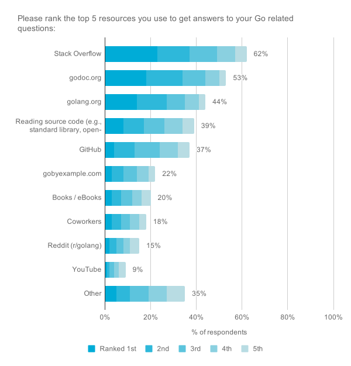

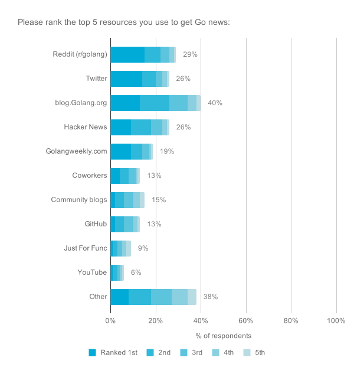

This year, 55% of survey respondents said they have or are interested in contributing to the Go community, slightly down from 59% last year. Because the two most common areas for contribution (the standard library and official Go tools) require interacting with the core Go team, we suspect this decrease may be related to a dip in the percentage of participants who agreed with the statements "I feel comfortable approaching the Go project leadership with questions and feedback" (30% → 25%) and "I am confident in the leadership of Go (54% → 46%).

今年，55%的调查对象表示他们已经或有兴趣为Go社区做出贡献，比去年的59%略低。由于两个最常见的贡献领域（标准库和官方Go工具）需要与Go核心团队互动，我们猜测这一比例的下降可能与同意 "我很乐意向Go项目领导层提出问题和反馈"（30% → 25%）和 "我对Go的领导层有信心（54% → 46%）"的参与者的比例下降有关。

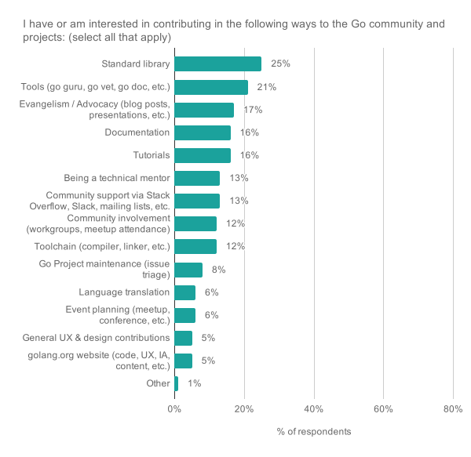

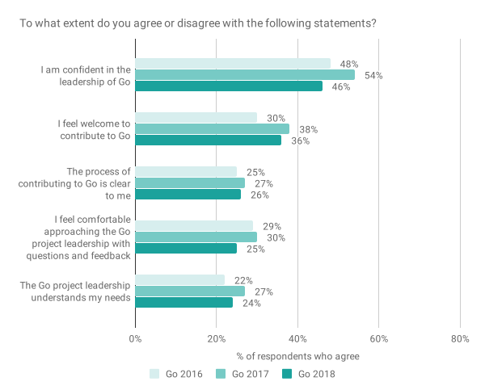

An important aspect of community is helping everyone feel welcome, especially people from traditionally under-represented demographics. To better understand this, we asked an optional question about identification across several under-represented groups. In 2017 we saw year-over-year increases across the board. For 2018, we saw a similar percentage of respondents (12%) identify as part of an under-represented group, and this was paired with a significant decrease in the percentage of respondents who do **not** identify as part of an under-represented group. In 2017, for every person who identified as part of an under-represented group, 3.5 people identified as not part of an under-represented group (3.5:1 ratio). In 2018 that ratio improved to 3.08:1. This suggests that the Go community is at least retaining the same proportions of under-represented members, and may even be increasing.

社区的一个重要方面是帮助每个人感到受欢迎，特别是来自传统上代表性不足的人口群体的人。为了更好地了解这一点，我们问了一个关于在几个代表性不足的群体中的认同的可选问题。在2017年，我们看到全面的同比增长。在2018年，我们看到类似比例的受访者（12%）认同为代表不足群体的一部分，这与不认同为代表不足群体的受访者比例的大幅下降相匹配。在2017年，每一个认定为代表不足群体的人，就有3.5人认定为不属于代表不足群体（3.5:1的比例）。2018年，这一比例提高到3.08：1。这表明，Go社区至少保留了相同比例的代表不足的成员，甚至可能在增加。

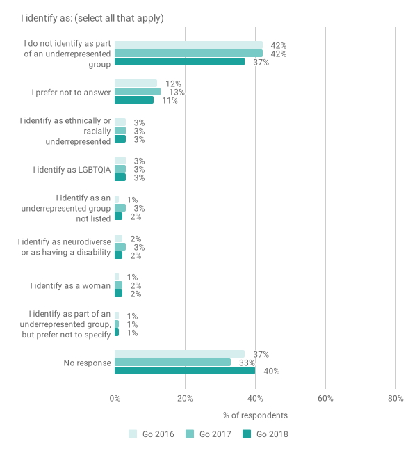

Maintaining a healthy community is extremely important to the Go project, so for the past three years we’ve been measuring the extent to which developers feel welcome in the Go community. This year we saw a drop in the percentage of survey respondents who agree with the statement "I feel welcome in the Go community", from 66% → 59%.

保持一个健康的社区对Go项目来说是非常重要的，所以在过去的三年里，我们一直在测量开发者在Go社区中感到受欢迎的程度。今年，我们看到同意 "我觉得自己在Go社区很受欢迎 "这一说法的调查对象的比例从66%下降到59%。

To better understand this decrease, we looked more closely at who reported feeling less welcome. Among traditionally under-represented groups, fewer people reported feeling unwelcome in 2018, suggesting that outreach in that area has been helpful. Instead, we found a linear relationship between the length of time someone has used Go and how welcome they feel: newer Go developers felt significantly less welcome (at 50%) than developers with 1-2 years of experience (62%), who in turn felt less welcome than developers with a few years of experience (73%). This interpretation of the data is supported by responses to the question "What changes would make the Go community more welcoming?". Respondents' comments can be broadly grouped into four categories:

为了更好地理解这种下降，我们更仔细地研究了哪些人报告说感觉不太受欢迎。在传统上代表性不足的群体中，2018年报告感觉不受欢迎的人较少，这表明该领域的外联活动是有帮助的。相反，我们发现某人使用Go的时间长短与他们感到的欢迎程度之间存在线性关系：较新的Go开发者感到的欢迎程度（50%）明显低于有1-2年经验的开发者（62%），而后者又比有几年经验的开发者（73%）感到不欢迎。对 "哪些变化会使Go社区更受欢迎？"这一问题的回答支持了对数据的这种解释。答复者的意见可以大致分为四类：

- Reduce a perception of elitism, especially for newcomers to Go (e.g., "less dismissiveness", "Less defensiveness and hubris")减少对精英主义的看法，尤其是对Go新人来说（例如，"减少轻视"，"减少防卫和傲慢"）。
- Increase transparency at the leadership level (e.g., "Future direction and planning discussions", "Less top down leadership", "More democratic")增加领导层的透明度（例如，"未来方向和规划讨论"，"减少自上而下的领导"，"更民主"）。
- Increase introductory resources (e.g., "A more clear introduction for contributors", "Fun challenges to learn best practices")增加介绍性资源（例如，"对贡献者更清晰的介绍"，"学习最佳实践的有趣挑战"）。
- More events and meetups, with a focus on covering a larger geographic area (e.g., "More meetups & social events", "Events in more cities")更多的活动和聚会，重点是覆盖更大的地理区域（例如，"更多的聚会和社交活动"，"在更多的城市举办活动"）。

This feedback is very helpful and gives us concrete areas we can focus on to improve the experience of being a Go developer. While it doesn’t represent a large percentage of our user base, we take this feedback very seriously and are working on improving each area.

这些反馈非常有帮助，给我们提供了具体的领域，我们可以专注于改善作为一个Go开发者的经验。虽然这并不代表我们用户群的很大比例，但我们非常重视这些反馈，并正在努力改善每个领域。

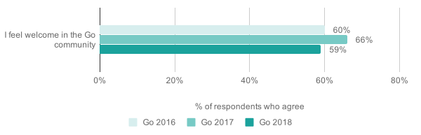

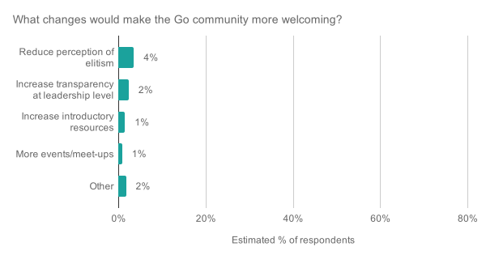

## Conclusion 总结

We hope you’ve enjoyed seeing the results of our 2018 developer survey. These results are impacting our 2019 planning, and in the coming months we’ll share some ideas with you to address specific issues and needs the community has highlighted for us. Once again, thank you to everyone who contributed to this survey!

我们希望您喜欢看到我们2018年开发者调查的结果。这些结果正在影响我们的2019年规划，在未来几个月，我们将与您分享一些想法，以解决社区为我们强调的具体问题和需求。再次感谢为这次调查做出贡献的每一个人!
