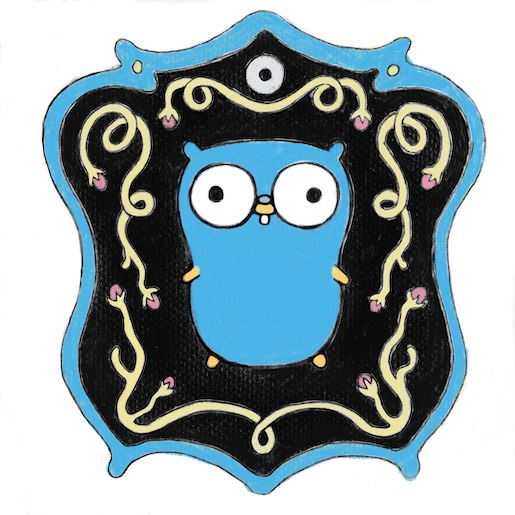

+++
title = "go进入10周年"
weight = 3
date = 2023-05-18T17:03:08+08:00
type = "docs"
description = ""
isCJKLanguage = true
draft = false
+++

# Go Turns 10 - go进入10周年

https://go.dev/blog/10years

Russ Cox, for the Go team
8 November 2019

Happy birthday, Go!

生日快乐，Go!

This weekend we celebrate the 10th anniversary of [the Go release](https://opensource.googleblog.com/2009/11/hey-ho-lets-go.html), marking the 10th birthday of Go as an open-source programming language and ecosystem for building modern networked software.

本周末我们庆祝Go发布10周年，标志着Go作为一种开源编程语言和构建现代网络软件的生态系统的10岁生日。

To mark the occasion, [Renee French](https://twitter.com/reneefrench), the creator of the [Go gopher](https://blog.golang.org/gopher), painted this delightful scene:

为了纪念这一时刻，Go gopher的创造者Renee French画了这个令人愉快的场景：

Celebrating 10 years of Go makes me think back to early November 2009, when we were getting ready to share Go with the world. We didn’t know what kind of reaction to expect, whether anyone would care about this little language. I hoped that even if no one ended up using Go, we would at least have drawn attention to some good ideas, especially Go’s approach to concurrency and interfaces, that could influence follow-on languages.

庆祝Go的10周年让我想起了2009年11月初，当时我们正准备与世界分享Go。我们不知道会有什么样的反应，是否有人会关心这个小语言。我希望即使最后没有人使用Go，我们至少也能引起人们对一些好的想法的注意，尤其是Go的并发和接口方法，这可能会影响到后续的语言。

Once it became clear that people were excited about Go, I looked at the history of popular languages like C, C++, Perl, Python, and Ruby, examining how long each took to gain widespread adoption. For example, Perl seemed to me to have appeared fully-formed in the mid-to-late 1990s, with CGI scripts and the web, but it was first released in 1987. This pattern repeated for almost every language I looked at: it seems to take roughly a decade of quiet, steady improvement and dissemination before a new language really takes off.

一旦发现人们对Go感到兴奋，我就查看了C、C++、Perl、Python和Ruby等流行语言的历史，研究了每种语言获得广泛采用的时间。例如，在我看来，Perl似乎是在20世纪90年代中后期随着CGI脚本和网络的出现而完全成型的，但它最早是在1987年发布的。这种模式几乎重复了我所关注的每一种语言：在一种新的语言真正起飞之前，似乎需要大约十年的安静、稳定的改进和传播。

I wondered: where would Go be after a decade?

我想知道：十年后Go会是什么样子？

Today, we can answer that question: Go is everywhere, used by at least [a million developers worldwide](https://research.swtch.com/gophercount).

今天，我们可以回答这个问题。Go无处不在，全世界至少有一百万名开发者在使用。

Go’s original target was networked system infrastructure, what we now call cloud software. Every major cloud provider today uses core cloud infrastructure written in Go, such as Docker, Etcd, Istio, Kubernetes, Prometheus, and Terraform; the majority of the [Cloud Native Computing Foundation’s projects](https://www.cncf.io/projects/) are written in Go. Countless companies are using Go to move their own work to the cloud as well, from startups building from scratch to enterprises modernizing their software stack. Go has also found adoption well beyond its original cloud target, with uses ranging from controlling tiny embedded systems with [GoBot](https://gobot.io/) and [TinyGo](https://tinygo.org/) to detecting cancer with [massive big data analysis and machine learning at GRAIL](https://medium.com/grail-eng/bigslice-a-cluster-computing-system-for-go-7e03acd2419b), and everything in between.

Go的最初目标是网络系统基础设施，即我们现在所说的云软件。今天，每个主要的云计算供应商都在使用用Go编写的核心云计算基础设施，如Docker、Etcd、Istio、Kubernetes、Prometheus和Terraform；云原生计算基金会的大多数项目都是用Go编写。无数的公司也在使用Go将他们自己的工作转移到云端，包括从零开始建设的初创公司和将其软件栈现代化的企业。Go的应用范围也远远超出了其最初的云计算目标，从用GoBot和TinyGo控制微小的嵌入式系统到用GRAIL的大规模大数据分析和机器学习来检测癌症，以及两者之间的所有应用。

All this is to say that Go has succeeded beyond our wildest dreams. And Go’s success isn’t just about the language. It’s about the language, the ecosystem, and especially the community working together.

所有这一切都说明，Go的成功已经超出了我们最疯狂的梦想。Go的成功不仅仅是关于语言。它是关于语言、生态系统，特别是社区的合作。

In 2009, the language was a good idea with a working sketch of an implementation. The `go` command did not exist: we ran commands like `6g` to compile and `6l` to link binaries, automated with makefiles. We typed semicolons at the ends of statements. The entire program stopped during garbage collection, which then struggled to make good use of two cores. Go ran only on Linux and Mac, on 32- and 64-bit x86 and 32-bit ARM.

在2009年，Go语言还是一个好的想法，只是一个实现的草图。当时还没有go命令：我们运行6g等命令来编译，6l等命令来链接二进制文件，并通过makefile自动运行。我们在语句的结尾处输入分号。整个程序在垃圾收集期间停止，然后努力利用两个核心。Go只在Linux和Mac上运行，在32位和64位x86以及32位ARM上运行。

Over the last decade, with the help of Go developers all over the world, we have evolved this idea and sketch into a productive language with fantastic tooling, a production-quality implementation, a [state-of-the-art garbage collector](https://blog.golang.org/ismmkeynote), and [ports to 12 operating systems and 10 architectures](https://go.dev/doc/install/source#introduction).

在过去的十年里，在世界各地的Go开发者的帮助下，我们已经将这个想法和草图发展成了一种富有成效的语言，它拥有出色的工具、生产质量的实现、最先进的垃圾收集器，并移植到了12个操作系统和10种架构上。

Any programming language needs the support of a thriving ecosystem. The open source release was the seed for that ecosystem, but since then, many people have contributed their time and talent to fill the Go ecosystem with great tutorials, books, courses, blog posts, podcasts, tools, integrations, and of course reusable Go packages importable with `go` `get`. Go could never have succeeded without the support of this ecosystem.

任何编程语言都需要一个繁荣的生态系统的支持。开源版本是该生态系统的种子，但从那时起，许多人贡献了他们的时间和才智，用优秀的教程、书籍、课程、博客文章、播客、工具、集成，当然还有可以用go get导入的可重复使用的Go包来填充Go生态系统。没有这个生态系统的支持，Go不可能成功。

Of course, the ecosystem needs the support of a thriving community. In 2019 there are dozens of Go conferences all over the world, along with [over 150 Go meetup groups with over 90,000 members](https://www.meetup.com/pro/go). [GoBridge](https://golangbridge.org/) and [Women Who Go](https://medium.com/@carolynvs/www-loves-gobridge-ccb26309f667) help bring new voices into the Go community, through mentoring, training, and conference scholarships. This year alone, they have taught hundreds of people from traditionally underrepresented groups at workshops where community members teach and mentor those new to Go.

当然，这个生态系统需要一个繁荣的社区的支持。2019年，全世界有几十个Go会议，还有150多个Go聚会小组，有超过9万名成员。GoBridge和Women Who Go通过指导、培训和会议奖学金，帮助将新的声音带入Go社区。仅在今年，他们就为数百名来自传统上代表性不足的群体的人举办了研讨会，在这些研讨会上，社区成员为刚接触Go的人提供指导。

There are [over a million Go developers](https://research.swtch.com/gophercount) worldwide, and companies all over the globe are looking to hire more. In fact, people often tell us that learning Go helped them get their first jobs in the tech industry. In the end, what we’re most proud of about Go is not a well-designed feature or a clever bit of code but the positive impact Go has had in so many people’s lives. We aimed to create a language that would help us be better developers, and we are thrilled that Go has helped so many others.

全世界有超过一百万的Go开发者，全球的公司都在寻找更多的人。事实上，人们经常告诉我们，学习Go帮助他们在科技行业找到第一份工作。最终，我们对Go最引以为豪的不是一个精心设计的功能或一段聪明的代码，而是Go对许多人的生活产生的积极影响。我们的目标是创造一种能够帮助我们成为更好的开发者的语言，而我们很高兴Go已经帮助了这么多人。

As [#GoTurns10](https://twitter.com/search?q=%23GoTurns10), I hope everyone will take a moment to celebrate the Go community and all we have achieved. On behalf of the entire Go team at Google, thank you to everyone who has joined us over the past decade. Let’s make the next one even more incredible!

在#GoTurns10之际，我希望每个人都能花点时间来庆祝Go社区和我们所取得的一切。我代表谷歌的整个Go团队，感谢在过去十年中加入我们的所有人。让我们把下一个十年变得更加不可思议吧

