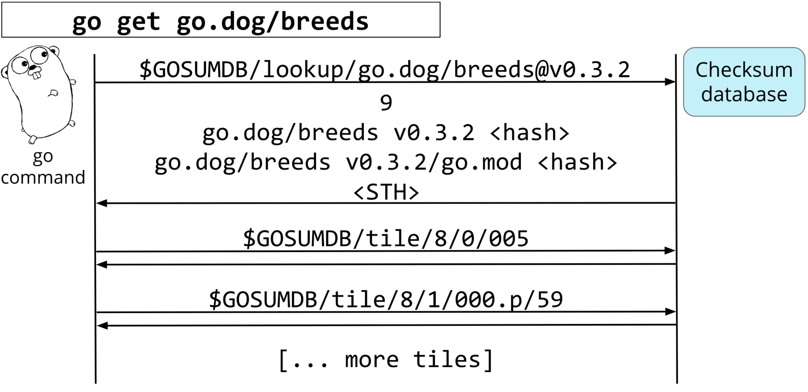

+++
title = "模块镜像和校验数据库发布"
weight = 8
date = 2023-05-18T17:03:08+08:00
type = "docs"
description = ""
isCJKLanguage = true
draft = false
+++

# Module Mirror and Checksum Database Launched - 模块镜像和校验数据库发布

https://go.dev/blog/module-mirror-launch

Katie Hockman
29 August 2019

We are excited to share that our module [mirror](https://proxy.golang.org/), [index](https://index.golang.org/), and [checksum database](https://sum.golang.org/) are now production ready! The `go` command will use the module mirror and checksum database by default for [Go 1.13 module users](https://go.dev/doc/go1.13#introduction). See [proxy.golang.org/privacy](https://proxy.golang.org/privacy) for privacy information about these services and the [go command documentation](https://go.dev/cmd/go/#hdr-Module_downloading_and_verification) for configuration details, including how to disable the use of these servers or use different ones. If you depend on non-public modules, see the [documentation for configuring your environment](https://go.dev/cmd/go/#hdr-Module_configuration_for_non_public_modules).

我们很高兴地与大家分享，我们的模块镜像、索引和校验数据库现在已经准备好生产了! Go命令将为Go 1.13模块用户默认使用模块镜像和校验数据库。关于这些服务的隐私信息，请参见proxy.golang.org/privacy；关于配置细节，请参见go命令文档，包括如何禁用这些服务器或使用不同的服务器。如果您依赖于非公开的模块，请参阅配置环境的文档。

This post will describe these services and the benefits of using them, and summarizes some of the points from the [Go Module Proxy: Life of a Query](https://youtu.be/KqTySYYhPUE) talk at Gophercon 2019. See the [recording](https://youtu.be/KqTySYYhPUE) if you are interested in the full talk.

这篇文章将介绍这些服务和使用它们的好处，并总结了Go模块代理的一些要点。在Gophercon 2019上的查询生活讲座。如果您对完整的讲座感兴趣，请看录音。

## Module Mirror 模块镜像

[Modules](https://blog.golang.org/versioning-proposal) are sets of Go packages that are versioned together, and the contents of each version are immutable. That immutability provides new opportunities for caching and authentication. When `go get` runs in module mode, it must fetch the module containing the requested packages, as well as any new dependencies introduced by that module, updating your [go.mod](https://go.dev/cmd/go/#hdr-The_go_mod_file) and [go.sum](https://go.dev/cmd/go/#hdr-Module_downloading_and_verification) files as needed. Fetching modules from version control can be expensive in terms of latency and storage in your system: the `go` command may be forced to pull down the full commit history of a repository containing a transitive dependency, even one that isn’t being built, just to resolve its version.

模块是由Go包组成的集合，这些包的版本在一起，每个版本的内容都是不可改变的。这种不可变性为缓存和认证提供了新的机会。当go get在模块模式下运行时，它必须获取包含所请求的包的模块，以及由该模块引入的任何新的依赖关系，根据需要更新您的go.mod和go.sum文件。从版本控制中获取模块在延迟和系统中的存储方面是很昂贵的：go命令可能被迫拉下包含横向依赖的版本库的全部提交历史，即使是一个没有被构建的版本。

The solution is to use a module proxy, which speaks an API that is better suited to the `go` command’s needs (see `go help goproxy`). When `go get` runs in module mode with a proxy, it will work faster by only asking for the specific module metadata or source code it needs, and not worrying about the rest. Below is an example of how the `go` command may use a proxy with `go get` by requesting the list of versions, then the info, mod, and zip file for the latest tagged version.

解决方法是使用模块代理，它所讲的 API 更适合 go 命令的需要（见 go help goproxy）。当go get在模块模式下使用代理运行时，它将只询问它所需要的特定模块元数据或源代码，而不担心其他问题，从而使工作更快。下面是一个例子，说明go命令如何使用代理与go get一起请求版本列表，然后请求最新标记版本的信息、mod和zip文件。


A module mirror is a special kind of module proxy that caches metadata and source code in its own storage system, allowing the mirror to continue to serve source code that is no longer available from the original locations. This can speed up downloads and protect you from disappearing dependencies. See [Go Modules in 2019](https://blog.golang.org/modules2019) for more information.

模块镜像是一种特殊的模块代理，它将元数据和源代码缓存在自己的存储系统中，允许镜像继续提供不再从原始位置获得的源代码。这可以加快下载速度，并保护您免受消失的依赖项。更多信息请参见2019年的Go模块。

The Go team maintains a module mirror, served at [proxy.golang.org](https://proxy.golang.org/), which the `go` command will use by default for module users as of Go 1.13. If you are running an earlier version of the `go` command, then you can use this service by setting `GOPROXY=https://proxy.golang.org` in your local environment.

Go团队维护着一个模块镜像，在proxy.golang.org上提供服务，从Go 1.13开始，go命令将默认为模块用户使用。如果您运行的是早期版本的 go 命令，那么您可以通过在本地环境中设置 GOPROXYhttps://proxy.golang.org 来使用该服务。

## Checksum Database 校验和数据库

Modules introduced the `go.sum` file, which is a list of SHA-256 hashes of the source code and `go.mod` files of each dependency when it was first downloaded. The `go` command can use the hashes to detect misbehavior by an origin server or proxy that gives you different code for the same version.

模块引入了 go.sum 文件，它是每个依赖项的源代码和 go.mod 文件在首次下载时的 SHA-256 哈希值的列表。go命令可以使用这些哈希值来检测原生服务器或代理的错误行为，这些错误行为为您提供了相同版本的不同代码。

The limitation of this `go.sum` file is that it works entirely by trust on *your* first use. When you add a version of a dependency that you’ve never seen before to your module (possibly by upgrading an existing dependency), the `go` command fetches the code and adds lines to the `go.sum` file on the fly. The problem is that those `go.sum` lines aren’t being checked against anyone else’s: they might be different from the `go.sum` lines that the `go` command just generated for someone else, perhaps because a proxy intentionally served malicious code targeted to you.

这个go.sum文件的局限性在于，它在您第一次使用时完全靠信任来工作。当您在您的模块中添加一个您从未见过的依赖版本时（可能是通过升级现有的依赖），go命令会获取代码并在运行中向go.sum文件添加行。问题是，这些go.sum行并没有与其他人的go.sum行进行核对：它们可能与go命令刚刚为其他人生成的go.sum行不同，也许是因为代理机构故意为您提供恶意代码。

Go’s solution is a global source of `go.sum` lines, called a [checksum database](https://go.googlesource.com/proposal/+/master/design/25530-sumdb.md#checksum-database), which ensures that the `go` command always adds the same lines to everyone’s `go.sum` file. Whenever the `go` command receives new source code, it can verify the hash of that code against this global database to make sure the hashes match, ensuring that everyone is using the same code for a given version.

Go的解决方案是一个全局性的go.sum行来源，称为校验数据库，它可以确保go命令总是在每个人的go.sum文件中添加相同的行。每当go命令收到新的源代码时，它可以根据这个全局数据库验证该代码的哈希值，以确保哈希值的匹配，从而确保每个人在特定的版本中使用相同的代码。

The checksum database is served by [sum.golang.org](https://sum.golang.org/), and is built on a [Transparent Log](https://research.swtch.com/tlog) (or "Merkle tree") of hashes backed by [Trillian](https://github.com/google/trillian). The main advantage of a Merkle tree is that it is tamper proof and has properties that don’t allow for misbehavior to go undetected, which makes it more trustworthy than a simple database. The `go` command uses this tree to check "inclusion" proofs (that a specific record exists in the log) and "consistency" proofs (that the tree hasn’t been tampered with) before adding new `go.sum` lines to your module’s `go.sum` file. Below is an example of such a tree.

该校验数据库由sum.golang.org提供，建立在Trillian支持的哈希值透明日志（或 "Merkle树"）上。Merkle树的主要优点是它是防篡改的，并且具有不允许不当行为不被发现的特性，这使得它比简单的数据库更值得信赖。在向您的模块的go.sum文件添加新的go.sum行之前，go命令使用这种树来检查 "包含性 "证明（即日志中存在特定的记录）和 "一致性 "证明（即树没有被篡改）。下面是这样一个树的例子。


The checksum database supports [a set of endpoints](https://go.googlesource.com/proposal/+/master/design/25530-sumdb.md#checksum-database) used by the `go` command to request and verify `go.sum` lines. The `/lookup` endpoint provides a "signed tree head" (STH) and the requested `go.sum` lines. The `/tile` endpoint provides chunks of the tree called *tiles* which the `go` command can use for proofs. Below is an example of how the `go` command may interact with the checksum database by doing a `/lookup` of a module version, then requesting the tiles required for the proofs.

校验数据库支持一组端点，由go命令用来请求和验证go.sum行。/lookup端点提供了一个 "签名树头"（STH）和所请求的go.sum行。/tile端点提供被称为tiles的树块，go命令可以用它来进行证明。下面是一个例子，说明go命令如何与校验数据库进行交互，即通过对模块版本进行/查询，然后请求证明所需的瓦片。



This checksum database allows the `go` command to safely use an otherwise untrusted proxy. Because there is an auditable security layer sitting on top of it, a proxy or origin server can’t intentionally, arbitrarily, or accidentally start giving you the wrong code without getting caught. Even the author of a module can’t move their tags around or otherwise change the bits associated with a specific version from one day to the next without the change being detected.

这个校验和数据库允许go命令安全地使用一个不受信任的代理。因为有一个可审计的安全层在上面，代理或原点服务器不能故意、任意或意外地开始给您错误的代码而不被发现。即使是一个模块的作者也不能随意移动他们的标签，或者在不被发现的情况下改变与特定版本相关的位。

If you are using Go 1.12 or earlier, you can manually check a `go.sum` file against the checksum database with [gosumcheck](https://godoc.org/golang.org/x/mod/gosumcheck):

如果您使用的是Go 1.12或更早的版本，您可以用gosumcheck手动检查go.sum文件和校验数据库：

```go
$ go get golang.org/x/mod/gosumcheck
$ gosumcheck /path/to/go.sum
```

In addition to verification done by the `go` command, third-party auditors can hold the checksum database accountable by iterating over the log looking for bad entries. They can work together and gossip about the state of the tree as it grows to ensure that it remains uncompromised, and we hope that the Go community will run them.

除了go命令所做的验证外，第三方审计人员可以通过迭代日志寻找坏条目来对校验和数据库进行问责。他们可以一起工作，并在树的成长过程中八卦其状态，以确保其不被破坏，我们希望Go社区能运行它们。

## Module Index 模块索引

The module index is served by [index.golang.org](https://index.golang.org/), and is a public feed of new module versions that become available through [proxy.golang.org](https://proxy.golang.org/). This is particularly useful for tool developers that want to keep their own cache of what’s available in [proxy.golang.org](https://proxy.golang.org/), or keep up-to-date on some of the newest modules that people are using.

模块索引是由index.golang.org提供的，它是通过proxy.golang.org提供的新模块版本的公开信息。这对那些想在proxy.golang.org上保留自己的缓存的工具开发者来说特别有用，或者说是想了解人们正在使用的一些最新模块的最新情况。

## Feedback or bugs 反馈或bug

We hope these services improve your experience with modules, and encourage you to [file issues](https://github.com/golang/go/issues/new?title=proxy.golang.org) if you run into problems or have feedback!

我们希望这些服务能改善您的模块使用体验，如果您遇到问题或有反馈，鼓励您提出问题!
