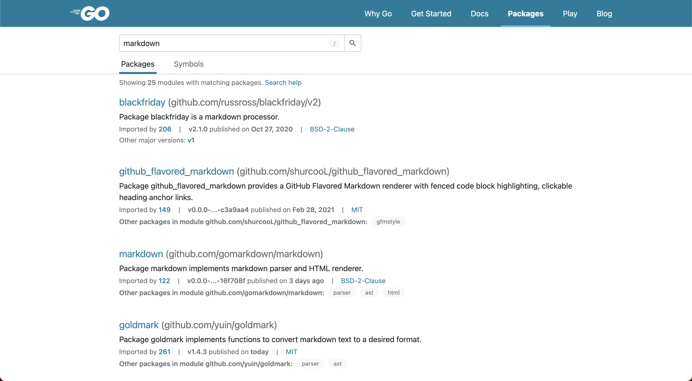
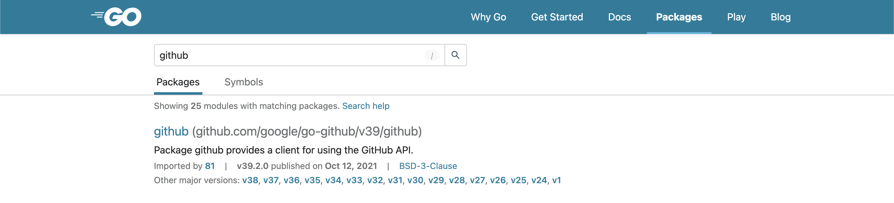
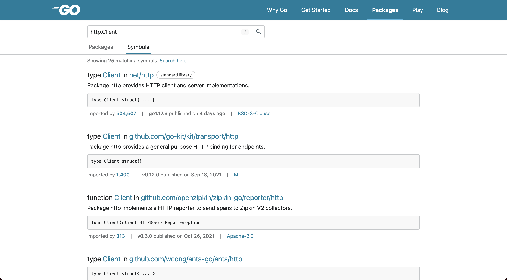

+++
title = "pkg.go.dev上的新搜索体验"
weight = 86
date = 2023-05-18T17:03:08+08:00
type = "docs"
description = ""
isCJKLanguage = true
draft = false
+++

# A new search experience on pkg.go.dev - pkg.go.dev上的新搜索体验

> 原文：[https://go.dev/blog/pkgsite-search-redesign](https://go.dev/blog/pkgsite-search-redesign)

Julie Qiu
9 November 2021

We are excited to launch a new search experience on [pkg.go.dev](https://pkg.go.dev/).

我们很高兴在pkg.go.dev上推出新的搜索体验。

These changes were motivated by [feedback we’ve received](https://go.dev/issue/47321) about the search page, and we hope you enjoy them. This blog post provides an overview of what you can expect to see on the site.

这些变化是由我们收到的关于搜索页面的反馈引起的，我们希望您喜欢这些变化。这篇博文概述了您可以在该网站上看到的内容。

## Grouping related package search results 分组相关包的搜索结果

Search results for packages in the same module are now grouped together. The most relevant package for the search request is highlighted. This change was made to reduce noise when several packages in the same module may be relevant to a search. For example, searching for "markdown" shows a row listing "Other packages in module" for several of the results.

同一模块中的包的搜索结果现在被分组了。与搜索请求最相关的软件包被突出显示。这一变化是为了减少同一模块中的几个包可能与搜索相关时的噪音。例如，搜索 "markdown "会在几个结果中显示出 "模块中的其他包 "一行。

Results for different major versions of the same module are also now grouped together. The highest major version containing a tagged release is highlighted. For example, searching for "github" shows the v39 module, with older versions listed as "Other major versions".

同一模块的不同主要版本的搜索结果现在也被归类在一起。含有标签版本的最高主要版本被突出显示。例如，搜索 "github "显示的是v39模块，而较早的版本则被列为 "其他主要版本"。

Lastly, we have reorganized information related to imports, versions, and licenses. We also added links to these tabs directly from the search results page.

最后，我们重新组织了与进口、版本和许可证有关的信息。我们还从搜索结果页面直接添加了这些标签的链接。

## Introducing symbol search  引入符号搜索

Over the past year, we have introduced more information about symbols on pkg.go.dev and worked on improving the way that information is presented. We launched the ability to view the API history of any package. We also label symbols that are deprecated in the documentation index and hide them by default in the package documentation.

在过去的一年里，我们在pkg.go.dev上引入了更多关于符号的信息，并努力改善信息的呈现方式。我们推出了查看任何软件包的API历史的功能。我们还在文档索引中标注了被废弃的符号，并在软件包文档中默认隐藏了这些符号。

With this search update, pkg.go.dev now also supports searching for symbols in Go packages. When a user types a symbol into the search bar, they will be brought to a new search tab for symbol search results. There are a few different ways in which pkg.go.dev identifies that users are searching for a symbol. We’ve added examples to the pkg.go.dev homepage, and detailed instructions to the [search help page](https://pkg.go.dev/search-help).

通过这次搜索更新，pkg.go.dev现在也支持搜索Go软件包中的符号。当用户在搜索栏中输入一个符号时，他们将被带到一个新的搜索标签，以获得符号搜索结果。pkg.go.dev有几种不同的方式来识别用户正在搜索一个符号。我们在 pkg.go.dev 主页上添加了一些例子，并在搜索帮助页面上添加了详细说明。

## Feedback 反馈信息

We’re excited to share this new search experience with you, and we would love to hear your feedback!

我们很高兴能与您分享这种新的搜索体验，我们也希望听到您的反馈意见

As always, please use the "Report an Issue" button at the bottom of every page on the site to share your input.

一如既往，请使用网站上每个页面底部的 "报告问题 "按钮来分享您的意见。

If you’re interested in contributing to this project, pkg.go.dev is open source! Check out the [contribution guidelines](https://go.googlesource.com/pkgsite/+/refs/heads/master/CONTRIBUTING.md) to find out more.

如果您有兴趣为这个项目做出贡献，pkg.go.dev是开放源代码的！请查看贡献指南，了解其内容。请查看贡献指南以了解更多信息。
