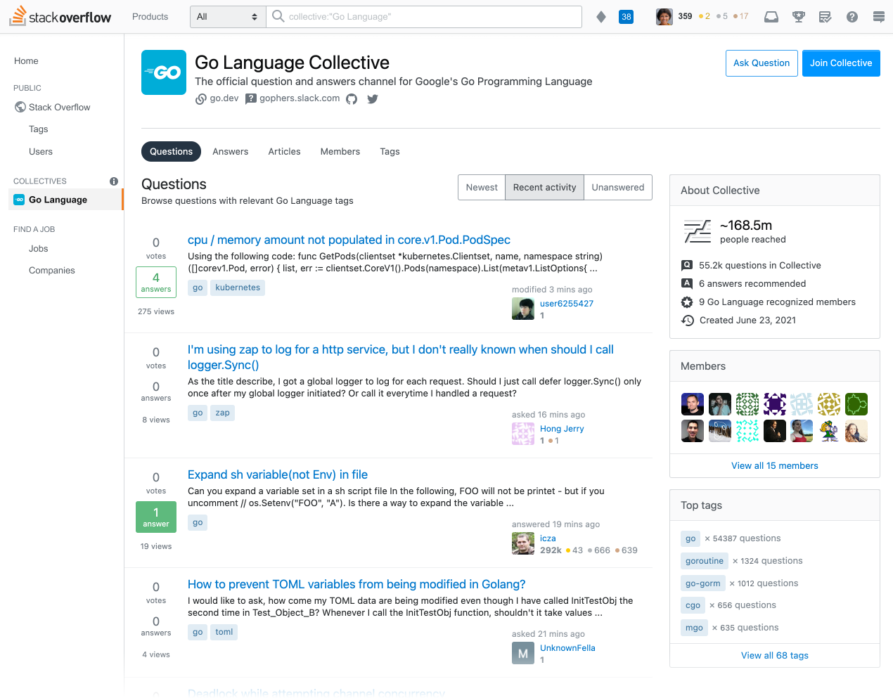

+++
title = "The Go Collective on Stack Overflow"
weight = 92
date = 2023-05-18T17:03:08+08:00
type = "docs"
description = ""
isCJKLanguage = true
draft = false
+++

# The Go Collective on Stack Overflow

> 原文：[https://go.dev/blog/stackoverflow](https://go.dev/blog/stackoverflow)

Steve Francia
23 June 2021

Since the earliest days of Go, Stack Overflow has been a significant part of the Go user experience. For the past five years, the [Go user survey](https://blog.golang.org/survey2020-results) has consistently identified Stack Overflow as the #1 place users go to find answers to their Go questions.

​	从Go的早期开始，Stack Overflow就已经成为Go用户体验的重要组成部分。在过去的五年中，[Go用户调查](../GoDeveloperSurvey2020Results)一直将Stack Overflow列为用户寻找Go问题答案的第一场所。

We are excited to share [the Go Collective](https://stackoverflow.com/collectives/go), the very first open source project in Collectives™ on Stack Overflow, which came as a result of a partnership between Go & Stack Overflow.

​	我们很高兴能与大家分享[Go Collective](https://stackoverflow.com/collectives/go)，它是Stack Overflow上Collectives™的第一个开源项目，是Go和Stack Overflow合作的结果。

​	Go Collective on Stack Overflow web page

​	Go Collective在Stack Overflow的网页

Stack Overflow’s mission for the community is to help make the most out of Stack Overflow as a tool for knowledge reusability. For the millions of users in the Go community, the [Go Collective](https://stackoverflow.com/collectives/go) will be an improved Stack Overflow experience. It will retain the great question and answer experience we’ve all come to appreciate from Stack Overflow. But it will also provide a home for gophers and an opportunity for Go community leaders to have a voice and help establish best practices.

​	Stack Overflow对社区的使命是帮助充分利用Stack Overflow这个工具来实现知识的重用。对于Go社区的数百万用户来说，[Go Collective](https://stackoverflow.com/collectives/go)将是一个改进的Stack Overflow体验。它将保留我们从Stack Overflow获得的伟大的问题和答案体验。但它也将为gophers 提供一个家园，为Go社区的领导者提供一个发表意见和帮助建立最佳实践的机会。

The benefits of the Go Collective will be:

​	Go Collective的好处将是：

- **Find trusted answers faster**: we understand developers often have to test multiple solutions to a problem before finding the right one. With the Go Collective, you’ll now see answers that are recommended by the Go team or provided by Recognized Members, meaning Go team members, Go Google Developer Experts, and Stack Overflow users who have been recognized by Stack Overflow as subject matter experts on Go ecosystem technologies. These users will have a badge identifying them as Recognized Members when they post or edit a question, provide an answer, or write an article.更快地找到可信赖的答案：我们理解开发者在找到正确的解决方案之前，往往要对问题的多个解决方案进行测试。有了Go Collective，您现在会看到由`Go团队`推荐的答案或由认可成员提供的答案，`认可成员`是指Go团队成员、Go Google开发者专家以及Stack Overflow用户，他们被Stack Overflow认可为Go生态系统技术方面的主题专家。这些用户在发布或编辑问题、提供答案或撰写文章时，会有一个徽章来识别他们是公认的会员。
- **Get product information all in one place**: the Go Collectives page on Stack Overflow centralizes all of the questions and answers and content associated with Go and related tags. There will be links from the collective to critical Go websites, and Go websites will direct viewers to the Go Collective on Stack Overflow.在一个地方获得产品信息：Stack Overflow上的Go Collectives页面集中了所有与Go和相关标签相关的问题和答案以及内容。将会有从集体到关键的Go网站的链接，而Go网站将引导浏览者到Stack Overflow上的Go集体。
- **Explore new content formats**: stay up-to-date on our technologies and find more in-depth product information with articles, long-form content like how-to guides and announcements that can be found on the Go Collective page.探索新的内容格式。了解我们技术的最新情况，并通过文章、长篇内容（如操作指南和公告）找到更深入的产品信息，这些都可以在Go Collective页面上找到。
- **Earn recognition**: Collectives on Stack Overflow also gives us a way to recognize you for your contributions to the community. There’s a leaderboard you can access via the Go Collective (see [the "Members" tab](https://stackoverflow.com/collectives/go?tab=members)) that will help identify trusted contributors designated as Recognized Members. If you are interested in becoming a Recognized Member, please email stackoverflow@golang.org. 赢得认可。Stack Overflow上的集体也为我们提供了一种方式来表彰您对社区的贡献。您可以通过Go Collective访问一个排行榜（见 ["Members"标签](https://stackoverflow.com/collectives/go?tab=members)），它将帮助识别被指定为认可成员的受信任贡献者。如果您有兴趣成为公认的成员，请发电子邮件到 stackoverflow@golang.org。

Today Google Cloud is launching their own collective alongside the Go Collective. We are excited to take this step together: Go is the best language for building cloud infrastructure and applications, and Google Cloud is the best place to run Go applications. And now Stack Overflow is the best place to find answers to your Go and Cloud questions.

​	今天，Google Cloud 正在推出他们自己的集体，与Go Collective一起。我们很高兴能一起迈出这一步。Go是构建云基础设施和应用程序的最佳语言，而Google Cloud 是运行Go应用程序的最佳场所。而现在，Stack Overflow是为您的Go和云问题寻找答案的最佳场所。

To read more about this see [Stack Overflow’s blog post](https://stackoverflow.blog/2021/06/23/collectives-stack-overflow/) and [Google Cloud’s blog post](https://cloud.google.com/blog/topics/developers-practitioners/investing-heart-google-cloud-our-developer-and-customer-communities).

​	想了解更多信息，请看[Stack Overflow的博文](https://stackoverflow.blog/2021/06/23/collectives-stack-overflow/)和[Google Cloud的博文](https://cloud.google.com/blog/topics/developers-practitioners/investing-heart-google-cloud-our-developer-and-customer-communities)。
