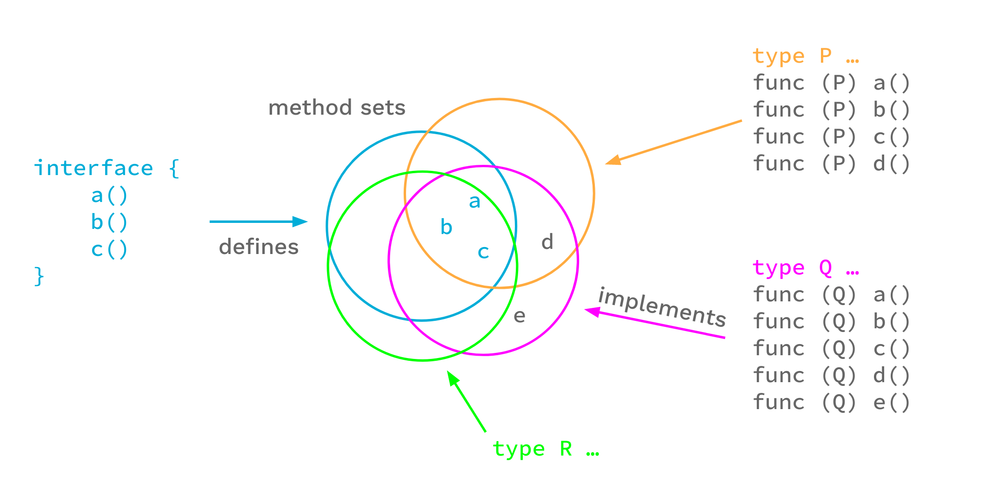

+++
title = "泛型简介"
weight = 96
date = 2023-05-18T17:03:08+08:00
type = "docs"
description = ""
isCJKLanguage = true
draft = false

+++

# An Introduction To Generics - 泛型简介

https://go.dev/blog/intro-generics

Robert Griesemer and Ian Lance Taylor
22 March 2022

## 简介 Introduction 

This blog post is based on our talk at GopherCon 2021:

​	这篇博文是基于我们在2021年GopherCon上的演讲：

<iframe src="https://www.youtube.com/embed/Pa_e9EeCdy8" width="560" height="315" frameborder="0" allowfullscreen="" mozallowfullscreen="" webkitallowfullscreen="" style="box-sizing: border-box;"></iframe>

The Go 1.18 release adds support for generics. Generics are the biggest change we’ve made to Go since the first open source release. In this article we’ll introduce the new language features. We won’t try to cover all the details, but we will hit all the important points. For a more detailed and much longer description, including many examples, see the [proposal document](https://go.googlesource.com/proposal/+/HEAD/design/43651-type-parameters.md). For a more precise description of the language changes, see the [updated language spec](https://go.dev/ref/spec). (Note that the actual 1.18 implementation imposes some restrictions on what the proposal document permits; the spec should be accurate. Future releases may lift some of the restrictions.)

​	Go 1.18版本增加了对泛型的支持。泛型是Go自第一个开源版本以来所做的最大改变。在这篇文章中，我们将介绍新的语言特性。我们不会试图涵盖所有的细节，但我们会抓住所有重要的点。关于更详细和更长的描述，包括许多例子，请看[提案文件](https://go.googlesource.com/proposal/+/HEAD/design/43651-type-parameters.md)。关于语言变化的更精确描述，请看更新的[语言规范]()。(请注意，实际的1.18实现对提案文件所允许的内容施加了一些限制；该规范应该是准确的。未来的版本可能会取消一些限制）。

Generics are a way of writing code that is independent of the specific types being used. Functions and types may now be written to use any of a set of types.

​	泛型是一种编写代码的方式，它独立于正在使用的特定类型。函数和类型现在可以被写成使用一组类型中的任何一种。

Generics add three new big things to the language:

​	泛型在语言中增加了三个新的重要内容：

1. Type parameters for function and types.
2. 为函数和类型提供类型参数。
3. Defining interface types as sets of types, including types that don’t have methods.
4. 将接口类型定义为类型集，包括没有方法的类型。
5. Type inference, which permits omitting type arguments in many cases when calling a function.
6. 类型推断，它允许在许多情况下调用函数时省略类型参数。

## 类型参数 Type Parameters 

Functions and types are now permitted to have type parameters. A type parameter list looks like an ordinary parameter list, except that it uses square brackets instead of parentheses.

​	函数和类型现在被允许有类型参数。一个类型参数列表看起来就像一个普通的参数列表，只是它用方括号代替了圆括号。

To show how this works, let’s start with the basic non-generic `Min` function for floating point values:

​	为了说明这一点，让我们从浮点值的基本非通用的`Min`函数开始：

```go
func Min(x, y float64) float64 {
    if x < y {
        return x
    }
    return y
}
```

We can make this function generic–make it work for different types–by adding a type parameter list. In this example we add a type parameter list with a single type parameter `T`, and replace the uses of `float64` with `T`.

​	我们可以通过添加一个类型参数列表来使这个函数通用化——使其适用于不同的类型。在这个例子中，我们用一个单一的类型参数`T`添加了一个类型参数列表，并用`T`代替`float64`的使用：

```go
import "golang.org/x/exp/constraints"

func GMin[T constraints.Ordered](x, y T) T {
    if x < y {
        return x
    }
    return y
}
```

It is now possible to call this function with a type argument by writing a call like

​	现在可以通过写一个类型实参来调用这个函数，例如

```go
x := GMin[int](2, 3)
```

Providing the type argument to `GMin`, in this case `int`, is called *instantiation*. Instantiation happens in two steps. First, the compiler substitutes all type arguments for their respective type parameters throughout the generic function or type. Second, the compiler verifies that each type argument satisfies the respective constraint. We’ll get to what that means shortly, but if that second step fails, instantiation fails and the program is invalid.

​	在这种情况下，为`GMin`提供类型参数，即`int`，被称为[实例化]()。实例化分为两个步骤。首先，编译器在泛型函数或类型中用其各自的类型参数替换所有类型实参。其次，编译器验证每个类型实参是否满足相应的约束。我们很快就会介绍这是什么意思，但如果第二步失败，实例化失败，程序就是无效的。

After successful instantiation we have a non-generic function that can be called just like any other function. For example, in code like

​	在成功的实例化之后，我们有一个非泛型的函数，可以像其他函数一样被调用。例如，在如下代码中

```go
fmin := GMin[float64]
m := fmin(2.71, 3.14)
```

the instantiation `GMin[float64]` produces what is effectively our original floating-point `Min` function, and we can use that in a function call.

`GMin[float64]`的实例化产生了一个有效的原始浮点`Min`函数，我们可以在函数调用中使用它。

Type parameters can be used with types also.

​	类型参数也可以与类型一起使用。

```go
type Tree[T interface{}] struct {
    left, right *Tree[T]
    value       T
}

func (t *Tree[T]) Lookup(x T) *Tree[T] { ... }

var stringTree Tree[string]
```

Here the generic type `Tree` stores values of the type parameter `T`. Generic types can have methods, like `Lookup` in this example. In order to use a generic type, it must be instantiated; `Tree[string]` is an example of instantiating `Tree` with the type argument `string`.

​	这里，泛型类型`Tree`存储了类型参数`T`的值。泛型类型可以有方法，就像本例中的`Lookup`。为了使用一个泛型，它必须被实例化；`Tree[string]`是一个用类型实参`string`来实例化`Tree`的例子。

## 类型集 Type sets 

Let’s look a bit deeper at the type arguments that can be used to instantiate a type parameter.

​	让我们更深入地看一下可以用来实例化类型参数的类型实参。

An ordinary function has a type for each value parameter; that type defines a set of values. For instance, if we have a `float64` type as in the non-generic function `Min` above, the permissible set of argument values is the set of floating-point values that can be represented by the `float64` type.

​	一个普通的函数对每个值参数都有一个类型；该类型定义了一个值集。例如，如果我们像上面的非泛型函数`Min`那样有一个`float64`类型，那么允许的实参值集合就是可以由`float64`类型表示的浮点值集合。

Similarly, type parameter lists have a type for each type parameter. Because a type parameter is itself a type, the types of type parameters define sets of types. This meta-type is called a *type constraint*.

​	同样地，类型参数列表中的每个类型参数都有一个类型。因为类型参数本身就是一个类型，所以类型参数的类型定义了类型的集合。这种元类型被称为**类型约束**。

In the generic `GMin`, the type constraint is imported from the [constraints package](https://golang.org/x/exp/constraints). The `Ordered` constraint describes the set of all types with values that can be ordered, or, in other words, compared with the < operator (or <= , > , etc.). The constraint ensures that only types with orderable values can be passed to `GMin`. It also means that in the `GMin` function body values of that type parameter can be used in a comparison with the < operator.

​	在泛型函数`GMin`中，类型约束从[constraints package](https://golang.org/x/exp/constraints)中导入。`Ordered`约束描述了具有可排序值的所有类型的集合，换句话说，这些值可以使用`<`运算符（或`<=`，`>`等）进行比较。该约束确保只有具有可排序值的类型才能传递给`GMin`。这也意味着在`GMin`函数体中，该类型参数的值可以与`<`运算符进行比较。

In Go, type constraints must be interfaces. That is, an interface type can be used as a value type, and it can also be used as a meta-type. Interfaces define methods, so obviously we can express type constraints that require certain methods to be present. But `constraints.Ordered` is an interface type too, and the < operator is not a method.

​	在Go中，类型约束必须是接口。也就是说，一个接口类型可以作为一个值类型使用，也可以作为一个元类型使用。接口定义了方法，因此我们可以表达需要特定方法的类型约束。但是`constraints.Ordered`也是一个接口类型，而`<`运算符不是一个方法。 

To make this work, we look at interfaces in a new way.

​	为了使这个工作正常，我们以一种新的方式看待接口。

Until recently, the Go spec said that an interface defines a method set, which is roughly the set of methods enumerated in the interface. Any type that implements all those methods implements that interface.

​	直到最近，Go规范指出，一个接口定义了一个方法集，大致上是在接口中列举的方法的集合。任何实现了所有这些方法的类型都实现了该接口。



But another way of looking at this is to say that the interface defines a set of types, namely the types that implement those methods. From this perspective, any type that is an element of the interface’s type set implements the interface.

​	但是另一种观点是，接口定义了一个类型集，即实现了这些方法的类型。从这个角度来看，任何作为接口类型集合元素的类型都实现了该接口。


The two views lead to the same outcome: For each set of methods we can imagine the corresponding set of types that implement those methods, and that is the set of types defined by the interface.

​	这两种观点导致了相同的结果：对于每组方法，我们可以想象出相应的实现这些方法的类型集，而这就是接口定义的类型集。

For our purposes, though, the type set view has an advantage over the method set view: we can explicitly add types to the set, and thus control the type set in new ways.

​	然而，对于我们的目的来说，**类型集的观点比方法集的观点更有优势**：我们可以明确地向集合中添加类型，从而以新的方式控制类型集。

We have extended the syntax for interface types to make this work. For instance, `interface{ int|string|bool }` defines the type set containing the types `int`, `string`, and `bool`.

​	我们扩展了接口类型的语法以实现这一点。例如，`interface{ int|string|bool }`定义了包含类型`int`、`string`和`bool`的类型集合。


Another way of saying this is that this interface is satisfied by only `int`, `string`, or `bool`.

​	换句话说，这个接口只被`int`、`string`或`bool`所满足。

Now let’s look at the actual definition of `constraints.Ordered`:

​	现在让我们看一下`constraints.Ordered`的实际定义：

```go
type Ordered interface {
    Integer|Float|~string
}
```

This declaration says that the `Ordered` interface is the set of all integer, floating-point, and string types. The vertical bar expresses a union of types (or sets of types in this case). `Integer` and `Float` are interface types that are similarly defined in the `constraints` package. Note that there are no methods defined by the `Ordered` interface.

​	这个声明表示`Ordered`接口是所有整数、浮点数和字符串类型的集合。**竖线表示类型的并集**（或者在这种情况下是类型集合的并集）。`Integer`和`Float`是在`constraints`包中类似定义的接口类型。请注意，`Ordered`接口没有定义任何方法。

For type constraints we usually don’t care about a specific type, such as `string`; we are interested in all string types. That is what the `~` token is for. The expression `~string` means the set of all types whose underlying type is `string`. This includes the type `string` itself as well as all types declared with definitions such as `type MyString string`.

​	对于类型约束，我们通常不关心一个具体的类型，比如`string`；我们关心的是所有的字符串类型。这就是`~`符号的作用。表达式`~string`表示所有底层类型为`string`的类型集。这包括类型`string`本身以及使用`type MyString string`等定义声明的所有类型。

Of course we still want to specify methods in interfaces, and we want to be backward compatible. In Go 1.18 an interface may contain methods and embedded interfaces just as before, but it may also embed non-interface types, unions, and sets of underlying types.

​	当然，我们仍然希望在接口中指定方法，并且希望向后兼容。在Go 1.18中，一个接口可以像以前一样包含方法和嵌入接口，但也可以嵌入非接口类型、并集和底层类型的集合。

When used as a type constraint, the type set defined by an interface specifies exactly the types that are permitted as type arguments for the respective type parameter. Within a generic function body, if the type of a operand is a type parameter `P` with constraint `C`, operations are permitted if they are permitted by all types in the type set of `C` (there are currently some implementation restrictions here, but ordinary code is unlikely to encounter them).

​	当作为类型约束使用时，接口定义的类型集精确地指定了可以作为相应类型参数的类型实参的类型。在泛型函数体内，如果一个操作数的类型是具有约束`C`的类型参数`P`，那么只有当所有在`C`的类型集中的类型都允许该操作时，操作才是允许的（当前存在一些实现限制，但普通代码不太可能遇到这些限制）。

Interfaces used as constraints may be given names (such as `Ordered`), or they may be literal interfaces inlined in a type parameter list. For example:

​	作为约束使用的接口可以被命名（例如`Ordered`），或者它们可以是内联在类型参数列表中的字面量接口。例如：

```go
[S interface{~[]E}, E interface{}]
```

Here `S` must be a slice type whose element type can be any type.

​	这里，`S`必须是一个切片类型，其元素类型可以是任意类型。

Because this is a common case, the enclosing `interface{}` may be omitted for interfaces in constraint position, and we can simply write:

​	因为这是一个常见的情况，对于处于约束位置的接口，可以省略包围的`interface{}`，我们可以简单地写成：

```go
[S ~[]E, E interface{}]
```

Because the empty interface is common in type parameter lists, and in ordinary Go code for that matter, Go 1.18 introduces a new predeclared identifier `any` as an alias for the empty interface type. With that, we arrive at this idiomatic code:

​	因为空接口在类型参数列表中很常见，在普通的Go代码中也是如此，Go 1.18引入了一个新的预先声明的标识符any作为空接口类型的别名。这样，我们就有了这样的习惯性代码：

```go
[S ~[]E, E any]
```

Interfaces as type sets is a powerful new mechanism and is key to making type constraints work in Go. For now, interfaces that use the new syntactic forms may only be used as constraints. But it’s not hard to imagine how explicitly type-constrained interfaces might be useful in general.

​	**将接口作为类型集**是一种强大的新机制，是使类型约束在Go中起作用的关键。目前，使用新的语法形式的接口只能用作约束。但很容易想象，显式类型约束的接口在一般情况下可能非常有用。

## 类型推断 Type inference 

The last new major language feature is type inference. In some ways this is the most complicated change to the language, but it is important because it lets people use a natural style when writing code that calls generic functions.

​	最后一个主要的新语言特性是类型推断。在某些方面，这是语言中最复杂的变更，但它非常重要，因为它允许人们在编写调用泛型函数的代码时使用自然的风格。

### 函数实参类型推断 Function argument type inference 

With type parameters comes the need to pass type arguments, which can make for verbose code. Going back to our generic `GMin` function:

​	随着类型参数的引入，需要传递类型实参，这可能导致代码冗长。回顾一下我们的泛型函数 `GMin`：

```go
func GMin[T constraints.Ordered](x, y T) T { ... }
```

the type parameter `T` is used to specify the types of the ordinary non-type arguments `x`, and `y`. As we saw earlier, this can be called with an explicit type argument

类型参数 `T` 用于指定普通非类型实参 `x` 和 `y` 的类型。正如我们之前所见，可以使用显式类型实参调用它。

```go
var a, b, m float64

m = GMin[float64](a, b) // explicit type argument
```

In many cases the compiler can infer the type argument for `T` from the ordinary arguments. This makes the code shorter while remaining clear.

​	在许多情况下，编译器可以从普通实参推断出类型实参 `T` 的类型。这使得代码更短，同时保持清晰明了。

```go
var a, b, m float64

m = GMin(a, b) // no type argument
```

This works by matching the types of the arguments `a` and `b` with the types of the parameters `x`, and `y`.

​	这是通过将实参 `a` 和 `b` 的类型与参数 `x` 和 `y` 的类型进行匹配来实现的。

This kind of inference, which infers the type arguments from the types of the arguments to the function, is called *function argument type inference*.

​	这种推断类型实参的方式，即根据函数的实参类型推断类型实参的类型，被称为*函数实参类型推断*。

Function argument type inference only works for type parameters that are used in the function parameters, not for type parameters used only in function results or only in the function body. For example, it does not apply to functions like `MakeT[T any]() T`, that only uses `T` for a result.

​	函数实参类型推断仅适用于在函数参数中使用的类型参数，而不适用于仅在函数结果或函数体中使用的类型参数。例如，对于只在结果中使用 `T` 的函数 `MakeT[T any]() T`，它不适用。

### 约束类型推断 Constraint type inference 

The language supports another kind of type inference, *constraint type inference*. To describe this, let’s start with this example of scaling a slice of integers:

​	该语言还支持另一种类型推断，即*约束类型推断*。为了描述这个概念，让我们从缩放整型切片的例子开始：

```go
// Scale returns a copy of s with each element multiplied by c.
// This implementation has a problem, as we will see.
// Scale 函数返回 s 的副本，其中每个元素都乘以 c。
// 正如我们将看到的，这个实现存在问题。
func Scale[E constraints.Integer](s []E, c E) []E {
    r := make([]E, len(s))
    for i, v := range s {
        r[i] = v * c
    }
    return r
}
```

This is a generic function that works for a slice of any integer type.

​	这是一个适用于任何整型切片的泛型函数。

Now suppose that we have a multi-dimensional `Point` type, where each `Point` is simply a list of integers giving the coordinates of the point. Naturally this type will have some methods.

​	现假设我们有一个多维的 `Point` 类型，其中每个 `Point` 只是一个给出点的坐标的整数列表。很自然地，这个类型将有一些方法。

```go
type Point []int32

func (p Point) String() string {
    // Details not important.
}
```

Sometimes we want to scale a `Point`. Since a `Point` is just a slice of integers, we can use the `Scale` function we wrote earlier:

​	有时我们想要对一个 `Point` 进行缩放。由于 `Point` 只是一个整型切片，我们可以使用之前编写的 `Scale` 函数：

```go
// ScaleAndPrint doubles a Point and prints it.
// ScaleAndPrint 函数将一个 Point 的值加倍并打印出来。
func ScaleAndPrint(p Point) {
    r := Scale(p, 2)
    fmt.Println(r.String()) // DOES NOT COMPILE
}
```

Unfortunately this does not compile, failing with an error like `r.String undefined (type []int32 has no field or method String)`.

​	不幸的是，这段代码无法编译，出现类似于 `r.String undefined (type []int32 has no field or method String)` 的错误。

The problem is that the `Scale` function returns a value of type `[]E` where `E` is the element type of the argument slice. When we call `Scale` with a value of type `Point`, whose underlying type is `[]int32`, we get back a value of type `[]int32`, not type `Point`. This follows from the way that the generic code is written, but it’s not what we want.

​	问题在于 `Scale` 函数返回的是类型为 `[]E` 的值，其中 `E` 是实参切片的元素类型。当我们使用类型为 `Point`（其底层类型为 `[]int32`）的值调用 `Scale` 时，我们得到的是类型为 `[]int32` 而不是 `Point` 的值。这是由于泛型代码的编写方式所导致的，但这并不是我们想要的。

In order to fix this, we have to change the `Scale` function to use a type parameter for the slice type.

​	为了解决这个问题，我们必须改变 `Scale` 函数，使用一个类型参数来表示切片类型。

```go
// Scale returns a copy of s with each element multiplied by c.
// Scale 函数返回将 s 的每个元素乘以 c 后的副本。
func Scale[S ~[]E, E constraints.Integer](s S, c E) S {
    r := make(S, len(s))
    for i, v := range s {
        r[i] = v * c
    }
    return r
}
```

We’ve introduced a new type parameter `S` that is the type of the slice argument. We’ve constrained it such that the underlying type is `S` rather than `[]E`, and the result type is now `S`. Since `E` is constrained to be an integer, the effect is the same as before: the first argument has to be a slice of some integer type. The only change to the body of the function is that now we pass `S`, rather than `[]E`, when we call `make`.

​	我们引入了一个新的类型参数 `S`，它是切片实参的类型。我们对它进行了约束，使其底层类型为 `S` 而不是 `[]E`【2023年6月18日17:36:47 个人注释：我想这里的底层类型应该是`[]E`而不是 `S`吧】，并且结果类型现在是 `S`。由于 `E` 受限于整型，效果与之前相同：第一个实参必须是某种整型的切片。该函数体唯一的变化是在调用 `make` 时现在传递的是 `S` 而不是 `[]E`。

The new function acts the same as before if we call it with a plain slice, but if we call it with the type `Point` we now get back a value of type `Point`. That is what we want. With this version of `Scale` the earlier `ScaleAndPrint` function will compile and run as we expect.

​	新的函数在使用普通切片调用时与之前的函数行为相同，但如果我们使用类型 `Point` 来调用它，现在会得到一个类型为 `Point` 的值。这正是我们想要的。有了这个版本的 `Scale`，之前的 `ScaleAndPrint` 函数将会按预期编译和运行。

But it’s fair to ask: why is it OK to write the call to `Scale` without passing explicit type arguments? That is, why can we write `Scale(p, 2)`, with no type arguments, rather than having to write `Scale[Point, int32](p, 2)`? Our new `Scale` function has two type parameters, `S` and `E`. In a call to `Scale` not passing any type arguments, function argument type inference, described above, lets the compiler infer that the type argument for `S` is `Point`. But the function also has a type parameter `E` which is the type of the multiplication factor `c`. The corresponding function argument is `2`, and because `2` is an *untyped* constant, function argument type inference cannot infer the correct type for `E` (at best it might infer the default type for `2` which is `int` and which would be incorrect). Instead, the process by which the compiler infers that the type argument for `E` is the element type of the slice is called *constraint type inference*.

​	但是我们可以问：为什么在调用 `Scale` 时可以不传递显式的类型实参？也就是说，为什么我们可以写成 `Scale(p, 2)`，而不需要写成 `Scale[Point, int32](p, 2)`？我们的新 `Scale` 函数有两个类型参数，`S` 和 `E`。在没有传递任何类型实参的 `Scale` 调用中，上面描述的函数实参类型推断使得编译器可以推断出 `S` 的类型实参是 `Point`。但是函数还有一个类型参数 `E`，它是乘法因子 `c` 的类型。相应的函数实参是 `2`，由于 `2` 是一个*无类型*常量，函数实参类型推断无法推断出 `E` 的正确类型（最多可能推断出 `2` 的默认类型 `int`，但这是不正确的）。相反，编译器推断出 `E` 的类型实参是切片的元素类型的过程被称为*约束类型推断*。

Constraint type inference deduces type arguments from type parameter constraints. It is used when one type parameter has a constraint defined in terms of another type parameter. When the type argument of one of those type parameters is known, the constraint is used to infer the type argument of the other.

​	约束类型推断从类型参数的约束中推导出类型参数的类型。当一个类型参数的约束以另一个类型参数的形式定义时，就会使用约束类型推断。当其中一个类型参数的类型实参已知时，约束类型推断会用于推断另一个类型实参的类型。

The usual case where this applies is when one constraint uses the form `~`*`type`* for some type, where that type is written using other type parameters. We see this in the `Scale` example. `S` is `~[]E`, which is `~` followed by a type `[]E` written in terms of another type parameter. If we know the type argument for `S` we can infer the type argument for `E`. `S` is a slice type, and `E` is the element type of that slice.

​	通常情况下，这种情况适用于约束使用 `~` `type`  的形式表示某种类型，而该类型是使用其他类型参数编写的情况。我们可以在 `Scale` 的示例中看到这一点。`S` 是 `~[]E`，它由 `~` 后跟一个使用其他类型参数编写的类型 `[]E` 组成。如果我们知道 `S` 的类型实参，就可以推断出 `E` 的类型实参（的类型）。`S` 是一个切片类型，而 `E` 是该切片的元素类型。

This was just an introduction to constraint type inference. For full details see the [proposal document](https://go.googlesource.com/proposal/+/HEAD/design/43651-type-parameters.md) or the [language spec](https://go.dev/ref/spec).

​	这只是对约束类型推断的简单介绍。有关详细信息，请参阅[提案文档](https://go.googlesource.com/proposal/+/HEAD/design/43651-type-parameters.md)或[语言规范]()。

### 实践中的类型推断 Type inference in practice 

The exact details of how type inference works are complicated, but using it is not: type inference either succeeds or fails. If it succeeds, type arguments can be omitted, and calling generic functions looks no different than calling ordinary functions. If type inference fails, the compiler will give an error message, and in those cases we can just provide the necessary type arguments.

​	类型推断的具体细节很复杂，但使用它并不复杂：类型推断要么成功，要么失败。如果成功，可以省略类型实参，调用泛型函数与调用普通函数没有区别。如果类型推断失败，编译器会给出错误消息，在这些情况下，我们只需要提供必要的类型实参即可。

In adding type inference to the language we’ve tried to strike a balance between inference power and complexity. We want to ensure that when the compiler infers types, those types are never surprising. We’ve tried to be careful to err on the side of failing to infer a type rather than on the side of inferring the wrong type. We probably have not gotten it entirely right, and we may continue to refine it in future releases. The effect will be that more programs can be written without explicit type arguments. Programs that don’t need type arguments today won’t need them tomorrow either.

​	在向该语言中添加类型推断时，我们试图在推断能力和复杂性之间取得平衡。我们希望确保当编译器推断类型时，这些类型永远不会令人惊讶。我们试图小心谨慎地偏向于无法推断类型而不是推断错误的类型。我们可能没有完全做到，而且我们可能会在以后的版本中继续完善它。其效果将使更多的程序能够在不需要显式类型实参的情况下编写。今天不需要类型实参的程序明天也不需要。

## 总结 Conclusion 

Generics are a big new language feature in 1.18. These new language changes required a large amount of new code that has not had significant testing in production settings. That will only happen as more people write and use generic code. We believe that this feature is well implemented and high quality. However, unlike most aspects of Go, we can’t back up that belief with real world experience. Therefore, while we encourage the use of generics where it makes sense, please use appropriate caution when deploying generic code in production.

​	泛型是 1.18 版中一个重要的新语言特性。这些新的语言变更需要大量的新代码，尚未在生产环境中进行过重大测试。这只有在更多人编写和使用泛型代码时才会发生。我们相信这个特性已经得到了很好的实现和高质量。然而，与 Go 的大多数方面不同的是，我们无法凭借真实的实际经验来支持这种信念。因此，虽然我们鼓励在合适的情况下使用泛型，但在生产中部署泛型代码时请适当谨慎。

That caution aside, we’re excited to have generics available, and we hope that they will make Go programmers more productive.

​	除此以外，我们很高兴能提供泛型，并希望它们能使 Go 程序员的工作效率更高。
