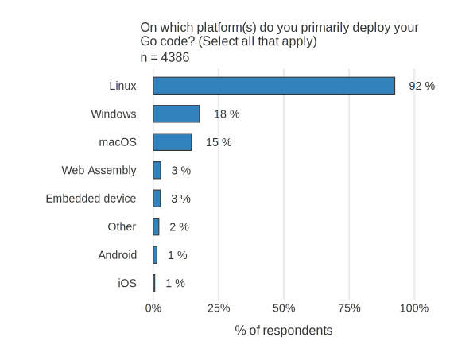

+++
title = "2021年Go开发者调查结果"
weight = 91
date = 2023-05-18T17:03:08+08:00
type = "docs"
description = ""
isCJKLanguage = true
draft = false
+++

# Go Developer Survey 2021 Results - 2021年Go开发者调查结果

> 原文：[https://go.dev/blog/survey2021-results](https://go.dev/blog/survey2021-results)

Alice Merrick
19 April 2022

## A huge thank you to the community for the amazing response! 非常感谢社区的惊人反应！

In 2021, we ran the Go Developer Survey from Oct 26th to Nov 16th and had 11,840 responses—the largest turnout so far in the 6 years we’ve been running the survey! Thank you for putting in the time to provide the community with these insights on your experiences using Go.

2021年，我们从10月26日到11月16日进行了Go开发者调查，得到了11840份回复--这是我们进行调查6年以来最大的一次。感谢您们花时间向社区提供关于您们使用Go的经验的这些见解。

## Highlights 亮点

- Most responses were consistent with prior years. For example, [satisfaction with Go is still very high at 92%](https://go.dev/blog/survey2021-results#satisfaction) and 75% of respondents use Go at work.大多数回复与往年一致。例如，对Go的满意度仍然很高，达到92%，75%的受访者在工作中使用Go。
- This year we [randomly sampled](https://go.dev/blog/survey2021-results#changes) some participants using the Go VS Code plugin, which resulted in some shifts in who responded to the survey.今年，我们使用 Go VS Code 插件对一些参与者进行了随机抽样，这导致了对调查的回应者出现了一些变化。
- Missing critical libraries, language features and infrastructure were the most [common barriers to using Go](https://go.dev/blog/survey2021-results#adoption). (note: this survey ran prior to the release of Go 1.18 with generics, the #1 most reported missing feature)缺少关键库、语言功能和基础设施是使用Go的最常见障碍。(注：本次调查是在Go 1.18发布之前进行的，Go 1.18的泛型是报告中最缺失的第一大功能)
- Respondents want to [prioritize improvements](https://go.dev/blog/survey2021-results#prioritization) to debugging and dependency management.受访者希望优先改善调试和依赖项管理。
- The [biggest challenges when using modules](https://go.dev/blog/survey2021-results#modules) concerned versioning, using private repos and multi-module workflows. (note: this survey was run prior to Go 1.18 which introduced workspaces addressing many of these concerns).在使用模块时，最大的挑战涉及到版本管理、使用私有仓库和多模块工作流程。(注：这项调查是在Go 1.18之前进行的，Go 1.18引入了工作空间，解决了许多这些问题）。
- 81% of respondents are [confident in the long term direction of the Go project](https://go.dev/blog/survey2021-results#satisfaction).81%的受访者对Go项目的长期发展方向有信心。

## Who did we hear from?  我们听取了谁的意见？

Our demographics have been pretty stable year over year ([See 2020 results](https://go.dev/blog/survey2020-results)). Consistent with previous years, Go is primarily used in the tech industry. 70% of respondents were software developers, with a few in IT or DevOps and 76% of respondents said they program in Go at work.   

Bar chart of industries where respondents work Bar chart showing Go used more at work than outide of work Bar chart of uses for Go where API/RPC services and CLI apps are most common

受访者工作的行业柱状图 柱状图显示Go在工作中的使用多于工作以外的使用 Go的用途柱状图，其中API/RPC服务和CLI应用程序最常见。

Some new demographics from 2021:

2021年的一些新的人口统计资料：

- Most respondents describe their organization as an enterprise or small to medium business, with about a quarter describing their organization as a startup. Consultancies and public institutions were much less common.大多数受访者将其组织描述为企业或中小型企业，约有四分之一的人将其组织描述为初创企业。咨询公司和公共机构的情况要少得多。
- The vast majority of respondents work on teams of less than ten people.绝大多数受访者在不到10人的团队中工作。
- Over half (55%) of respondents use Go at work on a daily basis. Respondents use Go less frequently outside of work.超过一半（55%）的受访者每天在工作中使用Go。受访者在工作之外使用Go的频率较低。

  

Bar chart of organization type where enterprise is the most common response Bar chart of team size where 2 to 5 is the most common size Frequency of using Go at work versus outside of work where using Go at work is most often on a daily basis and outside of work is less common and most often on a weekly basis

组织类型条形图，其中企业是最常见的回答 团队规模条形图，其中2至5人是最常见的规模 在工作中与工作外使用Go的频率，其中在工作中使用Go最常见的是每天，工作外不太常见，最常见的是每周。

### Gender identity 性别认同

We ask about gender identity on the survey because it gives us an idea of who is being represented in the results and adds another dimension to measure the inclusivity of the community. The Go team values diversity and inclusion, not only because it’s the right thing to do, but because diverse voices help us make better decisions. This year we rephrased the gender identity question to be more inclusive of other gender identities. About the same proportion identified as women as previous years (2%). This was true in the [randomly sampled group](https://go.dev/blog/survey2021-results#changes) as well, suggesting this is not just due to sampling. 

我们在调查中询问性别认同，因为这让我们了解到谁在结果中得到了体现，并为衡量社区的包容性增加了另一个层面。Go团队重视多样性和包容性，不仅因为这是一件正确的事情，而且因为不同的声音有助于我们做出更好的决定。今年，我们重新表述了性别认同的问题，使之更能包容其他性别认同。认定为女性的比例与往年大致相同（2%）。在随机抽样组中也是如此，这表明这不仅仅是抽样的原因。

Bar chart showing gender identity of respondents where 92% of respondents identify as male

条形图显示受访者的性别认同，其中92%的受访者认同为男性

### Assistive technology 协助性技术

This year we again found that about 8% of respondents are using some form of assistive technology. Most challenges concerned a need for higher contrast themes and increased font sizes on Go-related websites or in their code editors; we’re planning to act on the website feedback later this year. These accessibility needs are something we should all keep in mind when contributing to the Go ecosystem.

今年我们再次发现，大约8%的受访者正在使用某种形式的辅助技术。大多数挑战涉及到在Go相关网站或其代码编辑器中需要更高的对比度主题和更大的字体大小；我们计划在今年晚些时候对网站的反馈采取行动。这些可访问性需求是我们在为Go生态系统做出贡献时应该牢记的。

## A closer look at challenges to Go adoption 仔细观察采用Go的挑战

This year we revised our questions to target actual cases where Go wasn’t adopted and why. First, we asked whether or not respondents had evaluated using another language against Go in the last year. 43% of respondents said they had either evaluated switching to Go, from Go, or adopting Go when there wasn’t a previously established language. 80% of these evaluations were primarily for business reasons.

今年我们修改了我们的问题，以针对Go没有被采用的实际案例和原因。首先，我们问受访者在过去一年中是否评估过使用其他语言来替代Go。43%的受访者表示，他们曾经评估过从Go转到Go，或者在之前没有既定语言的情况下采用Go。这些评估中的80%主要是出于商业原因。

Chart showing proportion of respondents who evaluated Go against another language in the last year

图表显示在过去一年中对Go和其他语言进行评估的受访者比例

We expected the most common use cases for Go would be the most common intended uses for those evaluating Go. API/RPC services was by far the most common use, but surprisingly, data processing was the second most common intended use case.

我们预计Go最常见的用例将是评估Go的人最常见的预期用途。到目前为止，API/RPC服务是最常见的用途，但令人惊讶的是，数据处理是第二常见的预期用途。

Chart showing the kind application they considered using Go

显示他们考虑使用Go的那种应用的图表

Of those respondents who evaluated Go, 75% ended up using Go. (Of course, since nearly all survey respondents report using Go, we likely are not hearing from developers who evaluated Go and decided against using it.)

在那些评估了Go的受访者中，75%的人最终使用了Go。(当然，由于几乎所有的调查对象都报告说在使用Go，我们很可能没有听到那些评估过Go但决定不使用它的开发者的声音）。

Chart showing proportion who used Go compared to those who stayed with the current language or chose another language

图中显示了使用Go的比例与保持现有语言或选择其他语言的比例的比较

To those who evaluated Go and didn’t use it, we then asked what challenges prevented them from using Go and which of those was the primary barrier. 

对于那些评估过 Go 但没有使用它的人，我们问他们有哪些困难阻碍了他们使用 Go，其中哪个是主要障碍。

Chart showing barriers to using Go

显示使用Go的障碍的图表

The picture we get from these results supports previous findings that missing features and lack of ecosystem / library support are the most significant technical barriers to Go adoption.

我们从这些结果中得到的情况支持了之前的发现，即功能缺失和缺乏生态系统/库支持是采用Go的最重要的技术障碍。

We asked for more details on what features or libraries respondents were missing and found that generics was the most common critical missing feature—we expect this to be a less significant barrier after the introduction of generics in Go 1.18. The next most common missing features had to do with Go’s type system. We would like to see how introducing generics may influence or resolve underlying needs around Go’s type system before making additional changes. For now, we will gather more information on the contexts for these needs and may in the future explore different ways to meet those needs such as through tooling, libraries or changes to the type system.

我们询问了更多关于受访者缺少哪些功能或库的细节，发现泛型是最常见的关键性缺失功能--我们希望在Go 1.18引入泛型之后，这将成为一个不太重要的障碍。接下来最常见的缺失功能是与Go的类型系统有关的。我们希望在做出更多改变之前，看看引入泛型会如何影响或解决围绕Go类型系统的潜在需求。目前，我们将收集更多关于这些需求背景的信息，并可能在未来探索不同的方式来满足这些需求，例如通过工具、库或对类型系统的改变。

As for missing libraries, there was no clear consensus on what addition would unblock the largest proportion of those wanting to adopt Go. That will require additional exploration.

至于缺失的库，对于增加什么样的库可以解开最大比例的想采用Go的人的障碍，并没有明确的共识。这需要进一步的探索。

So what did respondents use instead when they didn’t choose Go?

那么，当受访者不选择Go时，他们用什么来代替呢？

Chart of which languages respondents used instead of Go

受访者使用哪些语言代替Go的图表

Rust, Python, and Java are the most common choices. [Rust and Go have complementary feature sets](https://thenewstack.io/rust-vs-go-why-theyre-better-together/), so Rust may be a good option for when Go doesn’t meet feature needs for a project. The primary reasons for using Python were missing libraries and existing infrastructure support, so Python’s large package ecosystem may make it difficult to switch to Go. Similarly, the most common reason for using Java instead was because of Go’s missing features, which may be alleviated by the introduction of generics in the 1.18 release.

Rust、Python和Java是最常见的选择。Rust和Go有互补的功能集，所以当Go不能满足项目的功能需求时，Rust可能是一个不错的选择。使用Python的主要原因是缺少库和现有的基础设施支持，所以Python的大型软件包生态系统可能会使其难以转换为Go。同样地，使用Java的最常见原因是Go的功能缺失，这可能会因为1.18版本中引入泛型而得到缓解。

## Go satisfaction and prioritization Go的满意度和优先级

Let’s look at areas where Go is doing well and where things can be improved.

让我们看看Go在哪些方面做得好，哪些方面可以改进。

Consistent with last year, 92% of respondents said they were very or somewhat satisfied using Go during the past year.

与去年一致，92%的受访者表示他们在过去一年中对使用Go非常满意或比较满意。

Overall satisfaction on a 5 points scale from very dissatisfied to very satisfied

总体满意度为5分，从非常不满意到非常满意

Year over year trends in community attitudes have seen minor fluctuations. Those using Go for less than 3 months tend to be less likely to agree with these statements. Respondents are increasingly finding Go critical for their company’s success.

社区态度的逐年变化趋势出现了轻微的波动。使用Go不到3个月的人往往不太可能同意这些说法。受访者越来越发现Go对他们公司的成功至关重要。

 

Attitudes around using Go at work Community attitudes around welcomeness and confidence in direction of the Go project

在工作中使用Go的态度 社区对Go项目的欢迎程度和信心的态度

### Prioritization 确定优先次序

The last few years we’ve asked respondents to rate specific areas on how satisfied they are and how important those areas are to them; we use this information to identify areas that are important to respondents, but with which they are unsatisfied. However, most of these areas have shown only minor differences in both importance and satisfaction.

在过去的几年里，我们要求受访者对特定领域的满意度以及这些领域对他们的重要性进行评分；我们利用这些信息来确定对受访者很重要，但他们不满意的领域。然而，这些领域中的大多数在重要性和满意度方面都只表现出微小的差异。

Scatter plot of importance compared to satisfaction showing most areas have high satisfaction and where binary size is less important than other areas

重要性与满意度的散点图显示，大多数领域的满意度较高，而二进制规模的重要性低于其他领域。

This year we introduced a new question to explore alternative ways to prioritize work on specific areas. "Let’s say you have 10 GopherCoins to spend on improving the following aspects of working with Go. How would you distribute your coins?" Two areas that stood out as receiving significantly more GopherCoins were dependency management (using modules) and diagnosing bugs, areas that we’ll be dedicating resources during 2022.

今年，我们引入了一个新的问题，以探索确定特定领域工作优先次序的其他方法。"假设您有10个GopherCoins可以用来改善Go工作的以下方面。您会如何分配您的硬币？" 突出的两个领域是依赖项管理（使用模块）和诊断错误，我们将在2022年投入资源。

Overall sum of coins spent on each area for improvement

花在每个改进领域的金币总和

### Challenges when working with modules 使用模块时的挑战

The most common module-related challenge was working across multiple modules (19% of respondents), followed by comments about versioning (including trepidation around committing to a stable v1 API). Related to versioning, 9% of responses discussed version management or updating dependencies. Rounding out the top 5 were challenges around private repos (including authentication with GitLab in particular) and remembering the different `go mod` commands plus understanding their error messages.

最常见的与模块相关的挑战是跨多个模块工作（19%的受访者），其次是关于版本的评论（包括对稳定的v1版API的恐惧）。与版本有关，9%的答复讨论了版本管理或更新依赖关系。排在前五位的是关于私有仓库的挑战（包括对GitLab的认证）和记住不同的go mod命令以及理解它们的错误信息。

## Learning Go 学习Go

This year we adopted a new construct to explore relative productivity among different levels of experience with Go. The vast majority of respondents (88%) agree that they regularly reach a high level of productivity and 85% agree they’re often able to achieve a flow state when writing in Go. The proportion of agreement increases as experience with Go increases.

今年，我们采用了一种新的结构来探索不同程度的Go经验的相对生产力。绝大多数受访者（88%）同意他们经常达到较高的生产力水平，85%同意他们在用Go写作时经常能够达到流畅的状态。同意的比例随着Go经验的增加而增加。

Charts showing proportion of respondents who agree they feel productive using Go and can achieve a state of flow while writing in Go

图表显示同意在使用Go时感觉到生产力和在用Go写作时能达到流动状态的受访者的比例

### In which areas should we invest in best practice docs? 我们应该在哪些领域投资最佳实践文档？

Half of respondents wanted more guidance on best practices on performance optimization and project directory structure. Unsurprisingly, new Gophers (using Go for less than 1 year) need more guidance than more experienced Gophers, though the top areas were consistent across both groups. Notably, new Gophers asked for more guidance in concurrency than more experienced Gophers.

一半的受访者希望在性能优化和项目目录结构的最佳实践方面得到更多指导。不足为奇的是，新的Gophers（使用Go不到一年）比更有经验的Gophers需要更多的指导，尽管两组的首要领域都是一致的。值得注意的是，新的Gophers比有经验的Gophers在并发性方面要求更多的指导。

Chart showing which areas respondents want more guidance on best practices

图表显示受访者希望在哪些领域得到更多的最佳实践指导

### How do developers learn a new language? 开发者如何学习新语言？

About half of respondents learned a new language at work, but almost as many (45%) learn outside of school or work. Respondents most often (90%) reported learning alone. Of those who said they learned at work, where there may be opportunities to learn as a group, 84% learned alone rather than as a group.

大约一半的受访者在工作中学习新语言，但几乎同样多的人（45%）在学校或工作之外学习。受访者最常说的是（90%）独自学习。在那些说他们在工作中学习的人中，可能有机会作为一个团体学习，84%的人是独自学习，而不是作为一个团体。

 

Chart showing half of respondents learned a new language at work while 45% learned a new language outside of school or work Chart showing 90% of respondents learned their last new language alone

图表显示一半的受访者在工作中学习新语言，而45%的受访者在学校或工作之外学习新语言 图表显示90%的受访者独自学习最后一门新语言

Many of the top resources highlight the importance of good documentation, but live instruction stands out as a particularly useful resource for language learning as well.

许多顶级资源都强调了良好文档的重要性，但现场教学也是一种对语言学习特别有用的资源。

Chart showing which resources are most helpful for learning a new programming language where reading reference docs and written tutorials are most useful

图表显示哪些资源对学习一门新的编程语言最有帮助，其中阅读参考文档和书面教程最为有用

## Developer tools and practices 开发者工具和实践

As in prior years, the vast majority of survey respondents reported working with Go on Linux (63%) and macOS (55%) systems. The proportion of respondents who primarily develop on Linux appears to be slightly trending down over time.

与往年一样，绝大部分调查对象表示在Linux（63%）和macOS（55%）系统上使用Go。主要在Linux上开发的受访者的比例似乎随着时间的推移略有下降的趋势。

Primary operating system from 2019 to 2021

2019年至2021年的主要操作系统

### Targeted platforms 目标平台

Over 90% of respondents target Linux! Even though more respondents develop on macOS than Windows, they more often deploy to Windows than macOS.

超过90%的受访者以Linux为目标! 即使在macOS上开发的受访者比Windows多，但他们更经常部署到Windows而不是macOS。

Chart showing which platforms respondents deploy their Go code on 

显示受访者在哪些平台上部署Go代码的图表 

### Fuzzing 模糊处理

Most respondents are unfamiliar with fuzzing or still consider themselves new to fuzzing. Based on this finding, we plan to 1) ensure Go’s fuzzing documentation explains fuzzing concepts in addition to the specifics of fuzzing in Go, and 2) design output and error messages to be actionable, so as to help developers who are new to fuzzing apply it successfully.

大多数受访者不熟悉模糊处理，或者认为自己还是模糊处理的新手。基于这一发现，我们计划：1）确保Go的模糊测试文档除了解释Go中模糊测试的具体内容外，还解释了模糊测试的概念；2）将输出和错误信息设计成可操作的，以帮助刚接触模糊测试的开发者成功应用它。

Chart showing proportion of respondents who have used fuzzing

显示使用过模糊测试的受访者比例的图表

## Cloud computing 云计算

Go was designed with modern distributed computing in mind, and we want to continue to improve the developer experience of building cloud services with Go. The proportion of respondents deploying Go programs to three largest global cloud providers (Amazon Web Services, Google Cloud Platform, and Microsoft Azure) remained about the same this year and on-prem deployments to self-owned or company-owned servers continue to decrease.

Go的设计考虑到了现代分布式计算，我们希望继续改善开发者使用Go构建云服务的体验。今年，将Go程序部署到全球三大云计算供应商（亚马逊网络服务、谷歌云平台和微软Azure）的受访者比例基本保持不变，而部署到自家或公司自有服务器的内部部署继续减少。

Bar chart of cloud providers used to deploy Go programs where AWS is the most common at 44%

用于部署Go程序的云供应商柱状图，其中AWS是最常见的，占44%。

Respondents deploying to AWS saw increases in deploying to a managed Kubernetes platform, now at 35% of those who deploy to any of the three largest cloud providers. All of these cloud providers saw a drop in the proportion of users deploying Go programs to VMs.

部署到AWS的受访者在部署到受管理的Kubernetes平台方面有所增长，目前在部署到三大云供应商中的35%。所有这些云供应商在将Go程序部署到虚拟机上的用户比例都有所下降。

Bar charts of proportion of services being used with each provider

各供应商正在使用的服务比例柱状图

## Changes this year 今年的变化

Last year we introduced a [modular survey design](https://go.dev/blog/survey2020-results) so that we could ask more questions without lengthening the survey. We continued the modular design this year, although some questions were discontinued and others were added or modified. No respondents saw all the questions on the survey. Additionally, some questions may have much smaller sample sizes because they were asked selectively based on a previous question.

去年我们引入了模块化的调查设计，这样我们可以在不延长调查的情况下提出更多问题。今年我们继续采用模块化设计，尽管有些问题被取消了，有些问题被增加或修改。没有受访者看到调查表上的所有问题。此外，有些问题的样本量可能小得多，因为它们是根据前一个问题有选择地提出的。

The most significant change to the survey this year was in how we recruited participants. In previous years, we announced the survey through the Go Blog, where it was picked up on various social channels like Twitter, Reddit, or Hacker News. This year, in addition to the traditional channels, we used the VS Code Go plugin to randomly select users to be shown a prompt asking if they’d like to participate in the survey. This created a random sample that we used to compare the self-selected respondents from our traditional channels and helped identify potential effects of [self-selection bias](https://en.wikipedia.org/wiki/Self-selection_bias).

今年的调查最重要的变化是我们招募参与者的方式。在前几年，我们通过Go Blog宣布调查，在Twitter、Reddit或Hacker News等各种社交渠道上进行报道。今年，除了传统渠道外，我们还使用VS Code Go插件随机选择用户，向他们显示一个提示，询问他们是否愿意参与调查。这创造了一个随机样本，我们用它来比较来自传统渠道的自我选择的受访者，并帮助识别自我选择偏差的潜在影响。

Proportion of respondents from each source

来自每个来源的受访者的比例

Almost a third of our respondents were sourced this way so their responses had the potential to significantly impact the responses we saw this year. Some of the key differences we see between these two groups are:

我们几乎有三分之一的受访者是通过这种方式获得的，因此他们的答复有可能对我们今年看到的答复产生重大影响。我们在这两组人之间看到的一些主要差异是：

### More new Gophers 更多新Gophers 

The randomly selected sample had a higher proportion of new Gophers (those using Go for less than a year). It could be that new Gophers are less plugged into the Go ecosystem or the social channels, so they were more likely to see the survey advertised in their IDE than find it through other means. Regardless of the reason, it’s great to hear from a wider slice of the Go community.

随机抽取的样本中，新Gophers（使用Go不到一年的人）的比例更高。这可能是由于新Go手对Go生态系统或社交渠道的了解较少，所以他们更有可能在他们的IDE中看到调查的广告，而不是通过其他途径找到它。不管是什么原因，能听到更多Go界人士的意见是件好事。

Comparison of proportion of respondents with each level of experience for randomly sampled versus self-selected groups

随机抽样组与自选组中具有不同经验水平的受访者比例比较

### More VS Code users 更多的VS Code用户

It’s unsurprising 91% of respondents who came to the survey from the VS Code plugin prefer to use VS Code when using Go. As a result, we saw much higher editor preferences for VS Code this year. When we exclude the random sample, the results are not statistically different from last year, so we know this is the result of the change in our sample and not overall preference. Similarly, VS Code users are also more likely to develop on Windows than other respondents so we see a slight increase in the preference for Windows this year. We also saw slight shifts in the usage of certain developer techniques that are common with VS Code editor usage.

91%来自VS Code插件的受访者在使用Go时喜欢使用VS Code，这并不奇怪。因此，我们看到今年的编辑器对VS Code的偏好要高得多。当我们排除随机样本时，结果与去年没有统计学上的差异，所以我们知道这是我们样本变化的结果，而不是整体偏好。同样，VS Code用户也比其他受访者更倾向于在Windows上开发，所以我们看到今年对Windows的偏好略有增加。我们还看到，在VS Code编辑器的使用中，某些开发者技术的使用也有轻微的变化。

  

Grouped bar chart of which editor respondents prefer from each sample group Grouped bar chart of primary operating system respondents use to develop go on Grouped bar chart showing which techniques respondents use when writing in Go

每个样本组的受访者喜欢哪种编辑器的分组条形图 受访者使用的主要操作系统的分组条形图 显示受访者在用Go写作时使用哪些技术的分组条形图

### Different resources 不同的资源

The randomly selected sample was less likely to rate social channels like the Go Blog as among their top resources for answering Go-related questions, so they may have been less likely to see the survey advertised on those channels.

随机抽取的样本不太可能将Go博客等社交渠道列为他们回答Go相关问题的首选资源，因此他们可能不太可能在这些渠道上看到调查的广告。

Grouped bar chart showing the top resources respondents use when writing in Go

分组条形图显示了受访者在用Go写作时使用的首要资源

## Conclusion 结语

Thank you for joining us in reviewing the results of our 2021 developer survey! To reiterate, some key takeaways:

感谢您和我们一起回顾2021年开发者调查的结果! 重申一下，一些关键的收获：

- Most of our year over year metrics remained stable with most changes owing to our change in sample.我们的大部分同比指标保持稳定，大部分变化是由于我们的样本变化。
- Satisfaction with Go remains high!对Go的满意度仍然很高!
- Three-quarters of respondents use Go at work and many use Go on a daily basis so helping you get work done is a top priority.四分之三的受访者在工作中使用Go，许多人每天都在使用Go，所以帮助您完成工作是首要任务。
- We will prioritize improvements to debugging and dependency management workflows.我们将优先考虑对调试和依赖项管理工作流程的改进。
- We will continue to work towards making Go an inclusive community for all kinds of Gophers.我们将继续努力，使Go成为一个对各类地鼠都有包容性的社区。

Understanding developers’ experiences and challenges helps us measure our progress and directs the future of Go. Thanks again to everyone who contributed to this survey—we couldn’t have done it without you. We hope to see you next year!

了解开发者的经验和挑战有助于我们衡量我们的进展并指导Go的未来。再次感谢所有为本次调查做出贡献的人--没有您们，我们不可能做到这一点。我们希望明年再见到您!
