+++
title = "2022年第二季度 go 开发者调查结果"
weight = 89
date = 2023-05-18T17:03:08+08:00
type = "docs"
description = ""
isCJKLanguage = true
draft = false
+++

# Go Developer Survey 2022 Q2 Results - 2022年第二季度Go开发者调查结果

> 原文：[https://go.dev/blog/survey2022-q2-results](https://go.dev/blog/survey2022-q2-results)

Todd Kulesza
8 September 2022

## Overview 概述

This article shares the results of the 2022 June edition of the Go Developer Survey. On behalf of the Go team, thank you to the 5,752 people who told us about their experience working with new features introduced in Go 1.18, including generics, security tooling, and workspaces. You’ve helped us better understand how developers are discovering and using this functionality, and as this article will discuss, provided useful insights for additional improvements. Thank you! 💙

本文分享了2022年6月版的Go开发者调查的结果。我谨代表Go团队感谢5752位告诉我们他们使用Go 1.18中引入的新功能的经验，包括泛型、安全工具和工作空间。您帮助我们更好地了解了开发者是如何发现和使用这些功能的，正如本文将讨论的那样，您为额外的改进提供了有用的见解。谢谢您们! 💙

### Key findings 主要发现

- **Generics has seen quick adoption**. A large majority of respondents were aware generics had been included in the Go 1.18 release, and about 1 in 4 respondents said they’ve already started using generics in their Go code. The most common single piece of generics-related feedback was "thank you!", but it is clear developers are already running into some limitations of the initial generics implementation.泛型仿制药已被迅速采用。绝大多数受访者都知道泛型已经包含在 Go 1.18 版本中，大约四分之一的受访者表示他们已经开始在 Go 代码中使用泛型。最常见的与泛型相关的单一反馈是 "谢谢您！"，但很明显，开发人员已经遇到了初始泛型实现的一些限制。
- **Fuzzing is new to most Go developers**. Awareness of Go’s built-in fuzz testing was much lower than generics, and respondents had much more uncertainty around why or when they might consider using fuzz testing.对于大多数 Go 开发者来说，模糊处理是个新事物。受访者对Go内置模糊测试的认识远低于泛型的认识，他们对为何或何时考虑使用模糊测试有更多的不确定性。
- **Third-party dependencies are a top security concern**. Avoiding dependencies with known vulnerabilities was the top security-related challenge for respondents. More broadly, security work can often be unplanned and unrewarded, implying that tooling needs to be respectful of developers' time and attention.第三方依赖是一个最重要的安全问题。避免依赖已知的漏洞是受访者面临的最大安全相关挑战。更广泛地说，安全工作往往是无计划和无回报的，这意味着工具需要尊重开发者的时间和注意力。
- **We can do better when announcing new functionality**. Randomly sampled participants were less likely to know about recent Go tooling releases than people who found the survey via the Go blog. This suggests we should either look beyond blog articles to communicate changes in the Go ecosystem, or expand efforts to share these articles more widely.我们可以在宣布新功能时做得更好。与通过Go博客找到调查的人相比，随机抽样的参与者不太可能知道最近的Go工具发布。这表明我们应该在博客文章之外寻找机会来传达 Go 生态系统的变化，或者扩大努力来更广泛地分享这些文章。
- **Error handling remains a challenge**. Following the release of generics, respondents' top challenge when working with Go shifted to error handling. Overall, however, satisfaction with Go remains very high, and we found no significant changes in how respondents said they were using Go.错误处理仍然是一个挑战。随着泛型的发布，受访者在使用Go时面临的最大挑战转为错误处理。然而，总的来说，受访者对Go的满意度仍然很高，我们发现受访者表示他们使用Go的方式没有发生明显变化。

### How to read these results 如何阅读这些结果

Throughout this post, we use charts of survey responses to provide supporting evidence for our findings. All of these charts use a similar format. The title is the exact question that survey respondents saw. Unless otherwise noted, questions were multiple choice and participants could only select a single response choice; each chart’s subtitle will tell you if the question allowed multiple response choices or was an open-ended text box instead of a multiple choice question. For charts of open-ended text responses, a Go team member read and manually categorized all of the responses. Many open-ended questions elicited a wide variety of responses; to keep the chart sizes reasonable, we condensed them to a maximum of the top 10 themes, with additional themes all grouped under "Other".

在这篇文章中，我们使用了调查回答的图表来为我们的发现提供支持证据。所有这些图表都使用类似的格式。标题是调查对象看到的确切问题。除非另有说明，问题是多选题，参与者只能选择一个回答选项；每张图表的副标题会告诉您该问题是否允许多个回答选项，或者是一个开放式文本框，而不是多选题。对于开放式文本回答的图表，一位Go小组成员阅读并手动分类了所有的回答。许多开放式问题引起了各种各样的回答；为了保持图表的合理性，我们将它们浓缩为最多的10个主题，其他主题都归入 "其他"。

To help readers understand the weight of evidence underlying each finding, we include error bars showing the 95% confidence interval for responses; narrower bars indicate increased confidence. Sometimes two or more responses have overlapping error bars, which means the relative order of those responses is not statistically meaningful (i.e., the responses are effectively tied). The lower right of each chart shows the number of people whose responses are included in the chart, in the form "*n = [number of respondents]*".

为了帮助读者了解每项发现所依据的证据的重要性，我们在图表中加入了误差条，显示了答复的95%置信区间；误差条越窄表示置信度越高。有时两个或更多的反应有重叠的误差条，这意味着这些反应的相对顺序在统计学上没有意义（即，这些反应实际上是并列的）。每张图表的右下方以 "n = [受访者人数]"的形式显示其回答包括在图表中的人数。

### A note on methodology 关于方法的说明

Most survey respondents "self-selected" to take the survey, meaning they found it on [the Go blog](https://go.dev/blog), [@golang on Twitter](https://twitter.com/golang), or other social Go channels. A potential problem with this approach is that people who don’t follow these channels are less likely to learn about the survey, and might respond differently than people who *do* closely follow them. About one third of respondents were randomly sampled, meaning they responded to the survey after seeing a prompt for it in VS Code (everyone using the VS Code Go plugin between June 1 - June 21st 2022 had a 10% of receiving this random prompt). This randomly sampled group helps us generalize these findings to the larger community of Go developers. Most survey questions showed no meaningful difference between these groups, but in the few cases with important differences, readers will see charts that break down responses into "Random sample" and "Self-selected" groups.

大多数调查对象都是 "自我选择 "参加调查的，这意味着他们是在Go博客、Twitter上的@golang或其他Go社交渠道上发现的。这种方法的一个潜在问题是，不关注这些渠道的人不太可能了解到这个调查，而且可能与密切关注这些渠道的人的反应不同。大约三分之一的受访者是随机抽样的，也就是说，他们是在VS Code中看到调查的提示后才回复的（在2022年6月1日至6月21日期间使用VS Code Go插件的人有10%的机会收到这种随机提示）。这个随机抽样的群体有助于我们将这些发现推广到更大的Go开发者社区。大多数调查问题在这些群体之间没有显示出有意义的差异，但在少数有重要差异的情况下，读者会看到将回答分为 "随机抽样 "和 "自选 "组的图表。

## Generics 泛型

"[Generics] seemed like the only obvious missing feature from the first time I used the language. Has helped reduce code duplication a lot." — A survey respondent discussing generics

"[泛型]似乎是我第一次使用该语言时唯一明显缺少的功能。这对减少代码重复有很大帮助"。- 一位讨论泛型的调查对象

After Go 1.18 was released with support for type parameters (more commonly referred to as *generics*), we wanted to understand what the initial awareness and adoption of generics looked like, as well as identify common challenges or blockers for using generics.

在Go 1.18发布并支持类型参数（通常称为泛型）后，我们想了解对泛型的最初认识和采用情况，以及确定使用泛型的常见挑战或障碍。

The vast majority of survey respondents (86%) were already aware generics shipped as part of the Go 1.18 release. We had hoped to see a simple majority here, so this was much more awareness than we’d been expecting. We also found that about a quarter of respondents had begun using generics in Go code (26%), including 14% who said they are already using generics in production or released code. A majority of respondents (54%) were not opposed to using generics, but didn’t have a need for them today. We also found that 8% of respondents *wanted* to use generics in Go, but were currently blocked by something.

绝大多数的调查对象（86%）已经知道泛型是Go 1.18版本的一部分。我们曾希望在这里看到一个简单的多数，所以这比我们预期的认识要多得多。我们还发现，大约四分之一的受访者已经开始在Go代码中使用泛型（26%），包括14%的人说他们已经在生产或发布的代码中使用泛型。大多数受访者（54%）并不反对使用泛型，但目前还没有使用泛型的需求。我们还发现，8%的受访者希望在Go中使用泛型，但目前受到了一些阻碍。

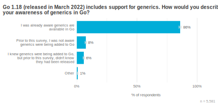

Chart showing most respondents were aware Go 1.18 included generics

图表显示大多数受访者知道Go 1.18包含泛型 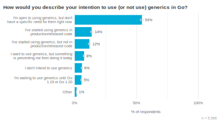

Chart showing 26% of espondents are already using Go generics

图表显示26%的受访者已经在使用Go泛型

What was blocking some developers from using generics? A majority of respondents fell into one of two categories. First, 30% of respondents said they hit a limit of the current implementation of generics, such as wanting parameterized methods, improved type inference, or switching on types. Respondents said these issues limited the potential use cases for generics or felt they made generic code unnecessarily verbose. The second category involved depending on something that didn’t (yet) support generics—linters were the most common tool preventing adoption, but this list also included things like organizations remaining on an earlier Go release or depending on a Linux distribution that did not yet provide Go 1.18 packages (26%). A steep learning curve or lack of helpful documentation was cited by 12% of respondents. Beyond these top issues, respondents told us about a wide range of less-common (though still meaningful) challenges, as shown in the chart below. To avoid focusing on hypotheticals, this analysis only includes people who said they were already using generics, or who tried to use generics but were blocked by something.

是什么阻碍了一些开发者使用泛型？大多数受访者属于两类中的一类。首先，30%的受访者表示他们遇到了当前泛型实现的限制，例如希望获得参数化方法、改进类型推理或切换类型。受访者说，这些问题限制了泛型的潜在用例，或者认为它们使泛型代码变得不必要地冗长。第二类是依赖于不支持泛型的东西--铸币机是最常见的阻碍采用泛型的工具，但这个列表也包括一些东西，如组织仍在使用早期的Go版本或依赖于尚未提供Go 1.18软件包的Linux发行版（26%）。12%的受访者提到了学习曲线过长或缺乏有用的文档。除了这些最重要的问题之外，受访者还告诉我们一系列不太常见的（但仍有意义的）挑战，如下图所示。为了避免关注假设，本分析只包括那些说他们已经在使用仿制药的人，或者那些试图使用仿制药但被某些东西阻挠的人。

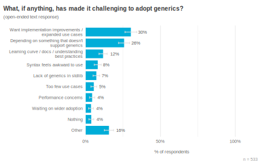

Chart showing the top generic challenges

图表显示最主要的泛型挑战

We also asked survey respondents who had tried using generics to share any additional feedback. Encouragingly, one in ten respondents said generics had already simplified their code, or resulted in less code duplication. The most common response was some variation of "thank you!" or a general positive sentiment (43%); for comparison, only 6% of respondents evinced a negative reaction or sentiment. Mirroring the findings from the "biggest challenge" question above, nearly one third of respondents discussed hitting a limitation of Go’s implementation of generics. The Go team is using this set of results to help decide if or how some of these limitations could be relaxed.

我们还要求曾经尝试过使用非专利品的调查对象分享任何额外的反馈。令人鼓舞的是，十分之一的受访者表示泛型已经简化了他们的代码，或者减少了代码的重复。最常见的反应是 "谢谢您！"或一般的积极情绪（43%）；相比之下，只有6%的受访者表现出消极的反应或情绪。与上述 "最大的挑战 "问题的发现相呼应，近三分之一的受访者讨论了Go实现泛型的限制。Go团队正在使用这组结果来帮助决定是否或如何放宽其中的一些限制。

Chart showing most generics feedback was positive or referenced a limitation of the current implementation

图表显示，大多数通用的反馈是积极的，或提到了当前实施的局限性

## Security 安全性

"[The biggest challenge is] finding time given competing priorities; business customers want their features over security." — A survey respondent discussing security challenges

"[最大的挑战是]考虑到竞争性的优先事项而找到时间；商业客户希望他们的功能高于安全。" - 一位讨论安全挑战的调查受访者

Following the [2020 SolarWinds breach](https://en.wikipedia.org/wiki/2020_United_States_federal_government_data_breach#SolarWinds_exploit), the practice of developing software securely has received renewed attention. The Go team has prioritized work in this area, including tools for creating [a software bill of materials (SBOM)](https://pkg.go.dev/debug/buildinfo), [fuzz testing](https://go.dev/doc/fuzz/), and most recently, [vulnerability scanning](https://go.dev/blog/vuln/). To support these efforts, this survey asked several questions about software development security practices and challenges. We specifically wanted to understand:

在2020年的SolarWinds漏洞事件之后，安全开发软件的做法再次受到关注。Go团队已将该领域的工作列为优先事项，包括创建软件材料清单（SBOM）的工具、模糊测试，以及最近的漏洞扫描。为了支持这些工作，本次调查提出了几个关于软件开发安全实践和挑战的问题。我们特别想了解：

- What types of security tools are Go developers using today?Go开发人员目前使用哪些类型的安全工具？
- How do Go developers find and resolve vulnerabilities? Go开发者是如何发现和解决漏洞的？
- What are the biggest challenges to writing secure Go software? 编写安全Go软件的最大挑战是什么？

Our results suggest that while static analysis tooling is in widespread use (65% of respondents), a minority of respondents currently use it to find vulnerabilities (35%) or otherwise improve code security (33%). Respondents said that security tooling is most commonly run during CI/CD time (84%), with a minority saying developers run these tools locally during development (22%). This aligns with additional security research our team has conducted, which found that security scanning at CI/CD time is a desired backstop, but developers often considered this too late for a first notification: they would prefer to know a dependency may be vulnerable *before* building upon it, or to verify that a version update resolved a vulnerability without waiting for CI to run a full battery of additional tests against their PR.

我们的结果表明，虽然静态分析工具被广泛使用（65%的受访者），但目前只有少数受访者使用它来寻找漏洞（35%）或以其他方式提高代码安全性（33%）。受访者表示，安全工具最常在CI/CD时间内运行（84%），少数人表示开发者在开发期间在本地运行这些工具（22%）。这与我们团队进行的其他安全研究相一致，发现在CI/CD时间进行安全扫描是一个理想的后盾，但开发人员往往认为这对于第一次通知来说太晚了：他们更希望在构建一个依赖关系之前知道它可能存在漏洞，或者验证一个版本的更新解决了一个漏洞，而无需等待CI对其PR运行一整套额外的测试。

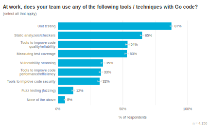

Chart showing prevalence of 9 different development techniques 

图表显示了9种不同开发技术的普遍性 

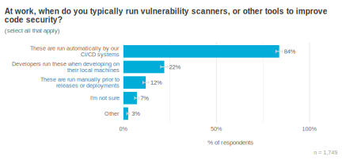

Chart showing most respondents run security tools during CI

图中显示大多数受访者在CI期间运行安全工具

We also asked respondents about their biggest challenges around developing secure software. The most wide-spread difficulty was evaluating the security of third-party libraries (57% of respondents), a topic vulnerability scanners (such as [GitHub’s dependabot](https://github.com/dependabot) or the Go team’s [govulncheck](https://pkg.go.dev/golang.org/x/vuln/cmd/govulncheck)) can help address. The other top challenges suggest opportunities for additional security tooling: respondents said it’s hard to consistently apply best practices while writing code, and validating that the resulting code doesn’t have vulnerabilities.

我们还询问了受访者有关开发安全软件的最大挑战。最广泛的困难是评估第三方库的安全性（57%的受访者），这个问题的漏洞扫描器（如GitHub的dependabot或Go团队的govulncheck）可以帮助解决。其他最主要的挑战表明了更多安全工具的机会：受访者说，在编写代码时很难持续应用最佳实践，并验证所产生的代码没有漏洞。

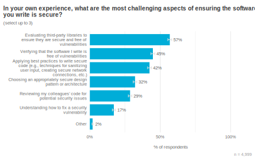

Chart showing the most common security challenge is evaluating the security of third-party libraries

图表显示最常见的安全挑战是评估第三方库的安全性

Fuzz testing, another approach for increasing application security, was still quite new to most respondents. Only 12% said they use it at work, and 5% said they’ve adopted Go’s built-in fuzzing tools. An open-ended follow-up question asking what made fuzzing difficult to use found that the main reasons were not technical problems: the top three responses discussed not understanding how to use fuzz testing (23%), a lack of time to devote to fuzzing or security more broadly (22%), and understanding why and when developers might want to use fuzz testing (14%). These findings indicate that we still have work to do in terms of communicating the value of fuzz testing, what should be fuzz tested, and how to apply it to a variety of different code bases.

模糊测试是另一种提高应用程序安全性的方法，对大多数受访者来说仍然相当新鲜。只有12%的人说他们在工作中使用它，5%的人说他们已经采用了Go的内置模糊测试工具。一个开放式的后续问题问及什么原因使模糊测试难以使用，发现主要原因不是技术问题：前三个回答讨论了不了解如何使用模糊测试（23%），缺乏时间用于模糊测试或更广泛的安全（22%），以及了解为什么和何时开发人员可能想要使用模糊测试（14%）。这些发现表明，我们在宣传模糊测试的价值、什么应该进行模糊测试以及如何将其应用于各种不同的代码基础方面仍有工作要做。

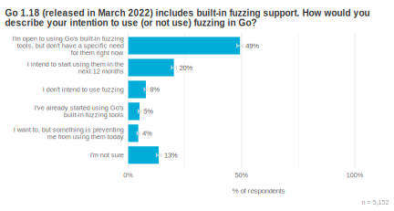

Chart showing most respondents have not tried fuzz testing yet 

图表显示大多数受访者还没有尝试过模糊测试  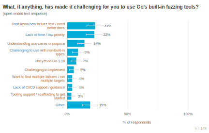

Chart showing the biggest fuzz testing challenges relate to understanding, rather than technical issues

图表显示模糊测试最大的挑战与理解有关，而不是与技术问题有关

To better understand common tasks around vulnerability detection and resolution, we asked respondents whether they’d learned of any vulnerabilities in their Go code or its dependencies during the past year. For those who did, we followed up with questions asking how the most recent vulnerability was discovered, how they investigated and/or resolved it, and what was most challenging about the whole process.

为了更好地了解有关漏洞检测和解决的常见任务，我们询问受访者在过去一年中是否了解到他们的Go代码或其依赖关系中的任何漏洞。对于那些受访者，我们追问了最近的漏洞是如何被发现的，他们是如何调查和/或解决的，以及整个过程中最具挑战性的是什么。

First, we found evidence that vulnerability scanning is effective. One quarter of respondents said they’d learned of a vulnerability in one of their third-party dependencies. Recall, however, that only about ⅓ of respondents were using vulnerability scanning at all—when we look at responses from people who said they ran some sort of vulnerability scanner, this proportion nearly doubles, from 25% → 46%. Besides vulnerabilities in dependencies or in Go itself, 12% of respondents said they learned about vulnerabilities in their own code.

首先，我们发现有证据表明漏洞扫描是有效的。四分之一的受访者说他们在他们的第三方依赖中发现了一个漏洞。然而，只有大约⅓的受访者在使用漏洞扫描--当我们看那些说他们运行某种漏洞扫描器的人的回答时，这个比例几乎翻了一番，从25%到46%。除了依赖关系或Go本身的漏洞，12%的受访者说他们从自己的代码中了解到了漏洞。

A majority of respondents said they learned of vulnerabilities via security scanners (65%). The single most common tool respondents cited was [GitHub’s dependabot](https://github.com/dependabot) (38%), making it more frequently referenced than all other vulnerability scanners combined (27%). After scanning tools, the most common method for learning about vulnerabilities were public reports, such as release notes and CVEs (22%).

大多数受访者说他们是通过安全扫描器了解到漏洞的（65%）。受访者最常引用的工具是GitHub的dependabot（38%），使其比所有其他漏洞扫描器的总和（27%）更经常被引用。在扫描工具之后，最常见的了解漏洞的方法是公共报告，如发行说明和CVEs（22%）。

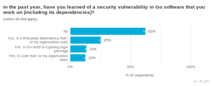

Chart showing that most respondents have not found security vulnerabilities during the past year

显示大多数受访者在过去一年中没有发现安全漏洞的图表 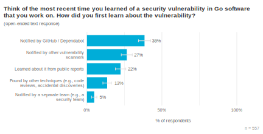

Chart showing that vulnerability scanners are the most common way to learn about security vulnerabilities

图表显示，漏洞扫描器是了解安全漏洞的最常见方式

Once respondents learned about a vulnerability, the most common resolution was to upgrade the vulnerable dependency (67%). Among respondents who also discussed using a vulnerability scanner (a proxy for participants who were discussing a vulnerability in a third-party dependency), this increased to 85%. Less than one third of respondents discussed reading the CVE or vulnerability report (31%), and only 12% mentioned a deeper investigation to understand whether (and how) their software was impacted by the vulnerability.

一旦受访者了解到一个漏洞，最常见的解决方法是升级有漏洞的依赖项（67%）。在同时讨论使用漏洞扫描器的受访者中（代表讨论第三方依赖项中的漏洞的参与者），这一比例增加到85%。不到三分之一的受访者讨论了阅读CVE或漏洞报告（31%），只有12%的受访者提到要深入调查以了解他们的软件是否（以及如何）受到漏洞的影响。

That only 12% of respondents said they performed an investigation into whether a vulnerability was reachable in their code, or the potential impact it may have had on their service, was surprising. To understand this better, we also looked at what respondents said was most challenging about responding to security vulnerabilities. They described several different topics in roughly equal proportions, from ensuring that dependency updates didn’t break anything, to understanding how to update indirect dependencies via go.mod files. Also in this list is the type of investigation needed to understand a vulnerability’s impact or root cause. When we focus on only the respondents who said they performed these investigations, however, we see a clear correlation: 70% of respondents who said they performed an investigation into the vulnerability’s potential impact cited it as the most challenging part of this process. Reasons included not just the difficulty of the task, but the fact that it was often both unplanned and unrewarded work.

只有12%的受访者说他们进行了调查，了解他们的代码中是否有漏洞可触，或漏洞可能对他们的服务产生的潜在影响，这令人惊讶。为了更好地理解这一点，我们还研究了受访者所说的应对安全漏洞的最大挑战是什么。他们以大致相同的比例描述了几个不同的主题，从确保依赖项更新不会破坏任何东西，到了解如何通过go.mod文件更新间接依赖项。在这个列表中，还有了解漏洞的影响或根本原因所需的调查类型。然而，当我们只关注那些说他们进行了这些调查的受访者时，我们看到了一个明显的关联性。70%的受访者说他们对漏洞的潜在影响进行了调查，他们认为这是这个过程中最具挑战性的部分。原因不仅包括任务的难度，还包括这往往是既无计划又无回报的工作。

The Go team believes these deeper investigations, which require an understanding of *how* an application uses a vulnerable dependency, are crucial for understanding the risk the vulnerability may present to an organization, as well as understanding whether a data breach or other security compromise occurred. Thus, [we designed `govulncheck`](https://go.dev/blog/vuln) to only alert developers when a vulnerability is invoked, and point developers to the exact places in their code using the vulnerable functions. Our hope is that this will make it easier for developers to quickly investigate the vulnerabilities that truly matter to their application, thus reducing the overall amount of unplanned work in this space.

Go团队认为，这些更深入的调查需要了解应用程序如何使用有漏洞的依赖关系，这对于了解漏洞可能给组织带来的风险，以及了解是否发生了数据泄露或其他安全漏洞至关重要。因此，我们设计了govulncheck，只在漏洞被调用时提醒开发者，并指出开发者在其代码中使用漏洞函数的确切位置。我们的希望是，这将使开发人员更容易快速调查对他们的应用程序真正重要的漏洞，从而减少这一领域的整体非计划性工作的数量。

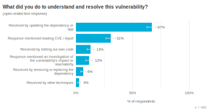

Chart showing most respondents resolved vulnerabilities by upgrading dependencies 

 显示大多数受访者在过去一年中没有发现安全漏洞的图表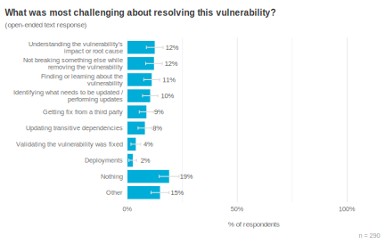

Chart showing a 6-way tie for tasks that were most challenging when investigating and resolving security vulnerabilities

图表显示，漏洞扫描器是了解安全漏洞的最常见方式

## Tooling 工具化

Next, we investigated three questions focused on tooling:

接下来，我们调查了三个关于工具的问题：

- Has the editor landscape shifted since our last survey?自我们上次调查以来，编辑器的情况是否发生了变化？
- Are developers using workspaces? If so, what challenges have they encountered while getting started?开发人员是否在使用工作区？如果是的话，他们在开始时遇到了什么挑战？
- How do developers handle internal package documentation?开发者是如何处理内部包文件的？

VS Code appears to be continuing to grow in popularity among survey respondents, with the proportion of respondents saying it’s their preferred editor for Go code increasing from 42% → 45% since 2021. VS Code and GoLand, the two most popular editors, showed no differences in popularity between small and large organizations, though hobbyist developers were more likely to prefer VS Code to GoLand. This analysis excludes the randomly sampled VS Code respondents—we’d expect people we invited to the survey to show a preference for the tool used to distribute the invitation, which is exactly what we saw (91% of the randomly sampled respondents preferred VS Code).

VS Code在调查对象中的受欢迎程度似乎在持续增长，自2021年以来，说它是他们首选的Go代码编辑器的比例从42%增加到45%。VS Code和GoLand这两个最受欢迎的编辑器，在小型和大型组织之间的受欢迎程度没有差异，尽管业余开发者更倾向于VS Code而不是GoLand。这项分析不包括随机抽样的VS Code受访者--我们期望我们邀请的人对用于分发邀请的工具表现出偏好，这正是我们看到的（91%的随机抽样受访者喜欢VS Code）。

Following the 2021 switch to [power VS Code’s Go support via the gopls language server](https://go.dev/blog/gopls-vscode-go), the Go team has been interested in understanding developer pain points related to gopls. While we receive a healthy amount of feedback from developers currently using gopls, we wondered whether a large proportion of developers had disabled it shortly after release, which could mean we weren’t hearing feedback about particularly problematic use cases. To answer this question, we asked respondents who said they preferred an editor which supports gopls whether or not they *used* gopls, finding that only 2% said they had disabled it; for VS Code specifically, this dropped to 1%. This increases our confidence that we’re hearing feedback from a representative group of developers. For readers who still have unresolved issues with gopls, please let us know by [filing an issue on GitHub](https://github.com/golang/go/issues).

在2021年通过gopls语言服务器为VS Code的Go支持提供动力之后，Go团队一直想了解与gopls有关的开发者痛点。虽然我们从目前使用gopls的开发者那里收到了大量的反馈，但我们想知道是否有很大一部分开发者在发布后不久就禁用了它，这可能意味着我们没有听到关于特别有问题的用例的反馈。为了回答这个问题，我们询问了那些说他们更喜欢支持gopls的编辑器的受访者是否使用gopls，发现只有2%的人说他们禁用了gopls；具体到VS Code，这个比例下降到1%。这增加了我们的信心，我们听到的是一群有代表性的开发者的反馈。对于那些对gopls仍有未解决的问题的读者，请在GitHub上提交一个问题让我们知道。

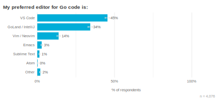

Chart showing the top preferred editors for Go are VS Code, GoLand, and Vim / Neovim 

图表显示Go的首选编辑器是VS Code、GoLand和Vim / Neovim 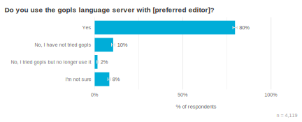

Chart showing only 2% of respondents disabled gopls

图表显示只有2%的受访者禁用了Go编辑器

Regarding workspaces, it seems many people first learned about Go’s support for multi-module workspaces via this survey. Respondents who learned of the survey through VS Code’s randomized prompt were especially likely to say they had not heard of workspaces before (53% of randomly sampled respondents vs. 33% of self-selecting respondents), a trend we also observed with awareness of generics (though this was higher for both groups, with 93% of self-selecting respondents aware that generics landed in Go 1.18 vs. 68% of randomly sampled respondents). One interpretation is that there is a large audience of Go developers we do not currently reach through the Go blog or existing social media channels, which has traditionally been our primary mechanism for sharing new functionality.

关于工作区，似乎很多人是通过这项调查第一次了解到Go对多模块工作区的支持。通过VS Code的随机提示得知该调查的受访者尤其有可能说他们之前没有听说过工作空间（53%的随机抽样受访者和33%的自选受访者），我们也观察到了对泛型的认识趋势（尽管这两组受访者都更高，93%的自选受访者知道泛型在Go 1.18中登陆，而68%的随机抽样受访者）。一种解释是，我们目前没有通过Go博客或现有的社交媒体渠道接触到大量的Go开发者，而传统上这是我们分享新功能的主要机制。

We found that 9% of respondents said they had tried workspaces, and an additional 5% would like to but are blocked by something. Respondents discussed a variety of challenges when trying to use Go workspaces. A lack of documentation and helpful error message from the `go work` command top the list (21%), followed by technical challenges such as refactoring existing repositories (13%). Similar to challenges discussed in the security section, we again see "lack of time / not a priority" in this list—we interpret this to mean the bar to understand and setup workspaces is still a bit too high compared to the benefits they provide, potentially because developers already had workarounds in place.

我们发现，9%的受访者表示他们已经尝试过工作空间，还有5%的受访者想尝试，但被某些东西挡住了。受访者讨论了在尝试使用Go工作空间时遇到的各种挑战。缺乏文档和go work命令的有用错误信息位居榜首（21%），其次是技术上的挑战，如重构现有存储库（13%）。与安全部分所讨论的挑战类似，我们在这个列表中再次看到 "缺乏时间/不是优先事项"--我们认为这意味着与工作空间提供的好处相比，理解和设置工作空间的门槛仍然有点太高，可能是因为开发人员已经有了变通方法。

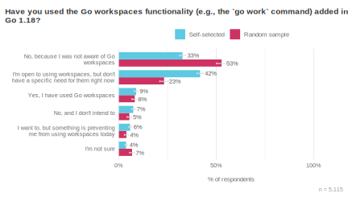

Chart showing a majority of randomly sampled respondents were not aware of workspaces prior to this survey 

图表显示，大多数随机抽样的受访者在本次调查之前并不了解工作空间。 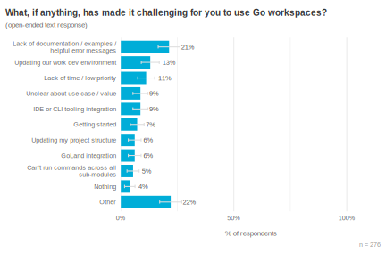

Chart showing that documentation and error messages were the top challenge when trying to use Go workspaces

 图表显示，文档和错误信息是尝试使用Go工作空间时的首要挑战

Prior to the release of Go modules, organizations were able to run internal documentation servers (such as [the one that powered godoc.org](https://github.com/golang/gddo)) to provide employees with documentation for private, internal Go packages. This remains true with [pkg.go.dev](https://pkg.go.dev/), but setting up such a server is more complex than it used to be. To understand if we should invest in making this process easier, we asked respondents how they view documentation for internal Go modules today, and whether that’s their preferred way of working.

在Go模块发布之前，企业可以运行内部文档服务器（如支持godoc.org的服务器），为员工提供私人内部Go包的文档。pkg.go.dev依然如此，但建立这样的服务器比以前更复杂了。为了了解我们是否应该投资使这一过程变得更容易，我们询问了受访者今天如何看待内部Go模块的文档，以及这是否是他们喜欢的工作方式。

The results show the most common way to view internal Go documentation today is by reading the code (81%), and while about half of the respondents were happy with this, a large proportion would prefer to have an internal documentation server (39%). We also asked who might be most likely to configure and maintain such a server: by a 2-to-1 margin, respondents thought it would be a software engineer rather than someone from a dedicated IT support or operations team. This strongly suggests that a documentation server should be a turn-key solution, or at least easy for a single developer to get running quickly (over, say, a lunch break), on the theory that this type of work is yet one more responsibility on developers' already full plates.

结果显示，目前最常见的查看内部Go文档的方式是阅读代码（81%），虽然约有一半的受访者对此感到满意，但有很大一部分人希望有一个内部文档服务器（39%）。我们还询问了谁最有可能配置和维护这样一个服务器：以2比1的比例，受访者认为应该是软件工程师，而不是专门的IT支持或运营团队的人。这强烈地表明，文档服务器应该是一个交钥匙的解决方案，或者至少对单个开发人员来说容易快速运行（例如，在午休时间），因为这种类型的工作是开发人员已经很充实的盘子上的又一个责任。

Chart showing most respondents use source code directly for internal package documentation 

图表显示大多数受访者直接使用源代码来编写内部软件包文件  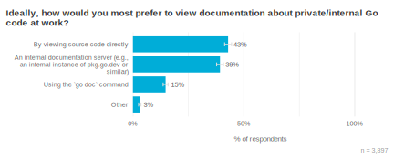 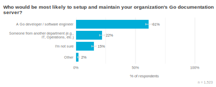

Chart showing 39% of respondents would prefer to use a documentation server instead of viewing source for docs 

图表显示大多数受访者希望由软件工程师来负责这样一个文档服务器

## Who we heard from 我们听取了谁的意见

Overall, the demographics and firmographics of respondents did not meaningfully shift since [our 2021 survey](https://go.dev/blog/survey2021-results). A small majority of respondents (53%) have at least two years of experience using Go, while the rest are newer to the Go community. About ⅓ of respondents work at small businesses (< 100 employees), ¼ work at medium-sized businesses (100 – 1,000 employees), and ¼ work at enterprises (> 1,000 employees). Similar to last year, we found that our VS Code prompt helped encourage survey participation outside of North America and Europe.

总的来说，自2021年的调查以来，受访者的人口统计学和公司统计学没有发生有意义的变化。少数受访者（53%）拥有至少两年的Go使用经验，而其余的则是Go界的新成员。大约⅓的受访者在小型企业（<100名员工）工作，¼在中型企业（100-1000名员工）工作，¼在企业（>1000名员工）工作。与去年类似，我们发现我们的VS代码提示有助于鼓励北美和欧洲以外的调查参与。

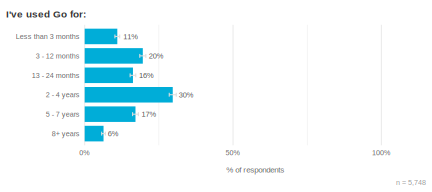

Chart showing distribution of respondents' Go experience

受访者的Go经验分布图

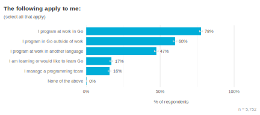

Chart showing distribution of where respondents' use Go 

 受访者使用Go的地点分布图 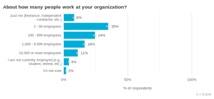

Chart showing distribution of organization sizes for survey respondents 

 图表显示调查对象的组织规模分布  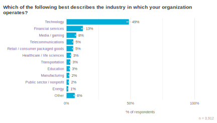

Chart showing distribution of industry classifications for survey respondents 

调查对象的行业分类分布图 

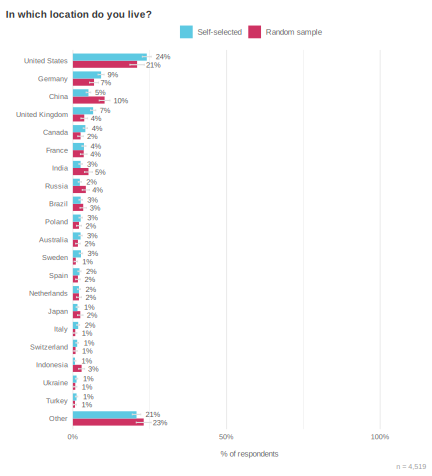

Chart showing where in the world survey respondents live

图中显示了调查对象在世界范围内的 受访者居住地

## How respondents use Go 受访者如何使用Go

Similar to the previous section, we did not find any statistically significant year-over-year changes in how respondents are using Go. The two most common use cases remain building API/RPC services (73%) and writing CLIs (60%). We used linear models to investigate whether there was a relationship between how long a respondent had been using Go and the types of things they were building with it. We found that respondents with < 1 year of Go experience are more likely to be building something in the bottom half of this chart (GUIs, IoT, games, ML/AI, or mobile apps), suggesting that there is interest in using Go in these domains, but the drop-off after one year of experience also implies that developers hit significant barriers when working with Go in these areas.

与上一节类似，我们没有发现受访者在使用Go的方式上有任何统计学上的明显同比变化。两个最常见的使用情况仍然是构建API/RPC服务（73%）和编写CLI（60%）。我们使用线性模型来调查受访者使用Go的时间长短与他们用Go构建的东西的类型之间是否存在关系。我们发现，拥有<1年Go经验的受访者更有可能正在构建该图表下半部分的东西（GUI、IoT、游戏、ML/AI或移动应用程序），这表明人们对在这些领域使用Go有兴趣，但一年经验后的下降也意味着开发人员在这些领域使用Go时遇到重大障碍。

A majority of respondents use either Linux (59%) or macOS (52%) when developing with Go, and the vast majority deploy to Linux systems (93%). This cycle we added a response choice for developing on Windows Subsystem for Linux (WSL), finding that 13% of respondents use this when working with Go.

大多数受访者在使用Go开发时使用Linux（59%）或macOS（52%），而且绝大多数人都部署在Linux系统上（93%）。本周期我们增加了在Windows Subsystem for Linux (WSL)上开发的回答选项，发现13%的受访者在使用Go时使用这个选项。

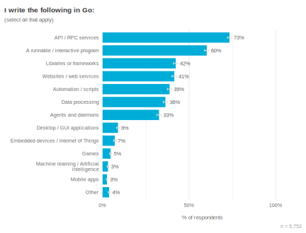

Chart showing distribution of what respondents build with Go 

 图表显示受访者使用Go构建的内容分布 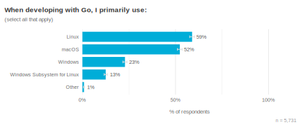

Chart showing Linux and macOS are the most common development systems

 图中显示Linux和macOS是最常见的开发系统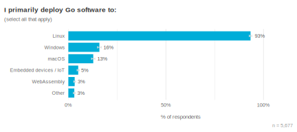

 Chart showing Linux is the most common deployment platform

 图中显示Linux是最常见的部署平台

## Sentiment and challenges 情感和挑战

Finally, we asked respondents about their overall level of satisfaction or dissatisfaction with Go during that past year, as well as the biggest challenge they face when using Go. We found that 93% of respondents said they were "somewhat" (30%) or "very" (63%) satisfied, which is not statistically different from the 92% of respondents who said they were satisfied during the 2021 Go Developer Survey.

最后，我们询问了受访者在过去一年中对Go的总体满意或不满意程度，以及他们在使用Go时所面临的最大挑战。我们发现93%的受访者表示他们 "有点"（30%）或 "非常"（63%）满意，这与2021年Go开发者调查期间92%的受访者表示满意没有统计学差异。

After years of generics consistently being the most commonly discussed challenge when using Go, the support for type parameters in Go 1.18 finally resulted in a new top challenge: our old friend, error handling. To be sure, error handling is statistically tied with several other challenges, including missing or immature libraries for certain domains, helping developers learn and implement best practices, and other revisions to the type system, such as support for enums or more functional programming syntax. Post-generics, there appears to be a very long tail of challenges facing Go developers.

在多年来泛型一直是使用Go时最常讨论的挑战之后，Go 1.18中对类型参数的支持终于导致了一个新的顶级挑战：我们的老朋友，错误处理。可以肯定的是，错误处理与其他几个挑战在统计上是并列的，包括某些领域的库缺失或不成熟，帮助开发者学习和实施最佳实践，以及对类型系统的其他修订，如对枚举的支持或更多的函数式编程语法。在泛型之后，Go开发者面临的挑战似乎有一个很长的尾巴。

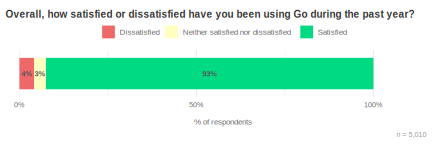

Chart showing 93% of survey respondents are satisfied using Go, with 4% dissatisfied 

 图表显示93%的调查对象 对Go的使用感到满意，4%不满意。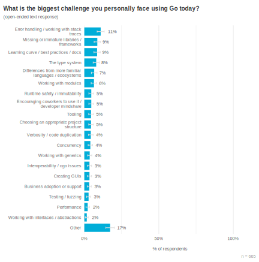

Chart showing a long tail of challenges reported by survey respondents

图中显示了调查对象报告的长尾 的调查对象所报告的挑战

## Survey methodology 调查方法

We publicly announced this survey on June 1st, 2022 via [go.dev/blog](https://go.dev/blog) and [@golang](https://twitter.com/golang) on Twitter. We also randomly prompted 10% of [VS Code](https://code.visualstudio.com/) users via the Go plugin between June 1st – 21st. The survey closed on June 22nd, and partial responses (i.e., people who started but did not finish the survey) were also recorded. We filtered out data from respondents who completed the survey especially quickly (< 30 seconds) or tended to check all of the response choices for multi-select questions. This left 5,752 responses.

我们于2022年6月1日通过go.dev/blog和Twitter上的@golang公开宣布了这项调查。我们还在6月1日至21日期间通过Go插件随机提示了10%的VS Code用户。调查于6月22日结束，部分回复（即开始但没有完成调查的人）也被记录下来。我们过滤掉了那些完成调查特别快（<30秒）或倾向于勾选所有多选问题的回答者的数据。这样就留下了5752个回答。

About ⅓ of respondents came from the randomized VS Code prompt, and this group tended to have less experience with Go than people who found the survey via the Go blog or Go’s social media channels. We used linear and logistic models to investigate whether apparent differences between these groups were better explained by this difference in experience, which was usually the case. The exceptions are noted in the text.

大约⅓的受访者来自随机的VS代码提示，这部分人的Go经验往往比通过Go博客或Go的社交媒体渠道找到调查的人少。我们用线性和逻辑模型来研究这些群体之间的明显差异是否可以用这种经验差异来更好地解释，通常情况下是这样的。文中指出了例外情况。

This year we very much hoped to also share the raw dataset with the community, similar to developer surveys from [Stack Overflow](https://insights.stackoverflow.com/survey), [JetBrains](https://www.jetbrains.com/lp/devecosystem-2021/), and others. Recent legal guidance unfortunately prevents us from doing that right now, but we’re working on this and expect to be able to share the raw dataset for our next Go Developer Survey.

今年我们非常希望也能与社区分享原始数据集，类似于Stack Overflow、JetBrains和其他公司的开发者调查。不幸的是，最近的法律指导使我们现在不能这样做，但我们正在努力，并希望能够在下一次Go开发者调查中分享原始数据集。

## Conclusion 结论

This iteration of the Go Developer Survey focused on new functionality from the Go 1.18 release. We found that generics adoption is well under way, with developers already hitting some limitations of the current implementation. Fuzz testing and workspaces have seen slower adoption, though largely not for technical reasons: the primary challenge with both was understanding when and how to use them. A lack of developer time to focus on these topics was another challenge, and this theme carried into security tooling as well. These findings are helping the Go team prioritize our next efforts and will influence how we approach the design of future tooling.

这次Go开发者调查的重点是Go 1.18版本的新功能。我们发现，泛型的采用正在顺利进行，开发者已经遇到了当前实现的一些限制。模糊测试和工作区的采用速度较慢，但很大程度上不是因为技术原因：两者的主要挑战是理解何时和如何使用它们。另一个挑战是开发人员没有时间专注于这些主题，这个主题也体现在安全工具上。这些发现正在帮助Go团队确定下一步工作的优先次序，并将影响我们对未来工具设计的态度。

Thank you for joining us in the tour of Go developer research—we hope it’s been insightful and interesting. Most importantly, thank you to everyone who has responded to our surveys over the years. Your feedback helps us understand the constraints Go developers work under and identify challenges they face. By sharing these experiences, you’re helping to improve the Go ecosystem for everyone. On behalf of Gophers everywhere, we appreciate you!

感谢您加入我们的Go开发者研究之旅--我们希望它是有洞察力的、有趣的。最重要的是，感谢多年来对我们的调查做出回应的每个人。您的反馈帮助我们了解Go开发者在工作中受到的限制，并确定他们面临的挑战。通过分享这些经验，您将帮助我们为每个人改善 Go 生态系统。我们代表世界各地的地鼠，感谢您!
