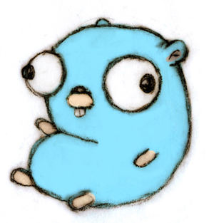

+++
title = "Go 13 岁了"
weight = 87
date = 2023-05-18T17:03:08+08:00
type = "docs"
description = ""
isCJKLanguage = true
draft = false
+++

# Thirteen Years of Go - go 13 岁了

> 原文：[https://go.dev/blog/13years](https://go.dev/blog/13years)

Russ Cox, for the Go team
10 November 2022

Today we celebrate the thirteenth birthday of the Go open source release. [The Gopher](https://go.dev/doc/gopher) is a teenager!

今天我们庆祝Go开源版本的十三岁生日。地鼠已经是个少年了!

It’s been an eventful year for Go. The most significant event was the release of [Go 1.18 in March](https://go.dev/blog/go1.18), which brought many improvements but most notably Go workspaces, fuzzing, and generics.

这一年对Go来说是多事之秋。最重要的事件是3月份发布的Go 1.18，它带来了许多改进，但最引人注目的是Go工作区、模糊处理和泛型。

Workspaces make it easy to work on multiple modules simultaneously, which is most helpful when you are maintaining a set of related modules with module dependencies between them. To learn about workspaces, see Beth Brown’s blog post "[Get familiar with workspaces](https://go.dev/blog/get-familiar-with-workspaces)" and the [workspace reference](https://go.dev/ref/mod#workspaces).

工作区使您可以很容易地同时处理多个模块，当您维护一组相关的模块并在它们之间存在模块依赖关系时，这是最有帮助的。要了解工作空间，请看Beth Brown的博文 "熟悉工作空间 "和工作空间参考。

Fuzzing is a new feature of `go` `test` that helps you find inputs that your code doesn’t handle properly: you define a fuzz test that should pass for any input at all, and then fuzzing tries different random inputs, guided by code coverage, to try to make the fuzz test fail. Fuzzing is particularly useful when developing code that must be robust against arbitrary (even attacker-controlled) inputs. To learn more about fuzzing, see the tutorial "[Getting started with fuzzing](https://go.dev/doc/tutorial/fuzz)" and the [fuzzing reference](https://go.dev/security/fuzz/), and keep an eye out for Katie Hockman’s GopherCon 2022 talk "Fuzz Testing Made Easy", which should be online soon.

模糊测试是go test的一个新功能，它可以帮助您找到您的代码不能正确处理的输入：您定义一个模糊测试，对于任何输入都应该通过，然后模糊测试在代码覆盖率的指导下尝试不同的随机输入，试图使模糊测试失败。在开发必须对任意（甚至是攻击者控制的）输入进行健壮的代码时，模糊测试特别有用。要了解更多关于模糊测试的信息，请参见教程 "模糊测试入门 "和模糊测试参考资料，并留意Katie Hockman的GopherCon 2022演讲 "模糊测试轻松搞定"，该演讲应该很快就会上线。

Generics, quite possibly Go’s most requested feature, adds parametric polymorphism to Go, to allow writing code that works with a variety of different types but is still statically checked at compile time. To learn more about generics, see the tutorial "[Getting started with generics](https://go.dev/doc/tutorial/generics)". For more detail see the blog posts "[An Introduction to Generics](https://go.dev/blog/intro-generics)" and "[When to Use Generics](https://go.dev/blog/when-generics)", or the talks "[Using Generics in Go](https://www.youtube.com/watch?v=nr8EpUO9jhw)" from Go Day on Google Open Source Live 2021, and "[Generics!](https://www.youtube.com/watch?v=Pa_e9EeCdy8)" from GopherCon 2021, by Robert Griesemer and Ian Lance Taylor.

泛型，很可能是Go最受欢迎的功能，它为Go增加了参数多态性，允许编写适用于各种不同类型的代码，但在编译时仍需静态检查。要了解更多关于泛型的信息，请看教程《泛型入门》。更多细节请参见博文 "泛型简介 "和 "何时使用泛型"，或2021年谷歌开源现场Go Day的讲座 "在Go中使用泛型"，以及2021年GopherCon的讲座 "泛型！"，作者是Robert Griesemer和Ian Lance Taylor。

Compared to Go 1.18, the [Go 1.19 release in August](https://go.dev/blog/go1.19) was a relatively quiet one: it focused on refining and improving the features that Go 1.18 introduced as well as internal stability improvements and optimizations. One visible change in Go 1.19 was the addition of support for [links, lists, and headings in Go doc comments](https://go.dev/doc/comment). Another was the addition of a [soft memory limit](https://go.dev/doc/go1.19#runtime) for the garbage collector, which is particularly useful in container workloads. For more about recent garbage collector improvements, see Michael Knyszek’s blog post "[Go runtime: 4 years later](https://go.dev/blog/go119runtime)", his talk "[Respecting Memory Limits in Go](https://www.youtube.com/watch?v=07wduWyWx8M&list=PLtoVuM73AmsJjj5tnZ7BodjN_zIvpULSx)", and the new "[Guide to the Go Garbage Collector](https://go.dev/doc/gc-guide)".

与Go 1.18相比，8月份的Go 1.19版本相对平静：它侧重于完善和改进Go 1.18引入的功能，以及内部稳定性改进和优化。Go 1.19中一个可见的变化是在Go文档注释中增加了对链接、列表和标题的支持。另一个变化是为垃圾收集器增加了一个软内存限制，这在容器工作负载中特别有用。更多关于最近垃圾收集器的改进，请参见Michael Knyszek的博文 "Go runtime: 4年后"，他的演讲 "尊重Go中的内存限制"，以及新的 "Go垃圾收集器指南"。

We’ve continued to work on making Go development scale gracefully to ever larger code bases, especially in our work on VS Code Go and the Gopls language server. This year, Gopls releases focused on improving stability and performance, while delivering support for generics as well as new analyses and code lenses. If you aren’t using VS Code Go or Gopls yet, give them a try. See Suzy Mueller’s talk "[Building Better Projects with the Go Editor](https://www.youtube.com/watch?v=jMyzsp2E_0U)" for an overview. And as a bonus, [Debugging Go in VS Code](https://go.dev/s/vscode-go-debug) got more reliable and powerful with Delve’s native [Debug Adapter Protocol](https://microsoft.github.io/debug-adapter-protocol/) support. Try Suzy’s "[Debugging Treasure Hunt](https://www.youtube.com/watch?v=ZPIPPRjwg7Q)"!

我们继续致力于使Go开发能够优雅地扩展到更大的代码库，特别是在VS Code Go和Gopls语言服务器方面的工作。今年，Gopls的发布侧重于提高稳定性和性能，同时提供对泛型的支持，以及新的分析和代码透镜。如果您还没有使用VS Code Go或Gopls，请试一试。请看Suzy Mueller的讲座 "用Go编辑器构建更好的项目 "以了解其概况。作为奖励，在VS Code中调试Go，由于Delve的本地调试适配器协议支持，变得更加可靠和强大。试试Suzy的 "调试寻宝 "吧!

Another part of development scale is the number of dependencies in a project. A month or so after Go’s 12th birthday, the [Log4shell vulnerability](https://en.wikipedia.org/wiki/Log4Shell) served as a wake-up call for the industry about the importance of supply chain security. Go’s module system was designed specifically for this purpose, to help you understand and track your dependencies, identify which specific ones you are using, and determine whether any of them have known vulnerabilities. Filippo Valsorda’s blog post "[How Go Mitigates Supply Chain Attacks](https://go.dev/blog/supply-chain)" gives an overview of our approach. In September, we previewed Go’s approach to vulnerability management in Julie Qiu’s blog post "[Vulnerability Management for Go](https://go.dev/blog/vuln)". The core of that work is a new, curated vulnerability database and a new [govulncheck command](https://pkg.go.dev/golang.org/x/vuln/cmd/govulncheck), which uses advanced static analysis to eliminate most of the false positives that would result from using module requirements alone.

开发规模的另一部分是项目中的依赖项数量。在Go的12岁生日后一个月左右，Log4shell漏洞为业界敲响了供应链安全重要性的警钟。Go的模块系统就是专门为此而设计的，它可以帮助您了解和跟踪您的依赖关系，识别您正在使用的具体依赖关系，并确定其中是否有已知的漏洞。Filippo Valsorda的博文 "Go如何缓解供应链攻击 "对我们的方法进行了概述。9月，我们在Julie Qiu的博文《Go的漏洞管理》中预览了Go的漏洞管理方法。这项工作的核心是一个新的、精心策划的漏洞数据库和一个新的govulncheck命令，该命令使用先进的静态分析来消除大部分仅使用模块要求而产生的误报。

Part of our effort to understand Go users is our annual end-of-year Go survey. This year, our user experience researchers added a lightweight mid-year Go survey as well. We aim to gather enough responses to be statistically significant without being a burden on the Go community as a whole. For the results, see Alice Merrick’s blog post "[Go Developer Survey 2021 Results](https://go.dev/blog/survey2021-results)" and Todd Kulesza’s post "[Go Developer Survey 2022 Q2 Results](https://go.dev/blog/survey2022-q2-results)".

我们为了解Go用户所做的努力的一部分是我们每年的年终Go调查。今年，我们的用户体验研究人员也增加了一个轻量级的年中Go调查。我们的目标是收集足够多的回复，以便在不对整个Go社区造成负担的情况下具有统计学意义。结果见Alice Merrick的博文《2021年Go开发者调查结果》和Todd Kulesza的文章《2022年第二季度Go开发者调查结果》。

As the world starts traveling more, we’ve also been happy to meet many of you in person at Go conferences in 2022, particularly at GopherCon Europe in Berlin in July and at GopherCon in Chicago in October. Last week we held our annual virtual event, [Go Day on Google Open Source Live](https://opensourcelive.withgoogle.com/events/go-day-2022). Here are some of the talks we’ve given at those events:

随着世界开始更多的旅行，我们也很高兴能在2022年的Go会议上见到您们中的许多人，特别是在7月柏林的GopherCon Europe和10月芝加哥的GopherCon上。上周，我们在Google Open Source Live上举行了我们的年度虚拟活动--Go Day。以下是我们在这些活动中发表的一些演讲。

- "[How Go Became its Best Self](https://www.youtube.com/watch?v=vQm_whJZelc)", by Cameron Balahan, at GopherCon Europe."Go如何成为最好的自己"，由Cameron Balahan在欧洲GopherCon上发表。
- "[Go team Q&A](https://www.youtube.com/watch?v=KbOTTU9yEpI)", with Cameron Balahan, Michael Knyszek, and Than McIntosh, at GopherCon Europe."Go团队问答"，由Cameron Balahan、Michael Knyszek和Than McIntosh在GopherCon Europe发表。
- "[Compatibility: How Go Programs Keep Working](https://www.youtube.com/watch?v=v24wrd3RwGo)", by Russ Cox at GopherCon."兼容性：Go程序如何保持工作"，由Russ Cox在GopherCon上发表。
- "[A Holistic Go Experience](https://www.gophercon.com/agenda/session/998660)", by Cameron Balahan at GopherCon (video not yet posted)"整体的Go体验"，由Cameron Balahan在GopherCon上发表（视频尚未发布）。
- "[Structured Logging for Go](https://opensourcelive.withgoogle.com/events/go-day-2022/watch?talk=talk2)", by Jonathan Amsterdam at Go Day on Google Open Source Live"Go的结构化日志"，Jonathan Amsterdam在Google Open Source Live的Go Day上发表。
- "[Writing your Applications Faster and More Securely with Go](https://opensourcelive.withgoogle.com/events/go-day-2022/watch?talk=talk3)", by Cody Oss at Go Day on Google Open Source Live"用Go更快更安全地编写您的应用程序"，作者Cody Oss在Google Open Source Live的Go Day上说。
- "[Respecting Memory Limits in Go](https://opensourcelive.withgoogle.com/events/go-day-2022/watch?talk=talk4), by Michael Knyszek at Go Day on Google Open Source Live尊重Go中的内存限制"，由Michael Knyszek在Google Open Source Live的Go日上发表。

One other milestone for this year was the publication of "[The Go Programming Language and Environment](https://cacm.acm.org/magazines/2022/5/260357-the-go-programming-language-and-environment/fulltext)", by Russ Cox, Robert Griesemer, Rob Pike, Ian Lance Taylor, and Ken Thompson, in *Communications of the ACM*. The article, by the original designers and implementers of Go, explains what we believe makes Go so popular and productive. In short, it is that Go effort focuses on delivering a full development environment targeting the entire software development process, with a focus on scaling both to large software engineering efforts and large deployments.

今年的另一个里程碑是Russ Cox、Robert Griesemer、Rob Pike、Ian Lance Taylor和Ken Thompson在《ACM通讯》上发表的《Go编程语言和环境》。这篇文章由Go的原始设计者和实施者撰写，解释了我们认为是什么让Go如此受欢迎和富有成效。简而言之，Go的工作重点是提供一个针对整个软件开发过程的完整的开发环境，重点是扩展到大型软件工程工作和大型部署。

In Go’s 14th year, we’ll keep working to make Go the best environment for software engineering at scale. We plan to focus particularly on supply chain security, improved compatibility, and structured logging, all of which have been linked already in this post. And there will be plenty of other improvements as well, including profile-guided optimization.

在Go的第14年，我们将继续努力使Go成为大规模软件工程的最佳环境。我们计划特别关注供应链安全、改进的兼容性和结构化的日志，所有这些都已经在这篇文章中提到了。此外，还将有大量的其他改进，包括配置文件指导下的优化。

## Thank You! 谢谢您!

Go has always been far more than what the Go team at Google does. Thanks to all of you—our contributors and everyone in the Go community—for your help making Go the successful programming environment that it is today. We wish you all the best in the coming year.

Go一直以来都远远超出了Google的Go团队的工作范围。感谢所有的人--我们的贡献者和 Go 社区的每一个人--您们的帮助使 Go 成为今天成功的编程环境。我们祝愿您们在新的一年里一切顺利。
