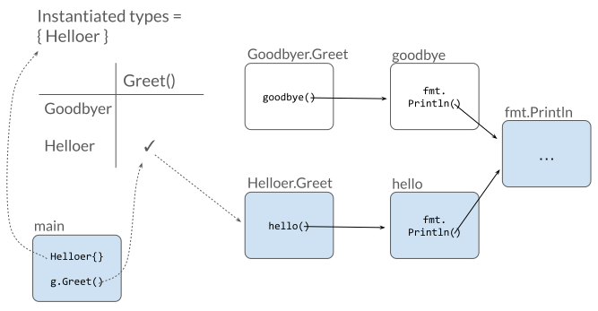

+++

title = "使用 deadcode 查找无法访问的函数"
date = 2024-01-03T21:11:13+08:00
weight = 75
type = "docs"
description = ""
isCJKLanguage = true
draft = false

+++

## Finding unreachable functions with deadcode 使用 deadcode 查找无法访问的函数

Alan Donovan

​	艾伦·多诺万
12 December 2023

​	2023 年 12 月 12 日

Functions that are part of your project’s source code but can never be reached in any execution are called “dead code”, and they exert a drag on codebase maintenance efforts. Today we’re pleased to share a tool named `deadcode` to help you identify them.

​	属于项目源代码的一部分但无法在任何执行中访问的函数称为“死代码”，它们会拖累代码库维护工作。今天，我们很高兴分享一个名为 `deadcode` 的工具来帮助您识别它们。

```
$ go install golang.org/x/tools/cmd/deadcode@latest
$ deadcode -help
The deadcode command reports unreachable functions in Go programs.

Usage: deadcode [flags] package...
```

## 示例 Example 

Over the last year or so, we’ve been making a lot of changes to the structure of [gopls](https://go.dev/blog/gopls-scalability), the language server for Go that powers VS Code and other editors. A typical change might rewrite some existing function, taking care to ensure that its new behavior satisfies the needs of all existing callers. Sometimes, after putting in all that effort, we would discover to our frustration that one of the callers was never actually reached in any execution, so it could safely have been been deleted. If we had known this beforehand our refactoring task would have been easier.

​	在过去的一年左右时间里，我们对 gopls（为 VS Code 和其他编辑器提供支持的 Go 语言服务器）的结构做出了许多更改。典型的更改可能会重写一些现有函数，并注意确保其新行为满足所有现有调用者的需求。有时，在付出所有努力后，我们会沮丧地发现其中一个调用者实际上从未在任何执行中访问过，因此可以安全地将其删除。如果我们事先知道这一点，我们的重构任务就会更容易。

The simple Go program below illustrates the problem:

​	下面的简单 Go 程序说明了这个问题：

```
module example.com/greet
go 1.21
package main

import "fmt"

func main() {
    var g Greeter
    g = Helloer{}
    g.Greet()
}

type Greeter interface{ Greet() }

type Helloer struct{}
type Goodbyer struct{}

var _ Greeter = Helloer{}  // Helloer  implements Greeter
var _ Greeter = Goodbyer{} // Goodbyer implements Greeter

func (Helloer) Greet()  { hello() }
func (Goodbyer) Greet() { goodbye() }

func hello()   { fmt.Println("hello") }
func goodbye() { fmt.Println("goodbye") }
```

When we execute it, it says hello:

​	当我们执行它时，它会说 hello：

```
$ go run .
hello
```

It’s clear from its output that this program executes the `hello` function but not the `goodbye` function. What’s less clear at a glance is that the `goodbye` function can never be called. However, we can’t simply delete `goodbye`, because it’s required by the `Goodbyer.Greet` method, which in turn is required to implement the `Greeter` interface whose `Greet` method we can see is called from `main`. But if we work forwards from main, we can see that no `Goodbyer` values are ever created, so the `Greet` call in `main` can only reach `Helloer.Greet`. That’s the idea behind the algorithm used by the `deadcode` tool.

​	从其输出中可以清楚地看出，此程序执行 `hello` 函数，但不执行 `goodbye` 函数。乍一看不太清楚的是，永远无法调用 `goodbye` 函数。但是，我们不能简单地删除 `goodbye` ，因为 `Goodbyer.Greet` 方法需要它，而 `Goodbyer.Greet` 方法又需要实现 `Greeter` 接口，我们可以看到从 `main` 调用了 `Greeter` 接口的 `Greet` 方法。但是，如果我们从 main 向前工作，我们可以看到从未创建任何 `Goodbyer` 值，因此 `main` 中的 `Greet` 调用只能到达 `Helloer.Greet` 。这就是 `deadcode` 工具所用算法背后的思想。

When we run deadcode on this program, the tool tells us that the `goodbye` function and the `Goodbyer.Greet` method are both unreachable:

​	当我们对该程序运行 deadcode 时，该工具告诉我们 `goodbye` 函数和 `Goodbyer.Greet` 方法都不可达：

```
$ deadcode .
greet.go:23: unreachable func: goodbye
greet.go:20: unreachable func: Goodbyer.Greet
```

With this knowledge, we can safely remove both functions, along with the `Goodbyer` type itself.

​	有了这些知识，我们可以安全地删除这两个函数以及 `Goodbyer` 类型本身。

The tool can also explain why the `hello` function is live. It responds with a chain of function calls that reaches `hello`, starting from main:

​	该工具还可以解释为什么 `hello` 函数是活动的。它以从 main 开始的一系列函数调用作为响应，到达 `hello` ：

```
$ deadcode -whylive=example.com/greet.hello .
                  example.com/greet.main
dynamic@L0008 --> example.com/greet.Helloer.Greet
 static@L0019 --> example.com/greet.hello
```

The output is designed to be easy to read on a terminal, but you can use the `-json` or `-f=template` flags to specify richer output formats for consumption by other tools.

​	输出旨在在终端上易于阅读，但您可以使用 `-json` 或 `-f=template` 标志为其他工具指定更丰富的输出格式。

## 工作原理 How it works 

The `deadcode` command [loads](https://pkg.go.dev/golang.org/x/tools/go/packages), [parses](https://pkg.go.dev/go/parser), and [type-checks](https://pkg.go.dev/go/types) the specified packages, then converts them into an [intermediate representation](https://pkg.go.dev/golang.org/x/tools/go/ssa) similar to a typical compiler.

​	命令加载、解析并检查指定包的类型，然后将它们转换为类似于典型编译器的中间表示形式。

It then uses an algorithm called [Rapid Type Analysis](https://pkg.go.dev/golang.org/x/tools/go/callgraph/rta) (RTA) to build up the set of functions that are reachable, which is initially just the entry points of each `main` package: the `main` function, and the package initializer function, which assigns global variables and calls functions named `init`.

​	然后，它使用一种称为快速类型分析 (RTA) 的算法来构建可访问的函数集，该函数集最初只是每个 `main` 包的入口点： `main` 函数和包初始化器函数，该函数分配全局变量并调用名为 `init` 的函数。

RTA looks at the statements in the body of each reachable function to gather three kinds of information: the set of functions it calls directly; the set of dynamic calls it makes through interface methods; and the set of types it converts to an interface.

​	RTA 查看每个可访问函数的主体中的语句，以收集三类信息：它直接调用的函数集；它通过接口方法进行的动态调用集；以及它转换为接口的类型集。

Direct function calls are easy: we just add the callee to the set of reachable functions, and if it’s the first time we’ve encountered the callee, we inspect its function body the same way we did for main.

​	直接函数调用很简单：我们只需将被调用者添加到可访问函数集，如果这是我们第一次遇到被调用者，我们就会像对 main 所做的那样检查其函数体。

Dynamic calls through interface methods are trickier, because we don’t know the set of types that implement the interface. We don’t want to assume that every possible method in the program whose type matches is a possible target for the call, because some of those types may be instantiated only from dead code! That’s why we gather the set of types converted to interfaces: the conversion makes each of these types reachable from `main`, so that its methods are now possible targets of dynamic calls.

​	通过接口方法进行动态调用比较棘手，因为我们不知道实现该接口的类型集。我们不想假设程序中每个可能的方法（其类型匹配）都是调用的可能目标，因为其中一些类型可能仅从死代码中实例化！这就是我们收集转换为接口的类型集的原因：转换使每个此类类型都可从 `main` 访问，以便其方法现在成为动态调用的可能目标。

This leads to a chicken-and-egg situation. As we encounter each new reachable function, we discover more interface method calls and more conversions of concrete types to interface types. But as the cross product of these two sets (interface method calls × concrete types) grows ever larger, we discover new reachable functions. This class of problems, called “dynamic programming”, can be solved by (conceptually) making checkmarks in a large two-dimensional table, adding rows and columns as we go, until there are no more checks to add. The checkmarks in the final table tells us what is reachable; the blank cells are the dead code.

​	这导致了先有鸡还是先有蛋的情况。当我们遇到每个新的可访问函数时，我们都会发现更多接口方法调用和更多将具体类型转换为接口类型的转换。但是，随着这两个集合（接口方法调用 × 具体类型）的笛卡尔积不断增大，我们发现了新的可访问函数。这种称为“动态规划”的问题可以通过（在概念上）在一个大型二维表中打勾来解决，随着我们进行操作，添加行和列，直到没有更多要添加的勾为止。最终表中的勾告诉我们什么可访问；空白单元格是死代码。


*The `main` function causes `Helloer` to be instantiated, and the `g.Greet` call dispatches to the `Greet` method of each type instantiated so far.*

*`main`函数会导致`Helloer`被实例化，而`g.Greet`调用会分派到目前为止实例化的每个类型的`Greet`方法。*

Dynamic calls to (non-method) functions are treated similar to interfaces of a single method. And calls made [using reflection](https://pkg.go.dev/reflect#Value.Call) are considered to reach any method of any type used in an interface conversion, or any type derivable from one using the `reflect` package. But the principle is the same in all cases.

​	对（非方法）函数的动态调用被视为类似于单个方法的接口。并且使用反射进行的调用被认为可以访问在接口转换中使用的任何类型的任何方法，或使用 `reflect` 包从其中一个派生的任何类型。但在所有情况下，原理都是相同的。

## 测试 Tests 

RTA is a whole-program analysis. That means it always starts from a main function and works forward: you can’t start from a library package such as `encoding/json`.

​	RTA 是一种全程序分析。这意味着它总是从 main 函数开始并向前运行：您无法从库包（例如 `encoding/json` ）开始。

However, most library packages have tests, and tests have main functions. We don’t see them because they are generated behind the scenes of `go test`, but we can include them in the analysis using the `-test` flag.

​	但是，大多数库包都有测试，并且测试具有 main 函数。我们看不到它们，因为它们是在 `go test` 的幕后生成的，但我们可以使用 `-test` 标志将它们包括在分析中。

If this reports that a function in a library package is dead, that’s a sign that your test coverage could be improved. For example, this command lists all the functions in `encoding/json` that are not reached by any of its tests:

​	如果此命令报告库包中的某个函数已死，则表明可以改进测试覆盖率。例如，此命令列出 `encoding/json` 中所有未被任何测试访问的函数：

```
$ deadcode -test -filter=encoding/json encoding/json
encoding/json/decode.go:150:31: unreachable func: UnmarshalFieldError.Error
encoding/json/encode.go:225:28: unreachable func: InvalidUTF8Error.Error
```

(The `-filter` flag restricts the output to packages matching the regular expression. By default, the tool reports all packages in the initial module.)

​	（ `-filter` 标志将输出限制为与正则表达式匹配的包。默认情况下，该工具报告初始模块中的所有包。）

## 健全性 Soundness 

All static analysis tools [necessarily](https://en.wikipedia.org/wiki/Rice's_theorem) produce imperfect approximations of the possible dynamic behaviors of the target program. A tool’s assumptions and inferences may be “sound”, meaning conservative but perhaps overly cautious, or “unsound”, meaning optimistic but not always correct.

​	所有静态分析工具必然会对目标程序的可能动态行为产生不完善的近似。工具的假设和推论可能是“健全的”，这意味着保守但可能过于谨慎，或者“不健全的”，这意味着乐观但并不总是正确的。

The deadcode tool is no exception: it must approximate the set of targets of dynamic calls through function and interface values or using reflection. In this respect, the tool is sound. In other words, if it reports a function as dead code, it means the function cannot be called even through these dynamic mechanisms. However the tool may fail to report some functions that in fact can never be executed.

​	deadcode 工具也不例外：它必须通过函数和接口值或使用反射来近似动态调用的目标集。在这方面，该工具是健全的。换句话说，如果它将某个函数报告为死代码，则意味着即使通过这些动态机制也无法调用该函数。但是，该工具可能会无法报告实际上永远无法执行的某些函数。

The deadcode tool must also approximate the set of calls made from functions not written in Go, which it cannot see. In this respect, the tool is not sound. Its analysis is not aware of functions called exclusively from assembly code, or of the aliasing of functions that arises from the [`go:linkname` directive](https://pkg.go.dev/cmd/compile#hdr-Compiler_Directives). Fortunately both of these features are rarely used outside the Go runtime.

​	deadcode 工具还必须估算从未用 Go 编写的函数中发出的调用集，它无法看到这些调用。在这方面，该工具不健全。其分析不知道从汇编代码中独占调用的函数，也不知道由 `go:linkname` 指令引起的函数别名。幸运的是，这两个特性在 Go 运行时之外很少使用。

## 试用 Try it out 

We run `deadcode` periodically on our projects, especially after refactoring work, to help identify parts of the program that are no longer needed.

​	我们定期对我们的项目运行 `deadcode` ，尤其是在重构工作之后，以帮助识别不再需要的程序部分。

With the dead code laid to rest, you can focus on eliminating code whose time has come to an end but that stubbornly remains alive, continuing to drain your life force. We call such undead functions “vampire code”!

​	随着死代码的消失，您可以专注于消除已经寿终正寝但仍顽固存在的代码，这些代码会继续消耗您的生命力。我们将这种不死函数称为“吸血鬼代码”！

Please try it out:

​	请试用：

```
$ go install golang.org/x/tools/cmd/deadcode@latest
```

We’ve found it useful, and we hope you do too.

​	我们发现它很有用，我们希望您也这么认为。