+++
title = "开发者调查 2023 年下半年结果"
date = 2024-01-03T21:09:23+08:00
weight = 76
type = "docs"
description = ""
isCJKLanguage = true
draft = false

+++

# Go Developer Survey 2023 H2 Results Go 开发者调查 2023 年下半年结果

> 原文：[https://go.dev/blog/survey2023-h2-results](https://go.dev/blog/survey2023-h2-results)

Todd Kulesza
5 December 2023

​	2023 年 12 月 5 日

## 背景 Background 

In August 2023, the Go team at Google conducted our bi-annual survey of Go developers. We recruited participants via a public post on the Go blog and a randomized prompt in VS Code, resulting in 4,005 responses. We primarily focused survey questions around a few topics: general sentiment and feedback about developing with Go, technology stacks used alongside Go, how developers start new Go projects, recent experiences with toolchain error messages, and understanding developer interest around ML/AI.

​	2023 年 8 月，Google 的 Go 团队对 Go 开发者进行了两年一次的调查。我们通过在 Go 博客上发布公开帖子和在 VS Code 中随机提示的方式招募参与者，共收到 4,005 份回复。我们主要围绕以下几个主题设计了调查问题：关于使用 Go 进行开发的总体情绪和反馈、与 Go 一起使用的技术栈、开发者如何启动新的 Go 项目、最近使用工具链错误消息的体验以及了解开发者对 ML/AI 的兴趣。

Thank you to everyone who participated in this survey! This report shares what we learned from your feedback.

​	感谢所有参与本次调查的人员！本报告分享了我们从您的反馈中学到的内容。

## tl;dr

1. Go developers said they are **more interested in AI/ML tooling that improves the quality, reliability, and performance of code they write**, rather than writing code for them. An always-awake, never-busy expert “reviewer” might be one of the more helpful forms of AI developer assistance.
2. Go 开发者表示，他们对能够提高他们编写的代码的质量、可靠性和性能的 AI/ML 工具更感兴趣，而不是为他们编写代码。一个始终清醒、永不忙碌的专家“审阅者”可能是最有用的人工智能开发人员辅助形式之一。
3. The top requests for improving toolchain warnings and errors were to **make the messages more comprehensible and actionable**; this sentiment was shared by developers of all experience levels, but was particularly strong among newer Go developers.
4. 改进工具链警告和错误的最主要请求是让消息更易理解且可操作；这种情绪为所有经验水平的开发者所共有，但在较新的 Go 开发者中尤为强烈。
5. Our experiment with project templates (`gonew`) appears to solve critical problems for Go developers (especially developers new to Go) and does so in a way that matches their existing workflows for starting a new project. Based on these findings, we believe **`gonew` can substantially reduce onboarding barriers for new Go developers and ease adoption of Go in organizations**.
6. 我们对项目模板 ( `gonew` ) 的实验似乎解决了 Go 开发者（尤其是 Go 新手）的关键问题，并且以一种与他们现有工作流相匹配的方式启动新项目。根据这些发现，我们相信 `gonew` 可以大幅降低 Go 新手开发者的入门障碍，并简化组织采用 Go。
7. Three out of every four respondents work on Go software that also uses cloud services; this is evidence that **developers see Go as a language for modern, cloud-based development**.
8. 每四名受访者中就有三名使用云服务开发 Go 软件；这证明了开发者将 Go 视为一种用于现代云端开发的语言。
9. **Developer sentiment towards Go remains extremely positive**, with 90% of survey respondents saying they felt satisfied while working with Go during the prior year.
10. 开发者对 Go 的情绪仍然非常积极，90% 的调查受访者表示，在过去一年使用 Go 工作时感到满意。

## 内容 Contents 

- [Developer sentiment
  开发者情绪](https://go.dev/blog/survey2023-h2-results#sentiment)
- [Developer environments
  开发者环境](https://go.dev/blog/survey2023-h2-results#devenv)
- [Tech stacks
  技术栈](https://go.dev/blog/survey2023-h2-results#stacks)
- [How developers start new Go projects
  开发者如何启动新的 Go 项目](https://go.dev/blog/survey2023-h2-results#gonew)
- [Developer goals for error handling
  开发者对错误处理的目标](https://go.dev/blog/survey2023-h2-results#err_handling)
- [Understanding ML/AI use cases
  了解 ML/AI 用例](https://go.dev/blog/survey2023-h2-results#mlai)
- [Toolchain error messages
  工具链错误消息](https://go.dev/blog/survey2023-h2-results#err_msgs)
- [Microservices
  微服务](https://go.dev/blog/survey2023-h2-results#microservices)
- [Module authorship and maintenance
  模块创作和维护](https://go.dev/blog/survey2023-h2-results#modules)
- [Demographics
  人口统计](https://go.dev/blog/survey2023-h2-results#demographics)
- [Firmographics
  公司统计](https://go.dev/blog/survey2023-h2-results#firmographics)
- [Methodology
  方法论](https://go.dev/blog/survey2023-h2-results#methodology)
- [Closing
  结束](https://go.dev/blog/survey2023-h2-results#closing)

## 开发人员情绪 Developer sentiment 

Go developers continue to report high levels of satisfaction with the Go ecosystem. A large majority of respondents said they felt satisfied while working with Go over the past year (90% satisfied, 6% dissatisfied), and a majority (52%) went further and said they were “very satisfied”, the highest rating. Longtime readers have likely noticed that this number doesn’t change much from year to year. This is expected for a large, stable project like Go; we view this metric as a [lagging indicator](https://en.wikipedia.org/wiki/Economic_indicator#Lagging_indicators) that can help confirm widespread issues in the Go ecosystem, but isn’t where we expect to first learn about potential problems.

​	Go 开发人员继续报告对 Go 生态系统高度满意。绝大多数受访者表示，在过去一年中使用 Go 工作时感到满意（90% 满意，6% 不满意），而大多数人（52%）进一步表示他们“非常满意”，这是最高评价。长期读者可能已经注意到，这个数字每年变化不大。对于像 Go 这样的大型稳定项目来说，这是意料之中的；我们将此指标视为一个滞后指标，可以帮助确认 Go 生态系统中的普遍问题，但不是我们期望首先了解潜在问题的地方。

We typically find that the longer someone has worked with Go, the more likely they are to report being satisfied with it. This trend continued in 2023; among respondents with less than one year of Go experience, 82% reported satisfaction with the Go development experience, compared to the 94% of Go developers with five or more years of experience. There are likely a mix of factors contributing to this, such as some respondents developing an appreciation for Go’s design choices over time, or deciding Go isn’t a good fit for their work and so not returning to this survey in following years (i.e., [survivorship bias](https://en.wikipedia.org/wiki/Survivorship_bias)). Still, this data helps us quantify the current getting started experience for Go developers, and it seems clear we could do more to help emerging Gophers find their footing and enjoy early successes developing with Go.

​	我们通常发现，某人使用 Go 的时间越长，他们就越有可能报告对它感到满意。这种趋势在 2023 年仍在继续；在具有不到一年 Go 经验的受访者中，82% 的人报告对 Go 开发体验感到满意，而具有五年或以上经验的 Go 开发者这一比例为 94%。造成这种情况可能有多种因素，例如随着时间的推移，一些受访者开始欣赏 Go 的设计选择，或者决定 Go 不适合他们的工作，因此在接下来的几年里不再参加这项调查（即幸存者偏差）。不过，这些数据帮助我们量化了 Go 开发人员当前的入门体验，很明显，我们可以做更多的事情来帮助新兴的 Gopher 找到立足点，并享受使用 Go 进行开发的早期成功。

The key takeaway is that a large majority of people who chose to work with Go during the past year were happy with their experience. Further, the number of people working with Go continues to increase; we see evidence of this from external research like [Stack Overflow’s Developer Survey](https://survey.stackoverflow.co/2023/#most-popular-technologies-language-prof) (which found 14% of professional developers worked with Go during the past year, a roughly 15% year-over-year increase), as well as analytics for [go.dev](https://go.dev/) (which show an 8% rise in visitors year-over-year). Combining this growth with a high satisfaction score is evidence that Go continues to appeal to developers, and suggests that many developers who choose to learn the language feel good about their decision long afterwards. In their own words:

​	关键要点是，在过去一年中选择使用 Go 工作的大多数人都对他们的体验感到满意。此外，使用 Go 工作的人数持续增加；我们从外部研究中看到了这一点，例如 Stack Overflow 的开发者调查（发现 14% 的专业开发者在过去一年中使用 Go 工作，同比增长约 15%），以及 go.dev 的分析（显示访问者同比增长 8%）。将这种增长与高满意度得分相结合，证明 Go 继续吸引着开发者，并表明许多选择学习该语言的开发者在很长时间后仍然对自己的决定感到满意。用他们自己的话来说：

> “After 30+ years of development in C, C++, Java, and now seven years of programming in Go, it is still the most productive language by far. It’s not perfect (no language is), but it has the best balance of productivity, complexity, and performance.” *— Professional Go developer w/ 5 – 9 years of experience*
>
> ​	“在 C、C++、Java 中开发 30 多年，现在使用 Go 编程七年，到目前为止，它仍然是最具生产力的语言。它并不完美（没有哪种语言是完美的），但它在生产力、复杂性和性能方面取得了最佳平衡。”——具有 5 到 9 年经验的专业 Go 开发人员

> “This is currently the best language I know, and I’ve tried many. The tooling is awesome, compile times are great, and I can be really productive. I’m glad I have Go as a tool, and I don’t need to use TypeScript server-side. Thanks.” *— Open source Go developer w/ 3 – 4 years of experience*
>
> ​	“目前这是我最了解的语言，而且我已经尝试过很多语言。工具很棒，编译时间很短，而且我的工作效率很高。我很高兴拥有 Go 作为工具，而且我不需要在服务器端使用 TypeScript。谢谢。”——具有 3-4 年经验的开源 Go 开发人员

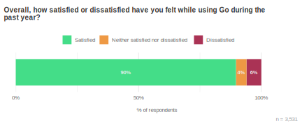

## 开发环境 Developer environments 

As in prior years, the majority of survey respondents told us they work with Go on Linux (63%) and macOS (58%) systems. Small variations in these numbers from year to year are most likely dependent upon who finds and responds to this survey (particularly on the Go blog), as we don’t see consistent year-over-year trends in the random sample coming from VS Code.

​	与往年一样，大多数受访者告诉我们，他们使用 Linux (63%) 和 macOS (58%) 系统上的 Go 工作。这些数字每年的小幅变化很可能取决于谁找到并回复了此调查（尤其是在 Go 博客上），因为我们没有看到来自 VS Code 的随机样本中出现一致的逐年趋势。

We do continue to see that newer members of the Go community are more likely to be working with Windows than more experienced Go developers. We interpret this as a signal that Windows-based development is important for onboarding new developers to the Go ecosystem, and is a topic our team hopes to focus on more in 2024.

​	我们确实继续看到，Go 社区的新成员比经验丰富的 Go 开发者更有可能使用 Windows。我们将其解读为一个信号，表明基于 Windows 的开发对于将新开发人员引入 Go 生态系统非常重要，也是我们团队希望在 2024 年更多关注的一个主题。

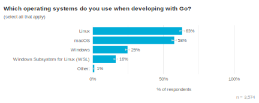 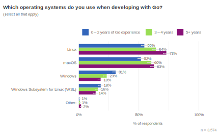

Respondents continue to be heavily focused on Linux deployments. Given the prevalence of Go for cloud development and containerized workloads, this is not surprising but is still an important confirmation. We found few meaningful differences based on factors such as organization size or experience level; indeed, while novice Go developers appear more likely to *develop* on Windows, 92% still *deploy* to Linux systems. Perhaps the most interesting finding from this breakdown is that more experienced Go developers said they deploy to a wider variety of systems (most notably WebAssembly and IoT), though it’s unclear if this is because such deployments are challenging for newer Go developers or the result of experienced Go developers using Go in a broader range of contexts. We also observed that both IoT and WebAssembly have steadily increased in recent years, with each rising from 3% in 2021 to 6% and 5% in 2023, respectively.

​	受访者继续高度关注 Linux 部署。鉴于 Go 在云开发和容器化工作负载中的普遍性，这并不令人惊讶，但仍然是一个重要的确认。我们发现基于组织规模或经验水平等因素的差异很少；事实上，虽然新手 Go 开发人员似乎更可能在 Windows 上开发，但 92% 仍然部署到 Linux 系统。从这种细分中发现的最有趣的结果可能是，更有经验的 Go 开发人员表示他们部署到更广泛的系统（最显着的是 WebAssembly 和物联网），但目前尚不清楚这是因为此类部署对较新的 Go 开发人员来说具有挑战性，还是因为经验丰富的 Go 开发人员在更广泛的上下文中使用 Go。我们还观察到，物联网和 WebAssembly 在近年来稳步增长，分别从 2021 年的 3% 上升到 2023 年的 6% 和 5%。

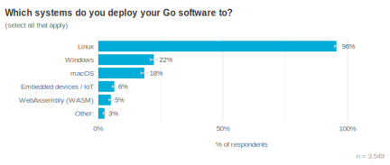

The computing architecture landscape has changed over the past few years, and we see that reflected in the current architectures Go developers say they work with. While x86-compatible systems still account for the majority of development (89%), ARM64 is also now used by a majority of respondents (56%). This adoption appears to be partly driven by Apple Silicon; macOS developers are now more likely to say they develop for ARM64 than for x86-based architectures (76% vs. 71%). However, Apple hardware isn’t the only factor driving ARM64 adoption: among respondents who don’t develop on macOS at all, 29% still say they develop for ARM64.

​	在过去的几年中，计算架构格局发生了变化，我们看到这一点反映在当前 Go 开发者所说的他们使用的架构中。虽然 x86 兼容系统仍然占开发的大部分（89%），但现在大多数受访者（56%）也使用 ARM64。这种采用似乎部分是由 Apple Silicon 推动的；macOS 开发者现在更有可能表示他们为 ARM64 开发，而不是基于 x86 的架构（76% 对比 71%）。然而，Apple 硬件并不是推动 ARM64 采用的唯一因素：在根本不使用 macOS 的受访者中，29% 的人仍然表示他们为 ARM64 开发。

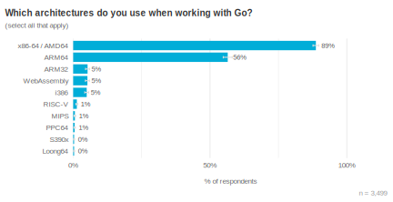

The most common code editors among Go Developer Survey respondents continue to be [VS Code](https://code.visualstudio.com/) (44%) and [GoLand](https://www.jetbrains.com/go/) (31%). Both of these proportions ticked down slightly from 2023 H1 (46% and 33%, respectively), but remain within this survey’s margin of error. Among the “Other” category, [Helix](https://helix-editor.com/) accounted for the majority of responses. Similar to the results for operating systems above, we don’t believe this represents a meaningful shift in code editor usage, but rather shows some of the variability we expect to see in a community survey such as this. In particular, we exclude the randomly sampled respondents from VS Code for this question, as we know that group is heavily biased towards VS Code. However, that has the side effect of making these results more susceptible to variation each year.

​	在 Go 开发者调查受访者中，最常见的代码编辑器仍然是 VS Code（44%）和 GoLand（31%）。这两个比例均较 2023 年上半年（分别为 46% 和 33%）略有下降，但仍在此次调查的误差范围内。“其他”类别中，Helix 占大多数回复。与上述操作系统结果类似，我们认为这并不代表代码编辑器使用情况发生了重大转变，而只是表明了我们期望在这样的社区调查中看到的一些可变性。特别是，对于这个问题，我们排除了 VS Code 的随机抽样受访者，因为我们知道该组严重偏向于 VS Code。然而，这会产生一个副作用，即这些结果每年更容易发生变化。

We also looked at respondents’ level of satisfaction with Go based on the editor they prefer using. After controlling for length of experience, we found no differences: we don’t believe people enjoy working with Go more or less based on which code editor they use. That doesn’t necessarily mean all Go editors are equal, but may reflect that people find the editor that is best for their own needs. This would suggest the Go ecosystem has a healthy diversity of different editors geared towards different use cases and developer preferences.

​	我们还根据受访者偏好的编辑器，考察了他们对 Go 的满意程度。在控制经验长度后，我们没有发现差异：我们不认为人们会根据他们使用的代码编辑器更多或更少地喜欢使用 Go。这并不一定意味着所有 Go 编辑器都是平等的，但可能反映出人们找到了最适合自己需求的编辑器。这表明 Go 生态系统拥有针对不同用例和开发人员偏好的各种不同编辑器的健康多样性。

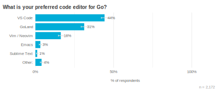

## 技术栈 Tech stacks 

To better understand the web of software and services that Go developers interact with, we asked several questions about tech stacks. We’re sharing these results with the community to show which tools and platforms are in common use today, but we believe everyone should consider their own needs and use cases when selecting a tech stack. More plainly: we neither intend for readers to use this data to select components of their tech stack because they are popular, nor to avoid components because they are not commonly used.

​	为了更好地了解 Go 开发人员交互的软件和服务网络，我们询问了有关技术栈的几个问题。我们与社区分享这些结果，以展示当今常用的工具和平台，但我们认为每个人在选择技术栈时都应考虑自己的需求和用例。更明确地说：我们既不希望读者因为这些数据而选择技术栈的组件，因为它们很受欢迎，也不希望他们因为这些组件不常用而避免使用它们。

First, we can say with confidence that Go is a language for modern cloud-based development. Indeed, 75% of respondents work on Go software that integrates with cloud services. For nearly half of respondents, this involved AWS (48%), and almost one-third used GCP (29%) for their Go development and deployments. For both AWS and GCP, usage is equally balanced among large enterprises and smaller organizations. Microsoft Azure is the only cloud provider that is significantly more likely to be used in large organizations (companies with > 1,000 employees) than smaller shops; other providers show no meaningful differences in usage based on the size of the organization.

​	首先，我们可以自信地说 Go 是一种用于现代云端开发的语言。事实上，75% 的受访者使用与云服务集成的 Go 软件。对于近一半的受访者而言，这涉及 AWS（48%），而近三分之一的人使用 GCP（29%）进行 Go 开发和部署。对于 AWS 和 GCP，大型企业和小规模组织的使用情况同样平衡。Microsoft Azure 是唯一一家在大型组织（员工人数 > 1,000 人的公司）中使用可能性明显更高的云提供商，而其他提供商在使用情况上没有显示出基于组织规模的明显差异。

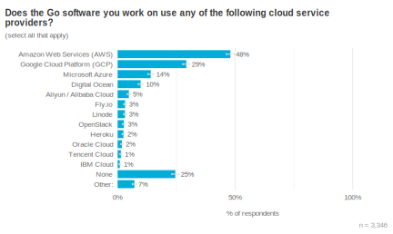

Databases are extremely common components of software systems, and we found that 91% of respondents said the Go services they work on use at least one. Most frequently this was PostgreSQL (59%), but with double digits of respondents reporting use of six additional databases, it’s safe to say there are not just a couple of standard DBs for Go developers to consider. We again see differences based on organization size, with respondents from smaller organizations more likely to report using PostgreSQL and Redis, while developers from large organizations are somewhat more likely to use a database specific to their cloud provider.

​	数据库是软件系统中极其常见的组件，我们发现 91% 的受访者表示他们所从事的 Go 服务至少使用一个数据库。最常使用的是 PostgreSQL（59%），但有两位数的受访者报告使用了六个其他数据库，可以肯定地说，对于 Go 开发人员来说，不仅仅只有几个标准的数据库需要考虑。我们再次看到基于组织规模的差异，来自较小组织的受访者更有可能报告使用 PostgreSQL 和 Redis，而来自大型组织的开发人员更有可能使用特定于其云提供商的数据库。

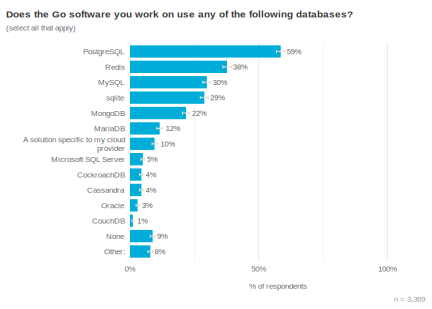

Another common component respondents reported using were caches or key-value stores; 68% of respondents said they work on Go software incorporating at least one of these. Redis was clearly the most common (57%), followed at a distance by etcd (10%) and memcached (7%).

​	受访者报告使用的另一个常见组件是缓存或键值存储；68% 的受访者表示他们从事包含至少其中一个的 Go 软件工作。Redis 明显是最常见的（57%），其次是 etcd（10%）和 memcached（7%）。

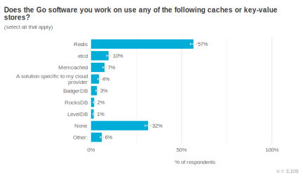

Similar to databases, survey respondents told us they use a range of different observability systems. Prometheus and Grafana were the most commonly cited (both at 43%), but Open Telemetry, Datadog, and Sentry were all in double digits.

​	与数据库类似，调查受访者告诉我们他们使用一系列不同的可观察性系统。Prometheus 和 Grafana 是最常被引用的（均为 43%），但 Open Telemetry、Datadog 和 Sentry 均为两位数。

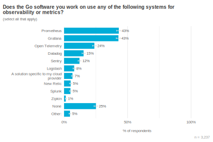

Lest anyone wonder “Have we JSON’d all the things?”… yes, yes we have. Nearly every respondent (96%!) said their Go software uses the JSON data format; that’s about as close to universal as you’ll see with self-reported data. YAML, CSV, and protocol buffers are also all used by roughly half of respondents, and double-digit proportions work with TOML and XML as well.

​	万一有人想知道“我们是否已经 JSON 化了所有东西？”……是的，是的，我们已经做到了。几乎每个受访者（96%！）都表示他们的 Go 软件使用了 JSON 数据格式；这几乎与您在自我报告的数据中看到的一样普遍。YAML、CSV 和协议缓冲区也都被大约一半的受访者使用，两位数比例的人也使用 TOML 和 XML。

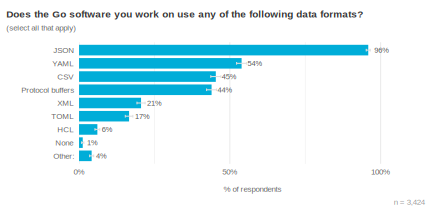

For authentication and authorization services, we found most respondents are building upon the foundations provided by standards such as [JWT](https://jwt.io/introduction) and [OAuth2](https://oauth.net/2/). This also appears to be an area where an organization’s cloud provider’s solution is about as likely to be used as most turn-key alternatives.

​	对于身份验证和授权服务，我们发现大多数受访者正在构建基于 JWT 和 OAuth2 等标准提供的基础。这似乎也是一个组织的云提供商的解决方案与大多数交钥匙替代方案一样有可能被使用的领域。

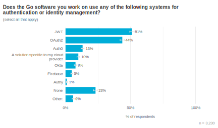

Finally, we have a bit of a grab bag of other services that don’t neatly fit into the above categories. We found that nearly half of respondents work with gRPC in their Go software (47%). For infrastructure-as-code needs, Terraform was the tool of choice for about ¼ of respondents. Other fairly common technologies used alongside Go included Apache Kafka, ElasticSearch, GraphQL, and RabbitMQ.

​	最后，我们还有一些无法很好地归入上述类别的其他服务。我们发现，近一半的受访者在他们的 Go 软件中使用 gRPC（47%）。对于基础架构即代码的需求，Terraform 是约 1/4 受访者的首选工具。与 Go 一起使用的其他相当常见的技术包括 Apache Kafka、ElasticSearch、GraphQL 和 RabbitMQ。

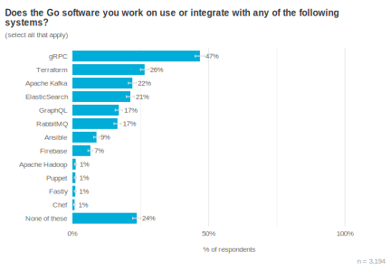

We also looked at which technologies tended to be used together. While nothing clearly analogous to the classic [LAMP stack](https://en.wikipedia.org/wiki/LAMP_(software_bundle)) emerged from this analysis, we did identify some interesting patterns:

​	我们还研究了哪些技术倾向于一起使用。虽然从这项分析中没有明确类似于经典 LAMP 堆栈的东西出现，但我们确实发现了一些有趣的模式：

- All or nothing: Every category (except data formats) showed a strong correlation where if a respondent answered “None” to one category, they likely answered “None” for all of the others. We interpret this as evidence that a minority of use cases require none of these tech stack components, but once the use case requires any one of them, it likely requires (or is at least simplified by) more than just one.
- 全有或全无：每个类别（数据格式除外）都显示出很强的相关性，如果受访者对一个类别回答“无”，他们很可能对所有其他类别也回答“无”。我们将其解释为证据，即少数用例不需要这些技术堆栈组件，但一旦用例需要其中任何一个，它可能需要（或至少简化）不止一个组件。
- A bias towards cross-platform technologies: Provider-specific solutions (i.e., services that are unique to a single cloud platform) were not commonly adopted. However, if respondents used one provider-specific solution (e.g., for metrics), they were substantially more likely to also say they used cloud-specific solutions in order areas (e.g., databases, authentication, caching, etc.).
- 偏向跨平台技术：特定于提供商的解决方案（即，仅适用于单个云平台的服务）并未被普遍采用。但是，如果受访者使用了一个特定于提供商的解决方案（例如，用于指标），那么他们也更有可能表示在其他领域（例如，数据库、身份验证、缓存等）中使用了特定于云的解决方案。
- Multicloud: The three biggest cloud platforms were most likely to be involved in multicloud setups. For example, if an organization is using any non-AWS cloud provider, they’re probably also using AWS. This pattern was clearest for Amazon Web Services, but was also apparent (to a lesser extent) for Google Cloud Platform and Microsoft Azure.
- 多云：三大云平台最有可能参与多云设置。例如，如果某个组织正在使用任何非 AWS 云提供商，那么他们可能也在使用 AWS。这种模式对于 Amazon Web Services 最为明显，但对于 Google Cloud Platform 和 Microsoft Azure 也很明显（程度较小）。

## 开发人员如何启动新的 Go 项目 How developers start new Go projects 

As part of our [experimentation with project templates](https://go.dev/blog/gonew), we wanted to understand how Go developers get started with new projects today. Respondents told us their biggest challenges were choosing an appropriate way to structure their project (54%) and learning how to write idiomatic Go (47%). As two respondents phrased it:

​	作为我们对项目模板的试验的一部分，我们想要了解 Go 开发人员如何着手进行新项目。受访者告诉我们，他们面临的最大挑战是选择一种合适的方式来构建他们的项目（54%）和学习如何编写惯用 Go（47%）。正如两位受访者所说：

> “Finding an appropriate structure and the right abstraction levels for a new project can be quite tedious; looking at high-profile community and enterprise projects for inspiration can be quite confusing as everyone structures their project differently” *— Professional Go developer w/ 5 – 9 years of Go experience*
>
> ​	“为新项目找到合适的结构和正确的抽象级别可能非常乏味；参考知名社区和企业项目来寻求灵感可能会非常令人困惑，因为每个人构建项目的方式都不同”——具有 5 到 9 年 Go 经验的专业 Go 开发人员

> “It would be great if [Go had a] toolchain to create [a project’s] basic structure for web or CLI like `go init <project name>`” *— Professional Go developer w/ 3 – 4 years of experience*
>
> ​	“如果 [Go 拥有] 一个工具链来创建 [项目] 的基本结构，例如 web 或 CLI，例如 `go init `，那就太好了”——具有 3 到 4 年经验的专业 Go 开发人员

Newer Go developers were even more likely to encounter these challenges: the proportions increased to 59% and 53% for respondents with less than two years of experience with Go, respectively. These are both areas we hope to improve via our `gonew` prototype: templates can provide new Go developers with well-tested project structures and design patterns, with initial implementations written in idiomatic Go. These survey results have helped our team to keep the purpose of `gonew` focused on tasks the Go community most struggle with.

​	对于 Go 开发经验不足两年的受访者，这些比例分别增加到 59% 和 53%。我们希望通过 `gonew` 原型来改进这两个方面：模板可以为新的 Go 开发者提供经过充分测试的项目结构和设计模式，并以惯用 Go 语言编写的初始实现。这些调查结果帮助我们的团队将 `gonew` 的目标集中在 Go 社区最难处理的任务上。

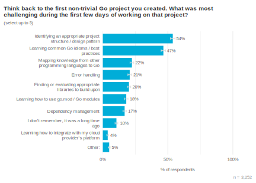

A majority of respondents told us they either use templates or copy+paste code from existing projects when starting a new Go project (58%). Among respondents with less than five years of Go experience, this proportion increased to nearly ⅔ (63%). This was an important confirmation that the template-based approach in `gonew` seems to meet developers where they already are, aligning a common, informal approach with `go` command-style tooling. This is further supported by the common feature requests for project templates: a majority of respondents requested 1) a pre-configured directory structure to organize their project and 2) sample code for common tasks in the project domain. These results are well-aligned with the challenges developers said they faced in the previous section. The responses to this question also help tease apart the difference between project structure and design patterns, with nearly twice as many respondents saying they want Go project templates to provide the former than the latter.

​	大多数受访者告诉我们，他们在启动新的 Go 项目时，要么使用模板，要么从现有项目中复制粘贴代码（58%）。在具有不到五年 Go 经验的受访者中，这一比例增加到近 ⅔（63%）。这是一个重要的确认，即 `gonew` 中基于模板的方法似乎满足了开发人员的现有需求，将常见的非正式方法与 `go` 命令式工具相结合。项目模板的常见功能请求进一步支持了这一点：大多数受访者要求 1）预先配置的目录结构来组织他们的项目，以及 2）项目域中常见任务的示例代码。这些结果与开发人员在前一节中所说的面临的挑战非常吻合。对这个问题的回答也有助于区分项目结构和设计模式之间的差异，近两倍的受访者表示他们希望 Go 项目模板提供前者而不是后者。

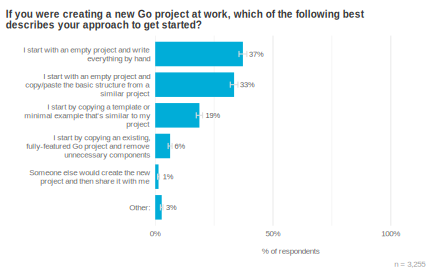

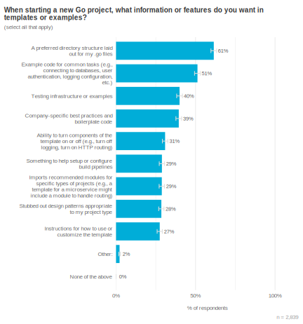

A majority of respondents told us the ability to make changes to a template *and* have those changes propagate to projects based on that template was of at least moderate importance. Anecdotally, we haven’t spoken with any developers who *currently* have this functionality with home-grown template approaches, but it suggests this is an interesting avenue for future development.

​	大多数受访者告诉我们，能够对模板进行更改并将这些更改传播到基于该模板的项目至少具有中等重要性。有趣的是，我们尚未与任何目前通过内部模板方法拥有此功能的开发人员交谈，但这表明这是未来开发的一个有趣途径。

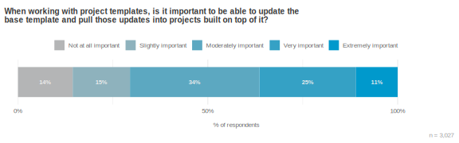

## 错误处理的开发者目标 Developer goals for error handling 

A perennial topic of discussion among Go developers is potential improvements to error handling. As one respondent summarized:

​	Go 开发者之间讨论的一个常年话题是错误处理的潜在改进。正如一位受访者总结的那样：

> “Error handling adds too much boilerplate (I know, you probably heard this before)” *— Open source Go developer w/ 1 – 2 years of experience*
>
> ​	“错误处理增加了太多样板代码（我知道，你可能以前听说过）”——具有 1 - 2 年经验的开源 Go 开发者

But, we also hear from numerous developers that they appreciate Go’s approach to error handling:

​	但是，我们也从众多开发者那里听说，他们很欣赏 Go 处理错误的方法：

> “Go error handling is simple and effective. As I have backends in Java and C# and exploring Rust and Zig now, I am always pleased to go back to write Go code. And one of the reasons is, believe it or not, error handling. It is really simple, plain and effective. Please leave it that way.” *— Open source Go developer w/ 5 – 9 years of experience*
>
> ​	“Go 错误处理简单有效。由于我的后端使用 Java 和 C#，现在正在探索 Rust 和 Zig，所以我总是很高兴重新编写 Go 代码。原因之一是，信不信由你，错误处理。它非常简单、清晰且有效。请保持这种方式。”——具有 5 - 9 年经验的开源 Go 开发者

Rather than ask about specific modifications to error handling in Go, we wanted to better understand developers’ higher-level goals and whether Go’s current approach has proven useful and usable. We found that a majority of respondents appreciate Go’s approach to error handling (55%) and say it helps them know when to check for errors (50%). Both of these outcomes were stronger for respondents with more Go experience, suggesting that either developers grow to appreciate Go’s approach to error handling over time, or that this is one factor leading developers to eventually leave the Go ecosystem (or at least stop responding to Go-related surveys). Many survey respondents also felt that Go requires a lot of tedious, boilerplate code to check for errors (43%); this remained true regardless of how much prior Go experience respondents had. Interestingly, when respondents said they appreciate Go’s error handling, they were unlikely to say it also results in lots of boilerplate code—our team had a hypothesis that Go developers can both appreciate the language’s approach to error handling and feel it’s too verbose, but only 14% of respondents agreed with both statements.

​	我们没有询问有关 Go 中错误处理的具体修改，而是想更好地了解开发人员的高级目标，以及 Go 的当前方法是否已被证明有用且可用。我们发现，大多数受访者赞赏 Go 处理错误的方法（55%），并表示这有助于他们知道何时检查错误（50%）。对于具有更多 Go 经验的受访者，这两种结果都更强，这表明开发人员要么随着时间的推移而逐渐欣赏 Go 处理错误的方法，要么这是导致开发人员最终离开 Go 生态系统（或至少停止回复与 Go 相关的调查）的一个因素。许多调查受访者还认为，Go 需要大量繁琐的样板代码来检查错误（43%）；无论受访者之前有多少 Go 经验，这一点都是如此。有趣的是，当受访者表示他们赞赏 Go 的错误处理时，他们不太可能说这也导致了大量样板代码——我们的团队有一个假设，即 Go 开发人员既可以赞赏该语言处理错误的方法，又觉得它太冗长，但只有 14% 的受访者同意这两种说法。

Specific issues that respondents cited include challenges knowing which error types to check for (28%), wanting to easily show a stack trace along with the error message (28%), and the ease with which errors can be entirely ignored (19%). About ⅓ of respondents were also interested in adopting concepts from other languages, such as Rust’s `?` operator (31%).

​	受访者提到的具体问题包括：不知道要检查哪些错误类型（28%）、想要轻松地显示错误消息和堆栈跟踪（28%），以及可以完全忽略错误的容易程度（19%）。大约三分之一的受访者也有兴趣采用其他语言的概念，例如 Rust 的 `?` 运算符（31%）。

The Go team has no plans to add exceptions to the language, but since this is anecdotally a common request, we included it as a response choice. Only 1 in 10 respondents said they wished they could use exceptions in Go, and this was inversely related to experience—more veteran Go developers were less likely to be interested in exceptions than respondents newer to the Go community.

​	Go 团队没有计划向该语言添加异常，但由于这在经验之谈中是一个常见请求，因此我们将其作为响应选项。只有十分之一的受访者表示他们希望在 Go 中使用异常，并且这与经验成反比——资深的 Go 开发人员对异常的兴趣低于 Go 社区的新手。

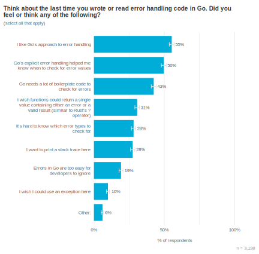

## 了解 ML/AI 的用例 Understanding ML/AI use cases 

The Go team is considering how the unfolding landscape of new ML/AI technologies may impact software development in two distinct veins: 1) how might ML/AI tooling help engineers write better software, and 2) how might Go help engineers bring ML/AI support to their applications and services? Below, we delve into each of these areas.

​	Go 团队正在考虑新的 ML/AI 技术的不断发展态势可能通过两种不同的方式影响软件开发：1) ML/AI 工具如何帮助工程师编写更好的软件，以及 2) Go 如何帮助工程师为其应用程序和服务带来 ML/AI 支持？下面，我们将深入探讨这些领域。

### 帮助工程师编写更好的软件 Helping engineers write better software 

There’s little denying we’re in [a hype cycle around the possibilities for AI/ML](https://www.gartner.com/en/articles/what-s-new-in-artificial-intelligence-from-the-2023-gartner-hype-cycle). We wanted to take a step back to focus on the broader challenges developers face and where they think AI might prove useful in their regular work. The answers were a bit surprising, especially given the industry’s current focus on coding assistants.

​	不可否认，我们正处于围绕 AI/ML 的可能性展开的炒作周期中。我们希望退后一步，专注于开发人员面临的更广泛的挑战，以及他们认为 AI 在其日常工作中可能证明有用的地方。答案有点令人惊讶，特别是考虑到行业目前专注于编码助手。

First, we see a few AI use cases that about half of respondents thought could be helpful: generating tests (49%), suggesting best practices in-situ (47%), and catching likely mistakes early in the development process (46%). A unifying theme of these top use cases is that each could help improve the quality and reliability of code an engineer is writing. A fourth use case (help writing documentation) garnered interest from about ⅓ of respondents. The remaining cases comprise a long tail of potentially fruitful ideas, but these are of significantly less general interest than the top four.

​	首先，我们看到一些 AI 用例，大约一半的受访者认为这些用例可能会有所帮助：生成测试 (49%)、就地建议最佳实践 (47%) 和在开发过程的早期发现可能的错误 (46%)。这些热门用例的一个统一主题是，每个用例都有助于提高工程师编写的代码的质量和可靠性。第四个用例（帮助编写文档）引起了大约三分之一受访者的兴趣。其余用例包含大量潜在的富有成效的想法，但这些想法的普遍关注度明显低于前四个用例。

When we look at developers’ duration of experience with Go, we find that novice respondents are interested in help resolving compiler errors and explaining what a piece of Go code does more than veteran Go developers. These might be areas where AI could help improve the getting started experience for new Gophers; for example, an AI assistant could help explain in natural language what an undocumented block of code does, or suggest common solutions to specific error messages. Conversely, we see no differences between experience levels for topics like “catch common mistakes”—both novice and veteran Go developers say they would appreciate tooling to help with this.

​	当我们关注开发者使用 Go 的经验持续时间时，我们发现新手受访者对帮助解决编译器错误和解释一段 Go 代码的作用比资深 Go 开发者更感兴趣。这些可能是人工智能可以帮助改善新 Gopher 入门体验的领域；例如，人工智能助手可以帮助用自然语言解释一段未记录的代码的作用，或为特定的错误消息建议常见的解决方案。相反，我们没有看到经验水平在“发现常见错误”等主题上的差异——新手和资深 Go 开发者都表示他们会感谢帮助解决此问题的工具。

One can squint at this data and see three broad trends:

​	人们可以仔细审视这些数据，并看到三个广泛的趋势：

1. Respondents voiced interest in getting feedback from “expert reviewers” in real-time, not just during review time.
2. 受访者表示有兴趣从“专家审阅者”那里实时获得反馈，而不仅仅是在审阅期间。
3. Generally, respondents appeared most interested in tooling that saves them from potentially less-enjoyable tasks (e.g., writing tests or documenting code).
4. 总体而言，受访者似乎对可以让他们免于潜在的不太愉快任务（例如，编写测试或记录代码）的工具最感兴趣。
5. Wholesale writing or translating of code was of fairly low interest, especially to developers with more than a year or two of experience.
6. 完全编写或翻译代码的兴趣相当低，尤其是对于具有超过一两年经验的开发人员而言。

Taken together, it appears that today, developers are less excited by the prospect of machines doing the fun (e.g., creative, enjoyable, appropriately challenging) parts of software development, but do see value in another set of “eyes” reviewing their code and potentially handling dull or repetitive tasks for them. As one respondent phrased it:

​	总体而言，现在看来，开发人员对机器完成软件开发中有趣的部分（例如，创造性、令人愉悦、适当具有挑战性）的可能性不太感兴趣，但确实认为另一双“眼睛”审查其代码并可能为他们处理枯燥或重复的任务是有价值的。正如一位受访者所说：

> “I’m specifically interested in using AI/ML to improve my productivity with Go. Having a system that is trained in Go best practices, can catch anti-patterns, bugs, generate tests, with a low rate of hallucination, would be killer.” *— Professional Go developer w/ 5 – 9 years of experience*
>
> ​	“我特别有兴趣使用 AI/ML 来提高我在 Go 方面的生产力。拥有一个经过 Go 最佳实践训练的系统，能够发现反模式、错误、生成测试，并且具有较低的幻觉率，那将是杀手锏。”——具有 5 到 9 年经验的专业 Go 开发人员

This survey, however, is just one data point in a quickly-evolving research field, so it’s best to keep these results in context.

​	然而，这项调查只是快速发展的研究领域中的一个数据点，因此最好将这些结果放在上下文中。

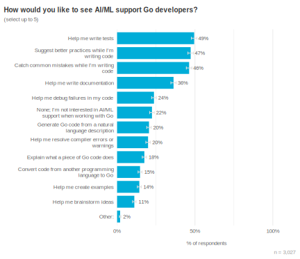

### 将 AI 功能引入应用程序和服务 Bringing AI features to applications and services 

In addition to looking at how Go developers might benefit from AI/ML-powered tooling, we explored their plans for building AI-powered applications and services (or supporting infrastructure) with Go. We found that we’re still early in [the adoption curve](https://en.wikipedia.org/wiki/Technology_adoption_life_cycle): most respondents have not yet tried to use Go in these areas, though every topic saw some level of interest from roughly half of respondents. For example, a majority of respondents reported interest in integrating the Go services they work on with LLMs (49%), but only 13% have already done so or are currently evaluating this use case. At the time of this survey, responses gently suggest that developers may be most interested in using Go to call LLMs directly, build the data pipelines needed to power ML/AI systems, and for creating API endpoints other services can call to interact with ML/AI models. As one example, this respondent described the benefits they hoped to gain by using Go in their data pipelines:

​	除了研究 Go 开发人员如何从 AI/ML 驱动的工具中受益之外，我们还探讨了他们使用 Go 构建 AI 驱动的应用程序和服务（或支持基础设施）的计划。我们发现我们仍处于采用曲线的早期阶段：大多数受访者尚未尝试在这些领域使用 Go，尽管每个主题都引起了大约一半受访者的兴趣。例如，大多数受访者表示有兴趣将他们正在处理的 Go 服务与 LLM 集成（49%），但只有 13% 的人已经这样做或目前正在评估此用例。在本次调查时，回复意见温和地表明，开发人员可能最感兴趣的是使用 Go 直接调用 LLM、构建为 ML/AI 系统提供支持所需的数据管道，以及创建其他服务可以调用的 API 端点以与 ML/AI 模型进行交互。例如，这位受访者描述了他们希望通过在数据管道中使用 Go 获得的好处：

> “I want to integrate the ETL [extract, transform, and load] part using Go, to keep a consistent, robust, reliable codebase.” *— Professional Go developer w/ 3 – 4 years of experience*
>
> ​	“我想使用 Go 集成 ETL [提取、转换和加载] 部分，以保持一致、稳健、可靠的代码库。”——具有 3-4 年经验的专业 Go 开发人员

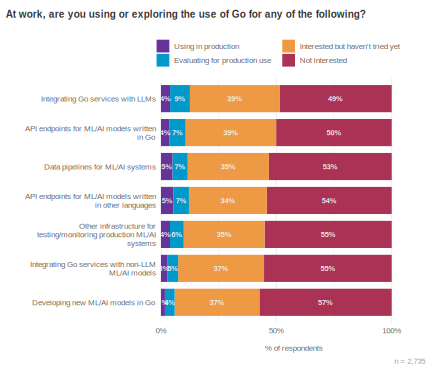

## 工具链错误消息 Toolchain error messages 

Many developers can relate to the frustrating experience of seeing an error message, thinking they know what it means and how to resolve it, but after hours of fruitless debugging realize it meant something else entirely. One respondent explained their frustration as follows:

​	许多开发人员都能理解看到错误消息的令人沮丧的经历，他们认为自己知道错误消息的含义以及如何解决错误消息，但在经过数小时的无用调试后才意识到错误消息的含义完全不同。一位受访者解释了他们的沮丧情绪，如下所示：

> “So often the printed complaints wind up having nothing to do with the problem, but it can take an hour before I discover that that’s the case. The error messages are unnervingly terse, and don’t seem to go out of their way to guess as to what the user might be trying to do or [explain what they’re] doing wrong.” *— Professional Go developer w/ 10+ years of experience*
>
> ​	“通常，打印的抱怨最终与问题无关，但我可能需要一个小时才能发现情况确实如此。错误消息令人不安地简洁，而且似乎不会费尽心思去猜测用户可能想要做什么或 [解释他们] 做错了什么。”——具有 10 年以上经验的专业 Go 开发人员

We believe the warnings and errors emitted by developer tooling should be brief, understandable, and actionable: the human reading them should be able to accurately understand what went wrong and what they can do to resolve the issue. This is an admittedly high bar to strive for, and with this survey we took some measurements to understand how developers perceive Go’s current warning and error messages.

​	我们认为，开发人员工具发出的警告和错误应简短、易懂且可操作：阅读这些警告和错误的人员应能够准确地理解出错的原因以及他们可以采取哪些措施来解决问题。诚然，这是一个很难达到的高标准，通过这项调查，我们进行了一些衡量，以了解开发人员如何看待 Go 当前的警告和错误消息。

When thinking about the most recent Go error message they worked through, respondents told us there was much room for improvement. Only a small majority understood what the problem was from the error message alone (54%), and even fewer knew what to do next to resolve the issue (41%). It appears a relatively small amount of additional information could meaningfully increase these proportions, as ¼ of respondents said they mostly knew how to fix the problem, but needed to see an example first. Further, with 11% of respondents saying they couldn’t make sense of the error message, we now have a baseline for current understandability of the Go toolchain’s error messages.

​	在思考他们最近解决的 Go 错误消息时，受访者告诉我们，改进空间很大。仅从错误消息中理解问题所在的人数只占微弱多数（54%），知道接下来该做什么以解决问题的人数更少（41%）。似乎相对较少量的附加信息可以大幅提高这些比例，因为四分之一的受访者表示他们大体上知道如何解决问题，但需要先看一个示例。此外，有 11% 的受访者表示他们无法理解错误消息，我们现在有了 Go 工具链错误消息当前可理解性的基准。

Improvements to Go’s toolchain error messages would especially benefit less-experienced Gophers. Respondents with up to two years of experience were less likely than veteran Gophers to say they understood the problem (47% vs. 61%) or knew how to fix it (29% vs. 52%), and were twice as likely to need to search online to fix the issue (21% vs. 9%) or even make sense of what the error meant (15% vs. 7%).

​	改进 Go 的工具链错误消息将尤其使经验较少的 Gopher 受益。经验最多两年的受访者表示他们理解问题（47% 对比 61%）或知道如何解决问题（29% 对比 52%）的可能性低于经验丰富的 Gopher，并且他们需要在线搜索来解决问题（21% 对比 9%）或甚至理解错误含义的可能性是后者的两倍（15% 对比 7%）。

We hope to focus on improving toolchain error messages during 2024. These survey results suggest this is an area of frustration for developers of all experience levels, and will particularly help newer developers get started with Go.

​	我们希望在 2024 年专注于改进工具链错误消息。这些调查结果表明，这是所有经验水平的开发人员感到沮丧的一个领域，并且尤其有助于新手开发人员开始使用 Go。

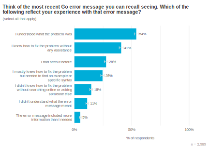

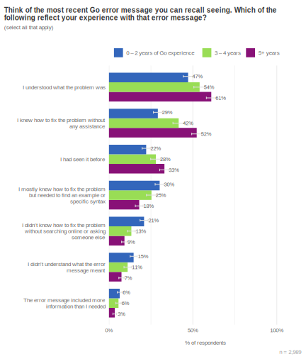

To understand *how* these messages might be improved, we asked survey respondents an open-ended question: “If you could make a wish and improve one thing about error messages in the Go toolchain, what would you change?”. The responses largely align with our hypothesis that good error messages are both understandable and actionable. The most common response was some form of “Help me understand what led to this error” (36%), 21% of respondents explicitly asked for guidance to fix the problem, and 14% of respondents called out languages such as Rust or Elm as exemplars which strive to do both of these things. In the words of one respondent:

​	为了了解如何改进这些消息，我们向调查受访者提出了一个开放式问题：“如果您能实现一个愿望并改进 Go 工具链中的错误消息，您会改变什么？”。这些回复在很大程度上与我们的假设一致，即好的错误消息既易于理解又可操作。最常见的回复是某种形式的“帮助我理解导致此错误的原因”（36%），21% 的受访者明确要求提供修复问题的指导，14% 的受访者提到了 Rust 或 Elm 等语言，这些语言努力做到这两点。正如一位受访者所说：

> “For compilation errors, Elm or Rust-style output pinpointing exact issue in the source code. Errors should include suggestions to fix them where possible… I think a general policy of ‘optimize error output to be read by humans’ with ‘provide suggestions where possible’ would be very welcome here.” *— Professional Go developer w/ 5 – 9 years of experience*
>
> ​	“对于编译错误，Elm 或 Rust 风格的输出可精确定位源代码中的确切问题。错误应包括尽可能修复它们的建议……我认为“优化错误输出以供人类阅读”的一般策略加上“尽可能提供建议”将在这里非常受欢迎。”——具有 5 到 9 年经验的专业 Go 开发人员

Understandably, there is a fuzzy conceptual boundary between toolchain error messages and runtime error messages. For example, one of the top requests involved improved stack traces or other approaches to assist debugging runtime crashes (22%). Similarly, a surprising theme in 4% of the feedback was about challenges with getting help from the `go` command itself. These are great examples of the Go community helping us identify related pain points that weren’t otherwise on our radar. We started this investigation focused on improving compile-time errors, but one of the core areas Go developers would like to see improved actually relates to run-time errors, while another was about the `go` command’s help system.

​	可以理解的是，工具链错误消息和运行时错误消息之间存在模糊的概念界限。例如，其中一个最迫切的要求涉及改进的堆栈跟踪或其他帮助调试运行时崩溃的方法（22%）。同样，4% 的反馈中一个令人惊讶的主题是关于从 `go` 命令本身获取帮助时遇到的挑战。这些都是 Go 社区帮助我们识别出我们原本没有注意到的相关痛点的绝佳示例。我们开始这项调查的重点是改进编译时错误，但 Go 开发人员希望改进的核心领域之一实际上与运行时错误有关，而另一个则是关于 `go` 命令的帮助系统。

> “When an error is thrown, the call stack can be huge and includes a bunch of files I don’t care about. I just want to know where the problem is in MY code, not the library I’m using, or how the panic was handled.” *— Professional Go developer w/ 1 – 2 years of experience*
>
> ​	“当抛出错误时，调用堆栈可能很大，并且包含一堆我不关心的文件。我只想知道问题出在我的代码中，而不是我正在使用的库中，或者恐慌是如何处理的。”——具有 1 - 2 年经验的专业 Go 开发人员

> “Getting help via `go help run` dumps a wall of text, with links to further readings to find the available command-line flags. Or the fact that it understands `go run –help` but instead of showing the help, it says ‘please run go help run instead’. Just show me list of flags in `go run –help`.” *— Professional Go developer w/ 3 – 4 years of experience*
>
> ​	“通过 `go help run` 获取帮助会转储一大段文字，其中包含指向进一步阅读的链接，以查找可用的命令行标志。或者它理解 `go run –help` 的事实，但它没有显示帮助，而是说“请改用 go help run”。只需在 `go run –help` 中向我显示标志列表即可。”——具有 3 - 4 年经验的专业 Go 开发人员

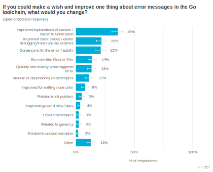

## Microservices 微服务

We commonly hear that developers find Go to be a great fit for microservices, but we have never tried to quantify how many Go developers have adopted this type of service architecture, understand how those services communicate with one another, or the challenges developers encounter when working on them. This year we added a few questions to better understand this space.

​	我们经常听到开发者认为 Go 非常适合微服务，但我们从未尝试量化有多少 Go 开发者采用了这种类型的服务架构，了解这些服务如何相互通信，或者开发者在处理这些服务时遇到的挑战。今年我们增加了一些问题来更好地了解这一领域。

A plurality of respondents said they work mostly on microservices (43%), with another ¼ saying they work on a mix of both microservices and monoliths. Only about ⅕ of respondents work mostly on monolithic Go applications. This is one of the few areas where we see differences based on the size of organization respondents work at—large organizations seem more likely to have adopted a microservice architecture than smaller companies. Respondents from large organizations (>1,000 employees) were most likely to say they work on microservices (55%), with only 11% of these respondents working primarily on monoliths.

​	大多数受访者表示他们主要从事微服务工作（43%），另有 1/4 表示他们从事微服务和整体式服务的混合工作。只有大约 1/5 的受访者主要从事整体式 Go 应用程序工作。这是我们根据受访者所在组织规模看到差异的少数几个领域之一——大型组织似乎比小型公司更有可能采用微服务架构。来自大型组织（员工人数 >1,000 人）的受访者最有可能表示他们从事微服务工作（55%），而这些受访者中只有 11% 主要从事整体式服务工作。

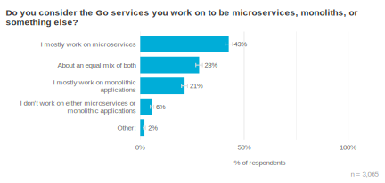

We see some bifurcation in the number of microservices comprising Go platforms. One group is composed of a handful (2 to 5) of services (40%), while the other consists of larger collections, with a minimum of 10 component services (37%). The number of microservices involved does not appear to be correlated with organization size.

​	我们看到由 Go 平台组成的微服务数量出现了一些分歧。一组由少数（2 到 5 个）服务（40%）组成，而另一组由较大的集合组成，至少有 10 个组件服务（37%）。所涉及的微服务数量似乎与组织规模无关。

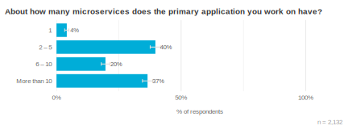

A large majority of respondents use some form of direct response request (e.g., RPC, HTTP, etc.) for microservice communication (72%). A smaller proportion use message queues (14%) or a pub/sub approach (9%); again, we see no differences here based on organization size.

​	绝大多数受访者使用某种形式的直接响应请求（例如，RPC、HTTP 等）进行微服务通信（72%）。较小比例的人使用消息队列（14%）或发布/订阅方法（9%）；同样，我们在此处没有看到基于组织规模的差异。

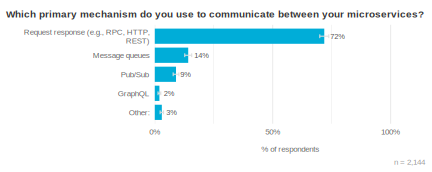

A majority of respondents build microservices in a polyglot of languages, with only about ¼ exclusively using Go. Python is the most common companion language (33%), alongside Node.js (28%) and Java (26%). We again see differences based on organization size, with larger organizations more likely to be integrating Python (43%) and Java (36%) microservices, while smaller organizations are a bit more likely to only use Go (30%). Other languages appeared to be used equally based on organization size.

​	大多数受访者使用多种语言构建微服务，只有大约 1/4 的人专门使用 Go。Python 是最常见的配套语言（33%），其次是 Node.js（28%）和 Java（26%）。我们再次看到基于组织规模的差异，较大的组织更有可能集成 Python（43%）和 Java（36%）微服务，而较小的组织更有可能只使用 Go（30%）。其他语言似乎根据组织规模而被平等使用。

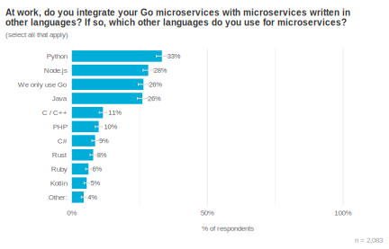

Overall, respondents told us testing and debugging were their biggest challenge when writing microservice-based applications, followed by operational complexity. Many other challenges occupy the long tail on this graph, though “portability” stands out as a non-issue for most respondents. We interpret this to mean that such services aren’t intended to be portable (beyond basic containerization); for example, if an organization’s microservices are initially powered by PostgreSQL databases, developers aren’t concerned with potentially porting this to an Oracle database in the near future.

​	总体而言，受访者告诉我们，在编写基于微服务的应用程序时，测试和调试是他们面临的最大挑战，其次是操作复杂性。许多其他挑战占据了此图表的较长部分，尽管“可移植性”对于大多数受访者来说都不是问题。我们对此的解释是，此类服务并不打算具有可移植性（超出基本容器化）；例如，如果组织的微服务最初由 PostgreSQL 数据库提供支持，那么开发人员不必担心在不久的将来可能将其移植到 Oracle 数据库。

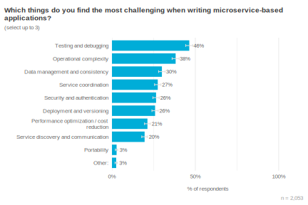

## 模块创作和维护 Module authorship and maintenance 

Go has a vibrant ecosystem of community-driven modules, and we want to understand the motivations and challenges faced by developers who maintain these modules. We found that about ⅕ of respondents maintain (or used to maintain) an open-source Go module. This was a surprisingly high proportion, and may be biased due to how we share this survey: module maintainers may be more likely to closely follow the Go blog (where this survey is announced) than other Go developers.

​	Go 拥有一个充满活力的社区驱动模块生态系统，我们希望了解维护这些模块的开发人员的动机和面临的挑战。我们发现大约 ⅕ 的受访者维护（或曾经维护）一个开源 Go 模块。这是一个惊人地高比例，并且可能由于我们分享此调查的方式而存在偏差：模块维护者可能比其他 Go 开发者更有可能密切关注 Go 博客（此调查已在此处宣布）。

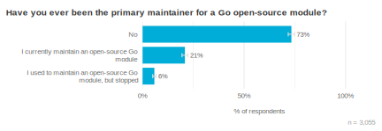

Module maintainers appear to be largely self-motivated—they report working on modules that they need for personal (58%) or work (56%) projects, that they do so because they enjoy working on these modules (63%) and being part of the public Go community (44%), and that they learn useful skills from their module maintainership (44%). More external motivations, such as receiving recognition (15%), career advancement (36%), or cash money (20%) are towards the bottom of the list.

​	模块维护者似乎在很大程度上是自我激励的——他们报告说，他们正在为个人（58%）或工作（56%）项目所需的模块工作，他们这样做是因为他们喜欢研究这些模块（63%）并成为公共 Go 社区的一部分（44%），并且他们从模块维护中学习有用的技能（44%）。更多外部动机，例如获得认可（15%）、职业晋升（36%）或现金（20%）排在列表的底部。

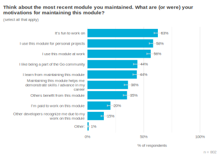

Given the forms of [intrinsic motivation](https://en.wikipedia.org/wiki/Motivation#Intrinsic_and_extrinsic) identified above, it follows that a key challenge for module maintainers is finding time to devote to their module (41%). While this might not seem like an actionable finding in itself (we can’t give Go developers an extra hour or two each day, right?), it’s a helpful lens through which to view module tooling and development—these tasks are most likely occurring while the developer is already pressed for time, and perhaps it’s been weeks or months since they last had an opportunity to work on it, so things aren’t fresh in their memory. Thus, aspects like understandable and actionable error messages can be particularly helpful: rather than require someone to once again search for specific `go` command syntax, perhaps the error output could provide the solution they need right in their terminal.

​	鉴于上述内在动机形式，由此可知，模块维护人员面临的主要挑战是找到时间投入到他们的模块中（41%）。虽然这本身看起来可能不是一个可操作的发现（我们不能给 Go 开发人员每天额外增加一两个小时，对吧？），但这是一个有用的视角，可以用来查看模块工具和开发——这些任务很可能发生在开发人员已经时间紧迫的时候，而且可能已经过了几周或几个月，他们才最后有机会处理它，因此他们记忆中对此并不新鲜。因此，诸如可理解且可操作的错误消息之类的方面可能特别有用：与其要求某人再次搜索特定的 `go` 命令语法，不如让错误输出直接在他们的终端中提供他们需要的解决方案。

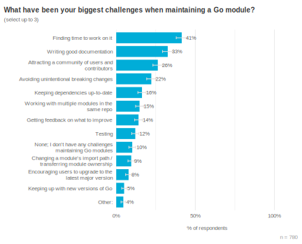

## 人口统计信息 Demographics 

Most survey respondents reported using Go for their primary job (78%), and a majority (59%) said they use it for personal or open-source projects. In fact, it’s common for respondents to use Go for *both* work and personal/OSS projects, with 43% of respondents saying they use Go in each of these situations.

​	大多数调查受访者报告称，他们将 Go 用于他们的主要工作（78%），并且大多数人（59%）表示他们将 Go 用于个人或开源项目。事实上，受访者同时将 Go 用于工作和个人/开源项目的情况很常见，43% 的受访者表示他们在每种情况下都使用 Go。

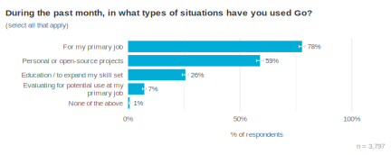

The majority of respondents have been working with Go for under five years (68%). As we’ve seen in [prior years](https://go.dev/blog/survey2023-q1-results#novice-respondents-are-more-likely-to-prefer-windows-than-more-experienced-respondents), people who found this survey via VS Code tended to be less experienced than people who found the survey via other channels.

​	大多数受访者使用 Go 的时间不到五年（68%）。正如我们在前几年看到的那样，通过 VS Code 找到此调查的人往往比通过其他渠道找到调查的人经验更少。

When we break down where people use Go by their experience level, two findings stand out. First, a majority of respondents from all experience levels said they’re using Go professionally; indeed, for people with over two years of experience, the vast majority use Go at work (85% – 91%). A similar trend exists for open-source development. The second finding is that developers with less Go experience are more likely to be using Go to expand their skill set (38%) or to evaluate it for use at work (13%) than more experienced Go developers. We interpret this to mean that many Gophers initially view Go as part of “upskilling” or expanding their understanding of software development, but that within a year or two, they look to Go as more of a tool for doing than learning.

​	当我们按经验水平细分人们使用 Go 的情况时，有两个发现很突出。首先，来自所有经验水平的大多数受访者表示他们正在专业地使用 Go；事实上，对于具有两年以上经验的人来说，绝大多数人在工作中使用 Go（85% - 91%）。开源开发也存在类似的趋势。第二个发现是，经验较少的 Go 开发人员更有可能使用 Go 来扩展他们的技能组合（38%）或评估它在工作中的用途（13%），而不是更有经验的 Go 开发人员。我们对此的解释是，许多 Gopher 最初将 Go 视为“提升技能”或扩展他们对软件开发的理解的一部分，但在一年或两年内，他们将 Go 更多地视为一种用于实践而非学习的工具。

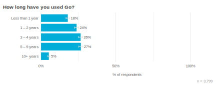

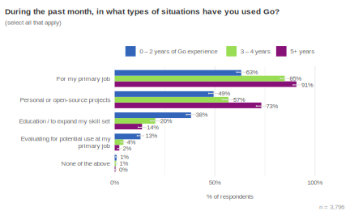

The most common use cases for Go continue to be API/RPC services (74%) and command line tools (62%). People tell us Go is a great choice for these types of software for several reasons, including its built-in HTTP server and concurrency primitives, ease of cross-compilation, and single-binary deployments.

​	Go 最常见的用例仍然是 API/RPC 服务（74%）和命令行工具（62%）。人们告诉我们，Go 是这些类型软件的绝佳选择，原因有很多，包括其内置的 HTTP 服务器和并发原语、易于交叉编译以及单一可执行文件部署。

The intended audience for much of this tooling is in business settings (62%), with 17% of respondents reporting that they develop primarily for more consumer-oriented applications. This isn’t surprising given the low use of Go for consumer-focused applications such as desktop, mobile, or gaming, vs. its very high use for backend services, CLI tooling, and cloud development, but it is a useful confirmation of how heavily Go is used in B2B settings.

​	此类工具的大部分目标受众都在商业环境中 (62%)，17% 的受访者报告说他们主要为更面向消费者的应用程序进行开发。鉴于 Go 在以消费者为中心的应用程序（如桌面、移动或游戏）中的使用率较低，而在后端服务、CLI 工具和云开发中的使用率很高，这并不令人惊讶，但它有力地证实了 Go 在 B2B 环境中的广泛使用情况。

We also looked for differences based on respondents’ level of experience with Go and organization size. More experienced Go developers reported building a wider variety of different things in Go; this trend was consistent across every category of app or service. We did not find any notable differences in what respondents are building based on their organization size.

​	我们还根据受访者对 Go 的经验水平和组织规模寻找差异。更有经验的 Go 开发人员报告说使用 Go 构建了更多种类的不同内容；这种趋势在每个类别的应用程序或服务中都保持一致。我们没有发现受访者根据其组织规模构建的内容有任何显着差异。

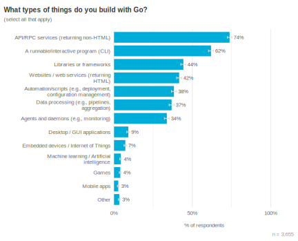

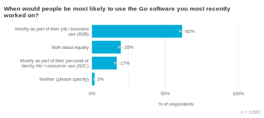

Respondents were about equally likely to say this was the first time they’ve responded to the Go Developer Survey vs. saying they had taken this survey before. There is a meaningful difference between people who learned about this survey via the Go blog, where 61% reported taking this survey previously, vs. people who learned about this survey via a notification in VS Code, where only 31% said they’ve previously taken this survey. We don’t expect people to perfectly recall every survey they’ve responded to on the internet, but this gives us some confidence that we’re hearing from a balanced mix of new and repeat respondents with each survey. Further, this tells us our combination of social media posts and random in-editor sampling are both necessary for hearing from a diverse set of Go developers.

​	受访者表示这是他们第一次回复 Go 开发者调查的可能性与表示他们之前参加过此调查的可能性大致相同。通过 Go 博客了解此调查的人员与通过 VS Code 中的通知了解此调查的人员之间存在有意义的差异，前者有 61% 的人表示之前参加过此调查，而后者只有 31% 的人表示之前参加过此调查。我们不指望人们能完美地回忆起他们在互联网上回复过的每项调查，但这让我们确信，我们每次调查都能听到来自新老受访者的平衡反馈。此外，这告诉我们，我们的社交媒体帖子和随机编辑器内抽样相结合对于听取来自各种 Go 开发者的反馈都是必要的。

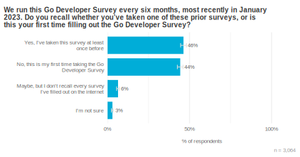

## 公司人口统计信息 Firmographics 

Respondents to this survey reported working at a mix of different organizations, from thousand-person-plus enterprises (27%), to midsize businesses (25%) and smaller organizations with < 100 employees (44%). About half of respondents work in the technology industry (50%), a large increase over the next most-common industry—financial services—at 13%.

​	此调查的受访者表示他们供职于各种不同的组织，从拥有上千名员工的大型企业（27%），到拥有数百名员工的中型企业（25%），再到拥有不到 100 名员工的小型组织（44%）。大约一半的受访者供职于技术行业（50%），比排名第二的金融服务行业（13%）大幅增加。

This is statistically unchanged from the past few Go Developer Surveys—we continue to hear from people in different countries and in organizations of different sizes and industries at consistent rates year after year.

​	从过去几项 Go 开发者调查来看，这一统计数据基本没有变化——我们持续听到来自不同国家/地区、不同规模和行业组织的人员的反馈，年复一年，反馈率保持稳定。

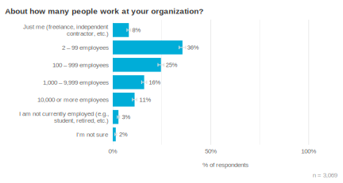

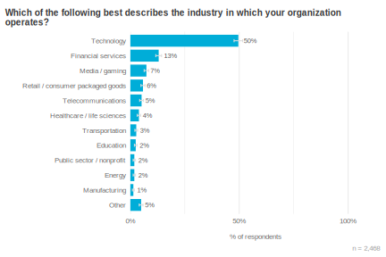

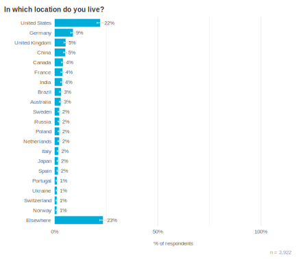

## 方法论 Methodology 

Most survey respondents “self-selected” to take this survey, meaning they found it on the Go blog or other social Go channels. A potential problem with this approach is that people who don’t follow these channels are less likely to learn about the survey, and might respond differently than people who do closely follow them. About 40% of respondents were randomly sampled, meaning they responded to the survey after seeing a prompt for it in VS Code (everyone using the VS Code Go plugin between mid-July – mid-August 2023 had a 10% of receiving this random prompt). This randomly sampled group helps us generalize these findings to the larger community of Go developers.

​	大多数调查受访者“自我选择”参加此调查，这意味着他们在 Go 博客或其他社交 Go 频道上找到了它。这种方法的一个潜在问题是，不关注这些频道的用户不太可能了解此调查，并且可能与密切关注这些频道的用户做出不同的回应。大约 40% 的受访者是随机抽样的，这意味着他们在 VS Code 中看到提示后才回复调查（2023 年 7 月中旬至 8 月中旬期间使用 VS Code Go 插件的每个人都有 10% 的几率收到此随机提示）。这个随机抽样的群体帮助我们将这些调查结果推广到更大的 Go 开发者社区。

### 如何解读这些结果 How to read these results 

Throughout this report we use charts of survey responses to provide supporting evidence for our findings. All of these charts use a similar format. The title is the exact question that survey respondents saw. Unless otherwise noted, questions were multiple choice and participants could only select a single response choice; each chart’s subtitle will tell the reader if the question allowed multiple response choices or was an open-ended text box instead of a multiple choice question. For charts of open-ended text responses, a Go team member read and manually categorized the responses. Many open-ended questions elicited a wide variety of responses; to keep the chart sizes reasonable, we condensed them to a maximum of the top 10 themes, with additional themes all grouped under “Other”. The percentage labels shown in charts are rounded to the nearest integer (e.g., 1.4% and 0.8% will both be displayed as 1%), but the length of each bar and row ordering are based on the unrounded values.

​	在整份报告中，我们使用调查回复图表来为我们的发现提供支持性证据。所有这些图表都使用类似的格式。标题是调查受访者看到的确切问题。除非另有说明，否则问题都是多选题，参与者只能选择一个回复选项；每个图表的副标题会告诉读者该问题是否允许多个回复选项，或者是否是一个开放式文本框而不是多选题。对于开放式文本回复的图表，Go 团队成员会阅读并手动对回复进行分类。许多开放式问题引出了各种各样的回复；为了使图表大小合理，我们将它们浓缩为最多 10 个主题，其他所有主题都归类在“其他”之下。图表中显示的百分比标签四舍五入到最接近的整数（例如，1.4% 和 0.8% 都将显示为 1%），但每条柱状图的长度和行顺序都基于未四舍五入的值。

To help readers understand the weight of evidence underlying each finding, we included error bars showing the 95% [confidence interval](https://en.wikipedia.org/wiki/Confidence_interval) for responses; narrower bars indicate increased confidence. Sometimes two or more responses have overlapping error bars, which means the relative order of those responses is not statistically meaningful (i.e., the responses are effectively tied). The lower right of each chart shows the number of people whose responses are included in the chart, in the form “n = [number of respondents]”.

​	为了帮助读者理解每项调查结果背后的证据权重，我们加入了误差线，显示了 95% 置信区间；误差线越窄，置信度越高。有时，两个或多个响应的误差线会重叠，这意味着这些响应的相对顺序在统计上没有意义（即这些响应实际上是平局）。每个图表右下角显示了图表中包含的响应者人数，格式为“n = [响应者人数]”。

We include select quotes from respondents to help clarify many of our findings. These quotes include the length of times the respondent has used Go. If the respondent said they use Go at work, we refer to them as a “professional Go developer”; if they don’t use Go at work but do use Go for open-source development, we refer to them as an “open-source Go developer”.

​	我们加入了部分受访者的引语，以帮助阐明我们的许多调查结果。这些引语包括受访者使用 Go 的时长。如果受访者表示他们在工作中使用 Go，我们称他们为“专业 Go 开发者”；如果他们不在工作中使用 Go，但确实将 Go 用于开源开发，我们称他们为“开源 Go 开发者”。

## 结束 Closing 

The final question on our survey always asks respondents whether there’s anything else they’d like to share with us about Go. The most common piece of feedback people provide is “thanks!”, and this year was no different (33%). In terms of requested language improvements, we see a three-way statistical tie between improved expressivity (12%), improved error handling (12%), and improved type safety or reliability (9%). Respondents had a variety of ideas for improving expressivity, with the general trend of this feedback being “Here’s a specific thing I write frequently, and I wish it were easier to express this in Go”. The issues with error handling continue to be complaints about the verbosity of this code today, while feedback about type safety most commonly touched on [sum types](https://en.wikipedia.org/wiki/Tagged_union). This type of high-level feedback is extremely useful when the Go team tries to plan focus areas for the coming year, as it tells us general directions in which the community is hoping to steer the ecosystem.

​	我们调查中的最后一个问题总是询问受访者是否还有其他想与我们分享的有关 Go 的内容。人们提供的最常见的反馈是“谢谢！”，今年也不例外（33%）。在请求的语言改进方面，我们看到改进表达力（12%）、改进错误处理（12%）和改进类型安全或可靠性（9%）之间存在三方统计上的联系。受访者提出了各种改进表达力的想法，这种反馈的总体趋势是“这是一件我经常写的事情，我希望用 Go 更容易表达”。有关错误处理的问题仍然是对当今此类代码冗长的抱怨，而有关类型安全性的反馈最常涉及总类型。当 Go 团队尝试为来年规划重点领域时，这种高级反馈非常有用，因为它告诉我们社区希望引导生态系统发展的总体方向。

> “I know about Go’s attitude towards simplicity and I appreciate it. I just wish there [were] slightly more features. For me it would be better error handling (not exceptions though), and maybe some common creature comforts like map/reduce/filter and ternary operators. Anything not too obscure that’ll save me some ‘if’ statements.” *— Professional Go developer w/ 1 – 2 years of experience*
>
> ​	“我知道 Go 对简单性的态度，并且我赞赏它。我只是希望有更多一些功能。对我来说，更好的错误处理（不是异常）会更好，也许还有一些常见的便利功能，如映射/归约/筛选和三元运算符。任何不太晦涩的东西都可以帮我节省一些“if”语句。”——具有 1-2 年经验的专业 Go 开发人员

> “Please keep Go in line with the long term values Go established so long ago — language and library stability. […] It is an environment I can rely on to not break my code after 2 or 3 years. For that, thank you very much.” *— Professional Go developer w/ 10+ years of experience*
>
> ​	“请让 Go 与 Go 很久以前确立的长期价值观保持一致——语言和库的稳定性。[…] 这是一个我可以依靠的环境，不会在 2 或 3 年后破坏我的代码。为此，非常感谢。”——具有 10 年以上经验的专业 Go 开发人员

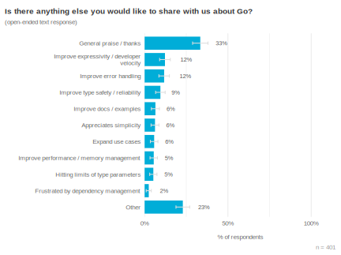

That’s all for this bi-annual iteration of the Go Developer Survey. Thanks to everyone who shared their feedback about Go—we have immense gratitude for taking your time to help shape Go’s future, and we hope you see some of your own feedback reflected in this report. 

​	这是 Go 开发者调查的两年一次迭代的全部内容。感谢所有分享他们对 Go 的反馈的人——我们非常感谢您抽出时间帮助塑造 Go 的未来，我们希望您在报告中看到您自己的一些反馈。🩵

— Todd (on behalf of the Go team at Google)
—— Todd（代表 Google 的 Go 团队）