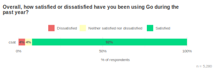

+++
title = "Go开发者调查2023年第一季度结果"
date = 2023-07-12T20:40:48+08:00
weight = 95
type = "docs"
description = ""
isCJKLanguage = true
draft = false

+++

# Go Developer Survey 2023 Q1 Results - Go开发者调查2023年第一季度结果

https://go.dev/blog/survey2023-q1-results

Alice Merrick
11 May 2023

艾丽丝·梅里克 2023年5月11日

## 感谢参与者带来的洞察！ Thank you respondents for bringing us these insights!

We’re excited to share with you the results of the 2023 January edition of the Go Developer Survey. Thank you to the 5,844 respondents who shared with us how they’re using Go, their biggest challenges in using Go, and their top priorities for future improvements. These results help the Go team focus our efforts on areas that matter most to the community, and we hope these insights also help inform others who contribute to and support the Go ecosystem.

​	我们非常高兴与您分享2023年1月版Go开发者调查的结果。感谢5844名参与者与我们分享他们如何使用Go，使用Go的最大挑战以及他们未来改进的重点。这些结果帮助Go团队将努力集中在对社区最重要的领域，并且我们希望这些洞察还能帮助其他为Go生态系统做出贡献和支持的人员。

### 主要发现 Key findings

- **Novice Go developers are interested in web development**. We introduced a new segmentation this year based on self-identified experience levels. Novices expressed some interesting differences from other experience levels. Most notably they showed greater interest in using Go for web development.
- **新手Go开发者对Web开发感兴趣**。今年，我们基于自我认知的经验水平引入了一个新的分割方法。新手在一些方面与其他经验水平存在一些有趣的差异。最显著的是，他们对将Go用于Web开发表现出更大的兴趣。
- **Error handling and learning are respondents’ top challenges**. Historically, lack of generics was the biggest challenge to using Go, but since the introduction of generics, we’ve seen comments about generics decline. Comments about error handling (with respect to readability and verbosity) and difficulty learning best practices are now the most commonly reported challenges.
- **错误处理和学习是受访者的主要挑战**。历史上，缺乏泛型是使用Go的最大挑战，但自从引入泛型以来，我们已经看到关于泛型的评论减少了。关于错误处理（关于可读性和冗长性）以及学习最佳实践的困难现在是最常报告的挑战。
- **An optimization guide was the most valued way to improve Go’s performance**. When asked how they would spend resources on various improvements to Go’s compile and runtime, respondents spent the most on an optimization guide rather than specific performance improvements, demonstrating how much documentation is valued in this area.
- **优化指南是改进Go性能的最有价值的方式**。当被问及他们如何在改进Go的编译和运行时方面分配资源时，受访者在优化指南上花费的时间最多，而不是特定的性能改进，这显示出文档在这个领域的价值有多大。
- **Managing dependencies and versioning are the top challenges for open source Go module maintainers**. Open source module maintainers face challenges in keeping their dependencies up to date and avoiding disruptions due to versioning and breaking changes. This is an area we’ll explore further to help maintainers provide a stable and healthy ecosystem.
- **管理依赖和版本控制是开源Go模块维护者的主要挑战**。开源模块维护者在保持其依赖项最新并避免由于版本控制和破坏性变更而造成的中断方面面临挑战。这是一个我们将进一步探索的领域，以帮助维护者提供稳定和健康的生态系统。

### 如何阅读这些结果 How to read these results

Throughout this post, we use charts of survey responses to provide supporting evidence for our findings. All of these charts use a similar format. The title is the exact question that survey respondents saw. Unless otherwise noted, questions were multiple choice and participants could only select a single response choice; each chart’s subtitle will tell you if the question allowed multiple response choices or was an open-ended text box instead of a multiple choice question. For charts of open-ended text responses, a Go team member read and manually categorized all of the responses. Many open-ended questions elicited a wide variety of responses; to keep the chart sizes reasonable, we condensed them to the top 10-15 themes, with additional themes all grouped under “Other”. We also included a category for “None” where applicable.

​	在本文中，我们使用调查回答的图表来支持我们的发现。所有这些图表都使用类似的格式。标题是调查受访者看到的确切问题。除非另有说明，问题是多选的，参与者只能选择一个响应选项；每个图表的副标题将告诉您问题是否允许多个响应选择，或者是一个开放式的文本框，而不是多选问题。对于开放式文本回答的图表，Go团队成员阅读并手动分类了所有回答。许多开放式问题引发了各种各样的回答；为了保持图表的大小合理，我们将它们压缩到前10-15个主题，并将其他主题都分组到“其他”下。我们还包括一个“无”类别，如果适用的话。

To help readers understand the weight of evidence underlying each finding, we include error bars showing the 95% confidence interval for responses; narrower bars indicate increased confidence. Sometimes two or more responses have overlapping error bars, which means the relative order of those responses is not statistically meaningful (i.e., the responses are effectively tied). The lower right of each chart shows the number of people whose responses are included in the chart, in the form “*n = [number of respondents]*”.

​	为了帮助读者理解每个发现背后的证据权重，我们包含了显示响应的95%置信区间的误差线；更窄的线表示增加的置信度。有时候两个或更多的响应具有重叠的误差线，这意味着这些响应的相对顺序在统计上没有意义（即，响应实际上是并列的）。每个图表的右下角显示了包含在图表中的人数，以“*n = [受访者数量]*”的形式表示。

### 方法说明 A note on methodology

Most survey respondents “self-selected” to take the survey by accessing it through a link on [the Go blog](https://go.dev/blog), [@golang on Twitter](https://twitter.com/golang), or other social Go channels. People who don’t follow these channels might respond differently from people who *do* closely follow them. About a quarter of respondents were randomly sampled, meaning they responded to the survey after seeing a prompt for it in VS Code (everyone using the VS Code Go plugin between Jan 18 - Feb 8, 2023 had a 10% chance of receiving this random prompt). This randomly sampled group helps us generalize these findings to the larger community of Go developers. Most survey questions showed no meaningful difference between these groups, but in the few cases with important differences, readers will see charts that break down responses into “Random sample” and “Self-selected” groups.

​	大多数调查受访者是通过在[Go博客](https://go.dev/blog)上的链接，[@golang在Twitter上](https://twitter.com/golang)或其他社交Go渠道上访问调查链接来“自行选择”参与调查的。不关注这些渠道的人可能会与密切关注这些渠道的人不同。约四分之一的受访者是随机抽样的，这意味着他们在VS Code中看到提示后回答了调查（在2023年1月18日至2月8日之间使用VS Code Go插件的所有人都有10%的机会收到这个随机提示）。这个随机抽样的群体有助于我们将这些发现推广到更大的Go开发者社区中。大多数调查问题在这些组之间没有显示出有意义的差异，但在少数情况下存在重要差异，读者将看到将响应分解为“随机抽样”和“自行选择”组的图表。

## 更详细地观察不同组的受访者 Taking a closer look at different groups of respondents

Our respondent demographics did not change significantly from [our last survey](https://go.dev/blog/survey2022-q2-results). Consistent with previous cycles, Go is primarily used in the tech industry, and about 80% of respondents said they program in Go at work. Overall, survey respondents tended to be satisfied with Go over the past year, with 92% saying they were somewhat or very satisfied.

​	我们的受访者人口统计与[上一次调查](https://go.dev/blog/survey2022-q2-results)没有显著变化。与以往周期一致，Go主要用于技术行业，约80%的受访者表示他们在工作中使用Go进行编程。总体而言，调查受访者在过去一年中对Go的满意度较高，有92%的人表示他们在某种程度上或非常满意。

 

Our respondents spend a lot of time programming in Go compared to other languages. About a third of respondents even maintain an open source Go module. We recognize that our survey audience is made up of those who successfully adopted Go, use Go often, and are mostly satisfied using Go. To identify potential gaps in meeting community needs, we look at different sub-groups of respondents to see how they might be using Go differently or have different priorities. For example, this year we looked at how responses differ between different sample sources (i.e., the Go Blog or through the VS Code plugin), different job roles, organization sizes, and levels of Go experience. The most interesting differences were between experience levels.

​	与其他编程语言相比，我们的受访者在Go编程上花费了很多时间。大约三分之一的受访者甚至维护着一个开源的Go模块。我们认识到我们的调查对象主要是那些成功采用Go的人，经常使用Go，并且在使用Go时大多数人都感到满意。为了确定满足社区需求的潜在差距，我们查看不同子组的受访者，以了解他们如何可能以不同的方式使用Go或有不同的优先事项。例如，今年我们研究了不同样本来源（即Go博客还是通过VS Code插件）、不同的工作角色、组织规模以及Go经验水平之间的回答差异。最有趣的差异是在经验水平之间。

## 对新手受访者的洞察 Insights from novice respondents

Previously, we used how much time (in months / years) respondents have used Go as a proxy to gain insight into how results vary between levels of experience. This year we experimented with a new segmentation question, “What is your level of experience with Go?”, to see if self-identification might be a more useful way of examining Go experience than lumping together various intervals of time. Since categorical terms like “novice” or “expert” might vary from person to person, we provided a description to help make these buckets more objective. The options were:

​	以前，我们将受访者使用Go的时间（以月/年为单位）作为一种方法，以了解结果在不同经验水平之间的差异。今年，我们尝试了一个新的分割问题：“您对Go的经验水平是什么？”以看自我认知是否可能是一种更有用的检查Go经验的方式，而不是将不同的时间间隔汇集在一起。由于类似“新手”或“专家”这样的分类术语可能因人而异，我们提供了一个描述，以帮助使这些桶更加客观。选项包括：

 

- Awareness: I’m aware of Go, but could not write a simple Go program without assistance
- Novice: I can complete simple programming projects in Go, possibly with assistance
- Intermediate: I can complete significant programming projects in Go with some assistance
- Advanced: I can complete significant programming projects in Go without assistance
- Expert: I can provide guidance, troubleshoot, and answer questions related to Go from other engineers
- 意识：我知道Go，但没有办法在没有帮助的情况下编写一个简单的Go程序
- 新手：我可以完成简单的Go编程项目，可能需要帮助
- 中级：我可以在某些帮助下完成重要的Go编程项目
- 高级：我可以在没有帮助的情况下完成重要的Go编程项目
- 专家：我可以为其他工程师提供关于Go的指导、故障排除和解答问题

We found a moderate correlation (⍴ = .66) between how long respondents had been using Go and their self-identified experience level. This means that the experience level scale, although similar to the time scale, may give us some new insights into how respondents differ by experience. For instance, the proportion of time that a respondent spends writing in Go compared to how much time they spend writing in other languages is more strongly correlated with their self-identified experience level than with how long they’ve been using Go.

​	我们发现受访者使用Go的时间与他们自我认知的经验水平之间存在适度的相关性（⍴ = .66）。这意味着，尽管经验水平尺度类似于时间尺度，但它可能为我们提供一些新的洞察，了解受访者如何因经验而异。例如，受访者在编写Go方面所花费的时间占比与他们自我认知的经验水平之间的相关性要比与他们使用Go的时间有关的相关性更强。

In analyses where we use this segmentation we typically exclude the Awareness category since they wouldn’t be considered to have the experience necessary to answer the question and only represented about 1% of respondents.

​	在我们使用这种分割进行分析时，通常会排除“意识”类别，因为他们被认为没有回答这个问题所需的经验，并且只代表了约1%的受访者。

### 新手受访者更有可能喜欢Windows，而不同经验水平的受访者喜欢的编辑器和开发操作系统 Novice respondents are more likely to prefer Windows than more experienced respondents

Our randomly sampled group had a higher proportion of novice respondents than the self-selected group, suggesting that there are more new Gophers out there that we don’t tend to hear from as often. Because they are sampled through the Go VS Code plugin, we might expect this group to be more likely to prefer using VS Code or to develop on Windows more than other experience levels. While this is true, novices are also more likely to develop on Windows than other experience levels, regardless of whether they responded through the VS Code plugin.

​	我们的随机抽样群体中的新手受访者比自行选择的群体中的比例要高，这表明有更多的新的Go开发者，我们不常常从他们那里听到。因为他们通过Go VS Code插件进行抽样，我们可能会预期这个群体更有可能喜欢使用VS Code或在Windows上开发，而不同经验水平的受访者都有可能如此。虽然这是真的，但不管他们是否通过VS Code插件回答，新手也更有可能在Windows上进行开发，而不同经验水平的受访者也是如此。

  

There could be a number of reasons why we don’t see higher proportions of Windows users at higher experience levels. For example, Windows users may be more likely to experience difficulties and stop using Go, or there could be wider trends in OS usage that have nothing to do with Go. In any case, we should include more Windows users in future research around getting started with Go to make sure we provide an inclusive onboarding experience.

​	为什么在更高的经验水平下我们看不到更高比例的Windows用户可能有很多原因。例如，Windows用户可能更有可能遇到困难并停止使用Go，或者可能存在与Go无关的操作系统使用的更广泛的趋势。无论如何，我们在未来关于入门Go的研究中应该包括更多的Windows用户，以确保我们提供一个包容性的入门体验。

### 不同经验水平的使用情况以及他们的其他兴趣领域 How different experience levels currently use Go (and other areas where they would like to)

 

According to how respondents use Go right now, more experienced Gophers tend to be using Go for more types of applications. For example, the average expert used Go in at least four areas while the average novice used Go in only two areas. That’s why there are large differences in the proportion of novices and experts using Go for each use case. The top two uses, API / RPC services and CLIs, however, are the top use cases across all experience levels.

​	根据受访者当前使用Go的情况，经验丰富的Gophers倾向于在更多类型的应用程序中使用Go。例如，平均专家至少在四个领域使用Go，而平均新手仅在两个领域使用Go。这就是为什么在每种用例中，新手和专家使用Go的比例存在很大差异的原因。然而，API / RPC服务和命令行界面（CLIs）是所有经验水平的顶级用例。

We see more interesting trends for GUIs and Website / Web services (returning HTML). All experience levels used Go for Desktop / GUI apps at about the same rate. This gives us evidence the desire for GUIs isn’t just coming from new Gophers looking for a fun starter project, but from across the experience spectrum.

​	我们在GUI和网站/网络服务（返回HTML）方面看到了更多有趣的趋势。所有经验水平的开发者在桌面/图形用户界面应用程序方面的使用率都差不多。这证明了对GUI的渴望不仅仅来自寻找有趣的入门项目的新Gophers，而是来自各种经验水平的开发者。

Websites / services returning HTML show a similar trend. One explanation could be that this is a common use case early in someone’s Go journey (since it is in the top 3 most common for novices), or that novices are more likely to be doing work on websites or web services returning HTML. Later in the survey, we asked respondents, “In which area (if any) are you not using Go, but would most like to?” Although many respondents (29%) said they already use Go everywhere they would like to, the top two areas for expanding usage were GUI / Desktop and AI / ML applications. This was consistent across groups at different organization sizes and job roles, but not experience levels. The number one area where novices would like to use Go more is for websites / web services returning HTML.

​	返回HTML的网站/服务显示出类似的趋势。一个解释可能是这是一个某人在Go之旅早期的常见用例（因为对于新手来说，它是前三个最常见的用例之一），或者新手更有可能在网站或返回HTML的网络服务上工作。在调查后期，我们问受访者：“在哪个领域（如果有的话）您没有使用Go，但最希望使用？”尽管许多受访者（29%）表示他们已经在他们希望的所有地方都使用了Go，但扩展使用的前两个领域分别是GUI / 桌面和AI / ML应用程序。这在不同组织规模和工作角色的不同群体中是一致的，但在不同经验水平之间不一致。新手最希望在哪个领域更多地使用Go是在网站/返回HTML的网络服务方面。

In an open text question, 12 out of 29 respondents who said they would like to use Go for websites / web services returning HTML said they were blocked because other languages had frameworks to better support this use case. It could be that more experienced Go developers don’t try or expect to use Go for this use case when other languages already have frameworks that meet those needs. As one respondent put it,

​	在一个开放式文本问题中，29名表示希望在网站/返回HTML的网络服务方面使用Go的受访者中，有12名表示他们受阻于其他编程语言具有更好支持此用例的框架。可能更有经验的Go开发者不会尝试或期望在其他编程语言已经具有满足这些需求的框架的情况下使用Go进行这种用例。正如一名受访者所说，

> “It’s usually easier to accomplish this in other languages such as PHP or Ruby. Partly due to the excellent frameworks that exist in those languages.”
>
> “通常在其他编程语言（如PHP或Ruby）中更容易实现这一点。部分原因是这些语言中存在着出色的框架。”

Another contributing explanation for novices’ interest in web development may be related to their usage of JavaScript / TypeScript. Novices spend more of their time writing in JavaScript / TypeScript than more experienced respondents. The higher interest in web could have something to do with what novice respondents currently work on in other languages or could indicate a general interest in web technologies. In the future we’d like to learn more about this use case and how we can help new Gophers get started using Go in areas most useful to them.

​	新手对Web开发的兴趣可能还与他们使用JavaScript / TypeScript的情况有关。新手在编写JavaScript / TypeScript方面花费的时间比经验丰富的受访者多。对Web的更高兴趣可能与新手受访者当前在其他编程语言中工作的内容有关，或者可能表明他们对Web技术有一般性的兴趣。在将来，我们希望更多地了解这种用例，以及如何帮助新的Gophers开始在最有用的领域使用Go。

## 受访者面临的一系列挑战 Respondents face a long tail of challenges

Every survey cycle we ask respondents what their biggest challenge is when using Go. Historically, lack of generics was the most commonly cited challenge—for example, it was the most common response in 2020, and mentioned by about 18% of respondents. Since the introduction of generics, error handling (12%) and learning / best practices / docs (11%) have emerged at the front of a long tail of issues rather than any single issue becoming more frequent.

​	每个调查周期，我们都会询问受访者在使用Go时最大的挑战是什么。从历史上看，缺乏泛型一直是最常见的挑战，例如，它是2020年最常见的回答，在受访者中提到约18%。自从引入了泛型以来，错误处理（12%）和学习/最佳实践/文档（11%）已经成为问题长尾的前沿，而不是任何单个问题变得更加频繁。

### 为什么错误处理如此具有挑战性？ Why is error handling such a challenge?

Feedback on error handling often describes the problem as verbosity. On the surface, this could reflect that writing repetitive code is boring or annoying. More than just an annoyance of writing boilerplate, however, error handling may also impact respondents’ ability to debug.

​	有关错误处理的反馈通常描述了冗长性问题。表面上看，这可能反映出编写重复代码是无聊或烦人的。然而，错误处理可能不仅仅是编写样板代码的烦恼，还可能影响到受访者进行调试的能力。

One respondent succinctly illustrated this issue:

​	一位受访者简洁地阐述了这个问题：

> “Error handling creates clutter and easily masks problems if not done correctly (no stack traces)”
>
> “错误处理会产生混乱，并且如果没有正确处理（没有堆栈跟踪），很容易掩盖问题。”

### 学习最佳实践的挣扎 The struggle to learn best practices

> “Using Go effectively. Easy to learn, hard to master.”
>
> “有效使用Go。易学难精。”

We’ve heard that Go is easy to learn, and a [previous survey showed that over 70%](https://go.dev/blog/survey2020-results#TOC_6.2) of respondents feel productive using Go within their first year, but learning Go best practices came up as one of the biggest challenges to using Go. Respondents this year told us that best practices around **code structure** and **recommended tools and libraries** aren’t well documented, creating challenges for beginners and teams to keep code consistent. Learning to write idiomatic Go can be especially challenging to those coming from other programming paradigms. Respondents who were more experienced with Go attested that when developers don’t follow best practices for writing idiomatic Go, it hurts the consistency and quality of shared projects.

​	我们听说Go很容易学习，而且[之前的一项调查显示，超过70%](https://go.dev/blog/survey2020-results#TOC_6.2)的受访者在第一年内使用Go感到非常有成效，但学习Go的最佳实践被认为是使用Go的最大挑战之一。今年的受访者告诉我们，有关**代码结构**和**推荐工具和库**的最佳实践在文档中没有很好的记录，这给初学者和团队保持代码一致性带来了挑战。学习编写符合习惯的Go代码对于那些来自其他编程范 paradigm 的开发者来说可能尤为具有挑战性。对于那些对Go有更多经验的受访者来说，当开发者不遵循编写符合习惯的Go的最佳实践时，会影响到共享项目的一致性和质量。

## 模块维护者面临的最大挑战 The biggest challenges for module maintainers

Go module maintainers are critical members of the Go community, helping to grow and sustain the health of our package ecosystem. This year we plan to conduct research with module maintainers to identify opportunities to support stability and growth of the package ecosystem and help grow Go adoption within organizations. To inform this research, we introduced a question on the survey to get an idea of the current top challenges for open source maintainers.

​	Go模块维护者是Go社区的重要成员，他们帮助增长和维护我们的软件包生态系统的健康。今年，我们计划与模块维护者进行研究，以确定支持包生态系统的稳定性和增长的机会，并帮助在组织内推广Go的采用。为了为这项研究提供信息，我们在调查中引入了一个问题，以了解开源维护者当前面临的主要挑战。

The top challenges for maintainers are keeping dependencies up to date and difficulties around versioning, including avoiding, identifying, or knowing when to introduce breaking changes. These insights, along with the results of future research, will help inform strategies to support maintainers in keeping the Go ecosystem stable and secure.

​	维护者面临的最大挑战是保持依赖的更新，并围绕版本控制遇到困难，包括避免、识别或知道何时引入破坏性变更。这些见解，以及未来研究的结果，将有助于制定策略，支持维护者保持Go生态系统的稳定性和安全性。

## 部署Go代码时面临的最大挑战 The biggest challenges when deploying Go code

This year we asked what respondents’ biggest challenge was when deploying Go code. Being “easy to deploy” is often cited as a reason for using Go, but we received conflicting feedback during a recent study that prompted us to explore potential issues when deploying Go code. In our open text responses, by far the most common theme was difficulty cross-compiling with cgo (16%), and support for WebAssembly or WASI was a distant second (7%).

​	今年我们问受访者在部署Go代码时最大的挑战是什么。通常将“易于部署”作为使用Go的原因之一，但在最近的一项研究中，我们收到了矛盾的反馈，这促使我们探索在部署Go代码时可能出现的问题。在我们的开放式文本回答中，远远最常见的主题是使用cgo进行交叉编译的困难（16%），而对WebAssembly或WASI的支持是第二（7%）。

## 社区优先事项：受访者最想要的 Community priorities: what respondents want most

This year we used a prioritization question we’ve used in previous surveys based on the buy-a-feature method of prioritization. Respondents were given 10 “gophercoins” and asked to distribute them to areas where they want to see improvements. Respondents were randomly assigned one of three possible questions, each containing seven items related to tooling, security, or compiler & runtime. This approach allowed us to ask about items relevant to each focus area without overburdening respondents with three sets of cognitively-demanding prioritization questions.

​	今年，我们使用了一种基于买特性方法的优先选择问题，这是我们在以前的调查中使用过的问题。受访者获得了10个“地鼠币”，并被要求将它们分配到他们想要改进的领域。受访者被随机分配了三个可能问题中的一个，每个问题都包含与工具、安全性或编译器和运行时相关的七个项目。这种方法使我们能够询问与每个焦点领域相关的项目，而不会让受访者在认知负担较大的优先选择问题上负担过重。

At the end of the exercise, we gave respondents an open text prompt to tell us about any area they thought should be the Go team’s top priority in the next year, regardless of which items they spent their coins on. For example, if a respondent was shown the security section, but they didn’t care all that much about security, they still had the opportunity to tell us that in the open text area.

​	在练习结束时，我们为受访者提供了一个开放式文本提示，告诉我们在未来一年中，他们认为哪个领域应该是Go团队的首要任务，而不管他们将硬币用在哪些项目上。例如，如果一个受访者看到了安全性部分，但他们并不太关心安全性，他们仍然有机会在开放式文本区域告诉我们这一点。

### 安全性 Security

We chose these items to test assumptions we held on the relative importance of security practices to the community. These were the seven items as described to participants:

​	我们选择了这些项目来测试我们对社区中安全性实践相对重要性的假设。这是向受访者描述这七个项目的方式： 

- pkg.go.dev identifies packages that are poorly maintained (e.g., unresponsive to issues, fail to keep their dependencies updated, remain vulnerable for long periods of time)
- pkg.go.dev识别了那些维护不良的软件包（例如，对问题不作响应，未能更新其依赖项，长时间保持易受攻击状态的软件包）
- pkg.go.dev identifies packages that make breaking API changes (i.e., requires fixing uses of those APIs when upgrading those packages to newer versions)
- pkg.go.dev识别了那些进行破坏性API更改的软件包（即，升级这些软件包到更高版本时需要修复对这些API的使用）
- Support for suppressing vulnerabilities in govulncheck
- 对govulncheck中漏洞进行抑制的支持
- A tool to track how sensitive data flows through a Go program (detect PII leaks)
- 跟踪敏感数据如何在Go程序中流动的工具（检测PII泄漏）
- A security best practices guide (e.g., how to choose and update dependencies; how to set up fuzzing, vulnerability checking, and thread sanitizer; how to use crypto)
- 安全最佳实践指南（例如，如何选择和更新依赖项；如何设置模糊测试、漏洞检查和线程分析器；如何使用加密）
- Secure-by-default Web & SQL libraries that help users avoid introducing vulnerabilities in web server code
- 通过默认安全的Web和SQL库，帮助用户在Web服务器代码中避免引入漏洞
- FIPS-140-compliant cryptographic libraries
- 符合FIPS-140的加密库

The highest funded security feature was for web & SQL libraries to be secure by default to avoid introducing vulnerabilities in web server code, but the top four features all relate to avoiding the introduction of vulnerabilities. The desire for secure defaults is consistent with previous security research that showed developers want to “shift left” on security: development teams often don’t have time or resources to spend on addressing security issues, and thus value tooling that reduces the likelihood of introducing them in the first place. The second most common item was a security best practices guide, highlighting the high value of best practices documentation compared to new tools or features to the majority of respondents.

​	安全功能中投资最多的是默认情况下安全的Web和SQL库，以避免在Web服务器代码中引入漏洞，但前四个功能都与避免引入漏洞有关。对安全性的需求与之前的安全研究一致，该研究显示开发者希望在安全性方面“向左移动”：开发团队通常没有时间或资源来解决安全问题，因此他们看重能够在第一时间就减少引入漏洞的工具。第二常见的项目是安全最佳实践指南，强调了对最佳实践文档的高价值，与对大多数受访者来说，比起新的工具或功能，最佳实践文档更有价值。

### 工具 Tools

Items we included in this question were inspired by feedback from VS Code plugin users. We wanted to know which tooling and IDE improvements would be most helpful to a wider audience who may use other IDEs or editors.

​	我们在这个问题中包含的项目受到了来自VS Code插件用户的反馈的启发。我们想知道哪些工具和IDE改进对于更广泛的可能使用其他IDE或编辑器的受众会更有帮助。 

- Better refactoring tools (e.g., support for automatic code transformation: renamings, function extraction, API migration, etc.)
- Better support for testing in your code editor/IDE (e.g., robust and scalable Test Explorer UI, 3rd party test framework, subtest support, code coverage)
- Better support for working on multiple modules in your code editor/IDE (e.g., editing modules A and B, where module A depends on module B)
- Dependency insights in pkg.go.dev (e.g., vulnerabilities, breaking changes, scorecards)
- Dependency insights in your code editor/IDE (e.g., vulnerabilities, breaking changes, scorecards)
- Support for publishing modules with new module paths (e.g., repo ownership handoff)
- Support finding types that implement an interface & interfaces implemented by a type in your code editor/IDE
- 更好的重构工具（例如，支持自动代码转换：重命名、函数提取、API迁移等）
- 在代码编辑器/IDE中更好地支持测试（例如，稳健可伸缩的测试资源管理器UI、第三方测试框架、子测试支持、代码覆盖率）
- 在代码编辑器/IDE中更好地支持在多个模块上工作（例如，在依赖模块A和模块B上进行编辑，其中模块A依赖于模块B）
- 在pkg.go.dev中的依赖洞察（例如，漏洞、破坏性变更、得分卡）
- 在代码编辑器/IDE中的依赖洞察（例如，漏洞、破坏性变更、得分卡）
- 支持使用新模块路径发布模块（例如，仓库所有权的移交）
- 在代码编辑器/IDE中查找实现接口的类型和实现类型的接口的支持

The most funded editor feature was *support for finding types that implement an interface and interfaces implemented by a type* and *refactoring tools*. We also saw an interesting difference in how respondents spent their gophercoins according to preferred editor usage. Most notably, VS Code users spent more gophercoins on refactoring than GoLand users, suggesting that automatic code transformations are currently better supported in GoLand than in VS Code.

​	在编辑器功能中，投入最多的是*支持在代码编辑器/IDE中查找实现接口的类型和实现类型的接口*以及*重构工具*。我们还注意到了受访者根据偏好的编辑器使用方式在哪些项目上投入了他们的gophercoin。值得注意的是，VS Code用户在重构方面花费了更多的gophercoin，比GoLand用户花费更多，这表明自动代码转换在GoLand中得到了比在VS Code中更好的支持。

### 编译器和运行时 Compiler & runtime

Our key question for this section was to determine whether respondents wanted better performance by default, better optimization tooling, or just a better understanding of how to write performant Go code.

​	我们在这个部分的关键问题是确定受访者是希望通过默认方式获得更好的性能，还是更好的优化工具，还是仅仅想要更好地了解如何编写高性能的Go代码。 

- Reduce compute costs
- Reduce memory use
- Reduce binary size
- Reduce build times
- Better performance debugging tools
- An optimization guide (how to improve performance and reduce costs, covering Go’s implementation and performance debugging tools)
- Better support for using cgo when cross-compiling
- 减少计算成本
- 减少内存使用
- 减少二进制文件大小
- 减少构建时间
- 更好的性能调试工具
- 优化指南（如何改进性能和降低成本，涵盖Go的实现和性能调试工具）
- 在交叉编译时更好地支持使用cgo

By far the most funded item in this list was an optimization guide. This was consistent across organization size, job role, and experience level. We asked an additional question about whether respondents had resource costs concerns. Most respondents (55%) said they did not have any cost concerns, but those who had concerns about resource costs spent more gophercoins (on average, 2.0) on reducing compute costs and memory costs than those who did not. However, even those who were concerned about resource costs still spent about as much on the optimization guide (on average 1.9 gophercoins). This is a strong signal that providing guidance for Go developers to understand and optimize Go performance is currently more valuable than additional compiler and runtime performance improvements.

​	这个列表中投入最多的项目是优化指南。这在不同组织规模、工作角色和经验水平之间保持一致。我们还询问了受访者是否担心资源成本。大多数受访者（55%）表示他们没有任何成本方面的担忧，但那些担心资源成本的人在减少计算成本和内存成本方面投入了更多的gophercoin（平均为2.0），而不担心资源成本的人则投入了更多的gophercoin。但即使是那些担心资源成本的人，在优化指南上的花费也差不多（平均为1.9 gophercoin）。这表明，为Go开发者提供了解和优化Go性能的指导，目前比提供额外的编译器和运行时性能改进更有价值。

## 总结 Conclusion

Thank you for joining us in reviewing the results of our first developer survey of 2023! Understanding developers’ experiences and challenges helps us prioritize how to best serve the Go community. Some takeaways we found particularly useful:

​	感谢您加入我们，一起回顾2023年第一次开发者调查的结果！了解开发者的经验和挑战有助于我们优先考虑如何最好地为Go社区服务。以下是一些我们认为特别有用的要点： 

- Novice Go developers have more of an affinity for web development than respondents of other levels of experience. This is an area we’d like to explore further to make sure we’re meeting the needs of new Go developers.
- 初学者的Go开发者对Web开发有更大的亲和力，这是一个我们希望进一步探索的领域，以确保我们满足了新的Go开发者的需求。
- Secure defaults, best practice guidance on security and optimization, and more refactoring assistance in IDEs would be valuable additions to the community.
- 默认情况下安全性，关于安全性和优化的最佳实践指南，以及IDE中更多的重构支持，都将成为社区中有价值的补充。
- Error handling is a high priority issue for the community and creates challenges in terms of verbosity and debuggability. The Go team doesn’t have a public proposal to share at this time but is continuing to explore options to improve error handling.
- 错误处理是社区的一个高优先级问题，它在冗长性和可调试性方面存在挑战。Go团队目前没有公开的提案，但正在继续探索改进错误处理的选项。
- Onboarding and learning best practices are among the top challenges for respondents and will be areas of future research.
- 入职和学习最佳实践是受访者的顶级挑战之一，将是未来研究的重点领域。
- For Go module maintainers, keeping dependencies up to date, module versioning, and identifying or avoiding breaking changes are the biggest challenges. Helping maintainers provide a stable and healthy ecosystem is another topic of interest for further UX research.
- 对于Go模块维护者来说，保持依赖的更新、模块版本控制以及识别或避免破坏性变更是最大的挑战。帮助维护者提供稳定和健康的生态系统也是进一步用户体验研究的一个话题。

Thanks again to everyone who responded and contributed to this survey—we couldn’t have done it without you. We hope to see you later this year for the next survey.

​	再次感谢所有回答问题和贡献的人，没有你们，我们无法完成这项调查。希望在今年晚些时候能够再次见到您参与下一次调查。