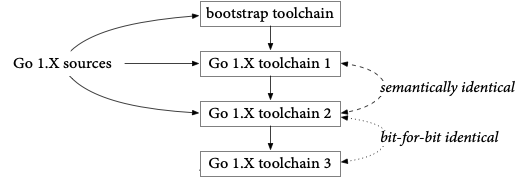
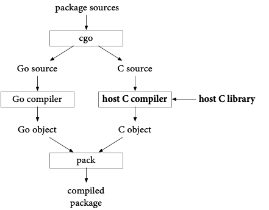
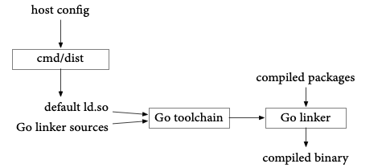
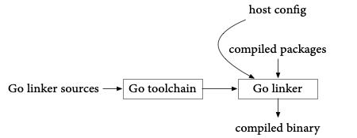

+++
title = "完全可复制、经过验证的Go工具链"
date = 2023-10-04T14:30:46+08:00
type = "docs"
weight = 84
description = ""
isCJKLanguage = true
draft = false

+++

# Perfectly Reproducible, Verified Go Toolchains - 完全可复制、经过验证的Go工具链

> 原文：[https://go.dev/blog/rebuild](https://go.dev/blog/rebuild)

Russ Cox
28 August 2023

Russ Cox
2023年8月28日

One of the key benefits of open-source software is that anyone can read the source code and inspect what it does. And yet most software, even open-source software, is downloaded in the form of compiled binaries, which are much more difficult to inspect. If an attacker wanted to run a [supply chain attack](https://cloud.google.com/software-supply-chain-security/docs/attack-vectors) on an open-source project, the least visible way would be to replace the binaries being served while leaving the source code unmodified.

​	开源软件的一个重要优势是任何人都可以阅读源代码并检查其功能。然而，大多数软件，即使是开源软件，都以编译后的二进制形式下载，这使得检查变得更加困难。如果攻击者想对开源项目进行[供应链攻击](https://cloud.google.com/software-supply-chain-security/docs/attack-vectors)，最不可见的方式就是在保持源代码不变的同时替换正在提供的二进制文件。

The best way to address this kind of attack is to make open-source software builds *reproducible*, meaning that a build that starts with the same sources produces the same outputs every time it runs. That way, anyone can verify that posted binaries are free of hidden changes by building from authentic sources and checking that the rebuilt binaries are bit-for-bit identical to the posted binaries. That approach proves the binaries have no backdoors or other changes not present in the source code, without having to disassemble or look inside them at all. Since anyone can verify the binaries, independent groups can easily detect and report supply chain attacks.

​	解决这种攻击的最佳方法是使开源软件构建过程具有"可复制性"，即使用相同的源代码每次运行都会产生相同的输出结果。这样，任何人都可以通过从真实源代码构建并检查重新构建的二进制文件与发布的二进制文件完全相同来验证发布的二进制文件没有隐藏的更改。这种方法可以证明二进制文件没有后门或源代码中不存在的其他更改，而无需进行反汇编或查看其中的内容。由于任何人都可以验证这些二进制文件，独立团体可以轻松检测并报告供应链攻击。

As supply chain security becomes more important, so do reproducible builds, because they provide a simple way to verify the posted binaries for open-source projects.

​	随着供应链安全的重要性日益增加，可复制构建变得越来越重要，因为它们为验证开源项目的发布二进制文件提供了简单的方法。

Go 1.21.0 is the first Go toolchain with perfectly reproducible builds. Earlier toolchains were possible to reproduce, but only with significant effort, and probably no one did: they just trusted that the binaries posted on [go.dev/dl](https://go.dev/dl/) were the correct ones. Now it’s easy to “trust but verify.”

​	Go 1.21.0是第一个具有完全可复制构建的Go工具链。以前的工具链也可以复制，但需要付出很大的努力，可能没有人这样做：他们只是相信在[go.dev/dl](https://go.dev/dl/)上发布的二进制文件是正确的。现在，"信任但验证"变得容易了。

This post explains what goes into making builds reproducible, examines the many changes we had to make to Go to make Go toolchains reproducible, and then demonstrates one of the benefits of reproducibility by verifying the Ubuntu package for Go 1.21.0.

​	本文解释了构建可复制性的要点，检查了我们为使Go工具链可复制而进行的许多更改，并通过验证Go 1.21.0的Ubuntu软件包来演示了可复制性的一个好处。

## 实现可复制构建 Making a Build Reproducible

Computers are generally deterministic, so you might think all builds would be equally reproducible. That’s only true from a certain point of view. Let’s call a piece of information a *relevant input* when the output of a build can change depending on that input. A build is reproducible if it can be repeated with all the same relevant inputs. Unfortunately, lots of build tools turn out to incorporate inputs that we would usually not realize are relevant and that might be difficult to recreate or provide as input. Let’s call an input an *unintentional input* when it turns out to be relevant but we didn’t mean it to be.

​	计算机通常是确定性的，因此您可能会认为所有构建都是完全可复制的。从某种角度来看，这是正确的。当一个构建的输出可能因某个输入而发生变化时，我们将该输入称为"相关输入"。如果构建可以使用相同的相关输入重复进行，那么它就是可复制的。不幸的是，许多构建工具实际上会包含我们通常不会意识到的相关输入，并且这些输入可能很难重新创建或作为输入提供。当这些输入事实上是相关的，但我们并不希望它们是相关的时，我们将其称为"非预期输入"。

The most common unintentional input in build systems is the current time. If a build writes an executable to disk, the file system records the current time as the executable’s modification time. If the build then packages that file using a tool like “tar” or “zip”, the modification time is written into the archive. We certainly didn’t want our build to change based on the current time, but it does. So the current time turns out to be an unintentional input to the build. Worse, most programs don’t let you provide the current time as an input, so there is no way to repeat this build. To fix this, we might set the time stamps on created files to Unix time 0 or to a specific time read from one of the build’s source files. That way, the current time is no longer a relevant input to the build.

​	构建系统中最常见的非预期输入是当前时间。如果构建将可执行文件写入磁盘，文件系统将当前时间记录为可执行文件的修改时间。如果构建然后使用"tar"或"zip"等工具对该文件进行打包，修改时间将写入存档中。我们显然不希望我们的构建基于当前时间而发生变化，但事实上它确实会发生变化。因此，当前时间实际上是构建的非预期输入。更糟糕的是，大多数程序不允许您将当前时间作为输入提供，因此无法重复此构建。为了解决这个问题，我们可以将创建的文件的时间戳设置为Unix时间0或从构建的某个源文件中读取的特定时间。这样，当前时间就不再是构建的相关输入了。

Common relevant inputs to a build include:

​	构建的常见相关输入包括：

- the specific version of the source code to build;
- 要构建的源代码的特定版本；
- the specific versions of dependencies that will be included in the build;
- 将包含在构建中的特定版本的依赖项；
- the operating system running the build, which may affect path names in the resulting binaries;
- 运行构建的操作系统，可能会影响生成的二进制文件中的路径名；
- the architecture of the CPU on the build system, which may affect which optimizations the compiler uses or the layout of certain data structures;
- 构建系统上的CPU架构，可能会影响编译器使用的优化或某些数据结构的布局；
- the compiler version being used, as well as compiler options passed to it, which affect how the code is compiled;
- 正在使用的编译器版本以及传递给它的编译器选项，这些选项会影响代码的编译方式；
- the name of the directory containing the source code, which may appear in debug information;
- 包含源代码的目录的名称，可能会出现在调试信息中；
- the user name, group name, uid, and gid of the account running the build, which may appear in file metadata in an archive;
- 运行构建的帐户的用户名、组名、用户ID和组ID，可能会出现在存档中的文件元数据中；
- and many more.
- 等等。

To have a reproducible build, every relevant input must be configurable in the build, and then the binaries must be posted alongside an explicit configuration listing every relevant input. If you’ve done that, you have a reproducible build. Congratulations!

​	要进行可复制构建，每个相关输入都必须在构建中可配置，然后必须在发布的二进制文件旁边发布一个显式配置，列出了每个相关输入。如果您已经这样做了，那么您就拥有了可复制构建。恭喜！

We’re not done, though. If the binaries can only be reproduced if you first find a computer with the right architecture, install a specific operating system version, compiler version, put the source code in the right directory, set your user identity correctly, and so on, that may be too much work in practice for anyone to bother.

​	然而，我们的工作还没有结束。如果只有找到具有正确体系结构的计算机、安装特定操作系统版本、编译器版本、将源代码放在正确目录中、正确设置用户身份等才能重新生成二进制文件，那么在实践中这可能是太过繁琐，没有人会费心去做。

We want builds to be not just reproducible but *easy to reproduce*. To do that, we need to identify relevant inputs and then, instead of documenting them, eliminate them. The build obviously has to depend on the source code being built, but everything else can be eliminated. When a build’s only relevant input is its source code, let’s call that *perfectly reproducible*.

​	我们希望构建不仅仅是可复制的，而且是"易于复制的"。为了做到这一点，我们需要识别相关输入，然后在文档中记录它们而不是消除它们。构建显然必须依赖正在构建的源代码，但其他所有内容都可以被消除。当一个构建的唯一相关输入是其源代码时，我们将其称为"完全可复制"。

## Go的完全可复制构建 Perfectly Reproducible Builds for Go

As of Go 1.21, the Go toolchain is perfectly reproducible: its only relevant input is the source code for that build. We can build a specific toolchain (say, Go for Linux/x86-64) on a Linux/x86-64 host, or a Windows/ARM64 host, or a FreeBSD/386 host, or any other host that supports Go, and we can use any Go bootstrap compiler, including bootstrapping all the way back to Go 1.4’s C implementation, and we can vary any other details. None of that changes the toolchains that are built. If we start with the same toolchain source code, we will get the exact same toolchain binaries out.

​	从Go 1.21开始，Go工具链是完全可复制的：它的唯一相关输入是该构建的源代码。我们可以在Linux/x86-64、Windows/ARM64、FreeBSD/386等任何支持Go的主机上构建特定的工具链，我们可以使用任何Go引导编译器，包括完全回溯到Go 1.4的C实现，并且可以改变任何其他细节。所有这些都不会改变构建的工具链。如果我们从相同的工具链源代码开始，我们将获得完全相同的工具链二进制文件。

This perfect reproducibility is the culmination of efforts dating back originally to Go 1.10, although most of the effort was concentrated in Go 1.20 and Go 1.21. This section highlights some of the most interesting relevant inputs that we eliminated.

​	这种完全可复制性是自Go 1.10以来的努力的结晶，尽管大部分努力集中在Go 1.20和Go 1.21中。本节重点介绍了我们消除的一些最有趣的相关输入。

### Go 1.10中的可复制性 Reproducibility in Go 1.10

Go 1.10 introduced a content-aware build cache that decides whether targets are up-to-date based on a fingerprint of the build inputs instead of file modification times. Because the toolchain itself is one of those build inputs, and because Go is written in Go, the [bootstrap process](https://go.dev/s/go15bootstrap) would only converge if the toolchain build on a single machine was reproducible. The overall toolchain build looks like this:

​	Go 1.10引入了一种内容感知的构建缓存，它根据构建输入的指纹而不是文件修改时间来决定目标是否为最新。由于工具链本身是这些构建输入之一，并且Go是用Go语言编写的，所以只有在单台机器上构建的工具链是可复制的，[引导过程](https://go.dev/s/go15bootstrap)才能收敛。整个工具链构建的过程如下所示：



We start by building the sources for the current Go toolchain using an earlier Go version, the bootstrap toolchain (Go 1.10 used Go 1.4, written in C; Go 1.21 uses Go 1.17). That produces “toolchain1”, which we use to build everything again, producing “toolchain2”, which we use to build everything again, producing “toolchain3”.

​	我们首先使用较早的Go版本构建当前Go工具链的源代码，即引导工具链（Go 1.10使用Go 1.4，使用C编写；Go 1.21使用Go 1.17）。这将产生"toolchain1"，我们使用它再次构建所有内容，产生"toolchain2"，我们再次使用它构建所有内容，产生"toolchain3"。

Toolchain1 and toolchain2 have been built from the same sources but with different Go implementations (compilers and libraries), so their binaries are certain to be different. However, if both Go implementations are non-buggy, correct implementations, toolchain1 and toolchain2 should behave exactly the same. In particular, when presented with the Go 1.X sources, toolchain1’s output (toolchain2) and toolchain2’s output (toolchain3) should be identical, meaning toolchain2 and toolchain3 should be identical.

​	Toolchain1和toolchain2是使用相同的源代码构建的，但使用了不同的Go实现（编译器和库），因此它们的二进制文件肯定是不同的。然而，如果两个Go实现都是非有缺陷的、正确的实现，那么toolchain1和toolchain2应该完全相同。特别是，当提供Go 1.X源代码时，toolchain1的输出（toolchain2）和toolchain2的输出（toolchain3）应该是相同的，这意味着toolchain2和toolchain3应该是相同的。

At least, that’s the idea. Making that true in practice required removing a couple unintentional inputs:

​	至少，这就是我们的想法。为了使其在实践中成为真实情况，我们需要消除一些非预期输入：

**Randomness.** Map iteration and running work in multiple goroutines serialized with locks both introduce randomness in the order that results may be generated. This randomness can make the toolchain produce one of several different possible outputs each time it runs. To make the build reproducible, we had to find each of these and sort the relevant list of items before using it to generate output.

​	**随机性。**映射迭代和在多个goroutine中运行的工作使用锁进行串行化都会引入生成结果顺序的随机性。这种随机性会使工具链每次运行时产生几种不同的可能输出之一。为了使构建具有可复制性，我们必须找到这些随机性并在使用它们生成输出之前对相关项目的列表进行排序。

**Bootstrap Libraries.** Any library used by the compiler that can choose from multiple different correct outputs might change its output from one Go version to the next. If that library output change causes a compiler output change, then toolchain1 and toolchain2 will not be semantically identical, and toolchain2 and toolchain3 will not be bit-for-bit identical.

​	**引导库。**编译器使用的任何库，如果可以从多个不同的正确输出中选择，可能会导致从一个Go版本到另一个Go版本的输出更改。如果该库的输出更改导致编译器输出更改，那么toolchain1和toolchain2将不是语义上相同的，toolchain2和toolchain3也不会是逐位相同的。

The canonical example is the [`sort`](https://go.dev/pkg/sort/) package, which can place elements that compare equal in [any order it likes](https://go.dev/blog/compat#output). A register allocator might sort to prioritize commonly used variables, and the linker sorts symbols in the data section by size. To completely eliminate any effect from the sorting algorithm, the comparison function used must never report two distinct elements as equal. In practice, this invariant turned out to be too onerous to impose on every use of sort in the toolchain, so instead we arranged to copy the Go 1.X `sort` package into the source tree that is presented to the bootstrap compiler. That way, the compiler uses the same sort algorithm when using the bootstrap toolchain as it does when built with itself.

​	一个典型的例子是[ `sort` ](https://go.dev/pkg/sort/)包，它可以以[任何顺序](https://go.dev/blog/compat#output)放置相等的元素。寄存器分配器可能会对常用变量进行排序，链接器会按大小对数据部分中的符号进行排序。为了完全消除排序算法的影响，所使用的比较函数不能将两个不同的元素报告为相等。实际上，这个不变量证明在每个使用sort的工具链中强加是太困难了，因此我们安排将Go 1.X的 `sort` 包复制到呈现给引导编译器的源代码树中。这样，编译器在使用引导工具链时使用相同的排序算法，就像在自身构建时一样。

Another package we had to copy was [`compress/zlib`](https://go.dev/pkg/compress/zlib/), because the linker writes compressed debug information, and optimizations to compression libraries can change the exact output. Over time, we’ve [added other packages to that list too](https://go.googlesource.com/go/+/go1.21.0/src/cmd/dist/buildtool.go#55). This approach has the added benefit of allowing the Go 1.X compiler to use new APIs added to those packages immediately, at the cost that those packages must be written to compile with older versions of Go.

​	我们还不得不复制[ `compress/zlib` ](https://go.dev/pkg/compress/zlib/)包，因为链接器会写入压缩的调试信息，而压缩库的优化可能会改变确切的输出。随着时间的推移，我们还[将其他包添加到了该列表中](https://go.googlesource.com/go/+/go1.21.0/src/cmd/dist/buildtool.go#55)。这种方法的额外好处是允许Go 1.X编译器立即使用这些包中添加的新API，代价是这些包必须编写以与较旧版本的Go编译。

### Go 1.20中的可复制性 Reproducibility in Go 1.20

Work on Go 1.20 prepared for both easy reproducible builds and [toolchain management](https://go.dev/blog/toolchain) by removing two more relevant inputs from the toolchain build.

​	Go 1.20的工作为易于复制的构建和[工具链管理](https://go.dev/blog/toolchain)做好了准备，通过消除工具链构建中的另外两个相关输入来实现这一目标。

**Host C toolchain.** Some Go packages, most notably `net`, default to [using `cgo`](https://go.dev/blog/cgo) on most operating systems. In some cases, such as macOS and Windows, invoking system DLLs using `cgo` is the only reliable way to resolve host names. When we use `cgo`, though, we invoke the host C toolchain (meaning a specific C compiler and C library), and different toolchains have different compilation algorithms and library code, producing different outputs. The build graph for a `cgo` package looks like:

​	**主机C工具链。**一些Go包，特别是 `net` ，在大多数操作系统上默认使用[ `cgo` ](https://go.dev/blog/cgo)。在某些情况下，例如macOS和Windows，使用 `cgo` 调用系统DLL是解析主机名的唯一可靠方法。然而，当我们使用 `cgo` 时，我们会调用主机C工具链（即特定的C编译器和C库），而不同的工具链具有不同的编译算法和库代码，从而产生不同的输出。 `cgo` 包的构建图如下所示：



The host C toolchain is therefore a relevant input to the pre-compiled `net.a` that ships with the toolchain. For Go 1.20, we decided to fix this by removing `net.a` from the toolchain. That is, Go 1.20 stopped shipping pre-compiled packages to seed the build cache with. Now, the first time a program uses package `net`, the Go toolchain compiles it using the local system’s C toolchain and caches that result. In addition to removing a relevant input from toolchain builds and making toolchain downloads smaller, not shipping pre-compiled packages also makes toolchain downloads more portable. If we build package `net` on one system with one C toolchain and then compile other parts of the program on a different system with a different C toolchain, in general there is no guarantee that the two parts can be linked together.

​	因此，主机C工具链是与工具链一起提供的预编译 `net.a` 的相关输入。对于Go 1.20，我们决定通过从工具链中删除 `net.a` 来解决此问题。也就是说，Go 1.20停止了使用预编译包来填充构建缓存。现在，当程序第一次使用 `net` 包时，Go工具链将使用本地系统的C工具链对其进行编译，并缓存该结果。除了从工具链构建中删除相关输入并使工具链下载更小之外，不再提供预编译包还使工具链下载更具可移植性。如果我们在一个系统上构建了 `net` 包，并使用不同的C工具链在另一个系统上编译程序的其他部分，一般来说，不能保证这两部分可以链接在一起。

One reason we shipped the pre-compiled `net` package in the first place was to allow building programs that used package net even on systems without a C toolchain installed. If there’s no pre-compiled package, what happens on those systems? The answer varies by operating system, but in all cases we arranged for the Go toolchain to continue to work well for building pure Go programs without a host C toolchain.

​	我们之所以在第一次发布时提供预编译的 `net` 包，是为了使在没有安装C工具链的系统上使用 `net` 包的程序能够正常构建。如果没有预编译包，那么在这些系统上会发生什么？答案因操作系统而异，但在所有情况下，我们都安排Go工具链继续为没有主机C工具链的纯Go程序提供良好的构建支持。

- On macOS, we rewrote package net using the underlying mechanisms that cgo would use, without any actual C code. This avoids invoking the host C toolchain but still emits a binary that refers to the required system DLLs. This approach is only possible because every Mac has the same dynamic libraries installed. Making the non-cgo macOS package net use the system DLLs also meant that cross-compiled macOS executables now use the system DLLs for network access, resolving a long-standing feature request.
- 在macOS上，我们使用底层机制重写了 `net` 包，而不使用任何实际的C代码。这样可以避免调用主机C工具链，但仍会生成引用所需系统DLL的二进制文件。这种方法之所以可行，是因为每个Mac都安装了相同的动态库。使非 `cgo` 的macOS  `net` 包使用系统DLL还意味着交叉编译的macOS可执行文件现在使用系统DLL进行网络访问，解决了一个长期以来的功能请求。
- On Windows, package net already made direct use of DLLs without C code, so nothing needed to be changed.
- 在Windows上， `net` 包已经直接使用DLL而没有C代码，因此不需要进行任何更改。
- On Unix systems, we cannot assume a specific DLL interface to network code, but the pure Go version works fine for systems that use typical IP and DNS setups. Also, it is much easier to install a C toolchain on Unix systems than it is on macOS and especially Windows. We changed the `go` command to enable or disable `cgo` automatically based on whether the system has a C toolchain installed. Unix systems without a C toolchain fall back to the pure Go version of package net, and in the rare cases where that’s not good enough, they can install a C toolchain.
- 在Unix系统上，我们不能假设网络代码的特定DLL接口，但对于使用典型IP和DNS设置的系统，纯Go版本可以正常工作。此外，在Unix系统上安装C工具链比在macOS和尤其是Windows上更容易。我们更改了 `go` 命令，根据系统是否安装了C工具链自动启用或禁用 `cgo` 。没有C工具链的Unix系统将退回到 `net` 包的纯Go版本，在那些情况下不够好的情况下，它们可以安装C工具链。

Having dropped the pre-compiled packages, the only part of the Go toolchain that still depended on the host C toolchain was binaries built using package net, specifically the `go` command. With the macOS improvements, it was now viable to build those commands with `cgo` disabled, completely removing the host C toolchain as an input, but we left that final step for Go 1.21.

​	放弃预编译包后，Go工具链仅仅依赖于使用 `net` 包构建的二进制文件，特别是 `go` 命令。通过macOS的改进，现在可以完全禁用 `cgo` 构建这些命令，完全消除了主机C工具链作为输入的影响，但我们将这个最后一步留给了Go 1.21。

**Host dynamic linker.** When programs use `cgo` on a system using dynamically linked C libraries, the resulting binaries contain the path to the system’s dynamic linker, something like `/lib64/ld-linux-x86-64.so.2`. If the path is wrong, the binaries don’t run. Typically each operating system/architecture combination has a single correct answer for this path. Unfortunately, musl-based Linuxes like Alpine Linux use a different dynamic linker than glibc-based Linuxes like Ubuntu. To make Go run at all on Alpine Linux, in Go bootstrap process looked like this:

​	**主机动态链接器。**当程序在使用动态链接的C库的系统上使用 `cgo` 时，生成的二进制文件包含了指向系统动态链接器的路径，例如 `/lib64/ld-linux-x86-64.so.2` 。如果路径不正确，二进制文件将无法运行。通常，每个操作系统/架构组合对于此路径有一个正确答案。不幸的是，基于musl的Linux（如Alpine Linux）使用与基于glibc的Linux（如Ubuntu）不同的动态链接器。为了使Go在Alpine Linux上正常运行，Go引导过程如下所示：



The bootstrap program cmd/dist inspected the local system’s dynamic linker and wrote that value into a new source file compiled along with the rest of the linker sources, effectively hard-coding that default into the linker itself. Then when the linker built a program from a set of compiled packages, it used that default. The result is that a Go toolchain built on Alpine is different from a toolchain built on Ubuntu: the host configuration is a relevant input to the toolchain build. This is a reproducibility problem but also a portability problem: a Go toolchain built on Alpine doesn’t build working binaries or even run on Ubuntu, and vice versa.

​	引导程序cmd/dist检查了本地系统的动态链接器，并将该值写入与其他链接器源代码一起编译的新源文件中，从而将该默认值硬编码到链接器本身中。然后，当链接器从一组已编译的包中构建程序时，它使用该默认值。结果是，在Alpine上构建的Go工具链与在Ubuntu上构建的工具链不同：主机配置是工具链构建的相关输入。这是一个可复制性问题，但也是一个可移植性问题：在Alpine Linux上构建的Go工具链不能在Ubuntu上构建工作的二进制文件，反之亦然。

For Go 1.20, we took a step toward fixing the reproducibility problem by changing the linker to consult the host configuration when it is running, instead of having a default hard-coded at toolchain build time:

​	对于Go 1.20，我们通过更改链接器在运行时查询主机配置而不是在工具链构建时硬编码默认值的方式来解决了链接器二进制文件在Alpine Linux上的可移植性问题：



This fixed the portability of the linker binary on Alpine Linux, although not the overall toolchain, since the `go` command still used package `net` and therefore `cgo` and therefore had a dynamic linker reference in its own binary. Just as in the previous section, compiling the `go` command without `cgo` enabled would fix this, but we left that change for Go 1.21. (We didn’t feel there was enough time left in the Go 1.20 cycle to test such that change properly.)

​	这解决了链接器二进制文件在Alpine Linux上的可移植性问题，尽管没有解决整个工具链的问题，因为 `go` 命令仍然使用 `net` 包，因此使用 `cgo` ，因此其自身的二进制文件中有一个动态链接器引用。与前一节中一样，使用禁用 `cgo` 编译 `go` 命令将解决此问题，但我们将这个更改留给了Go 1.21。（我们认为Go 1.20周期中剩余的时间不足以对此更改进行适当的测试。）

### Go 1.21中的可复制性 Reproducibility in Go 1.21

For Go 1.21, the goal of perfect reproducibility was in sight, and we took care of the remaining, mostly small, relevant inputs that remained.

​	对于Go 1.21，完全可复制性的目标已经在视野中，我们解决了剩下的几个主要相关输入。

**Host C toolchain and dynamic linker.** As discussed above, Go 1.20 took important steps toward removing the host C toolchain and dynamic linker as relevant inputs. Go 1.21 completed the removal of these relevant inputs by building the toolchain with `cgo` disabled. This improved portability of the toolchain too: Go 1.21 is the first Go release where the standard Go toolchain runs unmodified on Alpine Linux systems.

​	**主机C工具链和动态链接器。**如上所述，Go 1.20采取了重要措施，以消除主机C工具链和动态链接器作为相关输入。Go 1.21通过禁用 `cgo` 构建工具链完成了这些相关输入的移除。这也提高了工具链的可移植性：Go 1.21是第一个在Alpine Linux系统上无需修改即可运行标准Go工具链的版本。

Removing these relevant inputs made it possible to cross-compile a Go toolchain from a different system without any loss in functionality. That in turn improved the supply chain security of the Go toolchain: we can now build Go toolchains for all target systems using a trusted Linux/x86-64 system, instead of needing to arrange a separate trusted system for each target. As a result, Go 1.21 is the first release to include posted binaries for all systems at [go.dev/dl/](https://go.dev/dl/).
	移除这些相关输入使得可以在不丢失功能的情况下从不同的系统交叉编译Go工具链。这进一步提高了Go工具链的供应链安全性：现在我们可以使用可信任的Linux/x86-64系统为所有目标系统构建Go工具链，而不需要为每个目标系统安排单独的可信任系统。因此，Go 1.21是第一个在[go.dev/dl/](https://go.dev/dl/)上为所有系统发布二进制文件的版本。

**Source directory.** Go programs include full paths in the runtime and debugging metadata, so that when a program crashes or is run in a debugger, stack traces include the full path to the source file, not just the name of the file in an unspecified directory. Unfortunately, including the full path makes the directory where the source code is stored a relevant input to the build. To fix this, Go 1.21 changed the release toolchain builds to install commands like the compiler using `go install -trimpath`, which replaces the source directory with the module path of the code. If a released compiler crashes, the stack trace will print paths like `cmd/compile/main.go` instead of `/home/user/go/src/cmd/compile/main.go`. Since the full paths would refer to a directory on a different machine anyway, this rewrite is no loss. On the other hand, for non-release builds, we keep the full path, so that when developers working on the compiler itself cause it to crash, IDEs and other tools reading those crashes can easily find the correct source file.

​	**源代码目录。**Go程序在运行时和调试元数据中包含完整路径，因此当程序崩溃或在调试器中运行时，堆栈跟踪中包含源文件的完整路径，而不仅仅是未指定目录中的文件名。不幸的是，包含完整路径将使存储源代码的目录成为构建的相关输入。为了解决这个问题，Go 1.21将发布工具链构建更改为使用 `go install -trimpath` 安装命令，该命令将源目录替换为代码的模块路径。如果发布的编译器崩溃，堆栈跟踪将打印类似 `cmd/compile/main.go` 而不是 `/home/user/go/src/cmd/compile/main.go` 的路径。由于完整路径将引用不同计算机上的目录，因此这种重写不会有任何损失。另一方面，对于非发布构建，我们保留完整路径，以便当开发人员在编译器本身上工作导致其崩溃时，IDE和其他工具可以轻松找到正确的源文件。

**Host operating system.** Paths on Windows systems are backslash-separated, like `cmd\compile\main.go`. Other systems use forward slashes, like `cmd/compile/main.go`. Although earlier versions of Go had normalized most of these paths to use forward slashes, one inconsistency had crept back in, causing slightly different toolchain builds on Windows. We found and fixed the bug.

​	**主机操作系统。**Windows系统上的路径使用反斜杠分隔，例如 `cmd\compile\main.go` 。其他系统使用正斜杠，例如 `cmd/compile/main.go` 。尽管较早版本的Go已将大多数路径规范化为使用正斜杠，但一个不一致性已经重新出现，导致Windows上的工具链构建略有不同。我们找到并修复了此错误。

**Host architecture.** Go runs on a variety of ARM systems and can emit code using a software library for floating-point math (SWFP) or using hardware floating-point instructions (HWFP). Toolchains defaulting to one mode or the other will necessarily differ. Like we saw with the dynamic linker earlier, the Go bootstrap process inspected the build system to make sure that the resulting toolchain worked on that system. For historical reasons, the rule was “assume SWFP unless the build is running on an ARM system with floating-point hardware”, with cross-compiled toolchains assuming SWFP. The vast majority of ARM systems today do have floating-point hardware, so this introduced an unnecessary difference between natively compiled and cross-compiled toolchains, and as a further wrinkle, Windows ARM builds always assumed HWFP, making the decision operating system-dependent. We changed the rule to be “assume HWFP unless the build is running on an ARM system without floating-point hardware”. This way, cross-compilation and builds on modern ARM systems produce identical toolchains.

​	**主机架构。**Go可以运行在各种ARM系统上，并可以使用软件库进行浮点数运算（SWFP）或使用硬件浮点指令（HWFP）生成代码。默认情况下，选择其中一种模式的工具链将必然有所不同。就像我们之前在动态链接器中看到的那样，Go引导过程检查构建系统，以确保生成的工具链在该系统上工作。由于历史原因，规则是"假设SWFP，除非构建在具有浮点硬件的ARM系统上运行"，而交叉编译的工具链则假设SWFP。如今，绝大多数ARM系统都具有浮点硬件，因此这在本质上引入了本地编译和交叉编译工具链之间的不必要差异，而且进一步复杂化的是，Windows ARM构建始终假设HWFP，使决策依赖于操作系统。我们将规则更改为"假设HWFP，除非构建在没有浮点硬件的ARM系统上"。这样，交叉编译和在现代ARM系统上的构建将产生相同的工具链。

**Packaging logic.** All the code to create the actual toolchain archives we post for download lived in a separate Git repository, golang.org/x/build, and the exact details of how archives get packaged does change over time. If you wanted to reproduce those archives, you needed to have the right version of that repository. We removed this relevant input by moving the code to package the archives into the main Go source tree, as `cmd/distpack`. As of Go 1.21, if you have the sources for a given version of Go, you also have the sources for packaging the archives. The golang.org/x/build repository is no longer a relevant input.

​	**打包逻辑。**用于创建实际工具链存档的所有代码都存放在一个独立的Git存储库golang.org/x/build中，存档的打包方式确实会随时间而变化。如果您想要重现这些存档，您需要拥有正确版本的该存储库。为了消除这个相关的输入，我们将打包存档的代码移动到了主Go源代码树中，作为 `cmd/distpack` 。从Go 1.21开始，如果您拥有给定版本的Go源代码，您也拥有打包存档的源代码。golang.org/x/build存储库不再是一个相关的输入。

**User IDs.** The tar archives we posted for download were built from a distribution written to the file system, and using [`tar.FileInfoHeader`](https://go.dev/pkg/archive/tar/#FileInfoHeader) copies the user and group IDs from the file system into the tar file, making the user running the build a relevant input. We changed the archiving code to clear these.

​	**用户ID。**我们发布的tar存档是从写入文件系统的分发构建的，并且使用[ `tar.FileInfoHeader` ](https://go.dev/pkg/archive/tar/#FileInfoHeader)将用户和组ID从文件系统复制到tar文件中，使得运行构建的用户成为相关的输入。我们改变了打包代码以清除这些信息。

**Current time.** Like with user IDs, the tar and zip archives we posted for download had been built by copying the file system modification times into the archives, making the current time a relevant input. We could have cleared the time, but we thought it would look surprising and possibly even break some tools to use the Unix or MS-DOS zero time. Instead, we changed the go/VERSION file stored in the repository to add the time associated with that version:

​	**当前时间。**与用户ID类似，我们发布的tar和zip存档是通过将文件系统修改时间复制到存档中构建的，使得当前时间成为相关的输入。我们本可以清除这些时间，但我们认为使用Unix或MS-DOS的零时间可能会看起来令人惊讶，甚至可能会破坏一些工具。相反，我们改变了存储在存储库中的go/VERSION文件，添加了与该版本相关联的时间：

```
$ cat go1.21.0/VERSION
go1.21.0
time 2023-08-04T20:14:06Z
$
```

The packagers now copy the time from the VERSION file when writing files to archives, instead of copying the local file’s modification times.

​	现在，打包程序在将文件写入存档时，会从VERSION文件中复制时间，而不是复制本地文件的修改时间。

**Cryptographic signing keys.** The Go toolchain for macOS won’t run on end-user systems unless we sign the binaries with an Apple-approved signing key. We use an internal system to get them signed with Google’s signing key, and obviously we cannot share that secret key in order to allow others to reproduce the signed binaries. Instead, we wrote a verifier that can check whether two binaries are identical except for their signatures.

​	**加密签名密钥。**macOS上的Go工具链如果不使用Apple批准的签名密钥对二进制文件进行签名，将无法在最终用户系统上运行。我们使用内部系统使用Google的签名密钥对其进行签名，显然我们不能分享该秘密密钥以允许他人重现已签名的二进制文件。相反，我们编写了一个验证程序，可以检查两个二进制文件是否除了签名之外完全相同。

**OS-specific packagers.** We use the Xcode tools `pkgbuild` and `productbuild` to create the downloadable macOS PKG installer, and we use WiX to create the downloadable Windows MSI installer. We don’t want verifiers to need the same exact versions of those tools, so we took the same approach as for the cryptographic signing keys, writing a verifier that can look inside the packages and check that the toolchain files are exactly as expected.

​	**特定操作系统的打包程序。**我们使用Xcode工具 `pkgbuild` 和 `productbuild` 创建可下载的macOS PKG安装程序，使用WiX创建可下载的Windows MSI安装程序。我们不希望验证程序需要与这些工具的完全相同版本，因此我们采取了与加密签名密钥相同的方法，编写了一个验证程序，可以查看包中的内容，并检查工具链文件是否与预期完全相同。

## 验证Go工具链 Verifying the Go Toolchains

It’s not enough to make Go toolchains reproducible once. We want to make sure they stay reproducible, and we want to make sure others can reproduce them easily.

​	仅仅使Go工具链可重现是不够的。我们希望确保它们始终可重现，并且希望确保其他人可以轻松地重现它们。

To keep ourselves honest, we now build all Go distributions on both a trusted Linux/x86-64 system and a Windows/x86-64 system. Except for the architecture, the two systems have almost nothing in common. The two systems must produce bit-for-bit identical archives or else we do not proceed with the release.

​	为了保持诚实，我们现在在受信任的Linux/x86-64系统和Windows/x86-64系统上构建所有Go发行版。除了架构之外，这两个系统几乎没有任何共同之处。这两个系统必须产生完全相同的存档，否则我们将不会继续进行发布。

To allow others to verify that we’re honest, we’ve written and published a verifier, [`golang.org/x/build/cmd/gorebuild`](https://pkg.go.dev/golang.org/x/build/cmd/gorebuild). That program will start with the source code in our Git repository and rebuild the current Go versions, checking that they match the archives posted on [go.dev/dl](https://go.dev/dl/). Most archives are required to match bit-for-bit. As mentioned above, there are three exceptions where a more relaxed check is used:

​	为了让其他人验证我们的诚实，我们编写并发布了一个验证程序[ `golang.org/x/build/cmd/gorebuild` ](https://pkg.go.dev/golang.org/x/build/cmd/gorebuild)。该程序将以我们Git存储库中的源代码为起点，重新构建当前的Go版本，并检查它们是否与发布在[go.dev/dl](https://go.dev/dl/)上的存档相匹配。大多数存档需要完全匹配。如上所述，有三个例外情况，使用了更宽松的检查：

- The macOS tar.gz file is expected to differ, but then the verifier compares the contents inside. The rebuilt and posted copies must contain the same files, and all the files must match exactly, except for executable binaries. Executable binaries must match exactly after stripping code signatures.
- 预计macOS的tar.gz文件会有所不同，但验证程序会比较其中的内容。重新构建的和发布的副本必须包含相同的文件，并且所有文件必须完全匹配，除了可执行的二进制文件。在剥离代码签名之后，可执行的二进制文件必须完全匹配。
- The macOS PKG installer is not rebuilt. Instead, the verifier reads the files inside the PKG installer and checks that they match the macOS tar.gz exactly, again after code signature stripping. In the long term, the PKG creation is trivial enough that it could potentially be added to cmd/distpack, but the verifier would still have to parse the PKG file to run the signature-ignoring code executable comparison.
- 不会重新构建macOS的PKG安装程序。相反，验证程序会读取PKG安装程序中的文件，并检查它们是否与macOS的tar.gz完全匹配，同样在剥离代码签名之后。从长远来看，PKG的创建足够简单，可能可以将其添加到cmd/distpack中，但验证程序仍然需要解析PKG文件以运行忽略签名代码的可执行文件比较。
- The Windows MSI installer is not rebuilt. Instead, the verifier invokes the Linux program `msiextract` to extract the files inside and check that they match the rebuilt Windows zip file exactly. In the long term, perhaps the MSI creation could be added to cmd/distpack, and then the verifier could use a bit-for-bit MSI comparison.
- 不会重新构建Windows的MSI安装程序。相反，验证程序会调用Linux程序 `msiextract` 来提取其中的文件，并检查它们是否与重新构建的Windows zip文件完全匹配。从长远来看，可能可以将MSI的创建添加到cmd/distpack中，然后验证程序可以使用逐位比较的MSI比较。

We run `gorebuild` nightly, posting the results at [go.dev/rebuild](https://go.dev/rebuild), and of course anyone else can run it too.

​	我们每天运行 `gorebuild` ，并在[go.dev/rebuild](https://go.dev/rebuild)上发布结果，当然其他人也可以运行它。

## 验证Ubuntu的Go工具链 Verifying Ubuntu’s Go Toolchain

The Go toolchain’s easily reproducible builds should mean that the binaries in the toolchains posted on go.dev match the binaries included in other packaging systems, even when those packagers build from source. Even if the packagers have compiled with different configurations or other changes, the easily reproducible builds should still make it easy to reproduce their binaries. To demonstrate this, let’s reproduce the Ubuntu `golang-1.21` package version `1.21.0-1` for Linux/x86-64.

​	Go工具链的易于重现构建意味着go.dev上发布的工具链中的二进制文件应与其他打包系统中包含的二进制文件相匹配，即使这些打包程序是从源代码构建的。即使打包程序使用了不同的配置或其他更改编译，易于重现的构建仍然使得重现它们的二进制文件变得容易。为了证明这一点，让我们来重现Linux/x86-64上Ubuntu的 `golang-1.21` 软件包版本 `1.21.0-1` 。

To start, we need to download and extract the Ubuntu packages, which are [ar(1) archives](https://linux.die.net/man/1/ar) containing zstd-compressed tar archives:

​	首先，我们需要下载并提取Ubuntu软件包，这些软件包是包含zstd压缩的tar存档的[ar(1)存档](https://linux.die.net/man/1/ar)：

```
$ mkdir deb
$ cd deb
$ curl -LO http://mirrors.kernel.org/ubuntu/pool/main/g/golang-1.21/golang-1.21-src_1.21.0-1_all.deb
$ ar xv golang-1.21-src_1.21.0-1_all.deb
x - debian-binary
x - control.tar.zst
x - data.tar.zst
$ unzstd < data.tar.zst | tar xv
...
x ./usr/share/go-1.21/src/archive/tar/common.go
x ./usr/share/go-1.21/src/archive/tar/example_test.go
x ./usr/share/go-1.21/src/archive/tar/format.go
x ./usr/share/go-1.21/src/archive/tar/fuzz_test.go
...
$
```

That was the source archive. Now the amd64 binary archive:

​	这是源代码存档。现在是amd64二进制存档：

```
$ rm -f debian-binary *.zst
$ curl -LO http://mirrors.kernel.org/ubuntu/pool/main/g/golang-1.21/golang-1.21-go_1.21.0-1_amd64.deb
$ ar xv golang-1.21-src_1.21.0-1_all.deb
x - debian-binary
x - control.tar.zst
x - data.tar.zst
$ unzstd < data.tar.zst | tar xv | grep -v '/$'
...
x ./usr/lib/go-1.21/bin/go
x ./usr/lib/go-1.21/bin/gofmt
x ./usr/lib/go-1.21/go.env
x ./usr/lib/go-1.21/pkg/tool/linux_amd64/addr2line
x ./usr/lib/go-1.21/pkg/tool/linux_amd64/asm
x ./usr/lib/go-1.21/pkg/tool/linux_amd64/buildid
...
$
```

Ubuntu splits the normal Go tree into two halves, in /usr/share/go-1.21 and /usr/lib/go-1.21. Let’s put them back together:

​	Ubuntu将常规Go树分为两半，分别位于/usr/share/go-1.21和/usr/lib/go-1.21。让我们将它们放在一起：

```
$ mkdir go-ubuntu
$ cp -R usr/share/go-1.21/* usr/lib/go-1.21/* go-ubuntu
cp: cannot overwrite directory go-ubuntu/api with non-directory usr/lib/go-1.21/api
cp: cannot overwrite directory go-ubuntu/misc with non-directory usr/lib/go-1.21/misc
cp: cannot overwrite directory go-ubuntu/pkg/include with non-directory usr/lib/go-1.21/pkg/include
cp: cannot overwrite directory go-ubuntu/src with non-directory usr/lib/go-1.21/src
cp: cannot overwrite directory go-ubuntu/test with non-directory usr/lib/go-1.21/test
$
```

The errors are complaining about copying symlinks, which we can ignore.

​	这些错误是关于复制符号链接的问题，我们可以忽略它们。

Now we need to download and extract the upstream Go sources:

​	现在我们需要下载并提取上游Go源代码：

```
$ curl -LO https://go.googlesource.com/go/+archive/refs/tags/go1.21.0.tar.gz
$ mkdir go-clean
$ cd go-clean
$ curl -L https://go.googlesource.com/go/+archive/refs/tags/go1.21.0.tar.gz | tar xzv
...
x src/archive/tar/common.go
x src/archive/tar/example_test.go
x src/archive/tar/format.go
x src/archive/tar/fuzz_test.go
...
$
```

To skip some trial and error, it turns out that Ubuntu builds Go with `GO386=softfloat`, which forces the use of software floating point when compiling for 32-bit x86, and strips (removes symbol tables from) the resulting ELF binaries. Let’s start with a `GO386=softfloat` build:

​	为了避免一些试错，事实证明Ubuntu使用 `GO386=softfloat` 构建Go，这会在为32位x86编译时强制使用软件浮点，并剥离（从）生成的ELF二进制文件中删除符号表。让我们从一个 `GO386=softfloat` 构建开始：

```
$ cd src
$ GOOS=linux GO386=softfloat ./make.bash -distpack
Building Go cmd/dist using /Users/rsc/sdk/go1.17.13. (go1.17.13 darwin/amd64)
Building Go toolchain1 using /Users/rsc/sdk/go1.17.13.
Building Go bootstrap cmd/go (go_bootstrap) using Go toolchain1.
Building Go toolchain2 using go_bootstrap and Go toolchain1.
Building Go toolchain3 using go_bootstrap and Go toolchain2.
Building commands for host, darwin/amd64.
Building packages and commands for target, linux/amd64.
Packaging archives for linux/amd64.
distpack: 818d46ede85682dd go1.21.0.src.tar.gz
distpack: 4fcd8651d084a03d go1.21.0.linux-amd64.tar.gz
distpack: eab8ed80024f444f v0.0.1-go1.21.0.linux-amd64.zip
distpack: 58528cce1848ddf4 v0.0.1-go1.21.0.linux-amd64.mod
distpack: d8da1f27296edea4 v0.0.1-go1.21.0.linux-amd64.info
---
Installed Go for linux/amd64 in /Users/rsc/deb/go-clean
Installed commands in /Users/rsc/deb/go-clean/bin
*** You need to add /Users/rsc/deb/go-clean/bin to your PATH.
$
```

That left the standard package in `pkg/distpack/go1.21.0.linux-amd64.tar.gz`. Let’s unpack it and strip the binaries to match Ubuntu:

​	这将在 `pkg/distpack/go1.21.0.linux-amd64.tar.gz` 中留下标准包。让我们解压它并剥离二进制文件以与Ubuntu匹配：

```
$ cd ../..
$ tar xzvf go-clean/pkg/distpack/go1.21.0.linux-amd64.tar.gz
x go/CONTRIBUTING.md
x go/LICENSE
x go/PATENTS
x go/README.md
x go/SECURITY.md
x go/VERSION
...
$ elfstrip go/bin/* go/pkg/tool/linux_amd64/*
$
```

Now we can diff the Go toolchain we’ve created on our Mac with the Go toolchain that Ubuntu ships:

​	现在我们可以比较我们在Mac上创建的Go工具链与Ubuntu的Go工具链：

```
$ diff -r go go-ubuntu
Only in go: CONTRIBUTING.md
Only in go: LICENSE
Only in go: PATENTS
Only in go: README.md
Only in go: SECURITY.md
Only in go: codereview.cfg
Only in go: doc
Only in go: lib
Binary files go/misc/chrome/gophertool/gopher.png and go-ubuntu/misc/chrome/gophertool/gopher.png differ
Only in go-ubuntu/pkg/tool/linux_amd64: dist
Only in go-ubuntu/pkg/tool/linux_amd64: distpack
Only in go/src: all.rc
Only in go/src: clean.rc
Only in go/src: make.rc
Only in go/src: run.rc
diff -r go/src/syscall/mksyscall.pl go-ubuntu/src/syscall/mksyscall.pl
1c1
< #!/usr/bin/env perl
---
> #! /usr/bin/perl
...
$
```

We’ve successfully reproduced the Ubuntu package’s executables and identified the complete set of changes that remain:

​	我们成功地重现了Ubuntu软件包的可执行文件，并确定了剩下的完整更改集：

- Various metadata and supporting files have been deleted.
- 已删除各种元数据和支持文件。
- The `gopher.png` file has been modified. On closer inspection the two are identical except for an embedded timestamp that Ubuntu has updated. Perhaps Ubuntu’s packaging scripts recompressed the png with a tool that rewrites the timestamp even when it cannot improve on the existing compression.
- `gopher.png` 文件已被修改。仔细检查后，两者除了Ubuntu更新的嵌入时间戳外完全相同。也许Ubuntu的打包脚本使用了重新压缩png的工具，即使不能改善现有的压缩，也会重写时间戳。
- The binaries `dist` and `distpack`, which are built during bootstrap but not included in standard archives, have been included in the Ubuntu package.
- `dist` 和 `distpack` 二进制文件在引导过程中构建，但未包含在标准存档中，但已包含在Ubuntu软件包中。
- The Plan 9 build scripts (`*.rc`) have been deleted, although the Windows build scripts (`*.bat`) remain.
- Plan 9构建脚本（ `*.rc` ）已被删除，尽管Windows构建脚本（ `*.bat` ）保留了下来。
- `mksyscall.pl` and seven other Perl scripts not shown have had their headers changed.
- `mksyscall.pl` 和其他七个未显示的Perl脚本的头部已被更改。

Note in particular that we’ve reconstructed the toolchain binaries bit-for-bit: they do not show up in the diff at all. That is, we proved that the Ubuntu Go binaries correspond exactly to the upstream Go sources.

​	特别要注意的是，我们以逐位比特方式重建了工具链二进制文件：它们根本不在差异中显示。也就是说，我们证明了Ubuntu的Go二进制文件与上游Go源代码完全对应。

Even better, we proved this without using any Ubuntu software at all: these commands were run on a Mac, and [`unzstd`](https://github.com/rsc/tmp/blob/master/unzstd/) and [`elfstrip`](https://github.com/rsc/tmp/blob/master/elfstrip/) are short Go programs. A sophisticated attacker might insert malicious code into an Ubuntu package by changing the package-creation tools. If they did, reproducing the Go Ubuntu package from clean sources using those malicious tools would still produce bit-for-bit identical copies of the malicious packages. This attack would be invisible to that kind of rebuild, much like [Ken Thompson’s compiler attack](https://dl.acm.org/doi/10.1145/358198.358210). Verifying the Ubuntu packages using no Ubuntu software at all is a much stronger check. Go’s perfectly reproducible builds, which don’t depend on unindented details like the host operating system, host architecture, and host C toolchain, are what make this stronger check possible.

​	更好的是，我们在这个过程中没有使用任何Ubuntu软件：这些命令在Mac上运行，并且[ `unzstd` ](https://github.com/rsc/tmp/blob/master/unzstd/)和[ `elfstrip` ](https://github.com/rsc/tmp/blob/master/elfstrip/)是简短的Go程序。一个复杂的攻击者可能会通过更改软件包创建工具来插入恶意代码到Ubuntu软件包中。如果他们这样做了，使用那些恶意工具从干净的源代码重新生成Ubuntu软件包仍然会产生完全相同的恶意软件包副本。这种攻击对于这种重建是不可见的，就像[Ken Thompson的编译器攻击](https://dl.acm.org/doi/10.1145/358198.358210)一样。在没有使用任何Ubuntu软件的情况下验证Ubuntu软件包是一个更强大的检查。正是Go的完全可重现构建使得这种更强大的检查成为可能，因为它们不依赖于主机操作系统、主机架构和主机C工具链等细节。

(As an aside for the historical record, Ken Thompson told me once that his attack was in fact detected, because the compiler build stopped being reproducible. It had a bug: a string constant in the backdoor added to the compiler was imperfectly handled and grew by a single NUL byte each time the compiler compiled itself. Eventually someone noticed the non-reproducible build and tried to find the cause by compiling to assembly. The compiler’s backdoor did not reproduce itself into assembly output at all, so assembling that output removed the backdoor.)

（顺便说一句，为了历史记录，Ken Thompson曾告诉我，他的攻击实际上是被发现的，因为编译器构建不再可重现。它有一个错误：编译器中添加的后门字符串常量处理不完善，每次编译器自身编译时都会增加一个NUL字节。最终有人注意到了不可重现的构建，并尝试通过编译为汇编来找到原因。编译器的后门根本没有复制到汇编输出中，因此汇编该输出会删除后门。）

## 结论 Conclusion

Reproducible builds are an important tool for strengthening the open-source supply chain. Frameworks like [SLSA](https://slsa.dev/) focus on provenance and a software chain of custody that can be used to inform decisions about trust. Reproducible builds complement that approach by providing a way to verify that the trust is well-placed.

​	可重现构建是加强开源供应链的重要工具。像[SLSA](https://slsa.dev/)这样的框架专注于来源和软件链的可信任性，可以用来为信任决策提供信息。可重现构建通过提供一种验证信任是否正确的方式来补充该方法。

Perfect reproducibility (when the source files are the build’s only relevant input) is only possible for programs that build themselves, like compiler toolchains. It is a lofty but worthwhile goal precisely because self-hosting compiler toolchains are otherwise quite difficult to verify. Go’s perfect reproducibility means that, assuming packagers don’t modify the source code, every repackaging of Go 1.21.0 for Linux/x86-64 (substitute your favorite system) in any form should be distributing exactly the same binaries, even when they all build from source. We’ve seen that this is not quite true for Ubuntu Linux, but perfect reproducibility still lets us reproduce the Ubuntu packaging using a very different, non-Ubuntu system.

​	对于能够构建自身的程序（如编译器工具链），只有使其完全可重现才足够。这是一个崇高但值得追求的目标，因为自托管的编译器工具链本身很难验证。Go的完全可重现性意味着，假设打包程序没有修改源代码，每个以任何形式重打包的Go 1.21.0 for Linux/x86-64（替换为您喜欢的系统）都应该分发完全相同的二进制文件，即使它们都是从源代码构建的。我们已经看到这对于Ubuntu Linux来说并不完全正确，但是完全可重现性仍然使我们能够使用非常不同的非Ubuntu系统重现Ubuntu的打包。

Ideally all open source software distributed in binary form would have easy-to-reproduce builds. In practice, as we’ve seen in this post, it is very easy for unintended inputs to leak into builds. For Go programs that don’t need `cgo`, a reproducible build is as simple as compiling with `CGO_ENABLED=0 go build -trimpath`. Disabling `cgo` removes the host C toolchain as a relevant input, and `-trimpath` removes the current directory. If your program does need `cgo`, you need to arrange for a specific host C toolchain version before running `go build`, such as by running the build in a specific virtual machine or container image.

​	理想情况下，以二进制形式分发的所有开源软件都应具有易于重现的构建。实际上，正如我们在本文中所看到的，意外的输入很容易泄漏到构建中。对于不需要 `cgo` 的Go程序，重现构建只需使用 `CGO_ENABLED=0 go build -trimpath` 进行编译即可。禁用 `cgo` 会删除主机C工具链作为相关的输入，而 `-trimpath` 会删除当前目录。如果您的程序需要 `cgo` ，您需要在运行 `go build` 之前安排特定版本的主机C工具链，例如在特定的虚拟机或容器映像中运行构建。

Moving beyond Go, the [Reproducible Builds](https://reproducible-builds.org/) project aims to improve reproducibility of all open source and is a good starting point for more information about making your own software builds reproducible.

​	超越Go，[Reproducible Builds](https://reproducible-builds.org/)项目旨在提高所有开源软件的可重现性，并且是了解如何使自己的软件构建可重现的更多信息的良好起点。
