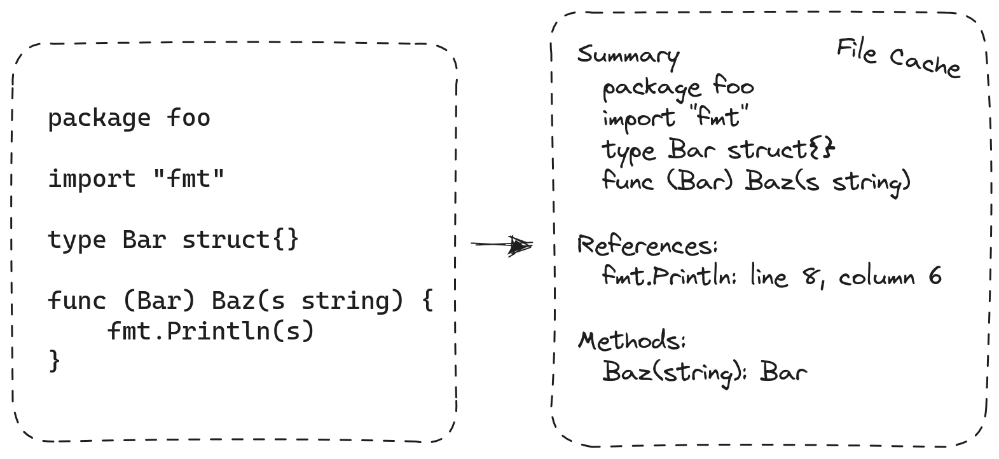
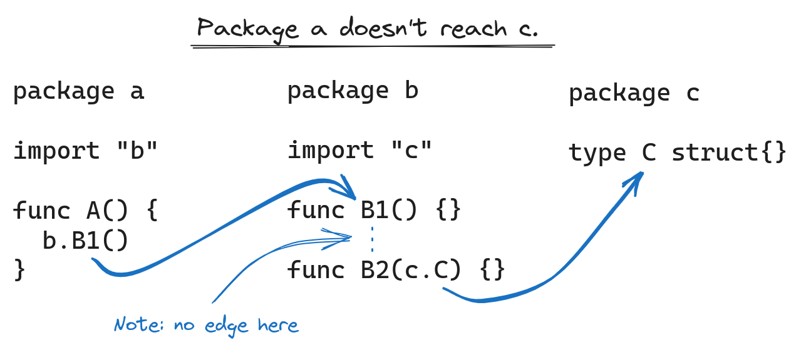

+++
title = "扩展Go生态系统的gopls"
date = 2023-10-04T14:32:11+08:00
type = "docs"
weight = 82
description = ""
isCJKLanguage = true
draft = false

+++

# Scaling gopls for the growing Go ecosystem - 扩展Go生态系统的gopls

> 原文：[https://go.dev/blog/gopls-scalability](https://go.dev/blog/gopls-scalability)

Robert Findley and Alan Donovan
8 September 2023

罗伯特·芬德利（Robert Findley）和艾伦·多诺万（Alan Donovan）
2023年9月8日

Earlier this summer, the Go team released version [v0.12](https://go.dev/s/gopls-v0.12) of [gopls](https://pkg.go.dev/golang.org/x/tools/gopls), the [language server](https://microsoft.github.io/language-server-protocol/) for Go, featuring a rewrite of its core that allows it to scale to larger codebases. This is the culmination of a year-long effort, and we’re excited to share our progress, as well as talk a little bit about the new architecture and what it means for the future of gopls.

​	今年夏天，Go团队发布了[gopls](https://pkg.go.dev/golang.org/x/tools/gopls)的[v0.12版本](https://go.dev/s/gopls-v0.12)，它是Go的[语言服务器](https://microsoft.github.io/language-server-protocol/)，通过对其核心进行重写，使其能够扩展到更大的代码库。这是一年持续努力的成果，我们很高兴与大家分享我们的进展，并谈一谈新架构及其对gopls未来的意义。

Since the v0.12 release, we’ve fine-tuned the new design, focusing on making interactive queries (such as auto-completion or finding references) as fast as they were with v0.11, despite holding so much less state in memory. If you haven’t already, we hope you’ll try it out:

​	自v0.12版本发布以来，我们对新设计进行了精细调整，重点是使交互式查询（如自动完成或查找引用）的速度与v0.11相当，尽管在内存中保存的状态要少得多。如果您还没有尝试过，请尝试一下：

```
$ go install golang.org/x/tools/gopls@latest
```

We’d love to hear about your experience with it via this [brief survey](https://google.qualtrics.com/jfe/form/SV_4SnGxpcSKN33WZw?s=blog).

​	我们希望通过[简短的调查问卷](https://google.qualtrics.com/jfe/form/SV_4SnGxpcSKN33WZw?s=blog)听取您的使用体验。

## 内存使用和启动时间的减少 Reductions in memory use and startup time

Before we dive into the details, let’s look at the results! The chart below shows the change to startup time and memory usage for 28 of the most popular Go repositories on GitHub. These measurements were taken after opening a randomly selected Go file and waiting for gopls to fully load its state, and since we assume that the initial indexing is amortized over many editing sessions, we take these measurements the *second* time we open the file.

​	在深入了解细节之前，让我们先来看看结果！下面的图表显示了GitHub上28个最受欢迎的Go代码库的启动时间和内存使用情况的变化。这些测量是在打开一个随机选择的Go文件并等待gopls完全加载其状态后进行的，由于我们假设初始索引在许多编辑会话中进行了摊销，因此我们在第二次打开文件时进行这些测量。


Across these repos, the savings average around 75%, but memory reductions are non-linear: as projects get larger, so does the relative decrease in memory usage. We’ll explain this in more detail below.

​	在这些代码库中，节省的平均值约为75％，但内存减少是非线性的：随着项目变得越来越大，相对的内存使用减少也越大。我们将在下面更详细地解释这一点。

## gopls和不断发展的Go生态系统 Gopls and the evolving Go ecosystem

Gopls provides language-agnostic editors with IDE-like features such as auto-completion, formatting, cross-references, and refactoring. Since its beginnings in 2018, gopls has consolidated many disparate command-line tools such as [guru](https://pkg.go.dev/golang.org/x/tools/cmd/guru), [gorename](https://pkg.go.dev/golang.org/x/tools/cmd/gorename), and [goimports](https://pkg.go.dev/golang.org/x/tools/cmd/goimports) and has become the [default backend for the VS Code Go extension](https://go.dev/blog/gopls-vscode-go) as well as many other editors and LSP plugins. Perhaps you’ve been using gopls through your editor without even knowing it—that’s the goal!

​	gopls为与语言无关的编辑器提供类似IDE的功能，如自动完成、格式化、交叉引用和重构。自2018年开始以来，gopls已经整合了许多不同的命令行工具，如[guru](https://pkg.go.dev/golang.org/x/tools/cmd/guru)、[gorename](https://pkg.go.dev/golang.org/x/tools/cmd/gorename)和[goimports](https://pkg.go.dev/golang.org/x/tools/cmd/goimports)，并成为[VS Code Go扩展](https://go.dev/blog/gopls-vscode-go)以及许多其他编辑器和LSP插件的[默认后端](https://go.dev/blog/gopls-vscode-go)。也许您在不知不觉中就在编辑器中使用了gopls，这正是我们的目标！

Five years ago, gopls offered improved performance merely by maintaining a stateful session. Whereas older command-line tools had to start from scratch each time they executed, gopls could save intermediate results to significantly reduce latency. But all that state came with a cost, and over time we increasingly [heard from users](https://github.com/golang/go/issues?q=is%3Aissue+is%3Aclosed+in%3Atitle+gopls+memory) that gopls’s high memory usage was barely tolerable.

​	五年前，gopls通过维护一个有状态的会话来提供改进的性能。而旧的命令行工具每次执行时都必须从头开始，gopls可以保存中间结果以显著降低延迟。但是，所有这些状态都带来了一些代价，随着时间的推移，我们越来越多地[从用户那里听到](https://github.com/golang/go/issues?q=is%3Aissue+is%3Aclosed+in%3Atitle+gopls+memory)，即gopls的高内存使用量几乎无法容忍。

Meanwhile, the Go ecosystem was growing, with more code being written in larger repositories. [Go workspaces](https://go.dev/blog/get-familiar-with-workspaces) allowed developers to work on multiple modules simultaneously, and [containerized development](https://code.visualstudio.com/docs/devcontainers/containers) put language servers in increasingly resource-constrained environments. Codebases were getting larger, and developer environments were getting smaller. We needed to change the way gopls scaled in order to keep up.

​	与此同时，Go生态系统不断发展，越来越多的代码被写入更大的代码库中。[Go工作区](https://go.dev/blog/get-familiar-with-workspaces)允许开发人员同时在多个模块上工作，[容器化开发](https://code.visualstudio.com/docs/devcontainers/containers)将语言服务器置于资源受限的环境中。代码库越来越大，开发环境越来越小。我们需要改变gopls的扩展方式以跟上这个趋势。

## 重新审视gopls的编译器起源 Revisiting gopls’s compiler origins

In many ways, gopls resembles a compiler: it has to read, parse, type-check, and analyze Go source files, for which it uses many of the compiler [building blocks](https://github.com/golang/example/tree/master/gotypes#introduction) provided by the [Go standard library](https://pkg.go.dev/go) and [golang.org/x/tools](https://pkg.go.dev/golang.org/x/tools) module. These building blocks use the technique of “symbolic programming”: in a running compiler there is a single object or “symbol” that stands for each function such as `fmt.Println`. Any reference to a function is represented as a pointer to its symbol. To test whether two references are talking about the same symbol, you don’t need to think about names. You just compare pointers. A pointer is much smaller than a string, and pointer comparison is very cheap, so symbols are an efficient way to represent a structure as complex as a program.

​	在许多方面，gopls类似于编译器：它必须读取、解析、类型检查和分析Go源文件，为此它使用了[Go标准库](https://pkg.go.dev/go)和[golang.org/x/tools](https://pkg.go.dev/golang.org/x/tools)模块提供的编译器[构建块](https://github.com/golang/example/tree/master/gotypes#introduction)。这些构建块使用了“符号编程”的技术：在运行的编译器中，每个函数（如 `fmt.Println` ）都有一个代表它的单个对象或“符号”。对函数的任何引用都表示为指向其符号的指针。要测试两个引用是否指向同一个符号，您不需要考虑名称，只需比较指针。指针比字符串小得多，指针比较非常便宜，因此符号是表示程序这样复杂结构的一种高效方式。

In order to respond quickly to requests, gopls v0.11 held all these symbols in memory, as though gopls was **compiling your entire program at once**. The result was a memory footprint that was proportional to and much larger than the source code being edited (for example, typed syntax trees are typically 30x larger than the source text!).

​	为了快速响应请求，gopls v0.11将所有这些符号保存在内存中，就好像gopls一次**编译整个程序**。结果是内存占用量与正在编辑的源代码成比例，并且远大于源文本（例如，类型化的语法树通常比源文本大30倍！）。

## 分离编译 Separate compilation

The designers of the first compilers in the 1950s quickly discovered the limits of monolithic compilation. Their solution was to break the program into units and compile each unit separately. Separate compilation makes it possible to build a program that does not fit in memory, by doing it in small pieces. In Go, the units are packages. Compilation of different packages cannot be completely separated: when compiling a package P, the compiler still needs information about what’s provided by the packages that P imports. To arrange this, the Go build system compiles all of P’s imported packages before P itself, and the Go compiler writes a compact summary of each package’s exported API. The summaries of P’s imported packages are provided as inputs to the compilation of P itself.

​	20世纪50年代，第一批编译器的设计者很快发现了整体编译的局限性。他们的解决方案是将程序分解为单元，并分别编译每个单元。通过按小块进行编译，可以构建一个不适合内存的程序。在Go中，单元是包。不同包的编译不能完全分离：在编译包P时，编译器仍然需要关于P导入的包提供的信息。为了安排这一点，Go构建系统在P自身之前编译P导入的所有包，并且Go编译器会将每个包的导出API的紧凑摘要写入。P导入的包的摘要作为P自身的编译的输入。

Gopls v0.12 brings separate compilation to gopls, reusing the same package summary format used by the compiler. The idea is simple, but there’s subtlety in the details. We rewrote each algorithm that previously inspected the data structure representing the entire program, so that it now works on one package at a time and saves per-package results to files, just like a compiler emitting object code. For example, finding all references to a function used to be as easy as searching the program data structure for all occurrences of a particular pointer value. Now, when gopls processes each package, it must construct and save an index that associates each identifier location in the source code with the name of the symbol to which it refers. At query time, gopls loads and searches these indexes. Other global queries, such as “find implementations”, use similar techniques.

​	gopls v0.12引入了分离编译到gopls中，重用了编译器使用的相同包摘要格式。这个想法很简单，但细节中有微妙之处。我们重写了之前检查表示整个程序的数据结构的每个算法，使其现在逐个包工作，并将每个包的结果保存到文件中，就像编译器发出目标代码一样。例如，查找对函数的所有引用以前只需要在程序数据结构中搜索特定指针值的所有出现。现在，当gopls处理每个包时，它必须构建并保存一个索引，将源代码中的每个标识符位置与其引用的符号名称相关联。在查询时，gopls加载并搜索这些索引。其他全局查询，如“查找实现”，使用类似的技术。

Like the `go build` command, gopls now uses a [file-based cache](https://cs.opensource.google/go/x/tools/+/master:gopls/internal/lsp/filecache/filecache.go;l=5;drc=6f567c8090cb88f13a71b19595bf88c6b27dbeed) store to record summaries of information computed from each package, including the type of each declaration, the index of cross-references, and the method set of each type. Since the cache is persisted across processes, you’ll notice that the second time you start gopls in your workspace, it becomes ready to serve much more quickly, and if you run two gopls instances, they work together synergistically.

​	与 `go build` 命令一样，gopls现在使用基于文件的缓存存储，记录从每个包计算的信息摘要，包括每个声明的类型、交叉引用的索引和每个类型的方法集。由于缓存在进程间持久化，您会注意到第二次启动工作区中的gopls时，它变得更快，如果您运行两个gopls实例，它们会协同工作。



The result of this change is that gopls’s memory use is proportional to the number of open packages and their direct imports. This is why we observe sublinear scaling in the chart above: as repositories get larger, the fraction of the project observed by any one open package gets smaller.

​	这个改变的结果是gopls的内存使用量与打开的包的数量及其直接导入的包成比例。这就是为什么我们在上面的图表中观察到了次线性的扩展：随着代码库变得越来越大，任何一个打开的包观察到的项目部分就会变得更小。

## 精细化的失效处理 Fine-grained invalidation

When you make a change in one package, it’s only necessary to recompile the packages that import that one, directly or indirectly. This idea is the basis of all incremental build systems since Make in the 1970s, and gopls has been using it since its inception. In effect, every keystroke in your LSP-enabled editor starts an incremental build! However, in a large project, indirect dependencies add up, making these incremental rebuilds too slow. It turns out that a lot of this work isn’t strictly necessary, because most changes, such as adding a statement within an existing function, don’t affect the import summaries.

​	当您在一个包中进行更改时，只需要重新编译导入该包的包，无论是直接导入还是间接导入。这个思想是自1970年代的Make以来所有增量构建系统的基础，gopls从一开始就一直在使用它。实际上，您在启用LSP的编辑器中的每个按键都会启动一个增量构建！然而，在大型项目中，间接依赖会累积起来，使得这些增量重建过于缓慢。事实证明，很多这样的工作并不是绝对必要的，因为大多数更改，例如在现有函数中添加语句，不会影响导入摘要。

If you make a small change in one file, we have to recompile its package, but if the change does not affect the import summary, we don’t have to compile any other packages. The effect of the change is “pruned”. A change that does affect the import summary requires recompiling the packages that directly import that package, but most such changes won’t affect the import summaries of *those* packages, in which case the effect is still pruned and avoids recompiling indirect importers. Thanks to this pruning, it is rare for a change in a low-level package to require recompiling *all* the packages that indirectly depend on that package. Pruned incremental rebuilds make the amount of work proportional to the scope of each change. This is not a new idea: it was introduced by [Vesta](https://www.hpl.hp.com/techreports/Compaq-DEC/SRC-RR-177.pdf) and also used in [`go build`](https://go.dev/doc/go1.10#build).

​	如果您在一个文件中进行了小的更改，我们必须重新编译其所属的包，但如果更改不影响导入摘要，我们就不必编译任何其他包。更改的效果被“修剪”了。如果更改确实影响了导入摘要，则需要重新编译直接导入该包的包，但大多数这样的更改不会影响*那些*包的导入摘要，这种情况下的效果仍然被修剪，避免了重新编译间接导入的包。由于这种修剪，很少有一个低级包的更改需要重新编译间接依赖该包的*所有*包。修剪的增量重建使得工作量与每个更改的范围成比例。这不是一个新的想法：它在[Vesta](https://www.hpl.hp.com/techreports/Compaq-DEC/SRC-RR-177.pdf)中引入，并且也在[ `go build` ](https://go.dev/doc/go1.10#build)中使用过。

The v0.12 release introduces a similar pruning technique to gopls, going one step further to implement a faster pruning heuristic based on syntactic analysis. By keeping a simplified graph of symbol references in memory, gopls can quickly determine whether a change in package `c` can possibly affect package `a` through a chain of references.

​	v0.12版本引入了类似的修剪技术到gopls中，进一步实现了一种基于语法分析的更快修剪启发式。通过在内存中保留一个简化的符号引用图，gopls可以快速确定一个包 `c` 的更改是否可能通过一系列引用影响到包 `a` 。



In the example above, there’s no chain of references from `a` to `c`, so a is not exposed to changes in c even though it indirectly depends on it.

​	在上面的示例中，从 `a` 到 `c` 没有引用链，因此 `a` 不会受到对 `c` 的更改的影响，即使它间接依赖于它。

## 新的可能性 New possibilities

While we’re happy with the performance improvements we’ve achieved, we’re also excited about several gopls features that are feasible now that gopls is no longer constrained by memory.

​	虽然我们对我们取得的性能改进感到满意，但我们对几个gopls功能也感到兴奋，这些功能现在已经成为可能，因为gopls不再受内存限制。

The first is robust static analysis. Previously, our static analysis driver had to operate on gopls’s in-memory representation of packages, so it couldn’t analyze dependencies: doing so would pull in too much additional code. With that requirement removed, we were able to include a new analysis driver in gopls v0.12 that analyzes all dependencies, resulting in greater precision. For example, gopls now reports diagnostics for `Printf` formatting mistakes even in your user-defined wrappers around `fmt.Printf`. Notably, `go vet` has provided this level of precision for years, but gopls was unable to do this in real time after each edit. Now it can.

​	第一个是强大的静态分析。以前，我们的静态分析驱动程序必须在gopls的内存表示的包上操作，因此它无法分析依赖关系：这样做会引入太多额外的代码。去除了这个要求后，我们能够在gopls v0.12中包含一个新的分析驱动程序，它分析所有依赖关系，从而获得更高的精度。例如，现在即使在您对 `fmt.Printf` 周围的用户定义包装器中，gopls也会报告 `Printf` 格式错误的诊断信息。值得注意的是，多年来， `go vet` 一直提供这种精度，但是gopls在每次编辑后实时运行时无法做到这一点。现在它可以做到了。

The second is [simpler workspace configuration](https://go.dev/issue/57979) and [improved handling for build tags](https://go.dev/issue/29202). These two features both amount to gopls “doing the right thing” when you open any Go file on your machine, but both were infeasible without the optimization work because (for example) each build configuration multiplies the memory footprint!

​	第二个是[更简单的工作区配置](https://go.dev/issue/57979)和[改进的构建标签处理](https://go.dev/issue/29202)。这两个功能都意味着gopls在您打开机器上的任何Go文件时都会“做正确的事情”，但是在优化工作之前，这两个功能都是不可行的，因为（例如）每个构建配置都会增加内存占用！

## 试一试吧！ Try it out!

In addition to scalability and performance improvements, we’ve also fixed [numerous](https://github.com/golang/go/milestone/282?closed=1) [reported bugs](https://github.com/golang/go/milestone/318?closed=1) and many unreported ones that we discovered while improving test coverage during the transition.

​	除了可扩展性和性能的改进外，我们还修复了[许多](https://github.com/golang/go/milestone/282?closed=1)已[报告的错误](https://github.com/golang/go/milestone/318?closed=1)以及在过渡期间改进测试覆盖率时发现的许多未报告的错误。

To install the latest gopls:

​	要安装最新的gopls，请运行：

```
$ go install golang.org/x/tools/gopls@latest
```

Please try it out and fill out the [survey](https://google.qualtrics.com/jfe/form/SV_4SnGxpcSKN33WZw?s=blog) — and if you should encounter a bug, [report it](https://github.com/golang/go/issues/new/choose) and we will fix it.

​	请尝试一下，并填写[调查问卷](https://google.qualtrics.com/jfe/form/SV_4SnGxpcSKN33WZw?s=blog)——如果遇到错误，请[报告](https://github.com/golang/go/issues/new/choose)，我们会修复它。