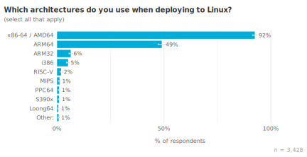
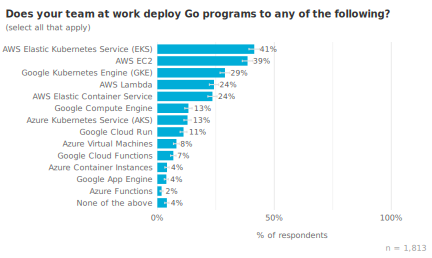
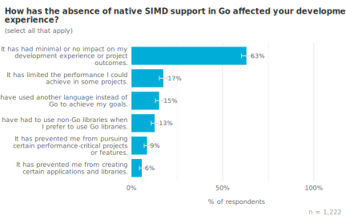
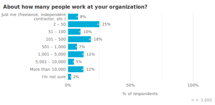
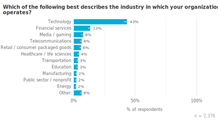

+++
title = "2024 下半年 Go 开发者调查结果"
date = 2025-03-31T13:43:10+08:00
weight = 830
type = "docs"
description = ""
isCJKLanguage = true
draft = false

+++

> 原文：[https://go.dev/blog/survey2024-h2-results](https://go.dev/blog/survey2024-h2-results)

# Go Developer Survey 2024 H2 Results  - 2024 下半年 Go 开发者调查结果

Alice Merrick

20 December 2024

 2024 年 12 月 20 日

## 背景  Background

Go was designed with a focus on developer experience, and we deeply value the feedback we receive through proposals, issues, and community interactions. However, these channels often represent the voices of our most experienced or engaged users, a small subset of the broader Go community. To ensure we’re serving developers of all skill levels, including those who may not have strong opinions on language design, we conduct this survey once or twice a year to gather systematic feedback and quantitative evidence. This inclusive approach allows us to hear from a wider range of Go developers, providing valuable insights into how Go is used across different contexts and experience levels. Your participation is critical in informing our decisions about language changes and resource allocation, ultimately shaping the future of Go. Thank you to everyone who contributed, and we strongly encourage your continued participation in future surveys. Your experience matters to us.

​	Go 设计时注重开发者体验，我们非常重视通过提案、问题和社区互动中收到的反馈。然而，这些渠道往往只代表我们最有经验或最活跃用户的一小部分，而不是整个 Go 社区。为了确保我们能服务于各个技能水平的开发者——包括那些对语言设计没有强烈意见的人——我们每年进行一到两次调查，以收集系统的反馈和定量证据。这种包容性的方法使我们能听到更广泛的 Go 开发者的声音，提供有关 Go 在不同环境和经验水平下使用情况的宝贵见解。您的参与对我们决策语言变更和资源分配至关重要，最终将塑造 Go 的未来。感谢每一位贡献者，我们强烈鼓励您继续参与未来的调查。您的体验对我们来说非常重要。

This post shares the results of our most recent Go Developer Survey, conducted from September 9–23, 2024. We recruited participants from the Go blog and through randomized prompts in the [VS Code](https://code.visualstudio.com/) Go plug-in and [GoLand IDE](https://www.jetbrains.com/go/), allowing us to recruit a more representative sample of Go developers. We received a total of 4,156 responses. A huge thank you to all those who contributed to making this possible.

​	本文分享了我们最近一次 Go 开发者调查的结果，该调查于 2024 年 9 月 9 日至 23 日期间进行。我们通过 Go 博客以及在 [VS Code](https://code.visualstudio.com/) Go 插件和 [GoLand IDE](https://www.jetbrains.com/go/) 中的随机提示招募了参与者，使我们能够招募到更具代表性的 Go 开发者样本。我们共收到 4,156 份答卷。非常感谢所有为此做出贡献的人。

Along with capturing sentiments and challenges around using Go and Go tooling, our primary focus areas for this survey were on uncovering sources of toil, challenges to performing best practices, and how developers are using AI assistance.

​	除了捕捉开发者对使用 Go 及 Go 工具的情感和挑战外，我们本次调查的主要关注点在于揭示工作负担的来源、实践最佳实践所面临的挑战，以及开发者如何使用 AI 辅助工具。

## 重点  Highlights

- **Developer sentiment towards Go remains extremely positive**, with 93% of survey respondents saying they felt satisfied while working with Go during the prior year.
- **开发者对 Go 的情感依然非常积极**，有 93% 的调查参与者表示他们在过去一年中使用 Go 时感到满意。
- **Ease of deployment and an easy to use API/SDK** were respondents’ favorite things about using Go on the top three cloud providers. First-class Go support is critical to keeping up with developer expectations.
- **易于部署以及简洁易用的 API/SDK** 是参与者在使用 Go 于三大云平台时最喜欢的特性。一流的 Go 支持对于满足开发者期望至关重要。
- 70% of respondents were using AI assistants when developing with Go. The most common uses were **LLM-based code completion**, writing tests, generating Go code from natural language descriptions, and brainstorming. There was a significant discrepancy between what respondents said they wanted to use AI for last year, and what they currently use AI for.
- 70% 的参与者在使用 Go 开发时使用了 AI 辅助工具。最常见的用途包括 **基于大语言模型的代码补全**、编写测试、从自然语言描述生成 Go 代码以及头脑风暴。参与者去年所期望使用 AI 的用途与他们目前实际使用 AI 的用途之间存在显著差异。
- The biggest challenge for teams using Go was **maintaining consistent coding standards** across their codebase. This was often due to team members having different levels of Go experience and coming from different programming backgrounds, leading to inconsistencies in coding style and adoption of non-idiomatic patterns.
- 使用 Go 的团队面临的最大挑战是 **在整个代码库中维持一致的编码标准**。这通常是由于团队成员的 Go 经验水平不同以及来自不同的编程背景，导致编码风格不一致和采用非惯用模式的问题。

### 总体满意度  Overall satisfaction

Overall satisfaction remains high in the survey with 93% of respondents saying they were somewhat or very satisfied with Go during the last year. Although the exact percentages fluctuate slightly from cycle to cycle, we do not see any statistically significant differences from our [2023 H2](https://go.dev/blog/survey2023-h2-results) or [2024 H1](https://go.dev/blog/survey2024-h1-results) Surveys when the satisfaction rate was 90% and 93%, respectively.

​	总体满意度在调查中依然很高，有 93% 的受访者表示他们在过去一年中对使用 Go 感到或多或少满意。尽管具体百分比每次调查略有波动，但与我们分别在 [2023 下半年](https://go.dev/blog/survey2023-h2-results) 和 [2024 上半年](https://go.dev/blog/survey2024-h1-results) 调查中分别为 90% 和 93% 的满意度相比，并没有发现任何统计上显著的差异。

The open comments we received on the survey continue to highlight what developers like most about using Go, for example, its simplicity, the Go toolchain, and its promise of backwards compatibility:

​	 我们在调查中收到的开放性评论继续强调开发者最喜欢使用 Go 的哪些方面，例如其简洁性、Go 工具链以及向后兼容的承诺：

*“I am a programming languages enjoyer (C-like) and I always come back to Go for its simplicity, fast compilation and robust toolchain. Keep it up!”*

​	 *“我是一个热爱编程语言的人（类似 C），我总是因为 Go 的简洁性、快速编译和强大的工具链而回归使用它。请继续保持！”*

*“Thank you for creating Go! It is my favorite language, because it is pretty minimal, the development cycle has rapid build-test cycles, and when using a random open source project written in Go, there is a good chance that it will work, even 10 years after. I love the 1.0 compatibility guarantee.”*

 	*“感谢你们创造了 Go！它是我最喜欢的语言，因为它非常精简，开发周期具有快速的构建-测试循环，而且即使在 10 年后使用一个随机的开源 Go 项目，它也很有可能依然能正常工作。我喜欢 1.0 兼容性保证。”*

### 开发环境与工具  Development environments and tools

#### 开发者操作系统  Developer OS

Consistent with previous years, most survey respondents develop with Go on Linux (61%) and macOS (59%) systems. Historically, the proportion of Linux and macOS users has been very close, and we didn’t see any significant changes from the last survey. The randomly sampled groups from JetBrains and VS Code were more likely (33% and 36%, respectively) to develop on Windows than the self-selected group (16%).

​	与往年一致，大多数调查受访者使用 Linux (61%) 和 macOS (59%) 系统进行 Go 开发。从历史上看，Linux 和 macOS 用户的比例非常接近，我们没有看到与上次调查相比有显著变化。来自 JetBrains 和 VS Code 随机抽样的组分别有 33% 和 36% 的用户更倾向于在 Windows 上开发，而自选组只有 16%。

#### 部署环境  Deployment environments

Given the prevalence of Go for cloud development and containerized workloads, it’s no surprise that Go developers primarily deploy to Linux environments (96%).

​	鉴于 Go 在云开发和容器化工作负载中的普及，毫不奇怪 Go 开发者主要部署在 Linux 环境中 (96%)。

We included several questions to understand what architectures respondents are deploying to when deploying to Linux, Windows or WebAssembly. The x86-64 / AMD64 architecture was by far the most popular choice for those deploying to both Linux (92%) and Windows (97%). ARM64 was second at 49% for Linux and 21% for Windows.

​	我们还包含了几个问题，以了解受访者在部署到 Linux、Windows 或 WebAssembly 时所使用的架构。对于部署到 Linux（92%）和 Windows（97%）的用户来说，x86-64 / AMD64 架构无疑是最受欢迎的选择。ARM64 在 Linux 上排名第二，占 49%，而在 Windows 上占 21%。

Not many respondents deployed to Web Assembly (only about 4% of overall respondents), but 73% that do said they deploy to JS and 48% to WASI Preview 1.

​	很少有受访者部署到 WebAssembly（总体仅约 4%），但其中 73% 表示他们部署到 JS，48% 部署到 WASI Preview 1。

#### 编辑器认知与偏好  Editor awareness and preferences

We introduced a new question on this survey to assess awareness and usage of popular editors for Go. When interpreting these results, keep in mind that 34% of respondents came to the survey from VS Code and 9% of respondents came from GoLand, so it is more likely for them to use those editors regularly.

​	本次调查中我们新增了一个问题，以评估开发者对流行 Go 编辑器的认知和使用情况。在解释这些结果时，请记住 34% 的受访者是通过 VS Code 进入调查的，而 9% 来自 GoLand，因此他们更可能经常使用这些编辑器。

VS Code was the most widely used editor, with 66% of respondents using it regularly, and GoLand was the second most used at 35%. Almost all respondents had heard of both VS Code and GoLand, but respondents were much more likely to have at least tried VS Code. Interestingly, 33% of respondents said they regularly use 2 or more editors. They may use different editors for different tasks or environments, such as using Emacs or Vim via SSH, where IDEs aren’t available.

​	VS Code 是使用最广泛的编辑器，66% 的受访者表示他们经常使用，而 GoLand 是第二常用的，占 35%。几乎所有受访者都听说过 VS Code 和 GoLand，但受访者更有可能至少尝试过 VS Code。有趣的是，33% 的受访者表示他们经常使用两个或以上的编辑器。他们可能会在不同任务或环境下使用不同的编辑器，例如通过 SSH 使用 Emacs 或 Vim，因为在那种情况下没有 IDE 可用。

We also asked a question about editor preference, the same as we have asked on previous surveys. Because our randomly sampled populations were recruited from within VS Code or GoLand, they are strongly biased towards preferring those editors. To avoid skewing the results, we show the data for the most preferred editor here from the self-selected group only. 38% preferred VS Code and 35% preferred GoLand. This is a notable difference from the last survey in H1, when 43% preferred VS Code and 33% preferred GoLand. A possible explanation could be in how respondents were recruited this year. This year the VS Code notification began inviting developers to take the survey before the Go blog entry was posted, so a larger proportion of respondents came from the VS Code prompt this year who might have otherwise come from the blog post. Because we only show the self-selected respondents in this chart, data from respondents from the VS Code prompt data are not represented here. Another contributing factor could be the slight increase in those who prefer “Other” (4%). The write-in responses suggest there is increased interest in editors like [Zed](https://zed.dev/), which made up 43% of the write-in responses.

​	我们还问了一个关于编辑器偏好的问题，与之前的调查中所问相同。由于我们随机抽样的人群来自 VS Code 或 GoLand 内部，他们强烈偏好这些编辑器。为了避免结果偏斜，我们在此仅展示自选人群中最受欢迎编辑器的数据。38% 的受访者偏好 VS Code，35% 偏好 GoLand。这与上半年调查中 43% 偏好 VS Code 和 33% 偏好 GoLand 的结果存在显著差异。可能的解释是今年受访者的招募方式有所不同。今年 VS Code 的通知在 Go 博客文章发布前就开始邀请开发者参加调查，因此今年有更多受访者来自 VS Code 提示，而他们可能原本会从博客文章中看到。由于我们在图表中只展示自选受访者的数据，因此来自 VS Code 提示的受访者数据未在此处体现。另一个因素可能是偏好“其他”编辑器的人数略有增加（4%）。书面回复显示，对 [Zed](https://zed.dev/) 等编辑器的兴趣增加，Zed 占书面回复的 43%。

#### 代码分析工具  Code analysis tools

The most popular code analysis tool was `gopls`, which was knowingly used by 65% of respondents. Because `gopls` is used under-the-hood by default in VS Code, this is likely an undercount. Following closely behind, `golangci-lint` was used by 57% of respondents, and `staticcheck` was used by 34% of respondents. A much smaller proportion used custom or other tools, which suggests that most respondents prefer common established tools over custom solutions. Only 10% of respondents indicated they don’t use any code analysis tools.

最受欢迎的代码分析工具是 `gopls`，有 65% 的受访者明确使用了它。由于 VS Code 默认在后台使用 `gopls`，这可能低估了其使用率。紧随其后的是 `golangci-lint`，57% 的受访者使用，以及 `staticcheck` 被 34% 的受访者使用。只有很小一部分人使用自定义或其他工具，这表明大多数受访者倾向于使用成熟的常用工具而非自定义解决方案。仅有 10% 的受访者表示他们不使用任何代码分析工具。

#### 云中的 Go  - Go in the Clouds

Go is a popular language for modern cloud-based development, so we typically include survey questions to help us understand which cloud platforms and services Go developers are using. In this cycle, we sought to learn about preferences and experiences of Go developers across cloud providers, with a particular focus on the largest cloud providers: Amazon Web Services (AWS), Microsoft Azure, and Google Cloud. We also included an additional option for “Bare Metal Servers” for those who deploy to servers without virtualization.

Go 是现代基于云开发的流行语言，因此我们通常会包含调查问题，以帮助我们了解 Go 开发者使用哪些云平台和服务。在这一周期中，我们希望了解 Go 开发者在各云服务提供商中的偏好和经验，特别关注最大的云服务提供商：Amazon Web Services (AWS)、Microsoft Azure 和 Google Cloud。我们还为那些部署到非虚拟化服务器的用户增加了“裸机服务器”选项。

Similar to previous years, almost half of respondents (50%) deploy Go programs to Amazon Web Services. AWS is followed by self-owned or company-owned servers (37%), and Google Cloud (30%). Respondents who work at large organizations are a little more likely to deploy to self-owned or company-owned servers (48%) than those who work at small-to-medium organizations (34%). They‘re also a little more likely to deploy to Microsoft Azure (25%) than small-to-medium organizations (12%).

与往年类似，近一半的受访者（50%）将 Go 程序部署到 Amazon Web Services。其次是自有或公司拥有的服务器（37%），以及 Google Cloud（30%）。在大型组织工作的受访者比在中小型组织工作的受访者更可能将应用部署到自有或公司服务器（48% 对 34%），并且他们也更可能部署到 Microsoft Azure（25% 对 12%）。

The most commonly used cloud services were AWS Elastic Kubernetes Service (41%), AWS EC2 (39%), and Google Cloud GKE (29%). Although we’ve seen Kubernetes usage increase over time, this is the first time we’ve seen EKS become more widely used than EC2. Overall, Kubernetes offerings were the most popular services for AWS, Google Cloud, and Azure, followed by VMs and then Serverless offerings. Go’s strengths in containerization and microservices development naturally align with the rising popularity of Kubernetes, as it provides an efficient and scalable platform for deploying and managing these types of applications.

最常用的云服务是 AWS Elastic Kubernetes Service (41%)、AWS EC2 (39%) 以及 Google Cloud GKE (29%)。虽然我们看到 Kubernetes 的使用率随着时间不断上升，但这是第一次看到 EKS 的使用率超过 EC2。总体来看，Kubernetes 产品是 AWS、Google Cloud 和 Azure 中最受欢迎的服务，其次是虚拟机，再次是无服务器产品。Go 在容器化和微服务开发方面的优势自然而然地与 Kubernetes 越来越受欢迎相匹配，因为它为部署和管理此类应用提供了高效且可扩展的平台。

We asked a followup question to respondents who deployed Go code to the top three cloud providers, Amazon Web Services, Google Cloud, and Microsoft Azure on what they like most about deploying Go code to each cloud. The most popular response across different providers was actually Go’s performance and language features rather than something about the cloud provider.

我们向将 Go 代码部署到前三大云提供商（Amazon Web Services、Google Cloud 和 Microsoft Azure）的受访者询问他们最喜欢在每个云平台上部署 Go 代码的哪一方面。各平台中最受欢迎的回答实际上是 Go 的性能和语言特性，而不是云提供商的某些特性。

Other common reasons were:

- Familiarity with the given cloud provider compared to other clouds
- Ease of deployment of Go applications on the given cloud provider
- The cloud provider’s API/SDK for Go is easy to use
- The API/SDK is well documented

其他常见原因包括：

- 对特定云提供商的熟悉度高于其他云
- 在该云提供商上部署 Go 应用简单便捷
- 该云提供商为 Go 提供的 API/SDK 易于使用
- API/SDK 文档完善

Other than familiarity, the top favorite things highlight the importance of having first class support for Go to keep up with developer expectations.
 除了熟悉度之外，最受欢迎的特点突显了为 Go 提供一流支持以满足开发者期望的重要性。

It was also fairly common for respondents to say they don’t have a favorite thing about their cloud provider. From a previous version of the survey that involved write-in responses, this often meant that they did not interact directly with the Cloud. In particular, respondents who use Microsoft Azure were much more likely to say that “Nothing” was their favorite thing (51%) compared to AWS (27%) or Google Cloud (30%).

受访者中也有相当多的人表示他们对所使用的云提供商没有特别喜爱的地方。根据之前包含书面回复的调查版本，这通常意味着他们没有直接与云交互。特别是使用 Microsoft Azure 的受访者比使用 AWS（27%）或 Google Cloud（30%）的受访者更倾向于表示“无”是他们最喜欢的特点（51%）。

### AI 辅助  AI assistance

The Go team hypothesizes that AI assistance has the potential to alleviate developers from tedious and repetitive tasks, allowing them to focus on more creative and fulfilling aspects of their work. To gain insights into areas where AI assistance could be most beneficial, we included a section in our survey to identify common developer toil.

​	Go 团队假设 AI 辅助有潜力减轻开发者在繁琐重复任务中的负担，让他们能够专注于更具创造性和满足感的工作。为了深入了解 AI 辅助在哪些方面可能最有益，我们在调查中加入了一个部分，以确定常见的开发者痛点。

The majority of respondents (70%) are using AI assistants when developing with Go. The most common usage of AI assistants was in LLM-based code completion (35%). Other common responses were writing tests (29%), generating Go code from a natural language description (27%), and brainstorming ideas (25%). There was also a sizable minority (30%) of respondents who had not used any LLM for assistance in the last month.

​	大多数受访者（70%）在使用 Go 开发时都使用了 AI 辅助工具。最常见的用途是基于大语言模型的代码补全（35%）。其他常见的用途包括编写测试（29%）、从自然语言描述生成 Go 代码（27%）以及头脑风暴（25%）。还有相当一部分受访者（30%）在过去一个月内没有使用任何大语言模型来提供帮助。

Some of these results stood out when compared to findings from our 2023 H2 survey, where we asked respondents for the top 5 use cases they would like to see AI/ML support Go developers. Although a couple new responses were introduced in the current survey, we can still do a rough comparison between what respondents said they wanted AI support for, and what their actual usage was like. In that previous survey, writing tests was the most desired use case (49%). In our latest 2024 H2 survey, about 29% of respondents had used AI assistants for this in the last month. This suggests that current offerings are not meeting developer needs for writing tests. Similarly, in 2023, 47% respondents said they would like suggestions for best practices while coding, while only 14% a year later said they are using AI assistance for this use case. 46% said they wanted help catching common mistakes while coding, and only 13% said they were using AI assistance for this. This could indicate that current AI assistants are not well-equipped for these kinds of tasks, or they’re not well integrated into developer workflows or tooling.

​	与我们 2023 H2 调查中的发现相比，这些结果尤为引人注目，当时我们询问受访者希望 AI/ML 支持 Go 开发者的前 5 个用例。尽管当前调查中引入了一些新回复，我们仍可以粗略比较受访者所期望的 AI 支持用途与他们实际使用情况之间的差异。在之前的调查中，编写测试是最受期待的用例（49%）。而在我们最新的 2024 H2 调查中，约 29% 的受访者在过去一个月内使用 AI 辅助工具来编写测试。这表明当前的产品可能未能满足开发者在编写测试方面的需求。同样，在 2023 年，47% 的受访者表示希望获得编写代码时的最佳实践建议，而一年后只有 14% 的受访者表示他们正在使用 AI 辅助工具来实现这一点。46% 的受访者表示他们希望获得帮助以捕捉编程时的常见错误，而只有 13% 的人表示他们正在使用 AI 辅助工具来实现这一点。这可能表明当前的 AI 辅助工具在应对这类任务方面还不够强大，或者它们没有很好地集成到开发者的工作流程或工具中。

We also saw some notable differences in how different groups responded to this question. Respondents at small to medium sized organizations were a little more likely to have used LLMs (75%) compared to those at large organizations (66%). There could be a number of reasons why, for example, larger organizations may have stricter security and compliance requirements and concerns about the security of LLM coding assistants, the potential for data leakage, or compliance with industry-specific regulations. They also may have already invested in other developer tools and practices that already provide similar benefits to developer productivity.

​	我们还发现，不同群体对这一问题的回答存在一些显著差异。在中小型组织的受访者中，使用大语言模型的比例略高（75%）于大型组织（66%）。例如，较大的组织可能有更严格的安全和合规要求，对大语言模型编码助手的安全性、数据泄漏的可能性或符合行业特定法规的担忧，可能是原因之一。此外，他们可能已经投资于其他开发者工具和实践，这些工具和实践已经能为开发者生产力提供类似的好处。

Go developers with less than 2 years of experience were more likely to use AI assistants (75%) compared to Go developers with 5+ years of experience (67%). Less experienced Go developers were also more likely to use them for more tasks, on average 3.50. Although all experience levels tended to use LLM-based code completion, less experienced Go developers were more likely to use Go for more tasks related to learning and debugging, such as explaining what a piece of Go code does, resolving compiler errors and debugging failures in their Go code. This suggests that AI assistants are currently providing the greatest utility to those who are less familiar with Go. We don’t know how AI assistants affect learning or getting started on a new Go project, something we want to investigate in the future. However, all experience levels had similar rates of satisfaction with their AI assistants, around 73%, so new Go developers are not more satisfied with AI assistants, despite using them more often.

​	使用不足 2 年经验的 Go 开发者更有可能使用 AI 辅助工具（75%），而具有 5 年以上经验的开发者为 67%。经验较少的 Go 开发者也更可能在更多任务中使用 AI 辅助工具，平均使用量为 3.50 个。尽管各经验水平的开发者普遍使用基于大语言模型的代码补全，但经验较少的 Go 开发者更有可能使用 AI 来处理与学习和调试相关的更多任务，例如解释一段 Go 代码的功能、解决编译器错误以及调试代码中的故障。这表明 AI 辅助工具目前为那些对 Go 不太熟悉的人提供了最大的帮助。我们还不知道 AI 辅助工具如何影响新 Go 项目的学习或入门，这是我们未来想要调查的课题。然而，各经验水平的开发者对 AI 辅助工具的满意度相似，大约为 73%，因此尽管新 Go 开发者使用 AI 的频率更高，他们的满意度并没有更高。

To respondents who reported using AI assistance for at least one task related to writing Go code, we asked some follow up questions to learn more about their AI assistant usage. The most commonly used AI assistants were ChatGPT (68%) and GitHub Copilot (50%). When asked which AI assistant they used *most* in the last month, ChatGPT and Copilot were about even at 36% each, so although more respondents used ChatGPT, it wasn’t necessarily their primary assistant. Participants were similarly satisfied with both tools (73% satisfied with ChatGPT, vs. 78% with GitHub Copilot). The highest satisfaction rate for any AI assistant was Anthropic Claude, at 87%.

​	对于报告至少在一项与编写 Go 代码相关任务中使用 AI 辅助工具的受访者，我们还提出了一些后续问题，以了解他们对 AI 辅助工具的使用情况。最常使用的 AI 辅助工具是 ChatGPT（68%）和 GitHub Copilot（50%）。当询问过去一个月中他们最常使用哪种 AI 辅助工具时，ChatGPT 和 Copilot 的使用比例各约为 36%，因此尽管更多受访者使用 ChatGPT，但它并不一定是他们的主要助手。参与者对这两种工具的满意度也相似（73% 对 ChatGPT，78% 对 GitHub Copilot）。任何 AI 辅助工具中最高的满意度是 Anthropic Claude，达到了 87%。

### 使用 Go 的团队面临的挑战  Challenges for teams using Go

In this section of the survey, we wanted to understand which best practices or tools should be better integrated into developer workflows. Our approach was to identify common problems for teams using Go. We then asked respondents which challenges would bring them the most benefit if they were “magically” solved for them. (This was so that respondents would not focus on particular solutions.) Common problems that would provide the most benefit if they were solved would be considered candidates for improvement.

​	在本部分调查中，我们希望了解哪些最佳实践或工具应该更好地集成到开发者工作流程中。我们的做法是识别使用 Go 的团队所面临的常见问题，然后询问受访者，如果这些问题能被“神奇地”解决，他们认为哪种挑战能给他们带来最大的好处。（这样设计是为了让受访者不会只关注特定的解决方案。）那些如果得到解决能带来最大好处的常见问题将被视为改进的候选项。

The most commonly reported challenges for teams were maintaining consistent coding standards across our Go codebase (58%), identifying performance issues in a running Go program (58%) and identifying resource usage inefficiencies in a running Go program (57%).

​	团队中报告的最常见挑战是维护整个 Go 代码库的一致编码标准（58%）、在运行的 Go 程序中识别性能问题（58%）以及识别运行 Go 程序中资源使用低效问题（57%）。

21% of respondents said their team would benefit most from maintaining consistent coding standards across their Go codebase. This was the most common response, making it a good candidate to address. In a follow-up question, we got more details as to why specifically this was so challenging.

​	21% 的受访者表示，他们的团队在维护整个 Go 代码库的一致编码标准方面会获得最大的好处。这是最常见的回答，因而成为一个需要优先解决的问题。在后续问题中，我们获得了更多关于为什么这一问题如此具有挑战性的详细信息。

According to the write-in responses, many teams face challenges maintaining consistent coding standards because their members have varying levels of experience with Go and come from different programming backgrounds. This led to inconsistencies in coding style and the adoption of non-idiomatic patterns.

​	根据书面回复，许多团队在维持一致的编码标准方面面临挑战，因为团队成员的 Go 经验各不相同，并且来自不同的编程背景。这导致编码风格不一致以及采用了非惯用的模式。

*“There’s lots of polyglot engineers where I work. So the Go written is not consistent. I do consider myself a Gopher and spend time trying to convince my teammates what is idiomatic in Go”—Go developer with 2–4 years of experience.*
 *“我所在的团队有很多多语言工程师。所以写的 Go 代码不一致。我认为自己是一个 Gopher，并花时间试图说服我的队友什么才是 Go 的惯用写法”——拥有 2-4 年经验的 Go 开发者。*

*“Most of the team members are learning Go from scratch. Coming from the dynamically typed languages, it takes them a while to get used to the new language. They seem to struggle maintaining the code consistency following the Go guidelines.”—Go developer with 2–4 years of experience.*
 	*“大部分团队成员都是从零开始学习 Go。由于他们来自动态语言，花些时间才能适应这门新语言。他们似乎很难按照 Go 指南维持代码的一致性。”——拥有 2-4 年经验的 Go 开发者。*

This echoes some feedback we’ve heard before about teammates who write “Gava” or “Guby” due to their previous language experiences. Although static analysis was a class of tool we had in mind to address this issue when we came up with this question, we are currently exploring different ways we might address this.

​	这呼应了我们之前听到的反馈，有些队友因之前的编程语言经验而写出“Gava”或“Guby”。虽然静态分析工具曾被认为是一种可以解决这个问题的工具，但目前我们正在探索其他可能的解决方法。

### 单指令多数据 (SIMD)  Single Instruction, Multiple Data (SIMD)

SIMD, or Single Instruction, Multiple Data, is a type of parallel processing that allows a single CPU instruction to operate on multiple data points simultaneously. This facilitates tasks involving large datasets and repetitive operations, and is often used to optimize performance in fields like game development, data processing, and scientific computing. In this section of the survey we wanted to assess respondents’ needs for native SIMD support in Go.

​	SIMD，即单指令多数据，是一种并行处理方式，允许单个 CPU 指令同时对多个数据点进行操作。这有助于处理大型数据集和重复性操作，并且常用于优化游戏开发、数据处理以及科学计算等领域的性能。在本部分调查中，我们希望评估受访者对 Go 中原生 SIMD 支持的需求。

The majority of respondents (89%) say that work on projects where performance optimizations are crucial at least some of the time. 40% said they work on such projects at least half the time. This held true across different organization sizes and experience levels, suggesting that performance is an important issue for most developers.

​	大多数受访者（89%）表示他们在项目中至少有一部分时间需要进行性能优化。40% 的人表示他们在此类项目上至少花一半时间。这个结果在不同组织规模和经验水平中均相似，表明性能对于大多数开发者来说都是一个重要问题。

About half of respondents (54%), said they are at least a little familiar with the concept of SIMD. Working with SIMD often requires a deeper understanding of computer architecture and low-level programming concepts, so unsurprisingly we find that less experienced developers were less likely to be familiar with SIMD. Respondents with more experience and who worked on performance-crucial applications at least half the time were the most likely to be familiar with SIMD.

​	大约一半的受访者（54%）表示他们至少对 SIMD 的概念有一些了解。使用 SIMD 往往需要对计算机架构和低级编程概念有更深的理解，因此不足经验的开发者不太可能熟悉 SIMD。那些经验更丰富且在性能关键应用上工作时间较长的受访者最有可能熟悉 SIMD。

For those who were at least slightly familiar with SIMD, we asked some follow -up questions to understand how respondents were affected by the absence of native SIMD support in Go. Over a third, about 37%, said they had been impacted. 17% of respondents said they had been limited in the performance they could achieve in their projects, 15% said they had to use another language instead of Go to achieve their goals, and 13% said they had to use non-Go libraries when they would have preferred to use Go libraries. Interestingly, respondents who were negatively impacted by the absence of native SIMD support were a little more likely to use Go for data processing and AI/ML. This suggests that adding SIMD support could make Go a better option for these domains.

​	对于那些至少略微熟悉 SIMD 的受访者，我们问了一些后续问题，以了解原生 SIMD 支持缺失如何影响他们。超过三分之一，大约 37% 的人表示他们受到影响。17% 的受访者表示这限制了他们在项目中能够达到的性能，15% 的人表示他们不得不使用其他语言而非 Go 来实现目标，13% 的人表示他们不得不使用非 Go 库，而他们本希望使用 Go 库。有趣的是，那些受到原生 SIMD 支持缺失负面影响的受访者更有可能使用 Go 进行数据处理和 AI/ML。这表明增加 SIMD 支持可能会使 Go 在这些领域成为更好的选择。

### 人口统计  Demographics

We ask similar demographic questions during each cycle of this survey so we can understand how comparable the year-over-year results may be. For example, if we saw changes in who responded to the survey in terms of Go experience, it’d be very likely that other differences in results from prior cycles were due to this demographic shift. We also use these questions to provide comparisons between groups, such as satisfaction according to how long respondents have been using Go.

​	我们在每次调查中都会询问类似的人口统计问题，这样我们就能了解年与年之间的结果是否可比。例如，如果我们发现参与调查的人的 Go 经验发生了变化，那么之前周期中其他结果的差异很可能就是由这种人口统计变化引起的。我们还使用这些问题在不同群体之间进行比较，例如根据受访者使用 Go 的时间长短来比较满意度。

We didn’t see any significant changes in levels of experience among respondents during this cycle.

​	本周期内受访者的经验水平没有显著变化。

There are differences in the demographics of respondents according to whether they came from The Go Blog, the VS Code extension, or GoLand. The population who responded to survey notifications in VS Code skews toward less experience with Go; we suspect this a reflection of VS Code’s popularity with new Go developers, who may not be ready to invest in an IDE license while they’re still learning. With respect to years of Go experience, the respondents randomly selected from GoLand are more similar to our self-selected population who found the survey through the Go Blog. Seeing consistencies between samples allows us to more confidently generalize findings to the rest of the community.

​	根据受访者是来自 The Go Blog、VS Code 扩展还是 GoLand，他们的人口统计存在差异。从 VS Code 调查通知中响应的群体倾向于 Go 经验较少；我们认为这反映了 VS Code 在新 Go 开发者中的受欢迎程度，他们在学习期间可能还没有准备好投资 IDE 许可证。就 Go 经验年限而言，来自 GoLand 随机抽样的受访者与通过 Go Blog 自选参加调查的受访者更为相似。看到各样本之间的一致性使我们能更有信心将调查结果推广到更广泛的 Go 开发者社区。

In addition to years of experience with Go, we also measured years of professional coding experience. Our audience tends to be a pretty experienced bunch, with 26% of respondents having 16 or more years of professional coding experience.

​	除了 Go 的使用经验年限外，我们还测量了专业编码经验的年限。我们的受众通常相当有经验，其中 26% 的受访者拥有 16 年或以上的专业编码经验。

The self-selected group was even more experienced than the randomly selected groups, with 29% having 16 or more years of professional experience. This suggests that our self-selected group is generally more experienced than our randomly selected groups and can help explain some of the differences we see in this group.

​	自选群体甚至比随机抽样群体更有经验，其中有 29% 的人拥有 16 年或以上的专业经验。这表明我们的自选群体通常比随机抽样群体更有经验，这有助于解释我们在这一群体中看到的一些差异。

We found that 81% of respondents were fully employed. When we look at our individual samples, we see a small but significant difference within our respondents from VS Code, who are slightly more likely to be students. This makes sense given that VS Code is free.

​	我们发现 81% 的受访者全职就业。当我们查看各个样本时，我们发现来自 VS Code 的受访者中有一个小但显著的差异，他们更有可能是学生。考虑到 VS Code 是免费的，这很合理。

Similar to previous years, the most common use cases for Go were API/RPC services (75%) and command line tools (62%). More experienced Go developers reported building a wider variety of applications in Go. This trend was consistent across every category of app or service. We did not find any notable differences in what respondents are building based on their organization size. Respondents from the random VS Code and GoLand samples did not display significant differences either.

​	与往年类似，使用 Go 最常见的用例是 API/RPC 服务（75%）和命令行工具（62%）。经验更丰富的 Go 开发者报告称他们构建了更广泛的 Go 应用程序。这一趋势在每个应用或服务类别中都保持一致。我们没有发现基于组织规模的受访者在构建内容上有任何显著差异。来自随机 VS Code 和 GoLand 样本的受访者也未显示出显著差异。

### 组织属性  Firmographics

We heard from respondents at a variety of different organizations. About 29% worked at large organizations with 1,001 or more employees, 25% were from midsize organizations of 101–1,000 employees, and 43% worked at smaller organizations with fewer than 100 employees. As in previous years, the most common industry people work in was technology (43%) while the second most common was financial services (13%).

​	我们听取了来自各种不同组织的受访者的意见。大约 29% 的人工作于拥有 1,001 名以上员工的大型组织，25% 来自 101 至 1,000 员工的中型组织，43% 工作于少于 100 名员工的小型组织。与往年一样，受访者所在的最常见行业是科技（43%），而第二常见的是金融服务（13%）。

As in previous surveys, the most common location for survey respondents was the United States (19%). This year we saw a significant shift in the proportion of respondents coming from Ukraine, from 1% to 6%, making it the third most common location for survey respondents. Because we only saw this difference among our self-selected respondents, and not in the randomly sampled groups, this suggests that something affected who discovered the survey, rather than a widespread increase in Go adoption across all developers in Ukraine.

​	与之前的调查一样，受访者最常来自美国（19%）。今年我们看到来自乌克兰的受访者比例显著上升，从 1% 增加到 6%，使其成为受访者第三常见的所在地。由于这一差异仅在自选受访者中出现，而随机抽样群体中没有出现，这表明是某些因素影响了谁发现了这项调查，而不是乌克兰所有开发者中 Go 采用率的普遍提高。

## 方法论  Methodology

We announce the survey primarily through the Go Blog, where it is often picked up on various social channels like Reddit, or Hacker News. We also recruit respondents by using the VS Code Go plugin to randomly select users to whom we show a prompt asking if they’d like to participate in the survey. With some help from our friends at JetBrains, we also have an additional random sample from prompting a random subset of GoLand users to take the survey. This gave us two sources we used to compare the self-selected respondents from our traditional channels and help identify potential effects of [self-selection bias](https://en.wikipedia.org/wiki/Self-selection_bias).

​	我们主要通过 Go 博客发布这项调查，该博客常常被 Reddit 或 Hacker News 等各类社交渠道转载。我们还利用 VS Code Go 插件随机选择用户，向他们显示提示，询问是否愿意参加调查。借助 JetBrains 朋友的帮助，我们还从随机抽样的 GoLand 用户中获得了另一组样本。这使我们可以比较来自传统渠道的自选受访者，并帮助识别 [自选择偏差](https://en.wikipedia.org/wiki/Self-selection_bias) 可能带来的影响。

57% of survey respondents “self-selected” to take the survey, meaning they found it on the Go blog or other social Go channels. People who don’t follow these channels are less likely to learn about the survey from them, and in some cases, they respond differently than people who do closely follow them. For example, they might be new to the Go community and not yet aware of the Go blog. About 43% of respondents were randomly sampled, meaning they responded to the survey after seeing a prompt in VS Code (25%) or GoLand (11%). Over the period of September 9–23, 2024, there was roughly a 10% chance users of the VS Code plugin would have seen this prompt. The prompt in GoLand was similarly active between September 9–20. By examining how the randomly sampled groups differ from the self-selected responses, as well as from each other, we’re able to more confidently generalize findings to the larger community of Go developers.

​	57% 的受访者是“自选”参与调查的，这意味着他们是在 Go 博客或其他 Go 社交渠道上发现的调查。不关注这些渠道的人更不可能通过这些渠道了解到调查，并且在某些情况下，他们的回答与密切关注这些渠道的人有所不同。例如，他们可能是 Go 社区的新手，还不了解 Go 博客。约 43% 的受访者是随机抽样的，这意味着他们在看到 VS Code (25%) 或 GoLand (11%) 中的提示后参与了调查。在 2024 年 9 月 9 日至 23 日期间，VS Code 插件用户看到该提示的概率约为 10%。GoLand 中的提示在 9 月 9 日至 20 日期间也同样活跃。通过比较随机抽样组与自选组之间以及它们彼此之间的差异，我们能够更有信心地将调查结果推广到更大的 Go 开发者社区。

#### 如何阅读这些结果  How to read these results

Throughout this report we use charts of survey responses to provide supporting evidence for our findings. All of these charts use a similar format. The title is the exact question that survey respondents saw. Unless otherwise noted, questions were multiple choice and participants could only select a single response choice; each chart’s subtitle will tell the reader if the question allowed multiple response choices or was an open-ended text box instead of a multiple choice question. For charts of open-ended text responses, a Go team member read and manually categorized all of the responses. Many open-ended questions elicited a wide variety of responses; to keep the chart sizes reasonable, we condensed them to a maximum of the top 10-12 themes, with additional themes all grouped under “Other”. The percentage labels shown in charts are rounded to the nearest integer (e.g., 1.4% and 0.8% will both be displayed as 1%), but the length of each bar and row ordering are based on the unrounded values.

​	在本报告中，我们使用调查结果的图表来提供支持我们发现的证据。所有这些图表都采用类似的格式。图表标题就是受访者所看到的确切问题。除非另有说明，否则问题为多项选择，参与者只能选择一个答案；每个图表的副标题会告诉读者该问题是否允许多个回答选项，或是否为开放式文本框而非多项选择问题。对于开放式文本回复的图表，一名 Go 团队成员阅读并手动分类了所有回复。许多开放式问题引出了各种各样的回复；为了使图表尺寸合理，我们将其压缩为最多前 10-12 个主题，其余主题归类为“其他”。图表中显示的百分比标签均四舍五入到最接近的整数（例如，1.4% 和 0.8% 均显示为 1%），但每个条形的长度和行排序是基于未四舍五入的值。

To help readers understand the weight of evidence underlying each finding, we included error bars showing the 95% [confidence interval](https://en.wikipedia.org/wiki/Confidence_interval) for responses; narrower bars indicate increased confidence. Sometimes two or more responses have overlapping error bars, which means the relative order of those responses is not statistically meaningful (i.e., the responses are effectively tied). The lower right of each chart shows the number of people whose responses are included in the chart, in the form “n = [number of respondents]”. In cases where we found interesting differences in responses between groups, (e.g., years of experience, organization size, or sample source) we showed a color-coded breakdown of the differences.

​	为了帮助读者理解每个发现背后证据的重要性，我们在图表中添加了显示 95% [置信区间](https://en.wikipedia.org/wiki/Confidence_interval) 的误差条；误差条越窄，表示信心水平越高。有时两个或多个回答的误差条会重叠，这意味着这些回答的相对顺序在统计上没有意义（即，这些回答实际上是平局）。每个图表的右下角显示了包含在图表中的受访者数量，格式为 “n = [受访者数量]”。在我们发现不同群体之间（例如经验年限、组织规模或样本来源）存在有趣差异的情况下，我们展示了这些差异的彩色分解。

### 结语  Closing

Thanks for reviewing our semi-annual Go Developer Survey! And many thanks to everyone who shared their thoughts on Go and everyone who contributed to making this survey happen. It means the world to us and truly helps us improve Go.

​	感谢您阅读我们半年度的 Go 开发者调查结果！非常感谢所有分享您对 Go 看法的人以及所有为这项调查的开展做出贡献的人。这对我们意义重大，确实帮助我们改进 Go。

— Alice (on behalf of the Go team at Google)

— Alice（代表 Google 的 Go 团队）