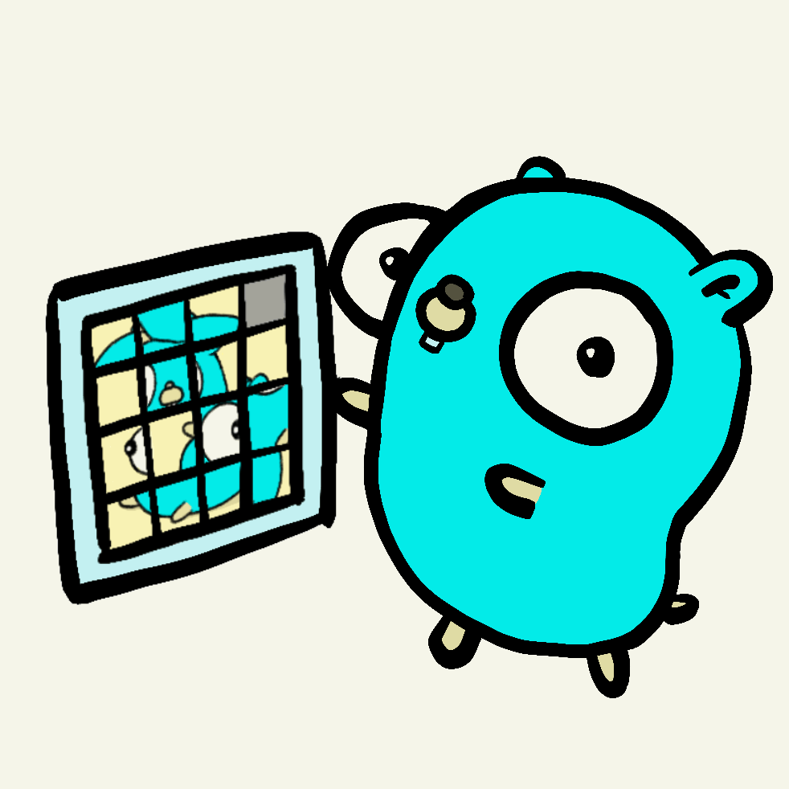

+++
title = "Go迎来15周年"
date = 2025-03-31T11:17:33+08:00
weight = 850
type = "docs"
description = ""
isCJKLanguage = true
draft = false

+++

> 原文：[https://go.dev/blog/15years](https://go.dev/blog/15years)

# Go Turns 15

Austin Clements, for the Go team

​	Go团队的Austin Clements

11 November 2024

​	2024年11月11日

*Thanks to Renee French for drawing and animating the gopher doing the “15 puzzle”.*

*感谢Renee French绘制并为进行“15拼图”的Gopher制作动画。*

Happy birthday, Go!

​	Go，生日快乐！

On Sunday, we celebrated the 15th anniversary of [the Go open source release](https://opensource.googleblog.com/2009/11/hey-ho-lets-go.html)!

​	周日，我们刚刚庆祝了[Go开源发布](https://opensource.googleblog.com/2009/11/hey-ho-lets-go.html)15周年！

So much has changed since [Go’s 10 year anniversary](https://go.dev/blog/10years), both in Go and in the world. In other ways, so much has stayed the same: Go remains committed to stability, safety, and supporting software engineering and production at scale.

​	自[Go十周年](https://go.dev/blog/10years)以来，Go和世界都发生了巨大变化。但有些核心原则始终未变：Go依然致力于稳定性、安全性，以及支持大规模软件工程和生产。

And Go is going strong! Go’s user base has more than tripled in the past five years, making it one of the fastest growing languages. From its beginnings just fifteen years ago, Go has become a top 10 language and the language of the modern cloud.	

​	Go势头正盛！过去五年间，Go用户群体增长了三倍以上，成为增长最快的编程语言之一。十五年前的初创之日，Go如今已跻身十大语言之列，并成为现代云时代的首选语言。

------

With the releases of [Go 1.22 in February](https://go.dev/blog/go1.22) and [Go 1.23 in August](https://go.dev/blog/go1.23), it’s been the year of `for` loops. Go 1.22 made variables introduced by `for` loops [scoped per iteration](https://go.dev/blog/loopvar-preview), rather than per loop, addressing a long-standing language “gotcha”. Over ten years ago, leading up to the release of Go 1, the Go team made decisions about several language details; among them whether `for` loops should create a new loop variable on each iteration. Amusingly, the discussion was quite brief and distinctly unopinionated. Rob Pike closed it out in true Rob Pike fashion with a single word: “stet” (leave it be). And so it was. While seemingly insignificant at the time, years of production experience highlighted the implications of this decision. But in that time, we also built robust tools for understanding the effects of changes to Go—notably, ecosystem-wide analysis and testing across the entire Google codebase—and established processes for working with the community and getting feedback. Following extensive testing, analysis, and community discussion, we rolled out the change, accompanied by a [hash bisection tool](https://go.googlesource.com/proposal/+/master/design/60078-loopvar.md#transition-support-tooling) to assist developers in pinpointing code affected by the change at scale.

​	随着[2月发布的Go 1.22](https://go.dev/blog/go1.22)和[8月发布的Go 1.23](https://go.dev/blog/go1.23)，这一年是`for`循环的革新之年。Go 1.22将`for`循环引入的变量作用域从“整个循环”改为[“每次迭代”](https://go.dev/blog/loopvar-preview)，解决了长期以来的语法“陷阱”。十多年前Go 1发布前夕，团队曾就语言细节进行过讨论，包括是否让`for`循环在每次迭代时新建循环变量。有趣的是，讨论极为简短且立场中立。Rob Pike以标志性的简洁回应定下基调：“stet”（维持原状）。尽管当时看似微不足道，但多年生产实践揭示了这一决策的深远影响。与此同时，我们构建了强大的工具链来评估Go变更的影响——例如，通过分析整个Google代码库的生态数据——并建立了与社区协作的流程。经过充分测试、分析和社区讨论后，我们推出这一变更，并配套提供[哈希二分工具](https://go.googlesource.com/proposal/+/master/design/60078-loopvar.md#transition-support-tooling)，帮助开发者定位受此变更影响的代码。

------

The change to `for` loops was part of a five year trajectory of measured changes. It would not have been possible without [forward language compatibility](https://go.dev/blog/toolchain) introduced in Go 1.21. This, in turn, built upon the foundation laid by Go modules, which were introduced in Go 1.14 four and a half years ago.

​	`for`循环的变更属于五年来渐进式演进的一部分。这一进展离不开Go 1.21引入的[向前语言兼容性](https://go.dev/blog/toolchain)。而向前兼容性本身又建立在Go模块（Go 1.14四年前引入的功能）奠定的基础之上。

------

Go 1.23 further built on this change to introduce iterators and [user-defined for-range loops](https://go.dev/blog/range-functions). Combined with generics—introduced in Go 1.18, just two and a half years ago!—this creates a powerful and ergonomic foundation for custom collections and many other programming patterns.

​	Go 1.23在此基础上进一步引入迭代器和[用户自定义的for-range循环](https://go.dev/blog/range-functions)。结合两年前引入的泛型（Go 1.18），这为自定义集合和多种编程模式提供了强大且符合直觉的基石。

------

These releases have also brought many improvements in production readiness, including [much-anticipated enhancements to the standard library’s HTTP router](https://go.dev/blog/routing-enhancements), a [total overhaul of execution traces](https://go.dev/blog/execution-traces-2024), and [stronger randomness](https://go.dev/blog/chacha8rand) for all Go applications. Additionally, the introduction of our [first v2 standard library package](https://go.dev/blog/randv2) establishes a template for future library evolution and modernization.

​	这些版本还带来了多项生产就绪改进，包括[标准库HTTP路由器的期待已久增强](https://go.dev/blog/routing-enhancements)、[执行追踪系统的全面重构](https://go.dev/blog/execution-traces-2024)以及[更安全的随机数生成](https://go.dev/blog/chacha8rand)。此外，[首个v2标准库包](https://go.dev/blog/randv2)的引入为未来库的演进和现代化提供了范式。

------

Over the past year we’ve also been cautiously rolling out [opt-in telemetry](https://go.dev/blog/gotelemetry) for Go tools. This system will give Go’s developers data to make better decisions, while remaining completely [open](https://telemetry.go.dev/) and anonymous. Go telemetry first appeared in [gopls](https://github.com/golang/tools/blob/master/gopls/README.md), the Go language server, where it has already led to a [litany of improvements](https://github.com/golang/go/issues?q=is%3Aissue+label%3Agopls%2Ftelemetry-wins). This effort paves the way to make programming in Go an even better experience for everyone.

过去一年，我们谨慎推出了[选择加入式遥测](https://go.dev/blog/gotelemetry)功能。该系统将为开发者提供数据支持，同时保持[完全开放](https://telemetry.go.dev/)和匿名性。Go遥测功能最初在Go语言服务器[gopls](https://github.com/golang/tools/blob/master/gopls/README.md)中引入，已催生了[大量改进](https://github.com/golang/go/issues?q=is%3Aissue+label%3Agopls%2Ftelemetry-wins)。这些努力将为所有人带来更优质的Go编程体验。

------

Looking forward, we’re evolving Go to better leverage the capabilities of current and future hardware. Hardware has changed a lot in the past 15 years. In order to ensure Go continues to support high-performance, large-scale production workloads for the *next* 15 years, we need to adapt to large multicores, advanced instruction sets, and the growing importance of locality in increasingly non-uniform memory hierarchies. Some of these improvements will be transparent. Go 1.24 will have a totally new `map` implementation under the hood that’s more efficient on modern CPUs. And we’re prototyping new garbage collection algorithms designed around the capabilities and constraints of modern hardware. Some improvements will be in the form of new APIs and tools so Go developers can better leverage modern hardware. We’re looking at how to support the latest vector and matrix hardware instructions, and multiple ways that applications can build in CPU and memory locality. A core principle guiding our efforts is *composable optimization*: the impact of an optimization on a codebase should be as localized as possible, ensuring that the ease of development across the rest of the codebase is not compromised.

​	展望未来，我们将继续优化Go以更好地利用当前和未来硬件的能力。过去十五年间硬件发生了巨大变化。为确保Go在未来十五年仍能支持高性能、大规模生产工作负载，我们需要适配多核处理器、先进指令集，以及非统一内存层级中日益凸显的局部性需求。部分改进将透明实现。例如，Go 1.24将采用全新的底层`map`实现，以提升现代CPU的效率。我们还在设计基于现代硬件能力与限制的新型垃圾回收算法。另一些改进将以新API和工具的形式呈现，帮助开发者更好地利用硬件资源。我们正在探索支持最新向量和矩阵硬件指令的方法，以及多种提升应用CPU和内存局部性的方案。我们的核心原则是*可组合优化*：优化对代码库的影响应尽可能局部化，确保其他部分的开发便捷性不受影响。

------

We’re continuing to ensure Go’s standard library is safe by default and safe by design. This includes ongoing efforts to incorporate built-in, native support for FIPS-certified cryptography, so that FIPS crypto will be just a flag flip away for applications that need it. Furthermore, we’re evolving Go’s standard library packages where we can and, following the example of `math/rand/v2`, considering where new APIs can significantly enhance the ease of writing safe and secure Go code.

​	我们持续确保Go标准库默认安全且设计安全。这包括为需要FIPS认证加密的应用程序提供原生支持，只需简单切换标志即可启用。此外，我们正改进标准库包，并借鉴`math/rand/v2`的范例，探索如何通过新API显著提升编写安全Go代码的便捷性。

------

We’re working on making Go better for AI—and AI better for Go—by enhancing Go’s capabilities in AI infrastructure, applications, and developer assistance. Go is a great language for building production systems, and we want it to be a great language for [building production *AI* systems](https://go.dev/blog/llmpowered), too. Go’s dependability as a language for Cloud infrastructure has made it a natural choice for [LLM](https://ollama.com/) [infrastructure](https://weaviate.io/) [as](https://localai.io/) [well](https://zilliz.com/what-is-milvus). For AI applications, we will continue building out first-class support for Go in popular AI SDKs, including [LangChainGo](https://pkg.go.dev/github.com/tmc/langchaingo) and [Genkit](https://developers.googleblog.com/en/introducing-genkit-for-go-build-scalable-ai-powered-apps-in-go/). And from its very beginning, Go aimed to improve the end-to-end software engineering process, so naturally we’re looking at bringing the latest tools and techniques from AI to bear on reducing developer toil, leaving more time for the fun stuff—like actually programming!

​	我们正努力让Go更适合AI开发，同时让AI更好地服务于Go。通过增强AI基础设施、应用和开发者工具的支持，Go将不仅是构建生产系统的优秀语言，也将成为[构建生产级AI系统](https://go.dev/blog/llmpowered)的首选。Go在云基础设施领域的可靠性使其自然成为[LLM](https://ollama.com/)、[向量数据库](https://weaviate.io/)、[本地推理](https://localai.io/)和[Milvus](https://zilliz.com/what-is-milvus)等领域的首选语言。对于AI应用，我们将继续在热门AI SDK（如[LangChainGo](https://pkg.go.dev/github.com/tmc/langchaingo)和[Genkit](https://developers.googleblog.com/en/introducing-genkit-for-go-build-scalable-ai-powered-apps-in-go/)）中提供对Go的一流支持。Go自诞生之初就致力于优化端到端软件工程流程，因此我们也在探索如何利用AI的最新工具和技术来减少开发者的重复劳动，留出更多时间专注于编程乐趣！

------

## Thank you 感谢

All of this is only possible because of Go’s incredible contributors and thriving community. Fifteen years ago we could only dream of the success that Go has become and the community that has developed around Go. Thank you to everyone who has played a part, large and small. We wish you all the best in the coming year.

​	这一切的实现离不开Go社区的卓越贡献者和蓬勃发展的开发者群体。十五年前，我们只能憧憬Go如今的成就和围绕它形成的社区。感谢每一位参与者，无论贡献大小。衷心祝愿大家在新的一年里一切顺利。