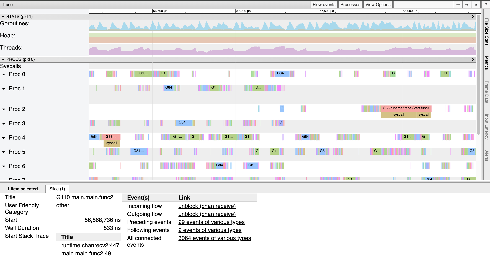

+++
title = "更强大的 Go 执行跟踪"
date = 2024-03-29T17:06:17+08:00
weight = 960
type = "docs"
description = ""
isCJKLanguage = true
draft = false

+++

> 原文：[https://go.dev/blog/execution-traces-2024](https://go.dev/blog/execution-traces-2024)

# More powerful Go execution traces 更强大的 Go 执行跟踪

Michael Knyszek

​	迈克尔·克尼塞克
14 March 2024

The [runtime/trace](https://go.dev/pkg/runtime/trace) package contains a powerful tool for understanding and troubleshooting Go programs. The functionality within allows one to produce a trace of each goroutine’s execution over some time period. With the [`go tool trace` command](https://go.dev/pkg/cmd/trace) (or the excellent open source [gotraceui tool](https://gotraceui.dev/)), one may then visualize and explore the data within these traces.

​	运行时/跟踪包包含一个强大的工具，用于理解和排除 Go 程序的故障。其中的功能允许人们在一段时间内生成每个 goroutine 执行的跟踪。使用命令 `go tool trace` （或出色的开源 gotraceui 工具），可以可视化和探索这些跟踪中的数据。

The magic of a trace is that it can easily reveal things about a program that are hard to see in other ways. For example, a concurrency bottleneck where lots of goroutines block on the same channel might be quite difficult to see in a CPU profile, because there’s no execution to sample. But in an execution trace, the *lack* of execution will show up with amazing clarity, and the stack traces of blocked goroutines will quickly point at the culprit.

​	跟踪的魔力在于，它可以很容易地揭示有关程序的信息，而这些内容在其他方面很难看到。例如，在 CPU 配置文件中可能很难看到大量 goroutine 阻塞在同一通道上的并发瓶颈，因为没有要采样的执行。但是在执行跟踪中，缺乏执行会以惊人的清晰度显示出来，并且被阻塞的 goroutine 的堆栈跟踪会很快指向罪魁祸首。



Go developers are even able to instrument their own programs with [tasks](https://go.dev/pkg/runtime/trace#Task), [regions](https://go.dev/pkg/runtime/trace#WithRegion), and [logs](https://go.dev/pkg/runtime/trace#Log) that they can use to correlate their higher-level concerns with lower-level execution details.

​	Go 开发人员甚至可以使用任务、区域和日志来检测自己的程序，他们可以使用这些任务、区域和日志来关联他们的高级关注点与较低级别的执行细节。

## Issues 问题

Unfortunately, the wealth of information in execution traces can often be out of reach. Four big issues with traces have historically gotten in the way.

​	不幸的是，执行跟踪中的大量信息往往是遥不可及的。历史上有四个带有痕迹的大问题。

- Traces had high overheads.
  跟踪的开销很高。
- Traces didn’t scale well, and could become too big to analyze.
  跟踪不能很好地扩展，并且可能变得太大而无法分析。
- It was often unclear when to start tracing to capture a specific bad behavior.
  通常不清楚何时开始追踪以捕获特定的不良行为。
- Only the most adventurous gophers could programmatically analyze traces, given the lack of a public package for parsing and interpreting execution traces.
  只有最有冒险精神的地鼠才能以编程方式分析跟踪，因为缺少用于解析和解释执行跟踪的公共包。

If you’ve used traces in the last few years, you’ve likely been frustrated by one or more of these problems. But we’re excited to share that over the last two Go releases we’ve made big progress in all four of these areas.

​	如果您在过去几年中使用过跟踪，则可能会对其中一个或多个问题感到沮丧。但我们很高兴地与大家分享，在过去的两个 Go 版本中，我们在这四个方面都取得了长足的进步。

## Low-overhead tracing 低开销跟踪

Prior to Go 1.21, the run-time overhead of tracing was somewhere between 10–20% CPU for many applications, which limits tracing to situational usage, rather than continuous usage like CPU profiling. It turned out that much of the cost of tracing came down to tracebacks. Many events produced by the runtime have stack traces attached, which are invaluable to actually identifying what goroutines were doing at key moments in their execution.

​	在 Go 1.21 之前，对于许多应用程序来说，跟踪的运行时开销在 10-20% CPU 之间，这限制了跟踪的情境使用情况，而不是像 CPU 分析那样的持续使用。事实证明，追踪的大部分成本都归结为追溯。运行时生成的许多事件都附加了堆栈跟踪，这对于实际识别 goroutine 在执行的关键时刻所做的事情非常宝贵。

Thanks to work by Felix Geisendörfer and Nick Ripley on optimizing the efficiency of tracebacks, the run-time CPU overhead of execution traces has been cut dramatically, down to 1–2% for many applications. You can read more about the work done here in [Felix’s great blog post](https://blog.felixge.de/reducing-gos-execution-tracer-overhead-with-frame-pointer-unwinding/) on the topic.

​	由于 Felix Geisendörfer 和 Nick Ripley 在优化回溯效率方面所做的工作，执行跟踪的运行时 CPU 开销已大幅降低，在许多应用程序中降至 1-2%。您可以在 Felix 关于该主题的精彩博客文章中阅读有关此处完成的工作的更多信息。

## Scalable traces 可扩展的跟踪

The trace format and its events were designed around relatively efficient emission, but required tooling to parse and keep around the state of the entirety of a trace. A few hundred MiB trace could require several GiB of RAM to analyze!

​	跟踪格式及其事件是围绕相对有效的发射而设计的，但需要工具来解析和保持整个跟踪的状态。几百 MiB 的跟踪可能需要几 GiB 的 RAM 来分析！

This issue is unfortunately fundamental to how traces are generated. To keep run-time overheads low, all events are written to the equivalent of thread-local buffers. But this means events appear out of their true order, and the burden is placed on the trace tooling to figure out what really happened.

​	不幸的是，此问题是如何生成跟踪的基础。为了保持较低的运行时开销，所有事件都写入等效的线程本地缓冲区。但这意味着事件会出现不正常的顺序，并且要让跟踪工具找出真正发生的事情。

The key insight to making traces scale while keeping overheads low was to occasionally split the trace being generated. Each split point would behave a bit like simultaneously disabling and reenabling tracing in one go. All the trace data so far would represent a complete and self-contained trace, while the new trace data would seamlessly pick up from where it left off.

​	在保持低开销的同时扩展跟踪的关键见解是偶尔拆分正在生成的跟踪。每个拆分点的行为有点像同时禁用和重新启用跟踪。到目前为止，所有跟踪数据都将代表一个完整且独立的跟踪，而新的跟踪数据将从中断的地方无缝地开始。

As you might imagine, fixing this required [rethinking and rewriting a lot of the foundation of the trace implementation](https://go.dev/issue/60773) in the runtime. We’re happy to say that the work landed in Go 1.22 and is now generally available. [A lot of nice improvements](https://go.dev/doc/go1.22#runtime/trace) came with the rewrite, including some improvements to the [`go tool trace` command](https://go.dev/doc/go1.22#trace) as well. The gritty details are all in the [design document](https://github.com/golang/proposal/blob/master/design/60773-execution-tracer-overhaul.md), if you’re curious.

​	正如你所想象的那样，解决这个问题需要重新思考和重写运行时中跟踪实现的大量基础。我们很高兴地说，这项工作已经登陆 Go 1.22，现在已经正式发布。重写带来了许多不错的改进，包括对 `go tool trace` 命令的一些改进。如果你好奇的话，这些细节都在设计文档中。

(Note: `go tool trace` still loads the full trace into memory, but [removing this limitation](https://go.dev/issue/65315) for traces produced by Go 1.22+ programs is now feasible.)

​	（注意： `go tool trace` 仍然会将完整的跟踪加载到内存中，但现在删除对 Go 1.22+ 程序生成的跟踪的限制是可行的。

## Flight recording 飞行记录

Suppose you work on a web service and an RPC took a very long time. You couldn’t start tracing at the point you knew the RPC was already taking a while, because the root cause of the slow request already happened and wasn’t recorded.

​	假设您在 Web 服务上工作，而 RPC 花费了很长时间。您无法在知道 RPC 已经需要一段时间时开始跟踪，因为缓慢请求的根本原因已经发生并且未记录。

There’s a technique that can help with this called flight recording, which you may already be familiar with from other programming environments. The insight with flight recording is to have tracing on continuously and always keep the most recent trace data around, just in case. Then, once something interesting happens, the program can just write out whatever it has!

​	有一种技术可以帮助解决这个问题，称为飞行记录，您可能已经从其他编程环境中熟悉了这种技术。飞行记录的见解是持续进行跟踪，并始终保留最新的跟踪数据，以防万一。然后，一旦发生了有趣的事情，程序就可以写出它所拥有的任何东西！

Before traces could be split, this was pretty much a non-starter. But because continuous tracing is now viable thanks to low overheads, and the fact that the runtime can now split traces any time it needs, it turns out it was straightforward to implement flight recording.

​	在可以拆分跟踪之前，这几乎是无用的。但是，由于开销低，连续跟踪现在是可行的，而且运行时现在可以随时拆分跟踪，因此事实证明，实现飞行记录非常简单。

As a result, we’re happy to announce a flight recorder experiment, available in the [golang.org/x/exp/trace package](https://go.dev/pkg/golang.org/x/exp/trace#FlightRecorder).

​	因此，我们很高兴地宣布一个飞行记录器实验，可在 golang.org/x/exp/trace 包中提供。

Please try it out! Below is an example that sets up flight recording to capture a long HTTP request to get you started.

​	请试试看！下面是一个示例，该示例设置了飞行记录以捕获长 HTTP 请求以帮助您入门。

```go
    // Set up the flight recorder.
    fr := trace.NewFlightRecorder()
    fr.Start()

    // Set up and run an HTTP server.
    var once sync.Once
    http.HandleFunc("/my-endpoint", func(w http.ResponseWriter, r *http.Request) {
        start := time.Now()

        // Do the work...
        doWork(w, r)

        // We saw a long request. Take a snapshot!
        if time.Since(start) > 300*time.Millisecond {
            // Do it only once for simplicity, but you can take more than one.
            once.Do(func() {
                // Grab the snapshot.
                var b bytes.Buffer
                _, err = fr.WriteTo(&b)
                if err != nil {
                    log.Print(err)
                    return
                }
                // Write it to a file.
                if err := os.WriteFile("trace.out", b.Bytes(), 0o755); err != nil {
                    log.Print(err)
                    return
                }
            })
        }
    })
    log.Fatal(http.ListenAndServe(":8080", nil))
```

If you have any feedback, positive or negative, please share it to the [proposal issue](https://go.dev/issue/63185)!

​	如果您有任何反馈，无论是正面的还是负面的，请分享到提案问题！

## Trace reader API 跟踪读取器 API

Along with the trace implementation rewrite came an effort to clean up the other trace internals, like `go tool trace`. This spawned an attempt to create a trace reader API that was good enough to share and that could make traces more accessible.

​	随着跟踪实现的重写，还努力清理其他跟踪内部结构，例如 `go tool trace` .这催生了创建跟踪读取器 API 的尝试，该 API 足以共享，并且可以使跟踪更易于访问。

Just like the flight recorder, we’re happy to announce that we also have an experimental trace reader API that we’d like to share. It’s available in the [same package as the flight recorder, golang.org/x/exp/trace](https://go.dev/pkg/golang.org/x/exp/trace#Reader).

​	就像飞行记录器一样，我们很高兴地宣布，我们还有一个实验性的跟踪读取器 API，我们想分享它。它与飞行记录器 golang.org/x/exp/trace 在同一包装中提供。

We think it’s good enough to start building things on top of, so please try it out! Below is an example that measures the proportion of goroutine block events that blocked to wait on the network.

​	我们认为它足够好了，可以开始在上面构建东西，所以请尝试一下！下面是一个示例，用于测量在网络上阻止等待的 goroutine 块事件的比例。

```go
    // Start reading from STDIN.
    r, err := trace.NewReader(os.Stdin)
    if err != nil {
        log.Fatal(err)
    }

    var blocked int
    var blockedOnNetwork int
    for {
        // Read the event.
        ev, err := r.ReadEvent()
        if err == io.EOF {
            break
        } else if err != nil {
            log.Fatal(err)
        }

        // Process it.
        if ev.Kind() == trace.EventStateTransition {
            st := ev.StateTransition()
            if st.Resource.Kind == trace.ResourceGoroutine {
                id := st.Resource.Goroutine()
                from, to := st.GoroutineTransition()

                // Look for goroutines blocking, and count them.
                if from.Executing() && to == trace.GoWaiting {
                    blocked++
                    if strings.Contains(st.Reason, "network") {
                        blockedOnNetwork++
                    }
                }
            }
        }
    }
    // Print what we found.
    p := 100 * float64(blockedOnNetwork) / float64(blocked)
    fmt.Printf("%2.3f%% instances of goroutines blocking were to block on the network\n", p)
```

And just like the flight recorder, there’s a [proposal issue](https://go.dev/issue/62627) that would be a great place to leave feedback!

​	就像飞行记录仪一样，有一个提案问题，这将是留下反馈的好地方！

We’d like to quickly call out Dominik Honnef as someone who tried it out early, provided great feedback, and has contributed support for older trace versions to the API.

​	我们想快速指出 Dominik Honnef 是他早期尝试过的人，提供了很好的反馈，并为 API 提供了对旧跟踪版本的支持。

## Thank you! 谢谢！

This work was completed, in no small part, thanks to the help of the those in the [diagnostics working group](https://go.dev/issue/57175), started over a year ago as a collaboration between stakeholders from across the Go community, and open to the public.

​	这项工作的完成在很大程度上要归功于诊断工作组的帮助，该工作组在一年多前开始，是整个 Go 社区利益相关者之间的合作，并向公众开放。

We’d like to take a moment to thank those community members who have attended the diagnostic meetings regularly over the last year: Felix Geisendörfer, Nick Ripley, Rhys Hiltner, Dominik Honnef, Bryan Boreham, thepudds.

​	我们想花点时间感谢那些在过去一年中定期参加诊断会议的社区成员：Felix Geisendörfer、Nick Ripley、Rhys Hiltner、Dominik Honnef、Bryan Boreham、thepudds。

The discussions, feedback, and work you all put in have been instrumental to getting us to where we are today. Thank you!

​	你们所有人的讨论、反馈和工作对我们取得今天的成就起到了重要作用。谢谢！