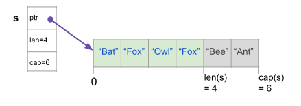
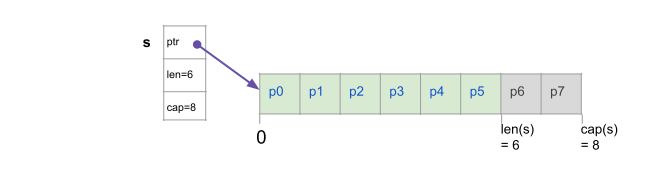
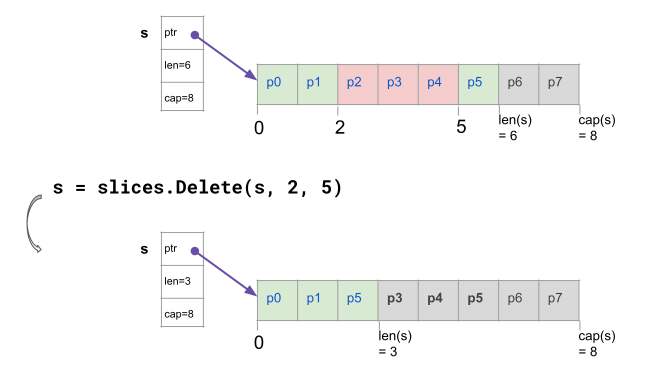
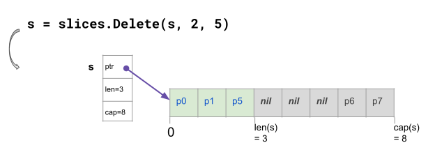
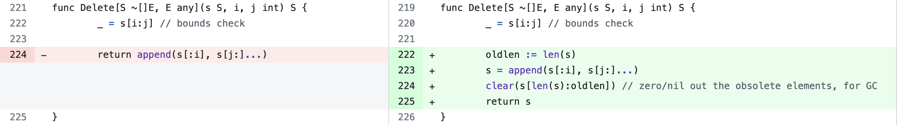

+++
title = "切片上可靠的泛型函数"
date = 2024-03-29T17:05:42+08:00
weight = 970
type = "docs"
description = ""
isCJKLanguage = true
draft = false

+++

> 原文：[https://go.dev/blog/generic-slice-functions](https://go.dev/blog/generic-slice-functions)

# Robust generic functions on slices 切片上可靠的泛型函数

Valentin Deleplace

​	瓦伦丁·德勒普拉斯
22 February 2024

The [slices](https://go.dev/pkg/slices) package provides functions that work for slices of any type. In this blog post we’ll discuss how you can use these functions more effectively by understanding how slices are represented in memory and how that affects the garbage collector, and we’ll cover how we recently adjusted these functions to make them less surprising.

​	slices 包提供了适用于任何类型的切片的函数。在这篇博文中，我们将通过了解切片在内存中的表示方式以及它如何影响垃圾回收器来讨论如何更有效地使用这些函数，我们将介绍我们最近如何调整这些函数以使其不那么令人惊讶。

With [Type parameters](https://go.dev/blog/deconstructing-type-parameters) we can write functions like [slices.Index](https://go.dev/pkg/slices#Index) once for all types of slices of comparable elements:

​	使用 Type 参数，我们可以编写像切片这样的函数。为所有类型的可比元素切片编制一次索引：

```go
// Index returns the index of the first occurrence of v in s,
// or -1 if not present.
func Index[S ~[]E, E comparable](s S, v E) int {
    for i := range s {
        if v == s[i] {
            return i
        }
    }
    return -1
}
```

It is no longer necessary to implement `Index` again for each different type of element.

​	不再需要为每个不同类型的元素再次实现 `Index` 。

The [slices](https://go.dev/pkg/slices) package contains many such helpers to perform common operations on slices:

​	slices 包包含许多此类帮助程序，用于对 slices 执行常见操作：

```go
    s := []string{"Bat", "Fox", "Owl", "Fox"}
    s2 := slices.Clone(s)
    slices.Sort(s2)
    fmt.Println(s2) // [Bat Fox Fox Owl]
    s2 = slices.Compact(s2)
    fmt.Println(s2)                  // [Bat Fox Owl]
    fmt.Println(slices.Equal(s, s2)) // false
```

Several new functions (`Insert`, `Replace`, `Delete`, etc.) modify the slice. To understand how they work, and how to properly use them, we need to examine the underlying structure of slices.

​	几个新函数（ `Insert` 、 `Replace` 、 `Delete` 等）修改了切片。为了了解它们是如何工作的，以及如何正确使用它们，我们需要检查切片的底层结构。

A slice is a view of a portion of an array. [Internally](https://go.dev/blog/slices-intro), a slice contains a pointer, a length, and a capacity. Two slices can have the same underlying array, and can view overlapping portions.

​	切片是数组的一部分的视图。在内部，切片包含指针、长度和容量。两个切片可以具有相同的基础数组，并且可以查看重叠部分。

For example, this slice `s` is a view on 4 elements of an array of size 6:

​	例如，此切片 `s` 是大小为 6 的数组的 4 个元素的视图：



If a function changes the length of a slice passed as a parameter, then it needs to return a new slice to the caller. The underlying array may remain the same if it doesn’t have to grow. This explains why [append](https://go.dev/blog/slices) and `slices.Compact` return a value, but `slices.Sort`, which merely reorders the elements, does not.

​	如果函数更改了作为参数传递的切片的长度，则它需要向调用方返回一个新切片。如果底层阵列不必增长，则它可能保持不变。这就解释了为什么追加并 `slices.Compact` 返回一个值，但 `slices.Sort` ，它只是对元素进行重新排序，而不是。

Consider the task of deleting a portion of a slice. Prior to generics, the standard way to delete the portion `s[2:5]` from the slice `s` was to call the [append](https://go.dev/ref/spec#Appending_and_copying_slices) function to copy the end portion over the middle portion:

​	考虑删除切片的一部分的任务。在泛型之前，从切片 `s` 中删除部分 `s[2:5]` 的标准方法是调用 append 函数将结束部分复制到中间部分：

```go
s = append(s[:2], s[5:]...)
```

The syntax was complex and error-prone, involving subslices and a variadic parameter. We added [slice.Delete](https://go.dev/pkg/slices#Delete) to make it easier to delete elements:

​	语法复杂且容易出错，涉及子切片和可变参数。我们添加了切片。删除以简化删除元素：

```go
func Delete[S ~[]E, E any](s S, i, j int) S {
       return append(s[:i], s[j:]...)
}
```

The one-line function `Delete` more clearly expresses the programmer’s intent. Let’s consider a slice `s` of length 6 and capacity 8, containing pointers:

​	单行函数 `Delete` 更清楚地表达了程序员的意图。让我们考虑一个长度为 6 和容量为 8 的切片 `s` ，其中包含指针：



This call deletes the elements at `s[2]`, `s[3]`, `s[4]` from the slice `s`:

​	此调用从切片 `s` 中删除 、 `s[3]` 处 `s[4]` `s[2]` 的元素：

```go
s = slices.Delete(s, 2, 5)
```



The gap at the indices 2, 3, 4 is filled by shifting the element `s[5]` to the left, and setting the new length to `3`.

​	通过将元素 `s[5]` 向左移动并将新长度设置为 `3` 来填充索引 2、3、4 处的间隙。

`Delete` need not allocate a new array, as it shifts the elements in place. Like `append`, it returns a new slice. Many other functions in the `slices` package follow this pattern, including `Compact`, `CompactFunc`, `DeleteFunc`, `Grow`, `Insert`, and `Replace`.

​	 `Delete` 不需要分配新的数组，因为它会将元素移动到位。像 一样 `append` ，它返回一个新切片。 `slices` 包中的许多其他函数都遵循此模式，包括 `Compact` 、 `CompactFunc` 、 、 `DeleteFunc` `Grow` 、 `Insert` 和 `Replace` 。

When calling these functions we must consider the original slice invalid, because the underlying array has been modified. It would be a mistake to call the function but ignore the return value:

​	调用这些函数时，我们必须认为原始切片无效，因为底层数组已被修改。调用函数但忽略返回值将是一个错误：

```go
    slices.Delete(s, 2, 5) // incorrect!
    // s still has the same length, but modified contents
```

## A problem of unwanted liveness 不需要的活体问题

Before Go 1.22, `slices.Delete` didn’t modify the elements between the new and original lengths of the slice. While the returned slice wouldn’t include these elements, the “gap” created at the end of the original, now-invalidated slice continued to hold onto them. These elements could contain pointers to large objects (a 20MB image), and the garbage collector would not release the memory associated with these objects. This resulted in a memory leak that could lead to significant performance issues.

​	在 Go 1.22 之前， `slices.Delete` 没有修改切片的新长度和原始长度之间的元素。虽然返回的切片不会包含这些元素，但在原始切片末尾创建的“间隙”（现已失效）继续保留它们。这些元素可以包含指向大型对象（20MB 图像）的指针，垃圾回收器不会释放与这些对象关联的内存。这会导致内存泄漏，从而导致严重的性能问题。

In this above example, we’re successfully deleting the pointers `p2`, `p3`, `p4` from `s[2:5]`, by shifting one element to the left. But `p3` and `p4` are still present in the underlying array, beyond the new length of `s`. The garbage collector won’t reclaim them. Less obviously, `p5` is not one of the deleted elements, but its memory may still leak because of the `p5` pointer kept in the gray part of the array.

​	在上面的这个例子中，我们通过向左移动一个元素，成功地 `p4` 从中删除了指针 `p2` ， `p3` from `s[2:5]` 。但是 `p3` 和 `p4` 仍然存在于基础数组中，超出了 的新 `s` 长度。垃圾回收器不会回收它们。不太明显的是， `p5` 它不是已删除的元素之一，但由于 `p5` 指针保留在数组的灰色部分，它的内存仍可能泄漏。

This could be confusing for developers, if they were not aware that “invisible” elements were still using memory.

​	这可能会让开发人员感到困惑，如果他们不知道“不可见”元素仍在使用内存。

So we had two options:

​	所以我们有两个选择：

- Either keep the efficient implementation of `Delete`. Let users set obsolete pointers to `nil` themselves, if they want to make sure the values pointed to can be freed.
  要么保持 . `Delete` 如果用户想要确保可以释放指向的值，则允许用户将过时的指针设置为 `nil` 自己。
- Or change `Delete` to always set the obsolete elements to zero. This is extra work, making `Delete` slightly less efficient. Zeroing pointers (setting them to `nil`) enables the garbage collection of the objects, when they become otherwise unreachable.
  或者更改 `Delete` 为始终将过时元素设置为零。这是额外的工作，效率 `Delete` 略低。将指针归零（将其设置为 `nil` ）可在对象变得无法访问时对对象进行垃圾回收。

It was not obvious which option was best. The first one provided performance by default, and the second one provided memory frugality by default.

​	目前尚不清楚哪种选择是最好的。第一个默认提供性能，第二个默认提供内存节俭。

## The fix 修复

A key observation is that “setting the obsolete pointers to `nil`” is not as easy as it seems. In fact, this task is so error-prone that we should not put the burden on the user to write it. Out of pragmatism, we chose to modify the implementation of the five functions `Compact`, `CompactFunc`, `Delete`, `DeleteFunc`, `Replace` to “clear the tail”. As a nice side effect, the cognitive load is reduced and users now don’t need to worry about these memory leaks.

​	一个关键的观察结果是，“将过时的指针设置为 `nil` ”并不像看起来那么容易。事实上，这个任务非常容易出错，我们不应该把编写它的负担放在用户身上。出于实用主义，我们选择修改五个函数 `Compact` 的实现， `CompactFunc` ， `Delete` `DeleteFunc` `Replace` 作为一个不错的副作用，认知负荷减少了，用户现在不需要担心这些内存泄漏。

In Go 1.22, this is what the memory looks like after calling Delete:

​	在 Go 1.22 中，这是调用 Delete 后的内存样子：



The code changed in the five functions uses the new built-in function [clear](https://go.dev/pkg/builtin#clear) (Go 1.21) to set the obsolete elements to the zero value of the element type of `s`:

​	在五个函数中更改的代码使用新的内置函数 clear （Go 1.21） 将过时的元素设置为元素类型的零值 `s` ：



The zero value of `E` is `nil` when `E` is a type of pointer, slice, map, chan, or interface.

​	的 `E` 零值是 `nil` when `E` 是一种指针、切片、地图、chan 或接口。

## Tests failing 测试失败

This change has led to some tests that passed in Go 1.21 now failing in Go 1.22, when the slices functions are used incorrectly. This is good news. When you have a bug, tests should let you know.

​	此更改导致一些在 Go 1.21 中通过的测试现在在 Go 1.22 中失败，因为切片函数使用不正确。这是个好消息。当你遇到错误时，测试应该会让你知道。

If you ignore the return value of `Delete`:

​	如果忽略 `Delete` ： 的返回值

```go
slices.Delete(s, 2, 3)  // !! INCORRECT !!
```

then you may incorrectly assume that `s` does not contain any nil pointer. [Example in the Go Playground](https://go.dev/play/p/NDHuO8vINHv).

​	那么你可能会错误地认为它 `s` 不包含任何 NIL 指针。Go Playground 中的示例。

If you ignore the return value of `Compact`:

​	如果忽略 `Compact` ： 的返回值

```go
slices.Sort(s) // correct
slices.Compact(s) // !! INCORRECT !!
```

then you may incorrectly assume that `s` is properly sorted and compacted. [Example](https://go.dev/play/p/eFQIekiwlnu).

​	那么你可能会错误地认为它 `s` 已正确分类和压缩。例。

If you assign the return value of `Delete` to another variable, and keep using the original slice:

​	如果将 的 `Delete` 返回值分配给另一个变量，并继续使用原始切片：

```go
u := slices.Delete(s, 2, 3)  // !! INCORRECT, if you keep using s !!
```

then you may incorrectly assume that `s` does not contain any nil pointer. [Example](https://go.dev/play/p/rDxWmJpLOVO).

​	那么你可能会错误地认为它 `s` 不包含任何 NIL 指针。例。

If you accidentally shadow the slice variable, and keep using the original slice:

​	如果您不小心将切片变量遮蔽，并继续使用原始切片：

```go
s := slices.Delete(s, 2, 3)  // !! INCORRECT, using := instead of = !!
```

then you may incorrectly assume that `s` does not contain any nil pointer. [Example](https://go.dev/play/p/KSpVpkX8sOi).

​	那么你可能会错误地认为它 `s` 不包含任何 NIL 指针。例。

## Conclusion 结论

The API of the `slices` package is a net improvement over the traditional pre-generics syntax to delete or insert elements.

​	 `slices` 该包的 API 是对删除或插入元素的传统预泛型语法的净改进。

We encourage developers to use the new functions, while avoiding the “gotchas” listed above.

​	我们鼓励开发人员使用新功能，同时避免上面列出的“陷阱”。

Thanks to the recent changes in the implementation, a class of memory leaks is automatically avoided, without any change to the API, and with no extra work for the developers.

​	由于最近实现的变化，一类内存泄漏被自动避免，无需对 API 进行任何更改，开发人员也无需进行额外的工作。

## Further reading 延伸阅读

The signature of the functions in the `slices` package is heavily influenced by the specifics of the representation of slices in memory. We recommend reading

​	 `slices` 包中函数的签名很大程度上受内存中切片表示的具体影响。我们推荐阅读

- [Go Slices: usage and internals
  Go Slices：用法和内部结构](https://go.dev/blog/slices-intro)
- [Arrays, slices: The mechanics of ‘append’
  数组、切片：“追加”的机制](https://go.dev/blog/slices)
- The [dynamic array](https://en.wikipedia.org/wiki/Dynamic_array) data structure
  动态数组数据结构
- The [documentation](https://go.dev/pkg/slices) of the package slices
  包切片的文档

The [original proposal](https://go.dev/issue/63393) about zeroing obsolete elements contains many details and comments.

​	关于将过时元素归零的原始提案包含许多细节和评论。