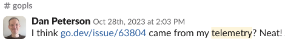
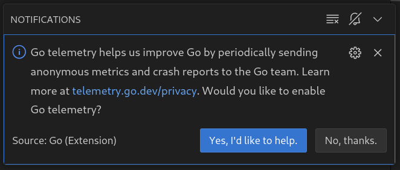
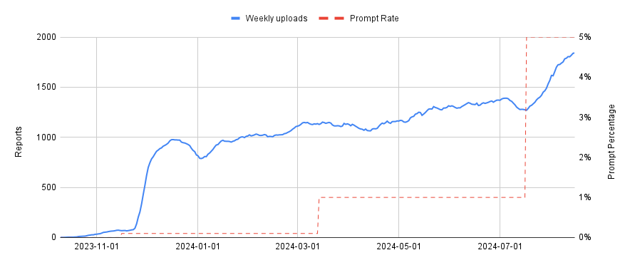
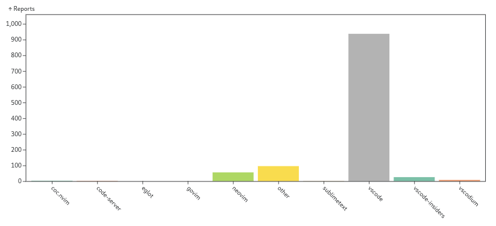
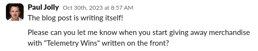

+++
title = "Go 1.23及以后版本的遥测"
date = 2024-09-06T12:20:29+08:00
weight = 890
type = "docs"
description = ""
isCJKLanguage = true
draft = false

+++

# Telemetry in Go 1.23 and beyond - Go 1.23及以后版本的遥测

> 原文：[https://go.dev/blog/gotelemetry](https://go.dev/blog/gotelemetry)

Robert Findley
3 September 2024

罗伯特·芬德利
2024年9月3日

Go 1.23 provides a new way for you to help improve the Go toolchain. By enabling [telemetry uploading](https://go.dev/doc/go1.23#telemetry), you can elect to share data about toolchain programs and their usage with the Go team. This data will help Go contributors fix bugs, avoid regressions, and make better decisions.

​	Go 1.23 提供了一种新的方式来帮助改进 Go 工具链。通过启用[遥测上传](https://go.dev/doc/go1.23#telemetry)，你可以选择与 Go 团队分享有关工具链程序及其使用的数据。这些数据将帮助 Go 贡献者修复错误、避免回归并做出更好的决策。

By default, Go telemetry data is stored only on your local computer. If you enable uploading, a [limited](https://go.dev/doc/telemetry#proposals) subset of your data is published weekly to [telemetry.go.dev](https://telemetry.go.dev/).

​	默认情况下，Go 的遥测数据只会存储在你的本地计算机上。如果你启用了上传，部分[有限的](https://go.dev/doc/telemetry#proposals)数据将每周发布到 [telemetry.go.dev](https://telemetry.go.dev/)。

Starting with Go 1.23, you can enable uploading of your local telemetry data with the following command:

​	从 Go 1.23 开始，你可以通过以下命令启用本地遥测数据的上传：

```sh
go telemetry on
```

To disable even local telemetry data collection, run the following command:

​	要禁用本地遥测数据收集，请运行以下命令：

```sh
go telemetry off
```

The [telemetry documentation](https://go.dev/doc/telemetry) contains a more detailed description of the implementation.

​	[遥测文档](https://go.dev/doc/telemetry)包含了实现的详细描述。

## Go 遥测的简要历史 A brief history of Go telemetry

While software telemetry is not a new idea, the Go team went through many iterations in search of a telemetry implementation that met Go’s requirements for performance, portability, and transparency.

​	虽然软件遥测并不是一个新概念，但 Go 团队在寻找满足 Go 性能、可移植性和透明性要求的遥测实现方面经历了多次迭代。

The initial [design](https://research.swtch.com/telemetry-design) aimed to be so unobtrusive, open, and privacy-preserving that it would be acceptable to enable by default, but many users raised concerns in a lengthy [public discussion](https://go.dev/issue/58409), and the design was ultimately [changed](https://research.swtch.com/telemetry-opt-in#campaign) to require explicit user consent for remote uploading.

​	最初的[设计](https://research.swtch.com/telemetry-design)旨在做到足够低调、开放且隐私保护，以至于可以默认启用，但在一次[公开讨论](https://go.dev/issue/58409)中，许多用户提出了担忧，最终该设计被[更改](https://research.swtch.com/telemetry-opt-in#campaign)为需要用户明确同意远程上传。

The new design was [accepted](https://go.dev/issue/58894) in April 2023, and implemented over that summer.

​	新的设计于 2023 年 4 月[被接受](https://go.dev/issue/58894)，并在那个夏天实施。

### gopls中的遥测 Telemetry in gopls

The first iteration of Go telemetry shipped in [v0.14](https://github.com/golang/tools/releases/tag/gopls%2Fv0.14.0) of the Go language server [`gopls`](https://go.googlesource.com/tools/+/refs/heads/master/gopls/), in October 2023. Following the launch, around 100 users enabled uploading, perhaps motivated by release notes or discussion in the [Gophers Slack](https://gophers.slack.com/messages/gopls/) channel, and data started to trickle in. It wasn’t long before telemetry found its first bug in gopls:

​	Go 遥测的首次迭代于 2023 年 10 月随 Go 语言服务器 [`gopls`](https://go.googlesource.com/tools/+/refs/heads/master/gopls/) 的[v0.14](https://github.com/golang/tools/releases/tag/gopls%2Fv0.14.0)版本发布。在发布后，大约有 100 名用户启用了上传，可能是受到发布说明或 [Gophers Slack](https://gophers.slack.com/messages/gopls/) 频道讨论的影响，并且数据开始缓慢流入。不久之后，遥测发现了 gopls 中的第一个错误：



A stack trace Dan noticed in his uploaded telemetry data led to a bug being reported and fixed. It's worth pointing out that we had no idea who had reported the stack.

​	丹在他的上传遥测数据中注意到的堆栈跟踪导致报告并修复了一个错误。值得指出的是，我们不知道是谁报告了该堆栈。


### IDE 提示 IDE Prompting

While it was great to see telemetry working in practice, and we appreciated the support of those early adopters, 100 participants isn’t enough to measure the types of things we want to measure.

​	尽管看到遥测在实践中工作很好，而且我们感谢那些早期采用者的支持，但 100 名参与者还不足以测量我们想要测量的内容。

As Russ Cox [pointed out](https://research.swtch.com/telemetry-opt-in#campaign) in his original blog posts, a drawback of the off-by-default approach for telemetry is the continuous need to encourage participation. It takes outreach to maintain a sample of users that’s big enough for meaningful quantitative data analysis, and representative of the user population. While blog posts and release notes can boost participation (and we’d appreciate it if you would enable telemetry after reading this!), they lead to a skewed sample. For example, we received almost no data for `GOOS=windows` from early adopters of telemetry in gopls.

​	正如 Russ Cox [指出的](https://research.swtch.com/telemetry-opt-in#campaign)，遥测默认关闭的做法的一个缺点是需要不断鼓励参与。需要开展宣传活动，以保持足够大的用户样本，以进行有意义的定量数据分析，并且样本必须具有代表性。博客文章和发布说明可以提升参与度（如果你在阅读本文后启用了遥测，我们会很感激！），但这会导致样本的偏差。例如，我们几乎没有收到早期采用者在 `GOOS=windows` 环境下的遥测数据。

To help reach more users, we introduced a [prompt](https://go.dev/doc/telemetry#ide) in the [VS Code Go plugin](https://marketplace.visualstudio.com/items?itemName=golang.go) asking users if they want to enable telemetry:

​	为了帮助接触更多用户，我们在 [VS Code Go 插件](https://marketplace.visualstudio.com/items?itemName=golang.go)中引入了一个[提示](https://go.dev/doc/telemetry#ide)，询问用户是否要启用遥测：



The telemetry prompt, as displayed by VS Code.

​	VS Code 显示的遥测提示。

As of this blog post, the prompt has rolled out to 5% of VS Code Go users, and the telemetry sample has grown to around 1800 weekly participants:

​	截至本文撰写时，该提示已推送给 5% 的 VS Code Go 用户，遥测样本已增加到大约每周 1800 名参与者：



Prompting helps reach more users.

​	提示帮助接触到更多用户。

(The initial bump is likely due to prompting *all* users of the [VS Code Go nightly](https://marketplace.visualstudio.com/items?itemName=golang.go-nightly) extension).

​	（最初的提升可能是因为向 [VS Code Go nightly](https://marketplace.visualstudio.com/items?itemName=golang.go-nightly)扩展的*所有*用户发出了提示）。

However, it has introduced a noticeable skew toward VS Code users, as compared to the [most recent Go survey results](https://go.dev/blog/survey2024-h1-results.md):

​	然而，这也导致了向 VS Code 用户的明显倾斜，与最近的[Go 调查结果](https://go.dev/blog/survey2024-h1-results.md)相比：



We suspect that VS Code is overrepresented in telemetry data.

​	我们怀疑 VS Code 在遥测数据中占比过高。

We’re planning to address this skew by [prompting all LSP-capable editors that use gopls](https://go.dev/issue/67821), using a feature of the language server protocol itself.

​	我们计划通过[向所有使用 gopls 的支持 LSP 的编辑器推送提示](https://go.dev/issue/67821)来解决这个问题，利用语言服务器协议本身的功能。

### 遥测成果 Telemetry wins

Out of caution, we proposed the collection of only a few basic metrics for the initial launch of telemetry in gopls. One of those was the [`gopls/bug`](https://go.dev/issue/62249) [stack counter](https://go.dev/doc/telemetry#stack-counters), which records unexpected or “impossible” conditions encountered by gopls. In effect, it’s a kind of assertion, but instead of stopping the program, it records in telemetry that it was reached in some execution, along with the stack.

​	出于谨慎考虑，我们在 gopls 遥测的初次发布中提议仅收集一些基本的指标。其中之一是 [`gopls/bug`](https://go.dev/issue/62249)[堆栈计数器](https://go.dev/doc/telemetry#stack-counters)，它记录了 gopls 遇到的意外或“不可能”的情况。实际上，这是一种断言，但它并不会停止程序，而是在遥测中记录该执行中达到了该断言，以及相关的堆栈信息。

During our [gopls scalability](https://go.dev/blog/gopls-scalability.md) work, we had added many assertions of this kind, but we rarely observed them to fail in tests or in our own usage of gopls. We expected that almost all of these assertions were unreachable.

​	在我们进行 [gopls 可扩展性](https://go.dev/blog/gopls-scalability.md)工作的过程中，我们添加了许多此类断言，但在测试或我们自己的 gopls 使用中，它们很少失败。我们原本以为这些断言几乎都不可达。

As we started prompting random users in VS Code to enable telemetry, we saw that many of these conditions *were* reached in practice, and the context of the stack trace was often sufficient for us to reproduce and fix long-standing bugs. We started collecting these issues under the [`gopls/telemetry-wins`](https://github.com/golang/go/issues?q=is%3Aissue+label%3Agopls%2Ftelemetry-wins) label, to keep track of “wins” facilitated by telemetry.

​	随着我们开始向 VS Code 的随机用户发出启用遥测的提示，我们发现这些情况确实在实践中会出现，而堆栈跟踪的上下文通常足以让我们重现并修复长期存在的错误。我们开始将这些问题归类到 [`gopls/telemetry-wins`](https://github.com/golang/go/issues?q=is%3Aissue+label%3Agopls%2Ftelemetry-wins) 标签下，以记录通过遥测实现的“胜利”。

I’ve come to think of “telemetry wins” with a second meaning: when comparing gopls development with and without telemetry, *telemetry wins*.

​	我开始认为“遥测胜利”有了第二层含义：在有无遥测的情况下进行 gopls 开发时，*遥测总是胜利的*。



Thank you Paul for the suggestions.

​	感谢 Paul 的建议。

The most surprising aspect of the bugs coming from telemetry was how many of them were *real*. Sure, some of them were invisible to users, but a good number of them were actual misbehaviors of gopls–things like missing cross references, or subtly inaccurate completion under certain rare conditions. They were exactly the sort of things that a user might be mildly annoyed by but probably wouldn’t bother to report as an issue. Perhaps the user would assume that the behavior was intended. If they did report an issue, they might not be sure how to reproduce the bug, or we’d need a long back-and-forth on the issue tracker to capture a stack trace. Without telemetry, there is *no reasonable way* that most of these bugs would have been discovered, much less fixed.

​	通过遥测发现的错误中，最令人惊讶的是其中有多少是真实存在的。当然，其中一些对用户不可见，但相当一部分确实是 gopls 的实际误行为——例如，丢失的交叉引用，或者在某些罕见情况下不准确的自动完成。正是这些问题可能会让用户感到轻微的不满，但很可能不会作为问题报告。用户可能会认为这种行为是预期的。如果他们确实报告了问题，可能也不确定如何重现该错误，或者我们需要在问题追踪器上进行长时间的往返讨论以获取堆栈跟踪。没有遥测，*几乎不可能*发现并修复大多数这些错误。

And all this was from only a few counters. We’d only instrumented stack traces for the potential bugs *we knew about*. What about problems we didn’t anticipate?

​	而这一切仅来自少量的计数器。我们仅对我们已知的潜在错误进行了堆栈跟踪，那么还有那些我们未预料到的问题呢？

### 自动崩溃报告 Automated crash reporting

Go 1.23 includes a new [`runtime.SetCrashOutput`](https://go.dev/doc/go1.23#runtimedebugpkgruntimedebug) API that can be used to implement automated crash reporting via a watchdog process. Starting with [v0.15.0](https://github.com/golang/tools/releases/tag/gopls%2Fv0.15.0), gopls reports a `crash/crash` stack counter when it crashes, *provided gopls itself is built with Go 1.23*.

​	Go 1.23 包含一个新的 [`runtime.SetCrashOutput`](https://go.dev/doc/go1.23#runtimedebugpkgruntimedebug) API，可用于通过监控进程实现自动崩溃报告。从 [v0.15.0](https://github.com/golang/tools/releases/tag/gopls%2Fv0.15.0) 开始，如果 gopls 本身是用 Go 1.23 构建的，当 gopls 崩溃时，它会报告一个 `crash/crash` 堆栈计数器。

When we released gopls@v0.15.0, only a handful of users in our sample had built gopls using an unreleased development build of Go 1.23, yet the new `crash/crash` counter still found [two bugs](https://github.com/golang/tools/releases/tag/gopls%2Fv0.15.2).

​	当我们发布 gopls@v0.15.0 时，我们样本中只有少数用户使用未发布的 Go 1.23 开发版本构建了 gopls，但新的 `crash/crash` 计数器仍然发现了[两个错误](https://github.com/golang/tools/releases/tag/gopls%2Fv0.15.2)。

## Go 工具链中的遥测及其未来 Telemetry in the Go toolchain and beyond

Given how useful telemetry has proven with only a tiny amount of instrumentation and a fraction of our target sample, the future looks bright.

​	鉴于遥测在只有少量的监测并且样本只占目标样本的一小部分时已经证明了其巨大的价值，未来前景光明。

Go 1.23 records telemetry within the Go toolchain, including the `go` command and other tools such as the compiler, linker, and `go vet`. We’ve added telemetry to `vulncheck` and the VS Code Go plugin, and [we propose](https://go.dev/issue/68384) to add it to `delve` as well.

​	Go 1.23 在 Go 工具链中记录遥测数据，包括 `go` 命令及其他工具（如编译器、链接器和 `go vet`）。我们已经在 `vulncheck` 和 VS Code Go 插件中添加了遥测，并且[我们提议](https://go.dev/issue/68384)将其添加到 `delve` 中。

The original telemetry blog series brainstorms [many ideas](https://research.swtch.com/telemetry-uses) for how telemetry could be used to improve Go. We’re looking forward to exploring those ideas and more.

​	最初的遥测博客系列中头脑风暴了许多关于如何使用遥测来改进 Go 的[想法](https://research.swtch.com/telemetry-uses)。我们期待探索这些想法以及更多新的想法。

Within gopls, we plan to use telemetry to improve reliability and inform decision making and prioritization. With the automated crash reporting enabled by Go 1.23, we expect to catch many more crashes in prerelease testing. Going forward, we’ll add more counters to measure the user experience–latency of key operations, frequency of use of various features–so that we can focus our efforts where they will most benefit Go developers.

​	在 gopls 中，我们计划利用遥测提高可靠性，并为决策和优先级设定提供信息支持。随着 Go 1.23 启用的自动崩溃报告，我们预计在预发布测试中将捕获到更多的崩溃。展望未来，我们将添加更多计数器来衡量用户体验——例如关键操作的延迟、各种功能的使用频率——以便我们可以将精力集中在最能造福 Go 开发者的地方。

Go turns 15 this November, and both the language and its ecosystem continue to grow. Telemetry will play a critical role in helping Go contributors move faster and more safely, in the right direction.

​	Go 将在今年 11 月迎来 15 周年，语言及其生态系统仍在不断增长。遥测将在帮助 Go 贡献者更快、更安全地朝正确方向前进方面发挥关键作用。
