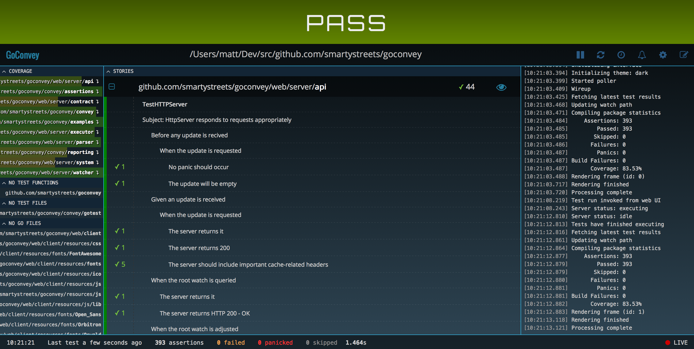
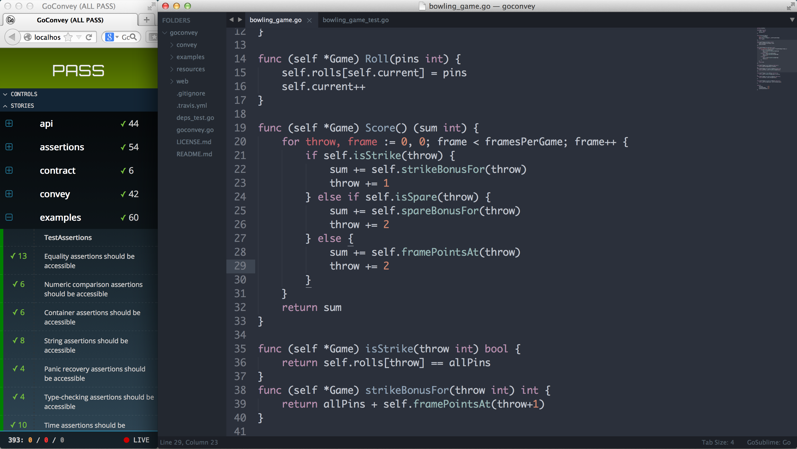

+++
title = "goconvey"
date = 2024-12-15T11:16:02+08:00
weight = 1
type = "docs"
description = ""
isCJKLanguage = true
draft = false

+++

> 原文：[https://github.com/smartystreets/goconvey/blob/master/README.md](https://github.com/smartystreets/goconvey/blob/master/README.md)
>
> 收录该文档时间： `2024-12-15T11:16:02+08:00`

> SMARTY DISCLAIMER: Subject to the terms of the associated license agreement, this software is freely available for your use. This software is FREE, AS IN PUPPIES, and is a gift. Enjoy your new responsibility. This means that while we may consider enhancement requests, we may or may not choose to entertain requests at our sole and absolute discretion.
>
> ​	SMARTY免责声明：依据相关许可协议的条款，您可以免费使用本软件。此软件是免费赠送的，就像小狗一样，是一份礼物。请享受您的新责任。这意味着，尽管我们可能会考虑功能增强的请求，但是否采纳完全取决于我们的唯一且绝对的裁量权。


# GoConvey is awesome Go testing - GoConvey 是一款优秀的 Go 测试工具


Welcome to GoConvey, a yummy Go testing tool for gophers. Works with `go test`. Use it in the terminal or browser according to your viewing pleasure.

​	欢迎使用 GoConvey，一款专为 gopher 打造的美味 Go 测试工具。它可与 `go test` 配合使用，并可根据您的喜好选择在终端或浏览器中查看测试结果。

GoConvey supports the current versions of Go (see the official Go [release policy](https://golang.org/doc/devel/release#policy)). Currently this means Go 1.16 and Go 1.17 are supported.

​	GoConvey 支持当前版本的 Go（请参见官方 Go [发布政策](https://golang.org/doc/devel/release#policy)）。目前支持 Go 1.16 和 Go 1.17。

**功能：Features:**

- Directly integrates with `go test`
  - 直接集成 `go test`

- Fully-automatic web UI (works with native Go tests, too)
  - 全自动 Web UI（也支持原生 Go 测试）

- Huge suite of regression tests
  - 大量回归测试套件

- Shows test coverage
  - 显示测试覆盖率

- Readable, colorized console output (understandable by any manager, IT or not)
  - 可读的、彩色的控制台输出（让任何人都能看懂，无论是否从事 IT 工作）

- Test code generator
  - 测试代码生成器

- Desktop notifications (optional)
  - 桌面通知（可选）

- Immediately open problem lines in [Sublime Text](http://www.sublimetext.com/) ([some assembly required](https://github.com/asuth/subl-handler))
  - 可立即在 [Sublime Text](http://www.sublimetext.com/) 中打开问题行（[需要一些配置](https://github.com/asuth/subl-handler)）


You can ask questions about how to use GoConvey on [StackOverflow](http://stackoverflow.com/questions/ask?tags=goconvey,go&title=GoConvey%3A ). Use the tags `go` and `goconvey`.

​	您可以在 [StackOverflow](http://stackoverflow.com/questions/ask?tags=goconvey,go&title=GoConvey%3A) 上提问关于如何使用 GoConvey 的问题。请使用 `go` 和 `goconvey` 标签。

## Installation


```sh
$ go install github.com/smartystreets/goconvey
```


## [Quick start](https://github.com/smartystreets/goconvey/wiki#get-going-in-25-seconds)


Make a test, for example:

​	创建一个测试，例如：

```go
package package_name

import (
    "testing"
    . "github.com/smartystreets/goconvey/convey"
)

func TestSpec(t *testing.T) {

	// Only pass t into top-level Convey calls
    // 仅将 t 传递给顶级的 Convey 调用
	Convey("Given some integer with a starting value", t, func() {
		x := 1

		Convey("When the integer is incremented", func() {
			x++

			Convey("The value should be greater by one", func() {
				So(x, ShouldEqual, 2)
			})
		})
	})
}
```


#### [In the browser](https://github.com/smartystreets/goconvey/wiki/Web-UI)


Start up the GoConvey web server at your project's path:

​	在您的项目路径下启动 GoConvey Web 服务器：

```sh
$ $GOPATH/bin/goconvey
```


Then watch the test results display in your browser at:

​	然后在浏览器中查看测试结果显示：

```sh
http://localhost:8080
```


If the browser doesn't open automatically, please click [http://localhost:8080](http://localhost:8080/) to open manually.

​	如果浏览器未自动打开，请手动点击 [http://localhost:8080](http://localhost:8080/) 打开。

There you have it. 

​	这就是全部内容了。

[](https://camo.githubusercontent.com/cdb4799cb178a33dc6fbd7ddb52d01fab602a8c40879b6c7b9865b52570e3baf/687474703a2f2f643739693166787372617234742e636c6f756466726f6e742e6e65742f676f636f6e7665792e636f2f67632d312d6461726b2e706e67) As long as GoConvey is running, test results will automatically update in your browser window.

​	只要 GoConvey 在运行，测试结果将自动更新到您的浏览器窗口中。

[](https://camo.githubusercontent.com/97120deb65576d4982f0531defe5587ebc25c2737d7d93ac2b47edf0d4f5eaf9/687474703a2f2f643739693166787372617234742e636c6f756466726f6e742e6e65742f676f636f6e7665792e636f2f67632d352d6461726b2e706e67) The design is responsive, so you can squish the browser real tight if you need to put it beside your code.

​	设计是响应式的，因此您可以将浏览器窗口挤得很小，以便放在代码旁边。

The [web UI](https://github.com/smartystreets/goconvey/wiki/Web-UI) supports traditional Go tests, so use it even if you're not using GoConvey tests.

​	[Web UI](https://github.com/smartystreets/goconvey/wiki/Web-UI) 支持传统的 Go 测试，因此即使不使用 GoConvey 测试也可以使用它。

#### [In the terminal](https://github.com/smartystreets/goconvey/wiki/Execution)


Just do what you do best:

​	像往常一样执行：

```sh
$ go test
```


Or if you want the output to include the story:

​	或者如果希望输出包括完整的测试过程：

```sh
$ go test -v
```


## [Documentation](https://github.com/smartystreets/goconvey/wiki)


Check out the

​	请查看：

- [GoConvey wiki](https://github.com/smartystreets/goconvey/wiki),
- [http://godoc.org/github.com/smartystreets/goconvey](http://godoc.org/github.com/smartystreets/goconvey)
- and the `*_test.go` files scattered throughout this project.
  - 以及项目中分布的 `*_test.go` 文件。


## Contributors


GoConvey is brought to you by [SmartyStreets](https://github.com/smartystreets) and [several contributors](https://github.com/smartystreets/goconvey/graphs/contributors) (Thanks!).

​	GoConvey 由 [SmartyStreets](https://github.com/smartystreets) 和 [多位贡献者](https://github.com/smartystreets/goconvey/graphs/contributors)（感谢！）共同完成。
