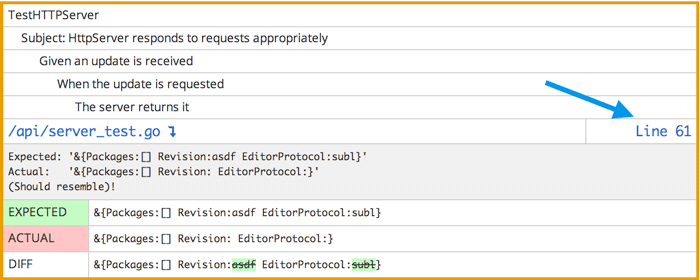
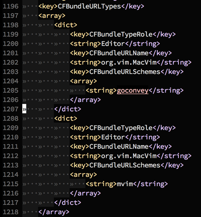
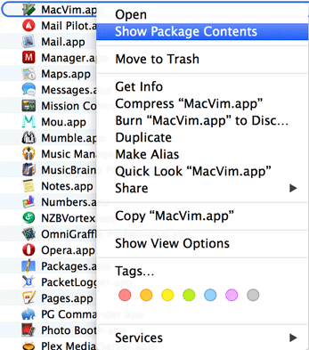
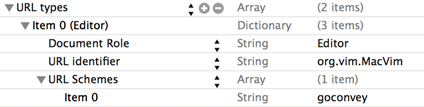
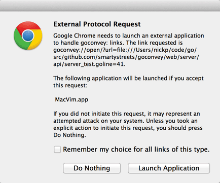

+++
title = "从 Web UI 打开编辑器中的文件"
date = 2024-12-15T11:22:05+08:00
weight = 12
type = "docs"
description = ""
isCJKLanguage = true
draft = false

+++

> 原文：[https://github.com/smartystreets/goconvey/wiki/Opening-files-in-your-editor-from-the-Web-UI](https://github.com/smartystreets/goconvey/wiki/Opening-files-in-your-editor-from-the-Web-UI)
>
> 收录该文档时间： `2024-12-15T11:22:05+08:00`

# Opening files in your editor from the Web UI - 从 Web UI 打开编辑器中的文件


Peter Rosell edited this page on Mar 26, 2018 · [4 revisions](https://github.com/smartystreets/goconvey/wiki/Opening-files-in-your-editor-from-the-Web-UI/_history)

​	Peter Rosell 于 2018 年 3 月 26 日编辑了此页面 · [4 次修订](https://github.com/smartystreets/goconvey/wiki/Opening-files-in-your-editor-from-the-Web-UI/_history)

You may have noticed when your tests fail, GoConvey provides a link directly to the failing line in the file:

​	您可能注意到，当测试失败时，GoConvey 会提供一个直接链接到文件失败行的链接：



To enable these links, you need to register a custom URL Scheme handler for your platform. The name of the custom URL Scheme is `goconvey` (clever, huh?).

​	要启用这些链接，您需要为您的平台注册一个自定义 URL 协议处理器。自定义 URL 协议的名称是 `goconvey`。

## OSX


In this example, I will be using MacVim. If you're using Sublime, you will want to change the path to your Sublime installation.

​	以下以 MacVim 为例。如果您使用的是 Sublime，请更改为您的 Sublime 安装路径。

- Find the application you want to handle the `goconvey` URL protocol handler: `/Applications/MacVim.app`

  - 找到要处理 `goconvey` URL 协议的应用程序：`/Applications/MacVim.app`

- Edit the `Info.plist` file. There are two ways to do this: 编辑其`Info.plist`文件，有两种方式：

  - Using your terminal: 使用终端：

    - Edit `/Applications/MacVim.app/Contents/Info.plist`
    - Find the section that has `<key>CFBundleURLTypes</key>`
      - 找到 `<key>CFBundleURLTypes</key>` 部分

    - Add a new `<dict>` entry that looks like this (lines 1198 - 1207):
      - 添加一个新的 `<dict>` 条目，例如（位于第 1198-1207 行）：


    
    
    If you don't have an `<array>` section, then create it.

  - Using the GUI 使用图形界面：

    - In Finder, navigation to the Applications folder and right click on your application and click "Show Package Contents":
      - 在 Finder 中导航到应用程序文件夹，右键点击应用程序并选择“显示包内容”：
    

    
    
    - Open up the Contents folder and double click on the `Info.plist` file.
      - 打开 Contents 文件夹并双击 `Info.plist` 文件。

    - Find the section labeled `URL types`:
      - 找到标记为 `URL types` 的部分：
    

    

    - Expand the section and create an entry (by clicking on the "plus" icon) that looks like this:
      - 展开该部分，创建一个新条目（点击“加号”），类似于：
    
    
    
    
    You want to select `Editor` as the `Document Role`, and the string entry inside the `URL Schemes` section **must** be `goconvey`.
    
    ​	将 `Document Role` 设置为 `Editor`，并在 `URL Schemes` 部分中的字符串条目必须为 `goconvey`。
    
    - After you edit this file, you must "update" your application: `touch /Applications/MacVim.app/`
      - 编辑完成后，需更新应用程序：`touch /Applications/MacVim.app/`

If everything went well, you should click on the `Line #` link in GoConvey's web UI and get a prompt from your browser:

​	配置完成后，点击 GoConvey Web UI 中的 `Line #` 链接，浏览器会提示您：



Click "Launch Application" (and you'll probably want to check the "Remember..." checkbox as well.

​	点击“启动应用程序”（建议勾选“记住...”）。

## Windows


Until someone comes up with a good tutorial, here are some resources:

​	暂时没有具体教程，以下是一些资源：

- http://msdn.microsoft.com/en-us/library/aa767914(v=vs.85).aspx
  - MSDN：自定义协议

- http://stackoverflow.com/questions/389204/how-do-i-create-my-own-url-protocol-e-g-so
  - StackOverflow：创建自定义 URL 协议


## Linux


To install a customer schema handler, at least in Ubuntu, you can use the script below. It will install a script that handles the links in GoConvey's web GUI and formats it to work with the browsers, at least Visual Studio Code and Sublime. It will also register a desktop handler for the goconvey:// schema.

​	要在 Ubuntu 中安装自定义协议处理器，可以使用以下脚本。它将安装一个脚本来处理 GoConvey 的 Web GUI 链接，并格式化以适配浏览器，至少支持 Visual Studio Code 和 Sublime。它还会为 `goconvey://` 协议注册一个桌面处理器。

It uses your default editor if the environment variable EDITOR is set. If you like to use a separate editor just for goconvey links, you can set GOCONVEY_EDITOR. Some editor need extra flags to handle filenames with line number. These flags can be set in GOCONVEY_EDITOR_FLAGS. If no editor environment variables are set it defaults to Visual Studio Code.

​	如果环境变量 `EDITOR` 已设置，则脚本使用默认编辑器。如果您希望为 GoConvey 链接使用单独的编辑器，可以设置 `GOCONVEY_EDITOR`。某些编辑器需要额外的标志以支持带有行号的文件名，这些标志可以通过 `GOCONVEY_EDITOR_FLAGS` 设置。如果未设置任何编辑器相关的环境变量，脚本将默认使用 Visual Studio Code。

This script is tested on Ubuntu 16.04 with Unity.

​	此脚本在 Ubuntu 16.04 的 Unity 桌面环境中经过测试。

Save the content below in a file and run it as root.

​	将以下内容保存到文件中，并以 root 权限运行：

```
#!/usr/bin/env bash

cat <<EOF-HANDLER > /usr/bin/goconvey-handler
#!/usr/bin/env bash
request="\${1#*://}"             # Remove schema from url (goconvey://)
request="\${request#*?url=}"     # Remove open?url=
request="\${request#*://}"       # Remove file://
request="\${request//%2F//}"     # Replace %2F with /
request="\${request/&line=/:}"   # Replace &line= with :
request="\${request/&column=/:}" # Replace &column= with :
if [ -n "\${GOCONVEY_EDITOR}" ]; then
    \$GOCONVEY_EDITOR \$GOCONVEY_EDITOR_FLAGS "\$request"    # Launch specified goconvey editor
elif [ -n "\${EDITOR}" ]; then
    \$EDITOR \$GOCONVEY_EDITOR_FLAGS "\$request"             # Launch default editor
else
    code -g "\$request"                                    # Launch code as editor
fi
EOF-HANDLER

cat <<EOF-DESKTOP > /usr/share/applications/goconvey-handler.desktop
[Desktop Entry]
Name=GoConvey URL Handler
GenericName=Text Editor
Comment=Handle URL Scheme goconvey://
Exec=/usr/bin/goconvey-handler %u
Terminal=false
Type=Application
MimeType=x-scheme-handler/goconvey;
Icon=code
Categories=TextEditor;Development;Utility;
Name[en_US]=GoConvey URL handler
EOF-DESKTOP

chmod +x /usr/bin/goconvey-handler
update-desktop-database
xdg-mime default /usr/share/applications/goconvey-handler.desktop x-scheme-handler/goconvey
```


Here are some resources:

- https://stackoverflow.com/questions/411544/custom-protocol-in-linux
  - [StackOverflow：Linux 自定义协议](https://stackoverflow.com/questions/411544/custom-protocol-in-linux)
- https://askubuntu.com/questions/527166/how-to-set-subl-protocol-handler-with-unity
  - [AskUbuntu：Unity 协议处理器设置](https://askubuntu.com/questions/527166/how-to-set-subl-protocol-handler-with-unity)
- https://gist.github.com/peterrosell/bf44a86cf0c6df920ce88a01c828cfdc
  - [Peter Rosell 的 Gist 示例](https://gist.github.com/peterrosell/bf44a86cf0c6df920ce88a01c828cfdc)
