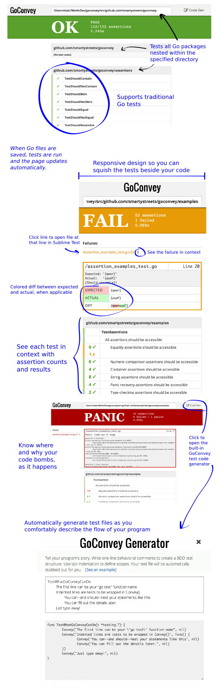

+++
title = "webUI"
date = 2024-12-15T11:36:16+08:00
weight = 16
type = "docs"
description = ""
isCJKLanguage = true
draft = false

+++

> 原文：[https://github.com/smartystreets/goconvey/wiki/Web-UI](https://github.com/smartystreets/goconvey/wiki/Web-UI)
>
> 收录该文档时间： `2024-12-15T11:36:16+08:00`

# Web UI


Russell edited this page on May 3, 2016 · [1 revision](https://github.com/smartystreets/goconvey/wiki/Web-UI/_history)

​	Russell 于 2016 年 5 月 3 日编辑了此页面 · [1 次修订](https://github.com/smartystreets/goconvey/wiki/Web-UI/_history)

The web UI is a powerful, elegant tool for viewing Go test results in your browser.

​	Web UI 是一个功能强大且优雅的工具，可在浏览器中查看 Go 测试结果。

### Quick start


(Assuming you already set your GOPATH and did `go get github.com/smartystreets/goconvey`...)

​	（假设您已经设置了 GOPATH 并运行了 `go get github.com/smartystreets/goconvey`...）

**In your terminal:**

- `cd` to your project's path
  - `cd` 到您的项目路径

- `go install github.com/smartystreets/goconvey`

From now on, you need only run the `goconvey` server:

​	从现在开始，只需运行 `goconvey` 服务器：

```sh
$GOPATH/bin/goconvey
```


Then open your browser to:

​	然后在浏览器中打开：

```
http://localhost:8080
```


### Features


- Customize the watched directory
  - 自定义监控目录

- Automatically updates when `.go` files are changed
  - `.go` 文件更改时自动更新

- Test code generator
  - 测试代码生成器

- Browser notifications (with enable/disable and the option to notify on any status, only success, or only panic/failure)
  - 浏览器通知（支持启用/禁用，可选择仅在成功、失败或 panic 时通知）

- Colored diff on most failing tests' outputs
  - 大多数失败测试输出支持彩色差异显示

- Nested display of GoConvey tests for easy reading
  - GoConvey 测试嵌套显示，方便阅读

- Supports traditional Go tests
  - 支持传统 Go 测试

- Responsive layout so you can squish the browser next to the code if you have to
  - 响应式布局，可以将浏览器窗口调整到代码旁边显示

- Panics, failed builds, and failed tests are highlighted
  - 高亮显示 panic、构建失败和测试失败

- Silky-smooth appearance and transitions
  - 流畅的外观和过渡效果

- Direct link to the problem lines (opens your favorite editor--[some assembly required](https://github.com/smartystreets/goconvey/wiki/Opening-files-in-your-editor-from-the-Web-UI))
  - 问题行的直接链接（支持打开您喜欢的编辑器——[需要一些配置](https://github.com/smartystreets/goconvey/wiki/Opening-files-in-your-editor-from-the-Web-UI)）


[Scroll to the bottom for a graphical feature tour.](https://github.com/smartystreets/goconvey/wiki/Web-UI#graphical-feature-tour)

​	滚动至页面底部查看图形功能演示。

### 代码生成器 Code generator


Click the "Code Gen" link in the top-right corner to open the code generator. Type your test descriptors in the textbox, and use Tab to indent. Test stubs will automatically be created for you which you can then copy+paste into your Go test file.

​	

The idea is to describe your program's behavior in a natural, flowing way.

For example (make sure to convert spaces to tabs, as GitHub transformed them to spaces):

```
Test Integer Stuff
	Subject: Integer incrementation and decrementation
		Given a starting integer value
			When incremented
				The value should be greater by one
				The value should NOT be what it used to be
			When decremented
				The value should be lesser by one
				The value should NOT be what it used to be
```


There are a few to notice:

- Lines starting with "Test" (case-sensitive), without indentation, are treated as the name of the test function
- Tab indentation defines scope
- Assertions are not made here; you'll do that later after pasting the generated code into your `_test.go` file.

### Graphical feature tour




### Server command line flags


```
$GOPATH/bin/goconvey -help

Usage of goconvey:
  -cover=true: Enable package-level coverage statistics. Warning: this will obfuscate line number reporting on panics and build failures! Requires Go 1.2+ and the go cover tool. (default: true)
  -gobin="go": The path to the 'go' binary (default: search on the PATH).
  -host="127.0.0.1": The host at which to serve http.
  -packages=10: The number of packages to test in parallel. Higher == faster but more costly in terms of computing. (default: 10)
  -poll=250ms: The interval to wait between polling the file system for changes (default: 250ms).
  -port=8080: The port at which to serve http.
```

