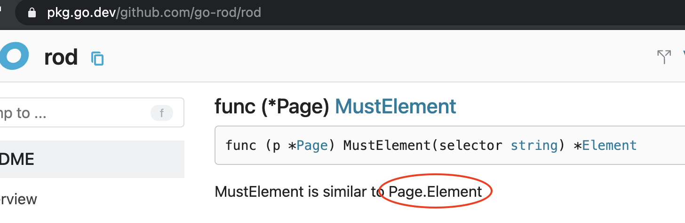
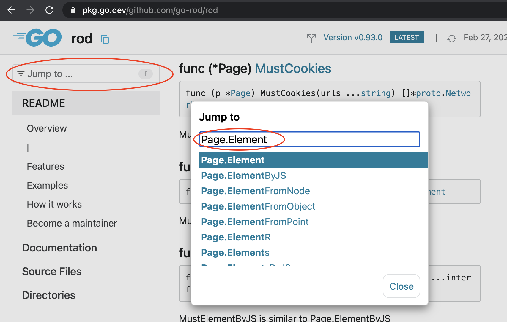

+++
title = "常见问题"
date = 2024-11-21T08:11:50+08:00
weight = 1
type = "docs"
description = ""
isCJKLanguage = true
draft = false

+++

> 原文：[https://go-rod.github.io/i18n/zh-CN/#/faq/README](https://go-rod.github.io/i18n/zh-CN/#/faq/README)
>
> 收录该文档时间： `2024-11-21T08:11:50+08:00`

# 常见问题

## 为什么选择 Rod 而不是其他库？

​	请看 [为什么 Rod ](https://go-rod.github.io/i18n/zh-CN/#/why-rod)。

## 如何在注释或文档中搜索符号？

​	比如截图中显示的符号 `Page.Element`

​	可以通过从这里搜索跳转到它(键盘快捷键是 `F`):

​	对于经验丰富的开发人员，请查看 [Terminology](https://github.com/go-rod/rod/blob/main/.github/CONTRIBUTING.md#terminology)。
