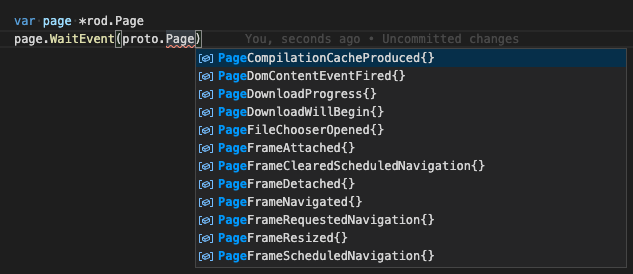

+++
title = "事件"
date = 2024-11-21T08:08:12+08:00
weight = 30
type = "docs"
description = ""
isCJKLanguage = true
draft = false

+++

> 原文：[https://go-rod.github.io/i18n/zh-CN/#/events/README](https://go-rod.github.io/i18n/zh-CN/#/events/README)
>
> 收录该文档时间： `2024-11-21T08:08:12+08:00`

# 事件

​	事件是在你控制的浏览器中发生的动作或事件，浏览器会告诉你这些事件，这样你就可以在需要的时候以某种方式响应它们。 例如，当我们让页面导航到一个新的 URL 时，我们可以订阅事件来知道导航何时完成或者页面何时渲染完毕。

## 等待一次事件

​	让我们尝试导航到一个页面，并等待页面的网络达到接近空闲：

```go
func main() {
    page := rod.New().MustConnect().MustPage()

    wait := page.MustWaitNavigation()
    page.MustNavigate("https://www.wikipedia.org/")
    wait()
}
```

​	我们使用 `MustWaitNavigation` 来订阅网络空闲事件。 之所以在导航之前订阅而不是在导航之后，是因为触发导航的代码需要时间来执行，在此期间事件可能已经发生。 在 `MustNavigate` 之后，我们调用 `wait` 函数来阻塞代码，直到下一个网络空闲事件发生。

​	Rod 提供了许多其他事件帮助函数，函数名都以 `MustWait` 或 `Wait` 作为前缀。

## 获取事件细节

​	有些事件类型包含有关事件本身的详细信息。 例如，我们可以导航到一个 url 并使用事件来获取导航请求的响应状态代码：

```go
func main() {
    page := rod.New().MustConnect().MustPage()

    e := proto.NetworkResponseReceived{}
    wait := page.WaitEvent(&e)
    page.MustNavigate("https://www.wikipedia.org/")
    wait()

    fmt.Println(e.Response.Status)
}
```

## 处理多个事件

​	如果想要处理一个类型的所有事件，比如监听页面控制台输出的所有事件，我们可以这样做：

```go
go page.EachEvent(func(e *proto.RuntimeConsoleAPICalled) {
    fmt.Println(page.MustObjectsToJSON(e.Args))
})()
```

​	要同时订阅多种事件类型，比如订阅 `RuntimeConsoleAPICalled` 和 `PageLoadEventFired`，则可以这样做：

```go
go page.EachEvent(func(e *proto.RuntimeConsoleAPICalled) {
    fmt.Println(page.MustObjectsToJSON(e.Args))
}, func(e *proto.PageLoadEventFired) {
    fmt.Println("loaded")
})()
```

## 停止订阅

​	Rod 中的任何阻塞函数都可以通过 [context](https://go-rod.github.io/i18n/zh-CN/#/context-and-timeout) 取消，不仅仅对于事件。 此外，还可以通过让事件回调函数返回 true 来停止事件，例如：

```go
wait := page.EachEvent(func(e *proto.PageLoadEventFired) (stop bool) {
    return true
})
page.MustNavigate("https://example.com")
wait()
```

如果不返回 true，那么 wait 会一直等待 `PageLoadEventFired` 事件，并永远阻塞程序。 这其实就是 `page.WaitEvent` 的代码。

## 可用事件

​	所有事件类型都实现了 `proto.Event` 接口，你可以使用它查找所有事件。 通常，IDE 会根据接口自动进行过滤。 例如，要查看 Page 域下的所有事件，我们可以创建一个空的 page 对象并使用 `WaitEvent(proto.Event)` 列出并过滤所有事件类型，如下图所示：



​	你也可以使用这个[网站](https://chromedevtools.github.io/devtools-protocol/tot/Page)来浏览所有事件。
