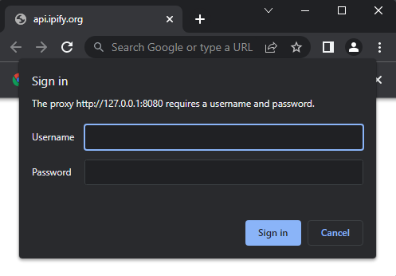

+++
title = "network"
date = 2024-11-21T08:08:52+08:00
weight = 60
type = "docs"
description = ""
isCJKLanguage = true
draft = false

+++

> 原文：[https://go-rod.github.io/i18n/zh-CN/#/network/README](https://go-rod.github.io/i18n/zh-CN/#/network/README)
>
> 收录该文档时间： `2024-11-21T08:08:52+08:00`

# 网络

## 代理

​	您可以设置一个浏览器实例使用代理服务器。 为此，您必须用参数 `--proxy-server` 来启动浏览器浏览器。

> **备注**: 单个浏览器只能使用单个代理。 如果您需要使用多个 代理，您将需要创建多个浏览器连接。

​	要代理确实工作的重要一点是，您必须处理 chromium 向用户弹出的 认证对话框：



​	go-rod 可以轻松使用 `browser.MustHandleAuth()` 函数处理此弹出窗口：

```go
// 处理认证弹框
go browser.MustHandleAuth("user", "password")()
```

​	请注意 `browser.MustHandleAuth()` 返回一个 **function** ，您必须以 用 goroutine 调用它。 这将确保您的程序能够在处理 认证弹框的同时异步运行其他代码。

------

​	您可以使用 [mitmproxy](https://mitmproxy.org/) 来测试您的代码 是否能成功使用代理：

```bash
docker run --rm -it -p 8080:8080 mitmproxy/mitmproxy mitmdump -p 8080 --proxyauth user:password
```

​	代理启动后，启动浏览器，通过代理服务器加载页面。

​	下面是一个完整的示例来说明如何这样做：

```go
// 创建浏览器启动器
l := launcher.New()
// Pass '--proxy-server=127.0.0.1:8081' argument to the browser on launch
l = l.Set(flags.ProxyServer, "127.0.0.1:8080")
// 获取调试链接
controlURL, _ := l.Launch()

// 连接到浏览器
browser := rod.New().ControlURL(controlURL).MustConnect()

// 处理认证弹窗
go browser.MustHandleAuth("user", "password")() // <-- 注意 HandleAuth 返回的
                                                //     函数必须要
                                                //     以 goroutine 的形式运行

// 无视证书错误，因为我们是本地调试
browser.MustIgnoreCertErrors(true)

// 导航到能看 ip 地址的页面
page := browser.MustPage("http://api.ipify.org")

// IP 应该不变，因为我们用的本地代理
// 但是返回的内容可以证明我们的测试没有问题
println(page.MustElement("html").MustText())
```

## Cookies

​	`rod.Browser` and `rod.Page` 都有几种帮助方法来设置或获取 cookie。

## 劫持请求

​	你可以使用 Rod 劫持任何 HTTP 或 HTTPS 流量。

> 请注意，劫持请求无法替代代理。 如果你试图使用 hijacking 而不是代理，你将会遇到HTTP 头问题。 虽然有可能重写被劫持的 **HTTP** 请求头并代理他们，但 **HTTPS** 请求目前似乎无法这样做。 如果您需要代理请求 [，请使用 MustHandleAuth 代替](https://go-rod.github.io/i18n/zh-CN/#/network?id=proxy)

xxxxxxxxxx1 1page.MustElement("button").MustEval(`() => this.onclick = myClick`)go

```text
浏览器 --请求-> rod ---> 服务器 ---> rod --响应-> 浏览器
```

​	当浏览器想要向服务器发送请求时，它会先把请求发给 Rod，然后 Rod 作为代理，把请求发送给实际的服务器，并把响应返回给浏览器。 `--请求->` 和 `--响应->` 是可以篡改的部分。

​	例如，我们可以这样替换对文件 `test.js` 的请求的返回：

```go
browser := rod.New().MustConnect()

router := browser.HijackRequests()

router.MustAdd("*/test.js", func(ctx *rod.Hijack) {
    ctx.MustLoadResponse()
    ctx.Response.SetBody(`console.log("js file replaced")`)
})

go router.Run()

page := browser.MustPage("https://test.com/")

// 仅劫持某个页面的请求
page.HijackRequests()
```

​	更多信息，见[劫持相关的单元测试](https://github.com/go-rod/rod/blob/main/hijack_test.go)

## 节流

​	您可以通过节流网络来模拟和测试慢网络：

```go
page.EnableDomain(proto.NetworkEnable{})

_ = proto.NetworkEmulateNetworkConditions{
    Offline:            false,
    Latency:            300,
    DownloadThroughput: 100,
    UploadThroughput:   50,
    ConnectionType:     proto.NetworkConnectionTypeCellular2g,
}.Call(page)
```

## 阻止某些资源的加载

​	如果需要，您可以使用 `Page.HijackRequest` 屏蔽某些资源 (如图片或字体) 。

​	如果您想要改进页面加载时间，特别是当您在无头模式下运行时，这将是非常有用。 因为加载 字体 / css 上没意义。 下面示例：

```go
func main() {
    page := rod.New().MustConnect().MustPage("")

    router := page.HijackRequests()

    router.MustAdd("*.png", func(ctx *rod.Hijack) {
        // 你可以使用很多其他 enum 类型，比如 NetworkResourceTypeScript 用于 javascript
        // 这个例子里我们使用 NetworkResourceTypeImage 来阻止图片
        if ctx.Request.Type() == proto.NetworkResourceTypeImage {
            ctx.Response.Fail(proto.NetworkErrorReasonBlockedByClient)
            return
        }
        ctx.ContinueRequest(&proto.FetchContinueRequest{})
    })

    // 因为我们只劫持特定页面，即便不使用 "*" 也不会太多性能影响
    go router.Run()

    page.MustNavigate("https://github.com/").MustWaitStable().MustScreenshot("")
}
```
