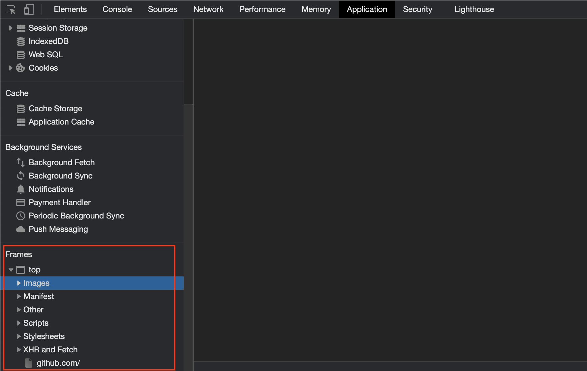

+++
title = "页面资源"
date = 2024-11-21T08:09:06+08:00
weight = 70
type = "docs"
description = ""
isCJKLanguage = true
draft = false

+++

> 原文：[https://go-rod.github.io/i18n/zh-CN/#/page-resources/README](https://go-rod.github.io/i18n/zh-CN/#/page-resources/README)
>
> 收录该文档时间： `2024-11-21T08:09:06+08:00`

# 页面资源

​	可以使用 `Page.GetResource` 来从这里获取文件：



​	比如说获取图片：

```go
bin, _ := page.GetResource("https://test.com/a.png")
fmt.Println(bin)
```

## 元素资源

​	也可以使用 `Element.Resource` 方法来获取 `src` 属性中的文件。 比如说对于元素 ``，可以使用如下代码获取 `a.jpg`：

```go
bin := page.MustElement("img").MustResource()
fmt.Println(bin)
```
