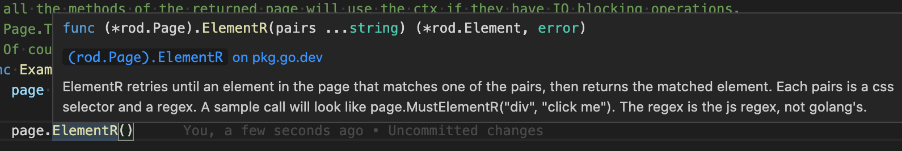
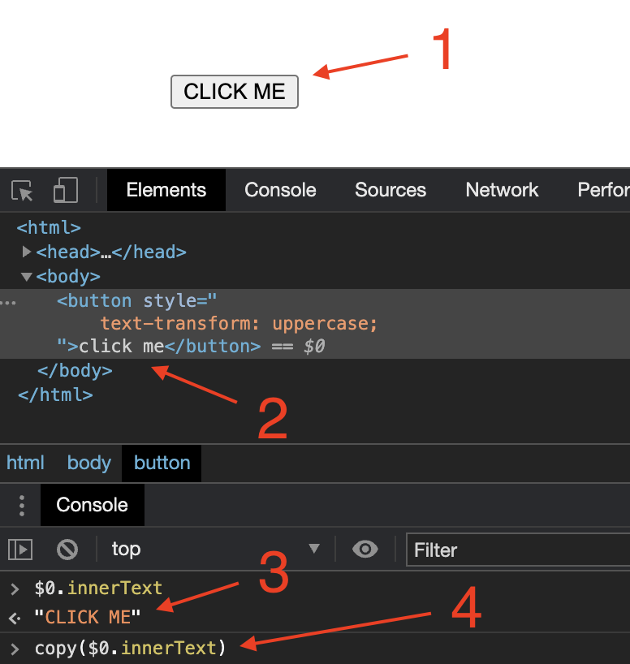

+++
title = "选择器"
date = 2024-11-21T08:07:59+08:00
weight = 20
type = "docs"
description = ""
isCJKLanguage = true
draft = false

+++

> 原文：[https://go-rod.github.io/i18n/zh-CN/#/selectors/README](https://go-rod.github.io/i18n/zh-CN/#/selectors/README)
>
> 收录该文档时间： `2024-11-21T08:07:59+08:00`

# 选择器

​	Rod 提供了很多获取元素的方法。 它们的名称都以 `MustElement` 或 `Element` 作为前缀。 如果你在 IDE 中键入 `Element`，你会看到如下所有可用的选择器：


​	如果你将光标停留在方法上，你会看到如下的文档：



​	通常来说你只需要一些 [CSS 选择器](https://go-rod.github.io/i18n/zh-CN/#/css-selector) 的基础知识就可以完成你想要完成的自动化任务。 在本文档中，我们将只使用 CSS 选择器从页面中获取元素。

## 通过文本内容

​	使用 `ElementR` ，通过文本内容来匹配元素。 例如选择下图中的搜索输入框：


```go
page.MustElementR("input", "Search or jump")
page.MustElementR("input", "/click/i") // 使用大小写不敏感标志 "i"
```

​	因为使用了 [js regex](https://developer.mozilla.org/en-US/docs/Web/JavaScript/Reference/Global_Objects/RegExp), 所以我们不需要匹配文本的整个上下文。 要匹配的文本是在网站上实际看到的，而不是源代码。 试比较下图中的 1 和 2。 你可以使用 Devtools 的 `copy` 帮助函数将文本复制到剪贴板（见 4）:



## 通过 XPath

​	我们推荐使用 CSS 选择器来选择元素（比如你不能用 XPath 来选择[渲染的文本](https://stackoverflow.com/questions/51992258/xpath-to-find-pseudo-element-after-in-side-a-div-element-with-out-any-content/51993454)）。 但对于使用其他语言的程序员来说，可能有时 XPath 来得更方便。 使用 `ElementX` 来根据 XPath 匹配：

```go
page.MustElementX("//h2")
```

## 通过 JavaScript

​	如果你的查询很复杂，或者如果你想使用一个类似于 [jQuery](https://jquery.com/) 的高级查询引擎：

```go
page.MustElementByJS(`() => jQuery('option:selected')[0]`)
```

如果你看一下其他选择器（比如 `Element` 和 `ElementR`）的源码，你会发现他们实际上都基于 `ElementByJS`，而 `ElementByJS` 则基于 `Page.Evaluate`。 有关如何运行 js 代码，见 [JavaScript 运行时](https://go-rod.github.io/i18n/zh-CN/#/javascript-runtime)。 通常会使用 `ElementByJS` 自行创建选择器来扩展 Rod。

## 选择多个元素

​	获取多个元素的方法的名称都以 `MustElements` 或 `Elements` 作为前缀。 单元素选择器和多元素选择器之间的一个关键区别是，单元素选择器会等待元素出现。 如果一个多元素选择器没有找到任何东西，他会立即返回一个空列表。

## 遍历元素树

​	还有一些方便的选择器用于选择元素内部或周围的元素，如 `MustParent`、`MustNext`、`MustPrevious`等。

​	下面是一个使用多个选择器从页面中获取内容的例子：

```go
// 在 awesome-go 页面上，找出指定的区域 sect，
// 并从页面获取相关项目。
func main() {
    page := rod.New().MustConnect().MustPage("https://github.com/avelino/awesome-go")

    section := page.MustElementR("p", "Selenium and browser control tools").MustNext()

    // 获取一个元素的子元素
    projects := section.MustElements("li")

    for _, project := range projects {
        link := project.MustElement("a")
        log.Printf(
            "project %s (%s): '%s'",
            link.MustText(),
            link.MustProperty("href"),
            project.MustText(),
        )
    }
}
```

## 从 iframe 中获取元素

​	例如，从如下的多层嵌套的 iframe 中选择按钮：


​	代码看起来是这样的：

```go
frame01 := page.MustElement("iframe").MustFrame()
frame02 := frame01.MustElement("iframe").MustFrame()
frame02.MustElement("button")
```

## 搜索元素

​	还有另一个强大的帮助函数可以获取元素，那就是 `MustSearch`。 它不如上面提到的选择器精确，但是如果你想从深层嵌套的 iframe 或 shadow dom 中获取元素，使用它就会很方便。

​	这一功能和 [Devtools 中的 Search for nodes](https://developers.google.com/web/tools/chrome-devtools/dom#search) 是一样的。 你可以使用 Devtools 的这一功能来调试出用什么关键字来选择你想要的元素，如下图所示：


​	要选择和 [从 iframe 中获取元素](https://go-rod.github.io/i18n/zh-CN/#/selectors/README?id=get-elements-from-iframes) 中一样的元素，我们可以这样：

```go
page.MustSearch("button")
```

## 竞争选择器

​	Rod 鼓励无 sleep 的自动化任务，这样可以增加任务的可靠性。 当一个操作有多种可能的结果时，我们不使用 sleep 来等待页面跳转或加载完毕。 例如，登录网页时密码可能错误，这时我们希望分别处理成功和失败的情况。 我们应该避免这样的代码：

```go
func main() {
    page := rod.New().MustConnect().MustPage("https://leetcode.com/accounts/login/")

    page.MustElement("#id_login").MustInput("username")
    page.MustElement("#id_password").MustInput("password").MustType(input.Enter)

    time.Sleep(10 * time.Second) // Please avoid the use of time.Sleep!

    if page.MustHas(".nav-user-icon-base") {
        // 在成功登陆后打印用户名
        fmt.Println(page.MustElement(".nav-user-icon-base").MustAttribute("title"))
    } else if page.MustHas("[data-cy=sign-in-error]") {
        // 当用户名或密码错误
        fmt.Println(page.MustElement("[data-cy=sign-in-error]").MustText())
    }
}
```

​	相反，我们应该这样：

```go
func main() {
    page := rod.New().MustConnect().MustPage("https://leetcode.com/accounts/login/")

    page.MustElement("#id_login").MustInput("username")
    page.MustElement("#id_password").MustInput("password").MustType(input.Enter)

    // 轮询，直到匹配到一个选择器
    page.Race().Element(".nav-user-icon-base").MustHandle(func(e *rod.Element) {
        // 在成功登陆后打印用户名
        fmt.Println(e.MustAttribute("title"))
    }).Element("[data-cy=sign-in-error]").MustHandle(func(e *rod.Element) {
        // 当用户名或密码错误
        panic(e.MustText())
    }).MustDo()
}
```
