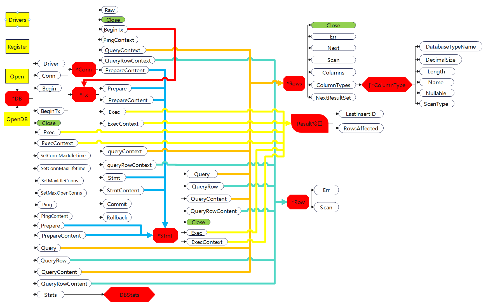

+++
title = "sql"
date = 2023-05-17T11:11:20+08:00
type = "docs"
description = ""
isCJKLanguage = true
draft = false
+++
https://pkg.go.dev/database/sql@go1.20.1

## 关系图



Package sql provides a generic interface around SQL (or SQL-like) databases.

​	sql包提供了一个围绕SQL(或类SQL)数据库的通用接口。

The sql package must be used in conjunction with a database driver. See https://golang.org/s/sqldrivers for a list of drivers.

​	sql包必须与数据库驱动程序一起使用。请参阅[https://golang.org/s/sqldrivers](https://golang.org/s/sqldrivers)，获取驱动程序的列表。

Drivers that do not support context cancellation will not return until after the query is completed.

​	不支持上下文取消的驱动程序将等到查询完成后才会返回。

For usage examples, see the wiki page at https://golang.org/s/sqlwiki.

​	关于用法的例子，请参见wiki页面[https://golang.org/s/sqlwiki](https://golang.org/s/sqlwiki)。

## Example (OpenDBCLI) 

```go 
package main

import (
	"context"
	"database/sql"
	"flag"
	"log"
	"os"
	"os/signal"
	"time"
)

var pool *sql.DB // 数据库连接池。

func main() {
	id := flag.Int64("id", 0, "person ID to find")
	dsn := flag.String("dsn", os.Getenv("DSN"), "connection data source name")
	flag.Parse()

	if len(*dsn) == 0 {
		log.Fatal("missing dsn flag")
	}
	if *id == 0 {
		log.Fatal("missing person ID")
	}
	var err error

   // 打开驱动程序通常不会尝试连接到数据库。
	pool, err = sql.Open("driver-name", *dsn)
	if err != nil {
       // 这将不是一个连接错误，而是一个DSN解析错误或其他初始化错误。
		log.Fatal("unable to use data source name", err)
	}
	defer pool.Close()

	pool.SetConnMaxLifetime(0)
	pool.SetMaxIdleConns(3)
	pool.SetMaxOpenConns(3)

	ctx, stop := context.WithCancel(context.Background())
	defer stop()

	appSignal := make(chan os.Signal, 3)
	signal.Notify(appSignal, os.Interrupt)

	go func() {
		<-appSignal
		stop()
	}()

	Ping(ctx)

	Query(ctx, *id)
}

// 向数据库发送ping请求，以验证用户提供的DSN是否有效并且服务器可访问。如果ping失败，则以错误的方式退出程序。
func Ping(ctx context.Context) {
	ctx, cancel := context.WithTimeout(ctx, 1*time.Second)
	defer cancel()

	if err := pool.PingContext(ctx); err != nil {
		log.Fatalf("unable to connect to database: %v", err)
	}
}

// 查询数据库以获取所请求的信息并打印结果。 如果查询失败，则以错误退出程序。
func Query(ctx context.Context, id int64) {
	ctx, cancel := context.WithTimeout(ctx, 5*time.Second)
	defer cancel()

	var name string
	err := pool.QueryRowContext(ctx, "select p.name from people as p where p.id = :id;", sql.Named("id", id)).Scan(&name)
	if err != nil {
		log.Fatal("unable to execute search query", err)
	}
	log.Println("name=", name)
}

```

## Example (OpenDBService) 

```go 
package main

import (
	"context"
	"database/sql"
	"encoding/json"
	"fmt"
	"io"
	"log"
	"net/http"
	"time"
)

func main() {
	// 打开驱动程序通常不会尝试连接到数据库。
	db, err := sql.Open("driver-name", "database=test1")
	if err != nil {
		// 这将不是连接错误，而是DSN解析错误或其他初始化错误。
		log.Fatal(err)
	}
	db.SetConnMaxLifetime(0)
	db.SetMaxIdleConns(50)
	db.SetMaxOpenConns(50)

	s := &Service{db: db}

	http.ListenAndServe(":8080", s)
}

type Service struct {
	db *sql.DB
}

func (s *Service) ServeHTTP(w http.ResponseWriter, r *http.Request) {
	db := s.db
	switch r.URL.Path {
	default:
		http.Error(w, "not found", http.StatusNotFound)
		return
	case "/healthz":
		ctx, cancel := context.WithTimeout(r.Context(), 1*time.Second)
		defer cancel()

		err := s.db.PingContext(ctx)
		if err != nil {
			http.Error(w, fmt.Sprintf("db down: %v", err), http.StatusFailedDependency)
			return
		}
		w.WriteHeader(http.StatusOK)
		return
	case "/quick-action":
		// 这是一个简短的SELECT语句。将请求上下文作为上下文超时的基础。
		ctx, cancel := context.WithTimeout(r.Context(), 3*time.Second)
		defer cancel()

		id := 5
		org := 10
		var name string
		err := db.QueryRowContext(ctx, `
select
	p.name
from
	people as p
	join organization as o on p.organization = o.id
where
	p.id = :id
	and o.id = :org
;`,
			sql.Named("id", id),
			sql.Named("org", org),
		).Scan(&name)
		if err != nil {
			if err == sql.ErrNoRows {
				http.Error(w, "not found", http.StatusNotFound)
				return
			}
			http.Error(w, err.Error(), http.StatusInternalServerError)
			return
		}
		io.WriteString(w, name)
		return
	case "/long-action":
		// 这是一个很长的SELECT语句。
        // 将请求上下文作为上下文超时的基础，但要给它一些时间来完成。
        // 如果客户在查询完成之前取消了，查询也将被取消。
		ctx, cancel := context.WithTimeout(r.Context(), 60*time.Second)
		defer cancel()

		var names []string
		rows, err := db.QueryContext(ctx, "select p.name from people as p where p.active = true;")
		if err != nil {
			http.Error(w, err.Error(), http.StatusInternalServerError)
			return
		}

		for rows.Next() {
			var name string
			err = rows.Scan(&name)
			if err != nil {
				break
			}
			names = append(names, name)
		}
 
        // 如果多个语句在一个批次中执行，并且行被写入和读取，这可能更为重要。
        // 如果在单个批处理中执行了多个语句并且已经写入和读取了行，则这可能更加重要。
		if closeErr := rows.Close(); closeErr != nil {
			http.Error(w, closeErr.Error(), http.StatusInternalServerError)
			return
		}

		// 检查行扫描错误。
		if err != nil {
			http.Error(w, err.Error(), http.StatusInternalServerError)
			return
		}

		// 在行迭代过程中检查错误。
		if err = rows.Err(); err != nil {
			http.Error(w, err.Error(), http.StatusInternalServerError)
			return
		}

		json.NewEncoder(w).Encode(names)
		return
	case "/async-action":		
        // 这个操作有副作用，我们希望保留这些副作用，
        // 即使客户端在HTTP请求进行中取消了。
        // 为此，我们不使用HTTP请求上下文作为超时的基础。
		ctx, cancel := context.WithTimeout(context.Background(), 10*time.Second)
		defer cancel()

		var orderRef = "ABC123"
		tx, err := db.BeginTx(ctx, &sql.TxOptions{Isolation: sql.LevelSerializable})
		_, err = tx.ExecContext(ctx, "stored_proc_name", orderRef)

		if err != nil {
			tx.Rollback()
			http.Error(w, err.Error(), http.StatusInternalServerError)
			return
		}
		err = tx.Commit()
		if err != nil {
			http.Error(w, "action in unknown state, check state before attempting again", http.StatusInternalServerError)
			return
		}
		w.WriteHeader(http.StatusOK)
		return
	}
}

```


## 常量 

This section is empty.

## 变量

[View Source](https://cs.opensource.google/go/go/+/go1.20.1:src/database/sql/sql.go;l=1898)

``` go 
var ErrConnDone = errors.New("sql: connection is already closed")
```

ErrConnDone is returned by any operation that is performed on a connection that has already been returned to the connection pool.

​	ErrConnDone 是对已经被返回到连接池的连接上执行的操作返回的错误。

[View Source](https://cs.opensource.google/go/go/+/go1.20.1:src/database/sql/sql.go;l=441)

``` go 
var ErrNoRows = errors.New("sql: no rows in result set")
```

ErrNoRows is returned by Scan when QueryRow doesn't return a row. In such a case, QueryRow returns a placeholder *Row value that defers this error until a Scan.

​	当QueryRow不返回行时，Scan返回ErrNoRows。在这种情况下，QueryRow返回一个占位符`*Row`值，直到Scan才会出现此错误。

[View Source](https://cs.opensource.google/go/go/+/go1.20.1:src/database/sql/sql.go;l=2185)

``` go 
var ErrTxDone = errors.New("sql: transaction has already been committed or rolled back")
```

ErrTxDone is returned by any operation that is performed on a transaction that has already been committed or rolled back.

​	ErrTxDone 是对已经被提交或回滚的事务上执行的操作返回的错误。

## 函数

### func Drivers  <- go1.4

``` go 
func Drivers() []string
```

Drivers returns a sorted list of the names of the registered drivers.

​	Drivers 函数返回已注册驱动程序名称的排序列表。

### func Register 

``` go 
func Register(name string, driver driver.Driver)
```

Register makes a database driver available by the provided name. If Register is called twice with the same name or if driver is nil, it panics.

​	Register 函数通过提供的name使数据库驱动程序可用。 如果以相同的name调用 Register 两次或者如果 driver 为 nil，则会使程序 panic。

## 类型

### type ColumnType  <- go1.8

``` go 
type ColumnType struct {
	name string

	hasNullable       bool
	hasLength         bool
	hasPrecisionScale bool

	nullable     bool
	length       int64
	databaseType string
	precision    int64
	scale        int64
	scanType     reflect.Type
}
```

ColumnType contains the name and type of a column.

​	ColumnType结构体包含列的名称和类型。

#### (*ColumnType) DatabaseTypeName  <- go1.8

``` go 
func (ci *ColumnType) DatabaseTypeName() string
```

DatabaseTypeName returns the database system name of the column type. If an empty string is returned, then the driver type name is not supported. Consult your driver documentation for a list of driver data types. Length specifiers are not included. Common type names include "VARCHAR", "TEXT", "NVARCHAR", "DECIMAL", "BOOL", "INT", and "BIGINT".

​	DatabaseTypeName 方法返回列类型的数据库系统名称。 如果返回空字符串，则表示驱动程序类型名称不受支持。 请查阅您的驱动程序文档以获取驱动程序数据类型的列表。 长度说明符未包括在内。 常见类型名称包括 "VARCHAR"，"TEXT"，"NVARCHAR"，"DECIMAL"，"BOOL"，"INT" 和 "BIGINT"。

#### (*ColumnType) DecimalSize  <- go1.8

``` go 
func (ci *ColumnType) DecimalSize() (precision, scale int64, ok bool)
```

DecimalSize returns the scale and precision of a decimal type. If not applicable or if not supported ok is false.

​	DecimalSize 方法返回decimal类型的精度和小数位数。 如果不适用或不受支持，ok 为 false。

> 个人注释
>
> ​	在数据存储中，precision 和 scale 通常用于表示数值型数据，具体如下：
>
> ​	precision 表示数值的总长度，包括小数点前的所有数字和小数点后的所有数字。例如，对于一个数值 123.456，precision 将会是 9，因为总共有九个数字。
>
> ​	scale 表示小数点所占的位数。在上述例子中，scale 将会是 3，因为小数点后有三个数字。如果小数点后的位数超过 scale，那么超出的部分会被四舍五入。例如，如果 scale 是 2，那么 123.456 会被四舍五入为 123.46。

#### (*ColumnType) Length  <- go1.8

``` go 
func (ci *ColumnType) Length() (length int64, ok bool)
```

Length returns the column type length for variable length column types such as text and binary field types. If the type length is unbounded the value will be math.MaxInt64 (any database limits will still apply). If the column type is not variable length, such as an int, or if not supported by the driver ok is false.

​	Length 方法返回可变长度列类型的长度，例如文本和二进制字段类型。 如果类型长度无限，则`length`值为 `math.MaxInt64`（任何数据库限制仍然适用）。 如果列类型不是可变长度，例如 int，或者如果驱动程序不支持，`ok` 为 `false`。

#### (*ColumnType) Name  <- go1.8

``` go 
func (ci *ColumnType) Name() string
```

Name returns the name or alias of the column.

​	Name方法返回列的名称或别名。

#### (*ColumnType) Nullable  <- go1.8

``` go 
func (ci *ColumnType) Nullable() (nullable, ok bool)
```

Nullable reports whether the column may be null. If a driver does not support this property ok will be false.

​	Nullable方法报告列是否可以为null。如果驱动程序不支持此属性，则`ok`将为`false`。

#### (*ColumnType) ScanType  <- go1.8

``` go 
func (ci *ColumnType) ScanType() reflect.Type
```

ScanType returns a Go type suitable for scanning into using Rows.Scan. If a driver does not support this property ScanType will return the type of an empty interface.

​	ScanType方法返回适合使用`Rows.Scan`进行扫描的Go类型。如果驱动程序不支持此属性，则ScanType方法将返回空接口的类型。

### type Conn  <- go1.9

```go 
type Conn struct {
	db *DB

	// closemu prevents the connection from closing while there
	// is an active query. It is held for read during queries
	// and exclusively during close.
    //  closemu 防止在有活动查询时关闭连接。它在查询期间被保留用于读取，而在关闭期间独占。
	closemu sync.RWMutex

	// dc is owned until close, at which point
	// it's returned to the connection pool.
    // dc 在关闭之前一直被占用，直到关闭时才返回到连接池中。
	dc *driverConn

	// done transitions from 0 to 1 exactly once, on close.
	// Once done, all operations fail with ErrConnDone.
	// Use atomic operations on value when checking value.
    // done 在关闭时从 0 变为 1，且仅变一次。
    // 一旦 done 为 1，所有操作都会失败并返回错误码 ErrConnDone。
    // 在检查值时，请使用原子操作来处理该值。
	done int32
}
```

Conn represents a single database connection rather than a pool of database connections. Prefer running queries from DB unless there is a specific need for a continuous single database connection.

​	Conn 结构体表示单个数据库连接，而不是数据库连接池。除非有持续单个数据库连接的特定需求，否则建议从 DB 运行查询。

A Conn must call Close to return the connection to the database pool and may do so concurrently with a running query.

​	Conn 必须调用 Close 来将连接返回到数据库池，并且可以与正在运行的查询并发执行。

After a call to Close, all operations on the connection fail with ErrConnDone.

​	在调用 Close 之后，对连接上的所有操作都将失败，并返回 ErrConnDone。

#### (*Conn) BeginTx  <- go1.9

``` go 
func (c *Conn) BeginTx(ctx context.Context, opts *TxOptions) (*Tx, error)
```

BeginTx starts a transaction.

​	BeginTx方法开始一个事务。

The provided context is used until the transaction is committed or rolled back. If the context is canceled, the sql package will roll back the transaction. Tx.Commit will return an error if the context provided to BeginTx is canceled.

​	提供的 context 将一直使用到事务提交或回滚。如果 context 被取消，sql 包将回滚事务。如果向 BeginTx 提供的 context 被取消，Tx.Commit 将返回一个错误。

The provided TxOptions is optional and may be nil if defaults should be used. If a non-default isolation level is used that the driver doesn't support, an error will be returned.

​	提供的 TxOptions 是可选的，如果应使用默认值，则可以为 nil。如果使用了驱动程序不支持的非默认隔离级别，将返回一个错误。

#### (*Conn) Close  <- go1.9

``` go 
func (c *Conn) Close() error
```

Close returns the connection to the connection pool. All operations after a Close will return with ErrConnDone. Close is safe to call concurrently with other operations and will block until all other operations finish. It may be useful to first cancel any used context and then call close directly after.

​	Close 方法将连接返回到连接池。所有在 Close 之后的操作都将返回 ErrConnDone。Close 方法可以安全地与其他操作并发调用，并且将阻塞，直到所有其他操作完成。在取消任何使用的 context 之后直接调用 close 可能会有用。

#### (*Conn) ExecContext  <- go1.9

``` go 
func (c *Conn) ExecContext(ctx context.Context, query string, args ...any) (Result, error)
```

ExecContext executes a query without returning any rows. The args are for any placeholder parameters in the query.

​	ExecContext 方法执行不返回任何行的查询。args 是查询中任何占位符参数的实参。

##### ExecContext Example

```go 
package main

import (
	"context"
	"database/sql"
	"log"
)

var (
	ctx context.Context
	db  *sql.DB
)

func main() {
	// A *DB is a pool of connections. Call Conn to reserve a connection for
	// exclusive use.
    // 一个 *DB 是一个连接池。调用 Conn 可预留一个连接以供专用。
	conn, err := db.Conn(ctx)
	if err != nil {
		log.Fatal(err)
	}
	defer conn.Close() // 将连接返回到连接池。
	id := 41
	result, err := conn.ExecContext(ctx, `UPDATE balances SET balance = balance + 10 WHERE user_id = ?;`, id)
	if err != nil {
		log.Fatal(err)
	}
	rows, err := result.RowsAffected()
	if err != nil {
		log.Fatal(err)
	}
	if rows != 1 {
		log.Fatalf("expected single row affected, got %d rows affected", rows)
	}
}

```

#### (*Conn) PingContext  <- go1.9

``` go 
func (c *Conn) PingContext(ctx context.Context) error
```

PingContext verifies the connection to the database is still alive.

​	PingContext 方法用于验证与数据库的连接是否仍然有效。

#### (*Conn) PrepareContext  <- go1.9

``` go 
func (c *Conn) PrepareContext(ctx context.Context, query string) (*Stmt, error)
```

PrepareContext creates a prepared statement for later queries or executions. Multiple queries or executions may be run concurrently from the returned statement. The caller must call the statement's Close method when the statement is no longer needed.

​	PrepareContext 方法用于创建一个预处理的语句以供后续查询或执行。可以从返回的语句中并发执行多个查询或执行。当不再需要该语句时，调用方必须调用该语句的 Close 方法。

The provided context is used for the preparation of the statement, not for the execution of the statement.

​	提供的 context 用于预处理语句，而不是用于语句的执行。

#### (*Conn) QueryContext  <- go1.9

``` go 
func (c *Conn) QueryContext(ctx context.Context, query string, args ...any) (*Rows, error)
```

QueryContext executes a query that returns rows, typically a SELECT. The args are for any placeholder parameters in the query.

​	QueryContext方法执行一个返回行的查询，通常是SELECT。args 是查询中的任何占位符实参。

#### (*Conn) QueryRowContext  <- go1.9

``` go 
func (c *Conn) QueryRowContext(ctx context.Context, query string, args ...any) *Row
```

QueryRowContext executes a query that is expected to return at most one row. QueryRowContext always returns a non-nil value. Errors are deferred until Row's Scan method is called. If the query selects no rows, the *Row's Scan will return ErrNoRows. Otherwise, the *Row's Scan scans the first selected row and discards the rest.

​	QueryRowContext 方法执行一个预期最多返回一行的查询。QueryRowContext 方法总是返回一个非nil值。错误会延迟到 Row 的 Scan 方法被调用时才返回。如果查询没有选择任何行，`*Row `的 Scan 将返回 ErrNoRows。否则，`*Row` 的 Scan 会扫描第一个选定的行并丢弃其余的行。

#### (*Conn) Raw  <- go1.13

``` go 
func (c *Conn) Raw(f func(driverConn any) error) (err error)
```

Raw executes f exposing the underlying driver connection for the duration of f. The driverConn must not be used outside of f.

​	Raw 方法用于执行 `f`，并在此期间暴露底层的驱动程序连接 driverConn。driverConn 不能在 `f` 之外使用。

Once f returns and err is not driver.ErrBadConn, the Conn will continue to be usable until Conn.Close is called.

​	一旦 `f` 返回并且 `err` 不为 driver.ErrBadConn，则在调用 Conn.Close 之前，Conn 将继续可用。

### type DB 

``` go 
type DB struct {
	// Total time waited for new connections.
    // 等待新连接的总时间。
	waitDuration atomic.Int64

	connector driver.Connector
	// numClosed is an atomic counter which represents a total number of
	// closed connections. Stmt.openStmt checks it before cleaning closed
	// connections in Stmt.css.
    // numClosed 是一个原子计数器，表示已关闭连接的总数。
    // Stmt.openStmt 在清理 Stmt.css 中的已关闭连接之前检查它。
	numClosed atomic.Uint64

	mu           sync.Mutex    // 保护以下字段 protects following fields
	freeConn     []*driverConn // 按 returnedAt 从旧到新排序的空闲连接 free connections ordered by returnedAt oldest to newest
	connRequests map[uint64]chan connRequest
	nextRequest  uint64 // 在connRequests中使用的下一个键。 Next key to use in connRequests.
	numOpen      int    // 打开和待处理的打开连接的数量 number of opened and pending open connections
	// Used to signal the need for new connections
    // 用于表示需要新连接的信号
	// a goroutine running connectionOpener() reads on this chan and
    // 运行connectionOpener()的goroutine读取此通道，
	// maybeOpenNewConnections sends on the chan (one send per needed connection)
    // 并且maybeOpenNewConnections在通道上发送（每个需要的连接发送一次）
	// It is closed during db.Close(). The close tells the connectionOpener
	// goroutine to exit.
    // 它在db.Close()期间关闭。该Close告诉connectionOpener goroutine退出。
	openerCh          chan struct{}
	closed            bool
	dep               map[finalCloser]depSet
	lastPut           map[*driverConn]string // 最后一个连接的栈跟踪；仅用于调试 stacktrace of last conn's put; debug only
	maxIdleCount      int                    // 零表示defaultMaxIdleConns；负数表示0 zero means defaultMaxIdleConns; negative means 0
	maxOpen           int                    // 小于等于 0表示无限制 <= 0 means unlimited
	maxLifetime       time.Duration          // 连接可以重新使用的最大时间量 maximum amount of time a connection may be reused
	maxIdleTime       time.Duration          // 连接在被关闭之前可以空闲的最大时间量 maximum amount of time a connection may be idle before being closed
	cleanerCh         chan struct{}
	waitCount         int64 // 等待的总连接数。 Total number of connections waited for.
	maxIdleClosed     int64 // 由于空闲计数而关闭的总连接数。Total number of connections closed due to idle count.
	maxIdleTimeClosed int64 // 由于空闲时间而关闭的总连接数。 Total number of connections closed due to idle time.
	maxLifetimeClosed int64 // 由于最大连接生命周期限制而关闭的总连接数。 Total number of connections closed due to max connection lifetime limit.

	stop func() //  stop取消连接打开器。stop cancels the connection opener.
}
```

DB is a database handle representing a pool of zero or more underlying connections. It's safe for concurrent use by multiple goroutines.

​	DB 结构体是代表零个或多个底层连接的数据库句柄。它可以在多个goroutine之间安全地使用。

The sql package creates and frees connections automatically; it also maintains a free pool of idle connections. If the database has a concept of per-connection state, such state can be reliably observed within a transaction (Tx) or connection (Conn). Once DB.Begin is called, the returned Tx is bound to a single connection. Once Commit or Rollback is called on the transaction, that transaction's connection is returned to DB's idle connection pool. The pool size can be controlled with SetMaxIdleConns.

​	sql 包自动创建和释放连接；它还维护一个空闲连接的自由池。如果数据库具有针对每个连接的状态概念，则可以在事务（Tx）或连接（Conn）中可靠地观察此状态。一旦调用 DB.Begin，返回的 Tx 将绑定到单个连接。一旦对事务调用 Commit 或 Rollback，该事务的连接将返回 DB 的空闲连接池（ idle connection pool）。可以通过 SetMaxIdleConns方法控制池的大小。

#### func Open 

``` go 
func Open(driverName, dataSourceName string) (*DB, error) {
	driversMu.RLock()
	driveri, ok := drivers[driverName]
	driversMu.RUnlock()
	if !ok {
		return nil, fmt.Errorf("sql: unknown driver %q (forgotten import?)", driverName)
	}

	if driverCtx, ok := driveri.(driver.DriverContext); ok {
		connector, err := driverCtx.OpenConnector(dataSourceName)
		if err != nil {
			return nil, err
		}
		return OpenDB(connector), nil
	}

	return OpenDB(dsnConnector{dsn: dataSourceName, driver: driveri}), nil
}
```

Open opens a database specified by its database driver name and a driver-specific data source name, usually consisting of at least a database name and connection information.

​	Open 函数打开由其数据库驱动程序名称（`driverName`）和特定于驱动程序的数据源名称（`dataSourceName`）指定的数据库，通常至少包括数据库名称和连接信息。

Most users will open a database via a driver-specific connection helper function that returns a *DB. No database drivers are included in the Go standard library. See https://golang.org/s/sqldrivers for a list of third-party drivers.

​	大多数用户将通过返回 `*DB` 的特定于驱动程序的连接助手函数打开数据库。Go 标准库中没有包含任何数据库驱动程序。请参阅 [https://golang.org/s/sqldrivers](https://golang.org/s/sqldrivers) 以获取第三方驱动程序列表。

Open may just validate its arguments without creating a connection to the database. To verify that the data source name is valid, call Ping.

​	Open 函数可能仅验证其实参而不创建与数据库的连接。要验证数据源名称（`driverName`）是否有效，请调用 `Ping`方法。

The returned DB is safe for concurrent use by multiple goroutines and maintains its own pool of idle connections. Thus, the Open function should be called just once. It is rarely necessary to close a DB.

​	返回的 DB 对于多个 goroutine 的并发使用是安全的，并维护自己的空闲连接池。因此，Open 函数应该只被调用一次。**很少需要关闭 DB**。

#### func OpenDB  <- go1.10

``` go 
func OpenDB(c driver.Connector) *DB {
	ctx, cancel := context.WithCancel(context.Background())
	db := &DB{
		connector:    c,
		openerCh:     make(chan struct{}, connectionRequestQueueSize),
		lastPut:      make(map[*driverConn]string),
		connRequests: make(map[uint64]chan connRequest),
		stop:         cancel,
	}

	go db.connectionOpener(ctx)

	return db
}
```

OpenDB opens a database using a Connector, allowing drivers to bypass a string based data source name.

​	OpenDB 函数使用 Connector 打开数据库，允许驱动程序绕过基于字符串的数据源名称（`driverName`）。

Most users will open a database via a driver-specific connection helper function that returns a *DB. No database drivers are included in the Go standard library. See https://golang.org/s/sqldrivers for a list of third-party drivers.

​	大多数用户将通过返回 `*DB` 的特定于驱动程序的连接辅助函数打开数据库。Go 标准库中没有包含任何数据库驱动程序。请参阅 [https://golang.org/s/sqldrivers](https://golang.org/s/sqldrivers) 以获取第三方驱动程序列表。

OpenDB may just validate its arguments without creating a connection to the database. To verify that the data source name is valid, call Ping.

​	OpenDB 函数可能仅验证其实参而不创建与数据库的连接。要验证数据源名称（`driverName`）是否有效，请调用 `Ping`方法。

The returned DB is safe for concurrent use by multiple goroutines and maintains its own pool of idle connections. Thus, the OpenDB function should be called just once. It is rarely necessary to close a DB.

​	返回的 DB 对于多个 goroutine 的并发使用是安全的，并维护自己的空闲连接池。因此，OpenDB 函数应该只被调用一次。**很少需要关闭 DB**。

#### (*DB) Begin 

``` go 
func (db *DB) Begin() (*Tx, error)
```

Begin starts a transaction. The default isolation level is dependent on the driver.

​	Begin 方法开始一个事务。默认的隔离级别取决于驱动程序。

Begin uses context.Background internally; to specify the context, use BeginTx.

​	Begin 方法内部使用 context.Background；要指定上下文，请使用 BeginTx 方法。

#### (*DB) BeginTx  <- go1.8

``` go 
func (db *DB) BeginTx(ctx context.Context, opts *TxOptions) (*Tx, error) {
	var tx *Tx
	var err error

	err = db.retry(func(strategy connReuseStrategy) error {
		tx, err = db.begin(ctx, opts, strategy)
		return err
	})

	return tx, err
}
```

BeginTx starts a transaction.

​	BeginTx 方法开始一个事务。

The provided context is used until the transaction is committed or rolled back. If the context is canceled, the sql package will roll back the transaction. Tx.Commit will return an error if the context provided to BeginTx is canceled.

​	提供的上下文将一直使用到事务提交或回滚为止。如果上下文被取消，sql 包将回滚事务。如果提供给 BeginTx 的上下文被取消，Tx.Commit 将返回错误。

The provided TxOptions is optional and may be nil if defaults should be used. If a non-default isolation level is used that the driver doesn't support, an error will be returned.

​	提供的 TxOptions 是可选的，如果应使用默认值，可以为nil。如果使用了驱动程序不支持的非默认隔离级别，将返回错误。

##### BeginTx Example

```go 
package main

import (
	"context"
	"database/sql"
	"log"
)

var (
	ctx context.Context
	db  *sql.DB
)

func main() {
	tx, err := db.BeginTx(ctx, &sql.TxOptions{Isolation: sql.LevelSerializable})
	if err != nil {
		log.Fatal(err)
	}
	id := 37
	_, execErr := tx.Exec(`UPDATE users SET status = ? WHERE id = ?`, "paid", id)
	if execErr != nil {
		_ = tx.Rollback()
		log.Fatal(execErr)
	}
	if err := tx.Commit(); err != nil {
		log.Fatal(err)
	}
}

```

#### (*DB) Close 

``` go 
func (db *DB) Close() error
```

Close closes the database and prevents new queries from starting. Close then waits for all queries that have started processing on the server to finish.

​	Close 方法关闭数据库并阻止新查询启动。然后等待所有已在服务器上开始处理的查询完成。

It is rare to Close a DB, as the DB handle is meant to be long-lived and shared between many goroutines.

​	很少需要关闭DB，因为 DB 句柄旨在长期存在并在许多 goroutines 之间共享。

#### (*DB) Conn  <- go1.9

``` go 
func (db *DB) Conn(ctx context.Context) (*Conn, error)
```

Conn returns a single connection by either opening a new connection or returning an existing connection from the connection pool. Conn will block until either a connection is returned or ctx is canceled. Queries run on the same Conn will be run in the same database session.

​	Conn 方法通过打开一个新连接或从连接池中返回一个现有连接来返回单个连接。Conn 将阻塞，直到返回连接或 ctx 被取消。在同一 Conn 上运行的查询将在相同的数据库会话中运行。

Every Conn must be returned to the database pool after use by calling Conn.Close.

​	每个 Conn 方法必须在使用后通过调用 Conn.Close 返回到数据库池中。

#### (*DB) Driver 

``` go 
func (db *DB) Driver() driver.Driver
```

Driver returns the database's underlying driver.

​	Driver 方法返回数据库的底层驱动程序。

#### (*DB) Exec 

``` go 
func (db *DB) Exec(query string, args ...any) (Result, error)
```

Exec executes a query without returning any rows. The args are for any placeholder parameters in the query.

​	Exec 方法执行一个不返回任何行的查询。args 是查询中的任何占位符参数的实参。

Exec uses context.Background internally; to specify the context, use ExecContext.

​	Exec 方法内部使用 context.Background；要指定上下文，请使用 `ExecContext`方法。

#### (*DB) ExecContext  <- go1.8

``` go 
func (db *DB) ExecContext(ctx context.Context, query string, args ...any) (Result, error)
```

ExecContext executes a query without returning any rows. The args are for any placeholder parameters in the query.

​	ExecContext 方法执行一个不返回任何行的查询。args 是查询中的任何占位符参数的实参。

##### ExecContext Example

```go 
package main

import (
	"context"
	"database/sql"
	"log"
)

var (
	ctx context.Context
	db  *sql.DB
)

func main() {
	id := 47
	result, err := db.ExecContext(ctx, "UPDATE balances SET balance = balance + 10 WHERE user_id = ?", id)
	if err != nil {
		log.Fatal(err)
	}
	rows, err := result.RowsAffected()
	if err != nil {
		log.Fatal(err)
	}
	if rows != 1 {
		log.Fatalf("expected to affect 1 row, affected %d", rows)
	}
}

```

#### (*DB) Ping  <- go1.1

``` go 
func (db *DB) Ping() error {
	return db.PingContext(context.Background())
}
```

Ping verifies a connection to the database is still alive, establishing a connection if necessary.

​	Ping 方法验证与数据库的连接是否仍然有效，如果需要，则建立连接。

Ping uses context.Background internally; to specify the context, use PingContext.

​	Ping 方法内部使用 context.Background；要指定上下文，请使用 `PingContext`方法。

#### (*DB) PingContext  <- go1.8

``` go 
func (db *DB) PingContext(ctx context.Context) error
```

PingContext verifies a connection to the database is still alive, establishing a connection if necessary.

​	PingContext 方法验证与数据库的连接是否仍然有效，如果需要，则建立连接。

##### PingContext Example

```go 
package main

import (
	"context"
	"database/sql"
	"log"
	"time"
)

var (
	ctx context.Context
	db  *sql.DB
)

func main() {
	// Ping方法和PingContext方法可以用于确定是否仍然可以与数据库服务器进行通信。
	//
	// 在命令行应用程序中使用Ping可以建立进一步查询是可能的；所提供的DSN是有效的。
	//
	// 在长期运行的服务中使用Ping时，它可以是健康检查系统的一部分。
	ctx, cancel := context.WithTimeout(ctx, 1*time.Second)
	defer cancel()

	status := "up"
	if err := db.PingContext(ctx); err != nil {
		status = "down"
	}
	log.Println(status)
}

```

#### (*DB) Prepare 

``` go 
func (db *DB) Prepare(query string) (*Stmt, error)
```

Prepare creates a prepared statement for later queries or executions. Multiple queries or executions may be run concurrently from the returned statement. The caller must call the statement's Close method when the statement is no longer needed.

​	Prepare 方法创建一个预处理语句，用于后续的查询或执行。可以从返回的语句中并发运行多个查询或执行。当不再需要该语句时，调用者必须调用语句的 Close 方法。

Prepare uses context.Background internally; to specify the context, use PrepareContext.

​	Prepare 方法内部使用 context.Background；要指定上下文，请使用 `PrepareContext`方法。

##### Prepare Example

```go 
package main

import (
	"context"
	"database/sql"
	"log"
)

var db *sql.DB

func main() {
	projects := []struct {
		mascot  string
		release int
	}{
		{"tux", 1991},
		{"duke", 1996},
		{"gopher", 2009},
		{"moby dock", 2013},
	}

	stmt, err := db.Prepare("INSERT INTO projects(id, mascot, release, category) VALUES( ?, ?, ?, ? )")
	if err != nil {
		log.Fatal(err)
	}
	defer stmt.Close() // Prepared statements take up server resources and should be closed after use. 预处理语句会占用服务器资源，因此应该在使用后关闭。

	for id, project := range projects {
		if _, err := stmt.Exec(id+1, project.mascot, project.release, "open source"); err != nil {
			log.Fatal(err)
		}
	}
}

```

#### (*DB) PrepareContext  <- go1.8

``` go 
func (db *DB) PrepareContext(ctx context.Context, query string) (*Stmt, error)
```

PrepareContext creates a prepared statement for later queries or executions. Multiple queries or executions may be run concurrently from the returned statement. The caller must call the statement's Close method when the statement is no longer needed.

​	PrepareContext 方法创建一个预处理语句，用于后续的查询或执行。可以从返回的语句中并发运行多个查询或执行。当不再需要该语句时，调用者必须调用语句的 Close 方法。

The provided context is used for the preparation of the statement, not for the execution of the statement.

​	提供的上下文用于预处理语句，而不是用于执行语句。

#### (*DB) Query 

``` go 
func (db *DB) Query(query string, args ...any) (*Rows, error)
```

Query executes a query that returns rows, typically a SELECT. The args are for any placeholder parameters in the query.

​	Query 方法执行一个返回行的查询，通常是 SELECT。args 是查询中的任何占位符参数的实参。

Query uses context.Background internally; to specify the context, use QueryContext.

​	Query 方法内部使用 context.Background；要指定上下文，请使用 `QueryContext`方法。

##### Query Example

```go 
package main

import (
	"context"
	"database/sql"
	"log"
)

var db *sql.DB

func main() {
	age := 27
	q := `
create temp table uid (id bigint); -- Create temp table for queries.
insert into uid
select id from users where age < ?; -- Populate temp table.

-- First result set.
select
	users.id, name
from
	users
	join uid on users.id = uid.id
;

-- Second result set.
select 
	ur.user, ur.role
from
	user_roles as ur
	join uid on uid.id = ur.user
;
	`
	rows, err := db.Query(q, age)
	if err != nil {
		log.Fatal(err)
	}
	defer rows.Close()

	for rows.Next() {
		var (
			id   int64
			name string
		)
		if err := rows.Scan(&id, &name); err != nil {
			log.Fatal(err)
		}
		log.Printf("id %d name is %s\n", id, name)
	}
	if !rows.NextResultSet() {
		log.Fatalf("expected more result sets: %v", rows.Err())
	}
	var roleMap = map[int64]string{
		1: "user",
		2: "admin",
		3: "gopher",
	}
	for rows.Next() {
		var (
			id   int64
			role int64
		)
		if err := rows.Scan(&id, &role); err != nil {
			log.Fatal(err)
		}
		log.Printf("id %d has role %s\n", id, roleMap[role])
	}
	if err := rows.Err(); err != nil {
		log.Fatal(err)
	}
}

```

#### (*DB) QueryContext  <- go1.8

```go 
func (db *DB) QueryContext(ctx context.Context, query string, args ...any) (*Rows, error)
```

QueryContext executes a query that returns rows, typically a SELECT. The args are for any placeholder parameters in the query.

​	QueryContext 方法执行一个返回行的查询，通常是 SELECT。args 是查询中的任何占位符参数的实参。

##### QueryContext Example

```go 
package main

import (
	"context"
	"database/sql"
	"fmt"
	"log"
	"strings"
)

var (
	ctx context.Context
	db  *sql.DB
)

func main() {
	age := 27
	rows, err := db.QueryContext(ctx, "SELECT name FROM users WHERE age=?", age)
	if err != nil {
		log.Fatal(err)
	}
	defer rows.Close()
	names := make([]string, 0)

	for rows.Next() {
		var name string
		if err := rows.Scan(&name); err != nil {
			// Check for a scan error.
			// Query rows will be closed with defer.
            // 检查扫描错误。 
            // 查询行将在延迟关闭。
			log.Fatal(err)
		}
		names = append(names, name)
	}
	// If the database is being written to ensure to check for Close
	// errors that may be returned from the driver. The query may
	// encounter an auto-commit error and be forced to rollback changes.
    // 如果数据库正在写入，请确保检查驱动程序可能返回的Close错误。
    // 查询可能会遇到自动提交错误并被迫回滚更改。
	rerr := rows.Close()
	if rerr != nil {
		log.Fatal(rerr)
	}

	// Rows.Err will report the last error encountered by Rows.Scan.
    // Rows.Err将报告Rows.Scan遇到的最后一项错误。
	if err := rows.Err(); err != nil {
		log.Fatal(err)
	}
	fmt.Printf("%s are %d years old", strings.Join(names, ", "), age)
}

```

#### (*DB) QueryRow 

``` go 
func (db *DB) QueryRow(query string, args ...any) *Row
```

QueryRow executes a query that is expected to return at most one row. QueryRow always returns a non-nil value. Errors are deferred until Row's Scan method is called. If the query selects no rows, the *Row's Scan will return ErrNoRows. Otherwise, the *Row's Scan scans the first selected row and discards the rest.

​	QueryRow方法执行一个预期最多返回一行的查询。QueryRow方法总是返回非nil值。错误会延迟到Row的`Scan`方法被调用时才报告。如果查询没有选择任何行，则`*Row`的Scan将返回ErrNoRows。否则，`*Row`的Scan扫描第一个选定的行并丢弃其余行。

QueryRow uses context.Background internally; to specify the context, use QueryRowContext.

​	QueryRow方法内部使用context.Background；要指定上下文，请使用`QueryRowContext`方法。

#### (*DB) QueryRowContext  <- go1.8

``` go 
func (db *DB) QueryRowContext(ctx context.Context, query string, args ...any) *Row
```

QueryRowContext executes a query that is expected to return at most one row. QueryRowContext always returns a non-nil value. Errors are deferred until Row's Scan method is called. If the query selects no rows, the *Row's Scan will return ErrNoRows. Otherwise, the *Row's Scan scans the first selected row and discards the rest.

​	QueryRowContext方法执行一个预期最多返回一行的查询。QueryRowContext方法总是返回非nil值。错误会延迟到Row的`Scan`方法被调用时才报告。如果查询没有选择任何行，则`*Row`的Scan将返回ErrNoRows。否则，`*Row`的Scan扫描第一个选定的行并丢弃其余行。	

##### QueryRowContext Example

```go 
package main

import (
	"context"
	"database/sql"
	"log"
	"time"
)

var (
	ctx context.Context
	db  *sql.DB
)

func main() {
	id := 123
	var username string
	var created time.Time
	err := db.QueryRowContext(ctx, "SELECT username, created_at FROM users WHERE id=?", id).Scan(&username, &created)
	switch {
	case err == sql.ErrNoRows:
		log.Printf("no user with id %d\n", id)
	case err != nil:
		log.Fatalf("query error: %v\n", err)
	default:
		log.Printf("username is %q, account created on %s\n", username, created)
	}
}

```

#### (*DB) SetConnMaxIdleTime  <- go1.15

``` go 
func (db *DB) SetConnMaxIdleTime(d time.Duration)
```

SetConnMaxIdleTime sets the maximum amount of time a connection may be idle.

​	SetConnMaxIdleTime 方法设置一个连接的最大空闲时间。

Expired connections may be closed lazily before reuse.

​	过期的连接在重用之前可能会被延迟关闭。

If d <= 0, connections are not closed due to a connection's idle time.

​	如果 d 小于等于 0，则不会因为连接的空闲时间而关闭连接。

#### (*DB) SetConnMaxLifetime  <- go1.6

``` go 
func (db *DB) SetConnMaxLifetime(d time.Duration)
```

SetConnMaxLifetime sets the maximum amount of time a connection may be reused.

​	SetConnMaxLifetime 方法设置一个连接的最大生命周期。

Expired connections may be closed lazily before reuse.

​	过期的连接在重用之前可能会被延迟关闭。

If d <= 0, connections are not closed due to a connection's age.

​	如果 d 小于等于 0，则不会因为连接的寿命而关闭连接。

#### (*DB) SetMaxIdleConns  <- go1.1

``` go 
func (db *DB) SetMaxIdleConns(n int)
```

SetMaxIdleConns sets the maximum number of connections in the idle connection pool.

​	SetMaxIdleConns 方法设置空闲连接池中的最大连接数。

If MaxOpenConns is greater than 0 but less than the new MaxIdleConns, then the new MaxIdleConns will be reduced to match the MaxOpenConns limit.

​	如果 MaxOpenConns 大于 0 但小于新的 MaxIdleConns，则新的 MaxIdleConns 将被减少以匹配 MaxOpenConns 的限制。

If n <= 0, no idle connections are retained.

​	如果 n 小于等于 0，则不会保留空闲连接。

The default max idle connections is currently 2. This may change in a future release.

​	目前的默认最大空闲连接数为 2。这在未来的版本中可能会改变。

#### (*DB) SetMaxOpenConns  <- go1.2

``` go 
func (db *DB) SetMaxOpenConns(n int)
```

SetMaxOpenConns sets the maximum number of open connections to the database.

​	SetMaxOpenConns 方法设置数据库的最大打开连接数。

If MaxIdleConns is greater than 0 and the new MaxOpenConns is less than MaxIdleConns, then MaxIdleConns will be reduced to match the new MaxOpenConns limit.

​	**如果 MaxIdleConns 大于 0 且新的 MaxOpenConns 小于 MaxIdleConns，则 MaxIdleConns 将被减少以匹配新的 MaxOpenConns 限制。**

If n <= 0, then there is no limit on the number of open connections. The default is 0 (unlimited).

​	如果 n 小于等于 0，则没有对打开连接数的限制。默认情况下是 0（无限制）。

#### (*DB) Stats  <- go1.5

``` go 
func (db *DB) Stats() DBStats
```

Stats returns database statistics.

​	Stats 方法返回数据库统计信息。

### type DBStats  <- go1.5

```go 
type DBStats struct {
	MaxOpenConnections int // 数据库的最大打开连接数。

	// 池状态
	OpenConnections int // 当前既在使用中又处于空闲状态的连接数。
	InUse           int // 当前正在使用的连接数。
	Idle            int // 当前处于空闲状态的连接数。

	// 计数器
	WaitCount         int64         // 等待连接的总数。
	WaitDuration      time.Duration // 等待新连接的总时间。
	MaxIdleClosed     int64 // 由于 SetMaxIdleConns 而关闭的连接总数。
	MaxIdleTimeClosed int64 // 由于 SetConnMaxIdleTime 而关闭的连接总数。
	MaxLifetimeClosed int64 // 由于 SetConnMaxLifetime 而关闭的连接总数。
}
```

DBStats contains database statistics.

​	DBStats 包含数据库的统计信息。

### type IsolationLevel  <- go1.8

``` go 
type IsolationLevel int
```

IsolationLevel is the transaction isolation level used in TxOptions.

​	IsolationLevel 是用于 TxOptions 的事务隔离级别。

```go 
const (
	LevelDefault IsolationLevel = iota
	LevelReadUncommitted
	LevelReadCommitted
	LevelWriteCommitted
	LevelRepeatableRead
	LevelSnapshot
	LevelSerializable
	LevelLinearizable
)
```

Various isolation levels that drivers may support in BeginTx. If a driver does not support a given isolation level an error may be returned.

​	各种隔离级别，驱动程序可以在 BeginTx 中支持这些级别。如果驱动程序不支持给定的隔离级别，则可能会返回错误。

See https://en.wikipedia.org/wiki/Isolation_(database_systems)#Isolation_levels.

​	参见[https://en.wikipedia.org/wiki/Isolation_(database_systems)#Isolation_levels](https://en.wikipedia.org/wiki/Isolation_(database_systems)#Isolation_levels)。

#### (IsolationLevel) String  <- go1.11

``` go 
func (i IsolationLevel) String() string
```

String returns the name of the transaction isolation level.

​	String 函数返回事务隔离级别的名称。

### type NamedArg  <- go1.8

```go 
type NamedArg struct {

    // Name is the name of the parameter placeholder.
	// Name 是参数占位符的名称。
	//
    // If empty, the ordinal position in the argument list will be
	// used.
	// 如果为空，则使用参数列表中的序号。
	//
    // Name must omit any symbol prefix.
	// Name 必须省略任何符号前缀。	
	Name string

    // Value is the value of the parameter.
	// It may be assigned the same value types as the query
	// arguments.
	// Value 是参数的值。
	// 它可以被赋予与查询参数相同的值类型。
	Value any
    // 包含已过滤或未导出的字段
}
```

A NamedArg is a named argument. NamedArg values may be used as arguments to Query or Exec and bind to the corresponding named parameter in the SQL statement.

​	NamedArg 是一个命名实参。NamedArg 值可以用作 Query 或 Exec 的实参，并与 SQL 语句中的相应命名参数绑定。

For a more concise way to create NamedArg values, see the Named function.

​	要更简洁地创建 NamedArg 值，请参见 Named 函数。

#### func Named  <- go1.8

``` go 
func Named(name string, value any) NamedArg
```

Named provides a more concise way to create NamedArg values.

​	Named 函数提供了一种更简洁的方法来创建 NamedArg 值。

Example usage:

​	使用示例：

```go 
db.ExecContext(ctx, `
    delete from Invoice
    where
        TimeCreated < @end
        and TimeCreated >= @start;`,
    sql.Named("start", startTime),
    sql.Named("end", endTime),
)
```

### type NullBool 

```go 
type NullBool struct {
	Bool  bool
	Valid bool // 如果Bool不是NULL，Valid为真。
}
```

NullBool represents a bool that may be null. NullBool implements the Scanner interface so it can be used as a scan destination, similar to NullString.

​	NullBool 结构体表示一个可能为空的布尔值。NullBool 结构体实现了 Scanner 接口，因此它可以作为一个扫描目标使用，类似于 NullString结构体。

#### (*NullBool) Scan 

``` go 
func (n *NullBool) Scan(value any) error
```

Scan implements the Scanner interface.

​	Scan方法实现了 Scanner 接口。

#### (NullBool) Value 

``` go 
func (n NullBool) Value() (driver.Value, error)
```

Value implements the driver Valuer interface.

​	Value方法实现了 driver.Valuer 接口。

### type NullByte  <- go1.17

```go 
type NullByte struct {
	Byte  byte
	Valid bool // 如果 Byte 不为 NULL，则 Valid 为 true
}
```

NullByte represents a byte that may be null. NullByte implements the Scanner interface so it can be used as a scan destination, similar to NullString.

​	NullByte结构体表示一个可能为空的 byte。NullByte 结构体实现了 Scanner 接口，因此它可以像 NullString结构体 一样用作扫描目标。

#### (*NullByte) Scan  <- go1.17

``` go 
func (n *NullByte) Scan(value any) error
```

Scan implements the Scanner interface.

​	Scan方法实现了 Scanner 接口。

#### (NullByte) Value  <- go1.17

``` go 
func (n NullByte) Value() (driver.Value, error)
```

Value implements the driver Valuer interface.

​	Value方法实现了 driver.Valuer 接口。

### type NullFloat64 

```go 
type NullFloat64 struct {
	Float64 float64
	Valid   bool // 如果 Float64 不为 NULL，则 Valid 为 true
}
```

NullFloat64 represents a float64 that may be null. NullFloat64 implements the Scanner interface so it can be used as a scan destination, similar to NullString.

​	NullFloat64 结构体表示一个可能为空的 float64 类型。NullFloat64 结构体实现了 Scanner 接口，因此它可以作为扫描目标使用，类似于 NullString结构体。

#### (*NullFloat64) Scan 

``` go 
func (n *NullFloat64) Scan(value any) error
```

Scan implements the Scanner interface.

​	Scan方法实现了 Scanner 接口。

#### (NullFloat64) Value 

``` go 
func (n NullFloat64) Value() (driver.Value, error)
```

Value implements the driver Valuer interface.

​	Value方法实现了 driver.Valuer 接口。

### type NullInt16  <- go1.17

```go 
type NullInt16 struct {
	Int16 int16
	Valid bool // 如果Int16不是NULL，则Valid为true Valid is true if Int16 is not NULL
}
```

NullInt16 represents an int16 that may be null. NullInt16 implements the Scanner interface so it can be used as a scan destination, similar to NullString.

​	NullInt16 结构体表示一个可能为空的 int16 类型。NullInt16 结构体实现了 Scanner 接口，因此它可以作为扫描目标使用，类似于 NullString结构体。

#### (*NullInt16) Scan  <- go1.17

``` go 
func (n *NullInt16) Scan(value any) error
```

Scan implements the Scanner interface.

​	Scan方法实现Scanner接口。

#### (NullInt16) Value  <- go1.17

``` go 
func (n NullInt16) Value() (driver.Value, error)
```

Value implements the driver Valuer interface.

​	Value方法实现driver.Valuer接口。

### type NullInt32  <- go1.13

```go 
type NullInt32 struct {
	Int32 int32
	Valid bool //如果 Int32 不为 NULL，则 Valid 为 true
}
```

NullInt32 represents an int32 that may be null. NullInt32 implements the Scanner interface so it can be used as a scan destination, similar to NullString.

​	NullInt32 结构体表示一个可能是 null 的 int32 类型。NullInt32 结构体实现了 Scanner 接口，因此可以将其用作扫描目标，类似于 NullString结构体。

#### (*NullInt32) Scan  <- go1.13

``` go 
func (n *NullInt32) Scan(value any) error
```

Scan implements the Scanner interface.

​	Scan方法实现Scanner接口。

#### (NullInt32) Value  <- go1.13

``` go 
func (n NullInt32) Value() (driver.Value, error)
```

Value implements the driver Valuer interface.

​	Value方法实现driver.Valuer接口。

### type NullInt64 

``` go 
type NullInt64 struct {
	Int64 int64
	Valid bool // 如果Int64不是NULL，则Valid为true
}
```

NullInt64 represents an int64 that may be null. NullInt64 implements the Scanner interface so it can be used as a scan destination, similar to NullString.

​	NullInt64 结构体表示一个可能是 null 的 int64 类型。NullInt64 结构体实现了 Scanner 接口，因此可以将其用作扫描目标，类似于 NullString结构体。

#### (*NullInt64) Scan 

``` go 
func (n *NullInt64) Scan(value any) error
```

Scan implements the Scanner interface.

​	Scan方法实现Scanner接口。

#### (NullInt64) Value 

``` go 
func (n NullInt64) Value() (driver.Value, error)
```

Value implements the driver Valuer interface.

​	Value方法实现driver Valuer接口。

### type NullString 

```go 
type NullString struct {
	String string
	Valid  bool // 如果 String 不为 NULL，则 Valid 为 true
}
```

NullString represents a string that may be null. NullString implements the Scanner interface so it can be used as a scan destination:

​	NullString结构体表示可能为 null 的字符串。NullString 实现了 Scanner 接口，因此可以用作扫描目标：

```go 
var s NullString
err := db.QueryRow("SELECT name FROM foo WHERE id=?", id).Scan(&s)
...
if s.Valid {
   // use s.String
} else {
   // NULL value
}
```

#### (*NullString) Scan 

``` go 
func (ns *NullString) Scan(value any) error
```

Scan implements the Scanner interface.

​	Scan方法实现了 Scanner 接口。

#### (NullString) Value 

``` go 
func (ns NullString) Value() (driver.Value, error)
```

Value implements the driver Valuer interface.

​	Value方法实现了 driver Valuer 接口。

### type NullTime  <- go1.13

```go 
type NullTime struct {
	Time  time.Time
	Valid bool // 如果 Time 不为 NULL，则 Valid 为 true
}
```

NullTime represents a time.Time that may be null. NullTime implements the Scanner interface so it can be used as a scan destination, similar to NullString.

​	NullTime结构体表示可能为 null 的 time.Time。NullTime 实现了 Scanner 接口，因此可以用作扫描目标，类似于 NullString。

#### (*NullTime) Scan  <- go1.13

``` go 
func (n *NullTime) Scan(value any) error
```

Scan implements the Scanner interface.

​	Scan方法实现了 Scanner 接口。

#### (NullTime) Value  <- go1.13

``` go 
func (n NullTime) Value() (driver.Value, error)
```

Value implements the driver Valuer interface.

​	Value方法实现了 driver Valuer 接口。

### type Out  <- go1.9

```go 
type Out struct {

	// Dest is a pointer to the value that will be set to the result of the
	// stored procedure's OUTPUT parameter.
    // Dest是一个指向将被设置为存储过程OUTPUT参数结果的值的指针。
	Dest any

	// In is whether the parameter is an INOUT parameter. If so, the input value to the stored
	// procedure is the dereferenced value of Dest's pointer, which is then replaced with
	// the output value.
    // In是指该参数是否为INOUT参数。如果是的话，存储过程的输入值是Dest指针的解引用值，然后用输出值替换。
	In bool
	// contains filtered or unexported fields
    //包含过滤过的或未导出的字段
}
```

Out may be used to retrieve OUTPUT value parameters from stored procedures.

​	Out 结构体可用于从存储过程中检索 OUTPUT 值参数。

Not all drivers and databases support OUTPUT value parameters.

​	并非所有驱动程序和数据库都支持 OUTPUT 值参数。

Example usage:

使用示例：

```go 
var outArg string
_, err := db.ExecContext(ctx, "ProcName", sql.Named("Arg1", sql.Out{Dest: &outArg}))
```

### type RawBytes 

``` go 
type RawBytes []byte
```

RawBytes is a byte slice that holds a reference to memory owned by the database itself. After a Scan into a RawBytes, the slice is only valid until the next call to Next, Scan, or Close.

​	RawBytes 是一个字节切片，它持有数据库本身拥有的内存引用。将 RawBytes扫描后，该切片仅在下一次调用 Next方法、Scan方法或 Close方法之前有效。

### type Result 

```go 
type Result interface {
    // LastInsertId returns the integer generated by the database
	// in response to a command. Typically this will be from an
	// "auto increment" column when inserting a new row. Not all
	// databases support this feature, and the syntax of such
	// statements varies.
	// LastInsertId 返回数据库响应命令生成的整数。
    // 通常，这将是插入新行时来自“自动递增”列的值。
    // 并非所有数据库都支持此功能，此类语句的语法各不相同。
	LastInsertId() (int64, error)

    // RowsAffected returns the number of rows affected by an
	// update, insert, or delete. Not every database or database
	// driver may support this.
    // RowsAffected 返回更新、插入或删除影响的行数。
    // 并非每个数据库或数据库驱动程序都支持此功能。
	RowsAffected() (int64, error)
}
```

A Result summarizes an executed SQL command.

​	Result 是对执行的 SQL 命令的摘要。

### type Row 

```go 
type Row struct {
	// 包含已过滤或未导出的字段
}
```

Row is the result of calling QueryRow to select a single row.

​	Row结构体是调用 QueryRow方法选择单行时的结果。

#### (*Row) Err  <- go1.15

``` go 
func (r *Row) Err() error
```

Err provides a way for wrapping packages to check for query errors without calling Scan. Err returns the error, if any, that was encountered while running the query. If this error is not nil, this error will also be returned from Scan.

​	Err 方法提供了一种用于封装包的检查查询错误的方法，而无需调用 Scan。Err 返回在运行查询时遇到的错误（如果有）。如果此错误不为 nil，则此错误也将从 Scan 返回。

#### (*Row) Scan 

``` go 
func (r *Row) Scan(dest ...any) error
```

Scan copies the columns from the matched row into the values pointed at by dest. See the documentation on Rows.Scan for details. If more than one row matches the query, Scan uses the first row and discards the rest. If no row matches the query, Scan returns ErrNoRows.

​	Scan 方法将匹配行的列复制到 dest 指向的值。请参阅 Rows.Scan 的文档以了解详细信息。如果查询匹配多个行，Scan 将使用第一行并丢弃其余行。如果没有行匹配查询，Scan 方法将返回 ErrNoRows。

### type Rows 

```go 
type Rows struct {
	// contains filtered or unexported fields
	// 包含已过滤或未导出的字段
}
```

Rows is the result of a query. Its cursor starts before the first row of the result set. Use Next to advance from row to row.

​	Rows 结构体是查询的结果。其游标（cursor ）位于结果集的第一行之前。使用 Next 方法可以从一行移到下一行。

#### Rows Example

```go 
package main

import (
	"context"
	"database/sql"
	"log"
	"strings"
)

var (
	ctx context.Context
	db  *sql.DB
)

func main() {
	age := 27
	rows, err := db.QueryContext(ctx, "SELECT name FROM users WHERE age=?", age)
	if err != nil {
		log.Fatal(err)
	}
	defer rows.Close()

	names := make([]string, 0)
	for rows.Next() {
		var name string
		if err := rows.Scan(&name); err != nil {
			log.Fatal(err)
		}
		names = append(names, name)
	}
	// Check for errors from iterating over rows.
    // 检查迭代行时的错误。
	if err := rows.Err(); err != nil {
		log.Fatal(err)
	}
	log.Printf("%s are %d years old", strings.Join(names, ", "), age)
}

```

#### (*Rows) Close 

``` go 
func (rs *Rows) Close() error
```

Close closes the Rows, preventing further enumeration. If Next is called and returns false and there are no further result sets, the Rows are closed automatically and it will suffice to check the result of Err. Close is idempotent and does not affect the result of Err.

​	Close方法用于关闭Rows，以防止进一步枚举。如果Next方法被调用并返回`false`，且没有其他结果集，Rows将自动关闭，只需检查Err方法的结果即可。Close方法是幂等的，不会影响Err方法的结果。

#### (*Rows) ColumnTypes  <- go1.8

``` go 
func (rs *Rows) ColumnTypes() ([]*ColumnType, error)
```

ColumnTypes returns column information such as column type, length, and nullable. Some information may not be available from some drivers.

​	ColumnTypes方法返回列信息，例如列类型、长度和可空性。某些信息可能无法从某些驱动程序中获取。

#### (*Rows) Columns 

``` go 
func (rs *Rows) Columns() ([]string, error)
```

Columns returns the column names. Columns returns an error if the rows are closed.

​	Columns方法返回列名。如果Rows已关闭，则Columns方法将返回错误。

#### (*Rows) Err 

``` go 
func (rs *Rows) Err() error
```

Err returns the error, if any, that was encountered during iteration. Err may be called after an explicit or implicit Close.

​	Err方法返回在迭代过程中遇到的错误（如果有）。Err方法可以在显式或隐式调用Close方法之后调用。

#### (*Rows) Next 

``` go 
func (rs *Rows) Next() bool
```

Next prepares the next result row for reading with the Scan method. It returns true on success, or false if there is no next result row or an error happened while preparing it. Err should be consulted to distinguish between the two cases.

​	Next方法准备下一个结果行以供Scan方法读取。成功时返回`true`，如果没有下一个结果行或准备过程中出现错误时返回`false`。应该使用Err方法以区分这两种情况。

Every call to Scan, even the first one, must be preceded by a call to Next.

​	**每次调用Scan方法（即使是第一次）之前都必须先调用Next方法**。

#### (*Rows) NextResultSet  <- go1.8

``` go 
func (rs *Rows) NextResultSet() bool
```

NextResultSet prepares the next result set for reading. It reports whether there is further result sets, or false if there is no further result set or if there is an error advancing to it. The Err method should be consulted to distinguish between the two cases.

​	NextResultSet方法准备下一个结果集以供读取。它会报告是否还有更多的结果集，如果没有更多的结果集或者在前进时出现错误，则报告`false`。应该通过Err方法来区分这两种情况。

After calling NextResultSet, the Next method should always be called before scanning. If there are further result sets they may not have rows in the result set.

​	调用NextResultSet方法之后，在扫描之前应始终调用Next方法。如果还有其他结果集，则它们可能没有结果集中的行。

#### (*Rows) Scan 

``` go 
func (rs *Rows) Scan(dest ...any) error
```

Scan copies the columns in the current row into the values pointed at by dest. The number of values in dest must be the same as the number of columns in Rows.

​	Scan方法将当前行的列复制到`dest`指向的值中。`dest`中的值的数量必须与Rows中的列数相同。

Scan converts columns read from the database into the following common Go types and special types provided by the sql package:

​	Scan方法将从数据库中读取的列转换为以下常见的Go类型和sql包提供的特殊类型：

```go
*string
*[]byte
*int, *int8, *int16, *int32, *int64
*uint, *uint8, *uint16, *uint32, *uint64
*bool
*float32, *float64
*interface{}
*RawBytes
*Rows (cursor value)
any type implementing Scanner (see Scanner docs)
实现了Scanner的任何类型（请参阅Scanner文档）
```

In the most simple case, if the type of the value from the source column is an integer, bool or string type T and dest is of type *T, Scan simply assigns the value through the pointer.

​	在最简单的情况下，如果源列的值类型为整数、布尔或字符串类型T，并且dest的类型为`*T`，则Scan方法只需通过指针分配值。

Scan also converts between string and numeric types, as long as no information would be lost. While Scan stringifies all numbers scanned from numeric database columns into *string, scans into numeric types are checked for overflow. For example, a float64 with value 300 or a string with value "300" can scan into a uint16, but not into a uint8, though float64(255) or "255" can scan into a uint8. One exception is that scans of some float64 numbers to strings may lose information when stringifying. In general, scan floating point columns into *float64.

​	只要不会丢失信息，Scan方法还会在字符串和数字类型之间进行转换。虽然Scan方法会将扫描的数字字符串化，并将其转换为`*string`，但扫描到数字类型的值都会检查溢出。例如，值为300的float64或字符串"300"可以扫描到uint16，但不能扫描到uint8，尽管`float64(255)`或"255"可以扫描到uint8。但有一个例外是，某些float64数字转换为字符串可能会在字符串化时丢失信息。通常情况下，将浮点数列扫描到`*float64`。

If a dest argument has type *[]byte, Scan saves in that argument a copy of the corresponding data. The copy is owned by the caller and can be modified and held indefinitely. The copy can be avoided by using an argument of type *RawBytes instead; see the documentation for RawBytes for restrictions on its use.

​	如果`dest`实参的类型为`*[]byte`，则Scan方法将保存该实参中相应的数据的副本。该副本由调用者拥有，可以修改并无限期保持。可以通过使用类型为`*RawBytes`的实参来避免复制；有关RawBytes使用的限制，请参阅其文档。

If an argument has type *interface{}, Scan copies the value provided by the underlying driver without conversion. When scanning from a source value of type []byte to *interface{}, a copy of the slice is made and the caller owns the result.

​	如果参数的类型为`*interface{}`，则Scan方法将复制底层驱动程序提供的值而不进行转换。当从类型为`[]byte`的源值扫描到`*interface{}`时，会创建该切片的副本，并且调用者拥有结果。

Source values of type time.Time may be scanned into values of type *time.Time, *interface{}, *string, or *[]byte. When converting to the latter two, time.RFC3339Nano is used.

​	类型为 time.Time 的源值可以扫描成类型为 `*time.Time`、`*interface{}`、`*string` 或 `*[]byte` 的值。当转换为后两者时，将使用 time.RFC3339Nano。

Source values of type bool may be scanned into types *bool, *interface{}, *string, *[]byte, or *RawBytes.

​	类型为 bool 的源值可以扫描成类型为 `*bool`、`*interface{}`、`*string`、`*[]byte` 或 `*RawBytes`。

For scanning into *bool, the source may be true, false, 1, 0, or string inputs parseable by strconv.ParseBool.

​	对于扫描到 `*bool`，源可以是 true、false、1、0 或可由 `strconv.ParseBool` 解析的字符串输入。

Scan can also convert a cursor returned from a query, such as "select cursor(select * from my_table) from dual", into a *Rows value that can itself be scanned from. The parent select query will close any cursor *Rows if the parent *Rows is closed.

​	Scan 还可以将查询返回的游标(例如 "select cursor(select * from my_table) from dual")转换为 *Rows 值，该值本身可以进行扫描。如果父选择查询关闭了任何游标 *Rows，则父选择查询将关闭它。

​	Scan 还可以将查询返回的游标转换为可以自己扫描的 `*Rows` 值，例如 "`select cursor(select * from my_table) from dual`"。父查询将关闭任何游标 `*Rows`，如果父 `*Rows` 被关闭。

If any of the first arguments implementing Scanner returns an error, that error will be wrapped in the returned error.

​	如果实现 Scanner 接口的第一个参数中的任何一个返回错误，该错误将被封装在返回的错误中。

### type Scanner 

```go 
type Scanner interface {
    // Scan assigns a value from a database driver.
	// Scan从数据库驱动程序中分配一个值。
	//
    // The src value will be of one of the following types:
	// src值将是以下类型之一：
	//
	// int64
	// float64
	// bool
	// []byte
	// string
	// time.Time
	// nil - 对于NULL值
	//
    // An error should be returned if the value cannot be stored
	// without loss of information.
	// 如果无法存储值而不丢失信息，则应返回错误。
	//
    // Reference types such as []byte are only valid until the next call to Scan
	// and should not be retained. Their underlying memory is owned by the driver.
	// If retention is necessary, copy their values before the next call to Scan.
	// 诸如[]byte之类的引用类型仅在下一次调用Scan之前有效，不应保留。
	// 它们的底层内存由驱动程序拥有。
	// 如果需要保留，则在下一次调用Scan之前复制其值。
	Scan(src any) error
}
```

Scanner is an interface used by Scan.

​	Scanner接口是由Scan使用的接口。

### type Stmt 

```go 
type Stmt struct {
	// 包含已过滤或未导出的字段
}
```

Stmt is a prepared statement. A Stmt is safe for concurrent use by multiple goroutines.

​	Stmt结构体是一个预处理语句。Stmt 可由多个 goroutine 安全地并发使用。

If a Stmt is prepared on a Tx or Conn, it will be bound to a single underlying connection forever. If the Tx or Conn closes, the Stmt will become unusable and all operations will return an error. If a Stmt is prepared on a DB, it will remain usable for the lifetime of the DB. When the Stmt needs to execute on a new underlying connection, it will prepare itself on the new connection automatically.

​	如果 Stmt 在 Tx 或 Conn 上准备，则它将永远绑定到单个底层连接。如果 Tx 或 Conn 关闭，Stmt 将变得不可用，并且所有操作都将返回错误。如果 Stmt 在 DB 上准备，它将保持可用于 DB 的整个生命周期。当 Stmt 需要在新底层连接上执行时，它将自动在新连接上准备自己。

#### Stmt Example

```go 
package main

import (
	"context"
	"database/sql"
	"log"
)

var (
	ctx context.Context
	db  *sql.DB
)

func main() {
	// 在正常使用中，当你的程序启动时创建一个Stmt。
	stmt, err := db.PrepareContext(ctx, "SELECT username FROM users WHERE id = ?")
	if err != nil {
		log.Fatal(err)
	}
	defer stmt.Close()

	// 然后每次需要发出查询时都可以重用它。
	id := 43
	var username string
	err = stmt.QueryRowContext(ctx, id).Scan(&username)
	switch {
	case err == sql.ErrNoRows:
		log.Fatalf("no user with id %d", id)
	case err != nil:
		log.Fatal(err)
	default:
		log.Printf("username is %s\n", username)
	}
}

```

#### (*Stmt) Close 

``` go 
func (s *Stmt) Close() error
```

Close closes the statement.

​	Close方法关闭该语句。

#### (*Stmt) Exec 

``` go 
func (s *Stmt) Exec(args ...any) (Result, error)
```

Exec executes a prepared statement with the given arguments and returns a Result summarizing the effect of the statement.

​	Exec 方法使用给定的参数执行预处理语句，并返回总结该语句效果的结果。

Exec uses context.Background internally; to specify the context, use ExecContext.

​	Exec 方法在内部使用 context.Background；要指定上下文，请使用 `ExecContext`方法。

#### (*Stmt) ExecContext  <- go1.8

``` go 
func (s *Stmt) ExecContext(ctx context.Context, args ...any) (Result, error)
```

ExecContext executes a prepared statement with the given arguments and returns a Result summarizing the effect of the statement.

​	ExecContext 方法使用给定的实参执行预处理语句，并返回总结该语句效果的结果。

#### (*Stmt) Query 

``` go 
func (s *Stmt) Query(args ...any) (*Rows, error)
```

Query executes a prepared query statement with the given arguments and returns the query results as a *Rows.

​	Query 方法使用给定的实参执行预处理查询语句，并返回一个 `*Rows` 类型的查询结果。

Query uses context.Background internally; to specify the context, use QueryContext.

​	Query 方法在内部使用 context.Background；要指定上下文，请使用 `QueryContext`方法。

#### (*Stmt) QueryContext  <- go1.8

``` go 
func (s *Stmt) QueryContext(ctx context.Context, args ...any) (*Rows, error)
```

QueryContext executes a prepared query statement with the given arguments and returns the query results as a *Rows.

​	QueryContext 方法使用给定的实参执行预处理查询语句，并返回一个 `*Rows` 类型的查询结果。

#### (*Stmt) QueryRow 

``` go 
func (s *Stmt) QueryRow(args ...any) *Row
```

QueryRow executes a prepared query statement with the given arguments. If an error occurs during the execution of the statement, that error will be returned by a call to Scan on the returned *Row, which is always non-nil. If the query selects no rows, the *Row's Scan will return ErrNoRows. Otherwise, the *Row's Scan scans the first selected row and discards the rest.

​	QueryRow方法使用给定的参数执行预处理的查询语句。如果在执行语句期间出现错误，则通过对返回的`*Row`调用Scan方法返回该错误，该`*Row`始终非nil。如果查询未选择任何行，则`*Row`的Scan将返回ErrNoRows。否则，`*Row`的Scan方法将扫描第一个选定的行并丢弃其余行。

Example usage:

使用示例：

```go 
var name string
err := nameByUseridStmt.QueryRow(id).Scan(&name)
```

QueryRow uses context.Background internally; to specify the context, use QueryRowContext.

​	QueryRow方法在内部使用context.Background；要指定上下文，请使用`QueryRowContext`方法。

#### (*Stmt) QueryRowContext  <- go1.8

``` go 
func (s *Stmt) QueryRowContext(ctx context.Context, args ...any) *Row
```

QueryRowContext executes a prepared query statement with the given arguments. If an error occurs during the execution of the statement, that error will be returned by a call to Scan on the returned *Row, which is always non-nil. If the query selects no rows, the *Row's Scan will return ErrNoRows. Otherwise, the *Row's Scan scans the first selected row and discards the rest.

​	QueryRowContext方法使用给定的实参执行预处理查询语句，并返回一个`*Row`。如果执行语句时发生错误，该错误将由返回的`*Row`上的Scan方法调用返回，该`*Row`始终非nil。如果查询未选择任何行，则`*Row`的Scan方法将返回ErrNoRows。否则，`*Row`的Scan方法将扫描第一行选中的行并丢弃其余行。

##### QueryRowContext Example

```go 
package main

import (
	"context"
	"database/sql"
	"log"
)

var (
	ctx context.Context
	db  *sql.DB
)

func main() {
	// In normal use, create one Stmt when your process starts.
    // 在正常使用中，当你的程序启动时创建一个Stmt。
	stmt, err := db.PrepareContext(ctx, "SELECT username FROM users WHERE id = ?")
	if err != nil {
		log.Fatal(err)
	}
	defer stmt.Close()

	// Then reuse it each time you need to issue the query.
    // 然后在每次需要发布查询时重复使用它。
	id := 43
	var username string
	err = stmt.QueryRowContext(ctx, id).Scan(&username)
	switch {
	case err == sql.ErrNoRows:
		log.Fatalf("no user with id %d", id)
	case err != nil:
		log.Fatal(err)
	default:
		log.Printf("username is %s\n", username)
	}
}

```

### type Tx 

```go 
type Tx struct {
	// contains filtered or unexported fields
	// 包含已过滤或未导出的字段
}
```

Tx is an in-progress database transaction.

​	Tx结构体是数据库事务中的一个过程。

A transaction must end with a call to Commit or Rollback.

​	事务必须以调用 Commit 方法或 Rollback 方法结束。

After a call to Commit or Rollback, all operations on the transaction fail with ErrTxDone.

​	在调用 Commit 或 Rollback 后，事务上的所有操作都将失败，并返回 ErrTxDone。

The statements prepared for a transaction by calling the transaction's Prepare or Stmt methods are closed by the call to Commit or Rollback.

​	通过调用事务的Prepare方法或Stmt方法准备的语句将在调用Commit方法或Rollback方法时关闭。

#### (*Tx) Commit 

``` go 
func (tx *Tx) Commit() error
```

Commit commits the transaction.

​	Commit方法提交事务。

#### (*Tx) Exec 

``` go 
func (tx *Tx) Exec(query string, args ...any) (Result, error)
```

Exec executes a query that doesn't return rows. For example: an INSERT and UPDATE.

​	Exec方法执行不返回行的查询。例如：INSERT和UPDATE。

Exec uses context.Background internally; to specify the context, use ExecContext.

​	Exec方法在内部使用context.Background；要指定上下文，请使用`ExecContext`方法。

#### (*Tx) ExecContext  <- go1.8

``` go 
func (tx *Tx) ExecContext(ctx context.Context, query string, args ...any) (Result, error)
```

ExecContext executes a query that doesn't return rows. For example: an INSERT and UPDATE.

​	ExecContext方法执行不返回行的查询。例如：INSERT和UPDATE。

##### ExecContext Example

```go 
package main

import (
	"context"
	"database/sql"
	"log"
)

var (
	ctx context.Context
	db  *sql.DB
)

func main() {
	tx, err := db.BeginTx(ctx, &sql.TxOptions{Isolation: sql.LevelSerializable})
	if err != nil {
		log.Fatal(err)
	}
	id := 37
	_, execErr := tx.ExecContext(ctx, "UPDATE users SET status = ? WHERE id = ?", "paid", id)
	if execErr != nil {
		if rollbackErr := tx.Rollback(); rollbackErr != nil {
			log.Fatalf("update failed: %v, unable to rollback: %v\n", execErr, rollbackErr)
		}
		log.Fatalf("update failed: %v", execErr)
	}
	if err := tx.Commit(); err != nil {
		log.Fatal(err)
	}
}

```

#### (*Tx) Prepare 

``` go 
func (tx *Tx) Prepare(query string) (*Stmt, error)
```

Prepare creates a prepared statement for use within a transaction.

​	Prepare方法为事务内使用创建预处理语句。

The returned statement operates within the transaction and will be closed when the transaction has been committed or rolled back.

​	返回的语句在事务内操作，当事务被提交或回滚时会被关闭。

To use an existing prepared statement on this transaction, see Tx.Stmt.

​	要在事务上使用现有的预处理语句，请参阅Tx.Stmt。

Prepare uses context.Background internally; to specify the context, use PrepareContext.

​	Prepare方法在内部使用context.Background；要指定上下文，请使用`PrepareContext`方法。

##### Prepare Example

```go 
package main

import (
	"context"
	"database/sql"
	"log"
)

var db *sql.DB

func main() {
	projects := []struct {
		mascot  string
		release int
	}{
		{"tux", 1991},
		{"duke", 1996},
		{"gopher", 2009},
		{"moby dock", 2013},
	}

	tx, err := db.Begin()
	if err != nil {
		log.Fatal(err)
	}
	defer tx.Rollback() // The rollback will be ignored if the tx has been committed later in the function.

	stmt, err := tx.Prepare("INSERT INTO projects(id, mascot, release, category) VALUES( ?, ?, ?, ? )")
	if err != nil {
		log.Fatal(err)
	}
	defer stmt.Close() // Prepared statements take up server resources and should be closed after use.

	for id, project := range projects {
		if _, err := stmt.Exec(id+1, project.mascot, project.release, "open source"); err != nil {
			log.Fatal(err)
		}
	}
	if err := tx.Commit(); err != nil {
		log.Fatal(err)
	}
}

```

#### (*Tx) PrepareContext  <- go1.8

``` go 
func (tx *Tx) PrepareContext(ctx context.Context, query string) (*Stmt, error)
```

PrepareContext creates a prepared statement for use within a transaction.

​	PrepareContext方法为事务内使用创建预处理语句。

The returned statement operates within the transaction and will be closed when the transaction has been committed or rolled back.

​	返回的语句在事务内操作，当事务被提交或回滚时会被关闭。

To use an existing prepared statement on this transaction, see Tx.Stmt.

​	要在事务上使用现有的预处理语句，请参阅Tx.Stmt。

The provided context will be used for the preparation of the context, not for the execution of the returned statement. The returned statement will run in the transaction context.

​	提供的上下文将用于准备上下文，而不是用于执行返回的语句。返回的语句将在事务上下文中运行。

#### (*Tx) Query 

``` go 
func (tx *Tx) Query(query string, args ...any) (*Rows, error)
```

Query executes a query that returns rows, typically a SELECT.

​	Query方法执行返回行的查询，通常是SELECT。

Query uses context.Background internally; to specify the context, use QueryContext.

​	Query方法在内部使用context.Background；要指定上下文，请使用`QueryContext`方法。

#### (*Tx) QueryContext  <- go1.8

``` go 
func (tx *Tx) QueryContext(ctx context.Context, query string, args ...any) (*Rows, error)
```

QueryContext executes a query that returns rows, typically a SELECT.

​	QueryContext方法执行返回行的查询，通常是 SELECT。

#### (*Tx) QueryRow 

```go 
func (tx *Tx) QueryRow(query string, args ...any) *Row
```

QueryRow executes a query that is expected to return at most one row. QueryRow always returns a non-nil value. Errors are deferred until Row's Scan method is called. If the query selects no rows, the *Row's Scan will return ErrNoRows. Otherwise, the *Row's Scan scans the first selected row and discards the rest.

​	QueryRow方法执行预期最多返回一行结果的查询。QueryRow方法始终返回非nil值。错误延迟到Row的Scan方法被调用时才返回。如果查询未选择行，则`*Row`的Scan将返回ErrNoRows。否则，`*Row`的Scan将扫描第一行选中的行并丢弃其余行。

QueryRow uses context.Background internally; to specify the context, use QueryRowContext.

​	QueryRow在内部使用context.Background；要指定上下文，请使用QueryRowContext方法。

#### (*Tx) QueryRowContext  <- go1.8

```go 
func (tx *Tx) QueryRowContext(ctx context.Context, query string, args ...any) *Row
```

QueryRowContext executes a query that is expected to return at most one row. QueryRowContext always returns a non-nil value. Errors are deferred until Row's Scan method is called. If the query selects no rows, the *Row's Scan will return ErrNoRows. Otherwise, the *Row's Scan scans the first selected row and discards the rest.

​	QueryRowContext方法执行预期最多返回一行结果的查询。QueryRowContext方法始终返回非nil值。错误延迟到Row的Scan方法被调用时才返回。如果查询未选择行，则`*Row`的Scan将返回ErrNoRows。否则，`*Row`的Scan方法将扫描第一行选中的行并丢弃其余行。

#### (*Tx) Rollback 

```go 
func (tx *Tx) Rollback() error
```

Rollback aborts the transaction.

​	Rollback方法中止事务。

##### Rollback Example

```go 
package main

import (
	"context"
	"database/sql"
	"log"
)

var (
	ctx context.Context
	db  *sql.DB
)

func main() {
	tx, err := db.BeginTx(ctx, &sql.TxOptions{Isolation: sql.LevelSerializable})
	if err != nil {
		log.Fatal(err)
	}
	id := 53
	_, err = tx.ExecContext(ctx, "UPDATE drivers SET status = ? WHERE id = ?;", "assigned", id)
	if err != nil {
		if rollbackErr := tx.Rollback(); rollbackErr != nil {
			log.Fatalf("update drivers: unable to rollback: %v", rollbackErr)
		}
		log.Fatal(err)
	}
	_, err = tx.ExecContext(ctx, "UPDATE pickups SET driver_id = $1;", id)
	if err != nil {
		if rollbackErr := tx.Rollback(); rollbackErr != nil {
			log.Fatalf("update failed: %v, unable to back: %v", err, rollbackErr)
		}
		log.Fatal(err)
	}
	if err := tx.Commit(); err != nil {
		log.Fatal(err)
	}
}

```


#### (*Tx) Stmt 

```go 
func (tx *Tx) Stmt(stmt *Stmt) *Stmt
```

Stmt returns a transaction-specific prepared statement from an existing statement.

​	Stmt从一个现有的语句中返回一个特定于事务的预处理语句。

Example:

示例：

```go 
updateMoney, err := db.Prepare("UPDATE balance SET money=money+? WHERE id=?")
...
tx, err := db.Begin()
...
res, err := tx.Stmt(updateMoney).Exec(123.45, 98293203)
```

The returned statement operates within the transaction and will be closed when the transaction has been committed or rolled back.

​	返回的语句在事务中运行，并在事务提交或回滚后关闭。

Stmt uses context.Background internally; to specify the context, use StmtContext.

​	Stmt方法在内部使用context.Background；要指定上下文，请使用`StmtContext`方法。

#### (*Tx) StmtContext  <- go1.8

```go 
func (tx *Tx) StmtContext(ctx context.Context, stmt *Stmt) *Stmt
```

StmtContext returns a transaction-specific prepared statement from an existing statement.

​	StmtContext方法从一个现有的语句中返回一个特定于事务的预处理语句。

Example:

示例：

```go 
updateMoney, err := db.Prepare("UPDATE balance SET money=money+? WHERE id=?")
...
tx, err := db.Begin()
...
res, err := tx.StmtContext(ctx, updateMoney).Exec(123.45, 98293203)
```

The provided context is used for the preparation of the statement, not for the execution of the statement.

​	提供的上下文用于准备语句，而不是执行语句。

The returned statement operates within the transaction and will be closed when the transaction has been committed or rolled back.

​	返回的语句在事务中运行，并在事务提交或回滚后关闭。

### type TxOptions  <- go1.8

```go 
type TxOptions struct {
    // Isolation is the transaction isolation level.
	// If zero, the driver or database's default level is used.
	Isolation IsolationLevel
	// Isolation是事务隔离级别。
	// 如果为零，则使用驱动程序或数据库的默认级别。
	Isolation IsolationLevel
	ReadOnly  bool
}
```

TxOptions holds the transaction options to be used in DB.BeginTx.

​	TxOptions保存了在DB.BeginTx中使用的事务选项。

