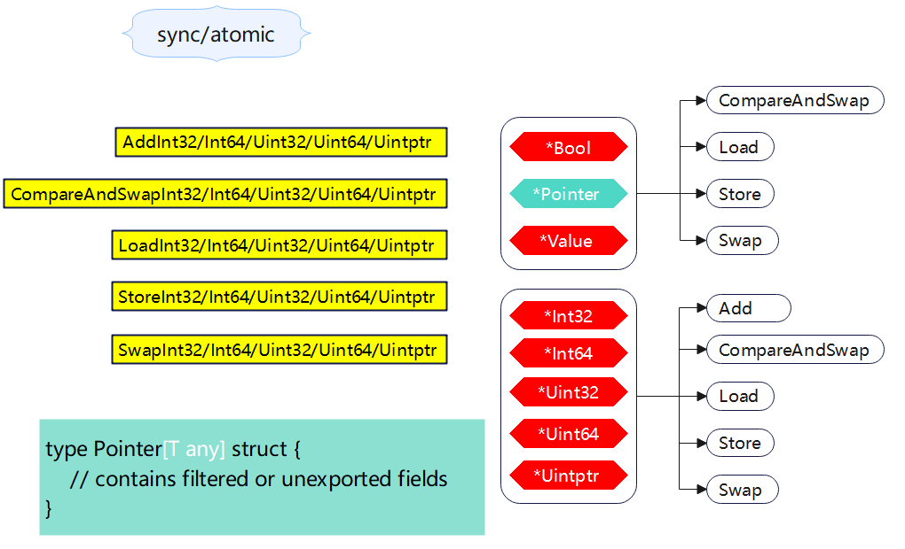

+++
title = "atomic"
date = 2023-05-17T11:11:20+08:00
type = "docs"
description = ""
isCJKLanguage = true
draft = false
+++
> 原文：[https://pkg.go.dev/sync/atomic@go1.23.0](https://pkg.go.dev/sync/atomic@go1.23.0)



Package atomic provides low-level atomic memory primitives useful for implementing synchronization algorithms.

​	`atomic`包提供了低级别的原子内存原语，用于实现同步算法。

These functions require great care to be used correctly. Except for special, low-level applications, synchronization is better done with channels or the facilities of the [sync](https://pkg.go.dev/sync) package. Share memory by communicating; don't communicate by sharing memory.

​	这些函数需要非常小心才能正确使用。除特殊的低级应用外，最好使用通道或`sync`包的工具进行同步。通过通信来共享内存，而不是通过共享内存来通信。

The swap operation, implemented by the SwapT functions, is the atomic equivalent of:

​	由`SwapT`函数实现的交换操作，其原子操作相当于：

```go
old = *addr
*addr = new
return old
```

The compare-and-swap operation, implemented by the CompareAndSwapT functions, is the atomic equivalent of:

​	由`CompareAndSwapT`函数实现的比较并交换操作，其原子操作相当于：

```go
if *addr == old {
	*addr = new
	return true
}
return false
```

The add operation, implemented by the AddT functions, is the atomic equivalent of:

​	由`AddT`函数实现的加法操作，其原子操作相当于：

```go
*addr += delta
return *addr
```

The load and store operations, implemented by the LoadT and StoreT functions, are the atomic equivalents of "`return *addr`" and "*addr = val".

​	由`LoadT`和`StoreT`函数实现的加载和存储操作，其原子操作相当于“`return *addr`”和“`*addr = val`”。

In the terminology of the Go memory model, if the effect of an atomic operation A is observed by atomic operation B, then A “synchronizes before” B. Additionally, all the atomic operations executed in a program behave as though executed in some sequentially consistent order. This definition provides the same semantics as C++'s sequentially consistent atomics and Java's volatile variables.

​	在Go内存模型的术语中，如果一个原子操作`A`的效果被原子操作`B`观察到，那么`A`“在`B`之前同步”。此外，程序中执行的所有原子操作表现为好像是以某种顺序一致的方式执行的。这个定义提供了与C++的顺序一致原子操作和Java的易失性变量相同的语义。


## 常量 

This section is empty.

## 变量

This section is empty.

## 函数

### func AddInt32 

``` go 
func AddInt32(addr *int32, delta int32) (new int32)
```

AddInt32 atomically adds delta to `*addr` and returns the new value. Consider using the more ergonomic and less error-prone [Int32.Add](https://pkg.go.dev/sync/atomic#Int32.Add) instead.

​	`AddInt32`函数原子地将delta添加到`*addr`，并返回`new`值。考虑使用更符合人体工程学和更不容易出错的Int32.Add代替。

### func AddInt64 

``` go 
func AddInt64(addr *int64, delta int64) (new int64)
```

AddInt64 atomically adds delta to `*addr` and returns the new value. Consider using the more ergonomic and less error-prone [Int64.Add](https://pkg.go.dev/sync/atomic#Int64.Add) instead (particularly if you target 32-bit platforms; see the bugs section).

​	`AddInt64`函数原子地将`delta`添加到`*addr`，并返回`new`值。如果您的目标是32位平台，请考虑使用更符合人体工程学和更不容易出错的`Int64.Add`代替(请参见错误部分)。

### func AddUint32 

``` go 
func AddUint32(addr *uint32, delta uint32) (new uint32)
```

AddUint32 atomically adds delta to `*addr` and returns the new value. To subtract a signed positive constant value c from x, do `AddUint32(&x, ^uint32(c-1))`. In particular, to decrement x, do AddUint32(&x, ^uint32(0)). Consider using the more ergonomic and less error-prone [Uint32.Add](https://pkg.go.dev/sync/atomic#Uint32.Add) instead.

​	`AddUint32`函数原子地将`delta`添加到`*addr`，并返回`new` 值。要从`x`减去已知正常数值`c`，请执行`AddUint32(&x，^uint32(c-1))`。特别地，要将`x`减少1，请执行`AddUint32(&x，^uint32(0))`。考虑使用更符合人体工程学和更不容易出错的`Uint32.Add`代替。

### func AddUint64 

``` go 
func AddUint64(addr *uint64, delta uint64) (new uint64)
```

AddUint64 atomically adds delta to *addr and returns the new value. To subtract a signed positive constant value c from x, do `AddUint64(&x, ^uint64(c-1))`. In particular, to decrement x, do `AddUint64(&x, ^uint64(0))`. Consider using the more ergonomic and less error-prone [Uint64.Add](https://pkg.go.dev/sync/atomic#Uint64.Add) instead (particularly if you target 32-bit platforms; see the bugs section).

​	`AddUint64`函数原子地将`delta`添加到`*addr`，并返回`new`值。要从`x`减去已知正常数值`c`，请执行`AddUint64(&x，^uint64(c-1))`。特别地，要将`x`减少`1`，请执行`AddUint64(&x，^uint64(0))`。如果您的目标是32位平台，请考虑使用更符合人体工程学和更不容易出错的`Uint64.Add`代替(请参见错误部分)。

### func AddUintptr 

``` go 
func AddUintptr(addr *uintptr, delta uintptr) (new uintptr)
```

AddUintptr atomically adds delta to *addr and returns the new value. Consider using the more ergonomic and less error-prone [Uintptr.Add](https://pkg.go.dev/sync/atomic#Uintptr.Add) instead.

​	`AddUintptr`函数原子地将`delta`添加到`*addr`，并返回`new`值。考虑使用更符合人体工程学和更不容易出错的`Uintptr.Add`代替。

### func AndInt32 <- go1.23.0

``` go
func AndInt32(addr *int32, mask int32) (old int32)
```

AndInt32 atomically performs a bitwise AND operation on *addr using the bitmask provided as mask and returns the old value. Consider using the more ergonomic and less error-prone [Int32.And](https://pkg.go.dev/sync/atomic@go1.23.0#Int32.And) instead.

​	`AndInt32` 使用提供的位掩码 `mask` 对 `*addr` 执行原子按位与操作，并返回旧值。建议使用更方便且不易出错的 [Int32.And](https://pkg.go.dev/sync/atomic@go1.23.0#Int32.And) 代替。

### func AndInt64 <- go1.23.0

``` go
func AndInt64(addr *int64, mask int64) (old int64)
```

AndInt64 atomically performs a bitwise AND operation on *addr using the bitmask provided as mask and returns the old value. Consider using the more ergonomic and less error-prone [Int64.And](https://pkg.go.dev/sync/atomic@go1.23.0#Int64.And) instead.

​	`AndInt64` 使用提供的位掩码 `mask` 对 `*addr` 执行原子按位与操作，并返回旧值。建议使用更方便且不易出错的 [Int64.And](https://pkg.go.dev/sync/atomic@go1.23.0#Int64.And) 代替。

### func AndUint32 <- go1.23.0

``` go
func AndUint32(addr *uint32, mask uint32) (old uint32)
```

AndUint32 atomically performs a bitwise AND operation on *addr using the bitmask provided as mask and returns the old value. Consider using the more ergonomic and less error-prone [Uint32.And](https://pkg.go.dev/sync/atomic@go1.23.0#Uint32.And) instead.

​	`AndUint32` 使用提供的位掩码 `mask` 对 `*addr` 执行原子按位与操作，并返回旧值。建议使用更方便且不易出错的 [Uint32.And](https://pkg.go.dev/sync/atomic@go1.23.0#Uint32.And) 代替。

### func AndUint64 <- go1.23.0

``` go
func AndUint64(addr *uint64, mask uint64) (old uint64)
```

AndUint64 atomically performs a bitwise AND operation on *addr using the bitmask provided as mask and returns the old. Consider using the more ergonomic and less error-prone [Uint64.And](https://pkg.go.dev/sync/atomic@go1.23.0#Uint64.And) instead.

​	`AndUint64` 使用提供的位掩码 `mask` 对 `*addr` 执行原子按位与操作，并返回旧值。建议使用更方便且不易出错的 [Uint64.And](https://pkg.go.dev/sync/atomic@go1.23.0#Uint64.And) 代替。

### func AndUintptr <- go1.23.0

``` go
func AndUintptr(addr *uintptr, mask uintptr) (old uintptr)
```

AndUintptr atomically performs a bitwise AND operation on *addr using the bitmask provided as mask and returns the old value. Consider using the more ergonomic and less error-prone [Uintptr.And](https://pkg.go.dev/sync/atomic@go1.23.0#Uintptr.And) instead.

​	`AndUintptr` 使用提供的位掩码 `mask` 对 `*addr` 执行原子按位与操作，并返回旧值。建议使用更方便且不易出错的 [Uintptr.And](https://pkg.go.dev/sync/atomic@go1.23.0#Uintptr.And) 代替。

### func CompareAndSwapInt32 

``` go 
func CompareAndSwapInt32(addr *int32, old, new int32) (swapped bool)
```

CompareAndSwapInt32 executes the compare-and-swap operation for an int32 value. Consider using the more ergonomic and less error-prone [Int32.CompareAndSwap](https://pkg.go.dev/sync/atomic#Int32.CompareAndSwap) instead.

​	`CompareAndSwapInt32`函数执行 `int32` 值的比较并交换操作。建议使用更符合人体工程学和更少容易出错的 `Int32.CompareAndSwap`。

### func CompareAndSwapInt64 

``` go 
func CompareAndSwapInt64(addr *int64, old, new int64) (swapped bool)
```

CompareAndSwapInt64 executes the compare-and-swap operation for an int64 value. Consider using the more ergonomic and less error-prone [Int64.CompareAndSwap](https://pkg.go.dev/sync/atomic#Int64.CompareAndSwap) instead (particularly if you target 32-bit platforms; see the bugs section).

​	`CompareAndSwapInt64`函数执行 `int64` 值的比较并交换操作。建议使用更符合人体工程学和更少容易出错的 `Int64.CompareAndSwap` (特别是针对 32 位平台；参见错误部分)。

### func CompareAndSwapPointer 

``` go 
func CompareAndSwapPointer(addr *unsafe.Pointer, old, new unsafe.Pointer) (swapped bool)
```

CompareAndSwapPointer executes the compare-and-swap operation for a unsafe.Pointer value. Consider using the more ergonomic and less error-prone [Pointer.CompareAndSwap](https://pkg.go.dev/sync/atomic#Pointer.CompareAndSwap) instead.

​	`CompareAndSwapPointer`函数执行 `unsafe.Pointer` 值的比较并交换操作。建议使用更符合人体工程学和更少容易出错的 `Pointer.CompareAndSwap`。

### func CompareAndSwapUint32 

``` go 
func CompareAndSwapUint32(addr *uint32, old, new uint32) (swapped bool)
```

CompareAndSwapUint32 executes the compare-and-swap operation for a uint32 value. Consider using the more ergonomic and less error-prone [Uint32.CompareAndSwap](https://pkg.go.dev/sync/atomic#Uint32.CompareAndSwap) instead.

​	`CompareAndSwapUint32`函数执行 `uint32` 值的比较并交换操作。建议使用更符合人体工程学和更少容易出错的 `Uint32.CompareAndSwap`。

### func CompareAndSwapUint64 

``` go 
func CompareAndSwapUint64(addr *uint64, old, new uint64) (swapped bool)
```

CompareAndSwapUint64 executes the compare-and-swap operation for a uint64 value. Consider using the more ergonomic and less error-prone [Uint64.CompareAndSwap](https://pkg.go.dev/sync/atomic#Uint64.CompareAndSwap) instead (particularly if you target 32-bit platforms; see the bugs section).

​	`CompareAndSwapUint64`函数执行 `uint64` 值的比较并交换操作。建议使用更符合人体工程学和更少容易出错的 `Uint64.CompareAndSwap` (特别是针对 32 位平台；参见错误部分)。

### func CompareAndSwapUintptr 

``` go 
func CompareAndSwapUintptr(addr *uintptr, old, new uintptr) (swapped bool)
```

CompareAndSwapUintptr executes the compare-and-swap operation for a uintptr value. Consider using the more ergonomic and less error-prone [Uintptr.CompareAndSwap](https://pkg.go.dev/sync/atomic#Uintptr.CompareAndSwap) instead.

​	`CompareAndSwapUintptr`函数执行 `uintptr` 值的比较并交换操作。建议使用更符合人体工程学和更少容易出错的 `Uintptr.CompareAndSwap`。

### func LoadInt32 

``` go 
func LoadInt32(addr *int32) (val int32)
```

LoadInt32 atomically loads *addr. Consider using the more ergonomic and less error-prone [Int32.Load](https://pkg.go.dev/sync/atomic#Int32.Load) instead.

​	`LoadInt32`函数原子地加载 `*addr`。考虑使用更符合人体工程学且不易出错的 `Int32.Load`。

### func LoadInt64 

``` go 
func LoadInt64(addr *int64) (val int64)
```

LoadInt64 atomically loads *addr. Consider using the more ergonomic and less error-prone [Int64.Load](https://pkg.go.dev/sync/atomic#Int64.Load) instead (particularly if you target 32-bit platforms; see the bugs section).

​	`LoadInt64`函数原子地加载 `*addr`。考虑使用更符合人体工程学且不易出错的 `Int64.Load`(特别是如果您的目标是32位平台；请参见错误部分)。

### func LoadPointer 

``` go 
func LoadPointer(addr *unsafe.Pointer) (val unsafe.Pointer)
```

LoadPointer atomically loads *addr. Consider using the more ergonomic and less error-prone [Pointer.Load](https://pkg.go.dev/sync/atomic#Pointer.Load) instead.

​	`LoadPointer`函数原子地加载 `*addr`。考虑使用更符合人体工程学且不易出错的 `Pointer.Load`。

### func LoadUint32 

``` go 
func LoadUint32(addr *uint32) (val uint32)
```

LoadUint32 atomically loads *addr. Consider using the more ergonomic and less error-prone [Uint32.Load](https://pkg.go.dev/sync/atomic#Uint32.Load) instead.

​	`LoadUint32`函数原子地加载 `*addr`。考虑使用更符合人体工程学且不易出错的 `Uint32.Load`。

### func LoadUint64 

``` go 
func LoadUint64(addr *uint64) (val uint64)
```

LoadUint64 atomically loads *addr. Consider using the more ergonomic and less error-prone [Uint64.Load](https://pkg.go.dev/sync/atomic#Uint64.Load) instead (particularly if you target 32-bit platforms; see the bugs section).

​	`LoadUint64`函数原子地加载 `*addr`。考虑使用更符合人体工程学且不易出错的 `Uint64.Load`(特别是如果您的目标是32位平台；请参见错误部分)。

### func LoadUintptr 

``` go 
func LoadUintptr(addr *uintptr) (val uintptr)
```

LoadUintptr atomically loads *addr. Consider using the more ergonomic and less error-prone [Uintptr.Load](https://pkg.go.dev/sync/atomic#Uintptr.Load) instead.

​	`LoadUintptr`函数原子地加载 `*addr`。考虑使用更符合人体工程学且不易出错的 `Uintptr.Load`。

### func OrInt32 <- go1.23.0

``` go
func OrInt32(addr *int32, mask int32) (old int32)
```

OrInt32 atomically performs a bitwise OR operation on *addr using the bitmask provided as mask and returns the old value. Consider using the more ergonomic and less error-prone [Int32.Or](https://pkg.go.dev/sync/atomic@go1.23.0#Int32.Or) instead.

​	`OrInt32` 使用提供的位掩码 `mask` 对 `*addr` 执行原子按位或操作，并返回旧值。建议使用更方便且不易出错的 [Int32.Or](https://pkg.go.dev/sync/atomic@go1.23.0#Int32.Or) 代替。

### func OrInt64 <- go1.23.0

``` go
func OrInt64(addr *int64, mask int64) (old int64)
```

OrInt64 atomically performs a bitwise OR operation on *addr using the bitmask provided as mask and returns the old value. Consider using the more ergonomic and less error-prone [Int64.Or](https://pkg.go.dev/sync/atomic@go1.23.0#Int64.Or) instead.

​	`OrInt64` 使用提供的位掩码 `mask` 对 `*addr` 执行原子按位或操作，并返回旧值。建议使用更方便且不易出错的 [Int64.Or](https://pkg.go.dev/sync/atomic@go1.23.0#Int64.Or) 代替。

### func OrUint32 <- go1.23.0

``` go
func OrUint32(addr *uint32, mask uint32) (old uint32)
```

OrUint32 atomically performs a bitwise OR operation on *addr using the bitmask provided as mask and returns the old value. Consider using the more ergonomic and less error-prone [Uint32.Or](https://pkg.go.dev/sync/atomic@go1.23.0#Uint32.Or) instead.

​	`OrUint32` 使用提供的位掩码 `mask` 对 `*addr` 执行原子按位或操作，并返回旧值。建议使用更方便且不易出错的 [Uint32.Or](https://pkg.go.dev/sync/atomic@go1.23.0#Uint32.Or) 代替。

### func OrUint64 <- go1.23.0

``` go
func OrUint64(addr *uint64, mask uint64) (old uint64)
```

OrUint64 atomically performs a bitwise OR operation on *addr using the bitmask provided as mask and returns the old value. Consider using the more ergonomic and less error-prone [Uint64.Or](https://pkg.go.dev/sync/atomic@go1.23.0#Uint64.Or) instead.

​	`OrUint64` 使用提供的位掩码 `mask` 对 `*addr` 执行原子按位或操作，并返回旧值。建议使用更方便且不易出错的 [Uint64.Or](https://pkg.go.dev/sync/atomic@go1.23.0#Uint64.Or) 代替。

### func OrUintptr <- go1.23.0

``` go
func OrUintptr(addr *uintptr, mask uintptr) (old uintptr)
```

OrUintptr atomically performs a bitwise OR operation on *addr using the bitmask provided as mask and returns the old value. Consider using the more ergonomic and less error-prone [Uintptr.Or](https://pkg.go.dev/sync/atomic@go1.23.0#Uintptr.Or) instead.

​	`OrUintptr` 使用提供的位掩码 `mask` 对 `*addr` 执行原子按位或操作，并返回旧值。建议使用更方便且不易出错的 [Uintptr.Or](https://pkg.go.dev/sync/atomic@go1.23.0#Uintptr.Or) 代替。

### func StoreInt32 

``` go 
func StoreInt32(addr *int32, val int32)
```

StoreInt32 atomically stores val into *addr. Consider using the more ergonomic and less error-prone [Int32.Store](https://pkg.go.dev/sync/atomic#Int32.Store) instead.

​	`StoreInt32`函数原子地将 `val` 存储到 `*addr`。考虑使用更符合人体工程学且不易出错的 `Int32.Store`。

### func StoreInt64 

``` go 
func StoreInt64(addr *int64, val int64)
```

StoreInt64 atomically stores val into *addr. Consider using the more ergonomic and less error-prone [Int64.Store](https://pkg.go.dev/sync/atomic#Int64.Store) instead (particularly if you target 32-bit platforms; see the bugs section).

​	`StoreInt64`函数原子地将 `val` 存储到 `*addr`。考虑使用更符合人体工程学且不易出错的 `Int64.Store`(特别是如果您的目标是32位平台；请参见错误部分)。

### func StorePointer 

``` go 
func StorePointer(addr *unsafe.Pointer, val unsafe.Pointer)
```

StorePointer atomically stores val into *addr. Consider using the more ergonomic and less error-prone [Pointer.Store](https://pkg.go.dev/sync/atomic#Pointer.Store) instead.

​	`StorePointer`函数原子地将 `val` 存储到 `*addr`。考虑使用更符合人体工程学且不易出错的 `Pointer.Store`。

### func StoreUint32 

``` go 
func StoreUint32(addr *uint32, val uint32)
```

StoreUint32 atomically stores val into *addr. Consider using the more ergonomic and less error-prone [Uint32.Store](https://pkg.go.dev/sync/atomic#Uint32.Store) instead.

​	`StoreUint32`函数原子性地将`val`存储到`*addr`。考虑使用更符合人体工程学且更少出错的`Uint32.Store`。

### func StoreUint64 

``` go 
func StoreUint64(addr *uint64, val uint64)
```

StoreUint64 atomically stores val into *addr. Consider using the more ergonomic and less error-prone [Uint64.Store](https://pkg.go.dev/sync/atomic#Uint64.Store) instead (particularly if you target 32-bit platforms; see the bugs section).

​	`StoreUint64`函数原子性地将`val`存储到`*addr`。考虑使用更符合人体工程学且更少出错的`Uint64.Store`(特别是针对32位平台，参见bugs一节)。

### func StoreUintptr 

``` go 
func StoreUintptr(addr *uintptr, val uintptr)
```

StoreUintptr atomically stores val into *addr. Consider using the more ergonomic and less error-prone [Uintptr.Store](https://pkg.go.dev/sync/atomic#Uintptr.Store) instead.

​	`StoreUintptr`函数原子性地将`val`存储到`*addr`。考虑使用更符合人体工程学且更少出错的`Uintptr.Store`。

### func SwapInt32  <- go1.2

``` go 
func SwapInt32(addr *int32, new int32) (old int32)
```

SwapInt32 atomically stores new into *addr and returns the previous *addr value. Consider using the more ergonomic and less error-prone [Int32.Swap](https://pkg.go.dev/sync/atomic#Int32.Swap) instead.

​	`SwapInt32`函数原子性地将`new`存储到`*addr`并返回先前的`*addr`值。考虑使用更符合人体工程学且更少出错的`Int32.Swap`。

### func SwapInt64  <- go1.2

``` go 
func SwapInt64(addr *int64, new int64) (old int64)
```

SwapInt64 atomically stores new into *addr and returns the previous *addr value. Consider using the more ergonomic and less error-prone [Int64.Swap](https://pkg.go.dev/sync/atomic#Int64.Swap) instead (particularly if you target 32-bit platforms; see the bugs section).

​	`SwapInt64`函数原子性地将`new`存储到`*addr`并返回先前的`*addr`值。考虑使用更符合人体工程学且更少出错的`Int64.Swap`(特别是针对32位平台，参见bugs一节)。

### func SwapPointer  <- go1.2

``` go 
func SwapPointer(addr *unsafe.Pointer, new unsafe.Pointer) (old unsafe.Pointer)
```

SwapPointer atomically stores new into *addr and returns the previous *addr value. Consider using the more ergonomic and less error-prone [Pointer.Swap](https://pkg.go.dev/sync/atomic#Pointer.Swap) instead.

​	`SwapPointer`函数原子性地将`new`存储到`*addr`并返回先前的`*addr`值。考虑使用更符合人体工程学且更少出错的`Pointer.Swap`。

### func SwapUint32  <- go1.2

``` go 
func SwapUint32(addr *uint32, new uint32) (old uint32)
```

SwapUint32 atomically stores new into *addr and returns the previous *addr value. Consider using the more ergonomic and less error-prone [Uint32.Swap](https://pkg.go.dev/sync/atomic#Uint32.Swap) instead.

​	`SwapUint32`函数原子性地将new存储到`*addr`并返回先前的`*addr`值。考虑使用更符合人体工程学且更少出错的`Uint32.Swap`。

### func SwapUint64  <- go1.2

``` go 
func SwapUint64(addr *uint64, new uint64) (old uint64)
```

SwapUint64 atomically stores new into *addr and returns the previous *addr value. Consider using the more ergonomic and less error-prone [Uint64.Swap](https://pkg.go.dev/sync/atomic#Uint64.Swap) instead (particularly if you target 32-bit platforms; see the bugs section).

​	`SwapUint64`函数原子性地将`new`存储到`*addr`并返回先前的`*addr`值。考虑使用更符合人体工程学且更少出错的`Uint64.Swap`(特别是针对32位平台，参见bugs一节)。

### func SwapUintptr  <- go1.2

``` go 
func SwapUintptr(addr *uintptr, new uintptr) (old uintptr)
```

SwapUintptr atomically stores new into *addr and returns the previous *addr value. Consider using the more ergonomic and less error-prone [Uintptr.Swap](https://pkg.go.dev/sync/atomic#Uintptr.Swap) instead.

​	`SwapUintptr`函数原子性地将`new`存储到`*addr`并返回先前的`*addr`值。考虑使用更符合人体工程学且更少出错的`Uintptr.Swap`。

## 类型

### type Bool  <- go1.19

``` go 
type Bool struct {
	// contains filtered or unexported fields
}
```

A Bool is an atomic boolean value. The zero value is false.

​	`Bool`结构体是一个原子布尔值。 零值为`false`。

#### (*Bool) CompareAndSwap  <- go1.19

``` go 
func (x *Bool) CompareAndSwap(old, new bool) (swapped bool)
```

CompareAndSwap executes the compare-and-swap operation for the boolean value x.

​	`CompareAndSwap`方法执行布尔值`x`的比较和交换操作。

#### (*Bool) Load  <- go1.19

``` go 
func (x *Bool) Load() bool
```

Load atomically loads and returns the value stored in x.

​	`Load`方法以原子方式加载并返回存储在`x`中的值。

#### (*Bool) Store  <- go1.19

``` go 
func (x *Bool) Store(val bool)
```

Store atomically stores val into x.

​	`Store`方法原子地将`val`存储到x中。

#### (*Bool) Swap  <- go1.19

``` go 
func (x *Bool) Swap(new bool) (old bool)
```

Swap atomically stores new into x and returns the previous value.

​	`Swap`方法以原子方式将`new`存储到`x`中并返回先前的值。

### type Int32  <- go1.19

``` go 
type Int32 struct {
	// contains filtered or unexported fields
}
```

An Int32 is an atomic int32. The zero value is zero.

​	`Int32`方法是一个原子`int32`。 零值为`0`。

#### (*Int32) Add  <- go1.19

``` go 
func (x *Int32) Add(delta int32) (new int32)
```

Add atomically adds delta to x and returns the new value.

​	`Add`方法原子地将`delta`添加到`x`并返回`new`值。

#### (*Int32) And <- go1.23.0

``` go
func (x *Int32) And(mask int32) (old int32)
```

And atomically performs a bitwise AND operation on x using the bitmask provided as mask and returns the old value.

​	`And` 使用提供的位掩码 `mask` 对 `x` 执行原子按位与操作，并返回旧值。

#### (*Int32) CompareAndSwap  <- go1.19

``` go 
func (x *Int32) CompareAndSwap(old, new int32) (swapped bool)
```

CompareAndSwap executes the compare-and-swap operation for x.

​	`CompareAndSwap`方法执行`x`的比较和交换操作。

#### (*Int32) Load  <- go1.19

``` go 
func (x *Int32) Load() int32
```

Load atomically loads and returns the value stored in x.

​	`Load`方法原子地加载并返回存储在`x`中的值。

#### (*Int32) Or <- go1.23.0

``` go
func (x *Int32) Or(mask int32) (old int32)
```

Or atomically performs a bitwise OR operation on x using the bitmask provided as mask and returns the old value.

​	`Or` 使用提供的位掩码 `mask` 对 `x` 执行原子按位或操作，并返回旧值。

#### (*Int32) Store  <- go1.19

``` go 
func (x *Int32) Store(val int32)
```

Store atomically stores val into x.

​	`Store`方法原子地将`val`存储到`x`中。

#### (*Int32) Swap  <- go1.19

``` go 
func (x *Int32) Swap(new int32) (old int32)
```

Swap atomically stores new into x and returns the previous value.

​	`Swap`方法原子地将`new`存储到`x`中并返回先前的值。

### type Int64  <- go1.19

``` go 
type Int64 struct {
	// contains filtered or unexported fields
}
```

An Int64 is an atomic int64. The zero value is zero.

​	`Int64`方法是原子`int64`。零值为`0`。

#### (*Int64) Add  <- go1.19

``` go 
func (x *Int64) Add(delta int64) (new int64)
```

Add atomically adds delta to x and returns the new value.

​	`Add`方法原子地将`delta`添加到`x`并返回`new`值。

#### (*Int64) And <- go1.23.0

``` go
func (x *Int64) And(mask int64) (old int64)
```

And atomically performs a bitwise AND operation on x using the bitmask provided as mask and returns the old value.

​	`And` 使用提供的位掩码 `mask` 对 `x` 执行原子按位与操作，并返回旧值。

#### (*Int64) CompareAndSwap  <- go1.19

``` go 
func (x *Int64) CompareAndSwap(old, new int64) (swapped bool)
```

CompareAndSwap executes the compare-and-swap operation for x.

​	`CompareAndSwap`方法执行`x`的比较并交换操作。

#### (*Int64) Load  <- go1.19

``` go 
func (x *Int64) Load() int64
```

Load atomically loads and returns the value stored in x.

​	`Load`方法原子地加载并返回存储在`x`中的值。

#### (*Int64) Or <- go1.23.0

``` go
func (x *Int64) Or(mask int64) (old int64)
```

Or atomically performs a bitwise OR operation on x using the bitmask provided as mask and returns the old value.

​	`Or` 使用提供的位掩码 `mask` 对 `x` 执行原子按位或操作，并返回旧值。

#### (*Int64) Store  <- go1.19

``` go 
func (x *Int64) Store(val int64)
```

Store atomically stores val into x.

​	`Store`方法原子地将`val`存储到`x`中。

#### (*Int64) Swap  <- go1.19

``` go 
func (x *Int64) Swap(new int64) (old int64)
```

Swap atomically stores new into x and returns the previous value.

​	`Swap`方法原子地将`new`存储到`x`中并返回先前的值。

### type Pointer  <- go1.19

``` go 
type Pointer[T any] struct {
	// contains filtered or unexported fields
}
```

A Pointer is an atomic pointer of type *T. The zero value is a nil *T.

​	`Pointer` 是一个类型为 `*T` 的原子指针。零值是 nil 的 `*T`。

#### (*Pointer[T]) CompareAndSwap  <- go1.19

``` go 
func (x *Pointer[T]) CompareAndSwap(old, new *T) (swapped bool)
```

CompareAndSwap executes the compare-and-swap operation for x.

​	`CompareAndSwap`方法执行 `x` 的比较并交换操作。

#### (*Pointer[T]) Load  <- go1.19

``` go 
func (x *Pointer[T]) Load() *T
```

Load atomically loads and returns the value stored in x.

​	`Load`方法原子地加载并返回存储在 `x` 中的值。

#### (*Pointer[T]) Store  <- go1.19

``` go 
func (x *Pointer[T]) Store(val *T)
```

Store atomically stores val into x.

​	`Store`方法原子地将 `val` 存储到 `x` 中。

#### (*Pointer[T]) Swap  <- go1.19

``` go 
func (x *Pointer[T]) Swap(new *T) (old *T)
```

Swap atomically stores new into x and returns the previous value.

​	`Swap`方法原子地将 `new` 存储到 `x` 中，并返回先前的值。

### type Uint32  <- go1.19

``` go 
type Uint32 struct {
	// contains filtered or unexported fields
}
```

A Uint32 is an atomic uint32. The zero value is zero.

​	`Uint32`方法是一个原子 `uint32`。零值是`0`。

#### (*Uint32) Add  <- go1.19

``` go 
func (x *Uint32) Add(delta uint32) (new uint32)
```

Add atomically adds delta to x and returns the new value.

​	`Add`方法原子地将 `delta` 添加到 `x` 并返回`new`值。

#### (*Uint32) And <- go1.23.0

``` go
func (x *Uint32) And(mask uint32) (old uint32)
```

And atomically performs a bitwise AND operation on x using the bitmask provided as mask and returns the old value.

​	`And` 使用提供的位掩码 `mask` 对 `x` 执行原子按位与操作，并返回旧值。

#### (*Uint32) CompareAndSwap  <- go1.19

``` go 
func (x *Uint32) CompareAndSwap(old, new uint32) (swapped bool)
```

CompareAndSwap executes the compare-and-swap operation for x.

​	`CompareAndSwap`方法执行 `x` 的比较并交换操作。

#### (*Uint32) Or <- go1.23.0

``` go
func (x *Uint32) Or(mask uint32) (old uint32)
```

Or atomically performs a bitwise OR operation on x using the bitmask provided as mask and returns the old value.

​	`Or` 使用提供的位掩码 `mask` 对 `x` 执行原子按位或操作，并返回旧值。

#### (*Uint32) Load  <- go1.19

``` go 
func (x *Uint32) Load() uint32
```

Load atomically loads and returns the value stored in x.

​	`Load`方法原子地加载并返回存储在`x`中的值。

#### (*Uint32) Store  <- go1.19

``` go 
func (x *Uint32) Store(val uint32)
```

Store atomically stores val into x.

​	`Store`方法原子地将`val`存储到x中。

#### (*Uint32) Swap  <- go1.19

``` go 
func (x *Uint32) Swap(new uint32) (old uint32)
```

Swap atomically stores new into x and returns the previous value.

​	`Swap`方法原子地将`new`存储到`x`中并返回先前的值。

### type Uint64  <- go1.19

``` go 
type Uint64 struct {
	// contains filtered or unexported fields
}
```

A Uint64 is an atomic uint64. The zero value is zero.

​	`Uint64`方法是一个原子性的`uint64`类型。零值为`0`。

#### (*Uint64) Add  <- go1.19

``` go 
func (x *Uint64) Add(delta uint64) (new uint64)
```

Add atomically adds delta to x and returns the new value.

​	`Add`方法原子性地将`delta`添加到`x`中并返回`new`值。

#### (*Uint64) And <- go1.23.0

``` go
func (x *Uint64) And(mask uint64) (old uint64)
```

And atomically performs a bitwise AND operation on x using the bitmask provided as mask and returns the old value.

​	`And` 使用提供的位掩码 `mask` 对 `x` 执行原子按位与操作，并返回旧值。

#### (*Uint64) CompareAndSwap  <- go1.19

``` go 
func (x *Uint64) CompareAndSwap(old, new uint64) (swapped bool)
```

CompareAndSwap executes the compare-and-swap operation for x.

​	`CompareAndSwap`方法在`x`上执行比较并交换操作。

#### (*Uint64) Or <- go1.23.0

``` go
func (x *Uint64) Or(mask uint64) (old uint64)
```

Or atomically performs a bitwise OR operation on x using the bitmask provided as mask and returns the old value.

​	`Or` 使用提供的位掩码 `mask` 对 `x` 执行原子按位或操作，并返回旧值。

#### (*Uint64) Load  <- go1.19

``` go 
func (x *Uint64) Load() uint64
```

Load atomically loads and returns the value stored in x.

​	`Load`方法原子地加载并返回存储在`x`中的值。

#### (*Uint64) Store  <- go1.19

``` go 
func (x *Uint64) Store(val uint64)
```

Store atomically stores val into x.

​	`Store`方法原子地将`val`存储到`x`中。

#### (*Uint64) Swap  <- go1.19

``` go 
func (x *Uint64) Swap(new uint64) (old uint64)
```

Swap atomically stores new into x and returns the previous value.

​	`Swap`方法原子地将`new`存储到`x`中并返回先前的值。

### type Uintptr  <- go1.19

``` go 
type Uintptr struct {
	// contains filtered or unexported fields
}
```

A Uintptr is an atomic uintptr. The zero value is zero.

​	`Uintptr`是一个原子的`uintptr`类型。零值为`0`。

#### (*Uintptr) Add  <- go1.19

``` go 
func (x *Uintptr) Add(delta uintptr) (new uintptr)
```

Add atomically adds delta to x and returns the new value.

​	`Add`方法原子地将`delta`添加到`x`并返回`new`值。

#### (*Uintptr) And <- go1.23.0

``` go
func (x *Uintptr) And(mask uintptr) (old uintptr)
```

And atomically performs a bitwise AND operation on x using the bitmask provided as mask and returns the old value.

​	`And` 使用提供的位掩码 `mask` 对 `x` 执行原子按位与操作，并返回旧值。

#### (*Uintptr) CompareAndSwap  <- go1.19

``` go 
func (x *Uintptr) CompareAndSwap(old, new uintptr) (swapped bool)
```

CompareAndSwap executes the compare-and-swap operation for x.

​	`CompareAndSwap`方法执行`x`的比较和交换操作。

#### (*Uintptr) Load  <- go1.19

``` go 
func (x *Uintptr) Load() uintptr
```

Load atomically loads and returns the value stored in x.

​	`Load`方法以原子方式加载并返回存储在`x`中的值。

#### (*Uintptr) Or <- go1.23.0

``` go
func (x *Uintptr) Or(mask uintptr) (old uintptr)
```

Or atomically performs a bitwise OR operation on x using the bitmask provided as mask and returns the updated value after the OR operation.

​	`Or` 使用提供的位掩码 `mask` 对 `x` 执行原子按位或操作，并返回按位或操作后的更新值。

#### (*Uintptr) Store  <- go1.19

``` go 
func (x *Uintptr) Store(val uintptr)
```

Store atomically stores val into x.

​	`Store`方法以原子方式将`val`存储到`x`中。

#### (*Uintptr) Swap  <- go1.19

``` go 
func (x *Uintptr) Swap(new uintptr) (old uintptr)
```

Swap atomically stores new into x and returns the previous value.

​	`Swap`方法以原子方式将`new`存储到`x`中并返回先前的值。

### type Value  <- go1.4

``` go 
type Value struct {    
	v any
}
```

A Value provides an atomic load and store of a consistently typed value. The zero value for a Value returns nil from Load. Once Store has been called, a Value must not be copied.

​	`Value`类型提供了一个一致类型值的原子加载和存储。`Value`类型的零值从`Load`返回nil。一旦调用了`Store`，就不能再复制`Value`。

A Value must not be copied after first use.

​	使用后不能再复制`Value`。

#### Example (Config)

The following example shows how to use Value for periodic program config updates and propagation of the changes to worker goroutines.

​	以下示例展示了如何使用 `Value` 来进行定期程序配置更新，并将更改传播到工作 goroutines。

``` go 
package main

import (
	"sync/atomic"
	"time"
)

func loadConfig() map[string]string {
	return make(map[string]string)
}

func requests() chan int {
	return make(chan int)
}

func main() {
	var config atomic.Value // holds current server configuration 保存当前服务器配置
	// Create initial config value and store into config. 创建初始配置值并存储到 config 中。
	config.Store(loadConfig())
	go func() {
		// Reload config every 10 seconds
		// and update config value with the new version.
        // 每隔 10 秒重新加载配置
		// 并使用新版本更新配置值。
		for {
			time.Sleep(10 * time.Second)
			config.Store(loadConfig())
		}
	}()
	// Create worker goroutines that handle incoming requests
	// using the latest config value.
    // 创建处理传入请求的工作 goroutine
	// 使用最新的配置值。
	for i := 0; i < 10; i++ {
		go func() {
			for r := range requests() {
				c := config.Load()
				// Handle request r using config c.
                // 使用配置 c 处理请求 r。
				_, _ = r, c
			}
		}()
	}
}

```

#### Example (ReadMostly) 

The following example shows how to maintain a scalable frequently read, but infrequently updated data structure using copy-on-write idiom.

​	以下示例展示了如何使用写时复制（copy-on-write）惯用语法来维护一个可扩展的频繁读取但不经常更新的数据结构。

``` go 
package main

import (
	"sync"
	"sync/atomic"
)

func main() {
	type Map map[string]string
	var m atomic.Value
	m.Store(make(Map))
	var mu sync.Mutex // used only by writers 仅由写入者使用
	// read function can be used to read the data without further synchronization
    // read 函数用于在无需进一步同步的情况下读取数据
	read := func(key string) (val string) {
		m1 := m.Load().(Map)
		return m1[key]
	}
	// insert function can be used to update the data without further synchronization
    // insert 函数用于在无需进一步同步的情况下更新数据
	insert := func(key, val string) {
		mu.Lock() // synchronize with other potential writers 与其他潜在写入者同步
		defer mu.Unlock()
		m1 := m.Load().(Map) // load current value of the data structure 加载当前数据结构的值
		m2 := make(Map)      // create a new value 创建新值
		for k, v := range m1 {
			m2[k] = v // copy all data from the current object to the new one 从当前对象复制所有数据到新对象
		}
		m2[key] = val // do the update that we need  执行我们需要的更新
		m.Store(m2)   // atomically replace the current object with the new one 原子地将当前对象替换为新对象
		// At this point all new readers start working with the new version.
		// The old version will be garbage collected once the existing readers
		// (if any) are done with it.
        // 此时，所有新读取者开始使用新版本。
		// 旧版本将在现有读取者（如果有）完成后进行垃圾回收。
	}
	_, _ = read, insert
}

```

#### (*Value) CompareAndSwap  <- go1.17

``` go 
func (v *Value) CompareAndSwap(old, new any) (swapped bool)
```

CompareAndSwap executes the compare-and-swap operation for the Value.

​	`CompareAndSwap`方法为`Value`执行比较和交换操作。

All calls to CompareAndSwap for a given Value must use values of the same concrete type. CompareAndSwap of an inconsistent type panics, as does CompareAndSwap(old, nil).

​	所有对给定`Value`的`CompareAndSwap`调用必须使用相同具体类型的值。类型不一致的`CompareAndSwap`会导致panic，`CompareAndSwap(old, nil)`也是如此。

#### (*Value) Load  <- go1.4

``` go 
func (v *Value) Load() (val any)
```

Load returns the value set by the most recent Store. It returns nil if there has been no call to Store for this Value.

​	`Load`方法返回最近一次`Store`设置的值。如果没有为此`Value`调用`Store`，则返回`nil`。

#### (*Value) Store  <- go1.4

``` go 
func (v *Value) Store(val any)
```

Store sets the value of the Value v to val. All calls to Store for a given Value must use values of the same concrete type. Store of an inconsistent type panics, as does Store(nil).

​	`Store`方法将`Value` `v`的值设置为`val`。所有对给定`Value`的`Store`调用必须使用相同具体类型的值。类型不一致的`Store`会导致panic，`Store(nil)`也是如此。

#### (*Value) Swap  <- go1.17

``` go 
func (v *Value) Swap(new any) (old any)
```

Swap stores new into Value and returns the previous value. It returns nil if the Value is empty.

​	`Swap`方法操作将`new`值存储到`Value`中，并返回旧值。如果`Value`为空，则返回`nil`。

All calls to Swap for a given Value must use values of the same concrete type. Swap of an inconsistent type panics, as does Swap(nil).

​	对于同一个 `Value`，所有 `Swap`方法的调用必须使用相同的具体类型的值。如果使用不一致的类型进行 Swap方法，会导致 panic，就像 `Swap(nil)` 一样。

## Notes

## Bugs

- 在386上，64位函数使用Pentium MMX之前不可用的指令。

  在非Linux ARM上，64位函数使用ARMv6k核心之前不可用的指令。

  在ARM，386和32位MIPS上，通过原子函数访问64位字(类型Int64和Uint64自动对齐)的调用方有责任安排64位对齐。可以依靠分配的结构体，数组或切片中的第一个字，全局变量中的第一个字或局部变量中的第一个字(因为所有原子操作的主题都将逃逸到堆中)为64位对齐。