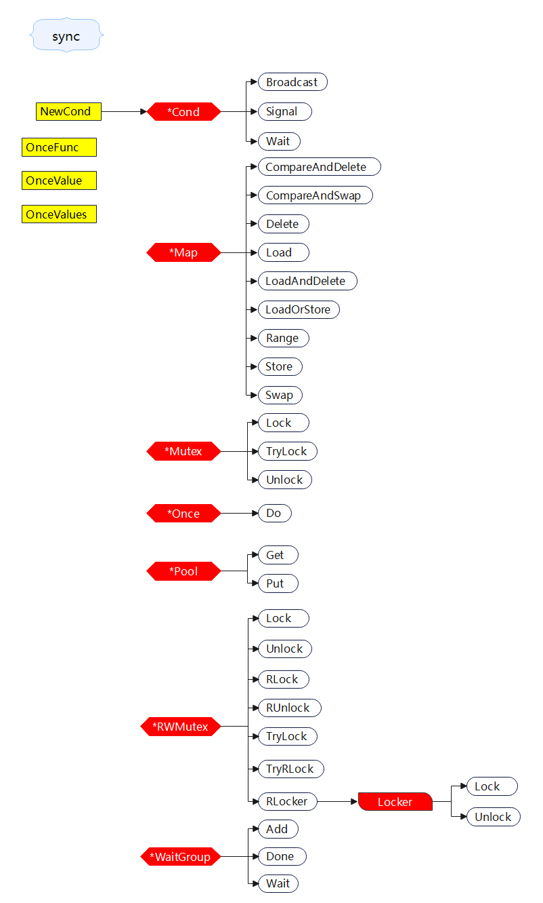

+++
title = "sync"
date = 2023-05-17T11:11:20+08:00
type = "docs"
description = ""
isCJKLanguage = true
draft = false

+++
> 原文：[https://pkg.go.dev/sync@go1.24.2](https://pkg.go.dev/sync@go1.24.2)



Package sync provides basic synchronization primitives such as mutual exclusion locks. Other than the Once and WaitGroup types, most are intended for use by low-level library routines. Higher-level synchronization is better done via channels and communication.

​	 `sync`包提供了基本的同步原语，如互斥锁。除了 `Once` 和 `WaitGroup` 类型外，大多数都是用于低级库例程的。更高级别的同步最好通过通道和通信实现。

Values containing the types defined in this package should not be copied.

​	不应该复制包含此包中定义类型的值。

## 常量 

This section is empty.

## 变量

This section is empty.

## 函数

### func OnceFunc <- go1.21.0

```go
func OnceFunc(f func()) func()
```

OnceFunc returns a function that invokes f only once. The returned function may be called concurrently.

​	`OnceFunc` 返回一个仅调用 `f` 一次的函数。返回的函数可以并发调用。

If f panics, the returned function will panic with the same value on every call.

​	如果 `f` 发生panic，返回的函数将在每次调用时使用相同的值发生panic。

### func OnceValue <-go1.21.0

```go
func OnceValue[T any](f func() T) func() T
```

OnceValue returns a function that invokes f only once and returns the value returned by f. The returned function may be called concurrently.

​	`OnceValue` 返回一个仅调用 `f` 一次的函数，并返回 `f` 返回的值。返回的函数可以并发调用。

If f panics, the returned function will panic with the same value on every call.

​	如果 `f` 发生panic，返回的函数将在每次调用时使用相同的值发生panic。

### func OnceValues <-go1.21.0

```go
func OnceValues[T1, T2 any](f func() (T1, T2)) func() (T1, T2)
```

OnceValues returns a function that invokes f only once and returns the values returned by f. The returned function may be called concurrently.

​	`OnceValues` 返回一个仅调用 `f` 一次的函数，并返回 `f` 返回的值。返回的函数可以并发调用。 

If f panics, the returned function will panic with the same value on every call.

​	如果 `f` 发生panic，返回的函数将在每次调用时使用相同的值发生panic。

## 类型

### type Cond 

``` go 
type Cond struct {
    noCopy noCopy
    
    // L is held while observing or changing the condition
	// 在观察或更改条件时保持 L
	L Locker
    
	notify  notifyList
	checker copyChecker
}
```

Cond implements a condition variable, a rendezvous point for goroutines waiting for or announcing the occurrence of an event.

​	`Cond`结构体实现了一个条件变量，这是等待或宣布事件发生的goroutine的集合点。

Each Cond has an associated Locker L (often a `*Mutex` or `*RWMutex`), which must be held when changing the condition and when calling the Wait method.

​	每个`Cond`都有一个关联的`Locker` `L`（通常是`*Mutex`或`*RWMutex`），在改变条件或调用`Wait`方法时必须持有该锁。

A Cond must not be copied after first use.

​	`Cond` 在首次使用后不得复制。

In the terminology of the Go memory model, Cond arranges that a call to Broadcast or Signal “synchronizes before” any Wait call that it unblocks.

​	在 [Go 内存模型]()的术语中，`Cond` 使 `Broadcast` 方法或 `Signal` 方法的调用在解除其（指的是`Cond`）阻塞的任何 `Wait` 的调用"之前同步"。

> 个人注释
>
> 1. **Go内存模型**：Go的内存模型定义了在一个Go程序中，当一个goroutine观察或修改另一个goroutine中的内存时，什么条件下它是安全的。它确保了对于共享数据的正确同步，并允许编译器和处理器进行某些优化。
> 2. **同步（Synchronizes）**：在内存模型的上下文中，同步意味着一个操作（或一组操作）在另一个操作之前完成。
> 3. **Broadcast和Signal**：这两个方法都是`sync.Cond`类型的方法。`Broadcast`会唤醒所有等待的goroutine，而`Signal`只唤醒其中一个。
> 4. **Wait**：`Wait`也是`sync.Cond`的一个方法，它会阻塞当前的goroutine，直到被`Broadcast`或`Signal`唤醒。
> 5. **“synchronizes before”**：这是描述两个操作之间的关系的术语。如果一个操作A “synchronizes before”另一个操作B，那么意味着A在B之前完成。
>
> 根据Go的内存模型，当调用`Broadcast`或`Signal`方法时，这两个方法的执行会在它们唤醒的任何`Wait`方法之前完成。换句话说，确保先执行完`Broadcast`或`Signal`，再执行被唤醒的`Wait`。

For many simple use cases, users will be better off using channels than a Cond (Broadcast corresponds to closing a channel, and Signal corresponds to sending on a channel).

​	对于许多简单的用例，用户最好使用通道而不是 `Cond`(`Broadcast` 对应于关闭通道，而 `Signal` 对应于在通道上发送)。

For more on replacements for sync.Cond, see [Roberto Clapis's series on advanced concurrency patterns](https://blogtitle.github.io/categories/concurrency/), as well as [Bryan Mills's talk on concurrency patterns](https://drive.google.com/file/d/1nPdvhB0PutEJzdCq5ms6UI58dp50fcAN/view).

​	有关替代 `sync.Cond` 的更多信息，请参见 [Roberto Clapis 的高级并发模式系列](https://blogtitle.github.io/categories/concurrency/)以及 [Bryan Mills 的并发模式演讲](https://drive.google.com/file/d/1nPdvhB0PutEJzdCq5ms6UI58dp50fcAN/view)。

#### func NewCond 

``` go 
func NewCond(l Locker) *Cond
```

NewCond returns a new Cond with Locker l.

​	`NewCond`函数返回一个带有 `Locker l` 的新 `Cond`。

#### (*Cond) Broadcast 

``` go 
func (c *Cond) Broadcast()
```

Broadcast wakes all goroutines waiting on c.

​	`Broadcast`方法唤醒正在`c`上等待的所有goroutine。

It is allowed but not required for the caller to hold c.L during the call.

​	调用 `Broadcast` 时，允许但不要求调用方持有 `c.L`。

#### (*Cond) Signal

``` go
func (c *Cond) Signal()
```

Signal wakes one goroutine waiting on c, if there is any.

​	如果`c`上有任何等待的goroutine，`Signal`方法会唤醒其中一个。

It is allowed but not required for the caller to hold c.L during the call.

​	调用 `Signal` 时，允许但不要求调用方持有 `c.L`。

Signal() does not affect goroutine scheduling priority; if other goroutines are attempting to lock c.L, they may be awoken before a "waiting" goroutine.

​	`Signal()` 不会影响 goroutine 的调度优先级；如果其他 goroutine 正在尝试锁定 `c.L`，则它们可能会在"等待(waiting)"goroutine之前被唤醒。

#### (*Cond) Wait 

``` go 
func (c *Cond) Wait()
```

Wait atomically unlocks c.L and suspends execution of the calling goroutine. After later resuming execution, Wait locks c.L before returning. Unlike in other systems, Wait cannot return unless awoken by Broadcast or Signal.

​	`Wait`方法会以原子方式解锁`c.L`并使调用goroutine的执行暂停。在稍后的恢复执行后，`Wait`方法会在返回前锁定`c.L`。与其他系统不同，`Wait`只有在被`Broadcast`或`Signal`唤醒时才能返回。

Because c.L is not locked while Wait is waiting, the caller typically cannot assume that the condition is true when Wait returns. Instead, the caller should Wait in a loop:

​	由于 `Wait`方法在等待时未锁定 `c.L`，因此调用者通常不能假设在 `Wait` 返回时条件为`true` 。相反，调用者应在循环中`Wait` ：

> 个人注释
>
> ​	首先，这段话提到了“c.L is not locked while Wait is waiting”。这意味着当一个goroutine调用`Wait`方法时，与之相关联的互斥锁`c.L`会被释放，允许其他goroutine锁定该互斥锁并修改相关的条件。
>
> ​	接下来，这段话指出“the caller typically cannot assume that the condition is true when Wait returns”。这是因为在`Wait`返回时，仅仅意味着该goroutine被唤醒并重新获取了互斥锁，但这并不意味着它唤醒时条件就一定为真。在`Wait`返回后，调用者应当重新评估条件，以确保它满足预期。
>
> ​	为了处理这种情况，这段话给出了建议：“Instead, the caller should Wait in a loop”。这表示调用者应当在循环中调用`Wait`，每次被唤醒时都检查条件，如果条件不满足，则再次调用`Wait`。这样的循环确保了goroutine只有在条件满足时才会退出循环。
>
> ​	简而言之，这段话提醒调用者在使用`Wait`方法时不要假设唤醒时条件一定为真，而应在循环中调用`Wait`并每次检查条件，以确保正确同步和条件满足。这是一种更健壮的并发编程实践，避免了可能的竞态条件和错误假设。

（这里的示例可以参考`context`包中`AfterFunc`函数的[Example (Cond)]()）

```go
c.L.Lock()
for !condition() {
    c.Wait()
}
... make use of condition ...
c.L.Unlock()
```

### type Locker 

``` go 
type Locker interface {
	Lock()
	Unlock()
}
```

A Locker represents an object that can be locked and unlocked.

​	`Locker`接口表示一个可以锁定和解锁的对象。

### type Map  <- go1.9

``` go 
type Map struct {
	// contains filtered or unexported fields
}
```

Map is like a Go map[interface{}]interface{} but is safe for concurrent use by multiple goroutines without additional locking or coordination. Loads, stores, and deletes run in amortized constant time.

​	`Map`结构体类似于 Go `map[interface{}]interface{}`，但可以在多个 goroutine 中安全地使用，而无需额外的锁定或协调。负载、存储和删除以平摊常数时间运行。

The Map type is specialized. Most code should use a plain Go map instead, with separate locking or coordination, for better type safety and to make it easier to maintain other invariants along with the map content.

​	`Map`类型是特定的。大多数代码应该使用普通的Go `map`，通过单独的锁或协调来实现更好的类型安全性，并使其更容易维护`map`内容的其他不变量。

The Map type is optimized for two common use cases: (1) when the entry for a given key is only ever written once but read many times, as in caches that only grow, or (2) when multiple goroutines read, write, and overwrite entries for disjoint sets of keys. In these two cases, use of a Map may significantly reduce lock contention compared to a Go map paired with a separate Mutex or RWMutex.

​	`Map`类型针对两种常见用例进行了优化：(1) 给定键的条目仅被写入一次，但被多次读取，例如仅增长的缓存；或者(2) 多个goroutine读取、写入和覆盖不重叠的键集的条目。在这两种情况下，与配对单独的`Mutex`或`RWMutex`的Go `map`相比，使用Map可能会显著降低锁争用。

The zero Map is empty and ready for use. A Map must not be copied after first use.

​	零值`Map`为空且可以直接使用。`Map`在第一次使用后不得复制。

In the terminology of the Go memory model, Map arranges that a write operation “synchronizes before” any read operation that observes the effect of the write, where read and write operations are defined as follows. Load, LoadAndDelete, LoadOrStore, Swap, CompareAndSwap, and CompareAndDelete are read operations; Delete, LoadAndDelete, Store, and Swap are write operations; LoadOrStore is a write operation when it returns loaded set to false; CompareAndSwap is a write operation when it returns swapped set to true; and CompareAndDelete is a write operation when it returns deleted set to true.

​	根据Go内存模型的术语，Map安排写操作"在"观察到写操作的效果的任何读取操作"之前"，其中读取和写操作定义如下。`Load`，`LoadAndDelete`，`LoadOrStore`，`Swap`，`CompareAndSwap`和`CompareAndDelete`是读取操作; `Delete`，`LoadAndDelete`，`Store`和`Swap`是写操作;当`LoadOrStore`返回`loaded`设置为`false`时，它是一个写操作;当`CompareAndSwap`返回`swapped`设置为`true`时，它是一个写操作;当`CompareAndDelete`返回`deleted`设置为`true`时，它是一个写操作。

#### (*Map) Clear <- go1.23.0

``` go
func (m *Map) Clear()
```

Clear deletes all the entries, resulting in an empty Map.

​	`Clear` 删除所有条目，使 `Map` 变为空。

#### (*Map) CompareAndDelete  <- go1.20

``` go 
func (m *Map) CompareAndDelete(key, old any) (deleted bool)
```

CompareAndDelete deletes the entry for key if its value is equal to old. The old value must be of a comparable type.

​	`CompareAndDelete`方法会删除键为`key`的条目，如果它的值等于`old`。旧值必须是可比较类型。

If there is no current value for key in the map, CompareAndDelete returns false (even if the old value is the nil interface value).

​	如果`map`中没有当前键的值，则`CompareAndDelete`方法返回`false`(即使旧值是nil接口值)。

#### (*Map) CompareAndSwap  <- go1.20

``` go 
func (m *Map) CompareAndSwap(key, old, new any) bool
```

CompareAndSwap swaps the old and new values for key if the value stored in the map is equal to old. The old value must be of a comparable type.

​	`CompareAndSwap`方法会交换键的old 值和new 值，如果存储在`map`中的值等于旧值。old值必须是可比较类型。

#### (*Map) Delete  <- go1.9

``` go 
func (m *Map) Delete(key any)
```

Delete deletes the value for a key.

​	`Delete`方法用于删除一个键的值。

#### (*Map) Load  <- go1.9

``` go 
func (m *Map) Load(key any) (value any, ok bool)
```

Load returns the value stored in the map for a key, or nil if no value is present. The ok result indicates whether value was found in the map.

​	`Load`方法用于获取一个键对应的值。如果键不存在，返回值`value`为nil，`ok`为`false`。

#### (*Map) LoadAndDelete  <- go1.15

``` go 
func (m *Map) LoadAndDelete(key any) (value any, loaded bool)
```

LoadAndDelete deletes the value for a key, returning the previous value if any. The loaded result reports whether the key was present.

​	`LoadAndDelete`方法用于获取一个键对应的值并从`Map`中删除该键值对。如果键不存在，则返回值`value`为nil，`loaded`为`false`。

#### (*Map) LoadOrStore  <- go1.9

``` go 
func (m *Map) LoadOrStore(key, value any) (actual any, loaded bool)
```

LoadOrStore returns the existing value for the key if present. Otherwise, it stores and returns the given value. The loaded result is true if the value was loaded, false if stored.

​	`LoadOrStore`方法用于获取一个键对应的值。如果键存在，返回值`actual`为已存在的值，`loaded`为`true`。如果键不存在，会将给定的值存储并返回，此时`loaded`为`false`。

#### (*Map) Range  <- go1.9

``` go 
func (m *Map) Range(f func(key, value any) bool)
```

Range calls f sequentially for each key and value present in the map. If f returns false, range stops the iteration.

​	`Range`方法遍历`Map`中的每个键值对，并按顺序调用参数`f`。如果`f`返回`false`，则停止迭代。

Range does not necessarily correspond to any consistent snapshot of the Map's contents: no key will be visited more than once, but if the value for any key is stored or deleted concurrently (including by f), Range may reflect any mapping for that key from any point during the Range call. Range does not block other methods on the receiver; even f itself may call any method on m.

​	`Range`方法并不一定对应`Map`内容的一致快照。如果在`Range`调用期间并发地存储或删除任何键的值(包括在`f`中)，则`Range`可能会反映该键的任何时点的任何映射。`Range`方法不会阻塞接收器上的其他方法；即使`f`本身也可以调用`m`上的任何方法。

Range may be O(N) with the number of elements in the map even if f returns false after a constant number of calls.

​	即使f返回`false`，`Range`方法的时间复杂度可能为`O(N)`，其中`N`为`Map`中元素的数量。

#### (*Map) Store  <- go1.9

``` go 
func (m *Map) Store(key, value any)
```

Store sets the value for a key.

​	`Store`方法用于设置一个键的值。

#### (*Map) Swap  <- go1.20

``` go 
func (m *Map) Swap(key, value any) (previous any, loaded bool)
```

Swap swaps the value for a key and returns the previous value if any. The loaded result reports whether the key was present.

​	`Swap`方法交换给定键的值并返回先前的值(如果存在)。`loaded`结果报告键是否存在。

### type Mutex 

``` go 
type Mutex struct {
	// contains filtered or unexported fields
}
```

A Mutex is a mutual exclusion lock. The zero value for a Mutex is an unlocked mutex.

​	`Mutex`类型是互斥锁。互斥锁的零值是未锁定的互斥锁。

A Mutex must not be copied after first use.

​	`Mutex`在第一次使用后不能被复制。

In the terminology of the Go memory model, the n'th call to Unlock “synchronizes before” the m'th call to Lock for any n < m. A successful call to TryLock is equivalent to a call to Lock. A failed call to TryLock does not establish any “synchronizes before” relation at all.

​	根据Go内存模型的术语，第`n`次`Unlock`调用在`m`次调用`Lock`之前同步，其中`n < m`。成功调用`TryLock`等效于调用`Lock`。`TryLock`的失败调用根本不建立任何"在之前同步（synchronizes before）"的关系。

#### (*Mutex) Lock 

``` go 
func (m *Mutex) Lock()
```

Lock locks m. If the lock is already in use, the calling goroutine blocks until the mutex is available.

​	`Lock`方法锁定`m`。如果锁已经在使用中，则调用goroutine会阻塞，直到互斥锁可用。

#### (*Mutex) TryLock  <- go1.18

``` go 
func (m *Mutex) TryLock() bool
```

TryLock tries to lock m and reports whether it succeeded.

​	`TryLock`方法尝试锁定`m`并报告是否成功。

Lock locks m. If the lock is already in use, the calling goroutine blocks until the mutex is available.

​	请注意，尽管存在正确使用`TryLock`方法，但它们很少出现，并且使用`TryLock`方法通常是特定互斥锁使用中更深层次问题的标志。

#### (*Mutex) Unlock 

``` go 
func (m *Mutex) Unlock()
```

TryLock tries to lock m and reports whether it succeeded.

​	`Unlock`解锁`m`。如果在进入`Unlock`时未锁定`m`，则会引发运行时错误。

A locked Mutex is not associated with a particular goroutine. It is allowed for one goroutine to lock a Mutex and then arrange for another goroutine to unlock it.

​	锁定的互斥锁与特定goroutine不相关联。允许一个goroutine锁定`Mutex`，然后安排另一个goroutine解锁它。

### type Once 

``` go 
type Once struct {
	// contains filtered or unexported fields
}
```

Once is an object that will perform exactly one action.

​	`Once` 对象只会执行一次操作。

A Once must not be copied after first use.

​	在第一次使用后，`Once` 不能被复制。

In the terminology of the Go memory model, the return from f “synchronizes before” the return from any call of once.Do(f).

​	在 Go 内存模型的术语中，`f` 函数的返回值在任何调用 `once.Do(f)` 的返回值之前"同步"。

#### Once Example
``` go 
package main

import (
	"fmt"
	"sync"
)

func main() {
	var once sync.Once
	onceBody := func() {
		fmt.Println("Only once")
	}
	done := make(chan bool)
	for i := 0; i < 10; i++ {
		go func() {
			once.Do(onceBody)
			done <- true
		}()
	}
	for i := 0; i < 10; i++ {
		<-done
	}
}
Output:

Only once
```

#### (*Once) Do 

``` go 
func (o *Once) Do(f func())
```

Do calls the function f if and only if Do is being called for the first time for this instance of Once. In other words, given

​	`Do`方法只在第一次针对该 `Once` 实例调用 `Do` 时调用函数 `f`。换句话说，给定

``` go 
var once Once
```

if once.Do(f) is called multiple times, only the first call will invoke f, even if f has a different value in each invocation. A new instance of Once is required for each function to execute.

​	如果多次调用 `once.Do(f)`，则仅有第一次调用会调用 `f`，即使 `f` 在每次调用中的值不同，也是如此。对于每个需要执行的函数，都需要一个新的 `Once` 实例。

Do is intended for initialization that must be run exactly once. Since f is niladic, it may be necessary to use a function literal to capture the arguments to a function to be invoked by Do:

​	`Do`方法旨在进行必须仅运行一次的初始化。由于 `f` 是零参函数，可能需要使用函数文本来捕获由 `Do` 调用的函数的参数：

```
config.once.Do(func() { config.init(filename) })
```

Because no call to Do returns until the one call to f returns, if f causes Do to be called, it will deadlock.

​	因为在 `f` 返回之前，没有 `Do`方法调用会返回，所以如果 `f` 调用 `Do`，它将死锁。

If f panics, Do considers it to have returned; future calls of Do return without calling f.

​	如果 `f` 引发 panic，`Do`方法将视其为已返回；将来的 `Do`方法调用将在不调用 `f` 的情况下返回。

### type Pool  <- go1.3

``` go 
type Pool struct {

	// New optionally specifies a function to generate
	// a value when Get would otherwise return nil.
	// It may not be changed concurrently with calls to Get.
	New func() any
	// contains filtered or unexported fields
}
```

A Pool is a set of temporary objects that may be individually saved and retrieved.

​	类型 `Pool` 是一组可临时保存和检索的对象。

Any item stored in the Pool may be removed automatically at any time without notification. If the Pool holds the only reference when this happens, the item might be deallocated.

​	在任何时候，存储在 `Pool` 中的任何项都可能被自动删除而没有通知。如果在此时 Pool 持有唯一的引用，则可能会被解除分配。

A Pool is safe for use by multiple goroutines simultaneously.

​	`Pool` 可以同时安全地用于多个 goroutine。

Pool's purpose is to cache allocated but unused items for later reuse, relieving pressure on the garbage collector. That is, it makes it easy to build efficient, thread-safe free lists. However, it is not suitable for all free lists.

​	Pool 的目的是缓存已分配但未使用的项目以供以后重用，从而减轻垃圾回收器的压力。也就是说，它使得构建高效、线程安全的自由列表变得容易。但是，它不适用于所有自由列表。

An appropriate use of a Pool is to manage a group of temporary items silently shared among and potentially reused by concurrent independent clients of a package. Pool provides a way to amortize allocation overhead across many clients.

​	`Pool` 的一个合适的用途是管理一组在包的并发独立客户端之间隐式共享的临时项目，并且这些项目可能会被重用。`Pool` 提供了一种将分配开销分摊到许多客户端的方式。

An example of good use of a Pool is in the fmt package, which maintains a dynamically-sized store of temporary output buffers. The store scales under load (when many goroutines are actively printing) and shrinks when quiescent.

​	`fmt` 包是 `Pool` 的一个很好的用例，它维护一个动态大小的临时输出缓冲区存储。当许多 goroutine 正在积极打印时，存储会扩展，而在空闲时会缩小。

On the other hand, a free list maintained as part of a short-lived object is not a suitable use for a Pool, since the overhead does not amortize well in that scenario. It is more efficient to have such objects implement their own free list.

​	另一方面，作为短暂对象的一部分维护的自由列表不适合用于 `Pool`，因为在这种情况下，开销无法很好地分摊。在这种情况下，让这些对象实现自己的自由列表更有效率。

A Pool must not be copied after first use.

​	`Pool` 在第一次使用后不得进行复制。

In the terminology of the Go memory model, a call to Put(x) “synchronizes before” a call to Get returning that same value x. Similarly, a call to New returning x “synchronizes before” a call to Get returning that same value x.

​	在 Go 内存模型的术语中，`Put(x)` 的调用"在" Get 返回同一值 `x` 之前同步。同样，`New` 返回 `x` 的调用"在" `Get` 返回同一值 `x` 之前同步。

#### Pool Example
``` go 
package main

import (
	"bytes"
	"io"
	"os"
	"sync"
	"time"
)

var bufPool = sync.Pool{
	New: func() any {
		// The Pool's New function should generally only return pointer
		// types, since a pointer can be put into the return interface
		// value without an allocation:
		return new(bytes.Buffer)
	},
}

// timeNow is a fake version of time.Now for tests.
func timeNow() time.Time {
	return time.Unix(1136214245, 0)
}

func Log(w io.Writer, key, val string) {
	b := bufPool.Get().(*bytes.Buffer)
	b.Reset()
	// Replace this with time.Now() in a real logger.
	b.WriteString(timeNow().UTC().Format(time.RFC3339))
	b.WriteByte(' ')
	b.WriteString(key)
	b.WriteByte('=')
	b.WriteString(val)
	w.Write(b.Bytes())
	bufPool.Put(b)
}

func main() {
	Log(os.Stdout, "path", "/search?q=flowers")
}
Output:

2006-01-02T15:04:05Z path=/search?q=flowers
```

#### (*Pool) Get  <- go1.3

``` go 
func (p *Pool) Get() any
```

Get selects an arbitrary item from the Pool, removes it from the Pool, and returns it to the caller. Get may choose to ignore the pool and treat it as empty. Callers should not assume any relation between values passed to Put and the values returned by Get.

​	`Get` 方法从池中选择一个任意项、将其从池中移除并返回给调用者。`Get` 可能会选择忽略池并将其视为空。调用者不应假设 `Put` 传递的值与 `Get` 返回的值之间有任何关系。

If Get would otherwise return nil and p.New is non-nil, Get returns the result of calling p.New.

​	如果 `Get`方法原本会返回 nil，且 `p.New` 不为 nil，则 `Get` 返回调用 `p.New` 的结果。

#### (*Pool) Put  <- go1.3

``` go 
func (p *Pool) Put(x any)
```

Put adds x to the pool.

​	`Put` 方法将 `x` 添加到池中。

### type RWMutex 

``` go 
type RWMutex struct {
	// contains filtered or unexported fields
}
```

A RWMutex is a reader/writer mutual exclusion lock. The lock can be held by an arbitrary number of readers or a single writer. The zero value for a RWMutex is an unlocked mutex.

​	`RWMutex` 是一个读写互斥锁。锁可以被任意数量的读取器或单个写入器持有。`RWMutex` 的零值为未锁定的互斥锁。

A RWMutex must not be copied after first use.

​	`RWMutex` 必须在第一次使用后不进行复制。

If a goroutine holds a RWMutex for reading and another goroutine might call Lock, no goroutine should expect to be able to acquire a read lock until the initial read lock is released. In particular, this prohibits recursive read locking. This is to ensure that the lock eventually becomes available; a blocked Lock call excludes new readers from acquiring the lock.

​	如果一个 goroutine 持有 `RWMutex` 进行读取，并且另一个 goroutine 可能调用 `Lock`，则没有 goroutine 应该期望能够在初始读取锁定被释放之前获取读取锁定。特别地，这禁止了递归读取锁定。这是为了确保锁最终变为可用；一个被阻塞的 `Lock` 调用排除了新的读取器获取锁定。

In the terminology of the Go memory model, the n'th call to Unlock “synchronizes before” the m'th call to Lock for any n < m, just as for Mutex. For any call to RLock, there exists an n such that the n'th call to Unlock “synchronizes before” that call to RLock, and the corresponding call to RUnlock “synchronizes before” the n+1'th call to Lock.

​	根据Go内存模型的术语，第`n`次`Unlock`调用在`m`次调用`Lock`之前同步，其中`n < m`，就像 `Mutex` 一样。对于任何对 `RLock` 的调用，都存在一个 `n`，使得第 `n` 次对 `Unlock` 的调用在对 `RLock` 的调用之前同步，并且相应的对 `RUnlock` 调用在第 `n+1` 次调用 `Lock`之前同步。

#### (*RWMutex) Lock 

``` go 
func (rw *RWMutex) Lock()
```

Lock locks rw for writing. If the lock is already locked for reading or writing, Lock blocks until the lock is available.

​	`Lock`方法锁定 `rw` 进行写入。如果锁已被锁定以供读取或写入，则 `Lock` 阻塞，直到锁可用。

#### (*RWMutex) RLock 

``` go 
func (rw *RWMutex) RLock()
```

RLock locks rw for reading.

​	`RLock` 锁定 `rw` 进行读取。

It should not be used for recursive read locking; a blocked Lock call excludes new readers from acquiring the lock. See the documentation on the RWMutex type.

​	它不应该用于递归读取锁定；一个被阻塞的 `Lock` 调用排除了新的读取器获取锁定。请参见 `RWMutex` 类型的文档。

#### (*RWMutex) RLocker 

``` go 
func (rw *RWMutex) RLocker() Locker
```

RLocker returns a Locker interface that implements the Lock and Unlock methods by calling rw.RLock and rw.RUnlock.

​	`RLocker`方法返回一个`Locker`接口，该接口通过调用`rw.RLock`和`rw.RUnlock`实现`Lock`和`Unlock`方法。

#### (*RWMutex) RUnlock 

``` go 
func (rw *RWMutex) RUnlock()
```

RUnlock undoes a single RLock call; it does not affect other simultaneous readers. It is a run-time error if rw is not locked for reading on entry to RUnlock.

​	`RUnlock`方法撤消单个`RLock`调用；它不会影响其他同时读取者。如果`rw`在进入`RUnlock`时未被读取锁定，则会出现运行时错误。

#### (*RWMutex) TryLock  <- go1.18

``` go 
func (rw *RWMutex) TryLock() bool
```

TryLock tries to lock rw for writing and reports whether it succeeded.

​	`TryLock`方法尝试为写入锁定`rw`，并报告是否成功。

Note that while correct uses of TryLock do exist, they are rare, and use of TryLock is often a sign of a deeper problem in a particular use of mutexes.

​	请注意，尽管`TryLock`方法的正确使用确实存在，但`TryLock`方法的使用往往是特定互斥锁使用中深层问题的迹象。

#### (*RWMutex) TryRLock  <- go1.18

``` go 
func (rw *RWMutex) TryRLock() bool
```

TryRLock tries to lock rw for reading and reports whether it succeeded.

​	`TryRLock`方法尝试为读取锁定rw，并报告是否成功。

Note that while correct uses of TryRLock do exist, they are rare, and use of TryRLock is often a sign of a deeper problem in a particular use of mutexes.

​	请注意，尽管`TryRLock`方法的正确使用确实存在，但`TryRLock`的使用往往是特定互斥锁使用中深层问题的迹象。

#### (*RWMutex) Unlock 

``` go 
func (rw *RWMutex) Unlock()
```

Unlock unlocks rw for writing. It is a run-time error if rw is not locked for writing on entry to Unlock.

​	`Unlock`方法解锁`rw`以进行写入。如果在进入`Unlock`时`rw`未被写入锁定，则会出现运行时错误。

As with Mutexes, a locked RWMutex is not associated with a particular goroutine. One goroutine may RLock (Lock) a RWMutex and then arrange for another goroutine to RUnlock (Unlock) it.

​	与`Mutexes`一样，锁定的`RWMutex`不与特定的goroutine相关联。一个goroutine可以`RLock(Lock)RWMutex`，然后安排另一个goroutine `RUnlock(Unlock)`它。

### type WaitGroup 

``` go 
type WaitGroup struct {
	// contains filtered or unexported fields
}
```

A WaitGroup waits for a collection of goroutines to finish. The main goroutine calls Add to set the number of goroutines to wait for. Then each of the goroutines runs and calls Done when finished. At the same time, Wait can be used to block until all goroutines have finished.

​	`WaitGroup`结构体等待一组goroutine完成。主goroutine调用`Add`来设置等待的goroutine数量。然后每个goroutine都运行并在完成时调用`Done`。同时，可以使用`Wait`来阻塞，直到所有goroutine完成。

A WaitGroup must not be copied after first use.

​	`WaitGroup`在第一次使用后不得复制。

In the terminology of the Go memory model, a call to Done “synchronizes before” the return of any Wait call that it unblocks.

​	在Go内存模型的术语中，`Done`的调用"在"解除任何`Wait`调用之前"同步返回它的阻塞。

#### WaitGroup Example
``` go 
package main

import (
	"sync"
)

type httpPkg struct{}

func (httpPkg) Get(url string) {}

var http httpPkg

func main() {
	var wg sync.WaitGroup
	var urls = []string{
		"http://www.golang.org/",
		"http://www.google.com/",
		"http://www.example.com/",
	}
	for _, url := range urls {
		// Increment the WaitGroup counter.
		wg.Add(1)
		// Launch a goroutine to fetch the URL.
		go func(url string) {
			// Decrement the counter when the goroutine completes.
			defer wg.Done()
			// Fetch the URL.
			http.Get(url)
		}(url)
	}
	// Wait for all HTTP fetches to complete.
	wg.Wait()
}

```

#### (*WaitGroup) Add 

``` go 
func (wg *WaitGroup) Add(delta int)
```

Add adds delta, which may be negative, to the WaitGroup counter. If the counter becomes zero, all goroutines blocked on Wait are released. If the counter goes negative, Add panics.

​	添加`delta`(可以为负数)到`WaitGroup`计数器中。如果计数器变为零，则所有在`Wait`上阻塞的goroutine都会被释放。如果计数器变为负数，则`Add`会panic。

Note that calls with a positive delta that occur when the counter is zero must happen before a Wait. Calls with a negative delta, or calls with a positive delta that start when the counter is greater than zero, may happen at any time. Typically this means the calls to Add should execute before the statement creating the goroutine or other event to be waited for. If a WaitGroup is reused to wait for several independent sets of events, new Add calls must happen after all previous Wait calls have returned. See the WaitGroup example.

​	请注意，在计数器为零时具有正`delta`的调用必须在Wait之前发生。具有负`delta`的调用，或者在计数器大于零时开始具有正`delta`的调用，可以随时发生。通常，这意味着在创建goroutine或等待其他事件的语句之前执行`Add`调用。如果要重用`WaitGroup`以等待几组独立的事件，则所有先前的`Wait`调用都必须返回后才能发生新的`Add`调用。请参见`WaitGroup`的示例。

#### (*WaitGroup) Done 

``` go 
func (wg *WaitGroup) Done()
```

Done decrements the WaitGroup counter by one.

​	`Done`方法将`WaitGroup`计数器减一。

#### (*WaitGroup) Wait 

``` go 
func (wg *WaitGroup) Wait()
```

Wait blocks until the WaitGroup counter is zero.

​	`Wait`方法阻塞，直到`WaitGroup`计数器为零。