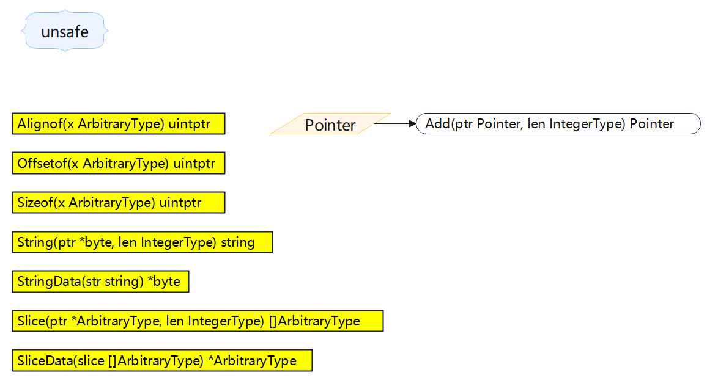

+++
title = "unsafe"
date = 2023-05-17T09:59:21+08:00
type = "docs"
description = ""
isCJKLanguage = true
draft = false

+++
> 原文：[https://pkg.go.dev/unsafe@go1.24.2](https://pkg.go.dev/unsafe@go1.24.2)



Package unsafe contains operations that step around the type safety of Go programs.

​	`unsafe`包包含了绕过Go程序类型安全的操作。

Packages that import unsafe may be non-portable and are not protected by the Go 1 compatibility guidelines.

​	导入`unsafe`包的程序可能是不可移植的，并且不受Go 1兼容性指南的保护。

## 常量 

This section is empty.

## 变量

This section is empty.

## 函数

### func Alignof 

``` go 
func Alignof(x ArbitraryType) uintptr
```

Alignof takes an expression x of any type and returns the required alignment of a hypothetical variable v as if v was declared via var v = x. It is the largest value m such that the address of v is always zero mod m. It is the same as the value returned by reflect.TypeOf(x).Align(). As a special case, if a variable s is of struct type and f is a field within that struct, then Alignof(s.f) will return the required alignment of a field of that type within a struct. This case is the same as the value returned by reflect.TypeOf(s.f).FieldAlign(). The return value of Alignof is a Go constant if the type of the argument does not have variable size. (See the description of [Sizeof](https://pkg.go.dev/unsafe@go1.20.1#Sizeof) for a definition of variable sized types.)

​	`Alignof`函数接受任何类型的表达式`x`，并返回假设通过 `var v = x` 声明变量 `v` 时，`v` 所需的对齐要求。它是这样一个最大值 `m`，使得`v`的地址始终为`0 mod m`。它与`reflect.TypeOf(x).Align()`返回的值相同。作为特例，如果变量`s`是结构体类型，`f`是该结构体中的字段，则`Alignof(s.f)`将返回该类型字段在结构体中所需的对齐方式。该情况与`reflect.TypeOf(s.f).FieldAlign()`返回的值相同。如果实参的类型不具有可变大小，则`Alignof`函数的返回值是一个Go常量。(有关可变大小类型的定义，请参见`Sizeof`函数的描述。)

> 个人注释
>
> 对齐是底层的、与平台相关的概念。不同硬件平台可能有不同的对齐要求。
>
> 参见：[https://verytools.net/xtools-guide/posts/golang-unsafe-alignof](https://verytools.net/xtools-guide/posts/golang-unsafe-alignof)
>
> [golang中的内存对齐和unsafe初探](https://driverzhang.github.io/post/golang%E4%B8%AD%E7%9A%84%E5%86%85%E5%AD%98%E5%AF%B9%E9%BD%90%E5%92%8Cunsafe%E5%88%9D%E6%8E%A2/)

#### Alignof My Example

```go
package main

import (
	"fmt"
	"unsafe"
)

func main() {
	fmt.Println("struct byte int32-------------")
	type MyStruct1 struct {
		a byte
		b int32
	}
	msbi32 := MyStruct1{}
	fmt.Printf("%v,%T\n", unsafe.Sizeof(msbi32), msbi32)      // 8,main.MyStruct1
	fmt.Printf("%v,%T\n", unsafe.Alignof(msbi32), msbi32)     // 4,main.MyStruct1
	fmt.Printf("%v,%T\n", unsafe.Alignof(msbi32.a), msbi32.a) // 1,uint8
	fmt.Printf("%v,%T\n", unsafe.Alignof(msbi32.b), msbi32.b) // 4,int32

	fmt.Println("struct byte int64-------------")
	type MyStruct2 struct {
		a byte
		b int64
	}

	msbi64 := MyStruct2{}
	fmt.Printf("%v,%T\n", unsafe.Sizeof(msbi64), msbi64)      // 16,main.MyStruct2
	fmt.Printf("%v,%T\n", unsafe.Alignof(msbi64), msbi64)     // 8,main.MyStruct2
	fmt.Printf("%v,%T\n", unsafe.Alignof(msbi64.a), msbi64.a) // 1,uint8
	fmt.Printf("%v,%T\n", unsafe.Alignof(msbi64.b), msbi64.b) // 8,int64

	fmt.Println("struct byte []int64-------------")
	type MyStruct3 struct {
		a byte
		b []int64
	}

	msbsli64 := MyStruct3{}
	fmt.Printf("%v,%T\n", unsafe.Sizeof(msbsli64), msbsli64)      // 32,main.MyStruct3
	fmt.Printf("%v,%T\n", unsafe.Alignof(msbsli64), msbsli64)     // 8,main.MyStruct3
	fmt.Printf("%v,%T\n", unsafe.Alignof(msbsli64.a), msbsli64.a) // 1,uint8
	fmt.Printf("%v,%T\n", unsafe.Alignof(msbsli64.b), msbsli64.b) // 8,[]int64

	fmt.Println("struct byte [3]int64-------------")
	type MyStruct4 struct {
		a byte
		b [3]int64
	}
	msbarri64 := MyStruct4{}
	fmt.Printf("%v,%T\n", unsafe.Sizeof(msbarri64), msbarri64)  // 32,main.MyStruct4
	fmt.Printf("%v,%T\n", unsafe.Alignof(msbarri64), msbarri64) // 8,main.MyStruct4

	fmt.Println("struct byte bool-------------")
	type MyStruct5 struct {
		a byte
		b bool
	}
	msbb := MyStruct5{}
	fmt.Printf("%v,%T\n", unsafe.Sizeof(msbb), msbb)  // 2,main.MyStruct5
	fmt.Printf("%v,%T\n", unsafe.Alignof(msbb), msbb) // 1,main.MyStruct5

	fmt.Printf("%v,%T\n", unsafe.Alignof(true), true)                             //1,bool
	fmt.Printf("%v,%T\n", unsafe.Alignof(byte('A')), byte('A'))                   //1,uint8
	fmt.Printf("%v,%T\n", unsafe.Alignof(int8(1)), int8(1))                       //1,int8
	fmt.Printf("%v,%T\n", unsafe.Alignof(int16(1)), int16(1))                     //2,int16
	fmt.Printf("%v,%T\n", unsafe.Alignof(int32(1)), int32(1))                     //4,int32
	fmt.Printf("%v,%T\n", unsafe.Alignof(int(1)), int(1))                         //8,int
	fmt.Printf("%v,%T\n", unsafe.Alignof(uint(1)), uint(1))                       //8,uint
	fmt.Printf("%v,%T\n", unsafe.Alignof(float32(1.2)), float32(1.2))             //4,float32
	fmt.Printf("%v,%T\n", unsafe.Alignof(1.2), 1.2)                               //8,float64
	fmt.Printf("%v,%T\n", unsafe.Alignof("A"), "A")                               //8,string
	fmt.Printf("%v,%T\n", unsafe.Alignof("AB"), "AB")                             //8,string
	fmt.Printf("%v,%T\n", unsafe.Alignof([1]int{1}), [1]int{1})                   //8,[1]int
	fmt.Printf("%v,%T\n", unsafe.Alignof([2]int{1, 2}), [2]int{1, 2})             //8,[2]int
	fmt.Printf("%v,%T\n", unsafe.Alignof([3]int{1, 2, 3}), [3]int{1, 2, 3})       //8,[3]int
	fmt.Printf("%v,%T\n", unsafe.Alignof([...]int{256: 256}), [...]int{256: 256}) //8,[257]int
	fmt.Printf("%v,%T\n", unsafe.Alignof([]int{1}), []int{1})                     //8,[]int
	fmt.Printf("%v,%T\n", unsafe.Alignof([]int{1, 2}), []int{1, 2})               //8,[]int
	fmt.Printf("%v,%T\n", unsafe.Alignof([]int{1, 2, 3}), []int{1, 2, 3})         //8,[]int
	fmt.Printf("%v,%T\n", unsafe.Alignof([]int{256: 256}), []int{256: 256})       //8,[]int

	type ExampleStruct1 struct {
		Field1 int
		Field2 float64
	}

	type ExampleStruct2 struct {
		Field1 int
	}

	var x int
	var y float64
	var z ExampleStruct1
	var w ExampleStruct2

	alignX := unsafe.Alignof(x)
	alignY := unsafe.Alignof(y)
	alignZ := unsafe.Alignof(z)
	alignW := unsafe.Alignof(w)

	fmt.Printf("Alignment of int: %d\n", alignX)            // Alignment of int: 8
	fmt.Printf("Alignment of float64: %d\n", alignY)        // Alignment of float64: 8
	fmt.Printf("Alignment of ExampleStruct1: %d\n", alignZ) //Alignment of ExampleStruct1: 8
	fmt.Printf("Alignment of ExampleStruct2: %d\n", alignW) //Alignment of ExampleStruct2: 8
}
```


### func Offsetof 

``` go 
func Offsetof(x ArbitraryType) uintptr
```

Offsetof returns the offset within the struct of the field represented by x, which must be of the form structValue.field. In other words, it returns the number of bytes between the start of the struct and the start of the field. The return value of Offsetof is a Go constant if the type of the argument x does not have variable size. (See the description of [Sizeof](https://pkg.go.dev/unsafe@go1.20.1#Sizeof) for a definition of variable sized types.)

​	`Offsetof`函数返回由`x`表示的字段在结构体内的偏移量，`x`必须是`structValue.field`的形式。换句话说，它返回结构体开始和该字段开始之间的字节数。如果实参`x`的类型不具有可变大小，则`Offsetof`函数的返回值是一个Go常量。(有关可变大小类型的定义，请参见[Sizeof](#func-sizeof)函数的描述。)

#### Offsetof My Example

```go
package main

import (
	"fmt"
	"unsafe"
)

func main() {
	fmt.Println("struct byte int32-------------")
	type MyStruct1 struct {
		a byte
		b int32
	}

	msbi32 := MyStruct1{}
	fmt.Printf("%v,%T\n", unsafe.Sizeof(msbi32), msbi32)       // 8,main.MyStruct1
	fmt.Printf("%v,%T\n", unsafe.Offsetof(msbi32.a), msbi32.a) // 0,uint8
	fmt.Printf("%v,%T\n", unsafe.Offsetof(msbi32.b), msbi32.b) // 4,int32

	fmt.Println("struct byte int64-------------")
	type MyStruct2 struct {
		a byte
		b int64
	}

	msbi64 := MyStruct2{}
	fmt.Printf("%v,%T\n", unsafe.Sizeof(msbi64), msbi64)       // 16,main.MyStruct2
	fmt.Printf("%v,%T\n", unsafe.Offsetof(msbi64.a), msbi64.a) // 0,uint8
	fmt.Printf("%v,%T\n", unsafe.Offsetof(msbi64.b), msbi64.b) // 8,int64

	fmt.Println("struct byte struct 1-------------")
	type MyStruct3 struct {
		MyStruct2
		c byte
	}

	msbst1 := MyStruct3{}
	fmt.Printf("%v,%T\n", unsafe.Sizeof(msbst1), msbst1)       // 24,main.MyStruct3
	fmt.Printf("%v,%T\n", unsafe.Offsetof(msbst1.a), msbst1.a) // 0,uint8
	fmt.Printf("%v,%T\n", unsafe.Offsetof(msbst1.b), msbst1.b) // 8,int64
	fmt.Printf("%v,%T\n", unsafe.Offsetof(msbst1.c), msbst1.c) // 16,uint8

	fmt.Println("struct byte struct 2-------------")
	type MyStruct4 struct {
		c MyStruct2
		d byte
	}

	msbst2 := MyStruct4{}
	fmt.Printf("%v,%T\n", unsafe.Sizeof(msbst2), msbst2)           // 24,main.MyStruct4
	fmt.Printf("%v,%T\n", unsafe.Offsetof(msbst2.c), msbst2.c)     // 0,main.MyStruct2
	fmt.Printf("%v,%T\n", unsafe.Offsetof(msbst2.c.a), msbst2.c.a) // 0,uint8
	fmt.Printf("%v,%T\n", unsafe.Offsetof(msbst2.c.b), msbst2.c.b) // 8,int64
	fmt.Printf("%v,%T\n", unsafe.Offsetof(msbst2.d), msbst2.d)     // 16,uint8

	//x := 1
	//fmt.Printf("%v,%T\n", unsafe.Offsetof(x), x) //invalid argument: x is not a selector expression
	//arr := [3]int{1, 2, 3}
	//fmt.Printf("%v,%T\n", unsafe.Offsetof(arr), arr) //invalid argument: arr is not a selector expression
}

```


### func Sizeof 

``` go 
func Sizeof(x ArbitraryType) uintptr
```

Sizeof takes an expression x of any type and returns the size in bytes of a hypothetical variable v as if v was declared via var v = x. The size does not include any memory possibly referenced by x. For instance, if x is a slice, Sizeof returns the size of the slice descriptor, not the size of the memory referenced by the slice. For a struct, the size includes any padding introduced by field alignment. The return value of Sizeof is a Go constant if the type of the argument x does not have variable size. (A type has variable size if it is a type parameter or if it is an array or struct type with elements of variable size).

​	`Sizeof`函数取任何类型的表达式`x`，并返回假定变量`v`通过`var v = x`声明后的大小(以字节为单位)。该大小不包括`x`可能引用的任何内存。例如，如果`x`是一个切片，则`Sizeof`函数返回切片描述符的大小，而不是切片引用的内存的大小。对于结构体，大小包括由字段对齐引入的任何填充。如果实参`x`的类型不具有可变大小，则`Sizeof`函数的返回值是一个Go常量。(类型具有可变大小，如果它是类型参数，或者它是具有可变大小元素的数组或结构体类型)。

> 个人注释
>
> ​	为什么go标准库的`unsafe`包中的`Sizeof`函数返回的是`uintptr` 直接返回`int`不好吗？
>
> ​	`unsafe`包中的`Sizeof`函数返回`uintptr`而不是`int`有几个原因：
>
> 可移植性
>
> ​	`uintptr`是一个整数类型，其大小足以容纳任何指针的值。在不同的架构和平台上，指针的大小可能会有所不同。例如，32位系统上的指针大小为4字节，而64位系统上的指针大小为8字节。通过返回`uintptr`，该函数可以适应不同的系统，保证足够的容量存储指针的大小。
>
> 用于低级编程
>
> ​	`unsafe`包是用于低级编程的，包括与C语言互操作、访问内存位置等。`uintptr`类型被设计成能够用于这些低级操作。在这些场景中，你可能需要用一个整数值表示指针，`uintptr`为此提供了正确的大小和类型。
>
> 安全性
>
> ​	返回`uintptr`而不是`int`也有助于提高安全性。由于`uintptr`是一个特殊类型，它更容易引起开发者的注意，并提醒他们正在处理一个特殊的、与指针相关的值。这有助于减少意外错误，例如错误地将这个值当作普通整数来处理。
>
> 总结
>
> ​	综上所述，尽管返回`int`在某些情况下可能更为直观，但返回`uintptr`类型提供了更好的可移植性、适应低级编程需要，并有助于提高代码的安全性。这些考虑因素在设计Go语言的`unsafe`包时都很重要。


> 个人注释
>
> ​	在Go语言中，结构体的大小不仅包括了其字段的大小，还包括了由字段对齐（field alignment）引入的任何填充。
>
> ​	首先，我们需要理解什么是字段对齐。字段对齐是一种优化措施，用于提高内存访问效率。在结构体中，每个字段都会根据其类型有一个对齐要求。对齐要求通常是基于字段类型的大小来确定的。例如，一个`int64`类型的字段通常要求对齐到8字节边界。
>
> 为了满足这些对齐要求，编译器可能会在字段之间插入填充字节。这些填充字节不包含任何有用的数据，仅仅用于满足对齐要求。这样做的原因是，如果内存访问不满足对齐要求，处理器可能需要进行额外的内存访问来获取数据，这会降低性能。
>
> ​	因此，当我们说“对于结构体，大小包括由字段对齐引入的任何填充”时，意思是结构体的总大小不仅包括了其所有字段的大小之和，还包括了为了满足字段对齐要求而添加的填充字节的大小。
>
> ​	例如，考虑以下结构体：
>
> ```go
> type MyStruct struct {  
>     a byte  
>     b int32  
> }
> ```
>
> ​	在这个例子中，`a`字段占用1字节，`b`字段占用4字节。但是，由于`b`字段的对齐要求是4字节，编译器可能会在`a`和`b`之间插入3字节的填充，使得`b`字段从4字节边界开始。因此，`MyStruct`的整体大小将会是8字节，即使其字段的总大小只有5字节。这就是字段对齐引入的填充。

#### Sizeof My Example

```go
package main

import (
	"fmt"
	"unsafe"
)

func main() {
	fmt.Println("struct byte int32-------------")
	type MyStruct1 struct {
		a byte
		b int32
	}

	msbi32 := MyStruct1{}
	fmt.Printf("%v,%T\n", unsafe.Sizeof(msbi32), msbi32)     // 8,main.MyStruct1
	fmt.Printf("%v,%T\n", unsafe.Sizeof(msbi32.a), msbi32.a) //1,uint8
	fmt.Printf("%v,%T\n", unsafe.Sizeof(msbi32.b), msbi32.b) //1,uint8

	fmt.Println("struct byte int64-------------")
	type MyStruct2 struct {
		a byte
		b int64
	}

	msbi64 := MyStruct2{}
	fmt.Printf("%v,%T\n", unsafe.Sizeof(msbi64), msbi64)     // 16,main.MyStruct2
	fmt.Printf("%v,%T\n", unsafe.Sizeof(msbi64.a), msbi64.a) //1,uint8
	fmt.Printf("%v,%T\n", unsafe.Sizeof(msbi64.b), msbi64.b) //8,int64

	fmt.Println("struct byte struct 1-------------")
	type MyStruct3 struct {
		a byte
		MyStruct2
	}

	msbst1 := MyStruct3{}
	fmt.Printf("%v,%T\n", unsafe.Sizeof(msbst1), msbst1)                         // 24,main.MyStruct3
	fmt.Printf("%v,%T\n", unsafe.Sizeof(msbst1.a), msbst1.a)                     //8,int64
	fmt.Printf("%v,%T\n", unsafe.Sizeof(msbst1.MyStruct2), msbst1.MyStruct2)     //16,main.MyStruct2
	fmt.Printf("%v,%T\n", unsafe.Sizeof(msbst1.MyStruct2.a), msbst1.MyStruct2.a) //1,uint8
	fmt.Printf("%v,%T\n", unsafe.Sizeof(msbst1.MyStruct2.b), msbst1.MyStruct2.b) //8,int64

	fmt.Println("struct byte struct 2-------------")
	type MyStruct4 struct {
		a byte
		b MyStruct2
	}

	msbst2 := MyStruct4{}
	fmt.Printf("%v,%T\n", unsafe.Sizeof(msbst2), msbst2)         // 24,main.MyStruct4
	fmt.Printf("%v,%T\n", unsafe.Sizeof(msbst2.a), msbst2.a)     //1,uint8
	fmt.Printf("%v,%T\n", unsafe.Sizeof(msbst2.b), msbst2.b)     //16,main.MyStruct2
	fmt.Printf("%v,%T\n", unsafe.Sizeof(msbst2.b.a), msbst2.b.a) //1,uint8
	fmt.Printf("%v,%T\n", unsafe.Sizeof(msbst2.b.b), msbst2.b.b) //1,uint8

	fmt.Println("struct multi fields 1-------------")
	type MyStruct5 struct {
		a byte
		b int64
		c [6]string
		d []int
		e bool
	}

	msmf1 := MyStruct5{}
	fmt.Printf("%v,%T\n", unsafe.Sizeof(msmf1), msmf1)     // 144,main.MyStruct5
	fmt.Printf("%v,%T\n", unsafe.Sizeof(msmf1.a), msmf1.a) //1,uint8
	fmt.Printf("%v,%T\n", unsafe.Sizeof(msmf1.b), msmf1.b) //8,int64
	fmt.Printf("%v,%T\n", unsafe.Sizeof(msmf1.c), msmf1.c) //96,[6]string
	fmt.Printf("%v,%T\n", unsafe.Sizeof(msmf1.d), msmf1.d) //24,[]int
	fmt.Printf("%v,%T\n", unsafe.Sizeof(msmf1.e), msmf1.e) //1,bool

	fmt.Println("struct multi fields 2-------------")
	type MyStruct6 struct {
		a byte
		b int64
		c [6]string
		d []int
	}

	msmf2 := MyStruct6{}
	fmt.Printf("%v,%T\n", unsafe.Sizeof(msmf2), msmf2) // 136,main.MyStruct6

	fmt.Println("struct multi fields 3-------------")
	type MyStruct7 struct {
		a byte
		b int64
		c [6]string
	}

	msmf3 := MyStruct7{}
	fmt.Printf("%v,%T\n", unsafe.Sizeof(msmf3), msmf3) // 112,main.MyStruct7

	fmt.Println("struct multi fields 4-------------")
	type MyStruct8 struct {
		a byte
		b int64
	}

	msmf4 := MyStruct8{}
	fmt.Printf("%v,%T\n", unsafe.Sizeof(msmf4), msmf4) // 16,main.MyStruct8

	fmt.Println("bool-------------")
	fmt.Printf("%v,%T\n", unsafe.Sizeof(true), true) //1,bool

	fmt.Println("ints-------------")
	fmt.Printf("%v,%T\n", unsafe.Sizeof(int8(1)), int8(1))   //1,int8
	fmt.Printf("%v,%T\n", unsafe.Sizeof(int16(1)), int16(1)) //2,int16
	fmt.Printf("%v,%T\n", unsafe.Sizeof(int32(1)), int32(1)) //4,int32
	fmt.Printf("%v,%T\n", unsafe.Sizeof(int(1)), int(1))     //8,int
	fmt.Printf("%v,%T\n", unsafe.Sizeof(int64(1)), int64(1)) //8,int64

	fmt.Println("uints-------------")
	fmt.Printf("%v,%T\n", unsafe.Sizeof(uint8(1)), uint8(1))   //1,uint8
	fmt.Printf("%v,%T\n", unsafe.Sizeof(uint16(1)), uint16(1)) //4,uint32
	fmt.Printf("%v,%T\n", unsafe.Sizeof(uint32(1)), uint32(1)) //4,uint32
	fmt.Printf("%v,%T\n", unsafe.Sizeof(uint(1)), uint(1))     //8,uint
	fmt.Printf("%v,%T\n", unsafe.Sizeof(uint64(1)), uint64(1)) //1,uint8

	fmt.Println("byte-------------")
	fmt.Printf("%v,%T\n", unsafe.Sizeof(byte('A')), byte('A')) //1,uint8

	fmt.Println("floats-------------")
	fmt.Printf("%v,%T\n", unsafe.Sizeof(float32(1.2)), float32(1.2)) //4,float32
	fmt.Printf("%v,%T\n", unsafe.Sizeof(1.2), 1.2)                   //8,float64

	fmt.Println("string-------------")
	fmt.Printf("%v,%T\n", unsafe.Sizeof("abc"), "abc") // 16,string

	fmt.Println("uintptr-------------")
	x := 2
	fmt.Printf("%v,%T\n", unsafe.Sizeof(uintptr(x)), uintptr(x)) // 8,uintptr

	fmt.Println("array -> [1]int [2]int-------------")
	var arrI0 [1]int
	arrI1 := [1]int{1}
	arrI2 := [2]int{1, 2}
	fmt.Printf("%v,%T\n", unsafe.Sizeof(arrI0), arrI0) //8,[1]int
	fmt.Printf("%v,%T\n", unsafe.Sizeof(arrI1), arrI1) //8,[1]int
	fmt.Printf("%v,%T\n", unsafe.Sizeof(arrI2), arrI2) //16,[2]int

	fmt.Println("array -> []string-------------")
	var arrStr0 []string
	arrStr1 := []string{"a"}
	arrStr2 := []string{"a", "b"}
	fmt.Printf("%v,%T\n", unsafe.Sizeof(arrStr0), arrStr0) //24,[]string
	fmt.Printf("%v,%T\n", unsafe.Sizeof(arrStr1), arrStr1) //24,[]string
	fmt.Printf("%v,%T\n", unsafe.Sizeof(arrStr2), arrStr2) //24,[]string

	fmt.Println("slice -> []int-------------")
	var slI0 []int
	slI1 := []int{1}
	slI2 := []int{1, 2}
	fmt.Printf("%v,%T\n", unsafe.Sizeof(slI0), slI0) //24,[]int
	fmt.Printf("%v,%T\n", unsafe.Sizeof(slI1), slI1) //24,[]int
	fmt.Printf("%v,%T\n", unsafe.Sizeof(slI2), slI2) //24,[]int

	fmt.Println("slice -> []string-------------")
	var slStr0 []string
	slStr1 := []string{"a"}
	slStr2 := []string{"a", "b"}
	fmt.Printf("%v,%T\n", unsafe.Sizeof(slStr0), slStr0) //24,[]string
	fmt.Printf("%v,%T\n", unsafe.Sizeof(slStr1), slStr1) //24,[]string
	fmt.Printf("%v,%T\n", unsafe.Sizeof(slStr2), slStr2) //24,[]string

	fmt.Println("string-------------")
	str0 := ""
	str1 := "a"
	str2 := "ab"
	fmt.Printf("%v,%T\n", unsafe.Sizeof(str0), str0) //16,string
	fmt.Printf("%v,%T\n", unsafe.Sizeof(str1), str1) //16,string
	fmt.Printf("%v,%T\n", unsafe.Sizeof(str2), str2) //16,string

	fmt.Println("map[string]int-------------")
	msi1 := make(map[string]int, 1)
	fmt.Printf("%v,%T\n", unsafe.Sizeof(msi1), msi1) //8,map[string]int
	msi1["a"] = 1
	fmt.Printf("%v,%T\n", unsafe.Sizeof(msi1), msi1) //8,map[string]int
	msi2 := make(map[string]int, 2)
	fmt.Printf("%v,%T\n", unsafe.Sizeof(msi2), msi2) //8,map[string]int
	msi1["a"] = 1
	msi1["b"] = 2
	fmt.Printf("%v,%T\n", unsafe.Sizeof(msi2), msi2) //8,map[string]int

	fmt.Println("map[int]string-------------")
	mis1 := make(map[int]string, 1)
	fmt.Printf("%v,%T\n", unsafe.Sizeof(mis1), mis1) //8,map[int]string
	mis1[1] = "a"
	fmt.Printf("%v,%T\n", unsafe.Sizeof(mis1), mis1) //8,map[int]string
	mis2 := make(map[int]string, 2)
	fmt.Printf("%v,%T\n", unsafe.Sizeof(mis2), mis2) //8,map[int]string
	mis2[1] = "a"
	mis2[2] = "b"
	fmt.Printf("%v,%T\n", unsafe.Sizeof(mis2), mis2) //8,map[int]string
}
```


### func String  <- go1.20

``` go 
func String(ptr *byte, len IntegerType) string
```

String returns a string value whose underlying bytes start at ptr and whose length is len.

​	`String`函数返回一个字符串值，其底层字节从`ptr`开始，长度为`len`。

The len argument must be of integer type or an untyped constant. A constant len argument must be non-negative and representable by a value of type int; if it is an untyped constant it is given type int. At run time, if len is negative, or if ptr is nil and len is not zero, a run-time panic occurs.

​	`len`实参必须是整数类型或未命名常量。常量`len`实参必须是非负数，并且可以表示为`int`类型的值；如果它是未命名常量，则给定类型为`int`。在运行时，如果`len`为负数，或者`ptr`为nil且`len`不为零，则会发生运行时panic。

Since Go strings are immutable, the bytes passed to String must not be modified afterwards.

​	由于Go字符串是不可变的，因此在调用`String`函数后不得修改传递的字节。

#### String My Example

```go
package main

import (
	"fmt"
	"unsafe"
)

func main() {
	byteSlice := []byte("Hello World!")
	// 转换为*byte类型指针
	bytePtr1 := (*byte)(unsafe.Pointer(&byteSlice[0]))

	fmt.Println(unsafe.String(bytePtr1, len(byteSlice)))   //Hello World!
	fmt.Println(unsafe.String(bytePtr1, len(byteSlice)-1)) //Hello World
	fmt.Println(unsafe.String(bytePtr1, len(byteSlice)-2)) //Hello Worl

	str := "Hello World 你好世界!"
	fmt.Println(unsafe.String(unsafe.StringData(str), len([]byte(str))))   //Hello World 你好世界!
	fmt.Println(unsafe.String(unsafe.StringData(str), len([]byte(str))-1)) //Hello World 你好世界!
	fmt.Println(unsafe.String(unsafe.StringData(str), len([]byte(str))-2)) //Hello World 你好世��
	fmt.Println(unsafe.String(unsafe.StringData(str), len([]byte(str))-3)) //Hello World 你好世�
	fmt.Println(unsafe.String(unsafe.StringData(str), len([]byte(str))-4)) //Hello World 你好世
}

```


### func StringData  <- go1.20

``` go 
func StringData(str string) *byte
```

StringData returns a pointer to the underlying bytes of str. For an empty string the return value is unspecified, and may be nil.

​	`StringData`函数返回一个指向`str`底层字节的指针。对于空字符串，返回值是未指定的，可能为nil。

Since Go strings are immutable, the bytes returned by StringData must not be modified.

​	由于Go字符串是不可变的，因此不能修改`StringData`函数返回的字节。

#### StringData My Example

参见 String My Example。

## 类型

Arbitrary `adj.任意的，随心所欲的；专横的，武断的`

- 英*/*ˈɑːbɪtrəri*/*
- 美*/*ˈɑːrbɪtreri*/*

### type ArbitraryType 

``` go 
type ArbitraryType int
```

ArbitraryType is here for the purposes of documentation only and is not actually part of the unsafe package. It represents the type of an arbitrary Go expression.

​	`ArbitraryType`仅用于文档目的，实际上不属于`unsafe`包。它表示任意Go表达式的类型。

#### func Slice  <- go1.17

``` go 
func Slice(ptr *ArbitraryType, len IntegerType) []ArbitraryType
```

The function Slice returns a slice whose underlying array starts at ptr and whose length and capacity are len. Slice(ptr, len) is equivalent to

​	`Slice`函数返回一个切片，其底层数组从`ptr`开始，长度和容量为`len`。`Slice(ptr，len)`等效于

```go
(*[len]ArbitraryType)(unsafe.Pointer(ptr))[:]
```

except that, as a special case, if ptr is nil and len is zero, Slice returns nil.

特殊情况下，如果`ptr`为nil且`len`为零，则`Slice`返回nil。

The len argument must be of integer type or an untyped constant. A constant len argument must be non-negative and representable by a value of type int; if it is an untyped constant it is given type int. At run time, if len is negative, or if ptr is nil and len is not zero, a run-time panic occurs.

​	`len`实参必须是整数类型或无类型常量。常量`len`实参必须为非负数，并且可以由`int`类型的值表示；如果它是无类型常量，则给定类型为`int`。运行时，如果`len`为负数，或者`ptr`为nil且`len`不为零，则会发生运行时panic。

##### Slice My Example

```go
package main

import (
	"fmt"
	"unsafe"
)

func main() {
	fmt.Println("int8 nil----------------")
	var i80 int8
	fmt.Printf("%#v\n", unsafe.Slice(&i80, 0)) //[]int8{}
	fmt.Printf("%#v\n", unsafe.Slice(&i80, 1)) //[]int8{1}
	fmt.Printf("%#v\n", unsafe.Slice(&i80, 2)) //[]int8{1, 1}

	fmt.Println("int8 1----------------")
	var i81 int8 = 1
	fmt.Printf("%#v\n", unsafe.Slice(&i81, 0)) //[]int8{}
	fmt.Printf("%#v\n", unsafe.Slice(&i81, 1)) //[]int8{1}
	fmt.Printf("%#v\n", unsafe.Slice(&i81, 2)) //[]int8{1, 1}

	fmt.Println("int32 nil----------------")
	var i320 int32
	fmt.Printf("%#v\n", unsafe.Slice(&i320, 0)) //[]int32{}
	fmt.Printf("%#v\n", unsafe.Slice(&i320, 1)) //[]int32{0}
	fmt.Printf("%#v\n", unsafe.Slice(&i320, 2)) //[]int32{0, 0}
	fmt.Printf("%#v\n", unsafe.Slice(&i320, 3)) //[]int32{0, 0, 0}

	fmt.Println("int32 1----------------")
	var i321 int32 = 1
	fmt.Printf("%#v\n", unsafe.Slice(&i321, 0)) //[]int32{}
	fmt.Printf("%#v\n", unsafe.Slice(&i321, 1)) //[]int32{1}
	fmt.Printf("%#v\n", unsafe.Slice(&i321, 2)) //[]int32{1, 1}

	fmt.Println("uint8 nil----------------")
	var ui80 uint8
	fmt.Printf("%#v\n", unsafe.Slice(&ui80, 0)) //[]byte{}
	fmt.Printf("%#v\n", unsafe.Slice(&ui80, 1)) //[]byte{0x0}
	fmt.Printf("%#v\n", unsafe.Slice(&ui80, 2)) //[]byte{0x0, 0x0}

	fmt.Println("uint8 1----------------")
	var ui81 uint8 = 1
	fmt.Printf("%#v\n", unsafe.Slice(&ui81, 0)) //[]byte{}
	fmt.Printf("%#v\n", unsafe.Slice(&ui81, 1)) //[]byte{0x0}
	fmt.Printf("%#v\n", unsafe.Slice(&ui81, 2)) //[]byte{0x1, 0x0}

	fmt.Println("uint32 nil----------------")
	var ui320 uint32
	fmt.Printf("%#v\n", unsafe.Slice(&ui320, 0)) //[]uint32{}
	fmt.Printf("%#v\n", unsafe.Slice(&ui320, 1)) //[]uint32{0x0}
	fmt.Printf("%#v\n", unsafe.Slice(&ui320, 2)) //[]uint32{0x0, 0x0}

	fmt.Println("uint32 1----------------")
	var ui321 uint32 = 1
	fmt.Printf("%#v\n", unsafe.Slice(&ui321, 0)) //[]uint32{}
	fmt.Printf("%#v\n", unsafe.Slice(&ui321, 1)) //[]uint32{0x1}
	fmt.Printf("%#v\n", unsafe.Slice(&ui321, 2)) //[]uint32{0x1, 0x1}
	fmt.Printf("%#v\n", unsafe.Slice(&ui321, 3)) //[]uint32{0x1, 0x1, 0x1}

	fmt.Println("string \"\"----------------")
	var str0 string = ""
	fmt.Printf("%#v\n", unsafe.Slice(&str0, 0)) //[]string{}
	fmt.Printf("%#v\n", unsafe.Slice(&str0, 1)) //[]string{""}
	fmt.Printf("%#v\n", unsafe.Slice(&str0, 2)) //[]string{"", ""}
	fmt.Printf("%#v\n", unsafe.Slice(&str0, 3)) //[]string{"", "", ""}
	fmt.Printf("%#v\n", unsafe.Slice(&str0, 4)) //[]string{"", "", "", ""}

	fmt.Println("slice []int nil----------------")
	var sl0 []int
	fmt.Printf("%#v\n", unsafe.Slice(&sl0, 0)) //[][]int{}
	fmt.Printf("%#v\n", unsafe.Slice(&sl0, 1)) //[][]int{[]int(nil)}
	fmt.Printf("%#v\n", unsafe.Slice(&sl0, 2)) //[][]int{[]int(nil), []int{}}
	fmt.Printf("%#v\n", unsafe.Slice(&sl0, 3)) //[][]int{[]int(nil), []int{}, []int{0}}
	fmt.Printf("%#v\n", unsafe.Slice(&sl0, 4)) //[][]int{[]int(nil), []int{}, []int{0}, []int(nil)}
	fmt.Printf("%#v\n", unsafe.Slice(&sl0, 5)) //[][]int{[]int(nil), []int{}, []int{0}, []int(nil), []int{0, 0}, []int(nil)}
	fmt.Printf("%#v\n", unsafe.Slice(&sl0, 6)) //[][]int{[]int(nil), []int{}, []int{0}, []int(nil), []int{0, 0}, []int(nil)}
	fmt.Printf("%#v\n", unsafe.Slice(&sl0, 7)) //[][]int{[]int(nil), []int{}, []int{0}, []int(nil), []int{0, 0}, []int(nil), []int{}}
	fmt.Printf("%#v\n", unsafe.Slice(&sl0, 8)) //[][]int{[]int(nil), []int{}, []int{0}, []int(nil), []int{0, 0}, []int(nil), []int{}, []int{0, 0, 0}}
}

```


#### func SliceData  <- go1.20

``` go 
func SliceData(slice []ArbitraryType) *ArbitraryType
```

SliceData returns a pointer to the underlying array of the argument slice.

​	`SliceData`函数返回实参切片的底层数组的指针。

- If `cap(slice) > 0`, SliceData returns `&slice[:1][0]`.
- 如果`cap(slice)> 0`，则`SliceData`返回`&slice[:1][0]`。
- If slice == nil, SliceData returns nil.
- 如果`slice == nil`，`SliceData`返回nil。
- Otherwise, SliceData returns a non-nil pointer to an unspecified memory address.
- 否则，`SliceData`返回一个非nil指向未指定内存地址的指针。

##### SliceData My Example

```go
package main

import (
	"fmt"
	"unsafe"
)

func main() {
	slInt1 := []int{1, 2, 3}
	fmt.Printf("%#v\n", *unsafe.SliceData(slInt1)) //1

	slInt2 := [][]int{{1, 2, 3}, {4, 5, 6}}
	fmt.Printf("%#v\n", *unsafe.SliceData(slInt2)) //[]int{1, 2, 3}

	var slInt3 []int
	//fmt.Printf("%#v\n", *unsafe.SliceData(slInt3)) // panic: runtime error: invalid memory address or nil pointer dereference
	fmt.Printf("%#v\n", unsafe.SliceData(slInt3)) // (*int)(nil)

	var slInt4 = make([]int, 0, 0)
	fmt.Printf("%#v\n", *unsafe.SliceData(slInt4)) // 0
	fmt.Printf("%#v\n", unsafe.SliceData(slInt4))  // (*int)(0x2a6380)
}

```


### type IntegerType  <- go1.17

``` go 
type IntegerType int
```

IntegerType is here for the purposes of documentation only and is not actually part of the unsafe package. It represents any arbitrary integer type.

​	`IntegerType`仅用于文档目的，实际上不属于`unsafe`包。它表示任意整数类型。

### type Pointer 

``` go 
type Pointer *ArbitraryType
```

Pointer represents a pointer to an arbitrary type. There are four special operations available for type Pointer that are not available for other types:

​	`Pointer` 表示指向任意类型的指针。`Pointer`类型具有其他类型没有的四个特殊操作：

- A pointer value of any type can be converted to a Pointer.

- 任何类型的指针值都可以转换为 `Pointer`。 
- A Pointer can be converted to a pointer value of any type.
- `Pointer` 可以转换为任何类型的指针值。 
- A uintptr can be converted to a Pointer.
- `uintptr` 可以转换为 `Pointer`。 
- A Pointer can be converted to a uintptr.
- `Pointer` 可以转换为 `uintptr`。 

Pointer therefore allows a program to defeat the type system and read and write arbitrary memory. It should be used with extreme care.

​	因此，`Pointer` 允许程序打破类型系统，并读写任意内存。需要非常小心地使用。

The following patterns involving Pointer are valid. Code not using these patterns is likely to be invalid today or to become invalid in the future. Even the valid patterns below come with important caveats.

​	以下是 `Pointer` 的有效使用方式。不使用这些方式的代码可能是无效的，今天或未来可能会变得无效。即使是下面的有效模式也有重要的警告。

Running "go vet" can help find uses of Pointer that do not conform to these patterns, but silence from "go vet" is not a guarantee that the code is valid.

​	运行 "`go vet`" 可以帮助找到未符合这些模式的 `Pointer` 使用情况，但 "`go vet`" 的沉默并不能保证代码是有效的。

(1) Conversion of a `*T1` to Pointer to `*T2`.

(1) 将 `*T1` 转换为 `Pointer` 到 `*T2`。

Provided that T2 is no larger than T1 and that the two share an equivalent memory layout, this conversion allows reinterpreting data of one type as data of another type. An example is the implementation of math.Float64bits:

​	假设 `T2` 不比 `T1` 大，并且两者具有相同的内存布局，此转换允许将一种类型的数据重新解释为另一种类型的数据。一个例子是 `math.Float64bits` 的实现：

``` go 
func Float64bits(f float64) uint64 {
	return *(*uint64)(unsafe.Pointer(&f))
}
```

(2) Conversion of a Pointer to a uintptr (but not back to Pointer).

(2) 将 `Pointer` 转换为 `uintptr`(但不转换回 `Pointer`)。

Converting a Pointer to a uintptr produces the memory address of the value pointed at, as an integer. The usual use for such a uintptr is to print it.

​	将 `Pointer` 转换为 `uintptr` 可以产生所指向值的内存地址，作为整数。这样的 `uintptr` 通常用于打印。

Conversion of a uintptr back to Pointer is not valid in general.

​	通常情况下，不应将 `uintptr` 转换回 `Pointer`。

A uintptr is an integer, not a reference. Converting a Pointer to a uintptr creates an integer value with no pointer semantics. Even if a uintptr holds the address of some object, the garbage collector will not update that uintptr's value if the object moves, nor will that uintptr keep the object from being reclaimed.

​	`uintptr` 是一个整数，而不是引用。将 `Pointer` 转换为 `uintptr` 会创建一个没有指针语义的整数值。即使 `uintptr` 持有某个对象的地址，垃圾回收器也不会在对象移动时更新 `uintptr` 的值，`uintptr` 也无法防止该对象被回收。

The remaining patterns enumerate the only valid conversions from uintptr to Pointer.

​	下面的模式列举了从 `uintptr` 到 `Pointer` 的唯一有效转换。

(3) Conversion of a Pointer to a uintptr and back, with arithmetic.

(3) 将 `Pointer` 转换为 `uintptr`，然后进行算术操作，再转换回 `Pointer`。

If p points into an allocated object, it can be advanced through the object by conversion to uintptr, addition of an offset, and conversion back to Pointer.

​	如果 `p` 指向分配的对象，则可以通过将其转换为 `uintptr`、添加偏移量，然后再将其转换回 `Pointer` 来使 `p` 在对象中前进。

```go 
p = unsafe.Pointer(uintptr(p) + offset)
```

The most common use of this pattern is to access fields in a struct or elements of an array:

​	此模式最常见的用途是访问结构体的字段或数组的元素：

> 个人注释
>
> ​	也可以用于访问切片元素！

```go 
// equivalent to f := unsafe.Pointer(&s.f)
// 等同于 f := unsafe.Pointer(&s.f)
f := unsafe.Pointer(uintptr(unsafe.Pointer(&s)) + unsafe.Offsetof(s.f))

// equivalent to e := unsafe.Pointer(&x[i])
// 等同于 e := unsafe.Pointer(&x[i])
e := unsafe.Pointer(uintptr(unsafe.Pointer(&x[0])) + i*unsafe.Sizeof(x[0]))
```

It is valid both to add and to subtract offsets from a pointer in this way. It is also valid to use &^ to round pointers, usually for alignment. In all cases, the result must continue to point into the original allocated object.

​	在此方式下，可以对指针进行偏移量的加减操作。通常用 `&^` 对指针进行取整，通常是为了对齐。在所有情况下，结果必须继续指向原始分配的对象。

Unlike in C, it is not valid to advance a pointer just beyond the end of its original allocation:

​	与 C 语言不同的是，将指针移动到其原始分配空间的边界之外是无效的：

```go 
// INVALID: end points outside allocated space.
// 无效：end 指向分配空间之外。
var s thing
end = unsafe.Pointer(uintptr(unsafe.Pointer(&s)) + unsafe.Sizeof(s))

// INVALID: end points outside allocated space.
// 无效：end 在分配的空间之外。
b := make([]byte, n)
end = unsafe.Pointer(uintptr(unsafe.Pointer(&b[0])) + uintptr(n))
```

Note that both conversions must appear in the same expression, with only the intervening arithmetic between them:

​	请注意，**两个转换必须出现在同一表达式中**，只能在它们之间进行算术运算：

```go 
// INVALID: uintptr cannot be stored in variable
// before conversion back to Pointer.
// 无效：uintptr在转换回Pointer之前不能被存储在变量中。
u := uintptr(p)
p = unsafe.Pointer(u + offset)
```

Note that the pointer must point into an allocated object, so it may not be nil.

​	请注意，这个指针必须指向已分配的对象，因此它可能不是 nil。

```go 
// INVALID: conversion of nil pointer
// 无效：转换nil的指针
u := unsafe.Pointer(nil)
p := unsafe.Pointer(uintptr(u) + offset)
```

(4) Conversion of a Pointer to a uintptr when calling syscall.Syscall.

(4) 当调用 `syscall.Syscall` 时，将指针转换为 `uintptr`。

The Syscall functions in package syscall pass their uintptr arguments directly to the operating system, which then may, depending on the details of the call, reinterpret some of them as pointers. That is, the system call implementation is implicitly converting certain arguments back from uintptr to pointer.

​	在 `syscall` 包中，`Syscall` 函数将它们的 `uintptr` 实参直接传递给操作系统，然后根据调用的细节重新解释其中的一些实参为指针。也就是说，系统调用的实现隐式地将某些实参从 `uintptr` 转换回指针。

If a pointer argument must be converted to uintptr for use as an argument, that conversion must appear in the call expression itself:

​	如果必须将指针实参转换为 `uintptr` 以便用作实参，那么该转换必须出现在调用表达式本身中：

```go 
syscall.Syscall(SYS_READ, uintptr(fd), uintptr(unsafe.Pointer(p)), uintptr(n))
```

The compiler handles a Pointer converted to a uintptr in the argument list of a call to a function implemented in assembly by arranging that the referenced allocated object, if any, is retained and not moved until the call completes, even though from the types alone it would appear that the object is no longer needed during the call.

​	编译器通过在汇编实现的函数调用的实参列表中处理将 `Pointer` 转换为 `uintptr`，安排保留引用的分配对象(如果有的话)，即使从类型上看，在调用期间似乎不再需要该对象。

For the compiler to recognize this pattern, the conversion must appear in the argument list:

​	为了让编译器识别这种模式，该转换必须出现在实参列表中：

```go 
// INVALID: uintptr cannot be stored in variable
// before implicit conversion back to Pointer during system call.
// 无效: uintptr在系统调用过程中隐式转换回Pointer前不能被存储在变量中。
u := uintptr(unsafe.Pointer(p))
syscall.Syscall(SYS_READ, uintptr(fd), u, uintptr(n))
```

(5) Conversion of the result of reflect.Value.Pointer or reflect.Value.UnsafeAddr from uintptr to Pointer.

(5) 将 `reflect.Value.Pointer` 或 `reflect.Value.UnsafeAddr` 的结果从 `uintptr` 转换为 `Pointer`。

Package reflect's Value methods named Pointer and UnsafeAddr return type uintptr instead of unsafe.Pointer to keep callers from changing the result to an arbitrary type without first importing "unsafe". However, this means that the result is fragile and must be converted to Pointer immediately after making the call, in the same expression:

​	`reflect`包中的`Value`结构体的：`Pointer`和`UnsafeAddr`方法返回`uintptr`类型而不是`unsafe.Pointer`类型，以防止调用者在未导入 `"unsafe"` 的情况下将结果更改为任意类型。然而，这意味着结果是脆弱的，必须在调用后立即在同一个表达式中将其转换为`Pointer`：

```go
p := (*int)(unsafe.Pointer(reflect.ValueOf(new(int)).Pointer()))
```

As in the cases above, it is invalid to store the result before the conversion:

​	与以上情况类似，存储转换之前的结果是无效的：

```go
// INVALID: uintptr cannot be stored in variable
// before conversion back to Pointer.
// 无效: uintptr在转换回Pointer之前不能被存储在变量中。
u := reflect.ValueOf(new(int)).Pointer()
p := (*int)(unsafe.Pointer(u))
```

(6) Conversion of a reflect.SliceHeader or reflect.StringHeader Data field to or from Pointer.

(6) 将`reflect.SliceHeader`结构体或`reflect.StringHeader`结构体中的`Data`字段转换为`Pointer`，或将`Pointer`转换为`reflect.SliceHeader`结构体或`reflect.StringHeader`结构体中的`Data`字段。

As in the previous case, the reflect data structures SliceHeader and StringHeader declare the field Data as a uintptr to keep callers from changing the result to an arbitrary type without first importing "unsafe". However, this means that SliceHeader and StringHeader are only valid when interpreting the content of an actual slice or string value.

​	与之前的情况类似，`reflect.SliceHeader`结构体和`reflect.StringHeader`结构体将`Data`字段声明为`uintptr`，以防止调用者在未导入`"unsafe"`包之前将结果更改为任意类型。但是，这意味着`SliceHeader`和`StringHeader`仅在解释实际切片或字符串值的内容时才有效。

> 个人注释
>
> ​	这里给出reflect包中的`SliceHeader`和`StringHeader`结构体的定义：
>
> ```go
> type SliceHeader struct {
> 	Data uintptr
> 	Len  int
> 	Cap  int
> }
> 
> type StringHeader struct {
> 	Data uintptr
> 	Len  int
> }
> ```

``` go 
var s string
hdr := (*reflect.StringHeader)(unsafe.Pointer(&s)) // case 1
hdr.Data = uintptr(unsafe.Pointer(p))              // case 6 (this case)
hdr.Len = n
```

In this usage hdr.Data is really an alternate way to refer to the underlying pointer in the string header, not a uintptr variable itself.

​	在这种用法中，`hdr.Data`实际上是字符串头中底层指针的另一种引用方式，而不是`uintptr`变量本身。

In general, reflect.SliceHeader and reflect.StringHeader should be used only as *reflect.SliceHeader and *reflect.StringHeader pointing at actual slices or strings, never as plain structs. A program should not declare or allocate variables of these struct types.

​	通常情况下，`reflect.SliceHeader`和`reflect.StringHeader`应仅作为`*reflect.SliceHeader`和`*reflect.StringHeader`使用，指向实际的切片或字符串，而不是作为普通结构体使用。程序不应声明或分配这些结构体类型的变量。

```go 
// INVALID: a directly-declared header will not hold Data as a reference.
// 无效：直接声明的header无法将Data作为引用保存。
var hdr reflect.StringHeader
hdr.Data = uintptr(unsafe.Pointer(p))
hdr.Len = n
s := *(*string)(unsafe.Pointer(&hdr)) // p可能已经丢失 p possibly already lost
```

#### func Add  <- go1.17

``` go 
func Add(ptr Pointer, len IntegerType) Pointer
```

The function Add adds len to ptr and returns the updated pointer Pointer(uintptr(ptr) + uintptr(len)). The len argument must be of integer type or an untyped constant. A constant len argument must be representable by a value of type int; if it is an untyped constant it is given type int. The rules for valid uses of Pointer still apply.

​	`Add`函数将`len`添加到`ptr`并返回更新后的指针`Pointer(uintptr(ptr) + uintptr(len))`。`len`实参必须是整数类型或无类型常量。常量`len`实参必须可由`int`类型的值表示；如果它是无类型常量，则它会被赋予`int`类型。仍然适用指针的有效用法规则。

##### Add My Example

```go
package main

import (
	"fmt"
	"unsafe"
)

func main() {
	fmt.Println("[]int ------------")
	sliI := []int{1, 2, 3, 4, 9: 9}
	fmt.Println(sliI)
	end := (*int)(unsafe.Pointer(uintptr(unsafe.Pointer(&sliI[0])) + 3*unsafe.Sizeof(sliI[0])))
	*end = 33
	fmt.Println(sliI)
	end = (*int)(unsafe.Pointer(uintptr(unsafe.Pointer(&sliI[0])) + 4*unsafe.Sizeof(sliI[0])))
	*end = 44
	fmt.Println(sliI)
	end = (*int)(unsafe.Add(unsafe.Pointer(&sliI[0]), 5*unsafe.Sizeof(1)))
	*end = 55
	fmt.Println(sliI)
	fmt.Println("[9]int ------------")
	arrI := [...]int{1, 2, 3, 4, 9: 9}
	fmt.Println(arrI)
	end = (*int)(unsafe.Pointer(uintptr(unsafe.Pointer(&arrI[0])) + 3*unsafe.Sizeof(arrI[0])))
	*end = 33
	fmt.Println(arrI)
	end = (*int)(unsafe.Pointer(uintptr(unsafe.Pointer(&arrI[0])) + 4*unsafe.Sizeof(arrI[0])))
	*end = 44
	fmt.Println(arrI)
	end = (*int)(unsafe.Add(unsafe.Pointer(&arrI[0]), 5*unsafe.Sizeof(1)))
	*end = 55
	fmt.Println(arrI)
}
// Output:
//[]int ------------
//[1 2 3 4 0 0 0 0 0 9]
//[1 2 3 33 0 0 0 0 0 9]
//[1 2 3 33 44 0 0 0 0 9]
//[1 2 3 33 44 55 0 0 0 9]
//[9]int ------------
//[1 2 3 4 0 0 0 0 0 9]
//[1 2 3 33 0 0 0 0 0 9]
//[1 2 3 33 44 0 0 0 0 9]
//[1 2 3 33 44 55 0 0 0 9]
```

