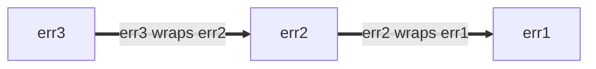

+++
title = "最佳实践"
date = 2024-01-22T10:01:46+08:00
type = "docs"
description = ""
isCJKLanguage = true
draft = false
+++

# Go Style Best Practices - Go 风格最佳实践

> 原文：[https://google.github.io/styleguide/go/best-practices](https://google.github.io/styleguide/go/best-practices)

> **Note:** This is part of a series of documents that outline [Go Style](https://google.github.io/styleguide/go/index) at Google. This document is **neither [normative](https://google.github.io/styleguide/go/index#normative) nor [canonical](https://google.github.io/styleguide/go/index#canonical)**, and is an auxiliary document to the [core style guide](https://google.github.io/styleguide/go/guide). See [the overview](https://google.github.io/styleguide/go/index#about) for more information.
>
> ​	注意：这是概述 Google 中 Go 风格的一系列文档的一部分。此文档既不是规范性的，也不是规范性的，并且是核心风格指南的辅助文档。有关更多信息，请参阅概述。


## About 关于

This file documents **guidance about how to best apply the Go Style Guide**. This guidance is intended for common situations that arise frequently, but may not apply in every circumstance. Where possible, multiple alternative approaches are discussed along with the considerations that go into the decision about when and when not to apply them.

​	此文件记录了有关如何最好地应用 Go 风格指南的指导。此指导适用于经常出现的常见情况，但可能并不适用于所有情况。在可能的情况下，将讨论多种替代方法以及在何时应用和何时不应用这些方法的决策考虑因素。

See [the overview](https://google.github.io/styleguide/go/index#about) for the full set of Style Guide documents.

​	有关风格指南文档的完整集，请参阅概述。


## Naming 命名


### Function and method names 函数和方法名称


#### Avoid repetition 避免重复

When choosing the name for a function or method, consider the context in which the name will be read. Consider the following recommendations to avoid excess [repetition](https://google.github.io/styleguide/go/decisions#repetition) at the call site:

​	在选择函数或方法的名称时，请考虑名称将被读取的上下文。考虑以下建议以避免在调用站点出现过多重复：

- The following can generally be omitted from function and method names:

  ​	通常可以从函数和方法名称中省略以下内容：

  - The types of the inputs and outputs (when there is no collision)
    输入和输出的类型（当没有冲突时）
  - The type of a method’s receiver
    方法接收者的类型
  - Whether an input or output is a pointer
    输入或输出是否为指针

- For functions, do not [repeat the name of the package](https://google.github.io/styleguide/go/decisions#repetitive-with-package).

  ​	对于函数，不要重复包的名称。

  ```
  // Bad:
  package yamlconfig
  
  func ParseYAMLConfig(input string) (*Config, error)
  ```

  ```
  // Good:
  package yamlconfig
  
  func Parse(input string) (*Config, error)
  ```

- For methods, do not repeat the name of the method receiver.

  ​	对于方法，不要重复方法接收者的名称。

  ```
  // Bad:
  func (c *Config) WriteConfigTo(w io.Writer) (int64, error)
  ```

  ```
  // Good:
  func (c *Config) WriteTo(w io.Writer) (int64, error)
  ```

- Do not repeat the names of variables passed as parameters.

  ​	不要重复作为参数传递的变量的名称。

  ```
  // Bad:
  func OverrideFirstWithSecond(dest, source *Config) error
  ```

  ```
  // Good:
  func Override(dest, source *Config) error
  ```

- Do not repeat the names and types of the return values.

  ​	不要重复返回值的名称和类型。

  ```
  // Bad:
  func TransformYAMLToJSON(input *Config) *jsonconfig.Config
  ```

  ```
  // Good:
  func Transform(input *Config) *jsonconfig.Config
  ```

When it is necessary to disambiguate functions of a similar name, it is acceptable to include extra information.

​	当有必要区分具有相似名称的函数时，可以包含额外的信息。

``` go
// Good:
func (c *Config) WriteTextTo(w io.Writer) (int64, error)
func (c *Config) WriteBinaryTo(w io.Writer) (int64, error)
```


#### Naming conventions 命名约定

There are some other common conventions when choosing names for functions and methods:

​	在选择函数和方法的名称时还有一些其他常见的约定：

- Functions that return something are given noun-like names.

  ​	返回某些内容的函数被赋予名词般的名称。

  ```
  // Good:
  func (c *Config) JobName(key string) (value string, ok bool)
  ```

  A corollary of this is that function and method names should [avoid the prefix `Get`](https://google.github.io/styleguide/go/decisions#getters).

  ​	由此推论，函数和方法名称应避免前缀 `Get` 。

  ```
  // Bad:
  func (c *Config) GetJobName(key string) (value string, ok bool)
  ```

- Functions that do something are given verb-like names.

  ​	执行某种操作的函数被赋予类似动词的名称。

  ```
  // Good:
  func (c *Config) WriteDetail(w io.Writer) (int64, error)
  ```

- Identical functions that differ only by the types involved include the name of the type at the end of the name.

  ​	仅涉及类型不同的相同函数在名称末尾包含类型名称。

  ```
  // Good:
  func ParseInt(input string) (int, error)
  func ParseInt64(input string) (int64, error)
  func AppendInt(buf []byte, value int) []byte
  func AppendInt64(buf []byte, value int64) []byte
  ```

  If there is a clear “primary” version, the type can be omitted from the name for that version:

  ​	如果存在明确的“主要”版本，则可以从该版本的名称中省略类型：

  ```
  // Good:
  func (c *Config) Marshal() ([]byte, error)
  func (c *Config) MarshalText() (string, error)
  ```


### Test double packages and types 测试双包和类型

There are several disciplines you can apply to [naming](https://google.github.io/styleguide/go/guide#naming) packages and types that provide test helpers and especially [test doubles](https://abseil.io/resources/swe-book/html/ch13.html#basic_concepts). A test double could be a stub, fake, mock, or spy.

​	您可以应用多种规则来命名提供测试帮助程序，尤其是测试双包和类型。测试双包可以是存根、伪造、模拟或间谍。

These examples mostly use stubs. Update your names accordingly if your code uses fakes or another kind of test double.

​	这些示例主要使用存根。如果您的代码使用伪造或其他类型的测试双包，请相应地更新您的名称。

Suppose you have a well-focused package providing production code similar to this:

​	假设您有一个重点明确的包，提供类似于以下内容的生产代码：

```
package creditcard

import (
    "errors"

    "path/to/money"
)

// ErrDeclined indicates that the issuer declines the charge.
var ErrDeclined = errors.New("creditcard: declined")

// Card contains information about a credit card, such as its issuer,
// expiration, and limit.
type Card struct {
    // omitted
}

// Service allows you to perform operations with credit cards against external
// payment processor vendors like charge, authorize, reimburse, and subscribe.
type Service struct {
    // omitted
}

func (s *Service) Charge(c *Card, amount money.Money) error { /* omitted */ }
```


#### Creating test helper packages 创建测试帮助程序包

Suppose you want to create a package that contains test doubles for another. We’ll use `package creditcard` (from above) for this example:

​	假设您想创建一个包含另一个测试双包的包。我们将为此示例使用 `package creditcard` （来自上面）：

One approach is to introduce a new Go package based on the production one for testing. A safe choice is to append the word `test` to the original package name (“creditcard” + “test”):

​	一种方法是引入一个新的 Go 包，该包基于生产包进行测试。一种安全的选择是将单词 `test` 附加到原始包名称（“creditcard” + “test”）：

``` go
// Good:
package creditcardtest
```

Unless stated explicitly otherwise, all examples in the sections below are in `package creditcardtest`.

​	除非另有明确说明，以下各节中的所有示例均以 `package creditcardtest` 编写。


#### Simple case 简单情况

You want to add a set of test doubles for `Service`. Because `Card` is effectively a dumb data type, similar to a Protocol Buffer message, it needs no special treatment in tests, so no double is required. If you anticipate only test doubles for one type (like `Service`), you can take a concise approach to naming the doubles:

​	您想为 `Service` 添加一组测试替身。由于 `Card` 实际上是一种哑数据类型，类似于 Protocol Buffer 消息，因此在测试中不需要特殊处理，因此不需要替身。如果您只预期一种类型的测试替身（如 `Service` ），则可以采用简洁的方法来命名替身：

``` go
// Good:
import (
    "path/to/creditcard"
    "path/to/money"
)

// Stub stubs creditcard.Service and provides no behavior of its own.
type Stub struct{}

func (Stub) Charge(*creditcard.Card, money.Money) error { return nil }
```

This is strictly preferable to a naming choice like `StubService` or the very poor `StubCreditCardService`, because the base package name and its domain types imply what `creditcardtest.Stub` is.

​	这比 `StubService` 或非常糟糕的 `StubCreditCardService` 等命名选择严格优选，因为基本包名称及其域类型暗示了 `creditcardtest.Stub` 是什么。

Finally, if the package is built with Bazel, make sure the new `go_library` rule for the package is marked as `testonly`:

​	最后，如果该软件包是使用 Bazel 构建的，请确保将该软件包的新 `go_library` 规则标记为 `testonly` ：

```build
// Good:
go_library(
    name = "creditcardtest",
    srcs = ["creditcardtest.go"],
    deps = [
        ":creditcard",
        ":money",
    ],
    testonly = True,
)
```

The approach above is conventional and will be reasonably well understood by other engineers.

​	上述方法是常规方法，其他工程师将能够合理地理解该方法。

See also:

​	另请参阅：

- [Go Tip #42: Authoring a Stub for Testing
  Go 提示 #42：编写用于测试的存根](https://google.github.io/styleguide/go/index.html#gotip)


#### Multiple test double behaviors 多种测试替身行为

When one kind of stub is not enough (for example, you also need one that always fails), we recommend naming the stubs according to the behavior they emulate. Here we rename `Stub` to `AlwaysCharges` and introduce a new stub called `AlwaysDeclines`:

​	当一种存根不够用时（例如，您还需要一个始终失败的存根），我们建议根据存根模拟的行为来命名存根。此处我们将 `Stub` 重命名为 `AlwaysCharges` ，并引入一个名为 `AlwaysDeclines` 的新存根：

``` go
// Good:
// AlwaysCharges stubs creditcard.Service and simulates success.
type AlwaysCharges struct{}

func (AlwaysCharges) Charge(*creditcard.Card, money.Money) error { return nil }

// AlwaysDeclines stubs creditcard.Service and simulates declined charges.
type AlwaysDeclines struct{}

func (AlwaysDeclines) Charge(*creditcard.Card, money.Money) error {
    return creditcard.ErrDeclined
}
```


#### Multiple doubles for multiple types 多种类型的多个替身

But now suppose that `package creditcard` contains multiple types worth creating doubles for, as seen below with `Service` and `StoredValue`:

​	但现在假设 `package creditcard` 包含多个值得创建双打类型的类型，如下所示，其中包含 `Service` 和 `StoredValue` ：

```
package creditcard

type Service struct {
    // omitted
}

type Card struct {
    // omitted
}

// StoredValue manages customer credit balances.  This applies when returned
// merchandise is credited to a customer's local account instead of processed
// by the credit issuer.  For this reason, it is implemented as a separate
// service.
type StoredValue struct {
    // omitted
}

func (s *StoredValue) Credit(c *Card, amount money.Money) error { /* omitted */ }
```

In this case, more explicit test double naming is sensible:

​	在这种情况下，更明确的测试双重命名是合理的：

``` go
// Good:
type StubService struct{}

func (StubService) Charge(*creditcard.Card, money.Money) error { return nil }

type StubStoredValue struct{}

func (StubStoredValue) Credit(*creditcard.Card, money.Money) error { return nil }
```


#### Local variables in tests 测试中的局部变量

When variables in your tests refer to doubles, choose a name that most clearly differentiates the double from other production types based on context. Consider some production code you want to test:

​	当测试中的变量引用双打时，请选择一个名称，该名称根据上下文最清楚地区分双打和其他生产类型。考虑要测试的一些生产代码：

```
package payment

import (
    "path/to/creditcard"
    "path/to/money"
)

type CreditCard interface {
    Charge(*creditcard.Card, money.Money) error
}

type Processor struct {
    CC CreditCard
}

var ErrBadInstrument = errors.New("payment: instrument is invalid or expired")

func (p *Processor) Process(c *creditcard.Card, amount money.Money) error {
    if c.Expired() {
        return ErrBadInstrument
    }
    return p.CC.Charge(c, amount)
}
```

In the tests, a test double called a “spy” for `CreditCard` is juxtaposed against production types, so prefixing the name may improve clarity.

​	在测试中，一个名为 `CreditCard` 的“间谍”的测试双打与生产类型并列，因此给名称添加前缀可能会提高清晰度。

``` go
// Good:
package payment

import "path/to/creditcardtest"

func TestProcessor(t *testing.T) {
    var spyCC creditcardtest.Spy

    proc := &Processor{CC: spyCC}

    // declarations omitted: card and amount
    if err := proc.Process(card, amount); err != nil {
        t.Errorf("proc.Process(card, amount) = %v, want %v", got, want)
    }

    charges := []creditcardtest.Charge{
        {Card: card, Amount: amount},
    }

    if got, want := spyCC.Charges, charges; !cmp.Equal(got, want) {
        t.Errorf("spyCC.Charges = %v, want %v", got, want)
    }
}
```

This is clearer than when the name is not prefixed.

​	这比不给名称添加前缀时更清晰。

``` go
// Bad:
package payment

import "path/to/creditcardtest"

func TestProcessor(t *testing.T) {
    var cc creditcardtest.Spy

    proc := &Processor{CC: cc}

    // declarations omitted: card and amount
    if err := proc.Process(card, amount); err != nil {
        t.Errorf("proc.Process(card, amount) = %v, want %v", got, want)
    }

    charges := []creditcardtest.Charge{
        {Card: card, Amount: amount},
    }

    if got, want := cc.Charges, charges; !cmp.Equal(got, want) {
        t.Errorf("cc.Charges = %v, want %v", got, want)
    }
}
```


### Shadowing 阴影

**Note:** This explanation uses two informal terms, *stomping* and *shadowing*. They are not official concepts in the Go language spec.

​	注意：此说明使用了两个非正式术语，即践踏和阴影。它们不是 Go 语言规范中的正式概念。

Like many programming languages, Go has mutable variables: assigning to a variable changes its value.

​	与许多编程语言一样，Go 具有可变变量：对变量进行赋值会更改其值。

``` go
// Good:
func abs(i int) int {
    if i < 0 {
        i *= -1
    }
    return i
}
```

When using [short variable declarations](https://go.dev/ref/spec#Short_variable_declarations) with the `:=` operator, in some cases a new variable is not created. We can call this *stomping*. It’s OK to do this when the original value is no longer needed.

​	在某些情况下，使用带有 `:=` 运算符的短变量声明时，不会创建新变量。我们可以称之为践踏。当不再需要原始值时，这样做是可以的。

``` go
// Good:
// innerHandler is a helper for some request handler, which itself issues
// requests to other backends.
func (s *Server) innerHandler(ctx context.Context, req *pb.MyRequest) *pb.MyResponse {
    // Unconditionally cap the deadline for this part of request handling.
    ctx, cancel := context.WithTimeout(ctx, 3*time.Second)
    defer cancel()
    ctxlog.Info(ctx, "Capped deadline in inner request")

    // Code here no longer has access to the original context.
    // This is good style if when first writing this, you anticipate
    // that even as the code grows, no operation legitimately should
    // use the (possibly unbounded) original context that the caller provided.

    // ...
}
```

Be careful using short variable declarations in a new scope, though: that introduces a new variable. We can call this *shadowing* the original variable. Code after the end of the block refers to the original. Here is a buggy attempt to shorten the deadline conditionally:

​	在新的作用域中使用短变量声明时要小心，尽管这样会引入一个新变量。我们可以称之为原始变量的阴影。块结束后的代码引用原始变量。这是一个缩短截止日期的错误尝试：

``` go
// Bad:
func (s *Server) innerHandler(ctx context.Context, req *pb.MyRequest) *pb.MyResponse {
    // Attempt to conditionally cap the deadline.
    if *shortenDeadlines {
        ctx, cancel := context.WithTimeout(ctx, 3*time.Second)
        defer cancel()
        ctxlog.Info(ctx, "Capped deadline in inner request")
    }

    // BUG: "ctx" here again means the context that the caller provided.
    // The above buggy code compiled because both ctx and cancel
    // were used inside the if statement.

    // ...
}
```

A correct version of the code might be:

​	代码的正确版本可能是：

``` go
// Good:
func (s *Server) innerHandler(ctx context.Context, req *pb.MyRequest) *pb.MyResponse {
    if *shortenDeadlines {
        var cancel func()
        // Note the use of simple assignment, = and not :=.
        ctx, cancel = context.WithTimeout(ctx, 3*time.Second)
        defer cancel()
        ctxlog.Info(ctx, "Capped deadline in inner request")
    }
    // ...
}
```

In the case we called stomping, because there’s no new variable, the type being assigned must match that of the original variable. With shadowing, an entirely new entity is introduced so it can have a different type. Intentional shadowing can be a useful practice, but you can always use a new name if it improves [clarity](https://google.github.io/styleguide/go/guide#clarity).

​	在称为踩踏的情况下，因为没有新变量，所以被分配的类型必须与原始变量的类型匹配。使用阴影，会引入一个全新的实体，因此它可以具有不同的类型。有意的阴影可能是一种有用的做法，但如果它提高了清晰度，您始终可以使用新名称。

It is not a good idea to use variables with the same name as standard packages other than very small scopes, because that renders free functions and values from that package inaccessible. Conversely, when picking a name for your package, avoid names that are likely to require [import renaming](https://google.github.io/styleguide/go/decisions#import-renaming) or cause shadowing of otherwise good variable names at the client side.

​	除了非常小的作用域之外，最好不要使用与标准包同名的变量，因为这会使该包中的自由函数和值无法访问。相反，在为您的包选择名称时，请避免可能需要重命名导入或导致在客户端遮盖其他良好变量名称的名称。

``` go
// Bad:
func LongFunction() {
    url := "https://example.com/"
    // Oops, now we can't use net/url in code below.
}
```


### Util packages 实用程序包

Go packages have a name specified on the `package` declaration, separate from the import path. The package name matters more for readability than the path.

​	Go 包在 `package` 声明中指定了一个名称，该名称与导入路径分开。包名称对于可读性比路径更重要。

Go package names should be [related to what the package provides](https://google.github.io/styleguide/go/decisions#package-names). Naming a package just `util`, `helper`, `common` or similar is usually a poor choice (it can be used as *part* of the name though). Uninformative names make the code harder to read, and if used too broadly they are liable to cause needless [import conflicts](https://google.github.io/styleguide/go/decisions#import-renaming).

​	Go 包名称应与包提供的内容相关。仅将包命名为 `util` 、 `helper` 、 `common` 或类似名称通常是一个糟糕的选择（尽管它可以用作名称的一部分）。信息量不足的名称会使代码更难阅读，如果使用范围太广，则可能会导致不必要的导入冲突。

Instead, consider what the callsite will look like.

​	相反，请考虑调用站点的样貌。

``` go
// Good:
db := spannertest.NewDatabaseFromFile(...)

_, err := f.Seek(0, io.SeekStart)

b := elliptic.Marshal(curve, x, y)
```

You can tell roughly what each of these do even without knowing the imports list (`cloud.google.com/go/spanner/spannertest`, `io`, and `crypto/elliptic`). With less focused names, these might read:

​	即使不知道导入列表（ `cloud.google.com/go/spanner/spannertest` 、 `io` 和 `crypto/elliptic` ），您也可以大致说出每个名称的作用。如果名称不够集中，则可能如下所示：

``` go
// Bad:
db := test.NewDatabaseFromFile(...)

_, err := f.Seek(0, common.SeekStart)

b := helper.Marshal(curve, x, y)
```


## Package size 包大小

If you’re asking yourself how big your Go packages should be and whether to place related types in the same package or split them into different ones, a good place to start is the [Go blog post about package names](https://go.dev/blog/package-names). Despite the post title, it’s not solely about naming. It contains some helpful hints and cites several useful articles and talks.

​	如果您想知道 Go 包的大小应该多大，以及是否将相关类型放在同一个包中或将它们拆分为不同的包，那么一个好的起点是有关包名称的 Go 博客文章。尽管有文章标题，但它不仅仅是关于命名。它包含一些有用的提示，并引用了几篇有用的文章和演讲。

Here are some other considerations and notes.

​	以下是一些其他注意事项和说明。

Users see [godoc](https://pkg.go.dev/) for the package in one page, and any methods exported by types supplied by the package are grouped by their type. Godoc also group constructors along with the types they return. If *client code* is likely to need two values of different type to interact with each other, it may be convenient for the user to have them in the same package.

​	用户可以在一个页面上看到该软件包的 godoc，并且该软件包提供的类型导出的任何方法都按其类型分组。Godoc 还将构造函数与其返回的类型组合在一起。如果客户端代码可能需要两个不同类型的值来相互交互，那么用户将它们放在同一个软件包中可能会很方便。

Code within a package can access unexported identifiers in the package. If you have a few related types whose *implementation* is tightly coupled, placing them in the same package lets you achieve this coupling without polluting the public API with these details.

​	软件包中的代码可以访问该软件包中未导出的标识符。如果您有一些实现紧密耦合的相关类型，将它们放在同一个软件包中可以实现这种耦合，而不会用这些细节污染公共 API。

All of that being said, putting your entire project in a single package would likely make that package too large. When something is conceptually distinct, giving it its own small package can make it easier to use. The short name of the package as known to clients together with the exported type name work together to make a meaningful identifier: e.g. `bytes.Buffer`, `ring.New`. The [blog post](https://go.dev/blog/package-names) has more examples.

​	尽管如此，将整个项目放在一个软件包中可能会使该软件包太大。当某个东西在概念上是不同的时，为其提供自己的小软件包可以使其更易于使用。客户端已知的软件包的简短名称与导出的类型名称一起使用，可以形成一个有意义的标识符：例如 `bytes.Buffer` 、 `ring.New` 。博客文章中有更多示例。

Go style is flexible about file size, because maintainers can move code within a package from one file to another without affecting callers. But as a general guideline: it is usually not a good idea to have a single file with many thousands of lines in it, or having many tiny files. There is no “one type, one file” convention as in some other languages. As a rule of thumb, files should be focused enough that a maintainer can tell which file contains something, and the files should be small enough that it will be easy to find once there. The standard library often splits large packages to several source files, grouping related code by file. The source for [package `bytes`](https://go.dev/src/bytes/) is a good example. Packages with long package documentation may choose to dedicate one file called `doc.go` that has the [package documentation](https://google.github.io/styleguide/go/decisions#package-comments), a package declaration, and nothing else, but this is not required.

​	Go 样式对于文件大小是灵活的，因为维护者可以在不影响调用者的前提下将包中的代码从一个文件移动到另一个文件。但作为一般准则：通常不建议将数千行代码放在一个文件中，也不建议将许多小文件放在一起。不像其他一些语言那样，没有“一种类型，一个文件”的约定。根据经验，文件应该足够集中，以便维护者可以分辨出某个文件包含什么内容，并且文件应该足够小，以便在其中找到内容时很容易。标准库通常将大型包拆分为多个源文件，按文件对相关代码进行分组。包 `bytes` 的源代码就是一个很好的例子。具有较长包文档的包可以选择专门使用一个名为 `doc.go` 的文件，其中包含包文档、包声明，但没有其他内容，但这并不是必需的。

Within the Google codebase and in projects using Bazel, directory layout for Go code is different than it is in open source Go projects: you can have multiple `go_library` targets in a single directory. A good reason to give each package its own directory is if you expect to open source your project in the future.

​	在 Google 代码库和使用 Bazel 的项目中，Go 代码的目录布局与开源 Go 项目中的布局不同：您可以在单个目录中拥有多个 `go_library` 目标。如果预计将来开源您的项目，那么为每个软件包提供自己的目录是一个好理由。

See also:

​	另请参阅：

- [Test double packages
  测试双软件包](https://google.github.io/styleguide/go/best-practices#naming-doubles)


## Imports 导入


### Protos and stubs Protos 和存根

Proto library imports are treated differently than standard Go imports due to their cross-language nature. The convention for renamed proto imports are based on the rule that generated the package:

​	由于跨语言特性，Proto 库导入的处理方式不同于标准 Go 导入。重命名 proto 导入的约定基于生成软件包的规则：

- The `pb` suffix is generally used for `go_proto_library` rules.
  `pb` 后缀通常用于 `go_proto_library` 规则。
- The `grpc` suffix is generally used for `go_grpc_library` rules.
  `grpc` 后缀通常用于 `go_grpc_library` 规则。

Generally, a short one- or two-letter prefix is used:

​	通常，使用一个或两个字母的简短前缀：

``` go
// Good:
import (
    fspb "path/to/package/foo_service_go_proto"
    fsgrpc "path/to/package/foo_service_go_grpc"
)
```

If there is only a single proto used by a package or the package is tied closely to that proto, the prefix can be omitted:

​	如果软件包只使用一个 proto 或软件包与该 proto 紧密相关，则可以省略前缀：

import ( pb “path/to/package/foo_service_go_proto” grpc “path/to/package/foo_service_go_grpc” )

If the symbols in the proto are generic or are not very self-descriptive, or if shortening the package name with an acronym is unclear, a short word can suffice as the prefix:

​	如果 proto 中的符号是通用的或不是非常自描述的，或者如果使用首字母缩略词缩短软件包名称不清楚，那么一个简短的单词可以作为前缀：

``` go
// Good:
import (
    mapspb "path/to/package/maps_go_proto"
)
```

In this case `mapspb.Address` might be clearer than `mpb.Address` if the code in question is not already clearly related to maps.

​	在这种情况下，如果相关代码与地图没有明确关联，则 `mapspb.Address` 可能比 `mpb.Address` 更清晰。


### Import ordering 导入顺序

Imports are typically grouped into the following two (or more) blocks, in order:

​	导入通常按以下两个（或更多）块分组，顺序如下：

1. Standard library imports (e.g., `"fmt"`)
   标准库导入（例如， `"fmt"` ）
2. imports (e.g., “/path/to/somelib”)
   导入（例如，“/path/to/somelib”）
3. (optional) Protobuf imports (e.g., `fpb "path/to/foo_go_proto"`)
   （可选）Protobuf 导入（例如， `fpb "path/to/foo_go_proto"` ）
4. (optional) Side-effect imports (e.g., `_ "path/to/package"`)
   （可选）副作用导入（例如， `_ "path/to/package"` ）

If a file does not have a group for one of the optional categories above, the relevant imports are included in the project import group.

​	如果文件没有上述可选类别之一的组，则相关导入将包含在项目导入组中。

Any import grouping that is clear and easy to understand is generally fine. For example, a team may choose to group gRPC imports separately from protobuf imports.

​	任何清晰易懂的导入分组通常都是可以的。例如，团队可以选择将 gRPC 导入与 protobuf 导入分开分组。

> **Note:** For code maintaining only the two mandatory groups (one group for the standard library and one for all other imports), the `goimports` tool produces output consistent with this guidance.
>
> ​	注意：对于仅维护两个强制组（一个组用于标准库，另一个组用于所有其他导入）的代码， `goimports` 工具会生成与此指南一致的输出。
>
> However, `goimports` has no knowledge of groups beyond the mandatory ones; the optional groups are prone to invalidation by the tool. When optional groups are used, attention on the part of both authors and reviewers is required to ensure that groupings remain compliant.
>
> ​	但是， `goimports` 并不了解除强制组之外的其他组；可选组容易被工具无效化。当使用可选组时，作者和审阅者都需要关注，以确保分组保持一致。
>
> Either approach is fine, but do not leave the imports section in an inconsistent, partially grouped state.
>
> ​	两种方法都可以，但不要将导入部分保留在不一致的、部分分组的状态中。


## Error handling 错误处理

In Go, [errors are values](https://go.dev/blog/errors-are-values); they are created by code and consumed by code. Errors can be:

​	在 Go 中，错误是值；它们由代码创建并由代码使用。错误可以是：

- Converted into diagnostic information for display to humans
  转换为供人类显示的诊断信息
- Used by the maintainer
  由维护人员使用
- Interpreted by an end user
  由最终用户解释

Error messages also show up across a variety of different surfaces including log messages, error dumps, and rendered UIs.

​	错误消息还会显示在各种不同的界面上，包括日志消息、错误转储和呈现的 UI。

Code that processes (produces or consumes) errors should do so deliberately. It can be tempting to ignore or blindly propagate an error return value. However, it is always worth considering whether the current function in the call frame is positioned to handle the error most effectively. This is a large topic and it is hard to give categorical advice. Use your judgment, but keep the following considerations in mind:

​	处理（产生或使用）错误的代码应有意地这样做。忽略或盲目传播错误返回值可能会很诱人。但是，始终值得考虑调用框架中的当前函数是否处于最有效地处理错误的位置。这是一个很大的主题，很难给出明确的建议。运用你的判断力，但要记住以下注意事项：

- When creating an error value, decide whether to give it any [structure](https://google.github.io/styleguide/go/best-practices#error-structure).
  在创建错误值时，决定是否赋予它任何结构。
- When handling an error, consider [adding information](https://google.github.io/styleguide/go/best-practices#error-extra-info) that you have but that the caller and/or callee might not.
  在处理错误时，请考虑添加您有但调用方和/或被调用方可能没有的信息。
- See also guidance on [error logging](https://google.github.io/styleguide/go/best-practices#error-logging).
  另请参阅有关错误日志记录的指南。

While it is usually not appropriate to ignore an error, a reasonable exception to this is when orchestrating related operations, where often only the first error is useful. Package [`errgroup`](https://pkg.go.dev/golang.org/x/sync/errgroup) provides a convenient abstraction for a group of operations that can all fail or be canceled as a group.

​	虽然通常不适合忽略错误，但对此的一个合理的例外是在编排相关操作时，通常只有第一个错误才有用。包 `errgroup` 为一组操作提供了一个方便的抽象，这些操作都可能失败或作为一组被取消。

See also:

​	另请参阅：

- [Effective Go on errors](https://go.dev/doc/effective_go#errors)
- [A post by the Go Blog on errors
  Go 博客上有关错误的文章](https://go.dev/blog/go1.13-errors)
- [Package `errors`
  包 `errors`](https://pkg.go.dev/errors)
- [Package `upspin.io/errors`
  包 `upspin.io/errors`](https://commandcenter.blogspot.com/2017/12/error-handling-in-upspin.html)
- [GoTip #89: When to Use Canonical Status Codes as Errors
  GoTip #89：何时将规范状态代码用作错误](https://google.github.io/styleguide/go/index.html#gotip)
- [GoTip #48: Error Sentinel Values
  GoTip #48：错误哨兵值](https://google.github.io/styleguide/go/index.html#gotip)
- [GoTip #13: Designing Errors for Checking
  GoTip #13：设计用于检查的错误](https://google.github.io/styleguide/go/index.html#gotip)


### Error structure 错误结构

If callers need to interrogate the error (e.g., distinguish different error conditions), give the error value structure so that this can be done programmatically rather than having the caller perform string matching. This advice applies to production code as well as to tests that care about different error conditions.

​	如果调用者需要查询错误（例如，区分不同的错误情况），请给出错误值结构，以便可以通过编程方式完成此操作，而不是让调用者执行字符串匹配。此建议适用于生产代码以及关心不同错误情况的测试。

The simplest structured errors are unparameterized global values.

​	最简单的结构化错误是未参数化的全局值。

```
type Animal string

var (
    // ErrDuplicate occurs if this animal has already been seen.
    ErrDuplicate = errors.New("duplicate")

    // ErrMarsupial occurs because we're allergic to marsupials outside Australia.
    // Sorry.
    ErrMarsupial = errors.New("marsupials are not supported")
)

func pet(animal Animal) error {
    switch {
    case seen[animal]:
        return ErrDuplicate
    case marsupial(animal):
        return ErrMarsupial
    }
    seen[animal] = true
    // ...
    return nil
}
```

The caller can simply compare the returned error value of the function with one of the known error values:

​	调用者可以简单地将函数的返回错误值与已知错误值之一进行比较：

``` go
// Good:
func handlePet(...) {
    switch err := process(an); err {
    case ErrDuplicate:
        return fmt.Errorf("feed %q: %v", an, err)
    case ErrMarsupial:
        // Try to recover with a friend instead.
        alternate = an.BackupAnimal()
        return handlePet(..., alternate, ...)
    }
}
```

The above uses sentinel values, where the error must be equal (in the sense of `==`) to the expected value. That is perfectly adequate in many cases. If `process` returns wrapped errors (discussed below), you can use [`errors.Is`](https://pkg.go.dev/errors#Is).

​	上面使用哨兵值，其中错误必须等于（按 `==` 的意义）预期值。在许多情况下，这完全足够。如果 `process` 返回包装错误（如下所述），则可以使用 `errors.Is` 。

``` go
// Good:
func handlePet(...) {
    switch err := process(an); {
    case errors.Is(err, ErrDuplicate):
        return fmt.Errorf("feed %q: %v", an, err)
    case errors.Is(err, ErrMarsupial):
        // ...
    }
}
```

Do not attempt to distinguish errors based on their string form. (See [Go Tip #13: Designing Errors for Checking](https://google.github.io/styleguide/go/index.html#gotip) for more.)

​	不要尝试根据错误的字符串形式来区分错误。（请参阅 Go 提示 #13：设计错误以进行更多检查。）

``` go
// Bad:
func handlePet(...) {
    err := process(an)
    if regexp.MatchString(`duplicate`, err.Error()) {...}
    if regexp.MatchString(`marsupial`, err.Error()) {...}
}
```

If there is extra information in the error that the caller needs programmatically, it should ideally be presented structurally. For example, the [`os.PathError`](https://pkg.go.dev/os#PathError) type is documented to place the pathname of the failing operation in a struct field which the caller can easily access.

​	如果错误中包含调用者以编程方式需要的额外信息，则理想情况下应以结构化方式呈现。例如， `os.PathError` 类型被记录为将失败操作的路径名放在调用者可以轻松访问的结构字段中。

Other error structures can be used as appropriate, for example a project struct containing an error code and detail string. [Package `status`](https://pkg.go.dev/google.golang.org/grpc/status) is a common encapsulation; if you choose this approach (which you are not obligated to do), use [canonical codes](https://pkg.go.dev/google.golang.org/grpc/codes). See [Go Tip #89: When to Use Canonical Status Codes as Errors](https://google.github.io/styleguide/go/index.html#gotip) to know if using status codes is the right choice.

​	其他错误结构也可以根据需要使用，例如包含错误代码和详细信息字符串的项目结构。包 `status` 是一个常见的封装；如果您选择此方法（您没有义务这样做），请使用规范代码。请参阅 Go 提示 #89：何时将规范状态代码用作错误，以了解使用状态代码是否是正确的选择。


### Adding information to errors 向错误中添加信息

Any function returning an error should strive to make the error value useful. Often, the function is in the middle of a callchain and is merely propagating an error from some other function that it called (maybe even from another package). Here there is an opportunity to annotate the error with extra information, but the programmer should ensure there’s sufficient information in the error without adding duplicate or irrelevant detail. If you’re unsure, try triggering the error condition during development: that’s a good way to assess what the observers of the error (either humans or code) will end up with.

​	任何返回错误的函数都应努力使错误值有用。通常，该函数位于调用链的中间，并且仅仅是从它调用的某个其他函数（甚至可能来自另一个包）传播错误。这里有机会用额外信息注释错误，但程序员应确保错误中包含足够的信息，而不会添加重复或不相关的详细信息。如果您不确定，请尝试在开发过程中触发错误条件：这是一个很好的方法，可以评估错误的观察者（无论是人类还是代码）最终会得到什么。

Convention and good documentation help. For example, the standard package `os` advertises that its errors contain path information when it is available. This is a useful style, because callers getting back an error don’t need to annotate it with information that they had already provided the failing function.

​	约定和良好的文档会有所帮助。例如，标准包 `os` 会宣传其错误在可用时包含路径信息。这是一种有用的样式，因为收到错误的调用者无需使用他们已经提供给失败函数的信息对其进行注释。

``` go
// Good:
if err := os.Open("settings.txt"); err != nil {
    return err
}

// Output:
//
// open settings.txt: no such file or directory
```

If there is something interesting to say about the *meaning* of the error, of course it can be added. Just consider which level of the callchain is best positioned to understand this meaning.

​	当然，如果错误的含义有一些有趣之处，可以添加。只需考虑调用链的哪个级别最适合理解此含义。

``` go
// Good:
if err := os.Open("settings.txt"); err != nil {
    // We convey the significance of this error to us. Note that the current
    // function might perform more than one file operation that can fail, so
    // these annotations can also serve to disambiguate to the caller what went
    // wrong.
    return fmt.Errorf("launch codes unavailable: %v", err)
}

// Output:
//
// launch codes unavailable: open settings.txt: no such file or directory
```

Contrast with the redundant information here:

​	与此处冗余的信息形成对比：

``` go
// Bad:
if err := os.Open("settings.txt"); err != nil {
    return fmt.Errorf("could not open settings.txt: %w", err)
}

// Output:
//
// could not open settings.txt: open settings.txt: no such file or directory
```

When adding information to a propagated error, you can either wrap the error or present a fresh error. Wrapping the error with the `%w` verb in `fmt.Errorf` allows callers to access data from the original error. This can be very useful at times, but in other cases these details are misleading or uninteresting to the caller. See the [blog post on error wrapping](https://blog.golang.org/go1.13-errors) for more information. Wrapping errors also expands the API surface of your package in a non-obvious way, and this can cause breakages if you change the implementation details of your package.

​	向传播的错误添加信息时，您可以包装错误或显示新错误。使用 `fmt.Errorf` 中的 `%w` 动词包装错误允许调用者访问原始错误中的数据。这有时非常有用，但在其他情况下，这些详细信息对调用者来说具有误导性或无趣。有关更多信息，请参阅有关错误包装的博客文章。包装错误还会以一种不明显的方式扩展包的 API 表面，如果您更改包的实现细节，这可能会导致中断。

It is best to avoid using `%w` unless you also document (and have tests that validate) the underlying errors that you expose. If you do not expect your caller to call `errors.Unwrap`, `errors.Is` and so on, don’t bother with `%w`.

​	除非您还记录（并有测试来验证）您公开的底层错误，否则最好避免使用 `%w` 。如果您不希望调用者调用 `errors.Unwrap` 、 `errors.Is` 等，那么不要使用 `%w` 。

The same concept applies to [structured errors](https://google.github.io/styleguide/go/best-practices#error-structure) like [`*status.Status`](https://pkg.go.dev/google.golang.org/grpc/status) (see [canonical codes](https://pkg.go.dev/google.golang.org/grpc/codes)). For example, if your server sends malformed requests to a backend and receives an `InvalidArgument` code, this code should *not* be propagated to the client, assuming that the client has done nothing wrong. Instead, return an `Internal` canonical code to the client.

​	同样的概念适用于结构化错误，如 `*status.Status` （请参阅规范代码）。例如，如果您的服务器向后端发送格式错误的请求并收到 `InvalidArgument` 代码，则不应将此代码传播到客户端，假设客户端没有做错任何事。相反，向客户端返回 `Internal` 规范代码。

However, annotating errors helps automated logging systems preserve the status payload of an error. For example, annotating the error is appropriate in an internal function:

​	但是，注释错误有助于自动记录系统保留错误的状态有效负载。例如，在内部函数中注释错误是合适的：

``` go
// Good:
func (s *Server) internalFunction(ctx context.Context) error {
    // ...
    if err != nil {
        return fmt.Errorf("couldn't find remote file: %w", err)
    }
}
```

Code directly at system boundaries (typically RPC, IPC, storage, and similar) should report errors using the canonical error space. It is the responsibility of code here to handle domain-specific errors and represent them canonically. For example:

​	系统边界（通常是 RPC、IPC、存储等）处的代码应使用规范错误空间报告错误。此处代码负责处理特定于域的错误并以规范方式表示它们。例如：

``` go
// Bad:
func (*FortuneTeller) SuggestFortune(context.Context, *pb.SuggestionRequest) (*pb.SuggestionResponse, error) {
    // ...
    if err != nil {
        return nil, fmt.Errorf("couldn't find remote file: %w", err)
    }
}
// Good:
import (
    "google.golang.org/grpc/codes"
    "google.golang.org/grpc/status"
)
func (*FortuneTeller) SuggestFortune(context.Context, *pb.SuggestionRequest) (*pb.SuggestionResponse, error) {
    // ...
    if err != nil {
        // Or use fmt.Errorf with the %w verb if deliberately wrapping an
        // error which the caller is meant to unwrap.
        return nil, status.Errorf(codes.Internal, "couldn't find fortune database", status.ErrInternal)
    }
}
```


### Placement of %w in errors 错误中 %w 的位置

Prefer to place `%w` at the end of an error string.

​	最好将 `%w` 放在错误字符串的末尾。

Errors can be wrapped with [the `%w` verb](https://blog.golang.org/go1.13-errors), or by placing them in a [structured error](https://google.github.io/styleguide/go/index.html#gotip) that implements `Unwrap() error` (ex: [`fs.PathError`](https://pkg.go.dev/io/fs#PathError)).

​	错误可以用 `%w` 动词包装，或通过将它们放在实现 `Unwrap() error` 的结构化错误中（例如： `fs.PathError` ）。

Wrapped errors form error chains: each new layer of wrapping adds a new entry to the front of the error chain. The error chain can be traversed with the `Unwrap() error` method. For example:

​	包装错误形成错误链：每一层新的包装都会在错误链的前面添加一个新条目。可以使用 `Unwrap() error` 方法遍历错误链。例如：

```
err1 := fmt.Errorf("err1")
err2 := fmt.Errorf("err2: %w", err1)
err3 := fmt.Errorf("err3: %w", err2)
```

This forms an error chain of the form,

​	这形成一个形式为的错误链，



Regardless of where the `%w` verb is placed, the error returned always represents the front of the error chain, and the `%w` is the next child. Similarly, `Unwrap() error` always traverses the error chain from newest to oldest error.

​	无论 `%w` 动词放在哪里，返回的错误始终表示错误链的前面，而 `%w` 是下一个子级。同样， `Unwrap() error` 始终从最新的错误遍历错误链到最旧的错误。

Placement of the `%w` verb does, however, affect whether the error chain is printed newest to oldest, oldest to newest, or neither:

​	但是， `%w` 动词的位置确实会影响错误链是按从最新到最旧、从最旧到最新还是两者都不是的顺序打印：

``` go
// Good:
err1 := fmt.Errorf("err1")
err2 := fmt.Errorf("err2: %w", err1)
err3 := fmt.Errorf("err3: %w", err2)
fmt.Println(err3) // err3: err2: err1
// err3 is a newest-to-oldest error chain, that prints newest-to-oldest.
// Bad:
err1 := fmt.Errorf("err1")
err2 := fmt.Errorf("%w: err2", err1)
err3 := fmt.Errorf("%w: err3", err2)
fmt.Println(err3) // err1: err2: err3
// err3 is a newest-to-oldest error chain, that prints oldest-to-newest.
// Bad:
err1 := fmt.Errorf("err1")
err2 := fmt.Errorf("err2-1 %w err2-2", err1)
err3 := fmt.Errorf("err3-1 %w err3-2", err2)
fmt.Println(err3) // err3-1 err2-1 err1 err2-2 err3-2
// err3 is a newest-to-oldest error chain, that neither prints newest-to-oldest
// nor oldest-to-newest.
```

Therefore, in order for error text to mirror error chain structure, prefer placing the `%w` verb at the end with the form `[...]: %w`.

​	因此，为了使错误文本反映错误链结构，最好将 `%w` 动词放在末尾，形式为 `[...]: %w` 。


### Logging errors 记录错误

Functions sometimes need to tell an external system about an error without propagating it to their callers. Logging is an obvious choice here; but be conscious of what and how you log errors.

​	函数有时需要将错误告知外部系统，而无需将其传播给调用者。记录错误是这里的一个明显选择；但要意识到记录错误的内容和方式。

- Like [good test failure messages](https://google.github.io/styleguide/go/decisions#useful-test-failures), log messages should clearly express what went wrong and help the maintainer by including relevant information to diagnose the problem.

  ​	与良好的测试失败消息一样，日志消息应清楚地表达出错之处，并通过包含相关信息来帮助维护人员诊断问题。

- Avoid duplication. If you return an error, it’s usually better not to log it yourself but rather let the caller handle it. The caller can choose to log the error, or perhaps rate-limit logging using [`rate.Sometimes`](https://pkg.go.dev/golang.org/x/time/rate#Sometimes). Other options include attempting recovery or even [stopping the program](https://google.github.io/styleguide/go/best-practices#checks-and-panics). In any case, giving the caller control helps avoid logspam.

  ​	避免重复。如果您返回错误，通常最好不要自己记录它，而是让调用者处理它。调用者可以选择记录错误，或者可能使用 `rate.Sometimes` 对日志记录进行限速。其他选项包括尝试恢复甚至停止程序。无论哪种情况，给予调用者控制权都有助于避免日志垃圾。

  The downside to this approach, however, is that any logging is written using the caller’s line coordinates.

  ​	然而，这种方法的缺点是任何日志记录都是使用调用者的行坐标编写的。

- Be careful with [PII](https://en.wikipedia.org/wiki/Personal_data). Many log sinks are not appropriate destinations for sensitive end-user information.

  ​	小心处理 PII。许多日志记录接收器不适合作为敏感最终用户信息的目的地。

- Use `log.Error` sparingly. ERROR level logging causes a flush and is more expensive than lower logging levels. This can have serious performance impact on your code. When deciding between error and warning levels, consider the best practice that messages at the error level should be actionable rather than “more serious” than a warning.

  ​	谨慎使用 `log.Error` 。ERROR 级别日志记录会导致刷新，并且比较低日志记录级别更昂贵。这可能会对您的代码产生严重的影响。在错误和警告级别之间进行决策时，请考虑最佳实践，即错误级别的消息应该是可操作的，而不是比警告“更严重”。

- Inside Google, we have monitoring systems that can be set up for more effective alerting than writing to a log file and hoping someone notices it. This is similar but not identical to the standard library [package `expvar`](https://pkg.go.dev/expvar).

  ​	在 Google 内部，我们有可以设置的监控系统，这些系统可以比写入日志文件并希望有人注意到它更有效地发出警报。这与标准库包 `expvar` 类似，但并不相同。


#### Custom verbosity levels 自定义详细程度级别

Use verbose logging ([`log.V`](https://pkg.go.dev/github.com/golang/glog#V)) to your advantage. Verbose logging can be useful for development and tracing. Establishing a convention around verbosity levels can be helpful. For example:

​	充分利用详细日志记录 ( `log.V` )。详细日志记录对于开发和跟踪很有用。围绕详细程度级别建立约定可能会有所帮助。例如：

- Write a small amount of extra information at `V(1)`
  在 `V(1)` 中写入少量额外信息
- Trace more information in `V(2)`
  在 `V(2)` 中跟踪更多信息
- Dump large internal states in `V(3)`
  在 `V(3)` 中转储大型内部状态

To minimize the cost of verbose logging, you should ensure not to accidentally call expensive functions even when `log.V` is turned off. `log.V` offers two APIs. The more convenient one carries the risk of this accidental expense. When in doubt, use the slightly more verbose style.

​	为了最大程度地降低详细日志记录的成本，您应该确保即使在关闭 `log.V` 时也不会意外调用昂贵的功能。 `log.V` 提供两个 API。更方便的一个 API 存在这种意外开销的风险。如有疑问，请使用稍微详细一点的样式。

``` go
// Good:
for _, sql := range queries {
  log.V(1).Infof("Handling %v", sql)
  if log.V(2) {
    log.Infof("Handling %v", sql.Explain())
  }
  sql.Run(...)
}
// Bad:
// sql.Explain called even when this log is not printed.
log.V(2).Infof("Handling %v", sql.Explain())
```


### Program initialization 程序初始化

Program initialization errors (such as bad flags and configuration) should be propagated upward to `main`, which should call `log.Exit` with an error that explains how to fix the error. In these cases, `log.Fatal` should not generally be used, because a stack trace that points at the check is not likely to be as useful as a human-generated, actionable message.

​	程序初始化错误（例如错误的标志和配置）应向上传播到 `main` ，它应使用解释如何修复错误的错误调用 `log.Exit` 。在这些情况下，通常不应使用 `log.Fatal` ，因为指向检查的堆栈跟踪可能不如人工生成的、可操作的消息有用。


### Program checks and panics 程序检查和恐慌

As stated in the [decision against panics](https://google.github.io/styleguide/go/decisions#dont-panic), standard error handling should be structured around error return values. Libraries should prefer returning an error to the caller rather than aborting the program, especially for transient errors.

​	如反对恐慌的决定中所述，标准错误处理应围绕错误返回值构建。库应优先向调用者返回错误，而不是中止程序，尤其是对于瞬态错误。

It is occasionally necessary to perform consistency checks on an invariant and terminate the program if it is violated. In general, this is only done when a failure of the invariant check means that the internal state has become unrecoverable. The most reliable way to do this in the Google codebase is to call `log.Fatal`. Using `panic` in these cases is not reliable, because it is possible for deferred functions to deadlock or further corrupt internal or external state.

​	有时需要对不变性执行一致性检查，并在违反时终止程序。通常，仅在不变性检查失败意味着内部状态已变得无法恢复时才执行此操作。在 Google 代码库中执行此操作的最可靠方法是调用 `log.Fatal` 。在这些情况下使用 `panic` 是不可靠的，因为延迟函数可能会死锁或进一步破坏内部或外部状态。

Similarly, resist the temptation to recover panics to avoid crashes, as doing so can result in propagating a corrupted state. The further you are from the panic, the less you know about the state of the program, which could be holding locks or other resources. The program can then develop other unexpected failure modes that can make the problem even more difficult to diagnose. Instead of trying to handle unexpected panics in code, use monitoring tools to surface unexpected failures and fix related bugs with a high priority.

​	同样，抵制恢复 panic 以避免崩溃的诱惑，因为这样做会导致传播损坏的状态。您离 panic 越远，您对程序状态的了解就越少，这可能会持有锁或其他资源。然后，程序可能会出现其他意外的故障模式，这会使问题更难诊断。不要尝试在代码中处理意外的 panic，而是使用监控工具来发现意外的故障并以高优先级修复相关的 bug。

**Note:** The standard [`net/http` server](https://pkg.go.dev/net/http#Server) violates this advice and recovers panics from request handlers. Consensus among experienced Go engineers is that this was a historical mistake. If you sample server logs from application servers in other languages, it is common to find large stacktraces that are left unhandled. Avoid this pitfall in your servers.

​	注意：标准 `net/http` 服务器违反了此建议，并从请求处理程序中恢复 panic。经验丰富的 Go 工程师达成共识，这是一个历史性的错误。如果您从其他语言的应用程序服务器中抽取服务器日志，通常会发现大量未处理的堆栈跟踪。在您的服务器中避免此陷阱。


### When to panic 何时 panic

The standard library panics on API misuse. For example, [`reflect`](https://pkg.go.dev/reflect) issues a panic in many cases where a value is accessed in a way that suggests it was misinterpreted. This is analogous to the panics on core language bugs such as accessing an element of a slice that is out of bounds. Code review and tests should discover such bugs, which are not expected to appear in production code. These panics act as invariant checks that do not depend on a library, as the standard library does not have access to the [levelled `log`](https://google.github.io/styleguide/go/decisions#logging) package that the Google codebase uses.

​	标准库在 API 误用时会引发恐慌。例如， `reflect` 在许多情况下会引发恐慌，其中以表明被误解的方式访问值。这类似于核心语言错误（例如访问超出边界的切片元素）引发的恐慌。代码审查和测试应发现此类错误，而这些错误预计不会出现在生产代码中。这些恐慌充当不依赖于库的不变性检查，因为标准库无法访问 Google 代码库使用的分级 `log` 包。

Another case in which panics can be useful, though uncommon, is as an internal implementation detail of a package which always has a matching recover in the callchain. Parsers and similar deeply nested, tightly coupled internal function groups can benefit from this design, where plumbing error returns adds complexity without value. The key attribute of this design is that these panics are never allowed to escape across package boundaries and do not form part of the package’s API. This is typically accomplished with a top-level deferred recover that translates a propagating panic into a returned error at the public API surfaces.

​	另一种情况下，恐慌是有用的，尽管不常见，作为始终在调用链中具有匹配恢复的包的内部实现细节。解析器和类似的深度嵌套、紧密耦合的内部函数组可以受益于此设计，其中管道错误返回会增加复杂性而没有价值。此设计的关键属性是这些恐慌绝不允许跨包边界逃逸，并且不构成包的 API 的一部分。这通常通过顶级延迟恢复来完成，该恢复将传播的恐慌转换为公共 API 表面返回的错误。

Panic is also used when the compiler cannot identify unreachable code, for example when using a function like `log.Fatal` that will not return:

​	当编译器无法识别无法到达的代码时也会使用恐慌，例如在使用不会返回的函数（如 `log.Fatal` ）时：

``` go
// Good:
func answer(i int) string {
    switch i {
    case 42:
        return "yup"
    case 54:
        return "base 13, huh"
    default:
        log.Fatalf("Sorry, %d is not the answer.", i)
        panic("unreachable")
    }
}
```

[Do not call `log` functions before flags have been parsed.](https://pkg.go.dev/github.com/golang/glog#pkg-overview) If you must die in an `init` func, a panic is acceptable in place of the logging call.

​	在解析标志之前不要调用 `log` 函数。如果您必须在 `init` 函数中终止，则恐慌可以代替日志记录调用。


## Documentation 文档


### Conventions 约定

This section augments the decisions document’s [commentary](https://google.github.io/styleguide/go/decisions#commentary) section.

​	本节扩充了决策文档的评论部分。

Go code that is documented in familiar style is easier to read and less likely to be misused than something misdocumented or not documented at all. Runnable [examples](https://google.github.io/styleguide/go/decisions#examples) show up in Godoc and Code Search and are an excellent way of explaining how to use your code.

​	用熟悉风格编写的 Go 代码更易于阅读，也不太可能被误用，而错误记录或根本没有记录的内容则不然。可运行的示例显示在 Godoc 和代码搜索中，是解释如何使用代码的绝佳方式。


#### Parameters and configuration 参数和配置

Not every parameter must be enumerated in the documentation. This applies to:

​	并非每个参数都必须在文档中列举。这适用于：

- function and method parameters
  函数和方法参数
- struct fields
  结构字段
- APIs for options
  选项 API

Document the error-prone or non-obvious fields and parameters by saying why they are interesting.

​	通过说明错误多发或不明显的字段和参数为何有趣，对它们进行记录。

In the following snippet, the highlighted commentary adds little useful information to the reader:

​	在以下代码段中，突出显示的注释对读者来说几乎没有用处：

``` go
// Bad:
// Sprintf formats according to a format specifier and returns the resulting
// string.
//
// format is the format, and data is the interpolation data.
func Sprintf(format string, data ...interface{}) string
```

However, this snippet demonstrates a code scenario similar to the previous where the commentary instead states something non-obvious or materially helpful to the reader:

​	但是，此代码段演示了一个与之前类似的代码场景，其中注释改为说明对读者来说不明显或实质上有帮助的内容：

``` go
// Good:
// Sprintf formats according to a format specifier and returns the resulting
// string.
//
// The provided data is used to interpolate the format string. If the data does
// not match the expected format verbs or the amount of data does not satisfy
// the format specification, the function will inline warnings about formatting
// errors into the output string as described by the Format errors section
// above.
func Sprintf(format string, data ...interface{}) string
```

Consider your likely audience in choosing what to document and at what depth. Maintainers, newcomers to the team, external users, and even yourself six months in the future may appreciate slightly different information from what is on your mind when you first come to write your docs.

​	在选择要记录的内容和记录的深度时，请考虑可能的受众。维护人员、团队新人、外部用户，甚至六个月后的您自己，可能会欣赏与您在最初编写文档时想到的内容略有不同的信息。

See also:

​	另请参阅：

- [GoTip #41: Identify Function Call Parameters
  GoTip #41：识别函数调用参数](https://google.github.io/styleguide/go/index.html#gotip)
- [GoTip #51: Patterns for Configuration
  GoTip #51：配置模式](https://google.github.io/styleguide/go/index.html#gotip)


#### Contexts 上下文

It is implied that the cancellation of a context argument interrupts the function it is provided to. If the function can return an error, conventionally it is `ctx.Err()`.

​	暗示取消上下文参数会中断向其提供的函数。如果函数可以返回错误，通常是 `ctx.Err()` 。

This fact does not need to be restated:

​	无需重述此事实：

``` go
// Bad:
// Run executes the worker's run loop.
//
// The method will process work until the context is cancelled and accordingly
// returns an error.
func (Worker) Run(ctx context.Context) error
```

Because that is implied, the following is better:

​	因为这是暗示的，所以以下内容更好：

``` go
// Good:
// Run executes the worker's run loop.
func (Worker) Run(ctx context.Context) error
```

Where context behavior is different or non-obvious, it should be expressly documented:

​	如果上下文行为不同或不明显，则应明确记录：

- If the function returns an error other than `ctx.Err()` when the context is cancelled:

  ​	如果在取消上下文时函数返回的错误不是 `ctx.Err()` ：

  ```
  // Good:
  // Run executes the worker's run loop.
  //
  // If the context is cancelled, Run returns a nil error.
  func (Worker) Run(ctx context.Context) error
  ```

- If the function has other mechanisms that may interrupt it or affect lifetime:

  ​	如果函数有其他可能中断它或影响生命周期的机制：

  ```
  // Good:
  // Run executes the worker's run loop.
  //
  // Run processes work until the context is cancelled or Stop is called.
  // Context cancellation is handled asynchronously internally: run may return
  // before all work has stopped. The Stop method is synchronous and waits
  // until all operations from the run loop finish. Use Stop for graceful
  // shutdown.
  func (Worker) Run(ctx context.Context) error
  
  func (Worker) Stop()
  ```

- If the function has special expectations about context lifetime, lineage, or attached values:

  ​	如果函数对上下文生命周期、谱系或附加值有特殊期望：

  ```
  // Good:
  // NewReceiver starts receiving messages sent to the specified queue.
  // The context should not have a deadline.
  func NewReceiver(ctx context.Context) *Receiver
  
  // Principal returns a human-readable name of the party who made the call.
  // The context must have a value attached to it from security.NewContext.
  func Principal(ctx context.Context) (name string, ok bool)
  ```

  **Warning:** Avoid designing APIs that make such demands (like contexts not having deadlines) from their callers. The above is only an example of how to document this if it cannot be avoided, not an endorsement of the pattern.

  ​	警告：避免设计对调用者提出此类要求（例如上下文没有截止时间）的 API。以上内容只是在无法避免时如何记录此内容的一个示例，而不是对该模式的认可。


#### Concurrency 并发性

Go users assume that conceptually read-only operations are safe for concurrent use and do not require extra synchronization.

​	Go 用户假设概念上只读的操作可安全地并发使用，并且不需要额外的同步。

The extra remark about concurrency can safely be removed in this Godoc:

​	可以在此 Godoc 中安全地删除有关并发性的额外说明：

```
// Len returns the number of bytes of the unread portion of the buffer;
// b.Len() == len(b.Bytes()).
//
// It is safe to be called concurrently by multiple goroutines.
func (*Buffer) Len() int
```

Mutating operations, however, are not assumed to be safe for concurrent use and require the user to consider synchronization.

​	但是，不会假设变更操作可安全地并发使用，并且要求用户考虑同步。

Similarly, the extra remark about concurrency can safely be removed here:

​	同样，可以安全地在此处删除有关并发性的额外说明：

```
// Grow grows the buffer's capacity.
//
// It is not safe to be called concurrently by multiple goroutines.
func (*Buffer) Grow(n int)
```

Documentation is strongly encouraged if:

​	如果：

- it is unclear whether the operation is read-only or a mutating

  ​	不清楚操作是只读还是变更操作，则强烈建议提供文档

  ```
  // Good:
  package lrucache
  
  // Lookup returns the data associated with the key from the cache.
  //
  // This operation is not safe for concurrent use.
  func (*Cache) Lookup(key string) (data []byte, ok bool)
  ```

  Why? A cache hit when looking up the key mutate a LRU cache internally. How this is implemented may not be obvious to all readers.

  ​	为什么？在查找键时，缓存命中会在内部变更 LRU 缓存。所有读者可能并不清楚这是如何实现的。

- synchronization is provided by API

  ​	API 提供同步

  ```
  // Good:
  package fortune_go_proto
  
  // NewFortuneTellerClient returns an *rpc.Client for the FortuneTeller service.
  // It is safe for simultaneous use by multiple goroutines.
  func NewFortuneTellerClient(cc *rpc.ClientConn) *FortuneTellerClient
  ```

  Why? Stubby provides synchronization.

  ​	为什么？Stubby 提供同步。

  **Note:** If the API is a type and the API provides synchronization in entirety, conventionally only the type definition documents the semantics.

  ​	注意：如果 API 是一种类型，并且 API 整体提供同步，则通常只有类型定义记录语义。

- the API consumes user-implemented types of interfaces, and the interface’s consumer has particular concurrency requirements:

  ​	API 使用用户实现的接口类型，并且接口的使用者具有特定的并发性要求：

  ```
  // Good:
  package health
  
  // A Watcher reports the health of some entity (usually a backend service).
  //
  // Watcher methods are safe for simultaneous use by multiple goroutines.
  type Watcher interface {
      // Watch sends true on the passed-in channel when the Watcher's
      // status has changed.
      Watch(changed chan<- bool) (unwatch func())
  
      // Health returns nil if the entity being watched is healthy, or a
      // non-nil error explaining why the entity is not healthy.
      Health() error
  }
  ```

  Why? Whether an API is safe for use by multiple goroutines is part of its contract.

  ​	为什么？API 是否可供多个 goroutine 安全使用是其契约的一部分。


#### Cleanup 清理

Document any explicit cleanup requirements that the API has. Otherwise, callers won’t use the API correctly, leading to resource leaks and other possible bugs.

​	记录 API 具有任何明确的清理要求。否则，调用者将无法正确使用 API，从而导致资源泄漏和其他可能的错误。

Call out cleanups that are up to the caller:

​	指出由调用者负责的清理：

``` go
// Good:
// NewTicker returns a new Ticker containing a channel that will send the
// current time on the channel after each tick.
//
// Call Stop to release the Ticker's associated resources when done.
func NewTicker(d Duration) *Ticker

func (*Ticker) Stop()
```

If it is potentially unclear how to clean up the resources, explain how:

​	如果清理资源的方式可能不清楚，请说明如何清理：

``` go
// Good:
// Get issues a GET to the specified URL.
//
// When err is nil, resp always contains a non-nil resp.Body.
// Caller should close resp.Body when done reading from it.
//
//    resp, err := http.Get("http://example.com/")
//    if err != nil {
//        // handle error
//    }
//    defer resp.Body.Close()
//    body, err := io.ReadAll(resp.Body)
func (c *Client) Get(url string) (resp *Response, err error)
```


### Preview 预览

Go features a [documentation server](https://pkg.go.dev/golang.org/x/pkgsite/cmd/pkgsite). It is recommended to preview the documentation your code produces both before and during the code review process. This helps to validate that the [godoc formatting](https://google.github.io/styleguide/go/best-practices#godoc-formatting) is rendered correctly.

​	Go 提供文档服务器。建议在代码审查过程之前和期间预览代码生成的文档。这有助于验证 godoc 格式是否正确呈现。


### Godoc formatting Godoc 格式

[Godoc](https://pkg.go.dev/) provides some specific syntax to [format documentation](https://go.dev/doc/comment).

​	Godoc 提供了一些特定的语法来格式化文档。

- A blank line is required to separate paragraphs:

  ​	段落之间需要空行：

  ```
  // Good:
  // LoadConfig reads a configuration out of the named file.
  //
  // See some/shortlink for config file format details.
  ```

- Test files can contain [runnable examples](https://google.github.io/styleguide/go/decisions#examples) that appear attached to the corresponding documentation in godoc:

  ​	测试文件可以包含可运行的示例，这些示例显示为附加到 godoc 中的相应文档：

  ```
  // Good:
  func ExampleConfig_WriteTo() {
    cfg := &Config{
      Name: "example",
    }
    if err := cfg.WriteTo(os.Stdout); err != nil {
      log.Exitf("Failed to write config: %s", err)
    }
    // Output:
    // {
    //   "name": "example"
    // }
  }
  ```

- Indenting lines by an additional two spaces formats them verbatim:

  ​	将行缩进两个空格会以逐字方式对其进行格式化：

  ```
  // Good:
  // Update runs the function in an atomic transaction.
  //
  // This is typically used with an anonymous TransactionFunc:
  //
  //   if err := db.Update(func(state *State) { state.Foo = bar }); err != nil {
  //     //...
  //   }
  ```

  Note, however, that it can often be more appropriate to put code in a runnable example instead of including it in a comment.

  ​	但是，请注意，通常将代码放在可运行的示例中可能比将其包含在注释中更合适。

  This verbatim formatting can be leveraged for formatting that is not native to godoc, such as lists and tables:

  ​	这种逐字格式化可以用于 godoc 本身不支持的格式，例如列表和表格：

  ```
  // Good:
  // LoadConfig reads a configuration out of the named file.
  //
  // LoadConfig treats the following keys in special ways:
  //   "import" will make this configuration inherit from the named file.
  //   "env" if present will be populated with the system environment.
  ```

- A single line that begins with a capital letter, contains no punctuation except parentheses and commas, and is followed by another paragraph, is formatted as a header:

  ​	以大写字母开头、不包含除括号和逗号之外的标点符号且后跟另一个段落的单行文本格式化为标题：

  ```
  // Good:
  // The following line is formatted as a heading.
  //
  // Using headings
  //
  // Headings come with autogenerated anchor tags for easy linking.
  ```


### Signal boosting 信号增强

Sometimes a line of code looks like something common, but actually isn’t. One of the best examples of this is an `err == nil` check (since `err != nil` is much more common). The following two conditional checks are hard to distinguish:

​	有时，一行代码看起来像常见内容，但实际上并非如此。最好的示例之一是 `err == nil` 检查（因为 `err != nil` 更常见）。很难区分以下两个条件检查：

``` go
// Good:
if err := doSomething(); err != nil {
    // ...
}
// Bad:
if err := doSomething(); err == nil {
    // ...
}
```

You can instead “boost” the signal of the conditional by adding a comment:

​	相反，您可以通过添加注释来“增强”条件信号：

``` go
// Good:
if err := doSomething(); err == nil { // if NO error
    // ...
}
```

The comment draws attention to the difference in the conditional.

​	注释提请注意条件中的差异。


## Variable declarations 变量声明


### Initialization 初始化

For consistency, prefer `:=` over `var` when initializing a new variable with a non-zero value.

​	为了保持一致，在使用非零值初始化新变量时，最好使用 `:=` 而非 `var` 。

``` go
// Good:
i := 42
// Bad:
var i = 42
```


### Non-pointer zero values 非指针零值

The following declarations use the [zero value](https://golang.org/ref/spec#The_zero_value):

​	以下声明使用零值：

``` go
// Good:
var (
    coords Point
    magic  [4]byte
    primes []int
)
```

You should declare values using the zero value when you want to convey an empty value that **is ready for later use**. Using composite literals with explicit initialization can be clunky:

​	当您想要传达一个准备稍后使用的空值时，您应该使用零值声明值。使用具有显式初始化的复合字面量可能会很笨拙：

``` go
// Bad:
var (
    coords = Point{X: 0, Y: 0}
    magic  = [4]byte{0, 0, 0, 0}
    primes = []int(nil)
)
```

A common application of zero value declaration is when using a variable as the output when unmarshalling:

​	零值声明的一个常见应用是在取消编组时使用变量作为输出：

``` go
// Good:
var coords Point
if err := json.Unmarshal(data, &coords); err != nil {
```

If you need a lock or other field that [must not be copied](https://google.github.io/styleguide/go/decisions#copying) in your struct, you can make it a value type to take advantage of zero value initialization. It does mean that the containing type must now be passed via a pointer and not a value. Methods on the type must take pointer receivers.

​	如果您需要一个锁或其他不能在结构中复制的字段，您可以使其成为值类型以利用零值初始化。这确实意味着现在必须通过指针而不是值传递包含类型。类型上的方法必须采用指针接收器。

``` go
// Good:
type Counter struct {
    // This field does not have to be "*sync.Mutex". However,
    // users must now pass *Counter objects between themselves, not Counter.
    mu   sync.Mutex
    data map[string]int64
}

// Note this must be a pointer receiver to prevent copying.
func (c *Counter) IncrementBy(name string, n int64)
```

It’s acceptable to use value types for local variables of composites (such as structs and arrays) even if they contain such uncopyable fields. However, if the composite is returned by the function, or if all accesses to it end up needing to take an address anyway, prefer declaring the variable as a pointer type at the outset. Similarly, protobufs should be declared as pointer types.

​	即使复合类型（例如结构和数组）包含此类不可复制的字段，也可以将值类型用于复合类型的局部变量。但是，如果复合类型由函数返回，或者对它的所有访问最终都需要获取地址，那么最好一开始就将变量声明为指针类型。同样，protobuf 应该声明为指针类型。

``` go
// Good:
func NewCounter(name string) *Counter {
    c := new(Counter) // "&Counter{}" is also fine.
    registerCounter(name, c)
    return c
}

var myMsg = new(pb.Bar) // or "&pb.Bar{}".
```

This is because `*pb.Something` satisfies [`proto.Message`](https://pkg.go.dev/google.golang.org/protobuf/proto#Message) while `pb.Something` does not.

​	这是因为 `*pb.Something` 满足 `proto.Message` ，而 `pb.Something` 不满足。

``` go
// Bad:
func NewCounter(name string) *Counter {
    var c Counter
    registerCounter(name, &c)
    return &c
}

var myMsg = pb.Bar{}
```

> **Important:** Map types must be explicitly initialized before they can be modified. However, reading from zero-value maps is perfectly fine.
>
> ​	重要提示：必须显式初始化映射类型，然后才能修改它们。但是，从零值映射中读取数据完全没问题。
>
> For map and slice types, if the code is particularly performance sensitive and if you know the sizes in advance, see the [size hints](https://google.github.io/styleguide/go/best-practices#vardeclsize) section.
>
> ​	对于映射和切片类型，如果代码对性能特别敏感，并且您预先知道大小，请参阅大小提示部分。


### Composite literals 复合字面量

The following are [composite literal](https://golang.org/ref/spec#Composite_literals) declarations:

​	以下是复合字面量声明：

``` go
// Good:
var (
    coords   = Point{X: x, Y: y}
    magic    = [4]byte{'I', 'W', 'A', 'D'}
    primes   = []int{2, 3, 5, 7, 11}
    captains = map[string]string{"Kirk": "James Tiberius", "Picard": "Jean-Luc"}
)
```

You should declare a value using a composite literal when you know initial elements or members.

​	当您知道初始元素或成员时，应使用复合字面量声明值。

In contrast, using composite literals to declare empty or memberless values can be visually noisy compared to [zero-value initialization](https://google.github.io/styleguide/go/best-practices#vardeclzero).

​	相比之下，与零值初始化相比，使用复合字面量声明空值或无成员值在视觉上可能会产生噪声。

When you need a pointer to a zero value, you have two options: empty composite literals and `new`. Both are fine, but the `new` keyword can serve to remind the reader that if a non-zero value were needed, a composite literal wouldn’t work:

​	当您需要一个指向零值的指针时，您有两个选择：空复合字面量和 `new` 。两者都可以，但 `new` 关键字可以提醒读者，如果需要一个非零值，复合字面量将不起作用：

``` go
// Good:
var (
  buf = new(bytes.Buffer) // non-empty Buffers are initialized with constructors.
  msg = new(pb.Message) // non-empty proto messages are initialized with builders or by setting fields one by one.
)
```


### Size hints 大小提示

The following are declarations that take advantage of size hints in order to preallocate capacity:

​	以下声明利用大小提示来预先分配容量：

``` go
// Good:
var (
    // Preferred buffer size for target filesystem: st_blksize.
    buf = make([]byte, 131072)
    // Typically process up to 8-10 elements per run (16 is a safe assumption).
    q = make([]Node, 0, 16)
    // Each shard processes shardSize (typically 32000+) elements.
    seen = make(map[string]bool, shardSize)
)
```

Size hints and preallocation are important steps **when combined with empirical analysis of the code and its integrations**, to create performance-sensitive and resource-efficient code.

​	大小提示和预分配是与代码及其集成的经验分析相结合时重要的步骤，以创建对性能敏感且资源高效的代码。

Most code does not need a size hint or preallocation, and can allow the runtime to grow the slice or map as necessary. It is acceptable to preallocate when the final size is known (e.g. when converting between a map and a slice) but this is not a readability requirement, and may not be worth the clutter in small cases.

​	大多数代码不需要大小提示或预分配，并且可以允许运行时根据需要增长切片或映射。当最终大小已知时（例如，在映射和切片之间转换时），可以预先分配，但这并不是可读性要求，并且在小情况下可能不值得混乱。

**Warning:** Preallocating more memory than you need can waste memory in the fleet or even harm performance. When in doubt, see [GoTip #3: Benchmarking Go Code](https://google.github.io/styleguide/go/index.html#gotip) and default to a [zero initialization](https://google.github.io/styleguide/go/best-practices#vardeclzero) or a [composite literal declaration](https://google.github.io/styleguide/go/best-practices#vardeclcomposite).

​	警告：预先分配比您需要的更多内存可能会浪费集群中的内存，甚至会损害性能。如有疑问，请参阅 GoTip #3：对 Go 代码进行基准测试，并默认为零初始化或复合字面量声明。


### Channel direction 通道方向

Specify [channel direction](https://go.dev/ref/spec#Channel_types) where possible.

​	尽可能指定通道方向。

``` go
// Good:
// sum computes the sum of all of the values. It reads from the channel until
// the channel is closed.
func sum(values <-chan int) int {
    // ...
}
```

This prevents casual programming errors that are possible without specification:

​	这可以防止可能出现的随意编程错误，而无需指定：

``` go
// Bad:
func sum(values chan int) (out int) {
    for v := range values {
        out += v
    }
    // values must already be closed for this code to be reachable, which means
    // a second close triggers a panic.
    close(values)
}
```

When the direction is specified, the compiler catches simple errors like this. It also helps to convey a measure of ownership to the type.

​	当指定方向时，编译器会捕获此类简单错误。它还有助于向类型传达一定程度的所有权。

See also Bryan Mills’ talk “Rethinking Classical Concurrency Patterns”: [slides](https://drive.google.com/file/d/1nPdvhB0PutEJzdCq5ms6UI58dp50fcAN/view?usp=sharing) [video](https://www.youtube.com/watch?v=5zXAHh5tJqQ).

​	另请参阅 Bryan Mills 的演讲“重新思考经典并发模式”：幻灯片视频。


## Function argument lists 函数参数列表

Don’t let the signature of a function get too long. As more parameters are added to a function, the role of individual parameters becomes less clear, and adjacent parameters of the same type become easier to confuse. Functions with large numbers of arguments are less memorable and more difficult to read at the call-site.

​	不要让函数的签名太长。随着向函数添加更多参数，各个参数的作用变得不那么清晰，并且相同类型的相邻参数更容易混淆。具有大量参数的函数不易记忆，并且在调用位置更难阅读。

When designing an API, consider splitting a highly configurable function whose signature is growing complex into several simpler ones. These can share an (unexported) implementation if necessary.

​	在设计 API 时，请考虑将签名变得复杂的、高度可配置的函数拆分为几个更简单的函数。如有必要，这些函数可以共享一个（未导出的）实现。

Where a function requires many inputs, consider introducing an [option struct](https://google.github.io/styleguide/go/best-practices#option-structure) for some of the arguments or employing the more advanced [variadic options](https://google.github.io/styleguide/go/best-practices#variadic-options) technique. The primary consideration for which strategy to choose should be how the function call looks across all expected use cases.

​	如果函数需要许多输入，请考虑为某些参数引入一个选项结构或采用更高级的可变选项技术。选择哪种策略的主要考虑因素应该是函数调用在所有预期用例中的外观。

The recommendations below primarily apply to exported APIs, which are held to a higher standard than unexported ones. These techniques may be unnecessary for your use case. Use your judgment, and balance the principles of [clarity](https://google.github.io/styleguide/go/guide#clarity) and [least mechanism](https://google.github.io/styleguide/go/guide#least-mechanism).

​	以下建议主要适用于导出的 API，导出的 API 遵循比未导出的 API 更高的标准。这些技术对于您的用例可能是不必要的。请自行判断，并在清晰性和最小机制的原则之间取得平衡。

See also: [Go Tip #24: Use Case-Specific Constructions](https://google.github.io/styleguide/go/index.html#gotip)

​	另请参阅：Go 提示 #24：使用特定于用例的构造


### Option structure 选项结构

An option structure is a struct type that collects some or all of the arguments of a function or method, that is then passed as the last argument to the function or method. (The struct should be exported only if it is used in an exported function.)

​	选项结构是一种 struct 类型，它收集函数或方法的部分或全部参数，然后作为最后一个参数传递给函数或方法。（仅当在导出的函数中使用时，才应导出该 struct。）

Using an option structure has a number of benefits:

​	使用选项结构有很多好处：

- The struct literal includes both fields and values for each argument, which makes them self-documenting and harder to swap.
  struct 字面量包括每个参数的字段和值，这使得它们具有自文档性，并且更难交换。
- Irrelevant or “default” fields can be omitted.
  可以省略不相关或“默认”字段。
- Callers can share the options struct and write helpers to operate on it.
  调用者可以共享选项 struct 并编写帮助程序来对其进行操作。
- Structs provide cleaner per-field documentation than function arguments.
  与函数参数相比，struct 提供了更清晰的按字段文档。
- Option structs can grow over time without impacting call-sites.
  选项 struct 可以随着时间的推移而增长，而不会影响调用站点。

Here is an example of a function that could be improved:

​	这是一个可以改进的函数示例：

``` go
// Bad:
func EnableReplication(ctx context.Context, config *replicator.Config, primaryRegions, readonlyRegions []string, replicateExisting, overwritePolicies bool, replicationInterval time.Duration, copyWorkers int, healthWatcher health.Watcher) {
    // ...
}
```

The function above could be rewritten with an option structure as follows:

​	上面的函数可以用选项结构重写，如下所示：

``` go
// Good:
type ReplicationOptions struct {
    Config              *replicator.Config
    PrimaryRegions      []string
    ReadonlyRegions     []string
    ReplicateExisting   bool
    OverwritePolicies   bool
    ReplicationInterval time.Duration
    CopyWorkers         int
    HealthWatcher       health.Watcher
}

func EnableReplication(ctx context.Context, opts ReplicationOptions) {
    // ...
}
```

The function can then be called in a different package:

​	然后可以在不同的包中调用该函数：

``` go
// Good:
func foo(ctx context.Context) {
    // Complex call:
    storage.EnableReplication(ctx, storage.ReplicationOptions{
        Config:              config,
        PrimaryRegions:      []string{"us-east1", "us-central2", "us-west3"},
        ReadonlyRegions:     []string{"us-east5", "us-central6"},
        OverwritePolicies:   true,
        ReplicationInterval: 1 * time.Hour,
        CopyWorkers:         100,
        HealthWatcher:       watcher,
    })

    // Simple call:
    storage.EnableReplication(ctx, storage.ReplicationOptions{
        Config:         config,
        PrimaryRegions: []string{"us-east1", "us-central2", "us-west3"},
    })
}
```

**Note**: [Contexts are never included in option structs](https://google.github.io/styleguide/go/decisions#contexts).

​	注意：选项结构中从不包含上下文。

This option is often preferred when some of the following apply:

​	当以下某些情况适用时，通常更喜欢此选项：

- All callers need to specify one or more of the options.
  所有调用者都需要指定一个或多个选项。
- A large number of callers need to provide many options.
  大量调用者需要提供许多选项。
- The options are shared between multiple functions that the user will call.
  选项在用户将调用的多个函数之间共享。


### Variadic options 变参选项

Using variadic options, exported functions are created which return closures that can be passed to the [variadic (`...`) parameter](https://golang.org/ref/spec#Passing_arguments_to_..._parameters) of a function. The function takes as its parameters the values of the option (if any), and the returned closure accepts a mutable reference (usually a pointer to a struct type) that will be updated based on the inputs.

​	使用变参选项，将创建导出的函数，这些函数返回可以传递给函数的变参 ( `...` ) 参数的闭包。该函数以选项值（如果有）作为其参数，返回的闭包接受可变引用（通常是结构类型指针），该引用将根据输入进行更新。

Using variadic options can provide a number of benefits:

​	使用可变选项可以提供许多好处：

- Options take no space at a call-site when no configuration is needed.
  当不需要配置时，选项在调用站点不占用空间。
- Options are still values, so callers can share them, write helpers, and accumulate them.
  选项仍然是值，因此调用者可以共享它们、编写帮助程序并累积它们。
- Options can accept multiple parameters (e.g. `cartesian.Translate(dx, dy int) TransformOption`).
  选项可以接受多个参数（例如 `cartesian.Translate(dx, dy int) TransformOption` ）。
- The option functions can return a named type to group options together in godoc.
  选项函数可以返回一个命名类型，以便在 godoc 中将选项组合在一起。
- Packages can allow (or prevent) third-party packages to define (or from defining) their own options.
  软件包可以允许（或阻止）第三方软件包定义（或禁止定义）它们自己的选项。

**Note:** Using variadic options requires a substantial amount of additional code (see the following example), so it should only be used when the advantages outweigh the overhead.

​	注意：使用可变选项需要大量额外的代码（请参见以下示例），因此仅当优点大于开销时才应使用它。

Here is an example of a function that could be improved:

​	以下是一个可以改进的函数示例：

``` go
// Bad:
func EnableReplication(ctx context.Context, config *placer.Config, primaryCells, readonlyCells []string, replicateExisting, overwritePolicies bool, replicationInterval time.Duration, copyWorkers int, healthWatcher health.Watcher) {
  ...
}
```

The example above could be rewritten with variadic options as follows:

​	上面的示例可以用可变选项重写如下：

``` go
// Good:
type replicationOptions struct {
    readonlyCells       []string
    replicateExisting   bool
    overwritePolicies   bool
    replicationInterval time.Duration
    copyWorkers         int
    healthWatcher       health.Watcher
}

// A ReplicationOption configures EnableReplication.
type ReplicationOption func(*replicationOptions)

// ReadonlyCells adds additional cells that should additionally
// contain read-only replicas of the data.
//
// Passing this option multiple times will add additional
// read-only cells.
//
// Default: none
func ReadonlyCells(cells ...string) ReplicationOption {
    return func(opts *replicationOptions) {
        opts.readonlyCells = append(opts.readonlyCells, cells...)
    }
}

// ReplicateExisting controls whether files that already exist in the
// primary cells will be replicated.  Otherwise, only newly-added
// files will be candidates for replication.
//
// Passing this option again will overwrite earlier values.
//
// Default: false
func ReplicateExisting(enabled bool) ReplicationOption {
    return func(opts *replicationOptions) {
        opts.replicateExisting = enabled
    }
}

// ... other options ...

// DefaultReplicationOptions control the default values before
// applying options passed to EnableReplication.
var DefaultReplicationOptions = []ReplicationOption{
    OverwritePolicies(true),
    ReplicationInterval(12 * time.Hour),
    CopyWorkers(10),
}

func EnableReplication(ctx context.Context, config *placer.Config, primaryCells []string, opts ...ReplicationOption) {
    var options replicationOptions
    for _, opt := range DefaultReplicationOptions {
        opt(&options)
    }
    for _, opt := range opts {
        opt(&options)
    }
}
```

The function can then be called in a different package:

​	然后可以在不同的软件包中调用该函数：

``` go
// Good:
func foo(ctx context.Context) {
    // Complex call:
    storage.EnableReplication(ctx, config, []string{"po", "is", "ea"},
        storage.ReadonlyCells("ix", "gg"),
        storage.OverwritePolicies(true),
        storage.ReplicationInterval(1*time.Hour),
        storage.CopyWorkers(100),
        storage.HealthWatcher(watcher),
    )

    // Simple call:
    storage.EnableReplication(ctx, config, []string{"po", "is", "ea"})
}
```

Prefer this option when many of the following apply:

​	在许多以下情况适用时，优先选择此选项：

- Most callers will not need to specify any options.
  大多数调用者无需指定任何选项。
- Most options are used infrequently.
  大多数选项使用频率较低。
- There are a large number of options.
  选项数量众多。
- Options require arguments.
  选项需要参数。
- Options could fail or be set incorrectly (in which case the option function returns an `error`).
  选项可能会失败或设置不正确（在这种情况下，选项函数会返回 `error` ）。
- Options require a lot of documentation that can be hard to fit in a struct.
  选项需要大量文档，而这些文档可能难以放入结构中。
- Users or other packages can provide custom options.
  用户或其他软件包可以提供自定义选项。

Options in this style should accept parameters rather than using presence to signal their value; the latter can make dynamic composition of arguments much more difficult. For example, binary settings should accept a boolean (e.g. `rpc.FailFast(enable bool)` is preferable to `rpc.EnableFailFast()`). An enumerated option should accept an enumerated constant (e.g. `log.Format(log.Capacitor)` is preferable to `log.CapacitorFormat()`). The alternative makes it much more difficult for users who must programmatically choose which options to pass; such users are forced to change the actual composition of the parameters rather than simply changing the arguments to the options. Don’t assume that all users will know the full set of options statically.

​	此样式中的选项应接受参数，而不是使用状态来表示其值；后者会让参数的动态组合变得更加困难。例如，二进制设置应接受布尔值（例如， `rpc.FailFast(enable bool)` 优于 `rpc.EnableFailFast()` ）。枚举选项应接受枚举常量（例如， `log.Format(log.Capacitor)` 优于 `log.CapacitorFormat()` ）。对于必须以编程方式选择要传递哪些选项的用户来说，另一种方式会让他们更加困难；此类用户被迫更改参数的实际组合，而不仅仅是更改选项的参数。不要假设所有用户都会静态地了解整套选项。

In general, options should be processed in order. If there is a conflict or if a non-cumulative option is passed multiple times, the last argument should win.

​	一般来说，应该按顺序处理选项。如果存在冲突或非累积选项被多次传递，则最后一个参数应该获胜。

The parameter to the option function is generally unexported in this pattern, to restrict the options to being defined only within the package itself. This is a good default, though there may be times when it is appropriate to allow other packages to define options.

​	按照此模式，选项函数的参数通常不会导出，以限制仅在包本身内定义选项。这是一个很好的默认设置，尽管有时允许其他包定义选项是合适的。

See [Rob Pike’s original blog post](http://commandcenter.blogspot.com/2014/01/self-referential-functions-and-design.html) and [Dave Cheney’s talk](https://dave.cheney.net/2014/10/17/functional-options-for-friendly-apis) for a more in-depth look at how these options can be used.

​	请参阅 Rob Pike 的原始博客文章和 Dave Cheney 的演讲，以更深入地了解如何使用这些选项。


## Complex command-line interfaces 复杂的命令行界面

Some programs wish to present users with a rich command-line interface that includes sub-commands. For example, `kubectl create`, `kubectl run`, and many other sub-commands are all provided by the program `kubectl`. There are at least the following libraries in common use for achieving this.

​	有些程序希望向用户提供包含子命令的丰富命令行界面。例如， `kubectl create` 、 `kubectl run` 和许多其他子命令都由程序 `kubectl` 提供。至少有以下几个库通常用于实现此目的。

If you don’t have a preference or other considerations are equal, [subcommands](https://pkg.go.dev/github.com/google/subcommands) is recommended, since it is the simplest and is easy to use correctly. However, if you need different features that it doesn’t provide, pick one of the other options.

​	如果您没有偏好或其他考虑因素相同，则建议使用 subcommands，因为它最简单且易于正确使用。但是，如果您需要它不提供的不同功能，请选择其他选项之一。

- **[cobra](https://pkg.go.dev/github.com/spf13/cobra)**
  - Flag convention: getopt
    标志约定：getopt
  - Common outside the Google codebase.
    在 Google 代码库之外很常见。
  - Many extra features.
    许多额外功能。
  - Pitfalls in usage (see below).
    使用中的陷阱（见下文）。
- **[subcommands
  子命令](https://pkg.go.dev/github.com/google/subcommands)**
  - Flag convention: Go
    标志约定：Go
  - Simple and easy to use correctly.
    简单易用。
  - Recommended if you don’t need extra features.
    如果您不需要额外功能，则推荐使用。

**Warning**: cobra command functions should use `cmd.Context()` to obtain a context rather than creating their own root context with `context.Background`. Code that uses the subcommands package already receives the correct context as a function parameter.

​	警告：cobra 命令函数应使用 `cmd.Context()` 获取上下文，而不是使用 `context.Background` 创建自己的根上下文。使用 subcommands 包的代码已将正确的上下文作为函数参数接收。

You are not required to place each subcommand in a separate package, and it is often not necessary to do so. Apply the same considerations about package boundaries as in any Go codebase. If your code can be used both as a library and as a binary, it is usually beneficial to separate the CLI code and the library, making the CLI just one more of its clients. (This is not specific to CLIs that have subcommands, but is mentioned here because it is a common place where it comes up.)

​	您不必将每个子命令放在单独的包中，而且通常也没有必要这样做。应用与任何 Go 代码库中相同的有关包边界的考虑因素。如果您的代码既可以用作库，又可以用作二进制文件，那么通常最好将 CLI 代码和库分开，使 CLI 成为其另一个客户端。（这并非特定于具有子命令的 CLI，但在此处提及，因为这是出现这种情况的常见地方。）


## Tests 测试


### Leave testing to the `Test` function 将测试留给 `Test` 函数

Go distinguishes between “test helpers” and “assertion helpers”:

​	Go 区分“测试助手”和“断言助手”：

- **Test helpers** are functions that do setup or cleanup tasks. All failures that occur in test helpers are expected to be failures of the environment (not from the code under test) — for example when a test database cannot be started because there are no more free ports on this machine. For functions like these, calling `t.Helper` is often appropriate to [mark them as a test helper](https://google.github.io/styleguide/go/decisions#mark-test-helpers). See [error handling in test helpers](https://google.github.io/styleguide/go/best-practices#test-helper-error-handling) for more details.

  ​	测试助手是执行设置或清理任务的函数。测试助手发生的所有故障都应是环境故障（而不是被测代码的故障）——例如，当无法启动测试数据库，因为此计算机上没有更多可用端口时。对于此类函数，通常适合调用 `t.Helper` 将它们标记为测试助手。有关更多详细信息，请参阅测试助手中的错误处理。

- **Assertion helpers** are functions that check the correctness of a system and fail the test if an expectation is not met. Assertion helpers are [not considered idiomatic](https://google.github.io/styleguide/go/decisions#assert) in Go.

  ​	断言助手是检查系统正确性并在不满足预期时使测试失败的函数。断言助手在 Go 中不被认为是惯用语。

The purpose of a test is to report pass/fail conditions of the code under test. The ideal place to fail a test is within the `Test` function itself, as that ensures that [failure messages](https://google.github.io/styleguide/go/decisions#useful-test-failures) and the test logic are clear.

​	测试的目的是报告被测代码的通过/失败条件。使测试失败的理想位置是在 `Test` 函数本身内，因为这样可确保故障消息和测试逻辑清晰。

As your testing code grows, it may become necessary to factor out some functionality to separate functions. Standard software engineering considerations still apply, as *test code is still code*. If the functionality does not interact with the testing framework, then all of the usual rules apply. When the common code interacts with the framework, however, some care must be taken to avoid common pitfalls that can lead to uninformative failure messages and unmaintainable tests.

​	随着测试代码的增长，可能需要将某些功能分解为单独的功能。标准软件工程注意事项仍然适用，因为测试代码仍然是代码。如果该功能不与测试框架交互，则所有常规规则都适用。但是，当通用代码与框架交互时，必须小心避免常见的陷阱，这些陷阱可能导致无信息的失败消息和无法维护的测试。

If many separate test cases require the same validation logic, arrange the test in one of the following ways instead of using assertion helpers or complex validation functions:

​	如果许多单独的测试用例需要相同的验证逻辑，请按以下方式之一安排测试，而不是使用断言帮助器或复杂的验证函数：

- Inline the logic (both the validation and the failure) in the `Test` function, even if it is repetitive. This works best in simple cases.
  即使重复，也要在 `Test` 函数中内联逻辑（验证和失败）。这在简单的情况下效果最好。
- If inputs are similar, consider unifying them into a [table-driven test](https://google.github.io/styleguide/go/decisions#table-driven-tests) while keeping the logic inlined in the loop. This helps to avoid repetition while keeping the validation and failure in the `Test`.
  如果输入相似，请考虑将它们统一到表驱动的测试中，同时将逻辑内联在循环中。这有助于避免重复，同时将验证和失败保留在 `Test` 中。
- If there are multiple callers who need the same validation function but table tests are not suitable (typically because the inputs are not simple enough or the validation is required as part of a sequence of operations), arrange the validation function so that it returns a value (typically an `error`) rather than taking a `testing.T` parameter and using it to fail the test. Use logic within the `Test` to decide whether to fail, and to provide [useful test failures](https://google.github.io/styleguide/go/decisions#useful-test-failures). You can also create test helpers to factor out common boilerplate setup code.
  如果有多个调用者需要相同的验证函数，但表测试不合适（通常是因为输入不够简单或验证需要作为一系列操作的一部分），请安排验证函数返回一个值（通常是 `error` ），而不是采用 `testing.T` 参数并使用它来使测试失败。在 `Test` 中使用逻辑来决定是否失败，并提供有用的测试失败。您还可以创建测试助手来分解常见的样板设置代码。

The design outlined in the last point maintains orthogonality. For example, [package `cmp`](https://pkg.go.dev/github.com/google/go-cmp/cmp) is not designed to fail tests, but rather to compare (and to diff) values. It therefore does not need to know about the context in which the comparison was made, since the caller can supply that. If your common testing code provides a `cmp.Transformer` for your data type, that can often be the simplest design. For other validations, consider returning an `error` value.

​	上一要点中概述的设计保持正交性。例如，包 `cmp` 不是设计用于使测试失败，而是用于比较（和比较）值。因此，它不需要了解进行比较的上下文，因为调用者可以提供该上下文。如果您的通用测试代码为您的数据类型提供 `cmp.Transformer` ，那通常可能是最简单的设计。对于其他验证，请考虑返回 `error` 值。

``` go
// Good:
// polygonCmp returns a cmp.Option that equates s2 geometry objects up to
// some small floating-point error.
func polygonCmp() cmp.Option {
    return cmp.Options{
        cmp.Transformer("polygon", func(p *s2.Polygon) []*s2.Loop { return p.Loops() }),
        cmp.Transformer("loop", func(l *s2.Loop) []s2.Point { return l.Vertices() }),
        cmpopts.EquateApprox(0.00000001, 0),
        cmpopts.EquateEmpty(),
    }
}

func TestFenceposts(t *testing.T) {
    // This is a test for a fictional function, Fenceposts, which draws a fence
    // around some Place object. The details are not important, except that
    // the result is some object that has s2 geometry (github.com/golang/geo/s2)
    got := Fencepost(tomsDiner, 1*meter)
    if diff := cmp.Diff(want, got, polygonCmp()); diff != "" {
        t.Errorf("Fencepost(tomsDiner, 1m) returned unexpected diff (-want+got):\n%v", diff)
    }
}

func FuzzFencepost(f *testing.F) {
    // Fuzz test (https://go.dev/doc/fuzz) for the same.

    f.Add(tomsDiner, 1*meter)
    f.Add(school, 3*meter)

    f.Fuzz(func(t *testing.T, geo Place, padding Length) {
        got := Fencepost(geo, padding)
        // Simple reference implementation: not used in prod, but easy to
        // reason about and therefore useful to check against in random tests.
        reference := slowFencepost(geo, padding)

        // In the fuzz test, inputs and outputs can be large so don't
        // bother with printing a diff. cmp.Equal is enough.
        if !cmp.Equal(got, reference, polygonCmp()) {
            t.Errorf("Fencepost returned wrong placement")
        }
    })
}
```

The `polygonCmp` function is agnostic about how it’s called; it doesn’t take a concrete input type nor does it police what to do in case two objects don’t match. Therefore, more callers can make use of it.

​	函数 `polygonCmp` 不关心它是如何被调用的；它既不采用具体的输入类型，也不对两个对象不匹配的情况进行控制。因此，更多的调用者可以使用它。

**Note:** There is an analogy between test helpers and plain library code. Code in libraries should usually [not panic](https://google.github.io/styleguide/go/decisions#dont-panic) except in rare circumstances; code called from a test should not stop the test unless there is [no point in proceeding](https://google.github.io/styleguide/go/best-practices#t-fatal).

​	注意：测试辅助程序和普通库代码之间存在类比。库中的代码通常不应该恐慌，除非在极少数情况下；从测试中调用的代码不应该停止测试，除非继续进行没有意义。


### Designing extensible validation APIs 设计可扩展的验证 API

Most of the advice about testing in the style guide is about testing your own code. This section is about how to provide facilities for other people to test the code they write to ensure that it conforms to your library’s requirements.

​	风格指南中关于测试的大部分建议都是关于测试你自己的代码。本节介绍如何为其他人提供测试他们编写的代码以确保其符合库要求的工具。


#### Acceptance testing 验收测试

Such testing is referred to as [acceptance testing](https://en.wikipedia.org/wiki/Acceptance_testing). The premise of this kind of testing is that the person using the test does not know every last detail of what goes on in the test; they just hand the inputs over to the testing facility to do the work. This can be thought of as a form of [inversion of control](https://en.wikipedia.org/wiki/Inversion_of_control).

​	这种测试称为验收测试。这种测试的前提是，使用测试的人不知道测试中的每一个细节；他们只是将输入交给测试工具来完成工作。这可以被认为是一种控制反转形式。

In a typical Go test, the test function controls the program flow, and the [no assert](https://google.github.io/styleguide/go/decisions#assert) and [test functions](https://google.github.io/styleguide/go/best-practices#test-functions) guidance encourages you to keep it that way. This section explains how to author support for these tests in a way that is consistent with Go style.

​	在典型的 Go 测试中，测试函数控制程序流，并且不声明和测试函数指导鼓励您保持这种方式。本节说明如何以符合 Go 风格的方式为这些测试编写支持。

Before diving into how, consider an example from [`io/fs`](https://pkg.go.dev/io/fs), excerpted below:

​	在深入了解如何操作之前，请考虑以下摘录自 `io/fs` 的示例：

```
type FS interface {
    Open(name string) (File, error)
}
```

While there exist well-known implementations of `fs.FS`, a Go developer may be expected to author one. To help validate the user-implemented `fs.FS` is correct, a generic library has been provided in [`testing/fstest`](https://pkg.go.dev/testing/fstest) called [`fstest.TestFS`](https://pkg.go.dev/testing/fstest#TestFS). This API treats the implementation as a blackbox to make sure it upholds the most basic parts of the `io/fs` contract.

​	虽然存在 `fs.FS` 的众所周知实现，但可能会要求 Go 开发人员编写一个实现。为了帮助验证用户实现的 `fs.FS` 是否正确，已在 `testing/fstest` 中提供了名为 `fstest.TestFS` 的通用库。此 API 将实现视为黑匣子，以确保其维护 `io/fs` 合同的最基本部分。


#### Writing an acceptance test 编写验收测试

Now that we know what an acceptance test is and why you might use one, let’s explore building an acceptance test for `package chess`, a package used to simulate chess games. Users of `chess` are expected to implement the `chess.Player` interface. These implementations are the primary thing we will validate. Our acceptance test concerns itself with whether the player implementation makes legal moves, not whether the moves are smart.

​	既然我们知道了什么是验收测试以及您可能使用验收测试的原因，那么让我们探讨为 `package chess` 构建验收测试，这是一个用于模拟国际象棋游戏的软件包。预计 `chess` 的用户将实现 `chess.Player` 接口。这些实现是我们将验证的主要内容。我们的验收测试关注玩家实现是否做出合法移动，而不是移动是否聪明。

1. Create a new package for the validation behavior, [customarily named](https://google.github.io/styleguide/go/best-practices#naming-doubles-helper-package) by appending the word `test` to the package name (for example, `chesstest`).

   ​	创建一个用于验证行为的新包，通常通过将单词 `test` 附加到包名（例如， `chesstest` ）来命名。

2. Create the function that performs the validation by accepting the implementation under test as an argument and exercises it:

   ​	通过接受正在测试的实现作为参数并对其进行练习来创建执行验证的函数：

   ```
   // ExercisePlayer tests a Player implementation in a single turn on a board.
   // The board itself is spot checked for sensibility and correctness.
   //
   // It returns a nil error if the player makes a correct move in the context
   // of the provided board. Otherwise ExercisePlayer returns one of this
   // package's errors to indicate how and why the player failed the
   // validation.
   func ExercisePlayer(b *chess.Board, p chess.Player) error
   ```

   The test should note which invariants are broken and how. Your design can choose between two disciplines for failure reporting:

   ​	测试应注意哪些不变量被破坏以及如何破坏。您的设计可以在两种故障报告规则之间进行选择：

   - **Fail fast**: return an error as soon as the implementation violates an invariant.

     ​	快速失败：一旦实现违反不变性，就返回一个错误。

     This is the simplest approach, and it works well if the acceptance test is expected to execute quickly. Simple error [sentinels](https://google.github.io/styleguide/go/index.html#gotip) and [custom types](https://google.github.io/styleguide/go/index.html#gotip) can be used easily here, which conversely makes testing the acceptance test easy.

     ​	这是最简单的方法，如果验收测试预计执行得很快，那么这种方法很有效。这里可以轻松使用简单的错误哨兵和自定义类型，反过来也使得测试验收测试变得容易。

     ```
     for color, army := range b.Armies {
         // The king should never leave the board, because the game ends at
         // checkmate.
         if army.King == nil {
             return &MissingPieceError{Color: color, Piece: chess.King}
         }
     }
     ```

   - **Aggregate all failures**: collect all failures, and report them all.

     ​	汇总所有故障：收集所有故障，并报告所有故障。

     This approach resembles the [keep going](https://google.github.io/styleguide/go/decisions#keep-going) guidance in feel and may be preferable if the acceptance test is expected to execute slowly.

     ​	这种方法在感觉上类似于继续执行指导，如果验收测试预计执行得慢，那么这种方法可能更可取。

     How you aggregate the failures should be dictated by whether you want to give users the ability or yourself the ability to interrogate individual failures (for example, for you to test your acceptance test). Below demonstrates using a [custom error type](https://google.github.io/styleguide/go/index.html#gotip) that [aggregates errors](https://google.github.io/styleguide/go/index.html#gotip):

     ​	您应该根据是否希望赋予用户或自己查询各个故障（例如，以便您测试验收测试）的能力来决定如何汇总故障。下面演示了使用汇总错误的自定义错误类型：

     ```
     var badMoves []error
     
     move := p.Move()
     if putsOwnKingIntoCheck(b, move) {
         badMoves = append(badMoves, PutsSelfIntoCheckError{Move: move})
     }
     
     if len(badMoves) > 0 {
         return SimulationError{BadMoves: badMoves}
     }
     return nil
     ```

The acceptance test should honor the [keep going](https://google.github.io/styleguide/go/decisions#keep-going) guidance by not calling `t.Fatal` unless the test detects a broken invariant in the system being exercised.

​	验收测试应遵守继续执行指导，除非测试检测到正在演练的系统中存在损坏的不变性，否则不调用 `t.Fatal` 。

For example, `t.Fatal` should be reserved for exceptional cases such as [setup failure](https://google.github.io/styleguide/go/best-practices#test-helper-error-handling) as usual:

​	例如， `t.Fatal` 应像往常一样保留给特殊情况，例如设置失败：

```
func ExerciseGame(t *testing.T, cfg *Config, p chess.Player) error {
    t.Helper()

    if cfg.Simulation == Modem {
        conn, err := modempool.Allocate()
        if err != nil {
            t.Fatalf("no modem for the opponent could be provisioned: %v", err)
        }
        t.Cleanup(func() { modempool.Return(conn) })
    }
    // Run acceptance test (a whole game).
}
```

This technique can help you create concise, canonical validations. But do not attempt to use it to bypass the [guidance on assertions](https://google.github.io/styleguide/go/decisions#assert).

​	此技术可以帮助您创建简洁、规范的验证。但不要尝试使用它来绕过有关断言的指导。

The final product should be in a form similar to this for end users:

​	最终产品应类似于此形式，以便最终用户使用：

``` go
// Good:
package deepblue_test

import (
    "chesstest"
    "deepblue"
)

func TestAcceptance(t *testing.T) {
    player := deepblue.New()
    err := chesstest.ExerciseGame(t, chesstest.SimpleGame, player)
    if err != nil {
        t.Errorf("deepblue player failed acceptance test: %v", err)
    }
}
```


### Use real transports 使用真实传输

When testing component integrations, especially where HTTP or RPC are used as the underlying transport between the components, prefer using the real underlying transport to connect to the test version of the backend.

​	在测试组件集成时，尤其是当 HTTP 或 RPC 被用作组件之间的底层传输时，最好使用真正的底层传输来连接到后端的测试版本。

For example, suppose the code you want to test (sometimes referred to as “system under test” or SUT) interacts with a backend that implements the [long running operations](https://pkg.go.dev/google.golang.org/genproto/googleapis/longrunning) API. To test your SUT, use a real [OperationsClient](https://pkg.go.dev/google.golang.org/genproto/googleapis/longrunning#OperationsClient) that is connected to a [test double](https://abseil.io/resources/swe-book/html/ch13.html#basic_concepts) (e.g., a mock, stub, or fake) of the [OperationsServer](https://pkg.go.dev/google.golang.org/genproto/googleapis/longrunning#OperationsServer).

​	例如，假设您要测试的代码（有时称为“被测系统”或 SUT）与实现长期运行操作 API 的后端进行交互。要测试您的 SUT，请使用连接到 OperationsServer 测试替身（例如，模拟、存根或假对象）的真实 OperationsClient。

This is recommended over hand-implementing the client, due to the complexity of imitating client behavior correctly. By using the production client with a test-specific server, you ensure your test is using as much of the real code as possible.

​	由于正确模仿客户端行为很复杂，因此建议这样做，而不是手工实现客户端。通过将生产客户端与特定于测试的服务器一起使用，您可以确保您的测试尽可能多地使用真实代码。

**Tip:** Where possible, use a testing library provided by the authors of the service under test.

​	提示：如果可能，请使用被测服务的作者提供的测试库。


### `t.Error` vs. `t.Fatal` `t.Error` 与 `t.Fatal`

As discussed in [decisions](https://google.github.io/styleguide/go/decisions#keep-going), tests should generally not abort at the first encountered problem.

​	如决策中所述，测试通常不应在遇到第一个问题时中止。

However, some situations require that the test not proceed. Calling `t.Fatal` is appropriate when some piece of test setup fails, especially in [test setup helpers](https://google.github.io/styleguide/go/best-practices#test-helper-error-handling), without which you cannot run the rest of the test. In a table-driven test, `t.Fatal` is appropriate for failures that set up the whole test function before the test loop. Failures that affect a single entry in the test table, which make it impossible to continue with that entry, should be reported as follows:

​	但是，某些情况要求测试不继续进行。当某些测试设置部分失败时，尤其是无法运行其余测试的测试设置帮助程序中，调用 `t.Fatal` 是合适的。在表驱动测试中， `t.Fatal` 适用于在测试循环之前设置整个测试函数的失败。影响测试表中单个条目的失败（使无法继续使用该条目）应按如下方式报告：

- If you’re not using `t.Run` subtests, use `t.Error` followed by a `continue` statement to move on to the next table entry.
  如果您未使用 `t.Run` 子测试，请使用 `t.Error` 后跟 `continue` 语句转到下一个表条目。
- If you’re using subtests (and you’re inside a call to `t.Run`), use `t.Fatal`, which ends the current subtest and allows your test case to progress to the next subtest.
  如果您正在使用子测试（并且您位于对 `t.Run` 的调用中），请使用 `t.Fatal` ，它将结束当前子测试并允许您的测试用例继续进行到下一个子测试。

**Warning:** It is not always safe to call `t.Fatal` and similar functions. [More details here](https://google.github.io/styleguide/go/best-practices#t-fatal-goroutine).

​	警告：调用 `t.Fatal` 和类似函数并不总是安全的。此处有更多详细信息。


### Error handling in test helpers 测试帮助程序中的错误处理

**Note:** This section discusses [test helpers](https://google.github.io/styleguide/go/decisions#mark-test-helpers) in the sense Go uses the term: functions that perform test setup and cleanup, not common assertion facilities. See the [test functions](https://google.github.io/styleguide/go/best-practices#test-functions) section for more discussion.

​	注意：本节讨论了 Go 使用该术语的意义上的测试帮助程序：执行测试设置和清理的函数，而不是常见的断言工具。有关更多讨论，请参阅测试函数部分。

Operations performed by a test helper sometimes fail. For example, setting up a directory with files involves I/O, which can fail. When test helpers fail, their failure often signifies that the test cannot continue, since a setup precondition failed. When this happens, prefer calling one of the `Fatal` functions in the helper:

​	测试助手执行的操作有时会失败。例如，设置带有文件的目录涉及 I/O，这可能会失败。当测试助手失败时，其失败通常表示测试无法继续，因为设置前提条件失败。发生这种情况时，最好在助手程序中调用 `Fatal` 函数之一：

``` go
// Good:
func mustAddGameAssets(t *testing.T, dir string) {
    t.Helper()
    if err := os.WriteFile(path.Join(dir, "pak0.pak"), pak0, 0644); err != nil {
        t.Fatalf("Setup failed: could not write pak0 asset: %v", err)
    }
    if err := os.WriteFile(path.Join(dir, "pak1.pak"), pak1, 0644); err != nil {
        t.Fatalf("Setup failed: could not write pak1 asset: %v", err)
    }
}
```

This keeps the calling side cleaner than if the helper were to return the error to the test itself:

​	这比助手程序将错误返回给测试本身时保持调用方更简洁：

``` go
// Bad:
func addGameAssets(t *testing.T, dir string) error {
    t.Helper()
    if err := os.WriteFile(path.Join(d, "pak0.pak"), pak0, 0644); err != nil {
        return err
    }
    if err := os.WriteFile(path.Join(d, "pak1.pak"), pak1, 0644); err != nil {
        return err
    }
    return nil
}
```

**Warning:** It is not always safe to call `t.Fatal` and similar functions. [More details](https://google.github.io/styleguide/go/best-practices#t-fatal-goroutine) here.

​	警告：调用 `t.Fatal` 和类似函数并不总是安全的。此处有更多详细信息。

The failure message should include a description of what happened. This is important, as you may be providing a testing API to many users, especially as the number of error-producing steps in the helper increases. When the test fails, the user should know where, and why.

​	失败消息应包括对发生情况的说明。这一点很重要，因为您可能正在向许多用户提供测试 API，尤其是助手程序中产生错误的步骤数增加时。当测试失败时，用户应知道在哪里以及为什么失败。

**Tip:** Go 1.14 introduced a [`t.Cleanup`](https://pkg.go.dev/testing#T.Cleanup) function that can be used to register cleanup functions that run when your test completes. The function also works with test helpers. See [GoTip #4: Cleaning Up Your Tests](https://google.github.io/styleguide/go/index.html#gotip) for guidance on simplifying test helpers.

​	提示：Go 1.14 引入了一个 `t.Cleanup` 函数，可用于注册在测试完成时运行的清理函数。该函数还适用于测试助手程序。有关简化测试助手程序的指导，请参阅 GoTip #4：清理测试。

The snippet below in a fictional file called `paint_test.go` demonstrates how `(*testing.T).Helper` influences failure reporting in a Go test:

​	下面一个名为 `paint_test.go` 的虚构文件中的代码段演示了 `(*testing.T).Helper` 如何影响 Go 测试中的失败报告：

```
package paint_test

import (
    "fmt"
    "testing"
)

func paint(color string) error {
    return fmt.Errorf("no %q paint today", color)
}

func badSetup(t *testing.T) {
    // This should call t.Helper, but doesn't.
    if err := paint("taupe"); err != nil {
        t.Fatalf("could not paint the house under test: %v", err) // line 15
    }
}

func mustGoodSetup(t *testing.T) {
    t.Helper()
    if err := paint("lilac"); err != nil {
        t.Fatalf("could not paint the house under test: %v", err)
    }
}

func TestBad(t *testing.T) {
    badSetup(t)
    // ...
}

func TestGood(t *testing.T) {
    mustGoodSetup(t) // line 32
    // ...
}
```

Here is an example of this output when run. Note the highlighted text and how it differs:

​	以下是运行此输出时的示例。请注意突出显示的文本及其不同之处：

```
=== RUN   TestBad
    paint_test.go:15: could not paint the house under test: no "taupe" paint today
--- FAIL: TestBad (0.00s)
=== RUN   TestGood
    paint_test.go:32: could not paint the house under test: no "lilac" paint today
--- FAIL: TestGood (0.00s)
FAIL
```

The error with `paint_test.go:15` refers to the line of the setup function that failed in `badSetup`:

​	 `paint_test.go:15` 的错误是指在 `badSetup` 中失败的设置函数的行：

```
t.Fatalf("could not paint the house under test: %v", err)
```

Whereas `paint_test.go:32` refers to the line of the test that failed in `TestGood`:

​	而 `paint_test.go:32` 指的是在 `TestGood` 中失败的测试的行：

```
goodSetup(t)
```

Correctly using `(*testing.T).Helper` attributes the location of the failure much better when:

​	正确使用 `(*testing.T).Helper` 可以更好地归因于故障位置，当：

- the helper functions grow
  辅助函数增长
- the helper functions call other helpers
  辅助函数调用其他辅助函数
- the amount of helper usage in the test functions grow
  测试函数中辅助函数的使用量增长

**Tip:** If a helper calls `(*testing.T).Error` or `(*testing.T).Fatal`, provide some context in the format string to help determine what went wrong and why.

​	提示：如果辅助函数调用 `(*testing.T).Error` 或 `(*testing.T).Fatal` ，请在格式字符串中提供一些上下文，以帮助确定出了什么问题以及原因。

**Tip:** If nothing a helper does can cause a test to fail, it doesn’t need to call `t.Helper`. Simplify its signature by removing `t` from the function parameter list.

​	提示：如果辅助函数所做的任何事情都不会导致测试失败，则无需调用 `t.Helper` 。通过从函数参数列表中删除 `t` 来简化其签名。


### Don’t call `t.Fatal` from separate goroutines 不要从单独的 goroutine 调用 `t.Fatal`

As [documented in package testing](https://pkg.go.dev/testing#T), it is incorrect to call `t.FailNow`, `t.Fatal`, etc. from any goroutine but the one running the Test function (or the subtest). If your test starts new goroutines, they must not call these functions from inside these goroutines.

​	如软件包测试中所述，从任何 goroutine（除了运行 Test 函数（或子测试）的 goroutine）调用 `t.FailNow` 、 `t.Fatal` 等都是不正确的。如果您的测试启动了新的 goroutine，则这些 goroutine 不能从这些 goroutine 内部调用这些函数。

[Test helpers](https://google.github.io/styleguide/go/best-practices#test-functions) usually don’t signal failure from new goroutines, and therefore it is all right for them to use `t.Fatal`. If in doubt, call `t.Error` and return instead.

​	测试帮助程序通常不会从新的 goroutine 发出失败信号，因此它们可以使用 `t.Fatal` 是正确的。如有疑问，请调用 `t.Error` 并返回。

``` go
// Good:
func TestRevEngine(t *testing.T) {
    engine, err := Start()
    if err != nil {
        t.Fatalf("Engine failed to start: %v", err)
    }

    num := 11
    var wg sync.WaitGroup
    wg.Add(num)
    for i := 0; i < num; i++ {
        go func() {
            defer wg.Done()
            if err := engine.Vroom(); err != nil {
                // This cannot be t.Fatalf.
                t.Errorf("No vroom left on engine: %v", err)
                return
            }
            if rpm := engine.Tachometer(); rpm > 1e6 {
                t.Errorf("Inconceivable engine rate: %d", rpm)
            }
        }()
    }
    wg.Wait()

    if seen := engine.NumVrooms(); seen != num {
        t.Errorf("engine.NumVrooms() = %d, want %d", seen, num)
    }
}
```

Adding `t.Parallel` to a test or subtest does not make it unsafe to call `t.Fatal`.

​	将 `t.Parallel` 添加到测试或子测试不会使其调用 `t.Fatal` 变得不安全。

When all calls to the `testing` API are in the [test function](https://google.github.io/styleguide/go/best-practices#test-functions), it is usually easy to spot incorrect usage because the `go` keyword is plain to see. Passing `testing.T` arguments around makes tracking such usage harder. Typically, the reason for passing these arguments is to introduce a test helper, and those should not depend on the system under test. Therefore, if a test helper [registers a fatal test failure](https://google.github.io/styleguide/go/best-practices#test-helper-error-handling), it can and should do so from the test’s goroutine.

​	当对 `testing` API 的所有调用都在测试函数中时，通常很容易发现不正确的用法，因为 `go` 关键字显而易见。传递 `testing.T` 参数会使跟踪此类用法变得更加困难。通常，传递这些参数的原因是引入测试帮助程序，而这些帮助程序不应依赖于被测系统。因此，如果测试帮助程序注册了致命测试失败，它可以而且应该从测试的 goroutine 中执行此操作。


### Use field labels for struct literals 将字段标签用于结构文字

In table-driven tests, prefer to specify the key for each test case specified. This is helpful when the test cases cover a large amount of vertical space (e.g. more than 20-30 lines), when there are adjacent fields with the same type, and also when you wish to omit fields which have the zero value. For example:

​	在表驱动测试中，最好为每个测试用例指定一个键。当测试用例覆盖大量垂直空间（例如超过 20-30 行）、存在具有相同类型的相邻字段，以及希望省略具有零值字段时，这非常有用。例如：

``` go
// Good:
tests := []struct {
    foo     *pb.Foo
    bar     *pb.Bar
    want    string
}{
    {
        foo: pb.Foo_builder{
            Name: "foo",
            // ...
        }.Build(),
        bar: pb.Bar_builder{
            Name: "bar",
            // ...
        }.Build(),
        want: "result",
    },
}
```


### Keep setup code scoped to specific tests 将设置代码限定为特定测试

Where possible, setup of resources and dependencies should be as closely scoped to specific test cases as possible. For example, given a setup function:

​	在可能的情况下，资源和依赖项的设置应尽可能限定为特定测试用例。例如，给定一个设置函数：

```
// mustLoadDataSet loads a data set for the tests.
//
// This example is very simple and easy to read. Often realistic setup is more
// complex, error-prone, and potentially slow.
func mustLoadDataset(t *testing.T) []byte {
    t.Helper()
    data, err := os.ReadFile("path/to/your/project/testdata/dataset")

    if err != nil {
        t.Fatalf("could not load dataset: %v", err)
    }
    return data
}
```

Call `mustLoadDataset` explicitly in test functions that need it:

​	在需要它的测试函数中显式调用 `mustLoadDataset` ：

``` go
// Good:
func TestParseData(t *testing.T) {
    data := mustLoadDataset(t)
    parsed, err := ParseData(data)
    if err != nil {
        t.Fatalf("unexpected error parsing data: %v", err)
    }
    want := &DataTable{ /* ... */ }
    if got := parsed; !cmp.Equal(got, want) {
        t.Errorf("ParseData(data) = %v, want %v", got, want)
    }
}

func TestListContents(t *testing.T) {
    data := mustLoadDataset(t)
    contents, err := ListContents(data)
    if err != nil {
        t.Fatalf("unexpected error listing contents: %v", err)
    }
    want := []string{ /* ... */ }
    if got := contents; !cmp.Equal(got, want) {
        t.Errorf("ListContents(data) = %v, want %v", got, want)
    }
}

func TestRegression682831(t *testing.T) {
    if got, want := guessOS("zpc79.example.com"), "grhat"; got != want {
        t.Errorf(`guessOS("zpc79.example.com") = %q, want %q`, got, want)
    }
}
```

The test function `TestRegression682831` does not use the data set and therefore does not call `mustLoadDataset`, which could be slow and failure-prone:

​	测试函数 `TestRegression682831` 不使用数据集，因此不会调用 `mustLoadDataset` ，这可能会很慢且容易出错：

``` go
// Bad:
var dataset []byte

func TestParseData(t *testing.T) {
    // As documented above without calling mustLoadDataset directly.
}

func TestListContents(t *testing.T) {
    // As documented above without calling mustLoadDataset directly.
}

func TestRegression682831(t *testing.T) {
    if got, want := guessOS("zpc79.example.com"), "grhat"; got != want {
        t.Errorf(`guessOS("zpc79.example.com") = %q, want %q`, got, want)
    }
}

func init() {
    dataset = mustLoadDataset()
}
```

A user may wish to run a function in isolation of the others and should not be penalized by these factors:

​	用户可能希望独立运行某个函数，而不应受到这些因素的惩罚：

```
# No reason for this to perform the expensive initialization.
$ go test -run TestRegression682831
```


#### When to use a custom `TestMain` entrypoint 何时使用自定义 `TestMain` 入口点

If **all tests in the package** require common setup and the **setup requires teardown**, you can use a [custom testmain entrypoint](https://golang.org/pkg/testing/#hdr-Main). This can happen if the resource the test cases require is especially expensive to setup, and the cost should be amortized. Typically you have extracted any unrelated tests from the test suite at that point. It is typically only used for [functional tests](https://en.wikipedia.org/wiki/Functional_testing).

​	如果软件包中的所有测试都需要通用设置，并且设置需要拆除，则可以使用自定义 testmain 入口点。如果测试用例所需的资源设置成本特别高，并且应该摊销成本，则可能会发生这种情况。通常，您此时已从测试套件中提取了任何不相关的测试。它通常仅用于功能测试。

Using a custom `TestMain` **should not be your first choice** due the amount of care that should be taken for correct use. Consider first whether the solution in the [*amortizing common test setup*](https://google.github.io/styleguide/go/best-practices#t-setup-amortization) section or an ordinary [test helper](https://google.github.io/styleguide/go/best-practices#t-common-setup-scope) is sufficient for your needs.

​	由于正确使用需要非常小心，因此使用自定义 `TestMain` 不应该是您的首选。首先考虑摊销通用测试设置部分中的解决方案或普通测试助手是否足以满足您的需求。

``` go
// Good:
var db *sql.DB

func TestInsert(t *testing.T) { /* omitted */ }

func TestSelect(t *testing.T) { /* omitted */ }

func TestUpdate(t *testing.T) { /* omitted */ }

func TestDelete(t *testing.T) { /* omitted */ }

// runMain sets up the test dependencies and eventually executes the tests.
// It is defined as a separate function to enable the setup stages to clearly
// defer their teardown steps.
func runMain(ctx context.Context, m *testing.M) (code int, err error) {
    ctx, cancel := context.WithCancel(ctx)
    defer cancel()

    d, err := setupDatabase(ctx)
    if err != nil {
        return 0, err
    }
    defer d.Close() // Expressly clean up database.
    db = d          // db is defined as a package-level variable.

    // m.Run() executes the regular, user-defined test functions.
    // Any defer statements that have been made will be run after m.Run()
    // completes.
    return m.Run(), nil
}

func TestMain(m *testing.M) {
    code, err := runMain(context.Background(), m)
    if err != nil {
        // Failure messages should be written to STDERR, which log.Fatal uses.
        log.Fatal(err)
    }
    // NOTE: defer statements do not run past here due to os.Exit
    //       terminating the process.
    os.Exit(code)
}
```

Ideally a test case is hermetic between invocations of itself and between other test cases.

​	理想情况下，测试用例在其自身调用之间以及其他测试用例之间是密封的。

At the very least, ensure that individual test cases reset any global state they have modified if they have done so (for instance, if the tests are working with an external database).

​	至少，确保各个测试用例重置它们已修改的任何全局状态（例如，如果测试正在使用外部数据库）。


#### Amortizing common test setup 摊销通用测试设置

Using a `sync.Once` may be appropriate, though not required, if all of the following are true about the common setup:

​	如果通用设置满足以下所有条件，则可以使用 `sync.Once` ，但不是必需的：

- It is expensive.
  它很昂贵。
- It only applies to some tests.
  它仅适用于某些测试。
- It does not require teardown.
  它不需要拆除。

``` go
// Good:
var dataset struct {
    once sync.Once
    data []byte
    err  error
}

func mustLoadDataset(t *testing.T) []byte {
    t.Helper()
    dataset.once.Do(func() {
        data, err := os.ReadFile("path/to/your/project/testdata/dataset")
        // dataset is defined as a package-level variable.
        dataset.data = data
        dataset.err = err
    })
    if err := dataset.err; err != nil {
        t.Fatalf("could not load dataset: %v", err)
    }
    return dataset.data
}
```

When `mustLoadDataset` is used in multiple test functions, its cost is amortized:

​	当 `mustLoadDataset` 用于多个测试函数时，其成本会被摊销：

``` go
// Good:
func TestParseData(t *testing.T) {
    data := mustLoadDataset(t)

    // As documented above.
}

func TestListContents(t *testing.T) {
    data := mustLoadDataset(t)

    // As documented above.
}

func TestRegression682831(t *testing.T) {
    if got, want := guessOS("zpc79.example.com"), "grhat"; got != want {
        t.Errorf(`guessOS("zpc79.example.com") = %q, want %q`, got, want)
    }
}
```

The reason that common teardown is tricky is there is no uniform place to register cleanup routines. If the setup function (in this case `loadDataset`) relies on a context, `sync.Once` may be problematic. This is because the second of two racing calls to the setup function would need to wait for the first call to finish before returning. This period of waiting cannot be easily made to respect the context’s cancellation.

​	公共清理棘手的原因是没有统一的地方来注册清理例程。如果设置函数（在本例中为 `loadDataset` ）依赖于上下文， `sync.Once` 可能会出现问题。这是因为对设置函数的两个竞态调用中的第二个调用需要等待第一个调用完成才能返回。这段等待时间无法轻松地尊重上下文的取消。


## String concatenation 字符串连接

There are several ways to concatenate strings in Go. Some examples include:

​	在 Go 中有几种连接字符串的方法。一些示例包括：

- The “+” operator
  “+”运算符
- `fmt.Sprintf`
- `strings.Builder`
- `text/template`
- `safehtml/template`

Though there is no one-size-fits-all rule for which to choose, the following guidance outlines when each method is preferred.

​	虽然没有一刀切的规则可供选择，但以下指南概述了每种方法何时更可取。


### Prefer “+” for simple cases 在简单情况下更喜欢“+”

Prefer using “+” when concatenating few strings. This method is the syntactically the simplest and requires no import.

​	在连接少量字符串时更喜欢使用“+”。这种方法在语法上最简单，不需要导入。

``` go
// Good:
key := "projectid: " + p
```


### Prefer `fmt.Sprintf` when formatting 在格式化时更喜欢 `fmt.Sprintf`

Prefer using `fmt.Sprintf` when building a complex string with formatting. Using many “+” operators may obscure the end result.

​	在使用格式化构建复杂字符串时更喜欢使用 `fmt.Sprintf` 。使用许多“+”运算符可能会掩盖最终结果。

``` go
// Good:
str := fmt.Sprintf("%s [%s:%d]-> %s", src, qos, mtu, dst)
// Bad:
bad := src.String() + " [" + qos.String() + ":" + strconv.Itoa(mtu) + "]-> " + dst.String()
```

**Best Practice:** When the output of the string-building operation is an `io.Writer`, don’t construct a temporary string with `fmt.Sprintf` just to send it to the Writer. Instead, use `fmt.Fprintf` to emit to the Writer directly.

​	最佳实践：当字符串构建操作的输出为 `io.Writer` 时，不要使用 `fmt.Sprintf` 构造一个临时字符串，只为将其发送给 Writer。相反，使用 `fmt.Fprintf` 直接发送给 Writer。

When the formatting is even more complex, prefer [`text/template`](https://pkg.go.dev/text/template) or [`safehtml/template`](https://pkg.go.dev/github.com/google/safehtml/template) as appropriate.

​	当格式化更加复杂时，根据需要选择 `text/template` 或 `safehtml/template` 。


### Prefer `strings.Builder` for constructing a string piecemeal 选择 `strings.Builder` 来逐段构建字符串

Prefer using `strings.Builder` when building a string bit-by-bit. `strings.Builder` takes amortized linear time, whereas “+” and `fmt.Sprintf` take quadratic time when called sequentially to form a larger string.

​	逐位构建字符串时，选择使用 `strings.Builder` 。 `strings.Builder` 采用摊销线性时间，而当连续调用“+”和 `fmt.Sprintf` 来形成更大的字符串时，则采用二次时间。

``` go
// Good:
b := new(strings.Builder)
for i, d := range digitsOfPi {
    fmt.Fprintf(b, "the %d digit of pi is: %d\n", i, d)
}
str := b.String()
```

**NOTE**: For more discussion, see [GoTip #29: Building Strings Efficiently](https://google.github.io/styleguide/go/index.html#gotip).

​	注意：有关更多讨论，请参阅 GoTip #29：高效构建字符串。


### Constant strings 常量字符串

Prefer to use backticks (`) when constructing constant, multi-line string literals.

​	构建常量多行字符串文字时，选择使用反引号 (`)。

``` go
// Good:
usage := `Usage:

custom_tool [args]`
// Bad:
usage := "" +
  "Usage:\n" +
  "\n" +
  "custom_tool [args]"
```


## Global state 全局状态

Libraries should not force their clients to use APIs that rely on [global state](https://en.wikipedia.org/wiki/Global_variable). They are advised not to expose APIs or export [package level](https://go.dev/ref/spec#TopLevelDecl) variables that control behavior for all clients as parts of their API. The rest of the section uses “global” and “package level state” synonymously.

​	库不应强制其客户端使用依赖于全局状态的 API。建议不要公开 API 或导出控制所有客户端行为的包级变量作为其 API 的一部分。本节的其余部分将“全局”和“包级状态”作为同义词使用。

Instead, if your functionality maintains state, allow your clients to create and use instance values.

​	相反，如果您的功能维护状态，请允许您的客户端创建和使用实例值。

**Important:** While this guidance is applicable to all developers, it is most critical for infrastructure providers who offer libraries, integrations, and services to other teams.

​	重要提示：虽然此指南适用于所有开发者，但对于向其他团队提供库、集成和服务的架构提供商来说，这一点尤为关键。

``` go
// Good:
// Package sidecar manages subprocesses that provide features for applications.
package sidecar

type Registry struct { plugins map[string]*Plugin }

func New() *Registry { return &Registry{plugins: make(map[string]*Plugin)} }

func (r *Registry) Register(name string, p *Plugin) error { ... }
```

Your users will instantiate the data they need (a `*sidecar.Registry`) and then pass it as an explicit dependency:

​	您的用户将实例化他们所需的数据（ `*sidecar.Registry` ），然后将其作为显式依赖项传递：

``` go
// Good:
package main

func main() {
  sidecars := sidecar.New()
  if err := sidecars.Register("Cloud Logger", cloudlogger.New()); err != nil {
    log.Exitf("could not setup cloud logger: %v", err)
  }
  cfg := &myapp.Config{Sidecars: sidecars}
  myapp.Run(context.Background(), cfg)
}
```

There are different approaches to migrating existing code to support dependency passing. The main one you will use is passing dependencies as parameters to constructors, functions, methods, or struct fields on the call chain.

​	有不同的方法可以将现有代码迁移到支持依赖项传递。您将使用的主要方法是将依赖项作为参数传递给调用链上的构造函数、函数、方法或结构字段。

See also:

​	另请参阅：

- [Go Tip #5: Slimming Your Client Libraries
  Go 提示 #5：精简您的客户端库](https://google.github.io/styleguide/go/index.html#gotip)
- [Go Tip #24: Use Case-Specific Constructions
  Go 提示 #24：使用特定用例的构造](https://google.github.io/styleguide/go/index.html#gotip)
- [Go Tip #40: Improving Time Testability with Function Parameters
  Go 提示 #40：使用函数参数改进时间可测试性](https://google.github.io/styleguide/go/index.html#gotip)
- [Go Tip #41: Identify Function Call Parameters
  Go 提示 #41：识别函数调用参数](https://google.github.io/styleguide/go/index.html#gotip)
- [Go Tip #44: Improving Time Testability with Struct Fields
  Go 提示 #44：使用结构字段改进时间可测试性](https://google.github.io/styleguide/go/index.html#gotip)
- [Go Tip #80: Dependency Injection Principles
  Go 提示 #80：依赖注入原则](https://google.github.io/styleguide/go/index.html#gotip)

APIs that do not support explicit dependency passing become fragile as the number of clients increases:

​	随着客户端数量的增加，不支持显式依赖项传递的 API 会变得脆弱：

``` go
// Bad:
package sidecar

var registry = make(map[string]*Plugin)

func Register(name string, p *Plugin) error { /* registers plugin in registry */ }
```

Consider what happens in the case of tests exercising code that transitively relies on a sidecar for cloud logging.

​	考虑一下在测试代码的情况下会发生什么，该代码瞬态依赖于用于云记录的辅助进程。

``` go
// Bad:
package app

import (
  "cloudlogger"
  "sidecar"
  "testing"
)

func TestEndToEnd(t *testing.T) {
  // The system under test (SUT) relies on a sidecar for a production cloud
  // logger already being registered.
  ... // Exercise SUT and check invariants.
}

func TestRegression_NetworkUnavailability(t *testing.T) {
  // We had an outage because of a network partition that rendered the cloud
  // logger inoperative, so we added a regression test to exercise the SUT with
  // a test double that simulates network unavailability with the logger.
  sidecar.Register("cloudlogger", cloudloggertest.UnavailableLogger)
  ... // Exercise SUT and check invariants.
}

func TestRegression_InvalidUser(t *testing.T) {
  // The system under test (SUT) relies on a sidecar for a production cloud
  // logger already being registered.
  //
  // Oops. cloudloggertest.UnavailableLogger is still registered from the
  // previous test.
  ... // Exercise SUT and check invariants.
}
```

Go tests are executed sequentially by default, so the tests above run as:

​	默认情况下，Go 测试按顺序执行，因此以上测试按如下方式运行：

1. `TestEndToEnd`
2. `TestRegression_NetworkUnavailability`, which overrides the default value of cloudlogger
   `TestRegression_NetworkUnavailability` ，它覆盖了 cloudlogger 的默认值
3. `TestRegression_InvalidUser`, which requires the default value of cloudlogger registered in `package sidecar`
   `TestRegression_InvalidUser` ，它需要在 `package sidecar` 中注册的 cloudlogger 的默认值

This creates an order-dependent test case, which breaks running with test filters, and prevents tests from running in parallel or being sharded.

​	这会创建一个依赖于顺序的测试用例，这会中断使用测试过滤器运行，并阻止测试并行运行或分片。

Using global state poses problems that lack easy answers for you and the API’s clients:

​	使用全局状态会带来一些问题，您和 API 的客户端很难找到简单的答案：

- What happens if a client needs to use different and separately operating sets of `Plugin`s (for example, to support multiple servers) in the same process space?

  ​	如果客户端需要在同一进程空间中使用不同且独立运行的 `Plugin` 集（例如，支持多个服务器），会发生什么情况？

- What happens if a client wants to replace a registered `Plugin` with an alternative implementation in a test, like a [test double](https://abseil.io/resources/swe-book/html/ch13.html#basic_concepts)?

  ​	如果客户端想要在测试中用替代实现（例如测试替身）替换已注册的 `Plugin` ，会发生什么情况？

  What happens if a client’s tests require hermeticity between instances of a `Plugin`, or between all of the plugins registered?

  ​	如果客户端的测试需要 `Plugin` 的实例之间或所有已注册插件之间具有密封性，会发生什么情况？

- What happens if multiple clients `Register` a `Plugin` under the same name? Which one wins, if any?

  ​	如果多个客户端在同一名称下 `Register` 一个 `Plugin` ，会发生什么情况？如果有的话，哪一个会获胜？

  How should errors be [handled](https://google.github.io/styleguide/go/decisions#handle-errors)? If the code panics or calls `log.Fatal`, will that always be [appropriate for all places in which API would be called](https://google.github.io/styleguide/go/decisions#dont-panic)? Can a client verify it doesn’t do something bad before doing so?

  ​	应如何处理错误？如果代码引发 panic 或调用 `log.Fatal` ，这是否始终适用于调用 API 的所有位置？客户端是否可以在执行此操作之前验证它不会做一些不好的事情？

- Are there certain stages in a program’s startup phases or lifetime during which `Register` can be called and when it can’t?

  ​	程序启动阶段或生命周期中是否有某些阶段可以调用 `Register` 而某些阶段不能？

  What happens if `Register` is called at the wrong time? A client could call `Register` in [`func init`](https://go.dev/ref/spec#Package_initialization), before flags are parsed, or after `main`. The stage at which a function is called affects error handling. If the author of an API assumes the API is *only* called during program initialization without the requirement that it is, the assumption may nudge the author to design error handling to [abort the program](https://google.github.io/styleguide/go/best-practices#program-init) by modeling the API as a `Must`-like function. Aborting is not appropriate for general-purpose library functions that can be used at any stage.

  ​	如果在错误的时间调用 `Register` 会发生什么？客户端可以在 `func init` 中调用 `Register` ，即在解析标志之前或在 `main` 之后。调用函数的阶段会影响错误处理。如果 API 的编写者假设仅在程序初始化期间调用 API，而没有此要求，则此假设可能会促使编写者设计错误处理来通过将 API 建模为类似 `Must` 的函数来中止程序。中止不适用于可以在任何阶段使用的通用库函数。

- What if the client’s and the designer’s concurrency needs are mismatched?

  ​	如果客户端和设计者的并发需求不匹配怎么办？

See also:

​	另请参阅：

- [Go Tip #36: Enclosing Package-Level State
  Go 提示 #36：封装包级状态](https://google.github.io/styleguide/go/index.html#gotip)
- [Go Tip #71: Reducing Parallel Test Flakiness
  Go 提示 #71：减少并行测试的不稳定性](https://google.github.io/styleguide/go/index.html#gotip)
- [Go Tip #80: Dependency Injection Principles
  Go 提示 #80：依赖注入原则](https://google.github.io/styleguide/go/index.html#gotip)
- Error Handling: [Look Before You Leap](https://docs.python.org/3/glossary.html#term-LBYL) versus [Easier to Ask for Forgiveness than Permission](https://docs.python.org/3/glossary.html#term-EAFP)
  错误处理：三思而后行与请求宽恕比请求许可更容易
- [Unit Testing Practices on Public APIs
  公共 API 上的单元测试实践](https://google.github.io/styleguide/go/#unit-testing-practices)

Global state has cascading effects on the [health of the Google codebase](https://google.github.io/styleguide/go/guide.html#maintainability). Global state should be approached with **extreme scrutiny**.

​	全局状态对 Google 代码库的运行状况具有级联效应。应极其严格地对待全局状态。

[Global state comes in several forms](https://google.github.io/styleguide/go/best-practices#globals-forms), and you can use a few [litmus tests to identify when it is safe](https://google.github.io/styleguide/go/best-practices#globals-litmus-tests).

​	全局状态有多种形式，您可以使用一些试金石测试来识别何时它是安全的。


### Major forms of package state APIs 软件包状态 API 的主要形式

Several of the most common problematic API forms are enumerated below:

​	下面列举了几种最常见的 API 形式问题：

- Top-level variables irrespective of whether they are exported.

  ​	顶级变量，无论它们是否导出。

  ```
  // Bad:
  package logger
  
  // Sinks manages the default output sources for this package's logging API.  This
  // variable should be set at package initialization time and never thereafter.
  var Sinks []Sink
  ```

  See the [litmus tests](https://google.github.io/styleguide/go/best-practices#globals-litmus-tests) to know when these are safe.

  ​	请参阅试金石测试，以了解何时这些变量是安全的。

- The [service locator pattern](https://en.wikipedia.org/wiki/Service_locator_pattern). See the [first example](https://google.github.io/styleguide/go/best-practices#globals). The service locator pattern itself is not problematic, rather the locator being defined as global.

  ​	服务定位器模式。请参阅第一个示例。服务定位器模式本身没有问题，而是将定位器定义为全局变量。

- Registries for [callbacks](https://en.wikipedia.org/wiki/Callback_/(computer_programming/)) and similar behaviors.

  ​	回调和类似行为的注册表。

  ```
  // Bad:
  package health
  
  var unhealthyFuncs []func
  
  func OnUnhealthy(f func()) {
    unhealthyFuncs = append(unhealthyFuncs, f)
  }
  ```

- Thick-Client singletons for things like backends, storage, data access layers, and other system resources. These often pose additional problems with service reliability.

  ​	后端、存储、数据访问层和其他系统资源的厚客户端单例。这些通常会给服务可靠性带来更多问题。

  ```
  // Bad:
  package useradmin
  
  var client pb.UserAdminServiceClientInterface
  
  func Client() *pb.UserAdminServiceClient {
      if client == nil {
          client = ...  // Set up client.
      }
      return client
  }
  ```

> **Note:** Many legacy APIs in the Google codebase do not follow this guidance; in fact, some Go standard libraries allow for configuration via global values. Nevertheless, the legacy API’s contravention of this guidance **[should not be used as precedent](https://google.github.io/styleguide/go/guide#local-consistency)** for continuing the pattern.
>
> ​	注意：Google 代码库中的许多旧版 API 并不遵循此指南；事实上，一些 Go 标准库允许通过全局值进行配置。然而，旧版 API 违反此指南不应被用作继续使用此模式的先例。
>
> It is better to invest in proper API design today than pay for redesigning later.
>
> ​	现在投资适当的 API 设计要好于以后支付重新设计费用。


### Litmus tests 试金石测试

[APIs using the patterns above](https://google.github.io/styleguide/go/best-practices#globals-forms) are unsafe when:

​	当使用上述模式的 API 时，在以下情况下不安全：

- Multiple functions interact via global state when executed in the same program, despite being otherwise independent (for example, authored by different authors in vastly different directories).
  尽管多个函数在同一程序中执行时相互独立（例如，由不同作者在完全不同的目录中编写），但它们通过全局状态进行交互。
- Independent test cases interact with each other through global state.
  独立的测试用例通过全局状态相互交互。
- Users of the API are tempted to swap or replace global state for testing purposes, particularly to replace any part of the state with a [test double](https://abseil.io/resources/swe-book/html/ch13.html#basic_concepts), like a stub, fake, spy, or mock.
  API 的用户倾向于出于测试目的交换或替换全局状态，特别是用测试替身（例如存根、伪造、间谍或模拟）替换状态的任何部分。
- Users have to consider special ordering requirements when interacting with global state: `func init`, whether flags are parsed yet, etc.
  用户在与全局状态交互时必须考虑特殊的排序要求： `func init` ，是否已解析标志等。

Provided the conditions above are avoided, there are a **few limited circumstances under which these APIs are safe**, namely when any of the following is true:

​	只要避免上述条件，在以下几种有限情况下，这些 API 是安全的，即当满足以下任何一项时：

- The global state is logically constant ([example](https://github.com/klauspost/compress/blob/290f4cfacb3eff892555a491e3eeb569a48665e7/zstd/snappy.go#L413)).
  全局状态在逻辑上是常量（示例）。
- The package’s observable behavior is stateless. For example, a public function may use a private global variable as a cache, but so long as the caller can’t distinguish cache hits from misses, the function is stateless.
  包的可观察行为是无状态的。例如，公共函数可以使用私有全局变量作为缓存，但只要调用者无法区分缓存命中和缓存未命中，该函数就是无状态的。
- The global state does not bleed into things that are external to the program, like sidecar processes or files on a shared filesystem.
  全局状态不会泄漏到程序外部的事物中，例如辅助进程或共享文件系统上的文件。
- There is no expectation of predictable behavior ([example](https://pkg.go.dev/math/rand)).
  没有可预测行为的预期（示例）。

> **Note:** [Sidecar processes](https://www.oreilly.com/library/view/designing-distributed-systems/9781491983638/ch02.html) may **not** strictly be process-local. They can and often are shared with more than one application process. Moreover, these sidecars often interact with external distributed systems.
>
> ​	注意：Sidecar 进程可能严格来说不是进程本地进程。它们可以与多个应用程序进程共享，而且通常会这样做。此外，这些 Sidecar 通常与外部分布式系统交互。
>
> Further, the same stateless, idempotent, and local rules in addition to the base considerations above would apply to the code of the sidecar process itself!
>
> ​	此外，除了上述基本注意事项之外，相同的无状态、幂等和本地规则也适用于 Sidecar 进程本身的代码！

An example of one of these safe situations is [`package image`](https://pkg.go.dev/image) with its [`image.RegisterFormat`](https://pkg.go.dev/image#RegisterFormat) function. Consider the litmus tests from above applied to a typical decoder, like the one for handling the [PNG](https://pkg.go.dev/image/png) format:

​	其中一种安全情况的示例是 `package image` 及其 `image.RegisterFormat` 函数。考虑将上述压力测试应用于典型解码器，例如用于处理 PNG 格式的解码器：

- Multiple calls to `package image`’s APIs that use the registered decoders (for example, `image.Decode`) cannot interfere with one another, similarly for tests. The only exception is `image.RegisterFormat`, but that is mitigated by the points below.
  对使用已注册解码器（例如， `image.Decode` ）的 `package image` 的 API 进行多次调用不会相互干扰，测试也是如此。唯一的例外是 `image.RegisterFormat` ，但这一点可以通过以下几点来缓解。
- It is extremely unlikely that a user would want to replace a decoder with a [test double](https://abseil.io/resources/swe-book/html/ch13.html#basic_concepts), as the PNG decoder exemplifies a case in which our codebase’s preference for real objects applies. However, a user would be more likely to replace a decoder with a test double if the decoder statefully interacted with operating system resources (for example, the network).
  用户不太可能想要用测试替身替换解码器，因为 PNG 解码器举例说明了我们的代码库更倾向于使用真实对象的情况。但是，如果解码器有状态地与操作系统资源（例如网络）交互，则用户更有可能用测试替身替换解码器。
- Collisions in registration are conceivable, though they are probably rare in practice.
  注册中的冲突是可以想象的，尽管在实践中它们可能很少见。
- The decoders are stateless, idempotent, and pure.
  解码器是无状态的、幂等的和纯净的。


### Providing a default instance 提供默认实例

While not recommended, it is acceptable to provide a simplified API that uses package level state if you need to maximize convenience for the user.

​	虽然不推荐，但如果需要最大限度地提高用户的便利性，则可以提供使用包级别状态的简化 API。

Follow the [litmus tests](https://google.github.io/styleguide/go/best-practices#globals-litmus-tests) with these guidelines in such cases:

​	在这种情况下，按照以下准则进行对比测试：

1. The package must offer clients the ability to create isolated instances of package types as [described above](https://google.github.io/styleguide/go/best-practices#globals-forms).
   该包必须为客户端提供创建包类型隔离实例的能力，如上所述。

2. The public APIs that use global state must be a thin proxy to the previous API. A good example of this is [`http.Handle`](https://pkg.go.dev/net/http#Handle) internally calling [`(*http.ServeMux).Handle`](https://pkg.go.dev/net/http#ServeMux.Handle) on the package variable [`http.DefaultServeMux`](https://pkg.go.dev/net/http#DefaultServeMux).
   使用全局状态的公共 API 必须是旧 API 的一个精简代理。一个很好的例子是 `http.Handle` 在包变量 `http.DefaultServeMux` 上内部调用 `(*http.ServeMux).Handle` 。

3. This package-level API must only be used by [binary build targets](https://github.com/bazelbuild/rules_go/blob/master/docs/go/core/rules.md#go_binary), not [libraries](https://github.com/bazelbuild/rules_go/blob/master/docs/go/core/rules.md#go_library), unless the libraries are undertaking a refactoring to support dependency passing. Infrastructure libraries that can be imported by other packages must not rely on package-level state of the packages they import.

   ​	此包级 API 只能由二进制构建目标使用，而不是库，除非库正在进行重构以支持依赖项传递。可以由其他包导入的基础架构库不得依赖其导入包的包级状态。

   For example, an infrastructure provider implementing a sidecar that is to be shared with other teams using the API from the top should offer an API to accommodate this:

   ​	例如，一个基础架构提供者实现了一个边车，该边车将与其他团队共享，这些团队使用来自顶部的 API，应该提供一个 API 来适应这种情况：

   ```
   // Good:
   package cloudlogger
   
   func New() *Logger { ... }
   
   func Register(r *sidecar.Registry, l *Logger) {
     r.Register("Cloud Logging", l)
   }
   ```

4. This package-level API must [document](https://google.github.io/styleguide/go/best-practices#documentation-conventions) and enforce its invariants (for example, at which stage in the program’s life it can be called, whether it can be used concurrently). Further, it must provide an API to reset global state to a known-good default (for example, to facilitate testing).
   此包级 API 必须记录并强制执行其不变性（例如，可以在程序生命周期的哪个阶段调用它，是否可以并发使用它）。此外，它还必须提供一个 API，以将全局状态重置为已知的良好默认值（例如，以方便测试）。

See also:

​	另请参阅：

- [Go Tip #36: Enclosing Package-Level State
  Go Tip #36：封装包级状态](https://google.github.io/styleguide/go/index.html#gotip)
- [Go Tip #80: Dependency Injection Principles
  Go 提示 #80：依赖注入原则](https://google.github.io/styleguide/go/index.html#gotip)