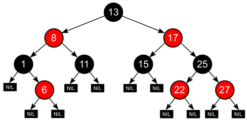
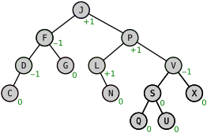
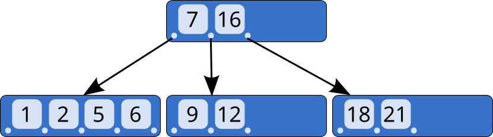
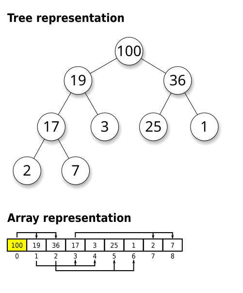
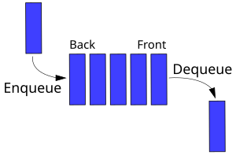
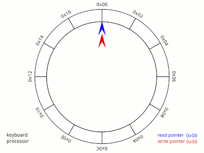
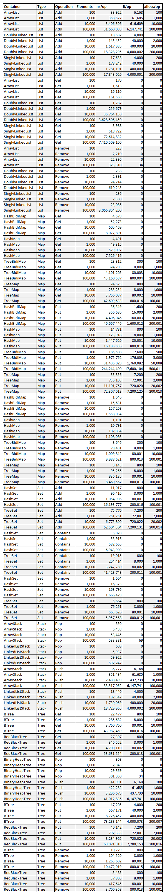

+++
title = "GoDS (Go Data Structures)"
date = 2024-12-07T11:00:08+08:00
weight = 1
type = "docs"
description = ""
isCJKLanguage = true
draft = false

+++

> 原文：[https://pkg.go.dev/github.com/emirpasic/gods/v2#section-readme](https://pkg.go.dev/github.com/emirpasic/gods/v2#section-readme)
>
> 收录该文档时间： `2024-12-07T11:00:08+08:00`


Implementation of various data structures and algorithms in Go.

​	在 Go 中实现各种数据结构和算法。

## Data Structures

## Containers

All data structures implement the container interface with the following methods:

​	所有数据结构都实现了具有以下方法的容器接口（container interface）：

``` go
type Container interface {
	Empty() bool
	Size() int
	Clear()
	Values() []interface{}
	String() string
}
```

Containers are either ordered or unordered. All ordered containers provide [stateful iterators](https://pkg.go.dev/github.com/emirpasic/gods/v2#readme-iterator) and some of them allow [enumerable functions](https://pkg.go.dev/github.com/emirpasic/gods/v2#readme-enumerable).

​	容器分为有序和无序两类。所有有序容器都提供[状态迭代器](https://pkg.go.dev/github.com/emirpasic/gods/v2#readme-iterator)，其中一些还支持[可枚举函数](https://pkg.go.dev/github.com/emirpasic/gods/v2#readme-enumerable)。

| **Data**                                                     | **Structure **结构                                           | **Ordered** 有序 | **[Iterator 迭代器](https://pkg.go.dev/github.com/emirpasic/gods/v2#readme-iterator)** | **[Enumerable 可枚举](https://pkg.go.dev/github.com/emirpasic/gods/v2#readme-enumerable)** | **Referenced by 引用方式** |
| ------------------------------------------------------------ | ------------------------------------------------------------ | ---------------- | ------------------------------------------------------------ | ------------------------------------------------------------ | -------------------------- |
| [Lists](https://pkg.go.dev/github.com/emirpasic/gods/v2#readme-lists) |                                                              |                  |                                                              |                                                              |                            |
|                                                              | [ArrayList](https://pkg.go.dev/github.com/emirpasic/gods/v2#readme-arraylist) | yes              | yes*                                                         | yes                                                          | index                      |
|                                                              | [SinglyLinkedList](https://pkg.go.dev/github.com/emirpasic/gods/v2#readme-singlylinkedlist) | yes              | yes                                                          | yes                                                          | index                      |
|                                                              | [DoublyLinkedList](https://pkg.go.dev/github.com/emirpasic/gods/v2#readme-doublylinkedlist) | yes              | yes*                                                         | yes                                                          | index                      |
| [Sets](https://pkg.go.dev/github.com/emirpasic/gods/v2#readme-sets) |                                                              |                  |                                                              |                                                              |                            |
|                                                              | [HashSet](https://pkg.go.dev/github.com/emirpasic/gods/v2#readme-hashset) | no               | no                                                           | no                                                           | index                      |
|                                                              | [TreeSet](https://pkg.go.dev/github.com/emirpasic/gods/v2#readme-treeset) | yes              | yes*                                                         | yes                                                          | index                      |
|                                                              | [LinkedHashSet](https://pkg.go.dev/github.com/emirpasic/gods/v2#readme-linkedhashset) | yes              | yes*                                                         | yes                                                          | index                      |
| [Stacks](https://pkg.go.dev/github.com/emirpasic/gods/v2#readme-stacks) |                                                              |                  |                                                              |                                                              |                            |
|                                                              | [LinkedListStack](https://pkg.go.dev/github.com/emirpasic/gods/v2#readme-linkedliststack) | yes              | yes                                                          | no                                                           | index                      |
|                                                              | [ArrayStack](https://pkg.go.dev/github.com/emirpasic/gods/v2#readme-arraystack) | yes              | yes*                                                         | no                                                           | index                      |
| [Maps](https://pkg.go.dev/github.com/emirpasic/gods/v2#readme-maps) |                                                              |                  |                                                              |                                                              |                            |
|                                                              | [HashMap](https://pkg.go.dev/github.com/emirpasic/gods/v2#readme-hashmap) | no               | no                                                           | no                                                           | key                        |
|                                                              | [TreeMap](https://pkg.go.dev/github.com/emirpasic/gods/v2#readme-treemap) | yes              | yes*                                                         | yes                                                          | key                        |
|                                                              | [LinkedHashMap](https://pkg.go.dev/github.com/emirpasic/gods/v2#readme-linkedhashmap) | yes              | yes*                                                         | yes                                                          | key                        |
|                                                              | [HashBidiMap](https://pkg.go.dev/github.com/emirpasic/gods/v2#readme-hashbidimap) | no               | no                                                           | no                                                           | key*                       |
|                                                              | [TreeBidiMap](https://pkg.go.dev/github.com/emirpasic/gods/v2#readme-treebidimap) | yes              | yes*                                                         | yes                                                          | key*                       |
| [Trees](https://pkg.go.dev/github.com/emirpasic/gods/v2#readme-trees) |                                                              |                  |                                                              |                                                              |                            |
|                                                              | [RedBlackTree](https://pkg.go.dev/github.com/emirpasic/gods/v2#readme-redblacktree) | yes              | yes*                                                         | no                                                           | key                        |
|                                                              | [AVLTree](https://pkg.go.dev/github.com/emirpasic/gods/v2#readme-avltree) | yes              | yes*                                                         | no                                                           | key                        |
|                                                              | [BTree](https://pkg.go.dev/github.com/emirpasic/gods/v2#readme-btree) | yes              | yes*                                                         | no                                                           | key                        |
|                                                              | [BinaryHeap](https://pkg.go.dev/github.com/emirpasic/gods/v2#readme-binaryheap) | yes              | yes*                                                         | no                                                           | index                      |
| [Queues](https://pkg.go.dev/github.com/emirpasic/gods/v2#readme-queues) |                                                              |                  |                                                              |                                                              |                            |
|                                                              | [LinkedListQueue](https://pkg.go.dev/github.com/emirpasic/gods/v2#readme-linkedlistqueue) | yes              | yes                                                          | no                                                           | index                      |
|                                                              | [ArrayQueue](https://pkg.go.dev/github.com/emirpasic/gods/v2#readme-arrayqueue) | yes              | yes*                                                         | no                                                           | index                      |
|                                                              | [CircularBuffer](https://pkg.go.dev/github.com/emirpasic/gods/v2#readme-circularbuffer) | yes              | yes*                                                         | no                                                           | index                      |
|                                                              | [PriorityQueue](https://pkg.go.dev/github.com/emirpasic/gods/v2#readme-priorityqueue) | yes              | yes*                                                         | no                                                           | index                      |
|                                                              |                                                              |                  | *reversible                                                  |                                                              | *bidirectional             |

### Lists

A list is a data structure that stores values and may have repeated values.

​	列表是一种存储值的数据结构，并且可以包含重复值。

Implements [Container](https://pkg.go.dev/github.com/emirpasic/gods/v2#readme-containers) interface.

​	实现了 [Container](https://pkg.go.dev/github.com/emirpasic/gods/v2#readme-containers) 接口。

``` go
type List interface {
	Get(index int) (interface{}, bool)
	Remove(index int)
	Add(values ...interface{})
	Contains(values ...interface{}) bool
	Sort(comparator utils.Comparator)
	Swap(index1, index2 int)
	Insert(index int, values ...interface{})
	Set(index int, value interface{})

	containers.Container
	// Empty() bool
	// Size() int
	// Clear()
	// Values() []interface{}
    // String() string
}
```

#### ArrayList

A [list](https://pkg.go.dev/github.com/emirpasic/gods/v2#readme-lists) backed by a dynamic array that grows and shrinks implicitly.

​	基于动态数组实现的[列表](https://pkg.go.dev/github.com/emirpasic/gods/v2#readme-lists)，可根据需要动态增长或缩小。

Implements [List](https://pkg.go.dev/github.com/emirpasic/gods/v2#readme-lists), [ReverseIteratorWithIndex](https://pkg.go.dev/github.com/emirpasic/gods/v2#readme-reverseiteratorwithindex), [EnumerableWithIndex](https://pkg.go.dev/github.com/emirpasic/gods/v2#readme-enumerablewithindex), [JSONSerializer](https://pkg.go.dev/github.com/emirpasic/gods/v2#readme-jsonserializer) and [JSONDeserializer](https://pkg.go.dev/github.com/emirpasic/gods/v2#readme-jsondeserializer) interfaces.

​	实现了 [List](https://pkg.go.dev/github.com/emirpasic/gods/v2#readme-lists)、[ReverseIteratorWithIndex](https://pkg.go.dev/github.com/emirpasic/gods/v2#readme-reverseiteratorwithindex)、[EnumerableWithIndex](https://pkg.go.dev/github.com/emirpasic/gods/v2#readme-enumerablewithindex)、[JSONSerializer](https://pkg.go.dev/github.com/emirpasic/gods/v2#readme-jsonserializer) 和 [JSONDeserializer](https://pkg.go.dev/github.com/emirpasic/gods/v2#readme-jsondeserializer) 接口。

``` go
package main

import (
	"github.com/emirpasic/gods/lists/arraylist"
	"github.com/emirpasic/gods/utils"
)

func main() {
	list := arraylist.New()
	list.Add("a")                         // ["a"]
	list.Add("c", "b")                    // ["a","c","b"]
	list.Sort(utils.StringComparator)     // ["a","b","c"]
	_, _ = list.Get(0)                    // "a",true
	_, _ = list.Get(100)                  // nil,false
	_ = list.Contains("a", "b", "c")      // true
	_ = list.Contains("a", "b", "c", "d") // false
	list.Swap(0, 1)                       // ["b","a",c"]
	list.Remove(2)                        // ["b","a"]
	list.Remove(1)                        // ["b"]
	list.Remove(0)                        // []
	list.Remove(0)                        // [] (ignored)
	_ = list.Empty()                      // true
	_ = list.Size()                       // 0
	list.Add("a")                         // ["a"]
	list.Clear()                          // []
	list.Insert(0, "b")                   // ["b"]
	list.Insert(0, "a")                   // ["a","b"]
}
```

#### SinglyLinkedList

A [list](https://pkg.go.dev/github.com/emirpasic/gods/v2#readme-lists) where each element points to the next element in the list.

​	基于单链表实现的[列表](https://pkg.go.dev/github.com/emirpasic/gods/v2#readme-lists)，每个元素指向链表中的下一个元素。

Implements [List](https://pkg.go.dev/github.com/emirpasic/gods/v2#readme-lists), [IteratorWithIndex](https://pkg.go.dev/github.com/emirpasic/gods/v2#readme-iteratorwithindex), [EnumerableWithIndex](https://pkg.go.dev/github.com/emirpasic/gods/v2#readme-enumerablewithindex), [JSONSerializer](https://pkg.go.dev/github.com/emirpasic/gods/v2#readme-jsonserializer) and [JSONDeserializer](https://pkg.go.dev/github.com/emirpasic/gods/v2#readme-jsondeserializer) interfaces.

​	实现了 [List](https://pkg.go.dev/github.com/emirpasic/gods/v2#readme-lists)、[IteratorWithIndex](https://pkg.go.dev/github.com/emirpasic/gods/v2#readme-iteratorwithindex)、[EnumerableWithIndex](https://pkg.go.dev/github.com/emirpasic/gods/v2#readme-enumerablewithindex)、[JSONSerializer](https://pkg.go.dev/github.com/emirpasic/gods/v2#readme-jsonserializer) 和 [JSONDeserializer](https://pkg.go.dev/github.com/emirpasic/gods/v2#readme-jsondeserializer) 接口

``` go
package main

import (
	sll "github.com/emirpasic/gods/lists/singlylinkedlist"
	"github.com/emirpasic/gods/utils"
)

func main() {
	list := sll.New()
	list.Add("a")                         // ["a"]
	list.Add("c", "b")                    // ["a","c","b"]
	list.Sort(utils.StringComparator)     // ["a","b","c"]
	_, _ = list.Get(0)                    // "a",true
	_, _ = list.Get(100)                  // nil,false
	_ = list.Contains("a", "b", "c")      // true
	_ = list.Contains("a", "b", "c", "d") // false
	list.Swap(0, 1)                       // ["b","a",c"]
	list.Remove(2)                        // ["b","a"]
	list.Remove(1)                        // ["b"]
	list.Remove(0)                        // []
	list.Remove(0)                        // [] (ignored)
	_ = list.Empty()                      // true
	_ = list.Size()                       // 0
	list.Add("a")                         // ["a"]
	list.Clear()                          // []
	list.Insert(0, "b")                   // ["b"]
	list.Insert(0, "a")                   // ["a","b"]
}
```

#### DoublyLinkedList

A [list](https://pkg.go.dev/github.com/emirpasic/gods/v2#readme-lists) where each element points to the next and previous elements in the list.

​	基于双链表实现的[列表](https://pkg.go.dev/github.com/emirpasic/gods/v2#readme-lists)，每个元素同时指向链表中的前一个和后一个元素。

Implements [List](https://pkg.go.dev/github.com/emirpasic/gods/v2#readme-lists), [ReverseIteratorWithIndex](https://pkg.go.dev/github.com/emirpasic/gods/v2#readme-reverseiteratorwithindex), [EnumerableWithIndex](https://pkg.go.dev/github.com/emirpasic/gods/v2#readme-enumerablewithindex), [JSONSerializer](https://pkg.go.dev/github.com/emirpasic/gods/v2#readme-jsonserializer) and [JSONDeserializer](https://pkg.go.dev/github.com/emirpasic/gods/v2#readme-jsondeserializer) interfaces.

​	实现了 [List](https://pkg.go.dev/github.com/emirpasic/gods/v2#readme-lists)、[ReverseIteratorWithIndex](https://pkg.go.dev/github.com/emirpasic/gods/v2#readme-reverseiteratorwithindex)、[EnumerableWithIndex](https://pkg.go.dev/github.com/emirpasic/gods/v2#readme-enumerablewithindex)、[JSONSerializer](https://pkg.go.dev/github.com/emirpasic/gods/v2#readme-jsonserializer) 和 [JSONDeserializer](https://pkg.go.dev/github.com/emirpasic/gods/v2#readme-jsondeserializer) 接口。

``` go
package main

import (
	dll "github.com/emirpasic/gods/lists/doublylinkedlist"
	"github.com/emirpasic/gods/utils"
)

func main() {
	list := dll.New()
	list.Add("a")                         // ["a"]
	list.Add("c", "b")                    // ["a","c","b"]
	list.Sort(utils.StringComparator)     // ["a","b","c"]
	_, _ = list.Get(0)                    // "a",true
	_, _ = list.Get(100)                  // nil,false
	_ = list.Contains("a", "b", "c")      // true
	_ = list.Contains("a", "b", "c", "d") // false
	list.Swap(0, 1)                       // ["b","a",c"]
	list.Remove(2)                        // ["b","a"]
	list.Remove(1)                        // ["b"]
	list.Remove(0)                        // []
	list.Remove(0)                        // [] (ignored)
	_ = list.Empty()                      // true
	_ = list.Size()                       // 0
	list.Add("a")                         // ["a"]
	list.Clear()                          // []
	list.Insert(0, "b")                   // ["b"]
	list.Insert(0, "a")                   // ["a","b"]
}
```

### Sets

A set is a data structure that can store elements and has no repeated values. It is a computer implementation of the mathematical concept of a finite set. Unlike most other collection types, rather than retrieving a specific element from a set, one typically tests an element for membership in a set. This structure is often used to ensure that no duplicates are present in a container.

​	**集合 (Set)** 是一种可以存储元素且没有重复值的数据结构。它是数学概念中有限集合的计算机实现。与大多数其他集合类型不同，集合并不是用于检索特定元素，而通常用于测试某个元素是否属于集合。此结构通常用于确保容器中没有重复的元素。

Set additionally allow set operations such as [intersection](https://en.wikipedia.org/wiki/Intersection_(set_theory)), [union](https://en.wikipedia.org/wiki/Union_(set_theory)), [difference](https://proofwiki.org/wiki/Definition:Set_Difference), etc.

​	集合还允许执行集合操作，例如[交集](https://en.wikipedia.org/wiki/Intersection_(set_theory))、[并集](https://en.wikipedia.org/wiki/Union_(set_theory))、[差集](https://proofwiki.org/wiki/Definition:Set_Difference)等。

Implements [Container](https://pkg.go.dev/github.com/emirpasic/gods/v2#readme-containers) interface.

​	实现了 [Container](https://pkg.go.dev/github.com/emirpasic/gods/v2#readme-containers) 接口。

``` go
type Set interface {
	Add(elements ...interface{})
	Remove(elements ...interface{})
	Contains(elements ...interface{}) bool
    // Intersection(another *Set) *Set
    // Union(another *Set) *Set
    // Difference(another *Set) *Set
	
	containers.Container
	// Empty() bool
	// Size() int
	// Clear()
	// Values() []interface{}
	// String() string
}
```

#### HashSet

A [set](https://pkg.go.dev/github.com/emirpasic/gods/v2#readme-sets) backed by a hash table (actually a Go's map). It makes no guarantees as to the iteration order of the set.

​	基于哈希表（实际上是 Go 的 map）实现的[集合](https://pkg.go.dev/github.com/emirpasic/gods/v2#readme-sets)。对集合的迭代顺序没有保证。

Implements [Set](https://pkg.go.dev/github.com/emirpasic/gods/v2#readme-sets), [JSONSerializer](https://pkg.go.dev/github.com/emirpasic/gods/v2#readme-jsonserializer) and [JSONDeserializer](https://pkg.go.dev/github.com/emirpasic/gods/v2#readme-jsondeserializer) interfaces.

​	实现了 [Set](https://pkg.go.dev/github.com/emirpasic/gods/v2#readme-sets)、[JSONSerializer](https://pkg.go.dev/github.com/emirpasic/gods/v2#readme-jsonserializer) 和 [JSONDeserializer](https://pkg.go.dev/github.com/emirpasic/gods/v2#readme-jsondeserializer) 接口。

``` go
package main

import "github.com/emirpasic/gods/sets/hashset"

func main() {
	set := hashset.New()   // empty
	set.Add(1)             // 1
	set.Add(2, 2, 3, 4, 5) // 3, 1, 2, 4, 5 (random order, duplicates ignored) （随机顺序，重复值被忽略）
	set.Remove(4)          // 5, 3, 2, 1 (random order) （随机顺序）
	set.Remove(2, 3)       // 1, 5 (random order) （随机顺序）
	set.Contains(1)        // true
	set.Contains(1, 5)     // true
	set.Contains(1, 6)     // false
	_ = set.Values()       // []int{5,1} (random order) （随机顺序）
	set.Clear()            // empty
	set.Empty()            // true
	set.Size()             // 0
}
```

#### TreeSet

A [set](https://pkg.go.dev/github.com/emirpasic/gods/v2#readme-sets) backed by a [red-black tree](https://pkg.go.dev/github.com/emirpasic/gods/v2#readme-redblacktree) to keep the elements ordered with respect to the [comparator](https://pkg.go.dev/github.com/emirpasic/gods/v2#readme-comparator).

​	基于[红黑树](https://pkg.go.dev/github.com/emirpasic/gods/v2#readme-redblacktree)实现的[集合](https://pkg.go.dev/github.com/emirpasic/gods/v2#readme-sets)，通过[比较器](https://pkg.go.dev/github.com/emirpasic/gods/v2#readme-comparator)保证元素有序。

Implements [Set](https://pkg.go.dev/github.com/emirpasic/gods/v2#readme-sets), [ReverseIteratorWithIndex](https://pkg.go.dev/github.com/emirpasic/gods/v2#readme-reverseiteratorwithindex), [EnumerableWithIndex](https://pkg.go.dev/github.com/emirpasic/gods/v2#readme-enumerablewithindex), [JSONSerializer](https://pkg.go.dev/github.com/emirpasic/gods/v2#readme-jsonserializer) and [JSONDeserializer](https://pkg.go.dev/github.com/emirpasic/gods/v2#readme-jsondeserializer) interfaces.

​	实现了 [Set](https://pkg.go.dev/github.com/emirpasic/gods/v2#readme-sets)、[ReverseIteratorWithIndex](https://pkg.go.dev/github.com/emirpasic/gods/v2#readme-reverseiteratorwithindex)、[EnumerableWithIndex](https://pkg.go.dev/github.com/emirpasic/gods/v2#readme-enumerablewithindex)、[JSONSerializer](https://pkg.go.dev/github.com/emirpasic/gods/v2#readme-jsonserializer) 和 [JSONDeserializer](https://pkg.go.dev/github.com/emirpasic/gods/v2#readme-jsondeserializer) 接口。

``` go
package main

import "github.com/emirpasic/gods/sets/treeset"

func main() {
	set := treeset.NewWithIntComparator() // empty (keys are of type int) （key为 int 类型）
	set.Add(1)                            // 1
	set.Add(2, 2, 3, 4, 5)                // 1, 2, 3, 4, 5 (in order, duplicates ignored) （有序，重复值被忽略）
	set.Remove(4)                         // 1, 2, 3, 5 (in order) （有序）
	set.Remove(2, 3)                      // 1, 5 (in order) （有序）
	set.Contains(1)                       // true
	set.Contains(1, 5)                    // true
	set.Contains(1, 6)                    // false
	_ = set.Values()                      // []int{1,5} (in order) （有序）
	set.Clear()                           // empty
	set.Empty()                           // true
	set.Size()                            // 0
}
```

#### LinkedHashSet

A [set](https://pkg.go.dev/github.com/emirpasic/gods/v2#readme-sets) that preserves insertion-order. Data structure is backed by a hash table to store values and [doubly-linked list](https://pkg.go.dev/github.com/emirpasic/gods/v2#readme-doublylinkedlist) to store insertion ordering.

​	基于[哈希表](https://pkg.go.dev/github.com/emirpasic/gods/v2#readme-sets)实现的[集合](https://pkg.go.dev/github.com/emirpasic/gods/v2#readme-sets)，同时通过[双向链表](https://pkg.go.dev/github.com/emirpasic/gods/v2#readme-doublylinkedlist)来维护插入顺序。

Implements [Set](https://pkg.go.dev/github.com/emirpasic/gods/v2#readme-sets), [ReverseIteratorWithIndex](https://pkg.go.dev/github.com/emirpasic/gods/v2#readme-reverseiteratorwithindex), [EnumerableWithIndex](https://pkg.go.dev/github.com/emirpasic/gods/v2#readme-enumerablewithindex), [JSONSerializer](https://pkg.go.dev/github.com/emirpasic/gods/v2#readme-jsonserializer) and [JSONDeserializer](https://pkg.go.dev/github.com/emirpasic/gods/v2#readme-jsondeserializer) interfaces.

​	实现了 Set、ReverseIteratorWithIndex、EnumerableWithIndex、JSONSerializer 和 JSONDeserializer接口。

``` go
package main

import "github.com/emirpasic/gods/sets/linkedhashset"

func main() {
	set := linkedhashset.New() // empty
	set.Add(5)                 // 5
	set.Add(4, 4, 3, 2, 1)     // 5, 4, 3, 2, 1 (in insertion-order, duplicates ignored) （按照插入顺序，重复值被忽略）
	set.Add(4)                 // 5, 4, 3, 2, 1 (duplicates ignored, insertion-order unchanged) （重复被忽略，插入顺序不变）
	set.Remove(4)              // 5, 3, 2, 1 (in insertion-order) （插入顺序）
	set.Remove(2, 3)           // 5, 1 (in insertion-order) （插入顺序）
	set.Contains(1)            // true
	set.Contains(1, 5)         // true
	set.Contains(1, 6)         // false
	_ = set.Values()           // []int{5, 1} (in insertion-order) （插入顺序）
	set.Clear()                // empty
	set.Empty()                // true
	set.Size()                 // 0
}
```

### Stacks

A stack that represents a last-in-first-out (LIFO) data structure. The usual push and pop operations are provided, as well as a method to peek at the top item on the stack.

​	栈是一种后进先出（LIFO）的数据结构。提供了标准的 push 和 pop 操作，以及用于查看栈顶元素的 peek 方法。

Implements [Container](https://pkg.go.dev/github.com/emirpasic/gods/v2#readme-containers) interface.

​	实现了Container（容器）接口。

``` go
type Stack interface {
	Push(value interface{})
	Pop() (value interface{}, ok bool)
	Peek() (value interface{}, ok bool)

	containers.Container
	// Empty() bool
	// Size() int
	// Clear()
	// Values() []interface{}
	// String() string
}
```

#### LinkedListStack

A [stack](https://pkg.go.dev/github.com/emirpasic/gods/v2#readme-stacks) based on a [linked list](https://pkg.go.dev/github.com/emirpasic/gods/v2#readme-singlylinkedlist).

​	基于[链表](https://pkg.go.dev/github.com/emirpasic/gods/v2#readme-singlylinkedlist)实现的[栈](https://pkg.go.dev/github.com/emirpasic/gods/v2#readme-stacks)。

Implements [Stack](https://pkg.go.dev/github.com/emirpasic/gods/v2#readme-stacks), [IteratorWithIndex](https://pkg.go.dev/github.com/emirpasic/gods/v2#readme-iteratorwithindex), [JSONSerializer](https://pkg.go.dev/github.com/emirpasic/gods/v2#readme-jsonserializer) and [JSONDeserializer](https://pkg.go.dev/github.com/emirpasic/gods/v2#readme-jsondeserializer) interfaces.

​	实现了 [Stack](https://pkg.go.dev/github.com/emirpasic/gods/v2#readme-stacks)、[IteratorWithIndex](https://pkg.go.dev/github.com/emirpasic/gods/v2#readme-iteratorwithindex)、[JSONSerializer](https://pkg.go.dev/github.com/emirpasic/gods/v2#readme-jsonserializer) 和 [JSONDeserializer](https://pkg.go.dev/github.com/emirpasic/gods/v2#readme-jsondeserializer) 接口。

``` go
package main

import lls "github.com/emirpasic/gods/stacks/linkedliststack"

func main() {
	stack := lls.New()  // empty
	stack.Push(1)       // 1
	stack.Push(2)       // 1, 2
	stack.Values()      // 2, 1 (LIFO order)
	_, _ = stack.Peek() // 2,true
	_, _ = stack.Pop()  // 2, true
	_, _ = stack.Pop()  // 1, true
	_, _ = stack.Pop()  // nil, false (nothing to pop)
	stack.Push(1)       // 1
	stack.Clear()       // empty
	stack.Empty()       // true
	stack.Size()        // 0
}
```

#### ArrayStack

A [stack](https://pkg.go.dev/github.com/emirpasic/gods/v2#readme-stacks) based on a [array list](https://pkg.go.dev/github.com/emirpasic/gods/v2#readme-arraylist).

​	基于[数组列表](https://pkg.go.dev/github.com/emirpasic/gods/v2#readme-arraylist)实现的[栈](https://pkg.go.dev/github.com/emirpasic/gods/v2#readme-stacks)。

Implements [Stack](https://pkg.go.dev/github.com/emirpasic/gods/v2#readme-stacks), [IteratorWithIndex](https://pkg.go.dev/github.com/emirpasic/gods/v2#readme-iteratorwithindex), [JSONSerializer](https://pkg.go.dev/github.com/emirpasic/gods/v2#readme-jsonserializer) and [JSONDeserializer](https://pkg.go.dev/github.com/emirpasic/gods/v2#readme-jsondeserializer) interfaces.

​	实现了 [Stack](https://pkg.go.dev/github.com/emirpasic/gods/v2#readme-stacks)、[IteratorWithIndex](https://pkg.go.dev/github.com/emirpasic/gods/v2#readme-iteratorwithindex)、[JSONSerializer](https://pkg.go.dev/github.com/emirpasic/gods/v2#readme-jsonserializer) 和 [JSONDeserializer](https://pkg.go.dev/github.com/emirpasic/gods/v2#readme-jsondeserializer) 接口。

``` go
package main

import "github.com/emirpasic/gods/stacks/arraystack"

func main() {
	stack := arraystack.New() // empty
	stack.Push(1)             // 1
	stack.Push(2)             // 1, 2
	stack.Values()            // 2, 1 (LIFO order)
	_, _ = stack.Peek()       // 2,true
	_, _ = stack.Pop()        // 2, true
	_, _ = stack.Pop()        // 1, true
	_, _ = stack.Pop()        // nil, false (nothing to pop) （无可弹出的元素）
	stack.Push(1)             // 1
	stack.Clear()             // empty
	stack.Empty()             // true
	stack.Size()              // 0
}
```

### Maps

A Map is a data structure that maps keys to values. A map cannot contain duplicate keys and each key can map to at most one value.

​	映射是一种数据结构，用于将键映射到值。映射中不能包含重复的键，每个键最多只能映射到一个值。

Implements [Container](https://pkg.go.dev/github.com/emirpasic/gods/v2#readme-containers) interface.

​	实现了 [Container](https://pkg.go.dev/github.com/emirpasic/gods/v2#readme-containers) 接口。

``` go
type Map interface {
	Put(key interface{}, value interface{})
	Get(key interface{}) (value interface{}, found bool)
	Remove(key interface{})
	Keys() []interface{}

	containers.Container
	// Empty() bool
	// Size() int
	// Clear()
	// Values() []interface{}
	// String() string
}
```

A BidiMap is an extension to the Map. A bidirectional map (BidiMap), also called a hash bag, is an associative data structure in which the key-value pairs form a one-to-one relation. This relation works in both directions by allow the value to also act as a key to key, e.g. a pair (a,b) thus provides a coupling between 'a' and 'b' so that 'b' can be found when 'a' is used as a key and 'a' can be found when 'b' is used as a key.

​	**双向映射 (BidiMap)** 是对映射 (Map) 的扩展。双向映射 (BidiMap)，也被称为哈希袋 (hash bag)，是一种关联数据结构，其中键值对形成一对一关系。这种关系支持双向操作，使得值也可以作为键来访问键。例如，一个键值对 `(a, b)` 提供了 'a' 和 'b' 之间的耦合，使得在使用 'a' 作为键时可以找到 'b'，而使用 'b' 作为键时也可以找到 'a'。

``` go
type BidiMap interface {
	GetKey(value interface{}) (key interface{}, found bool)

	Map
}
```

#### HashMap

A [map](https://pkg.go.dev/github.com/emirpasic/gods/v2#readme-maps) based on hash tables. Keys are unordered.

​	基于哈希表实现的[映射](https://pkg.go.dev/github.com/emirpasic/gods/v2#readme-maps)。键是无序的。

Implements [Map](https://pkg.go.dev/github.com/emirpasic/gods/v2#readme-maps), [JSONSerializer](https://pkg.go.dev/github.com/emirpasic/gods/v2#readme-jsonserializer) and [JSONDeserializer](https://pkg.go.dev/github.com/emirpasic/gods/v2#readme-jsondeserializer) interfaces.

​	实现了 [Map](https://pkg.go.dev/github.com/emirpasic/gods/v2#readme-maps)、[JSONSerializer](https://pkg.go.dev/github.com/emirpasic/gods/v2#readme-jsonserializer) 和 [JSONDeserializer](https://pkg.go.dev/github.com/emirpasic/gods/v2#readme-jsondeserializer) 接口。

``` go
package main

import "github.com/emirpasic/gods/maps/hashmap"

func main() {
	m := hashmap.New() // empty
	m.Put(1, "x")      // 1->x
	m.Put(2, "b")      // 2->b, 1->x (random order)
	m.Put(1, "a")      // 2->b, 1->a (random order)
	_, _ = m.Get(2)    // b, true
	_, _ = m.Get(3)    // nil, false
	_ = m.Values()     // []interface {}{"b", "a"} (random order)
	_ = m.Keys()       // []interface {}{1, 2} (random order)
	m.Remove(1)        // 2->b
	m.Clear()          // empty
	m.Empty()          // true
	m.Size()           // 0
}
```

#### TreeMap

A [map](https://pkg.go.dev/github.com/emirpasic/gods/v2#readme-maps) based on [red-black tree](https://pkg.go.dev/github.com/emirpasic/gods/v2#readme-redblacktree). Keys are ordered with respect to the [comparator](https://pkg.go.dev/github.com/emirpasic/gods/v2#readme-comparator).

​	基于[红黑树](https://pkg.go.dev/github.com/emirpasic/gods/v2#readme-redblacktree)实现的[映射](https://pkg.go.dev/github.com/emirpasic/gods/v2#readme-maps)。键按照[比较器](https://pkg.go.dev/github.com/emirpasic/gods/v2#readme-comparator)排序。

Implements [Map](https://pkg.go.dev/github.com/emirpasic/gods/v2#readme-maps), [ReverseIteratorWithIndex](https://pkg.go.dev/github.com/emirpasic/gods/v2#readme-reverseiteratorwithindex), [EnumerableWithKey](https://pkg.go.dev/github.com/emirpasic/gods/v2#readme-enumerablewithkey), [JSONSerializer](https://pkg.go.dev/github.com/emirpasic/gods/v2#readme-jsonserializer) and [JSONDeserializer](https://pkg.go.dev/github.com/emirpasic/gods/v2#readme-jsondeserializer) interfaces.

​	实现了 [Map](https://pkg.go.dev/github.com/emirpasic/gods/v2#readme-maps)、[ReverseIteratorWithIndex](https://pkg.go.dev/github.com/emirpasic/gods/v2#readme-reverseiteratorwithindex)、[EnumerableWithKey](https://pkg.go.dev/github.com/emirpasic/gods/v2#readme-enumerablewithkey)、[JSONSerializer](https://pkg.go.dev/github.com/emirpasic/gods/v2#readme-jsonserializer) 和 [JSONDeserializer](https://pkg.go.dev/github.com/emirpasic/gods/v2#readme-jsondeserializer) 接口。

``` go
package main

import "github.com/emirpasic/gods/maps/treemap"

func main() {
	m := treemap.NewWithIntComparator() // empty (keys are of type int)
	m.Put(1, "x")                       // 1->x
	m.Put(2, "b")                       // 1->x, 2->b (in order)
	m.Put(1, "a")                       // 1->a, 2->b (in order)
	_, _ = m.Get(2)                     // b, true
	_, _ = m.Get(3)                     // nil, false
	_ = m.Values()                      // []interface {}{"a", "b"} (in order)
	_ = m.Keys()                        // []interface {}{1, 2} (in order)
	m.Remove(1)                         // 2->b
	m.Clear()                           // empty
	m.Empty()                           // true
	m.Size()                            // 0

	// Other:
	m.Min() // Returns the minimum key and its value from map.
	m.Max() // Returns the maximum key and its value from map.
}
```

#### LinkedHashMap

A [map](https://pkg.go.dev/github.com/emirpasic/gods/v2#readme-maps) that preserves insertion-order. It is backed by a hash table to store values and [doubly-linked list](https://github.com/emirpasic/gods/blob/v2.0.0-alpha/doublylinkedlist) to store ordering.

​	一种保持插入顺序的[映射](https://pkg.go.dev/github.com/emirpasic/gods/v2#readme-maps)。底层使用哈希表存储值，并通过[双向链表](https://github.com/emirpasic/gods/blob/v2.0.0-alpha/doublylinkedlist)维护顺序。

Implements [Map](https://pkg.go.dev/github.com/emirpasic/gods/v2#readme-maps), [ReverseIteratorWithIndex](https://pkg.go.dev/github.com/emirpasic/gods/v2#readme-reverseiteratorwithindex), [EnumerableWithKey](https://pkg.go.dev/github.com/emirpasic/gods/v2#readme-enumerablewithkey), [JSONSerializer](https://pkg.go.dev/github.com/emirpasic/gods/v2#readme-jsonserializer) and [JSONDeserializer](https://pkg.go.dev/github.com/emirpasic/gods/v2#readme-jsondeserializer) interfaces.

​	实现了 [Map](https://pkg.go.dev/github.com/emirpasic/gods/v2#readme-maps)、[ReverseIteratorWithIndex](https://pkg.go.dev/github.com/emirpasic/gods/v2#readme-reverseiteratorwithindex)、[EnumerableWithKey](https://pkg.go.dev/github.com/emirpasic/gods/v2#readme-enumerablewithkey)、[JSONSerializer](https://pkg.go.dev/github.com/emirpasic/gods/v2#readme-jsonserializer) 和 [JSONDeserializer](https://pkg.go.dev/github.com/emirpasic/gods/v2#readme-jsondeserializer) 接口。

``` go
package main

import "github.com/emirpasic/gods/maps/linkedhashmap"

func main() {
	m := linkedhashmap.New() // empty (keys are of type int)
	m.Put(2, "b")            // 2->b
	m.Put(1, "x")            // 2->b, 1->x (insertion-order)
	m.Put(1, "a")            // 2->b, 1->a (insertion-order)
	_, _ = m.Get(2)          // b, true
	_, _ = m.Get(3)          // nil, false
	_ = m.Values()           // []interface {}{"b", "a"} (insertion-order)
	_ = m.Keys()             // []interface {}{2, 1} (insertion-order)
	m.Remove(1)              // 2->b
	m.Clear()                // empty
	m.Empty()                // true
	m.Size()                 // 0
}
```

#### HashBidiMap

A [map](https://pkg.go.dev/github.com/emirpasic/gods/v2#readme-maps) based on two hashmaps. Keys are unordered.

​	基于两个哈希表实现的[映射](https://pkg.go.dev/github.com/emirpasic/gods/v2#readme-maps)。键是无序的。

Implements [BidiMap](https://pkg.go.dev/github.com/emirpasic/gods/v2#readme-maps), [JSONSerializer](https://pkg.go.dev/github.com/emirpasic/gods/v2#readme-jsonserializer) and [JSONDeserializer](https://pkg.go.dev/github.com/emirpasic/gods/v2#readme-jsondeserializer) interfaces.

​	实现了 [BidiMap](https://pkg.go.dev/github.com/emirpasic/gods/v2#readme-maps)、[JSONSerializer](https://pkg.go.dev/github.com/emirpasic/gods/v2#readme-jsonserializer) 和 [JSONDeserializer](https://pkg.go.dev/github.com/emirpasic/gods/v2#readme-jsondeserializer) 接口。

``` go
package main

import "github.com/emirpasic/gods/maps/hashbidimap"

func main() {
	m := hashbidimap.New() // empty
	m.Put(1, "x")          // 1->x
	m.Put(3, "b")          // 1->x, 3->b (random order)
	m.Put(1, "a")          // 1->a, 3->b (random order)
	m.Put(2, "b")          // 1->a, 2->b (random order)
	_, _ = m.GetKey("a")   // 1, true
	_, _ = m.Get(2)        // b, true
	_, _ = m.Get(3)        // nil, false
	_ = m.Values()         // []interface {}{"a", "b"} (random order)
	_ = m.Keys()           // []interface {}{1, 2} (random order)
	m.Remove(1)            // 2->b
	m.Clear()              // empty
	m.Empty()              // true
	m.Size()               // 0
}
```

#### TreeBidiMap

A [map](https://pkg.go.dev/github.com/emirpasic/gods/v2#readme-maps) based on red-black tree. This map guarantees that the map will be in both ascending key and value order. Other than key and value ordering, the goal with this structure is to avoid duplication of elements (unlike in [HashBidiMap](https://pkg.go.dev/github.com/emirpasic/gods/v2#readme-hashbidimap)), which can be significant if contained elements are large.

​	基于红黑树实现的[双向映射](https://pkg.go.dev/github.com/emirpasic/gods/v2#readme-maps)。此映射保证键和值均按照升序排列。与 [HashBidiMap](https://pkg.go.dev/github.com/emirpasic/gods/v2#readme-hashbidimap) 不同，此数据结构的目标是避免元素重复，尤其是在存储大对象时显得重要。

Implements [BidiMap](https://pkg.go.dev/github.com/emirpasic/gods/v2#readme-maps), [ReverseIteratorWithIndex](https://pkg.go.dev/github.com/emirpasic/gods/v2#readme-reverseiteratorwithindex), [EnumerableWithKey](https://pkg.go.dev/github.com/emirpasic/gods/v2#readme-enumerablewithkey), [JSONSerializer](https://pkg.go.dev/github.com/emirpasic/gods/v2#readme-jsonserializer) and [JSONDeserializer](https://pkg.go.dev/github.com/emirpasic/gods/v2#readme-jsondeserializer) interfaces.

​	实现了 [BidiMap](https://pkg.go.dev/github.com/emirpasic/gods/v2#readme-maps)、[ReverseIteratorWithIndex](https://pkg.go.dev/github.com/emirpasic/gods/v2#readme-reverseiteratorwithindex)、[EnumerableWithKey](https://pkg.go.dev/github.com/emirpasic/gods/v2#readme-enumerablewithkey)、[JSONSerializer](https://pkg.go.dev/github.com/emirpasic/gods/v2#readme-jsonserializer) 和 [JSONDeserializer](https://pkg.go.dev/github.com/emirpasic/gods/v2#readme-jsondeserializer) 接口。

``` go
package main

import (
	"github.com/emirpasic/gods/maps/treebidimap"
	"github.com/emirpasic/gods/utils"
)

func main() {
	m := treebidimap.NewWith(utils.IntComparator, utils.StringComparator)
	m.Put(1, "x")        // 1->x
	m.Put(3, "b")        // 1->x, 3->b (ordered)
	m.Put(1, "a")        // 1->a, 3->b (ordered)
	m.Put(2, "b")        // 1->a, 2->b (ordered)
	_, _ = m.GetKey("a") // 1, true
	_, _ = m.Get(2)      // b, true
	_, _ = m.Get(3)      // nil, false
	_ = m.Values()       // []interface {}{"a", "b"} (ordered)
	_ = m.Keys()         // []interface {}{1, 2} (ordered)
	m.Remove(1)          // 2->b
	m.Clear()            // empty
	m.Empty()            // true
	m.Size()             // 0
}
```

### Trees

A tree is a widely used data data structure that simulates a hierarchical tree structure, with a root value and subtrees of children, represented as a set of linked nodes; thus no cyclic links.

​	树是一种广泛使用的数据结构，模拟了一个层次结构的树形结构，包含一个根节点和若干子树，由一组链接的节点组成；因此，树中不存在环。

Implements [Container](https://pkg.go.dev/github.com/emirpasic/gods/v2#readme-containers) interface.

​	实现了 [Container](https://pkg.go.dev/github.com/emirpasic/gods/v2#readme-containers) 接口。

``` go
type Tree interface {
	containers.Container
	// Empty() bool
	// Size() int
	// Clear()
	// Values() []interface{}
	// String() string
}
```

#### RedBlackTree

A red–black [tree](https://pkg.go.dev/github.com/emirpasic/gods/v2#readme-trees) is a binary search tree with an extra bit of data per node, its color, which can be either red or black. The extra bit of storage ensures an approximately balanced tree by constraining how nodes are colored from any path from the root to the leaf. Thus, it is a data structure which is a type of self-balancing binary search tree.

​	红黑树是一种[二叉搜索树](https://pkg.go.dev/github.com/emirpasic/gods/v2#readme-trees)，每个节点存储额外的一个位表示颜色（红或黑）。这种额外的信息通过约束从根节点到叶子节点的路径上节点的颜色分布来保证树的平衡。红黑树是一种自平衡的二叉搜索树。

The balancing of the tree is not perfect but it is good enough to allow it to guarantee searching in O(log n) time, where n is the total number of elements in the tree. The insertion and deletion operations, along with the tree rearrangement and recoloring, are also performed in O(log n) time. [Wikipedia](http://en.wikipedia.org/wiki/Red–black_tree)

​	虽然红黑树的平衡性不是完美的，但它足够保证搜索操作的时间复杂度为 O(log n)，其中 n 是树中元素的总数。插入和删除操作（包括重新排列和重新着色）也都在 O(log n) 时间内完成。 [维基百科](http://en.wikipedia.org/wiki/Red–black_tree)

实现了 [Tree](https://pkg.go.dev/github.com/emirpasic/gods/v2#readme-trees)、[ReverseIteratorWithKey](https://pkg.go.dev/github.com/emirpasic/gods/v2#readme-reverseiteratorwithkey)、[JSONSerializer](https://pkg.go.dev/github.com/emirpasic/gods/v2#readme-jsonserializer) 和 [JSONDeserializer](https://pkg.go.dev/github.com/emirpasic/gods/v2#readme-jsondeserializer) 接口。

Implements [Tree](https://pkg.go.dev/github.com/emirpasic/gods/v2#readme-trees), [ReverseIteratorWithKey](https://pkg.go.dev/github.com/emirpasic/gods/v2#readme-reverseiteratorwithkey), [JSONSerializer](https://pkg.go.dev/github.com/emirpasic/gods/v2#readme-jsonserializer) and [JSONDeserializer](https://pkg.go.dev/github.com/emirpasic/gods/v2#readme-jsondeserializer) interfaces.



``` go
package main

import (
	"fmt"
	rbt "github.com/emirpasic/gods/trees/redblacktree"
)

func main() {
	tree := rbt.NewWithIntComparator() // empty (keys are of type int)

	tree.Put(1, "x") // 1->x
	tree.Put(2, "b") // 1->x, 2->b (in order)  (按顺序)
	tree.Put(1, "a") // 1->a, 2->b (in order, replacement)  (按顺序，替换)
	tree.Put(3, "c") // 1->a, 2->b, 3->c (in order)
	tree.Put(4, "d") // 1->a, 2->b, 3->c, 4->d (in order)
	tree.Put(5, "e") // 1->a, 2->b, 3->c, 4->d, 5->e (in order)
	tree.Put(6, "f") // 1->a, 2->b, 3->c, 4->d, 5->e, 6->f (in order)

	fmt.Println(tree)
	//
	//  RedBlackTree
	//  │           ┌── 6
	//	│       ┌── 5
	//	│   ┌── 4
	//	│   │   └── 3
	//	└── 2
	//		└── 1

	_ = tree.Values() // []interface {}{"a", "b", "c", "d", "e", "f"} (in order)
	_ = tree.Keys()   // []interface {}{1, 2, 3, 4, 5, 6} (in order)

	tree.Remove(2) // 1->a, 3->c, 4->d, 5->e, 6->f (in order)
	fmt.Println(tree)
	//
	//  RedBlackTree
	//  │       ┌── 6
	//  │   ┌── 5
	//  └── 4
	//      │   ┌── 3
	//      └── 1

	tree.Clear() // empty
	tree.Empty() // true
	tree.Size()  // 0

	// Other:
	tree.Left() // gets the left-most (min) node 获取最左（最小）节点
	tree.Right() // get the right-most (max) node 获取最右（最大）节点
	tree.Floor(1) // get the floor node 获取小于或等于指定键的最大键节点
	tree.Ceiling(1) // get the ceiling node 获取大于或等于指定键的最小键节点
}
```

Extending the red-black tree's functionality has been demonstrated in the following [example](https://github.com/emirpasic/gods/raw/master/examples/redblacktreeextended/redblacktreeextended.go).

#### AVLTree

AVL [tree](https://pkg.go.dev/github.com/emirpasic/gods/v2#readme-trees) is a self-balancing binary search tree. In an AVL tree, the heights of the two child subtrees of any node differ by at most one; if at any time they differ by more than one, rebalancing is done to restore this property. Lookup, insertion, and deletion all take O(log n) time in both the average and worst cases, where n is the number of nodes in the tree prior to the operation. Insertions and deletions may require the tree to be rebalanced by one or more tree rotations.

​	AVL 树是一种[自平衡二叉搜索树](https://pkg.go.dev/github.com/emirpasic/gods/v2#readme-trees)。在 AVL 树中，任意节点的两个子树的高度差最多为 1；如果某一时刻高度差超过 1，将进行重新平衡以恢复此特性。查找、插入和删除操作在平均和最坏情况下的时间复杂度均为 O(log n)，其中 n 是操作前的节点数。插入和删除可能需要通过一次或多次树旋转来重新平衡。

AVL trees are often compared with red–black trees because both support the same set of operations and take O(log n) time for the basic operations. For lookup-intensive applications, AVL trees are faster than red–black trees because they are more strictly balanced. [Wikipedia](https://en.wikipedia.org/wiki/AVL_tree)

​	AVL 树通常与红黑树比较，因为两者支持相同的操作集，且基本操作的时间复杂度均为 O(log n)。对于查找密集型应用，AVL 树由于更严格的平衡性，比红黑树更快。[维基百科](https://en.wikipedia.org/wiki/AVL_tree)

Implements [Tree](https://pkg.go.dev/github.com/emirpasic/gods/v2#readme-trees), [ReverseIteratorWithKey](https://pkg.go.dev/github.com/emirpasic/gods/v2#readme-reverseiteratorwithkey), [JSONSerializer](https://pkg.go.dev/github.com/emirpasic/gods/v2#readme-jsonserializer) and [JSONDeserializer](https://pkg.go.dev/github.com/emirpasic/gods/v2#readme-jsondeserializer) interfaces.

​	实现了 [Tree](https://pkg.go.dev/github.com/emirpasic/gods/v2#readme-trees)、[ReverseIteratorWithKey](https://pkg.go.dev/github.com/emirpasic/gods/v2#readme-reverseiteratorwithkey)、[JSONSerializer](https://pkg.go.dev/github.com/emirpasic/gods/v2#readme-jsonserializer) 和 [JSONDeserializer](https://pkg.go.dev/github.com/emirpasic/gods/v2#readme-jsondeserializer) 接口。


AVL tree with balance factors (green)

​	绿色部分为 AVL 树的平衡因子

``` go
package main

import (
	"fmt"
	avl "github.com/emirpasic/gods/trees/avltree"
)

func main() {
	tree := avl.NewWithIntComparator() // empty(keys are of type int)

	tree.Put(1, "x") // 1->x
	tree.Put(2, "b") // 1->x, 2->b (in order)
	tree.Put(1, "a") // 1->a, 2->b (in order, replacement)
	tree.Put(3, "c") // 1->a, 2->b, 3->c (in order)
	tree.Put(4, "d") // 1->a, 2->b, 3->c, 4->d (in order)
	tree.Put(5, "e") // 1->a, 2->b, 3->c, 4->d, 5->e (in order)
	tree.Put(6, "f") // 1->a, 2->b, 3->c, 4->d, 5->e, 6->f (in order)

	fmt.Println(tree)
	//
	//  AVLTree
	//  │       ┌── 6
	//  │   ┌── 5
	//  └── 4
	//      │   ┌── 3
	//      └── 2
	//          └── 1


	_ = tree.Values() // []interface {}{"a", "b", "c", "d", "e", "f"} (in order)
	_ = tree.Keys()   // []interface {}{1, 2, 3, 4, 5, 6} (in order)

	tree.Remove(2) // 1->a, 3->c, 4->d, 5->e, 6->f (in order)
	fmt.Println(tree)
	//
	//  AVLTree
	//  │       ┌── 6
	//  │   ┌── 5
	//  └── 4
	//      └── 3
	//          └── 1

	tree.Clear() // empty
	tree.Empty() // true
	tree.Size()  // 0
}
```

#### BTree

B-tree is a self-balancing tree data structure that keeps data sorted and allows searches, sequential access, insertions, and deletions in logarithmic time. The B-tree is a generalization of a binary search tree in that a node can have more than two children.

​	B 树是一种自平衡树数据结构，用于保持数据有序，同时允许搜索、顺序访问、插入和删除操作在对数时间内完成。B 树是二叉搜索树的一种推广形式，节点可以有两个以上的子节点。

According to Knuth's definition, a B-tree of order m is a tree which satisfies the following properties:

​	根据 Knuth 的定义，阶为 m 的 B 树满足以下特性：

- Every node has at most m children.
  - 每个节点最多有 m 个子节点。

- Every non-leaf node (except root) has at least ⌈m/2⌉ children.
  - 除根节点外，每个非叶子节点至少有 ⌈m/2⌉ 个子节点。

- The root has at least two children if it is not a leaf node.
  - 如果根节点不是叶子节点，则至少有两个子节点。

- A non-leaf node with k children contains k−1 keys.
  - 一个非叶子节点包含的键的数量比其子节点多一个。

- All leaves appear in the same level
  - 所有叶子节点在同一层级。


Each internal node’s keys act as separation values which divide its subtrees. For example, if an internal node has 3 child nodes (or subtrees) then it must have 2 keys: a1 and a2. All values in the leftmost subtree will be less than a1, all values in the middle subtree will be between a1 and a2, and all values in the rightmost subtree will be greater than a2.[Wikipedia](http://en.wikipedia.org/wiki/Red–black_tree)

​	每个内部节点的键用作分隔值，用以划分其子树。例如，如果一个内部节点有 3 个子节点，则必须有 2 个键：a1 和 a2。左子树中的所有值小于 a1，中间子树中的所有值在 a1 和 a2 之间，右子树中的所有值大于 a2。[维基百科](http://en.wikipedia.org/wiki/B-tree)

Implements [Tree](https://pkg.go.dev/github.com/emirpasic/gods/v2#readme-trees), [ReverseIteratorWithKey](https://pkg.go.dev/github.com/emirpasic/gods/v2#readme-reverseiteratorwithkey), [JSONSerializer](https://pkg.go.dev/github.com/emirpasic/gods/v2#readme-jsonserializer) and [JSONDeserializer](https://pkg.go.dev/github.com/emirpasic/gods/v2#readme-jsondeserializer) interfaces.

​	实现了 [Tree](https://pkg.go.dev/github.com/emirpasic/gods/v2#readme-trees)、[ReverseIteratorWithKey](https://pkg.go.dev/github.com/emirpasic/gods/v2#readme-reverseiteratorwithkey)、[JSONSerializer](https://pkg.go.dev/github.com/emirpasic/gods/v2#readme-jsonserializer) 和 [JSONDeserializer](https://pkg.go.dev/github.com/emirpasic/gods/v2#readme-jsondeserializer) 接口。



``` go
package main

import (
	"fmt"
	"github.com/emirpasic/gods/trees/btree"
)

func main() {
	tree := btree.NewWithIntComparator(3) // empty (keys are of type int)

	tree.Put(1, "x") // 1->x
	tree.Put(2, "b") // 1->x, 2->b (in order)
	tree.Put(1, "a") // 1->a, 2->b (in order, replacement)
	tree.Put(3, "c") // 1->a, 2->b, 3->c (in order)
	tree.Put(4, "d") // 1->a, 2->b, 3->c, 4->d (in order)
	tree.Put(5, "e") // 1->a, 2->b, 3->c, 4->d, 5->e (in order)
	tree.Put(6, "f") // 1->a, 2->b, 3->c, 4->d, 5->e, 6->f (in order)
	tree.Put(7, "g") // 1->a, 2->b, 3->c, 4->d, 5->e, 6->f, 7->g (in order)

	fmt.Println(tree)
	// BTree
	//         1
	//     2
	//         3
	// 4
	//         5
	//     6
	//         7

	_ = tree.Values() // []interface {}{"a", "b", "c", "d", "e", "f", "g"} (in order)
	_ = tree.Keys()   // []interface {}{1, 2, 3, 4, 5, 6, 7} (in order)

	tree.Remove(2) // 1->a, 3->c, 4->d, 5->e, 6->f, 7->g (in order)
	fmt.Println(tree)
	// BTree
	//     1
	//     3
	// 4
	//     5
	// 6
	//     7

	tree.Clear() // empty
	tree.Empty() // true
	tree.Size()  // 0

	// Other:
	tree.Height() // gets the height of the tree
	tree.Left() // gets the left-most (min) node
	tree.LeftKey() // get the left-most (min) node's key
	tree.LeftValue() // get the left-most (min) node's value
	tree.Right() // get the right-most (max) node
	tree.RightKey() // get the right-most (max) node's key
	tree.RightValue() // get the right-most (max) node's value
}
```

#### BinaryHeap

A binary heap is a [tree](https://pkg.go.dev/github.com/emirpasic/gods/v2#readme-trees) created using a binary tree. It can be seen as a binary tree with two additional constraints:

​	二叉堆是一种基于[二叉树](https://pkg.go.dev/github.com/emirpasic/gods/v2#readme-trees)的数据结构。它可以被看作是一种具有以下两个附加约束的二叉树：

- Shape property: **形状性质**：

  A binary heap is a complete binary tree; that is, all levels of the tree, except possibly the last one (deepest) are fully filled, and, if the last level of the tree is not complete, the nodes of that level are filled from left to right.

  ​	二叉堆是一棵完全二叉树；也就是说，除最后一层（最深层）外，所有层都被完全填充，如果最后一层不完整，则从左到右填充节点。

- Heap property: **堆性质**：

  All nodes are either greater than or equal to or less than or equal to each of its children, according to a comparison predicate defined for the heap. [Wikipedia](http://en.wikipedia.org/wiki/Binary_heap)
  
  ​	根据堆的定义，所有节点的值要么大于等于其子节点（最大堆），要么小于等于其子节点（最小堆）。[维基百科](http://en.wikipedia.org/wiki/Binary_heap)

Implements [Tree](https://pkg.go.dev/github.com/emirpasic/gods/v2#readme-trees), [ReverseIteratorWithIndex](https://pkg.go.dev/github.com/emirpasic/gods/v2#readme-reverseiteratorwithindex), [JSONSerializer](https://pkg.go.dev/github.com/emirpasic/gods/v2#readme-jsonserializer) and [JSONDeserializer](https://pkg.go.dev/github.com/emirpasic/gods/v2#readme-jsondeserializer) interfaces.

​	实现了 [Tree](https://pkg.go.dev/github.com/emirpasic/gods/v2#readme-trees)、[ReverseIteratorWithIndex](https://pkg.go.dev/github.com/emirpasic/gods/v2#readme-reverseiteratorwithindex)、[JSONSerializer](https://pkg.go.dev/github.com/emirpasic/gods/v2#readme-jsonserializer) 和 [JSONDeserializer](https://pkg.go.dev/github.com/emirpasic/gods/v2#readme-jsondeserializer) 接口。



``` go
package main

import (
	"github.com/emirpasic/gods/trees/binaryheap"
	"github.com/emirpasic/gods/utils"
)

func main() {

	// Min-heap
	heap := binaryheap.NewWithIntComparator() // empty (min-heap)
	heap.Push(2)                              // 2
	heap.Push(3)                              // 2, 3
	heap.Push(1)                              // 1, 3, 2
	heap.Values()                             // 1, 3, 2
	_, _ = heap.Peek()                        // 1,true
	_, _ = heap.Pop()                         // 1, true
	_, _ = heap.Pop()                         // 2, true
	_, _ = heap.Pop()                         // 3, true
	_, _ = heap.Pop()                         // nil, false (nothing to pop)
	heap.Push(1)                              // 1
	heap.Clear()                              // empty
	heap.Empty()                              // true
	heap.Size()                               // 0

	// Max-heap
	inverseIntComparator := func(a, b interface{}) int {
		return -utils.IntComparator(a, b)
	}
	heap = binaryheap.NewWith(inverseIntComparator) // empty (min-heap)
	heap.Push(2, 3, 1)                              // 3, 2, 1 (bulk optimized)
	heap.Values()                                   // 3, 2, 1
}
```

### Queues

A queue that represents a first-in-first-out (FIFO) data structure. The usual enqueue and dequeue operations are provided, as well as a method to peek at the first item in the queue.

​	队列是一种先进先出 (FIFO) 的数据结构。队列提供了标准的 `enqueue`（入队）和 `dequeue`（出队）操作，同时支持检查队列首元素的方法。



Implements [Container](https://pkg.go.dev/github.com/emirpasic/gods/v2#readme-containers) interface.

​	实现了 [Container](https://pkg.go.dev/github.com/emirpasic/gods/v2#readme-containers) 接口。

``` go
type Queue interface {
	Enqueue(value interface{})
	Dequeue() (value interface{}, ok bool)
	Peek() (value interface{}, ok bool)

	containers.Container
	// Empty() bool
	// Size() int
	// Clear()
	// Values() []interface{}
	// String() string
}
```

#### LinkedListQueue

A [queue](https://pkg.go.dev/github.com/emirpasic/gods/v2#readme-queues) based on a [linked list](https://pkg.go.dev/github.com/emirpasic/gods/v2#readme-singlylinkedlist).

​	基于[链表](https://pkg.go.dev/github.com/emirpasic/gods/v2#readme-singlylinkedlist)实现的[队列](https://pkg.go.dev/github.com/emirpasic/gods/v2#readme-queues)。

Implements [Queue](https://pkg.go.dev/github.com/emirpasic/gods/v2#readme-queues), [IteratorWithIndex](https://pkg.go.dev/github.com/emirpasic/gods/v2#readme-iteratorwithindex), [JSONSerializer](https://pkg.go.dev/github.com/emirpasic/gods/v2#readme-jsonserializer) and [JSONDeserializer](https://pkg.go.dev/github.com/emirpasic/gods/v2#readme-jsondeserializer) interfaces.

​	实现了 [Queue](https://pkg.go.dev/github.com/emirpasic/gods/v2#readme-queues)、[IteratorWithIndex](https://pkg.go.dev/github.com/emirpasic/gods/v2#readme-iteratorwithindex)、[JSONSerializer](https://pkg.go.dev/github.com/emirpasic/gods/v2#readme-jsonserializer) 和 [JSONDeserializer](https://pkg.go.dev/github.com/emirpasic/gods/v2#readme-jsondeserializer) 接口。

``` go
package main

import llq "github.com/emirpasic/gods/queues/linkedlistqueue"

// LinkedListQueueExample to demonstrate basic usage of LinkedListQueue
// LinkedListQueueExample 展示 LinkedListQueue 的基本使用方法
func main() {
    queue := llq.New()     // empty
    queue.Enqueue(1)       // 1
    queue.Enqueue(2)       // 1, 2
    _ = queue.Values()     // 1, 2 (FIFO order)
    _, _ = queue.Peek()    // 1,true
    _, _ = queue.Dequeue() // 1, true
    _, _ = queue.Dequeue() // 2, true
    _, _ = queue.Dequeue() // nil, false (nothing to deque)
    queue.Enqueue(1)       // 1
    queue.Clear()          // empty
    queue.Empty()          // true
    _ = queue.Size()       // 0
}
```

#### ArrayQueue

A [queue](https://pkg.go.dev/github.com/emirpasic/gods/v2#readme-queues) based on a [array list](https://pkg.go.dev/github.com/emirpasic/gods/v2#readme-arraylist).

​	基于[数组列表](https://pkg.go.dev/github.com/emirpasic/gods/v2#readme-arraylist)实现的[队列](https://pkg.go.dev/github.com/emirpasic/gods/v2#readme-queues)。

Implements [Queue](https://pkg.go.dev/github.com/emirpasic/gods/v2#readme-queues), [ReverseIteratorWithIndex](https://pkg.go.dev/github.com/emirpasic/gods/v2#readme-iteratorwithindex), [JSONSerializer](https://pkg.go.dev/github.com/emirpasic/gods/v2#readme-jsonserializer) and [JSONDeserializer](https://pkg.go.dev/github.com/emirpasic/gods/v2#readme-jsondeserializer) interfaces.

​	实现了 [Queue](https://pkg.go.dev/github.com/emirpasic/gods/v2#readme-queues)、[ReverseIteratorWithIndex](https://pkg.go.dev/github.com/emirpasic/gods/v2#readme-iteratorwithindex)、[JSONSerializer](https://pkg.go.dev/github.com/emirpasic/gods/v2#readme-jsonserializer) 和 [JSONDeserializer](https://pkg.go.dev/github.com/emirpasic/gods/v2#readme-jsondeserializer) 接口。

``` go
package main

import aq "github.com/emirpasic/gods/queues/arrayqueue"

// ArrayQueueExample to demonstrate basic usage of ArrayQueue
// ArrayQueueExample 展示 ArrayQueue 的基本使用方法
func main() {
    queue := aq.New()      // empty
    queue.Enqueue(1)       // 1
    queue.Enqueue(2)       // 1, 2
    _ = queue.Values()     // 1, 2 (FIFO order)
    _, _ = queue.Peek()    // 1,true
    _, _ = queue.Dequeue() // 1, true
    _, _ = queue.Dequeue() // 2, true
    _, _ = queue.Dequeue() // nil, false (nothing to deque)
    queue.Enqueue(1)       // 1
    queue.Clear()          // empty
    queue.Empty()          // true
    _ = queue.Size()       // 0
}
```

#### CircularBuffer

A circular buffer, circular [queue](https://pkg.go.dev/github.com/emirpasic/gods/v2#readme-queues), cyclic buffer or ring buffer is a data structure that uses a single, fixed-size buffer as if it were connected end-to-end. This structure lends itself easily to buffering data streams.

​	循环缓冲区（Circular Buffer），也称为[循环队列](https://pkg.go.dev/github.com/emirpasic/gods/v2#readme-queues)、环形缓冲区或环形队列，是一种数据结构，它使用单个固定大小的缓冲区，模拟首尾相连的效果。这种结构非常适合数据流的缓冲。



Implements [Queue](https://pkg.go.dev/github.com/emirpasic/gods/v2#readme-queues), [ReverseIteratorWithIndex](https://pkg.go.dev/github.com/emirpasic/gods/v2#readme-iteratorwithindex), [JSONSerializer](https://pkg.go.dev/github.com/emirpasic/gods/v2#readme-jsonserializer) and [JSONDeserializer](https://pkg.go.dev/github.com/emirpasic/gods/v2#readme-jsondeserializer) interfaces.

​	实现了 [Queue](https://pkg.go.dev/github.com/emirpasic/gods/v2#readme-queues)、[ReverseIteratorWithIndex](https://pkg.go.dev/github.com/emirpasic/gods/v2#readme-iteratorwithindex)、[JSONSerializer](https://pkg.go.dev/github.com/emirpasic/gods/v2#readme-jsonserializer) 和 [JSONDeserializer](https://pkg.go.dev/github.com/emirpasic/gods/v2#readme-jsondeserializer) 接口。

``` go
package main

import cb "github.com/emirpasic/gods/queues/circularbuffer"

// CircularBufferExample to demonstrate basic usage of CircularBuffer
// CircularBufferExample 展示 CircularBuffer 的基本使用方法
func main() {
    queue := cb.New(3)     // empty (max size is 3)
    queue.Enqueue(1)       // 1
    queue.Enqueue(2)       // 1, 2
    queue.Enqueue(3)       // 1, 2, 3
    _ = queue.Values()     // 1, 2, 3
    queue.Enqueue(3)       // 4, 2, 3
    _, _ = queue.Peek()    // 4,true
    _, _ = queue.Dequeue() // 4, true
    _, _ = queue.Dequeue() // 2, true
    _, _ = queue.Dequeue() // 3, true
    _, _ = queue.Dequeue() // nil, false (nothing to deque)  (无可出队元素)
    queue.Enqueue(1)       // 1
    queue.Clear()          // empty
    queue.Empty()          // true
    _ = queue.Size()       // 0
}
```

#### PriorityQueue

A priority queue is a special type of [queue](https://pkg.go.dev/github.com/emirpasic/gods/v2#readme-queues) in which each element is associated with a priority value. And, elements are served on the basis of their priority. That is, higher priority elements are served first. However, if elements with the same priority occur, they are served according to their order in the queue.

​	优先队列是一种特殊的[队列](https://pkg.go.dev/github.com/emirpasic/gods/v2#readme-queues)，其中每个元素都关联一个优先级值，元素按照优先级服务。也就是说，优先级较高的元素会先被处理。如果出现优先级相同的元素，则按照其在队列中的顺序处理。

Implements [Queue](https://pkg.go.dev/github.com/emirpasic/gods/v2#readme-queues), [ReverseIteratorWithIndex](https://pkg.go.dev/github.com/emirpasic/gods/v2#readme-iteratorwithindex), [JSONSerializer](https://pkg.go.dev/github.com/emirpasic/gods/v2#readme-jsonserializer) and [JSONDeserializer](https://pkg.go.dev/github.com/emirpasic/gods/v2#readme-jsondeserializer) interfaces.

​	实现了 [Queue](https://pkg.go.dev/github.com/emirpasic/gods/v2#readme-queues)、[ReverseIteratorWithIndex](https://pkg.go.dev/github.com/emirpasic/gods/v2#readme-iteratorwithindex)、[JSONSerializer](https://pkg.go.dev/github.com/emirpasic/gods/v2#readme-jsonserializer) 和 [JSONDeserializer](https://pkg.go.dev/github.com/emirpasic/gods/v2#readme-jsondeserializer) 接口。

``` go
package main

import (
  pq "github.com/emirpasic/gods/queues/priorityqueue"
  "github.com/emirpasic/gods/utils"
)

// Element is an entry in the priority queue
// Element 是优先队列中的一个元素
type Element struct {
    name     string
    priority int
}

// Comparator function (sort by element's priority value in descending order)
// 自定义比较器函数（根据优先级降序排序）
func byPriority(a, b interface{}) int {
    priorityA := a.(Element).priority
    priorityB := b.(Element).priority
    return -utils.IntComparator(priorityA, priorityB) // "-" descending order 降序排序
}

// PriorityQueueExample to demonstrate basic usage of BinaryHeap
// PriorityQueueExample 展示 BinaryHeap 的基本使用方法
func main() {
    a := Element{name: "a", priority: 1}
    b := Element{name: "b", priority: 2}
    c := Element{name: "c", priority: 3}
    
    queue := pq.NewWith(byPriority) // empty
    queue.Enqueue(a)                // {a 1}
    queue.Enqueue(c)                // {c 3}, {a 1}
    queue.Enqueue(b)                // {c 3}, {b 2}, {a 1}
    _ = queue.Values()              // [{c 3} {b 2} {a 1}]
    _, _ = queue.Peek()             // {c 3} true
    _, _ = queue.Dequeue()          // {c 3} true
    _, _ = queue.Dequeue()          // {b 2} true
    _, _ = queue.Dequeue()          // {a 1} true
    _, _ = queue.Dequeue()          // <nil> false (nothing to dequeue) (无可出队元素)
    queue.Clear()                   // empty
    _ = queue.Empty()               // true
    _ = queue.Size()                // 0
}
```

## Functions

Various helper functions used throughout the library.

​	库中使用的各种辅助函数。

### Comparator

Some data structures (e.g. TreeMap, TreeSet) require a comparator function to automatically keep their elements sorted upon insertion. This comparator is necessary during the initalization.

​	一些数据结构（例如 TreeMap、TreeSet）需要比较器函数在插入时自动保持其元素的排序。在初始化时需要提供该比较器。

Comparator is defined as:

​	比较器定义如下：

Return values (int):

​	返回值 (int):

```
negative , if a < b
zero     , if a == b
positive , if a > b
```

Comparator signature:

​	比较器的函数签名如下：

``` go
type Comparator func(a, b interface{}) int
```

All common comparators for builtin types are included in the library:

​	库中包含了所有常见的内置类型的比较器：

``` go
func StringComparator(a, b interface{}) int

func IntComparator(a, b interface{}) int

func Int8Comparator(a, b interface{}) int

func Int16Comparator(a, b interface{}) int

func Int32Comparator(a, b interface{}) int

func Int64Comparator(a, b interface{}) int

func UIntComparator(a, b interface{}) int

func UInt8Comparator(a, b interface{}) int

func UInt16Comparator(a, b interface{}) int

func UInt32Comparator(a, b interface{}) int

func UInt64Comparator(a, b interface{}) int

func Float32Comparator(a, b interface{}) int

func Float64Comparator(a, b interface{}) int

func ByteComparator(a, b interface{}) int

func RuneComparator(a, b interface{}) int

func TimeComparator(a, b interface{}) int
```

Writing custom comparators is easy:

​	自定义比较器的编写非常简单：

``` go
package main

import (
	"fmt"
	"github.com/emirpasic/gods/sets/treeset"
)

type User struct {
	id   int
	name string
}

// Custom comparator (sort by IDs)
// 自定义比较器（按 ID 排序）
func byID(a, b interface{}) int {

	// Type assertion, program will panic if this is not respected
	c1 := a.(User)
	c2 := b.(User)

	switch {
	case c1.id > c2.id:
		return 1
	case c1.id < c2.id:
		return -1
	default:
		return 0
	}
}

func main() {
	set := treeset.NewWith(byID)

	set.Add(User{2, "Second"})
	set.Add(User{3, "Third"})
	set.Add(User{1, "First"})
	set.Add(User{4, "Fourth"})

	fmt.Println(set) // {1 First}, {2 Second}, {3 Third}, {4 Fourth}
}
```

### Iterator

All ordered containers have stateful iterators. Typically an iterator is obtained by *Iterator()* function of an ordered container. Once obtained, iterator's *Next()* function moves the iterator to the next element and returns true if there was a next element. If there was an element, then element's can be obtained by iterator's *Value()* function. Depending on the ordering type, it's position can be obtained by iterator's *Index()* or *Key()* functions. Some containers even provide reversible iterators, essentially the same, but provide another extra *Prev()* function that moves the iterator to the previous element and returns true if there was a previous element.

​	所有有序容器都有状态迭代器。通常通过有序容器的 *Iterator()* 函数获取迭代器。一旦获得迭代器，可以使用 *Next()* 函数移动到下一个元素，如果存在下一个元素，则返回 true。如果存在元素，可以通过迭代器的 *Value()* 函数获取元素。根据排序类型，可以通过迭代器的 *Index()* 或 *Key()* 函数获取位置。一些容器还提供可反转的迭代器，除了常规的功能外，还提供额外的 *Prev()* 函数，用于移动到上一个元素，并在存在上一个元素时返回 true。

Note: it is unsafe to remove elements from container while iterating.

​	注意：在迭代过程中从容器中删除元素是不安全的。

#### IteratorWithIndex

An [iterator](https://pkg.go.dev/github.com/emirpasic/gods/v2#readme-iterator) whose elements are referenced by an index.

​	一个[迭代器](https://pkg.go.dev/github.com/emirpasic/gods/v2#readme-iterator)，其元素通过索引引用。

Typical usage:

​	典型用法：

```
it := list.Iterator()
for it.Next() {
	index, value := it.Index(), it.Value()
	...
}
```

Other usages:

​	其他用法：

```
if it.First() {
	firstIndex, firstValue := it.Index(), it.Value()
	...
}
for it.Begin(); it.Next(); {
	...
}
```

Seeking to a specific element:

​	定位到特定元素：

```
// Seek function, i.e. find element starting with "b"
// 定位函数，例如查找以 "b" 开头的元素
seek := func(index int, value interface{}) bool {
    return strings.HasSuffix(value.(string), "b")
}

// Seek to the condition and continue traversal from that point (forward).
// assumes it.Begin() was called.
// 定位到满足条件的位置并从该点开始继续遍历（向前）。
// 假定 it.Begin() 已被调用。
for found := it.NextTo(seek); found; found = it.Next() {
    index, value := it.Index(), it.Value()
    ...
}
```

#### IteratorWithKey

An [iterator](https://pkg.go.dev/github.com/emirpasic/gods/v2#readme-iterator) whose elements are referenced by a key.

​	一个[迭代器](https://pkg.go.dev/github.com/emirpasic/gods/v2#readme-iterator)，其元素通过键引用。

Typical usage:

​	典型用法：

```
it := tree.Iterator()
for it.Next() {
	key, value := it.Key(), it.Value()
	...
}
```

Other usages:

​	其他用法：

```
if it.First() {
	firstKey, firstValue := it.Key(), it.Value()
	...
}
for it.Begin(); it.Next(); {
	...
}
```

Seeking to a specific element from the current iterator position:

​	定位到当前迭代器位置的特定元素：

```
// Seek function, i.e. find element starting with "b"
// 定位函数，例如查找以 "b" 开头的元素
seek := func(key interface{}, value interface{}) bool {
    return strings.HasSuffix(value.(string), "b")
}

// Seek to the condition and continue traversal from that point (forward).
// assumes it.Begin() was called.
// 定位到满足条件的位置并从该点开始继续遍历（向前）。
// 假定 it.Begin() 已被调用。
for found := it.NextTo(seek); found; found = it.Next() {
    key, value := it.Key(), it.Value()
    ...
}
```

#### ReverseIteratorWithIndex

An [iterator](https://pkg.go.dev/github.com/emirpasic/gods/v2#readme-iterator) whose elements are referenced by an index. Provides all functions as [IteratorWithIndex](https://pkg.go.dev/github.com/emirpasic/gods/v2#readme-iteratorwithindex), but can also be used for reverse iteration.

​	一个[迭代器](https://pkg.go.dev/github.com/emirpasic/gods/v2#readme-iterator)，其元素通过索引引用。提供与 [IteratorWithIndex](https://pkg.go.dev/github.com/emirpasic/gods/v2#readme-iteratorwithindex) 相同的功能，但也支持反向迭代。

Typical usage of iteration in reverse:

​	典型的反向迭代用法：

```
it := list.Iterator()
for it.End(); it.Prev(); {
	index, value := it.Index(), it.Value()
	...
}
```

Other usages:

​	其他用法：

```
if it.Last() {
	lastIndex, lastValue := it.Index(), it.Value()
	...
}
```

Seeking to a specific element:

​	定位到特定元素：

```
// Seek function, i.e. find element starting with "b"
// 定位函数，例如查找以 "b" 开头的元素
seek := func(index int, value interface{}) bool {
    return strings.HasSuffix(value.(string), "b")
}

// Seek to the condition and continue traversal from that point (in reverse).
// assumes it.End() was called.
// 定位到满足条件的位置并从该点开始继续遍历（反向）。
// 假定 it.End() 已被调用。
for found := it.PrevTo(seek); found; found = it.Prev() {
    index, value := it.Index(), it.Value()
	...
}
```

#### ReverseIteratorWithKey

An [iterator](https://pkg.go.dev/github.com/emirpasic/gods/v2#readme-iterator) whose elements are referenced by a key. Provides all functions as [IteratorWithKey](https://pkg.go.dev/github.com/emirpasic/gods/v2#readme-iteratorwithkey), but can also be used for reverse iteration.

​	一个[迭代器](https://pkg.go.dev/github.com/emirpasic/gods/v2#readme-iterator)，其元素通过键引用。提供与 [IteratorWithKey](https://pkg.go.dev/github.com/emirpasic/gods/v2#readme-iteratorwithkey) 相同的功能，但也支持反向迭代。

Typical usage of iteration in reverse:

​	典型的反向迭代用法：

```
it := tree.Iterator()
for it.End(); it.Prev(); {
	key, value := it.Key(), it.Value()
	...
}
```

Other usages:

​	其他用法：

```
if it.Last() {
	lastKey, lastValue := it.Key(), it.Value()
	...
}
// Seek function, i.e. find element starting with "b"
// 定位函数，例如查找以 "b" 开头的元素
seek := func(key interface{}, value interface{}) bool {
    return strings.HasSuffix(value.(string), "b")
}

// Seek to the condition and continue traversal from that point (in reverse).
// assumes it.End() was called.
// 定位到满足条件的位置并从该点开始继续遍历（反向）。
// 假定 it.End() 已被调用。
for found := it.PrevTo(seek); found; found = it.Prev() {
    key, value := it.Key(), it.Value()
	...
}
```

### Enumerable

Enumerable functions for ordered containers that implement [EnumerableWithIndex](https://pkg.go.dev/github.com/emirpasic/gods/v2#readme-enumerablewithindex) or [EnumerableWithKey](https://pkg.go.dev/github.com/emirpasic/gods/v2#readme-enumerablewithkey) interfaces.

​	为实现了 [EnumerableWithIndex](https://pkg.go.dev/github.com/emirpasic/gods/v2#readme-enumerablewithindex) 或 [EnumerableWithKey](https://pkg.go.dev/github.com/emirpasic/gods/v2#readme-enumerablewithkey) 接口的有序容器提供的可枚举函数。

#### EnumerableWithIndex

[Enumerable](https://pkg.go.dev/github.com/emirpasic/gods/v2#readme-enumerable) functions for ordered containers whose values can be fetched by an index.

​	为按索引获取值的有序容器提供的[可枚举](https://pkg.go.dev/github.com/emirpasic/gods/v2#readme-enumerable)函数。**Each**

Calls the given function once for each element, passing that element's index and value.

​	对容器中的每个元素调用一次给定的函数，并传递该元素的索引和值。

```
Each(func(index int, value interface{}))
```

**Map**

Invokes the given function once for each element and returns a container containing the values returned by the given function.

​	对容器中的每个元素调用一次给定的函数，并返回一个包含由该函数返回的值的容器。

```
Map(func(index int, value interface{}) interface{}) Container
```

**Select**

Returns a new container containing all elements for which the given function returns a true value.

​	返回一个包含所有满足给定函数返回值为 `true` 的元素的新容器。

```
Select(func(index int, value interface{}) bool) Container
```

**Any**

Passes each element of the container to the given function and returns true if the function ever returns true for any element.

​	将容器中的每个元素传递给给定的函数，如果函数对任何元素返回 `true`，则返回 `true`。

```
Any(func(index int, value interface{}) bool) bool
```

**All**

Passes each element of the container to the given function and returns true if the function returns true for all elements.

​	将容器中的每个元素传递给给定的函数，如果函数对所有元素返回 `true`，则返回 `true`。

```
All(func(index int, value interface{}) bool) bool
```

**Find**

Passes each element of the container to the given function and returns the first (index,value) for which the function is true or -1,nil otherwise if no element matches the criteria.

​	将容器中的每个元素传递给给定的函数，并返回第一个满足函数条件的 `(index, value)`，如果没有匹配的元素，则返回 `-1, nil`。

```
Find(func(index int, value interface{}) bool) (int, interface{})}
```

**Example:**

``` go
package main

import (
	"fmt"
	"github.com/emirpasic/gods/sets/treeset"
)

func printSet(txt string, set *treeset.Set) {
	fmt.Print(txt, "[ ")
	set.Each(func(index int, value interface{}) {
		fmt.Print(value, " ")
	})
	fmt.Println("]")
}

func main() {
	set := treeset.NewWithIntComparator()
	set.Add(2, 3, 4, 2, 5, 6, 7, 8)
	printSet("Initial", set) // [ 2 3 4 5 6 7 8 ]

	even := set.Select(func(index int, value interface{}) bool {
		return value.(int)%2 == 0
	})
	printSet("Even numbers", even) // [ 2 4 6 8 ]

	foundIndex, foundValue := set.Find(func(index int, value interface{}) bool {
		return value.(int)%2 == 0 && value.(int)%3 == 0
	})
	if foundIndex != -1 {
		fmt.Println("Number divisible by 2 and 3 found is", foundValue, "at index", foundIndex) // value: 6, index: 4
	}

	square := set.Map(func(index int, value interface{}) interface{} {
		return value.(int) * value.(int)
	})
	printSet("Numbers squared", square) // [ 4 9 16 25 36 49 64 ]

	bigger := set.Any(func(index int, value interface{}) bool {
		return value.(int) > 5
	})
	fmt.Println("Set contains a number bigger than 5 is ", bigger) // true

	positive := set.All(func(index int, value interface{}) bool {
		return value.(int) > 0
	})
	fmt.Println("All numbers are positive is", positive) // true

	evenNumbersSquared := set.Select(func(index int, value interface{}) bool {
		return value.(int)%2 == 0
	}).Map(func(index int, value interface{}) interface{} {
		return value.(int) * value.(int)
	})
	printSet("Chaining", evenNumbersSquared) // [ 4 16 36 64 ]
}
```

#### EnumerableWithKey

Enumerable functions for ordered containers whose values whose elements are key/value pairs.

​	为值是键/值对的有序容器提供的可枚举函数。

**Each**

Calls the given function once for each element, passing that element's key and value.

​	对容器中的每个元素调用一次给定的函数，并传递该元素的键和值。

```
Each(func(key interface{}, value interface{}))
```

**Map**

Invokes the given function once for each element and returns a container containing the values returned by the given function as key/value pairs.

​	对容器中的每个元素调用一次给定的函数，并返回一个包含键/值对的新容器。

```
Map(func(key interface{}, value interface{}) (interface{}, interface{})) Container
```

**Select**

Returns a new container containing all elements for which the given function returns a true value.

​	返回一个包含所有满足给定函数返回值为 `true` 的元素的新容器。

```
Select(func(key interface{}, value interface{}) bool) Container
```

**Any**

Passes each element of the container to the given function and returns true if the function ever returns true for any element.

​	将容器中的每个元素传递给给定的函数，如果函数对任何元素返回 `true`，则返回 `true`。

```
Any(func(key interface{}, value interface{}) bool) bool
```

**All**

Passes each element of the container to the given function and returns true if the function returns true for all elements.

​	将容器中的每个元素传递给给定的函数，如果函数对所有元素返回 `true`，则返回 `true`。

```
All(func(key interface{}, value interface{}) bool) bool
```

**Find**

Passes each element of the container to the given function and returns the first (key,value) for which the function is true or nil,nil otherwise if no element matches the criteria.	

​	传递容器中的每个元素到给定的函数，返回第一个满足函数条件的 `(key, value)`，如果没有元素匹配，则返回 `nil, nil`。

```
Find(func(key interface{}, value interface{}) bool) (interface{}, interface{})
```

**Example:**

``` go
package main

import (
	"fmt"
	"github.com/emirpasic/gods/maps/treemap"
)

func printMap(txt string, m *treemap.Map) {
	fmt.Print(txt, " { ")
	m.Each(func(key interface{}, value interface{}) {
		fmt.Print(key, ":", value, " ")
	})
	fmt.Println("}")
}

func main() {
	m := treemap.NewWithStringComparator()
	m.Put("g", 7)
	m.Put("f", 6)
	m.Put("e", 5)
	m.Put("d", 4)
	m.Put("c", 3)
	m.Put("b", 2)
	m.Put("a", 1)
	printMap("Initial", m) // { a:1 b:2 c:3 d:4 e:5 f:6 g:7 }

	even := m.Select(func(key interface{}, value interface{}) bool {
		return value.(int) % 2 == 0
	})
	printMap("Elements with even values", even) // { b:2 d:4 f:6 }

	foundKey, foundValue := m.Find(func(key interface{}, value interface{}) bool {
		return value.(int) % 2 == 0 && value.(int) % 3 == 0
	})
	if foundKey != nil {
		fmt.Println("Element with value divisible by 2 and 3 found is", foundValue, "with key", foundKey) // value: 6, index: 4
	}

	square := m.Map(func(key interface{}, value interface{}) (interface{}, interface{}) {
		return key.(string) + key.(string), value.(int) * value.(int)
	})
	printMap("Elements' values squared and letters duplicated", square) // { aa:1 bb:4 cc:9 dd:16 ee:25 ff:36 gg:49 }

	bigger := m.Any(func(key interface{}, value interface{}) bool {
		return value.(int) > 5
	})
	fmt.Println("Map contains element whose value is bigger than 5 is", bigger) // true

	positive := m.All(func(key interface{}, value interface{}) bool {
		return value.(int) > 0
	})
	fmt.Println("All map's elements have positive values is", positive) // true

	evenNumbersSquared := m.Select(func(key interface{}, value interface{}) bool {
		return value.(int) % 2 == 0
	}).Map(func(key interface{}, value interface{}) (interface{}, interface{}) {
		return key, value.(int) * value.(int)
	})
	printMap("Chaining", evenNumbersSquared) // { b:4 d:16 f:36 }
}
```

### Serialization

All data structures can be serialized (marshalled) and deserialized (unmarshalled). Currently, only JSON support is available.

​	所有数据结构都可以进行序列化（marshal）和反序列化（unmarshal）。目前，仅支持 JSON。

#### JSONSerializer

Outputs the container into its JSON representation.

​	将容器转换为其 JSON 表示形式。

Typical usage for key-value structures:

​	键值结构的典型用法：

``` go
package main

import (
	"encoding/json"
	"fmt"
	"github.com/emirpasic/gods/maps/hashmap"
)

func main() {
	m := hashmap.New()
	m.Put("a", "1")
	m.Put("b", "2")
	m.Put("c", "3")

	bytes, err := json.Marshal(m) // Same as "m.ToJSON(m)"
	if err != nil {
		fmt.Println(err)
	}
	fmt.Println(string(bytes)) // {"a":"1","b":"2","c":"3"}
}
```

Typical usage for value-only structures:

​	仅值结构的典型用法：

``` go
package main

import (
	"encoding/json"
	"fmt"
	"github.com/emirpasic/gods/lists/arraylist"
)

func main() {
	list := arraylist.New()
	list.Add("a", "b", "c")

	bytes, err := json.Marshal(list) // Same as "list.ToJSON(list)"
	if err != nil {
		fmt.Println(err)
	}
	fmt.Println(string(bytes)) // ["a","b","c"]
}
```

#### JSONDeserializer

Populates the container with elements from the input JSON representation.

​	从输入的 JSON 表示形式填充容器。

Typical usage for key-value structures:

​	键值结构的典型用法：

``` go
package main

import (
	"encoding/json"
	"fmt"
	"github.com/emirpasic/gods/maps/hashmap"
)

func main() {
	hm := hashmap.New()

	bytes := []byte(`{"a":"1","b":"2"}`)
	err := json.Unmarshal(bytes, &hm) // Same as "hm.FromJSON(bytes)"
	if err != nil {
		fmt.Println(err)
	}
	fmt.Println(hm) // HashMap map[b:2 a:1]
}
```

Typical usage for value-only structures:

​	仅值结构的典型用法：

``` go
package main

import (
	"encoding/json"
	"fmt"
	"github.com/emirpasic/gods/lists/arraylist"
)

func main() {
	list := arraylist.New()

	bytes := []byte(`["a","b"]`)
	err := json.Unmarshal(bytes, &list) // Same as "list.FromJSON(bytes)"
	if err != nil {
		fmt.Println(err)
	}
	fmt.Println(list) // ArrayList ["a","b"]
}
```

### Sort

Sort is a general purpose sort function.

​	Sort 是一个通用的排序函数。

Lists have an in-place *Sort()* function and all containers can return their sorted elements via *containers.GetSortedValues()* function.

​	列表提供了一个就地的 *Sort()* 方法，而所有容器都可以通过 *containers.GetSortedValues()* 方法返回其排序后的元素。

Internally these all use the *utils.Sort()* method:

​	内部这些方法都使用 *utils.Sort()* 方法：

``` go
package main

import "github.com/emirpasic/gods/utils"

func main() {
	strings := []interface{}{}                  // []
	strings = append(strings, "d")              // ["d"]
	strings = append(strings, "a")              // ["d","a"]
	strings = append(strings, "b")              // ["d","a",b"
	strings = append(strings, "c")              // ["d","a",b","c"]
	utils.Sort(strings, utils.StringComparator) // ["a","b","c","d"]
}
```

### Container

Container specific operations:

​	容器特定的操作：

```
// Returns sorted container''s elements with respect to the passed comparator.
// Does not affect the ordering of elements within the container.
// 根据传入的比较器返回容器的排序元素。
// 不影响容器内元素的顺序。
func GetSortedValues(container Container, comparator utils.Comparator) []interface{}
```

Usage:

``` go
package main

import (
	"github.com/emirpasic/gods/lists/arraylist"
	"github.com/emirpasic/gods/utils"
)

func main() {
	list := arraylist.New()
	list.Add(2, 1, 3)
	values := GetSortedValues(container, utils.StringComparator) // [1, 2, 3]
}
```

## 附录 Appendix

### 动机 Motivation

Collections and data structures found in other languages: Java Collections, C++ Standard Template Library (STL) containers, Qt Containers, Ruby Enumerable etc.

​	该库的灵感来源于其他语言中的集合和数据结构，例如 Java Collections、C++ 的标准模板库 (STL) 容器、Qt Containers、Ruby Enumerable 等。

### 目标 Goals

**快速算法：Fast algorithms**:

- Based on decades of knowledge and experiences of other libraries mentioned above.
  - 基于上述其他库数十年的知识和经验。


**内存高效算法：Memory efficient algorithms**:

- Avoiding to consume memory by using optimal algorithms and data structures for the given set of problems, e.g. red-black tree in case of TreeMap to avoid keeping redundant sorted array of keys in memory.
  - 通过针对给定问题集使用最优算法和数据结构，避免消耗不必要的内存。例如，TreeMap 使用红黑树，避免在内存中存储多余的已排序键数组。


**易于使用的库：Easy to use library**:

- Well-structured library with minimalistic set of atomic operations from which more complex operations can be crafted.
  - 结构良好，提供了一组最小的原子操作，可由此创建更复杂的操作。


**Stable library**:

- Only additions are permitted keeping the library backward compatible.

**完善的文档和示例：Solid documentation and examples**:

- Learning by example.
  - 通过示例学习。


**Production ready**:

- Used in production.
  - 可用于生产环境。


**No dependencies**:

- No external imports.
  - 无外部导入。


There is often a tug of war between speed and memory when crafting algorithms. We choose to optimize for speed in most cases within reasonable limits on memory consumption.

​	在算法设计中，速度和内存之间往往存在权衡。本库在大多数情况下选择在合理的内存消耗范围内优化速度。

Thread safety is not a concern of this project, this should be handled at a higher level.

​	线程安全不是本项目的关注点，应该在更高层次处理。

### 测试和基准测试 Testing and Benchmarking

This takes a while, so test within sub-packages:

​	这可能需要一些时间，因此建议在子包内测试：

```
go test -run=NO_TEST -bench . -benchmem -benchtime 1s ./...
```



### Contributing

Biggest contribution towards this library is to use it and give us feedback for further improvements and additions.

​	对本库最大的贡献是使用它并为进一步改进和扩展提供反馈。

For direct contributions, *pull request* into master branch or ask to become a contributor.

​	对于直接贡献，请提交 *pull request* 到主分支，或申请成为贡献者。

代码风格： Coding style:

```sh
# Install tooling and set path:
# 安装工具并设置路径：
go install gotest.tools/gotestsum@latest
go install golang.org/x/lint/golint@latest
go install github.com/kisielk/errcheck@latest
export PATH=$PATH:$GOPATH/bin

# Fix errors and warnings:
# 修复错误和警告：
go fmt ./... &&
go test -v ./... && 
golint -set_exit_status ./... && 
! go fmt ./... 2>&1 | read &&
go vet -v ./... &&
gocyclo -avg -over 15 ../gods &&
errcheck ./...
```

### 许可证 License

This library is distributed under the BSD-style license found in the [LICENSE](https://github.com/emirpasic/gods/raw/master/LICENSE) file.

​	该库根据 [LICENSE](https://github.com/emirpasic/gods/raw/master/LICENSE) 文件中列出的 BSD 样式许可证分发。

### 赞助商 Sponsors

## 

[BrowserStack](https://www.browserstack.com/?ref=webhook) is a cloud-based cross-browser testing tool that enables developers to test their websites across various browsers on different operating systems and mobile devices, without requiring users to install virtual machines, devices or emulators.

​	[BrowserStack](https://www.browserstack.com/?ref=webhook) 是一个基于云的跨浏览器测试工具，开发者可以在不同操作系统和移动设备上的各种浏览器中测试他们的网站，而无需安装虚拟机、设备或模拟器。
